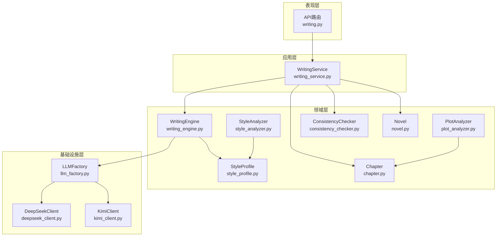
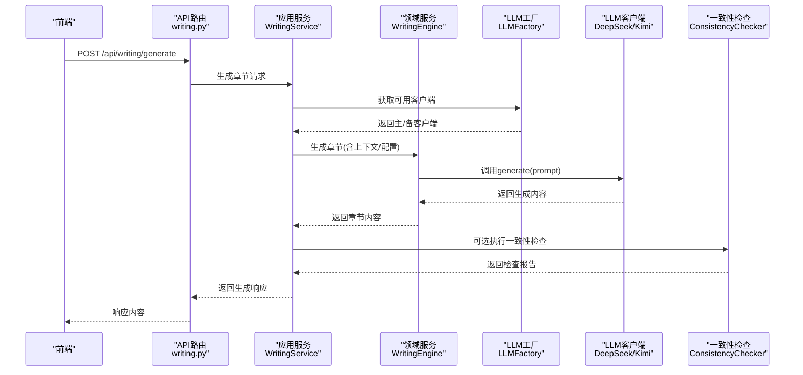
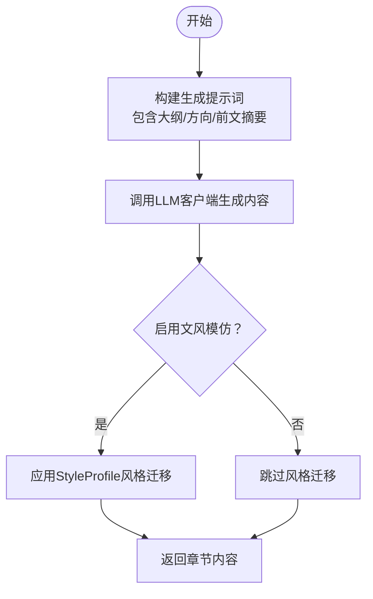
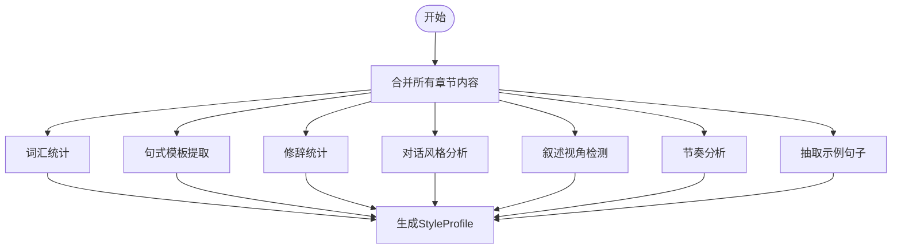
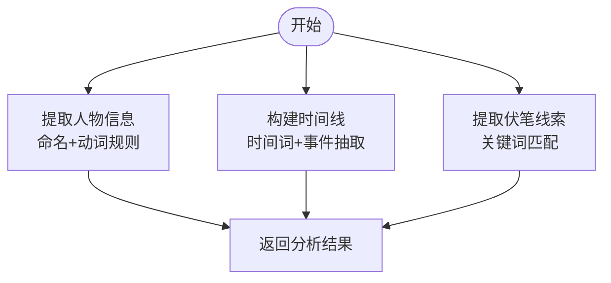
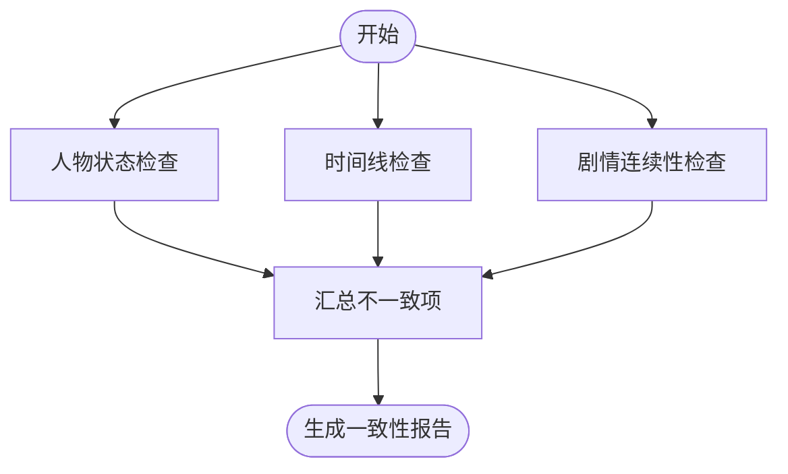
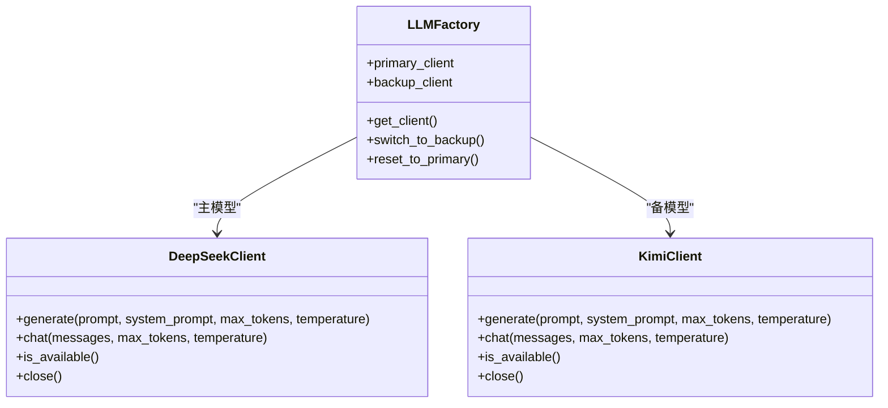
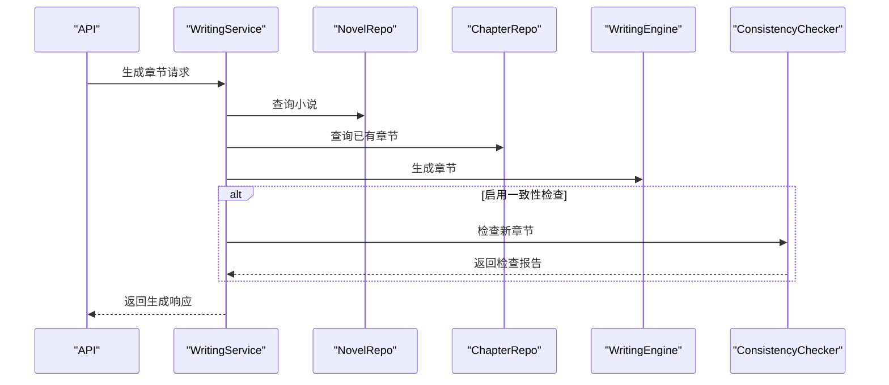
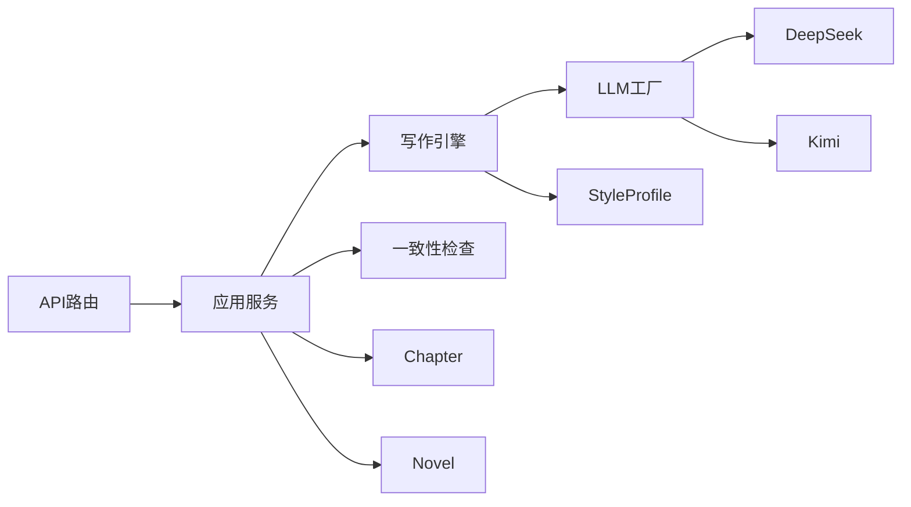

# AI写作引擎

<cite>
**本文引用的文件**
- [README.md](file://README.md)
- [main.py](file://main.py)
- [writing_engine.py](file://domain/services/writing_engine.py)
- [style_analyzer.py](file://domain/services/style_analyzer.py)
- [plot_analyzer.py](file://domain/services/plot_analyzer.py)
- [consistency_checker.py](file://domain/services/consistency_checker.py)
- [llm_factory.py](file://infrastructure/llm/llm_factory.py)
- [deepseek_client.py](file://infrastructure/llm/deepseek_client.py)
- [kimi_client.py](file://infrastructure/llm/kimi_client.py)
- [style_profile.py](file://domain/value_objects/style_profile.py)
- [chapter.py](file://domain/entities/chapter.py)
- [novel.py](file://domain/entities/novel.py)
- [writing.py](file://presentation/api/routers/writing.py)
- [request_dto.py](file://application/dto/request_dto.py)
- [response_dto.py](file://application/dto/response_dto.py)
- [writing_service.py](file://application/services/writing_service.py)
</cite>

## 目录
1. [引言](#引言)
2. [项目结构](#项目结构)
3. [核心组件](#核心组件)
4. [架构总览](#架构总览)
5. [详细组件分析](#详细组件分析)
6. [依赖分析](#依赖分析)
7. [性能考虑](#性能考虑)
8. [故障排查指南](#故障排查指南)
9. [结论](#结论)
10. [附录](#附录)

## 引言
InkTrace AI写作引擎是一个面向中文网络文学的智能续写系统，支持从已有小说原文与大纲出发，完成文风分析、剧情分析、章节生成与一致性检查，并提供主备大模型（DeepSeek/Kimi）自动切换能力。本文面向AI开发者，系统梳理架构设计、关键算法实现与工程实践，帮助快速理解与扩展。

## 项目结构
项目采用分层架构：表现层(Presentation)、应用层(Application)、领域层(Domain)、基础设施层(Infrastructure)。API路由位于表现层，应用服务协调领域服务与基础设施；领域层包含写作引擎、文风/剧情/一致性检查等核心业务服务；基础设施层提供LLM客户端与持久化能力。

图示来源
- [writing.py:37-247](file://presentation/api/routers/writing.py#L37-L247)
- [writing_service.py:30-180](file://application/services/writing_service.py#L30-L180)
- [writing_engine.py:30-184](file://domain/services/writing_engine.py#L30-L184)
- [style_analyzer.py:18-286](file://domain/services/style_analyzer.py#L18-L286)
- [plot_analyzer.py:46-225](file://domain/services/plot_analyzer.py#L46-L225)
- [consistency_checker.py:37-218](file://domain/services/consistency_checker.py#L37-L218)
- [llm_factory.py:31-121](file://infrastructure/llm/llm_factory.py#L31-L121)
- [deepseek_client.py:25-238](file://infrastructure/llm/deepseek_client.py#L25-L238)
- [kimi_client.py:25-244](file://infrastructure/llm/kimi_client.py#L25-L244)
- [style_profile.py:14-30](file://domain/value_objects/style_profile.py#L14-L30)
- [chapter.py:18-109](file://domain/entities/chapter.py#L18-L109)
- [novel.py:20-178](file://domain/entities/novel.py#L20-L178)

章节来源
- [README.md:72-106](file://README.md#L72-L106)
- [main.py:15-22](file://main.py#L15-L22)

## 核心组件
- 写作引擎：负责构建生成提示词、调用LLM生成内容、可选应用文风特征进行风格迁移。
- 文风分析：从词汇、句式、修辞、对话风格、叙述视角、节奏等方面抽取特征，形成StyleProfile。
- 剧情分析：提取人物、时间线事件、伏笔线索，支撑后续剧情规划与一致性检查。
- 一致性检查：验证新章节与人物状态、时间线、剧情连续性的匹配度。
- LLM工厂与客户端：统一管理主备模型（DeepSeek/Kimi），提供可用性探测与自动切换。
- 应用服务：编排流程，协调仓库、引擎与检查器，封装请求/响应DTO。

章节来源
- [writing_engine.py:30-184](file://domain/services/writing_engine.py#L30-L184)
- [style_analyzer.py:18-286](file://domain/services/style_analyzer.py#L18-L286)
- [plot_analyzer.py:46-225](file://domain/services/plot_analyzer.py#L46-L225)
- [consistency_checker.py:37-218](file://domain/services/consistency_checker.py#L37-L218)
- [llm_factory.py:31-121](file://infrastructure/llm/llm_factory.py#L31-L121)
- [writing_service.py:30-180](file://application/services/writing_service.py#L30-L180)

## 架构总览
系统通过FastAPI暴露REST接口，应用服务作为编排者，调用领域服务与基础设施组件完成端到端写作流程。LLM工厂负责选择当前可用客户端，支持主备切换与重试。

图示来源
- [writing.py:107-170](file://presentation/api/routers/writing.py#L107-L170)
- [writing_service.py:91-165](file://application/services/writing_service.py#L91-L165)
- [writing_engine.py:52-80](file://domain/services/writing_engine.py#L52-L80)
- [llm_factory.py:78-95](file://infrastructure/llm/llm_factory.py#L78-L95)
- [deepseek_client.py:78-116](file://infrastructure/llm/deepseek_client.py#L78-L116)
- [kimi_client.py:84-122](file://infrastructure/llm/kimi_client.py#L84-L122)
- [consistency_checker.py:44-87](file://domain/services/consistency_checker.py#L44-L87)

## 详细组件分析

### 写作引擎（WritingEngine）
职责
- 构建章节生成提示词，整合小说信息、大纲摘要、剧情方向、前文摘要等。
- 调用LLM客户端生成内容；若启用文风模仿，则应用StyleProfile进行风格迁移占位。
- 输出章节内容供应用服务落库与一致性检查。

实现要点
- 提示词构建：限定字数、强调文风一致与剧情延续，避免多余说明文字。
- 异步/同步兼容：根据客户端接口自动判断并调用generate。
- 文风应用：当前实现保留接口，便于后续接入风格迁移逻辑。

图示来源
- [writing_engine.py:139-184](file://domain/services/writing_engine.py#L139-L184)
- [writing_engine.py:52-80](file://domain/services/writing_engine.py#L52-L80)

章节来源
- [writing_engine.py:30-184](file://domain/services/writing_engine.py#L30-L184)

### 文风分析（StyleAnalyzer）
职责
- 从多部章节文本中抽取语言特征，形成StyleProfile，用于风格迁移与生成约束。

实现要点
- 词汇统计：高频词、平均词长、词汇丰富度、总词数、独立词数。
- 句式模板：基于逗号分割的句式长度组合模式。
- 修辞统计：比喻、拟人、排比、夸张等出现频次。
- 对话风格：对话长度与语气标记（感叹/疑问）统计。
- 叙述视角：基于“我/他”等代词计数判断第一/第三人称倾向。
- 节奏分析：短句比例衡量快/中/慢节奏。
- 示例句子：抽取若干代表性句子用于风格参考。

图示来源
- [style_analyzer.py:25-66](file://domain/services/style_analyzer.py#L25-L66)
- [style_profile.py:14-30](file://domain/value_objects/style_profile.py#L14-L30)

章节来源
- [style_analyzer.py:18-286](file://domain/services/style_analyzer.py#L18-L286)
- [style_profile.py:14-30](file://domain/value_objects/style_profile.py#L14-L30)

### 剧情分析（PlotAnalyzer）
职责
- 从章节文本中抽取人物、时间线事件与伏笔线索，支撑剧情规划与一致性检查。

实现要点
- 人物提取：基于命名规则与上下文动词识别潜在角色名，统计出场频次与首次出现章节。
- 时间线：识别时间表达式（如“第X天/年”、“今明后昨”等），抽取事件与涉及人物。
- 伏笔：识别“神秘/等待/秘密/暗示/埋下”等关键词，记录章节与状态。

图示来源
- [plot_analyzer.py:55-75](file://domain/services/plot_analyzer.py#L55-L75)

章节来源
- [plot_analyzer.py:46-225](file://domain/services/plot_analyzer.py#L46-L225)

### 一致性检查（ConsistencyChecker）
职责
- 检查新章节与既有内容在人物状态、时间线与剧情连续性方面的一致性。

实现要点
- 人物状态：基于修真境界关键词映射，检查是否存在境界倒退或异常跳级。
- 时间线：比较章节编号与最后事件章节，确保时间推进合理。
- 剧情连续性：与已有章节对比，预留扩展点。
- 伏笔回收：对未回收的伏笔进行追踪与建议。

图示来源
- [consistency_checker.py:44-87](file://domain/services/consistency_checker.py#L44-L87)

章节来源
- [consistency_checker.py:37-218](file://domain/services/consistency_checker.py#L37-L218)

### LLM客户端与工厂（LLMFactory、DeepSeekClient、KimiClient）
职责
- 统一抽象LLM客户端接口，提供主备模型自动切换、可用性探测、重试与连接池优化。

实现要点
- 工厂：维护主/备客户端与当前客户端，优先使用主模型，失败时切换备用模型。
- DeepSeek：支持系统提示、温度与最大Token控制，内置输入截断与重试。
- Kimi：支持多种上下文长度模型，具备相同错误处理与连接池优化。
- 可用性探测：通过一次短文本生成测试客户端健康状态。

图示来源
- [llm_factory.py:31-121](file://infrastructure/llm/llm_factory.py#L31-L121)
- [deepseek_client.py:25-238](file://infrastructure/llm/deepseek_client.py#L25-L238)
- [kimi_client.py:25-244](file://infrastructure/llm/kimi_client.py#L25-L244)

章节来源
- [llm_factory.py:31-121](file://infrastructure/llm/llm_factory.py#L31-L121)
- [deepseek_client.py:25-238](file://infrastructure/llm/deepseek_client.py#L25-L238)
- [kimi_client.py:25-244](file://infrastructure/llm/kimi_client.py#L25-L244)

### 应用服务（WritingService）
职责
- 编排生成流程：读取小说与章节、构建WritingContext与WritingConfig、调用WritingEngine生成内容、可选执行一致性检查并返回响应。

实现要点
- 规划剧情：基于大纲与请求参数生成剧情节点。
- 生成章节：拼装上下文、调用引擎、保存章节、可选一致性检查。
- 文风缓存：按小说维度缓存StyleProfile，避免重复分析。

图示来源
- [writing_service.py:91-165](file://application/services/writing_service.py#L91-L165)

章节来源
- [writing_service.py:30-180](file://application/services/writing_service.py#L30-L180)

### API路由与DTO
职责
- 提供REST接口：剧情规划、章节生成、续写工具等。
- DTO定义：请求/响应的数据结构与字段约束。

实现要点
- 路由：/api/writing/plan、/api/writing/generate、/api/writing/continue。
- Agent灰度：支持按trace_id哈希分流至Agent链路或传统流程。
- DTO：GenerateChapterRequest/PlanPlotRequest等，包含目标字数、选项开关等。

章节来源
- [writing.py:37-247](file://presentation/api/routers/writing.py#L37-L247)
- [request_dto.py:45-71](file://application/dto/request_dto.py#L45-L71)
- [response_dto.py:86-200](file://application/dto/response_dto.py#L86-L200)

## 依赖分析
- 表现层依赖应用服务；应用服务依赖领域服务与基础设施；领域服务依赖值对象与实体。
- LLM工厂解耦应用服务与具体客户端，便于扩展与替换。
- 写作引擎依赖StyleProfile与LLM客户端；一致性检查依赖章节与人物/时间线数据。
- API路由通过依赖注入获取仓库与服务实例，降低耦合。

图示来源
- [writing.py:37-247](file://presentation/api/routers/writing.py#L37-L247)
- [writing_service.py:30-180](file://application/services/writing_service.py#L30-L180)
- [writing_engine.py:30-184](file://domain/services/writing_engine.py#L30-L184)
- [llm_factory.py:31-121](file://infrastructure/llm/llm_factory.py#L31-L121)

章节来源
- [writing.py:37-247](file://presentation/api/routers/writing.py#L37-L247)
- [writing_service.py:30-180](file://application/services/writing_service.py#L30-L180)

## 性能考虑
- LLM调用优化
  - 连接池与复用：客户端使用httpx.AsyncClient复用连接，限制最大连接数与保活连接数，降低握手开销。
  - 超时与重试：统一超时与最大重试次数，避免长时间阻塞。
  - 输入截断：按字符上限截断提示词，防止Token超限。
- 文风/剧情分析
  - 采样与阈值：对句式、对话、时间线等采用上限与比例阈值，避免过度计算。
  - 缓存：按小说维度缓存StyleProfile，减少重复分析。
- 一致性检查
  - 关键词映射与正则匹配：使用预编译或有限匹配集，避免复杂正则导致的回溯。
- 并发与异步
  - LLM客户端采用异步接口，写作引擎在调用时根据接口类型自动适配，提升吞吐。

章节来源
- [deepseek_client.py:60-64](file://infrastructure/llm/deepseek_client.py#L60-L64)
- [kimi_client.py:60-64](file://infrastructure/llm/kimi_client.py#L60-L64)
- [writing_engine.py:69-76](file://domain/services/writing_engine.py#L69-L76)
- [writing_service.py:167-179](file://application/services/writing_service.py#L167-L179)

## 故障排查指南
常见问题与定位
- LLM密钥/限流/网络错误
  - DeepSeek/Kimi客户端在401、429、5xx等状态码下抛出特定异常；检查环境变量与网络连通性。
- 客户端不可用
  - 通过is_available进行健康探测；若失败，工厂会切换到备用模型。
- 生成内容为空或异常
  - 检查提示词长度与截断逻辑；确认目标字数与温度参数设置。
- 一致性检查告警
  - 关注人物境界倒退、时间线倒退等高/严重级别不一致项；根据建议调整剧情或状态。

章节来源
- [deepseek_client.py:163-193](file://infrastructure/llm/deepseek_client.py#L163-L193)
- [kimi_client.py:169-199](file://infrastructure/llm/kimi_client.py#L169-L199)
- [llm_factory.py:78-95](file://infrastructure/llm/llm_factory.py#L78-L95)
- [consistency_checker.py:130-140](file://domain/services/consistency_checker.py#L130-L140)

## 结论
InkTrace AI写作引擎以清晰的分层架构与可插拔的LLM客户端设计，实现了从文风分析、剧情分析到章节生成与一致性检查的完整闭环。通过主备模型自动切换与连接池优化，兼顾稳定性与性能。建议在后续迭代中完善风格迁移与RAG检索增强的具体实现，并扩展一致性检查的覆盖维度。

## 附录
- 快速启动与环境变量
  - 后端：FastAPI + Uvicorn；前端：Vue3 + Vite。
  - 环境变量：INKTRACE_HOST、INKTRACE_PORT、INKTRACE_DEBUG、DEEPSEEK_API_KEY、KIMI_API_KEY。
- API接口概览
  - /api/writing/plan：剧情规划
  - /api/writing/generate：章节生成
  - /api/writing/continue：续写工具

章节来源
- [README.md:23-69](file://README.md#L23-L69)
- [main.py:15-22](file://main.py#L15-L22)
- [writing.py:144-154](file://presentation/api/routers/writing.py#L144-L154)