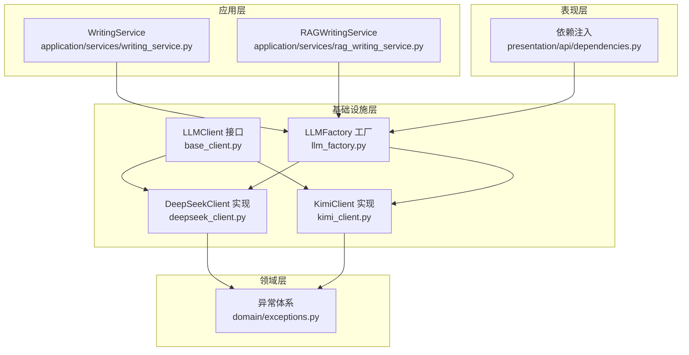
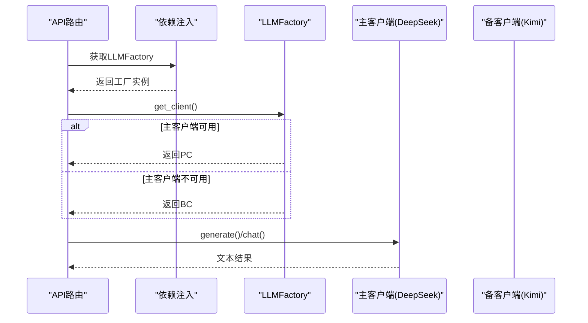
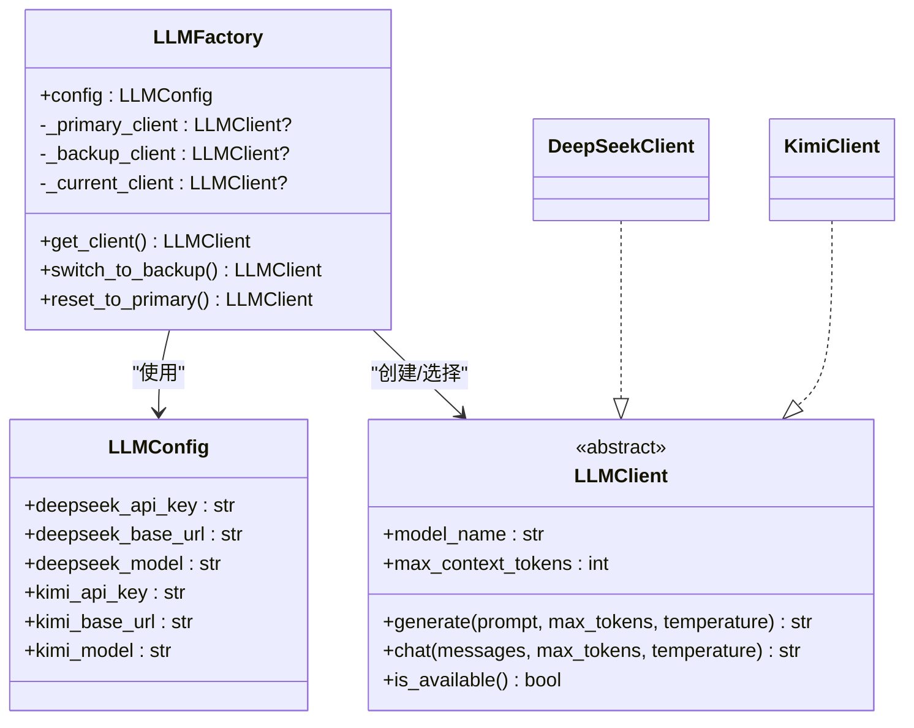
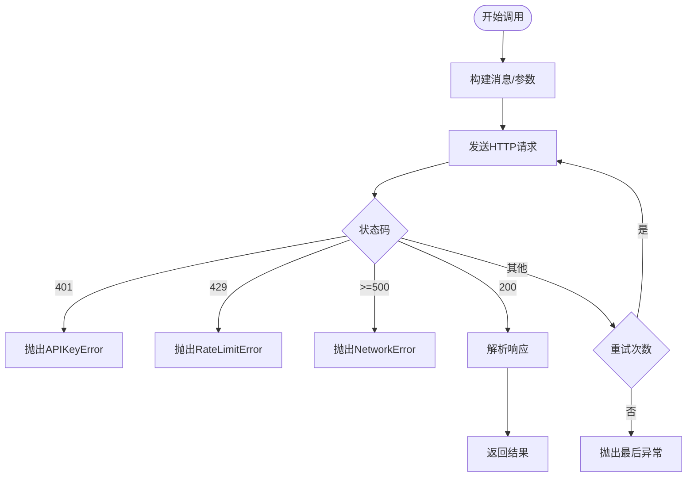
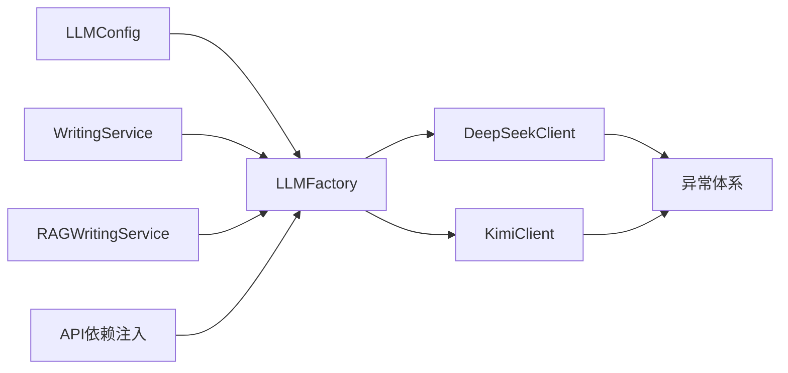

# LLM集成架构

<cite>
**本文引用的文件**
- [base_client.py](file://infrastructure/llm/base_client.py)
- [deepseek_client.py](file://infrastructure/llm/deepseek_client.py)
- [kimi_client.py](file://infrastructure/llm/kimi_client.py)
- [llm_factory.py](file://infrastructure/llm/llm_factory.py)
- [exceptions.py](file://domain/exceptions.py)
- [dependencies.py](file://presentation/api/dependencies.py)
- [writing_service.py](file://application/services/writing_service.py)
- [rag_writing_service.py](file://application/services/rag_writing_service.py)
- [test_llm_client.py](file://tests/unit/test_llm_client.py)
- [test_llm_client_improved.py](file://tests/unit/test_llm_client_improved.py)
</cite>

## 目录
1. [简介](#简介)
2. [项目结构](#项目结构)
3. [核心组件](#核心组件)
4. [架构总览](#架构总览)
5. [组件详解](#组件详解)
6. [依赖关系分析](#依赖关系分析)
7. [性能考量](#性能考量)
8. [故障排查指南](#故障排查指南)
9. [结论](#结论)
10. [附录](#附录)

## 简介
本技术文档面向InkTrace项目的LLM集成架构，重点阐述统一抽象设计与工厂模式实现，包括：
- BaseClient基类的接口规范与职责边界
- DeepSeekClient与KimiClient的具体实现差异与参数适配
- LLMFactory的动态选择机制与主备切换策略
- 异步调用模式、并发控制与资源管理
- 错误处理与重试机制
- 性能优化策略（连接池、批处理、缓存）
- 实际使用示例与最佳实践

## 项目结构
LLM相关代码位于基础设施层的llm子包中，采用“接口+多实现+工厂”的分层设计，配合领域异常与应用服务层的集成，形成清晰的职责划分。

图表来源
- [base_client.py:14-82](file://infrastructure/llm/base_client.py#L14-L82)
- [deepseek_client.py:25-237](file://infrastructure/llm/deepseek_client.py#L25-L237)
- [kimi_client.py:25-243](file://infrastructure/llm/kimi_client.py#L25-L243)
- [llm_factory.py:31-120](file://infrastructure/llm/llm_factory.py#L31-L120)
- [exceptions.py:51-99](file://domain/exceptions.py#L51-L99)
- [dependencies.py:103-109](file://presentation/api/dependencies.py#L103-L109)
- [writing_service.py:27-46](file://application/services/writing_service.py#L27-L46)
- [rag_writing_service.py:16-40](file://application/services/rag_writing_service.py#L16-L40)

章节来源
- [base_client.py:14-82](file://infrastructure/llm/base_client.py#L14-L82)
- [llm_factory.py:31-120](file://infrastructure/llm/llm_factory.py#L31-L120)

## 核心组件
- LLMClient 抽象接口：定义generate/chat等异步方法与属性，确保所有LLM实现遵循统一契约。
- DeepSeekClient/KimiClient：具体实现，封装各自API调用、参数适配、响应解析与错误映射。
- LLMFactory：工厂类，负责按配置选择主备客户端并支持运行时切换。
- 异常体系：统一的LLM客户端异常类型，便于上层捕获与处理。
- 应用服务集成：通过依赖注入在服务层使用LLMFactory获取客户端实例。

章节来源
- [base_client.py:14-82](file://infrastructure/llm/base_client.py#L14-L82)
- [deepseek_client.py:25-237](file://infrastructure/llm/deepseek_client.py#L25-L237)
- [kimi_client.py:25-243](file://infrastructure/llm/kimi_client.py#L25-L243)
- [llm_factory.py:31-120](file://infrastructure/llm/llm_factory.py#L31-L120)
- [exceptions.py:51-99](file://domain/exceptions.py#L51-L99)

## 架构总览
下图展示了从API依赖注入到应用服务调用LLM客户端的整体流程，以及工厂的主备选择逻辑。

图表来源
- [dependencies.py:103-109](file://presentation/api/dependencies.py#L103-L109)
- [llm_factory.py:78-95](file://infrastructure/llm/llm_factory.py#L78-L95)
- [deepseek_client.py:78-193](file://infrastructure/llm/deepseek_client.py#L78-L193)
- [kimi_client.py:84-199](file://infrastructure/llm/kimi_client.py#L84-L199)

## 组件详解

### BaseClient 抽象接口
- 职责：定义统一的异步生成与对话接口，以及模型属性（名称、上下文上限）与可用性检测。
- 关键点：
  - generate(prompt, max_tokens, temperature)：单轮提示生成。
  - chat(messages, max_tokens, temperature)：多轮对话生成。
  - model_name/max_context_tokens：模型元数据。
  - is_available：健康检查。

章节来源
- [base_client.py:14-82](file://infrastructure/llm/base_client.py#L14-L82)

### DeepSeekClient 实现
- 设计要点：
  - 使用httpx.AsyncClient建立连接池，支持复用与并发。
  - 参数适配：支持system_prompt拼装为messages；max_tokens/temperature透传。
  - 错误映射：401/APIKeyError、429/RateLimitError、5xx/NetworkError、其他/LLMClientError。
  - 输入截断：防止过长输入导致Token超限。
  - 资源管理：异步上下文管理器自动关闭连接。
- 并发与性能：
  - 连接池限制：最大连接数与保活连接数。
  - 超时控制：统一timeout参数。
  - 重试机制：max_retries次重试，记录最后一次错误。

章节来源
- [deepseek_client.py:25-237](file://infrastructure/llm/deepseek_client.py#L25-L237)

### KimiClient 实现
- 设计要点：
  - 与DeepSeekClient一致的接口与错误映射策略。
  - 上下文上限根据模型后缀动态判定（8k/32k/128k）。
  - 同样具备连接池、超时、重试与输入截断能力。
- 差异化处理：
  - 不同的默认base_url与model。
  - max_context_tokens按模型规格返回。

章节来源
- [kimi_client.py:25-243](file://infrastructure/llm/kimi_client.py#L25-L243)

### LLMFactory 工厂类
- 配置驱动：通过LLMConfig读取各提供商的API Key、Base URL与Model。
- 动态选择：
  - get_client：优先使用主客户端，若不可用则回退备客户端。
  - 主备切换：switch_to_backup/reset_to_primary支持手动切换。
- 单例化：延迟创建主/备客户端，避免不必要的初始化开销。

图表来源
- [llm_factory.py:19-120](file://infrastructure/llm/llm_factory.py#L19-L120)
- [base_client.py:14-82](file://infrastructure/llm/base_client.py#L14-L82)
- [deepseek_client.py:25-237](file://infrastructure/llm/deepseek_client.py#L25-L237)
- [kimi_client.py:25-243](file://infrastructure/llm/kimi_client.py#L25-L243)

章节来源
- [llm_factory.py:31-120](file://infrastructure/llm/llm_factory.py#L31-L120)

### 异步调用与并发控制
- 异步接口：generate/chat均为async def，适合高并发场景。
- 连接池：httpx.AsyncClient复用TCP连接，降低握手开销。
- 并发策略：
  - 由调用方控制并发度（例如应用服务中批量任务的调度）。
  - 工厂与客户端内部不强制并发上限，避免耦合业务并发需求。
- 资源管理：异步上下文管理器确保连接及时释放。

章节来源
- [deepseek_client.py:60-64](file://infrastructure/llm/deepseek_client.py#L60-L64)
- [kimi_client.py:60-64](file://infrastructure/llm/kimi_client.py#L60-L64)
- [deepseek_client.py:229-237](file://infrastructure/llm/deepseek_client.py#L229-L237)
- [kimi_client.py:235-243](file://infrastructure/llm/kimi_client.py#L235-L243)

### 错误处理与重试机制
- 异常体系：APIKeyError、RateLimitError、NetworkError、TokenLimitError、LLMClientError。
- 错误映射：
  - 401 → APIKeyError
  - 429 → RateLimitError（可携带retry-after）
  - 5xx → NetworkError
  - 其他 → LLMClientError
- 重试策略：max_retries次重试，记录最后一次异常，最终抛出。
- 健康检查：is_available通过一次短提示测试可用性。

图表来源
- [deepseek_client.py:155-193](file://infrastructure/llm/deepseek_client.py#L155-L193)
- [kimi_client.py:161-199](file://infrastructure/llm/kimi_client.py#L161-L199)
- [exceptions.py:58-99](file://domain/exceptions.py#L58-L99)

章节来源
- [deepseek_client.py:155-193](file://infrastructure/llm/deepseek_client.py#L155-L193)
- [kimi_client.py:161-199](file://infrastructure/llm/kimi_client.py#L161-L199)
- [exceptions.py:58-99](file://domain/exceptions.py#L58-L99)

### 使用示例与最佳实践
- 初始化与依赖注入：
  - 在API层通过依赖注入获取LLMFactory，并将其注入到应用服务。
  - 示例路径：[依赖注入:103-109](file://presentation/api/dependencies.py#L103-L109)
- 应用服务调用：
  - 写作服务直接使用工厂的primary_client进行剧情规划与章节生成。
  - 示例路径：[写作服务:69-72](file://application/services/writing_service.py#L69-L72)
  - RAG续写服务通过工厂获取客户端并调用generate。
  - 示例路径：[RAG续写服务:70-71](file://application/services/rag_writing_service.py#L70-L71)
- 资源管理：
  - 客户端实现异步上下文管理器，可在with语句中自动关闭连接。
  - 示例路径：[DeepSeek上下文管理器:229-237](file://infrastructure/llm/deepseek_client.py#L229-L237)、[Kimi上下文管理器:235-243](file://infrastructure/llm/kimi_client.py#L235-L243)

章节来源
- [dependencies.py:103-109](file://presentation/api/dependencies.py#L103-L109)
- [writing_service.py:69-72](file://application/services/writing_service.py#L69-L72)
- [rag_writing_service.py:70-71](file://application/services/rag_writing_service.py#L70-L71)
- [deepseek_client.py:229-237](file://infrastructure/llm/deepseek_client.py#L229-L237)
- [kimi_client.py:235-243](file://infrastructure/llm/kimi_client.py#L235-L243)

## 依赖关系分析
- LLMFactory依赖LLMConfig与具体实现类（DeepSeekClient/KimiClient），对外暴露统一接口。
- 客户端实现依赖异常体系，向上抛出标准化异常。
- 应用服务通过依赖注入获取LLMFactory，解耦具体提供商。
- API层负责环境变量读取与工厂实例化，保证配置驱动。

图表来源
- [llm_factory.py:19-120](file://infrastructure/llm/llm_factory.py#L19-L120)
- [exceptions.py:51-99](file://domain/exceptions.py#L51-L99)
- [writing_service.py:27-46](file://application/services/writing_service.py#L27-L46)
- [rag_writing_service.py:16-40](file://application/services/rag_writing_service.py#L16-L40)
- [dependencies.py:103-109](file://presentation/api/dependencies.py#L103-L109)

章节来源
- [llm_factory.py:19-120](file://infrastructure/llm/llm_factory.py#L19-L120)
- [exceptions.py:51-99](file://domain/exceptions.py#L51-L99)
- [writing_service.py:27-46](file://application/services/writing_service.py#L27-L46)
- [rag_writing_service.py:16-40](file://application/services/rag_writing_service.py#L16-L40)
- [dependencies.py:103-109](file://presentation/api/dependencies.py#L103-L109)

## 性能考量
- 连接池管理
  - httpx.AsyncClient复用连接，减少TCP握手与TLS开销。
  - 通过Limits限制最大连接数与保活连接数，平衡内存占用与吞吐。
- 超时与重试
  - 统一timeout参数，避免请求悬挂。
  - max_retries提升稳定性，结合日志定位问题。
- 输入截断
  - 防止过长输入导致Token超限或API拒绝。
- 缓存与批处理
  - 建议在应用层对重复Prompt进行缓存（LRU）。
  - 批量任务可通过外部队列或并发控制器协调，避免瞬时峰值。
- 上下文上限
  - 根据模型max_context_tokens合理裁剪历史消息，避免超出限制。

章节来源
- [deepseek_client.py:60-64](file://infrastructure/llm/deepseek_client.py#L60-L64)
- [kimi_client.py:60-64](file://infrastructure/llm/kimi_client.py#L60-L64)
- [deepseek_client.py:195-211](file://infrastructure/llm/deepseek_client.py#L195-L211)
- [kimi_client.py:201-217](file://infrastructure/llm/kimi_client.py#L201-L217)

## 故障排查指南
- 常见异常与定位
  - APIKeyError：检查环境变量与密钥有效性。
  - RateLimitError：关注retry-after头，适当退避重试。
  - NetworkError：检查网络连通性与代理设置。
  - LLMClientError：查看原始错误信息与日志。
- 健康检查
  - 使用is_available进行快速自检，辅助主备切换。
- 单元测试参考
  - 测试覆盖了客户端初始化、上下文上限、错误映射与资源清理。
  - 示例路径：[基础测试:40-117](file://tests/unit/test_llm_client.py#L40-L117)、[改进测试:25-224](file://tests/unit/test_llm_client_improved.py#L25-L224)

章节来源
- [exceptions.py:58-99](file://domain/exceptions.py#L58-L99)
- [deepseek_client.py:213-220](file://infrastructure/llm/deepseek_client.py#L213-L220)
- [kimi_client.py:219-226](file://infrastructure/llm/kimi_client.py#L219-L226)
- [test_llm_client.py:40-117](file://tests/unit/test_llm_client.py#L40-L117)
- [test_llm_client_improved.py:25-224](file://tests/unit/test_llm_client_improved.py#L25-L224)

## 结论
该LLM集成架构通过统一抽象、工厂模式与标准化异常，实现了对多家大模型提供商的无缝接入与灵活切换。客户端实现具备完善的错误处理、重试与资源管理能力，配合应用层的依赖注入与服务编排，满足了InkTrace在写作与RAG场景下的高性能与高可用需求。建议在生产环境中结合缓存与批处理策略进一步优化整体吞吐与延迟。

## 附录
- 关键实现路径索引
  - [LLMClient接口:14-82](file://infrastructure/llm/base_client.py#L14-L82)
  - [DeepSeekClient实现:25-237](file://infrastructure/llm/deepseek_client.py#L25-L237)
  - [KimiClient实现:25-243](file://infrastructure/llm/kimi_client.py#L25-L243)
  - [LLMFactory工厂:31-120](file://infrastructure/llm/llm_factory.py#L31-L120)
  - [异常体系:51-99](file://domain/exceptions.py#L51-L99)
  - [API依赖注入:103-109](file://presentation/api/dependencies.py#L103-L109)
  - [写作服务:69-72](file://application/services/writing_service.py#L69-L72)
  - [RAG续写服务:70-71](file://application/services/rag_writing_service.py#L70-L71)
  - [单元测试-基础:40-117](file://tests/unit/test_llm_client.py#L40-L117)
  - [单元测试-改进:25-224](file://tests/unit/test_llm_client_improved.py#L25-L224)