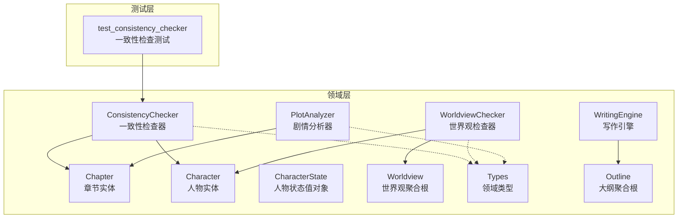
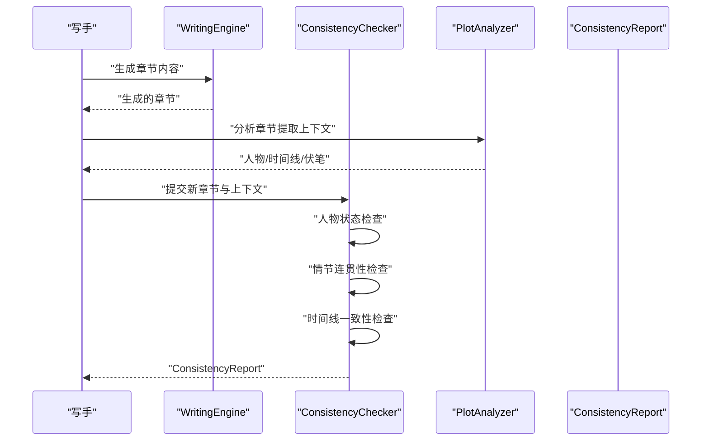
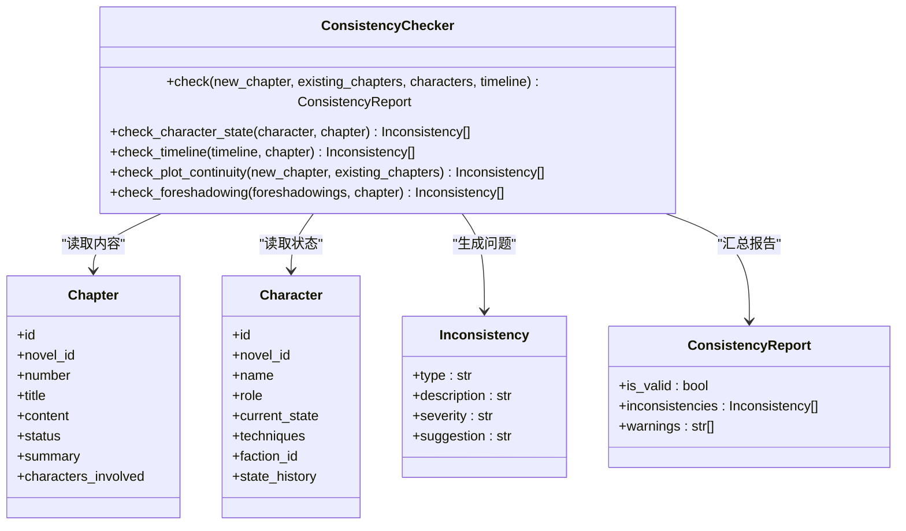
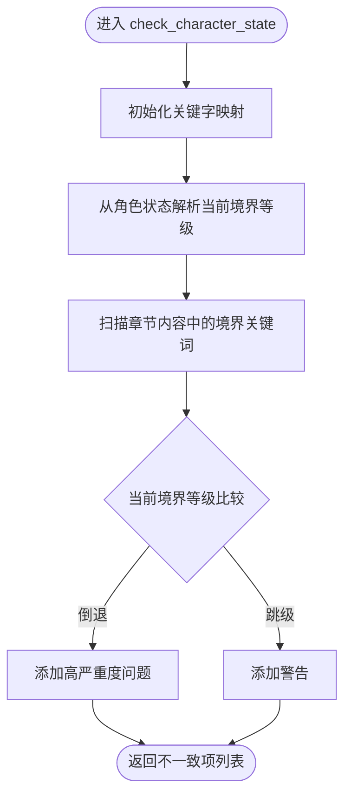
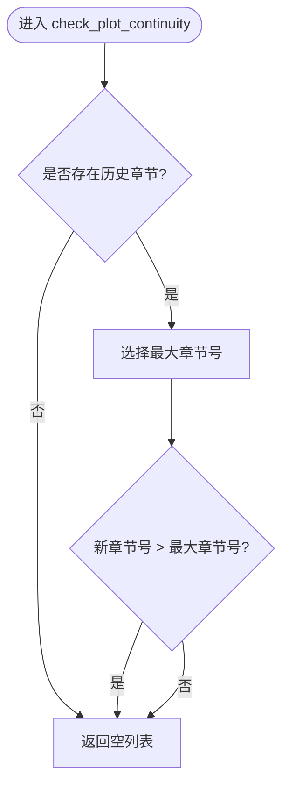
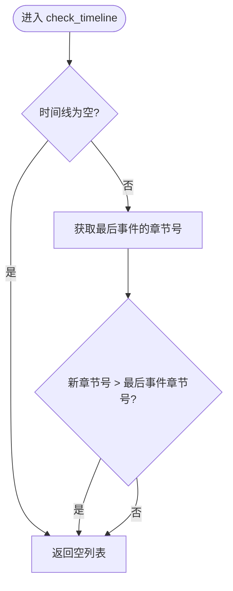
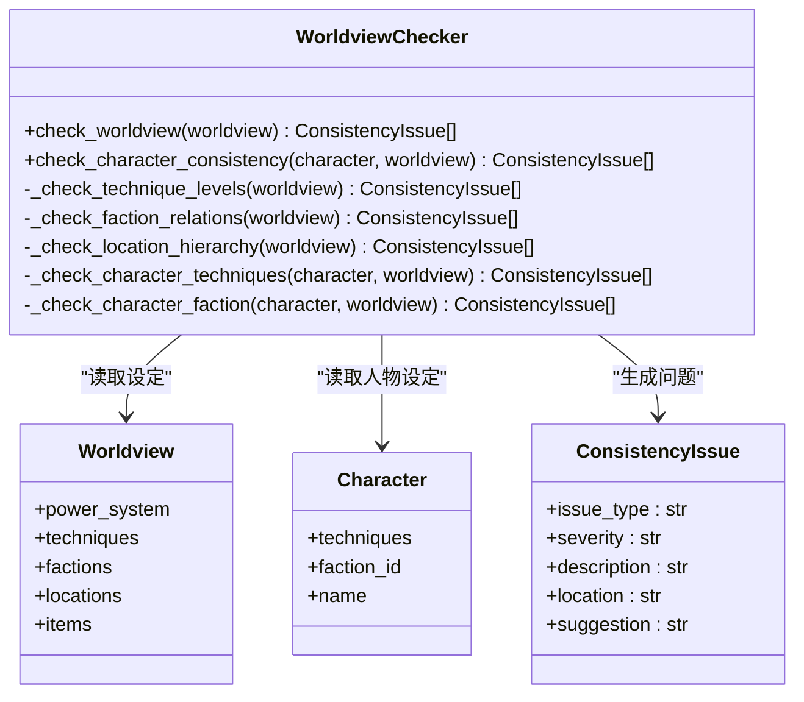
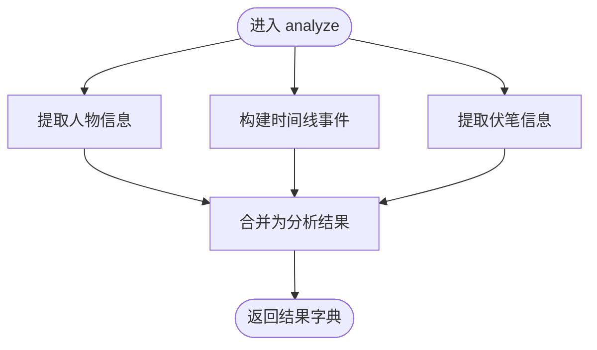
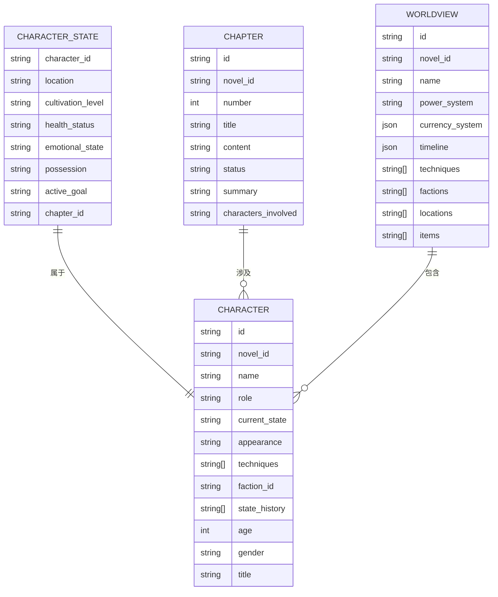
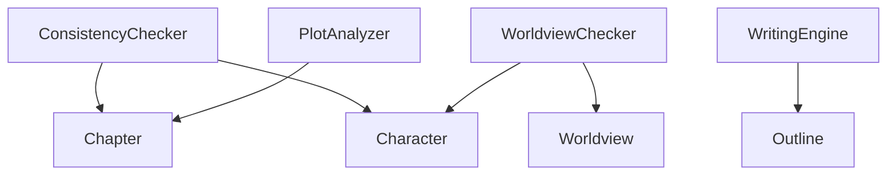

# 一致性检查系统

<cite>
**本文档引用的文件**
- [consistency_checker.py](file://domain/services/consistency_checker.py)
- [character_state.py](file://domain/value_objects/character_state.py)
- [worldview_checker.py](file://domain/services/worldview_checker.py)
- [plot_analyzer.py](file://domain/services/plot_analyzer.py)
- [character.py](file://domain/entities/character.py)
- [chapter.py](file://domain/entities/chapter.py)
- [worldview.py](file://domain/entities/worldview.py)
- [types.py](file://domain/types.py)
- [outline.py](file://domain/entities/outline.py)
- [writing_engine.py](file://domain/services/writing_engine.py)
- [test_consistency_checker.py](file://tests/unit/test_consistency_checker.py)
</cite>

## 目录
1. [简介](#简介)
2. [项目结构](#项目结构)
3. [核心组件](#核心组件)
4. [架构总览](#架构总览)
5. [详细组件分析](#详细组件分析)
6. [依赖关系分析](#依赖关系分析)
7. [性能考虑](#性能考虑)
8. [故障排除指南](#故障排除指南)
9. [结论](#结论)
10. [附录](#附录)

## 简介
本文件为 InkTrace 一致性检查系统的全面技术文档，聚焦于以下目标：
- 设计架构与职责边界：ConsistencyChecker 的整体设计、数据流与控制流
- 检查算法详解：人物状态一致性、情节连贯性、世界观完整性
- 规则配置与扩展：如何通过数据结构与方法扩展检查规则
- 完整流程示例：从数据收集到规则匹配再到问题报告
- 结果处理与反馈：检查结果的组织、严重级别与改进建议

本系统采用领域驱动设计（DDD），将一致性检查拆分为三个维度：
- 人物状态一致性：基于角色当前状态与章节内容的匹配
- 情节连贯性：基于已有章节的时间顺序与事件连续性
- 世界观完整性：基于设定规则与实体关系的验证

## 项目结构
一致性检查系统主要位于 domain 层的服务与实体模块中，配合测试用例与工具类共同构成完整的检查流水线。

**图表来源**
- [consistency_checker.py:37-87](file://domain/services/consistency_checker.py#L37-L87)
- [worldview_checker.py:29-40](file://domain/services/worldview_checker.py#L29-L40)
- [plot_analyzer.py:46-75](file://domain/services/plot_analyzer.py#L46-L75)
- [character.py:64-99](file://domain/entities/character.py#L64-L99)
- [chapter.py:18-37](file://domain/entities/chapter.py#L18-L37)
- [character_state.py:16-33](file://domain/value_objects/character_state.py#L16-L33)
- [worldview.py:44-61](file://domain/entities/worldview.py#L44-L61)
- [types.py:109-116](file://domain/types.py#L109-L116)
- [outline.py:66-84](file://domain/entities/outline.py#L66-L84)
- [writing_engine.py:30-51](file://domain/services/writing_engine.py#L30-L51)
- [test_consistency_checker.py:19-27](file://tests/unit/test_consistency_checker.py#L19-L27)

**章节来源**
- [consistency_checker.py:1-218](file://domain/services/consistency_checker.py#L1-L218)
- [worldview_checker.py:1-161](file://domain/services/worldview_checker.py#L1-L161)
- [plot_analyzer.py:1-225](file://domain/services/plot_analyzer.py#L1-L225)
- [character.py:1-273](file://domain/entities/character.py#L1-L273)
- [chapter.py:1-109](file://domain/entities/chapter.py#L1-L109)
- [character_state.py:1-33](file://domain/value_objects/character_state.py#L1-L33)
- [worldview.py:1-154](file://domain/entities/worldview.py#L1-L154)
- [types.py:1-284](file://domain/types.py#L1-L284)
- [outline.py:1-257](file://domain/entities/outline.py#L1-L257)
- [writing_engine.py:1-184](file://domain/services/writing_engine.py#L1-L184)
- [test_consistency_checker.py:1-153](file://tests/unit/test_consistency_checker.py#L1-L153)

## 核心组件
- ConsistencyChecker：统一入口，协调人物状态、情节连贯性与时间线检查，并输出统一的检查报告
- WorldviewChecker：面向世界观的完整性检查，覆盖功法等级、势力关系、地点层级与人物设定一致性
- PlotAnalyzer：从章节内容中抽取人物、时间线事件与伏笔，为一致性检查提供上下文
- Character/Chapter/Worldview 实体：承载数据与行为，支撑检查算法的数据源
- Types：统一的领域类型定义，保证 ID 一致性与枚举规范
- WritingEngine：与一致性检查协同，提供生成内容的上下文与风格约束

**章节来源**
- [consistency_checker.py:37-87](file://domain/services/consistency_checker.py#L37-L87)
- [worldview_checker.py:29-40](file://domain/services/worldview_checker.py#L29-L40)
- [plot_analyzer.py:46-75](file://domain/services/plot_analyzer.py#L46-L75)
- [character.py:64-99](file://domain/entities/character.py#L64-L99)
- [chapter.py:18-37](file://domain/entities/chapter.py#L18-L37)
- [worldview.py:44-61](file://domain/entities/worldview.py#L44-L61)
- [types.py:109-116](file://domain/types.py#L109-L116)
- [writing_engine.py:30-51](file://domain/services/writing_engine.py#L30-L51)

## 架构总览
一致性检查系统采用“服务编排 + 实体驱动”的架构模式：
- 服务层负责组合检查策略与规则匹配
- 实体层提供稳定的领域数据模型
- 类型层确保跨模块的强类型约束
- 测试层验证核心算法与边界条件

**图表来源**
- [writing_engine.py:52-80](file://domain/services/writing_engine.py#L52-L80)
- [plot_analyzer.py:55-75](file://domain/services/plot_analyzer.py#L55-L75)
- [consistency_checker.py:44-87](file://domain/services/consistency_checker.py#L44-L87)

## 详细组件分析

### ConsistencyChecker 组件分析
ConsistencyChecker 是一致性检查的统一入口，负责：
- 接收新章节与历史章节、人物、时间线等上下文
- 调用子检查器执行具体检查
- 汇总不一致项与警告，形成统一报告

**图表来源**
- [consistency_checker.py:18-87](file://domain/services/consistency_checker.py#L18-L87)
- [chapter.py:18-37](file://domain/entities/chapter.py#L18-L37)
- [character.py:64-99](file://domain/entities/character.py#L64-L99)

**章节来源**
- [consistency_checker.py:37-218](file://domain/services/consistency_checker.py#L37-L218)
- [test_consistency_checker.py:19-153](file://tests/unit/test_consistency_checker.py#L19-L153)

#### 人物状态一致性检查
- 关键点：通过正则匹配章节内容中的境界关键词，与角色当前状态进行比较
- 规则：不允许境界倒退；对跳级提升给出警告
- 数据来源：角色 current_state 与章节 content

**图表来源**
- [consistency_checker.py:89-140](file://domain/services/consistency_checker.py#L89-L140)

**章节来源**
- [consistency_checker.py:89-140](file://domain/services/consistency_checker.py#L89-L140)
- [character.py:143-150](file://domain/entities/character.py#L143-L150)

#### 情节连贯性分析
- 关键点：基于章节序号判断新章节是否按顺序生成
- 当前实现：仅检查章节号递增，未实现复杂因果/冲突检测
- 建议扩展：引入 PlotAnalyzer 的时间线与事件图谱，进行更精细的逻辑验证

**图表来源**
- [consistency_checker.py:172-196](file://domain/services/consistency_checker.py#L172-L196)

**章节来源**
- [consistency_checker.py:172-196](file://domain/services/consistency_checker.py#L172-L196)

#### 时间线一致性检查
- 关键点：基于传入的时间线事件列表，检查新章节与时间线的衔接
- 当前实现：检查章节号与最后事件的对应关系，逻辑尚需完善
- 建议扩展：结合 PlotAnalyzer 的时间线事件，进行更细粒度的时序与因果验证

**图表来源**
- [consistency_checker.py:142-170](file://domain/services/consistency_checker.py#L142-L170)

**章节来源**
- [consistency_checker.py:142-170](file://domain/services/consistency_checker.py#L142-L170)

#### 伏笔回收检查
- 关键点：基于 PlotAnalyzer 提取的伏笔列表，检查章节中是否有对应回收
- 当前实现：预留接口，尚未实现具体逻辑
- 建议扩展：结合章节内容与伏笔描述，使用相似度或关键词匹配进行回收判定

**章节来源**
- [consistency_checker.py:198-217](file://domain/services/consistency_checker.py#L198-L217)
- [plot_analyzer.py:170-202](file://domain/services/plot_analyzer.py#L170-L202)

### WorldviewChecker 组件分析
WorldviewChecker 负责从设定层面验证内容一致性，涵盖：
- 功法等级一致性：功法等级必须属于力量体系的有效等级
- 势力关系一致性：势力关系的目标必须存在于势力集合中
- 地点层级一致性：地点的父级必须存在于地点集合中
- 人物设定一致性：人物拥有的功法与所属势力必须存在于世界观中

**图表来源**
- [worldview_checker.py:19-40](file://domain/services/worldview_checker.py#L19-L40)
- [worldview.py:44-61](file://domain/entities/worldview.py#L44-L61)
- [character.py:90-99](file://domain/entities/character.py#L90-L99)

**章节来源**
- [worldview_checker.py:29-161](file://domain/services/worldview_checker.py#L29-L161)
- [worldview.py:44-154](file://domain/entities/worldview.py#L44-L154)
- [character.py:90-99](file://domain/entities/character.py#L90-L99)

### PlotAnalyzer 组件分析
PlotAnalyzer 从章节内容中抽取三类关键信息，为一致性检查提供上下文：
- 人物：基于命名模式提取出现频率高的人名
- 时间线事件：基于时间表达式抽取事件片段
- 伏笔：基于关键词抽取潜在伏笔描述

**图表来源**
- [plot_analyzer.py:55-75](file://domain/services/plot_analyzer.py#L55-L75)

**章节来源**
- [plot_analyzer.py:46-225](file://domain/services/plot_analyzer.py#L46-L225)

### 数据模型与类型
- CharacterState：人物状态值对象，记录人物在特定章节的状态快照
- Chapter/Character/Worldview：核心实体，承载状态与关系
- Types：统一的 ID 与枚举类型，确保跨模块一致性

**图表来源**
- [character_state.py:16-33](file://domain/value_objects/character_state.py#L16-L33)
- [chapter.py:18-37](file://domain/entities/chapter.py#L18-L37)
- [character.py:64-99](file://domain/entities/character.py#L64-L99)
- [worldview.py:44-61](file://domain/entities/worldview.py#L44-L61)

**章节来源**
- [character_state.py:16-33](file://domain/value_objects/character_state.py#L16-L33)
- [chapter.py:18-37](file://domain/entities/chapter.py#L18-L37)
- [character.py:64-99](file://domain/entities/character.py#L64-L99)
- [worldview.py:44-61](file://domain/entities/worldview.py#L44-L61)
- [types.py:109-116](file://domain/types.py#L109-L116)

## 依赖关系分析
- ConsistencyChecker 依赖 Chapter 与 Character 实体，用于状态与内容比对
- WorldviewChecker 依赖 Worldview 与 Character 实体，用于设定与人物一致性验证
- PlotAnalyzer 依赖 Chapter 实体，用于从内容中抽取上下文
- WritingEngine 与 Outline 协同，为一致性检查提供生成内容与剧情规划的上下文

**图表来源**
- [consistency_checker.py:14-15](file://domain/services/consistency_checker.py#L14-L15)
- [worldview_checker.py:13-16](file://domain/services/worldview_checker.py#L13-L16)
- [plot_analyzer.py](file://domain/services/plot_analyzer.py#L15)
- [writing_engine.py:13-16](file://domain/services/writing_engine.py#L13-L16)

**章节来源**
- [consistency_checker.py:14-15](file://domain/services/consistency_checker.py#L14-L15)
- [worldview_checker.py:13-16](file://domain/services/worldview_checker.py#L13-L16)
- [plot_analyzer.py](file://domain/services/plot_analyzer.py#L15)
- [writing_engine.py:13-16](file://domain/services/writing_engine.py#L13-L16)

## 性能考虑
- 正则匹配成本：人物状态检查与时间线抽取均使用正则，建议：
  - 缓存常用正则表达式与编译后的对象
  - 对长文本分段处理，避免一次性全量扫描
- 字符串比较：境界关键字映射与章节内容扫描应尽量减少重复计算
- 扩展建议：将高频检查逻辑异步化，或在批量处理时并行化

[本节为通用指导，无需列出具体文件来源]

## 故障排除指南
- 检查报告为空但预期有错误：
  - 确认传入的 characters/timeline 是否为空
  - 确认章节内容是否包含目标关键词
- 人物状态误报：
  - 检查角色 current_state 的格式是否符合关键字映射
  - 调整章节内容中的表达方式，使其能被正则识别
- 时间线检查无效：
  - 确认传入的时间线事件是否包含最新事件
  - 检查章节号是否正确递增
- 世界设定检查误报：
  - 确认 Worldview 中的 ID 与 Character 的 ID 类型一致
  - 检查设定数据是否完整加载

**章节来源**
- [test_consistency_checker.py:58-153](file://tests/unit/test_consistency_checker.py#L58-L153)
- [consistency_checker.py:44-87](file://domain/services/consistency_checker.py#L44-L87)
- [worldview_checker.py:32-40](file://domain/services/worldview_checker.py#L32-L40)

## 结论
InkTrace 的一致性检查系统以领域服务为核心，围绕人物状态、情节连贯性与世界观完整性三大维度构建了可扩展的检查框架。当前实现提供了基础的规则匹配与报告生成能力，建议后续重点增强：
- 情节连贯性：引入事件图谱与时序分析，实现因果关系与时间线冲突检测
- 伏笔回收：结合内容相似度与关键词匹配，建立自动化回收判定
- 规则扩展：通过配置化规则与插件化检查器，支持用户自定义检查项

[本节为总结性内容，无需列出具体文件来源]

## 附录

### 规则配置与自定义扩展机制
- 人物状态检查：通过关键字映射表扩展新的境界等级与表达形式
- 时间线检查：通过传入时间线事件列表扩展检查范围
- 世界设定检查：通过 Worldview 的 power_system、factions、locations 等集合扩展设定规则
- 建议新增：将检查规则抽象为可配置的规则集，支持运行时加载与热更新

**章节来源**
- [consistency_checker.py:108-140](file://domain/services/consistency_checker.py#L108-L140)
- [worldview_checker.py:57-76](file://domain/services/worldview_checker.py#L57-L76)
- [worldview.py:21-42](file://domain/entities/worldview.py#L21-L42)

### 完整流程示例（代码路径）
- 数据收集：调用 PlotAnalyzer.analyze 收集人物、时间线、伏笔
  - [plot_analyzer.py:55-75](file://domain/services/plot_analyzer.py#L55-L75)
- 规则匹配：调用 ConsistencyChecker.check 执行检查
  - [consistency_checker.py:44-87](file://domain/services/consistency_checker.py#L44-L87)
- 问题报告：接收 ConsistencyReport 并展示不一致项与建议
  - [consistency_checker.py:28-35](file://domain/services/consistency_checker.py#L28-L35)

**章节来源**
- [plot_analyzer.py:55-75](file://domain/services/plot_analyzer.py#L55-L75)
- [consistency_checker.py:44-87](file://domain/services/consistency_checker.py#L44-L87)

### 检查结果处理与反馈机制
- 结果组织：ConsistencyReport 统一承载 is_valid、inconsistencies 与 warnings
- 严重级别：低/警告/高，便于分级处理
- 改进建议：每个不一致项提供 location 与 suggestion，帮助快速定位与修复

**章节来源**
- [consistency_checker.py:18-35](file://domain/services/consistency_checker.py#L18-L35)
- [worldview_checker.py:19-27](file://domain/services/worldview_checker.py#L19-L27)