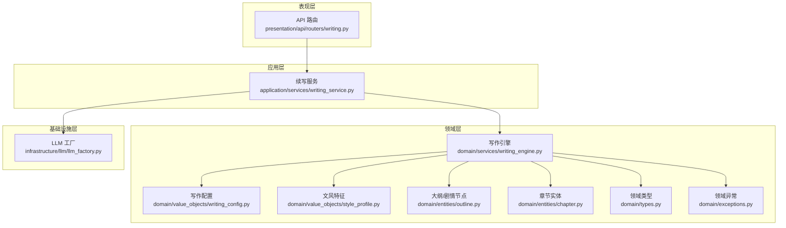
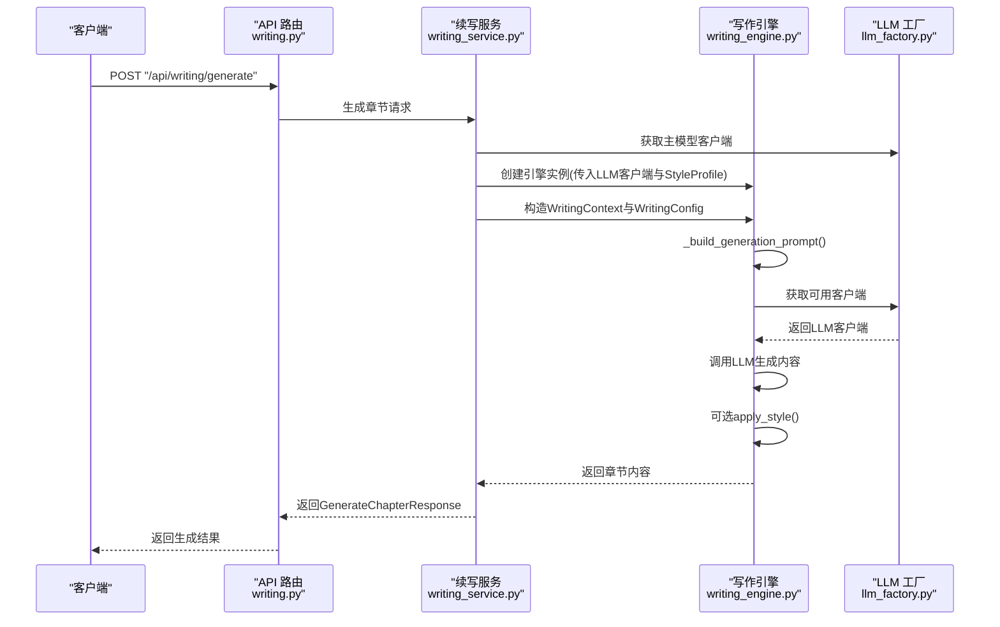
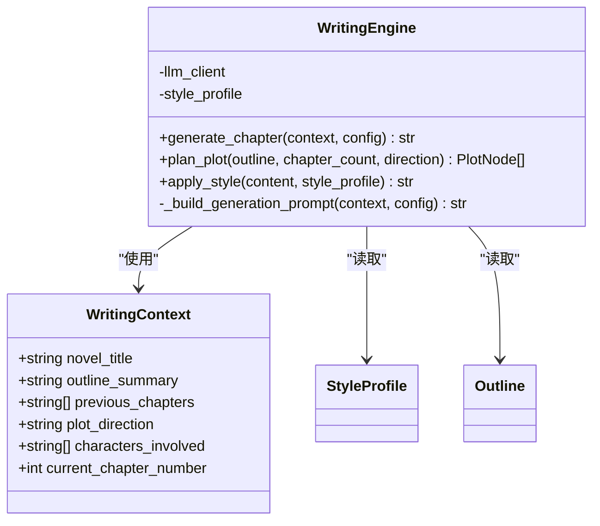
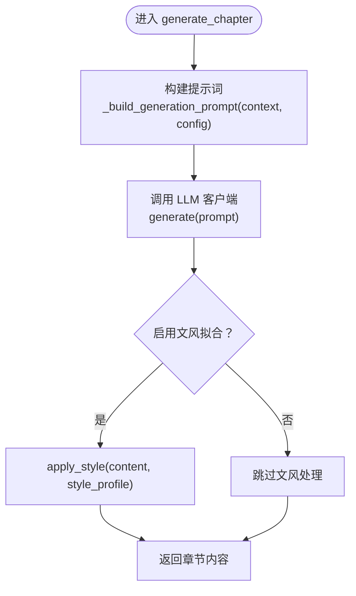
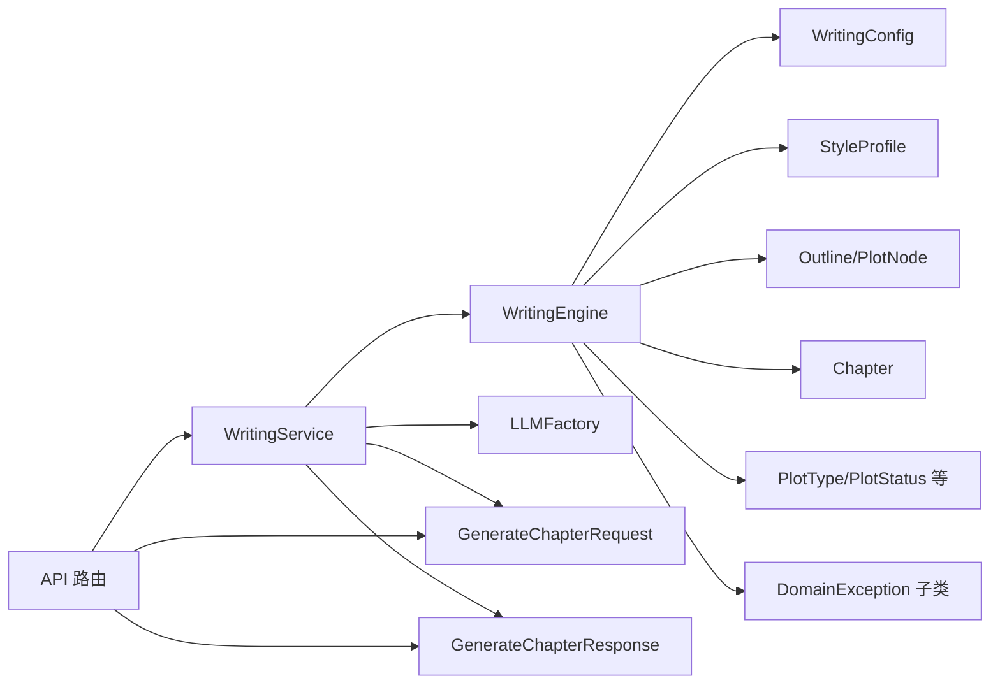

# 写作引擎核心

<cite>
**本文引用的文件**
- [writing_engine.py](file://domain/services/writing_engine.py)
- [writing_config.py](file://domain/value_objects/writing_config.py)
- [outline.py](file://domain/entities/outline.py)
- [chapter.py](file://domain/entities/chapter.py)
- [style_profile.py](file://domain/value_objects/style_profile.py)
- [types.py](file://domain/types.py)
- [exceptions.py](file://domain/exceptions.py)
- [writing_service.py](file://application/services/writing_service.py)
- [writing.py](file://presentation/api/routers/writing.py)
- [request_dto.py](file://application/dto/request_dto.py)
- [response_dto.py](file://application/dto/response_dto.py)
- [llm_factory.py](file://infrastructure/llm/llm_factory.py)
- [test_writing_engine.py](file://tests/unit/test_writing_engine.py)
</cite>

## 目录
1. [引言](#引言)
2. [项目结构](#项目结构)
3. [核心组件](#核心组件)
4. [架构总览](#架构总览)
5. [详细组件分析](#详细组件分析)
6. [依赖分析](#依赖分析)
7. [性能考虑](#性能考虑)
8. [故障排查指南](#故障排查指南)
9. [结论](#结论)
10. [附录](#附录)

## 引言
本文件面向开发者与技术读者，系统化梳理 InkTrace 写作引擎核心模块的设计与实现，重点围绕以下主题展开：
- WritingEngine 类的架构设计与职责边界
- 章节生成算法（generate_chapter）的完整工作流程
- 剧情规划机制（plan_plot）与文风应用系统（apply_style）
- WritingContext 上下文对象的数据结构与作用
- WritingConfig 配置参数对生成过程的影响
- 与上层服务、API 层及基础设施的集成方式
- 错误处理与性能优化策略
- 实际使用示例与最佳实践

## 项目结构
写作引擎位于领域层（domain），通过应用层服务（application/services）对外暴露能力，并由 API 路由（presentation/api/routers）提供 HTTP 接口。基础设施层（infrastructure/llm）负责大模型客户端的工厂化管理与可用性检测。

图表来源
- [writing.py:1-278](file://presentation/api/routers/writing.py#L1-L278)
- [writing_service.py:1-180](file://application/services/writing_service.py#L1-L180)
- [writing_engine.py:1-184](file://domain/services/writing_engine.py#L1-L184)
- [writing_config.py:1-28](file://domain/value_objects/writing_config.py#L1-L28)
- [style_profile.py:1-30](file://domain/value_objects/style_profile.py#L1-L30)
- [outline.py:1-257](file://domain/entities/outline.py#L1-L257)
- [chapter.py:1-109](file://domain/entities/chapter.py#L1-L109)
- [types.py:1-284](file://domain/types.py#L1-L284)
- [exceptions.py:1-100](file://domain/exceptions.py#L1-L100)
- [llm_factory.py:1-121](file://infrastructure/llm/llm_factory.py#L1-L121)

章节来源
- [writing.py:1-278](file://presentation/api/routers/writing.py#L1-L278)
- [writing_service.py:1-180](file://application/services/writing_service.py#L1-L180)
- [writing_engine.py:1-184](file://domain/services/writing_engine.py#L1-L184)
- [llm_factory.py:1-121](file://infrastructure/llm/llm_factory.py#L1-L121)

## 核心组件
- WritingEngine：领域服务，负责章节生成、剧情规划、文风应用。核心方法包括 generate_chapter、plan_plot、apply_style 与内部提示词构建器 _build_generation_prompt。
- WritingContext：承载生成所需的上下文信息，如小说标题、大纲摘要、前文章节、剧情方向等。
- WritingConfig：不可变值对象，控制生成行为，如目标字数、风格强度、温度、上下文章节数量、一致性检查开关、文风拟合开关等。
- Outline/PlotNode：大纲与剧情节点，用于剧情规划阶段的输入与输出。
- StyleProfile：文风特征值对象，包含词汇、句式、修辞、对白风格、叙述语态、节奏与样例句子等。
- Chapter：章节实体，包含章节编号、标题、内容、状态与字数统计等。
- LLMFactory：大模型客户端工厂，支持主备模型切换与可用性检测。

章节来源
- [writing_engine.py:19-184](file://domain/services/writing_engine.py#L19-L184)
- [writing_config.py:13-28](file://domain/value_objects/writing_config.py#L13-L28)
- [outline.py:17-257](file://domain/entities/outline.py#L17-L257)
- [style_profile.py:14-30](file://domain/value_objects/style_profile.py#L14-L30)
- [chapter.py:18-109](file://domain/entities/chapter.py#L18-L109)
- [types.py:87-107](file://domain/types.py#L87-L107)
- [llm_factory.py:31-121](file://infrastructure/llm/llm_factory.py#L31-L121)

## 架构总览
写作引擎采用“领域服务 + 值对象 + 实体”的分层设计，通过应用层服务协调仓库与 LLM 工厂，最终由 API 路由对外提供生成与规划能力。整体流程如下：

图表来源
- [writing.py:111-171](file://presentation/api/routers/writing.py#L111-L171)
- [writing_service.py:91-165](file://application/services/writing_service.py#L91-L165)
- [writing_engine.py:52-80](file://domain/services/writing_engine.py#L52-L80)
- [llm_factory.py:78-95](file://infrastructure/llm/llm_factory.py#L78-L95)

## 详细组件分析

### WritingEngine 类与上下文对象
WritingEngine 是写作引擎的核心，承担以下职责：
- 生成章节内容：构建提示词、调用 LLM、可选地应用文风
- 规划剧情节点：基于大纲与方向生成若干剧情节点
- 应用文风：对生成内容进行风格化处理（当前实现预留）

WritingContext 数据结构与字段含义：
- novel_title：小说标题
- outline_summary：大纲摘要
- previous_chapters：最近章节内容列表（最多取最近若干条）
- plot_direction：剧情方向
- characters_involved：涉及人物（可选，默认空列表）
- current_chapter_number：当前章节序号（可选，默认0）

章节来源
- [writing_engine.py:19-51](file://domain/services/writing_engine.py#L19-L51)
- [writing_engine.py:52-184](file://domain/services/writing_engine.py#L52-L184)

#### 类图（代码级）

图表来源
- [writing_engine.py:19-184](file://domain/services/writing_engine.py#L19-L184)
- [outline.py:17-84](file://domain/entities/outline.py#L17-L84)
- [style_profile.py:14-30](file://domain/value_objects/style_profile.py#L14-L30)

### generate_chapter 方法工作流程
该方法是章节生成的主入口，流程要点：
- 构建提示词：调用 _build_generation_prompt(context, config)
- LLM 调用：检测客户端是否支持异步 generate；若支持则异步运行；否则同步调用
- 文风应用：当 config.enable_style_mimicry 为真时，调用 apply_style 对生成内容进行风格化
- 返回生成内容

图表来源
- [writing_engine.py:52-80](file://domain/services/writing_engine.py#L52-L80)
- [writing_engine.py:139-184](file://domain/services/writing_engine.py#L139-L184)

章节来源
- [writing_engine.py:52-80](file://domain/services/writing_engine.py#L52-L80)
- [writing_engine.py:139-184](file://domain/services/writing_engine.py#L139-L184)

### 提示词构建逻辑（_build_generation_prompt）
提示词由多个部分拼接而成，确保 LLM 在生成时具备充分上下文：
- 小说信息：标题
- 大纲摘要：来自 context.outline_summary
- 剧情方向：来自 context.plot_direction
- 前文提要：取最近若干章节摘要（最多取最近3条）
- 写作要求：目标字数、保持文风一致、延续剧情
- 章节内容：明确要求直接输出正文，不带说明文字

章节来源
- [writing_engine.py:139-184](file://domain/services/writing_engine.py#L139-L184)

### 剧情规划（plan_plot）
该方法根据输入的大纲、章节数量与方向，生成固定数量的剧情节点：
- 生成规则：按顺序创建 PlotNode，首节点类型为主线（MAIN），其余为支线（SUB）
- 状态：统一初始化为 PLANNED
- 其他属性：id、title、description、start_chapter、end_chapter、involved_characters、dependencies 等

章节来源
- [writing_engine.py:82-113](file://domain/services/writing_engine.py#L82-L113)
- [outline.py:17-47](file://domain/entities/outline.py#L17-L47)
- [types.py:93-107](file://domain/types.py#L93-L107)

### 文风应用（apply_style）
当前实现为占位符，保留了对 StyleProfile.sample_sentences 的判断入口，便于后续扩展：
- 若存在样本句子，可在此处进行风格迁移或拟合
- 返回处理后的文本

章节来源
- [writing_engine.py:115-137](file://domain/services/writing_engine.py#L115-L137)
- [style_profile.py:14-30](file://domain/value_objects/style_profile.py#L14-L30)

### WritingConfig 配置项对生成的影响
- target_word_count：影响提示词中的字数要求
- style_intensity：当前未在生成流程中使用（可作为未来扩展点）
- temperature：当前未在生成流程中使用（可作为未来扩展点）
- max_context_chapters：当前未在生成流程中使用（可作为未来扩展点）
- enable_consistency_check：由应用层服务决定是否启用一致性检查
- enable_style_mimicry：控制是否调用 apply_style

章节来源
- [writing_config.py:13-28](file://domain/value_objects/writing_config.py#L13-L28)
- [writing_engine.py:139-184](file://domain/services/writing_engine.py#L139-L184)
- [writing_service.py:144-159](file://application/services/writing_service.py#L144-L159)

### 与应用层与 API 层的集成
- API 路由：接收前端请求，支持传统模式与智能体模式（灰度分流）。传统模式委托给续写服务；智能体模式通过工具链生成内容。
- 续写服务：负责加载仓库、构造上下文、创建引擎、调用生成并可选进行一致性检查，最后封装响应 DTO。
- LLM 工厂：提供主备模型客户端，支持可用性检测与自动切换。

章节来源
- [writing.py:88-171](file://presentation/api/routers/writing.py#L88-L171)
- [writing_service.py:91-165](file://application/services/writing_service.py#L91-L165)
- [llm_factory.py:78-121](file://infrastructure/llm/llm_factory.py#L78-L121)

## 依赖分析
- 写作引擎依赖：
  - 值对象：WritingConfig、StyleProfile
  - 实体：Outline、PlotNode、Chapter
  - 类型：PlotType、PlotStatus 等
  - 异常：DomainException 及其子类
- 应用层服务依赖：
  - 仓库接口（INovelRepository、IChapterRepository）
  - LLM 工厂
  - DTO（GenerateChapterRequest/Response）
- API 路由依赖：
  - 项目服务（用于智能体模式）
  - 续写服务
  - DTO（请求/响应）

图表来源
- [writing_engine.py:19-184](file://domain/services/writing_engine.py#L19-L184)
- [writing_service.py:91-165](file://application/services/writing_service.py#L91-L165)
- [writing.py:111-171](file://presentation/api/routers/writing.py#L111-L171)
- [types.py:93-107](file://domain/types.py#L93-L107)
- [exceptions.py:11-100](file://domain/exceptions.py#L11-L100)

章节来源
- [writing_engine.py:19-184](file://domain/services/writing_engine.py#L19-L184)
- [writing_service.py:91-165](file://application/services/writing_service.py#L91-L165)
- [writing.py:111-171](file://presentation/api/routers/writing.py#L111-L171)

## 性能考虑
- LLM 调用异步化：当客户端支持异步 generate 时，采用异步运行以提升吞吐（见 generate_chapter 流程）。
- 上下文截断：提示词中仅保留最近若干章节摘要，避免上下文过长导致成本上升与延迟增加。
- 主备模型切换：LLM 工厂在主模型不可用时自动切换至备用模型，提高可用性。
- 一致性检查可选：由配置项 enable_consistency_check 控制，避免不必要的额外开销。
- 文风拟合可选：由配置项 enable_style_mimicry 控制，减少非必要处理。

章节来源
- [writing_engine.py:52-80](file://domain/services/writing_engine.py#L52-L80)
- [writing_engine.py:139-184](file://domain/services/writing_engine.py#L139-L184)
- [writing_service.py:144-159](file://application/services/writing_service.py#L144-L159)
- [llm_factory.py:78-121](file://infrastructure/llm/llm_factory.py#L78-L121)

## 故障排查指南
常见异常与定位建议：
- APIKeyError：检查 LLM 提供商的 API 密钥配置是否正确。
- RateLimitError：关注限流重试时间，合理降低并发或等待重试。
- NetworkError：检查网络连通性与代理设置。
- TokenLimitError：适当缩短上下文长度或减少历史章节摘要数量。
- InvalidOperationError：例如章节状态非法（已发布再次发布），需检查业务状态流转。

章节来源
- [exceptions.py:51-100](file://domain/exceptions.py#L51-L100)
- [writing_service.py:144-159](file://application/services/writing_service.py#L144-L159)

## 结论
WritingEngine 以清晰的职责划分与可扩展的值对象设计，实现了从上下文构建、LLM 调用到风格化输出的完整链路。结合应用层服务与 API 路由，系统既支持传统模式的稳定生成，也具备向智能体模式演进的能力。建议在实际使用中：
- 明确配置项的作用范围，按需开启一致性检查与文风拟合
- 合理控制上下文长度，平衡质量与性能
- 使用 LLM 工厂提供的主备切换能力，提升稳定性

## 附录

### 使用示例与最佳实践
- 如何使用写作引擎进行章节生成（步骤概述）：
  1) 通过应用层服务获取主模型客户端与文风特征
  2) 构造 WritingContext（包含小说标题、大纲摘要、最近章节、剧情方向）
  3) 构造 WritingConfig（目标字数、是否启用一致性检查、是否启用文风拟合）
  4) 调用 generate_chapter 获取内容
  5) 可选：调用一致性检查服务进行连贯性校验
  6) 将生成内容持久化为章节实体并更新小说进度

- 错误处理与性能优化建议：
  - 在调用 LLM 前先检查可用性，必要时切换备用模型
  - 控制提示词长度，避免超出上下文限制
  - 对于高并发场景，优先使用异步客户端
  - 对生成内容进行必要的后处理（如去除多余说明、规范化格式）

章节来源
- [writing_service.py:91-165](file://application/services/writing_service.py#L91-L165)
- [writing_engine.py:52-80](file://domain/services/writing_engine.py#L52-L80)
- [writing_engine.py:139-184](file://domain/services/writing_engine.py#L139-L184)
- [llm_factory.py:78-121](file://infrastructure/llm/llm_factory.py#L78-L121)