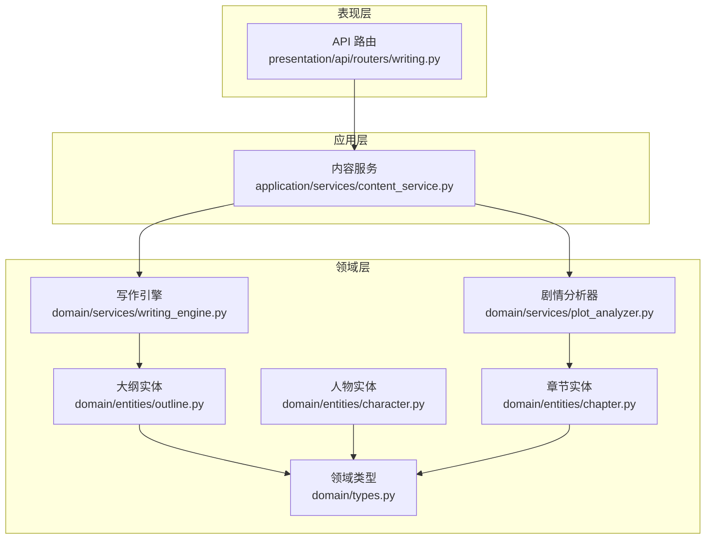
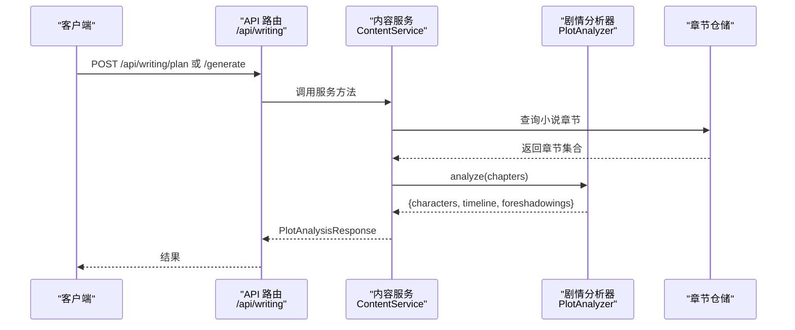
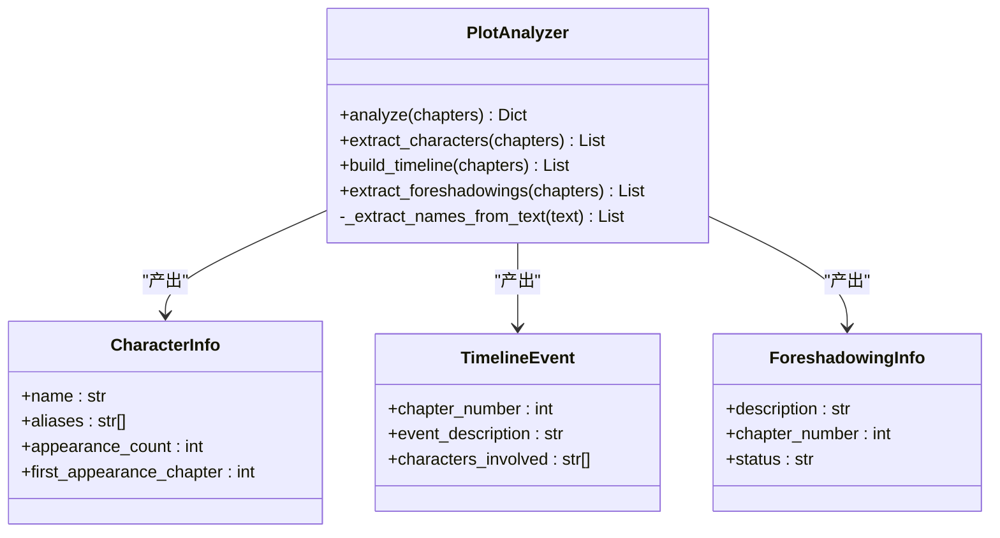
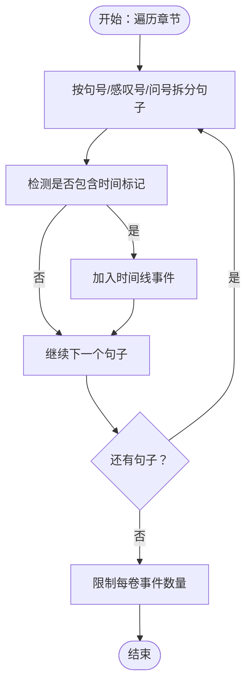
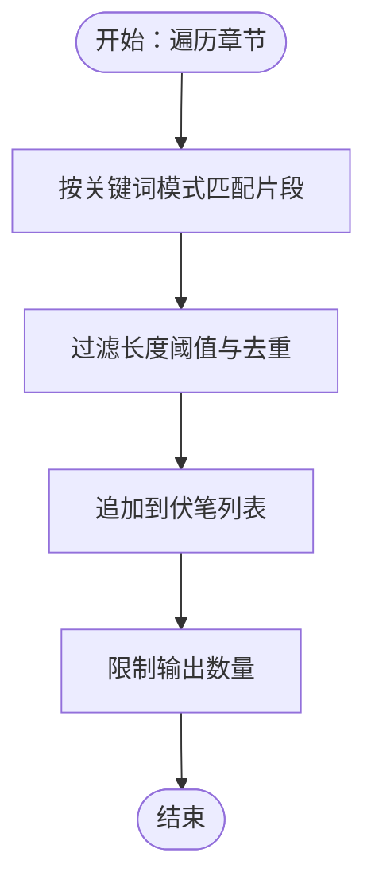
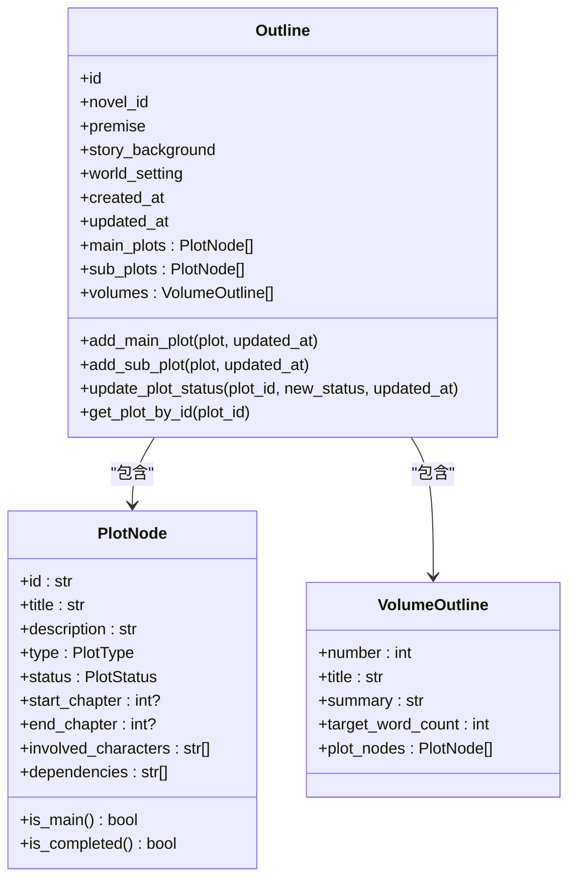
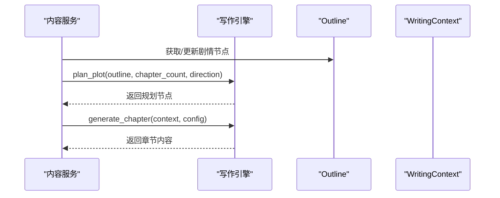
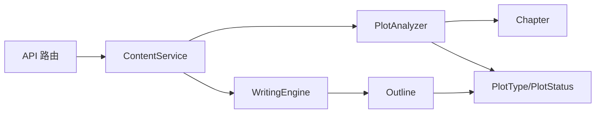
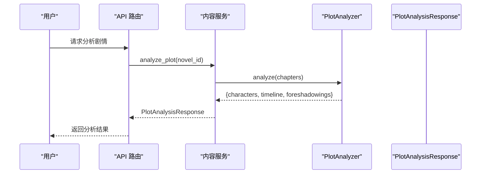

# 剧情分析系统

<cite>
**本文引用的文件**
- [domain/services/plot_analyzer.py](file://domain/services/plot_analyzer.py)
- [domain/entities/outline.py](file://domain/entities/outline.py)
- [domain/entities/foreshadow.py](file://domain/entities/foreshadow.py)
- [domain/entities/character.py](file://domain/entities/character.py)
- [domain/entities/chapter.py](file://domain/entities/chapter.py)
- [domain/times/types.py](file://domain/types.py)
- [domain/services/writing_engine.py](file://domain/services/writing_engine.py)
- [application/services/content_service.py](file://application/services/content_service.py)
- [presentation/api/routers/writing.py](file://presentation/api/routers/writing.py)
- [tests/unit/test_plot_analyzer.py](file://tests/unit/test_plot_analyzer.py)
- [tests/unit/test_outline.py](file://tests/unit/test_outline.py)
- [application/dto/request_dto.py](file://application/dto/request_dto.py)
- [application/dto/response_dto.py](file://application/dto/response_dto.py)
</cite>

## 目录
1. [简介](#简介)
2. [项目结构](#项目结构)
3. [核心组件](#核心组件)
4. [架构总览](#架构总览)
5. [详细组件分析](#详细组件分析)
6. [依赖分析](#依赖分析)
7. [性能考虑](#性能考虑)
8. [故障排查指南](#故障排查指南)
9. [结论](#结论)
10. [附录](#附录)

## 简介
本技术文档围绕 InkTrace 的剧情分析系统展开，重点解析 PlotAnalyzer 领域服务的架构设计与剧情分析算法，涵盖人物关系识别、时间线构建与伏笔线索提取。同时阐明 Outline 实体与 PlotNode 节点的数据结构及其在剧情分析中的作用，并给出与写作引擎的集成方式及对后续创作的影响。文档提供基于仓库现有实现的可视化图示与流程说明，帮助读者快速理解并扩展该系统。

## 项目结构
InkTrace 采用分层架构，剧情分析位于领域层（domain），通过应用服务（application）对外提供分析能力，并由 API 路由暴露接口；写作引擎（WritingEngine）负责后续章节生成与剧情规划。

**图表来源**
- [presentation/api/routers/writing.py:1-278](file://presentation/api/routers/writing.py#L1-L278)
- [application/services/content_service.py:1-169](file://application/services/content_service.py#L1-L169)
- [domain/services/plot_analyzer.py:1-225](file://domain/services/plot_analyzer.py#L1-L225)
- [domain/services/writing_engine.py:1-184](file://domain/services/writing_engine.py#L1-L184)
- [domain/entities/outline.py:1-257](file://domain/entities/outline.py#L1-L257)
- [domain/entities/character.py:1-273](file://domain/entities/character.py#L1-L273)
- [domain/entities/chapter.py:1-109](file://domain/entities/chapter.py#L1-L109)
- [domain/types.py:1-284](file://domain/types.py#L1-L284)

**章节来源**
- [presentation/api/routers/writing.py:1-278](file://presentation/api/routers/writing.py#L1-L278)
- [application/services/content_service.py:1-169](file://application/services/content_service.py#L1-L169)
- [domain/services/plot_analyzer.py:1-225](file://domain/services/plot_analyzer.py#L1-L225)
- [domain/services/writing_engine.py:1-184](file://domain/services/writing_engine.py#L1-L184)
- [domain/entities/outline.py:1-257](file://domain/entities/outline.py#L1-L257)
- [domain/entities/character.py:1-273](file://domain/entities/character.py#L1-L273)
- [domain/entities/chapter.py:1-109](file://domain/entities/chapter.py#L1-L109)
- [domain/types.py:1-284](file://domain/types.py#L1-L284)

## 核心组件
- PlotAnalyzer：负责从章节文本中抽取人物、时间线事件与伏笔线索，形成结构化分析结果。
- Outline/PlotNode：用于承载与管理剧情节点、主线/支线划分与状态流转，支撑后续写作引擎的剧情规划。
- WritingEngine：接收大纲与上下文，生成章节内容并可应用文风特征。
- ContentService：应用层服务，封装剧情分析的入口，连接存储与领域服务。
- API 路由：对外提供“生成章节/续写/规划剧情”等接口，协调工具链与写作服务。

**章节来源**
- [domain/services/plot_analyzer.py:46-76](file://domain/services/plot_analyzer.py#L46-L76)
- [domain/entities/outline.py:17-84](file://domain/entities/outline.py#L17-L84)
- [domain/services/writing_engine.py:30-184](file://domain/services/writing_engine.py#L30-L184)
- [application/services/content_service.py:29-147](file://application/services/content_service.py#L29-L147)
- [presentation/api/routers/writing.py:88-278](file://presentation/api/routers/writing.py#L88-L278)

## 架构总览
PlotAnalyzer 作为领域服务，独立于应用层与表现层，仅依赖领域实体与类型定义。ContentService 在应用层调用 PlotAnalyzer 并将结果封装为 DTO 返回；API 路由层则面向外部请求，协调工具链与写作服务。

**图表来源**
- [application/services/content_service.py:123-147](file://application/services/content_service.py#L123-L147)
- [domain/services/plot_analyzer.py:55-75](file://domain/services/plot_analyzer.py#L55-L75)
- [presentation/api/routers/writing.py:88-174](file://presentation/api/routers/writing.py#L88-L174)

**章节来源**
- [application/services/content_service.py:123-147](file://application/services/content_service.py#L123-L147)
- [domain/services/plot_analyzer.py:55-75](file://domain/services/plot_analyzer.py#L55-L75)
- [presentation/api/routers/writing.py:88-174](file://presentation/api/routers/writing.py#L88-L174)

## 详细组件分析

### PlotAnalyzer 类架构与算法
PlotAnalyzer 是剧情分析的核心领域服务，提供三类分析能力：
- 人物提取：基于中文姓名模式与出现频次统计，筛选高频人名并记录首次出场章节。
- 时间线构建：识别包含时间标记的句子，抽取事件描述与涉及人物，按章节聚合。
- 伏笔提取：匹配含“神秘/等待/觉醒/秘密/真相/伏笔/暗示”等关键词的片段，形成未回收状态的线索列表。

**图表来源**
- [domain/services/plot_analyzer.py:19-225](file://domain/services/plot_analyzer.py#L19-L225)

**章节来源**
- [domain/services/plot_analyzer.py:46-225](file://domain/services/plot_analyzer.py#L46-L225)

#### 人物关系识别与行为模式分析
- 当前实现侧重“人名抽取”，通过正则匹配与出现频次进行初步筛选，未直接构建人物关系网络。
- 若需扩展到关系识别，可在章节中引入共现规则与关系关键词（如“对…有好感/敌意/师徒”），结合 CharacterRelation 值对象进行建模。

**章节来源**
- [domain/services/plot_analyzer.py:77-119](file://domain/services/plot_analyzer.py#L77-L119)
- [domain/entities/character.py:18-47](file://domain/entities/character.py#L18-L47)

#### 时间线分析机制
- 以“时间标记”为核心：支持“第X天/日/年”、“今明后昨前”、“X天/年后”等常见表达。
- 按章节切分句子，若句中包含时间标记或为事件首句，则抽取为时间线事件条目。
- 输出包含章节号、事件摘要与涉及人物，便于后续排序与因果推理。

**图表来源**
- [domain/services/plot_analyzer.py:121-168](file://domain/services/plot_analyzer.py#L121-L168)

**章节来源**
- [domain/services/plot_analyzer.py:121-168](file://domain/services/plot_analyzer.py#L121-L168)

#### 伏笔分析算法
- 关键词匹配策略：覆盖“神秘/奇怪/未知/隐约/似乎/好像/等待/时机/觉醒/秘密/真相/伏笔/暗示”等短语。
- 输出包含描述、章节号与状态（默认“未回收”），便于后续追踪与解决。

**图表来源**
- [domain/services/plot_analyzer.py:170-202](file://domain/services/plot_analyzer.py#L170-L202)

**章节来源**
- [domain/services/plot_analyzer.py:170-202](file://domain/services/plot_analyzer.py#L170-L202)

### Outline 与 PlotNode 数据结构
Outline 作为聚合根，管理主线/支线剧情节点与分卷信息；PlotNode 表示单个剧情节点，包含标题、描述、类型（主线/支线/伏笔）、状态（计划/进行中/完成）以及起止章节、涉及人物与依赖关系等。

**图表来源**
- [domain/entities/outline.py:66-257](file://domain/entities/outline.py#L66-L257)
- [domain/types.py:93-107](file://domain/types.py#L93-L107)

**章节来源**
- [domain/entities/outline.py:66-257](file://domain/entities/outline.py#L66-L257)
- [domain/types.py:93-107](file://domain/types.py#L93-L107)

### 与写作引擎的集成
- ContentService 在分析完成后，可将 PlotAnalyzer 的结果用于驱动 WritingEngine 的“剧情规划”与“章节生成”。
- WritingEngine 接收 Outline 与上下文，生成符合文风的章节内容，并可按规划方向推进主线/支线剧情。

**图表来源**
- [application/services/content_service.py:123-147](file://application/services/content_service.py#L123-L147)
- [domain/services/writing_engine.py:82-184](file://domain/services/writing_engine.py#L82-L184)

**章节来源**
- [application/services/content_service.py:123-147](file://application/services/content_service.py#L123-L147)
- [domain/services/writing_engine.py:82-184](file://domain/services/writing_engine.py#L82-L184)

## 依赖分析
- PlotAnalyzer 依赖章节实体与领域类型（章节号、剧情类型/状态枚举），不依赖应用层或基础设施。
- Outline/PlotNode 依赖领域类型（PlotType/PlotStatus），用于区分主线/支线与状态。
- ContentService 依赖仓储接口与 PlotAnalyzer/WritingEngine，向上提供分析与生成能力。
- API 路由依赖应用服务与仓储接口，负责请求校验与错误处理。

**图表来源**
- [domain/services/plot_analyzer.py:15-16](file://domain/services/plot_analyzer.py#L15-L16)
- [domain/entities/chapter.py:27-36](file://domain/entities/chapter.py#L27-L36)
- [domain/types.py:93-107](file://domain/types.py#L93-L107)
- [domain/entities/outline.py:74-83](file://domain/entities/outline.py#L74-L83)
- [domain/services/writing_engine.py:13-16](file://domain/services/writing_engine.py#L13-L16)
- [application/services/content_service.py:23-50](file://application/services/content_service.py#L23-L50)
- [presentation/api/routers/writing.py:34-34](file://presentation/api/routers/writing.py#L34-L34)

**章节来源**
- [domain/services/plot_analyzer.py:15-16](file://domain/services/plot_analyzer.py#L15-L16)
- [domain/entities/chapter.py:27-36](file://domain/entities/chapter.py#L27-L36)
- [domain/types.py:93-107](file://domain/types.py#L93-L107)
- [domain/entities/outline.py:74-83](file://domain/entities/outline.py#L74-L83)
- [domain/services/writing_engine.py:13-16](file://domain/services/writing_engine.py#L13-L16)
- [application/services/content_service.py:23-50](file://application/services/content_service.py#L23-L50)
- [presentation/api/routers/writing.py:34-34](file://presentation/api/routers/writing.py#L34-L34)

## 性能考虑
- 正则匹配复杂度与文本长度线性相关，建议对长文本分段处理或限制单章最大长度。
- 人物与伏笔提取均使用多轮正则扫描，可考虑缓存常用模式与中间结果。
- 时间线构建按句切分并逐句匹配，建议在大规模文本场景中启用分页/批处理策略。

## 故障排查指南
- 剧情分析返回为空：确认传入章节列表非空，且章节内容包含可识别的时间标记或关键词。
- 人物提取异常：检查中文姓名模式是否覆盖目标文本风格，必要时扩展正则规则。
- API 错误码：路由层对参数错误与内部异常进行统一包装，参考响应 DTO 中的错误结构定位问题。

**章节来源**
- [presentation/api/routers/writing.py:40-54](file://presentation/api/routers/writing.py#L40-L54)
- [application/dto/response_dto.py:109-116](file://application/dto/response_dto.py#L109-L116)

## 结论
PlotAnalyzer 以轻量正则为核心，实现了对人物、时间线与伏笔的快速抽取，满足初阶剧情分析需求。结合 Outline/PlotNode 的结构化节点管理与 WritingEngine 的生成能力，可形成从“结构整理—剧情规划—内容生成”的闭环。后续可扩展人物关系识别、因果推理与一致性检查，进一步提升分析深度与创作指导价值。

## 附录

### 典型使用流程（基于现有实现）
- 文本预处理：ContentService 读取小说章节，调用 PlotAnalyzer.analyze 得到结构化结果。
- 特征提取：人物按出现频次排序，时间线按章节与句内时间标记抽取，伏笔按关键词匹配。
- 结构化输出：PlotAnalysisResponse 包含 characters、timeline、foreshadowings 字段，供前端或工具链消费。

**图表来源**
- [application/services/content_service.py:123-147](file://application/services/content_service.py#L123-L147)
- [domain/services/plot_analyzer.py:55-75](file://domain/services/plot_analyzer.py#L55-L75)
- [application/dto/response_dto.py:180-185](file://application/dto/response_dto.py#L180-L185)

**章节来源**
- [application/services/content_service.py:123-147](file://application/services/content_service.py#L123-L147)
- [domain/services/plot_analyzer.py:55-75](file://domain/services/plot_analyzer.py#L55-L75)
- [application/dto/response_dto.py:180-185](file://application/dto/response_dto.py#L180-L185)

### 测试要点
- 人物提取：验证多角色场景与主角识别。
- 时间线构建：验证时间标记识别与事件截断。
- 伏笔提取：验证关键词覆盖与长度过滤。
- 大纲操作：验证主线/支线添加、状态更新与查询。

**章节来源**
- [tests/unit/test_plot_analyzer.py:42-154](file://tests/unit/test_plot_analyzer.py#L42-L154)
- [tests/unit/test_outline.py:123-286](file://tests/unit/test_outline.py#L123-L286)