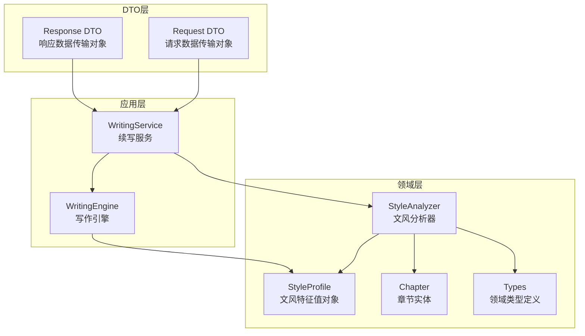
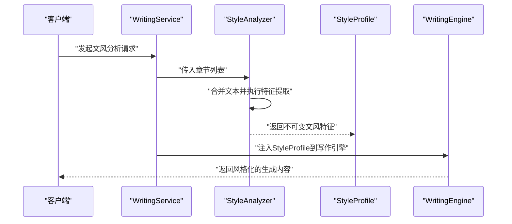
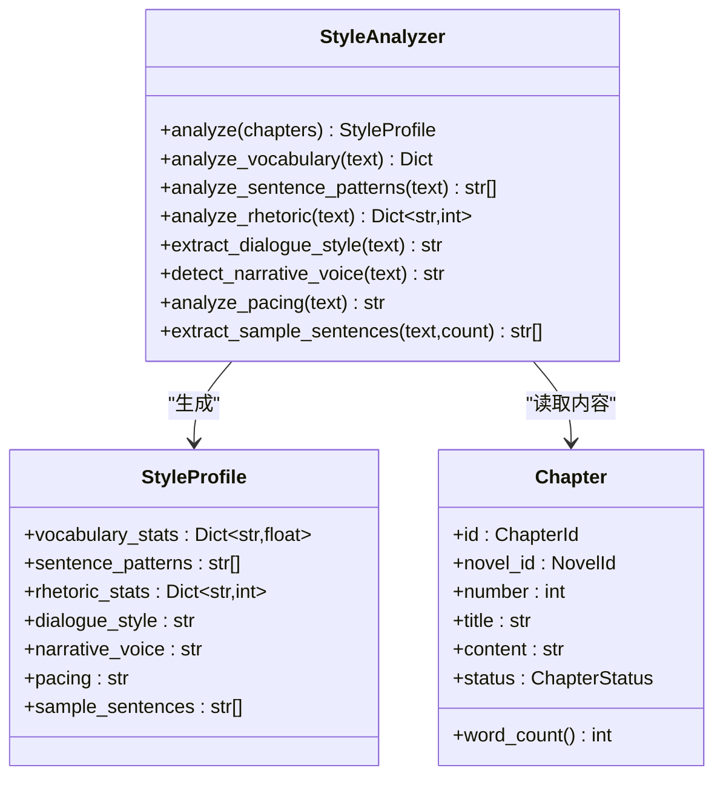
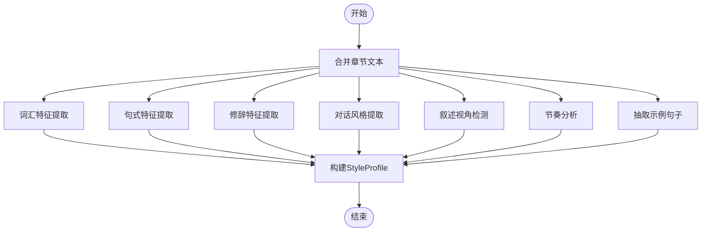
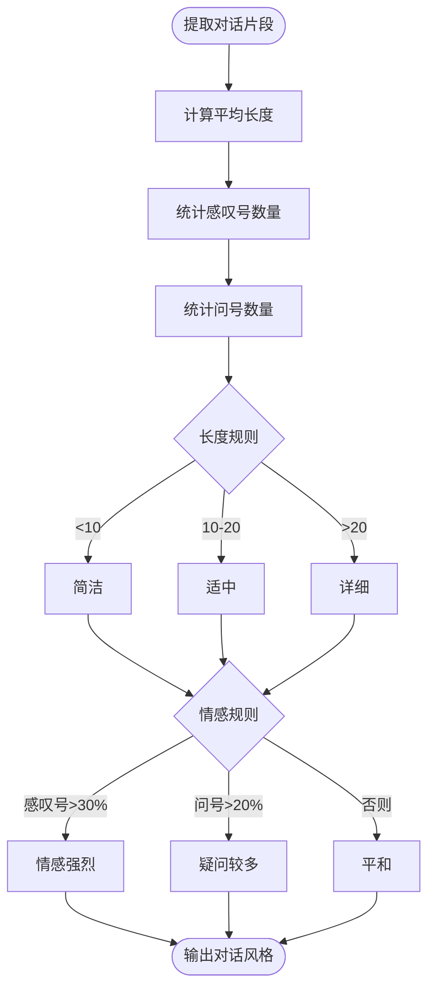
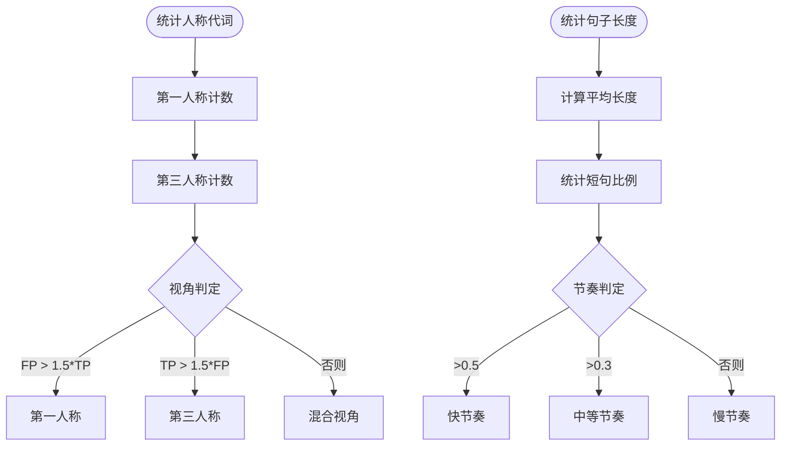
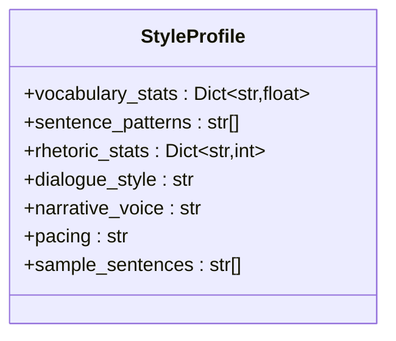
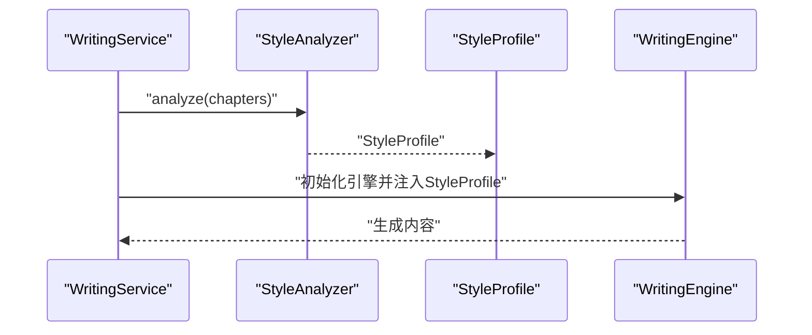
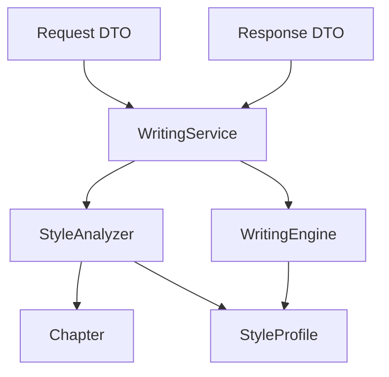
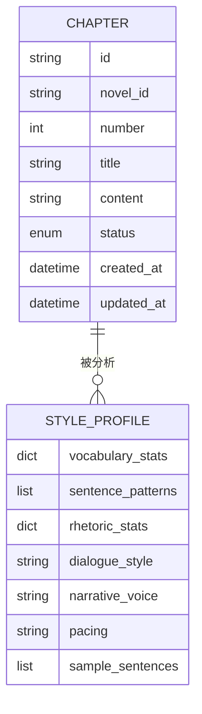

# 风格分析系统

<cite>
**本文档引用的文件**
- [style_analyzer.py](file://domain/services/style_analyzer.py)
- [style_profile.py](file://domain/value_objects/style_profile.py)
- [test_style_analyzer.py](file://tests/unit/test_style_analyzer.py)
- [chapter.py](file://domain/entities/chapter.py)
- [types.py](file://domain/types.py)
- [writing_engine.py](file://domain/services/writing_engine.py)
- [writing_service.py](file://application/services/writing_service.py)
- [request_dto.py](file://application/dto/request_dto.py)
- [response_dto.py](file://application/dto/response_dto.py)
</cite>

## 目录
1. [简介](#简介)
2. [项目结构](#项目结构)
3. [核心组件](#核心组件)
4. [架构概览](#架构概览)
5. [详细组件分析](#详细组件分析)
6. [依赖分析](#依赖分析)
7. [性能考虑](#性能考虑)
8. [故障排除指南](#故障排除指南)
9. [结论](#结论)
10. [附录](#附录)

## 简介
本文件为 InkTrace 风格分析系统的技术文档，重点围绕 StyleAnalyzer 类的设计架构与算法实现进行深入解析。文档涵盖文本特征提取（词汇特征、句式特征、修辞特征）、对话风格分析、StyleProfile 值对象的数据结构与存储方式，以及与其他模块的集成方式和性能优化策略。同时提供完整的风格分析流程示例，帮助开发者快速理解并扩展该系统。

## 项目结构
InkTrace 采用分层架构设计，风格分析系统位于领域层（Domain），通过值对象（Value Objects）封装分析结果，并与应用层服务协作完成实际业务流程。

**图表来源**
- [style_analyzer.py:18-66](file://domain/services/style_analyzer.py#L18-L66)
- [style_profile.py:14-30](file://domain/value_objects/style_profile.py#L14-L30)
- [chapter.py:18-37](file://domain/entities/chapter.py#L18-L37)
- [types.py:15-284](file://domain/types.py#L15-L284)
- [writing_service.py:30-180](file://application/services/writing_service.py#L30-L180)
- [writing_engine.py:30-184](file://domain/services/writing_engine.py#L30-L184)
- [request_dto.py:14-97](file://application/dto/request_dto.py#L14-L97)
- [response_dto.py:15-200](file://application/dto/response_dto.py#L15-L200)

**章节来源**
- [style_analyzer.py:18-66](file://domain/services/style_analyzer.py#L18-L66)
- [style_profile.py:14-30](file://domain/value_objects/style_profile.py#L14-L30)
- [chapter.py:18-37](file://domain/entities/chapter.py#L18-L37)
- [types.py:15-284](file://domain/types.py#L15-L284)
- [writing_service.py:30-180](file://application/services/writing_service.py#L30-L180)
- [writing_engine.py:30-184](file://domain/services/writing_engine.py#L30-L184)
- [request_dto.py:14-97](file://application/dto/request_dto.py#L14-L97)
- [response_dto.py:15-200](file://application/dto/response_dto.py#L15-L200)

## 核心组件
- StyleAnalyzer：负责从章节文本中提取词汇、句式、修辞等特征，并生成 StyleProfile 值对象。
- StyleProfile：不可变值对象，封装文风分析结果，便于跨模块传递与缓存。
- Chapter：章节实体，承载文本内容，作为 StyleAnalyzer 的输入。
- WritingService/WritingEngine：应用层服务与领域引擎，消费 StyleProfile 进行风格迁移与内容生成。

**章节来源**
- [style_analyzer.py:25-66](file://domain/services/style_analyzer.py#L25-L66)
- [style_profile.py:14-30](file://domain/value_objects/style_profile.py#L14-L30)
- [chapter.py:18-37](file://domain/entities/chapter.py#L18-L37)
- [writing_engine.py:30-80](file://domain/services/writing_engine.py#L30-L80)
- [writing_service.py:30-180](file://application/services/writing_service.py#L30-L180)

## 架构概览
StyleAnalyzer 作为领域服务，专注于文本特征提取；其输出的 StyleProfile 由应用层服务消费，用于指导后续的写作与风格迁移。

**图表来源**
- [writing_service.py:167-180](file://application/services/writing_service.py#L167-L180)
- [style_analyzer.py:25-66](file://domain/services/style_analyzer.py#L25-L66)
- [writing_engine.py:39-80](file://domain/services/writing_engine.py#L39-L80)

## 详细组件分析

### StyleAnalyzer 类设计与算法实现
StyleAnalyzer 是文风分析的核心领域服务，提供统一的分析入口与多维度特征提取能力。

**图表来源**
- [style_analyzer.py:18-286](file://domain/services/style_analyzer.py#L18-L286)
- [style_profile.py:14-30](file://domain/value_objects/style_profile.py#L14-L30)
- [chapter.py:18-41](file://domain/entities/chapter.py#L18-L41)

#### 文本特征提取流程
- 词汇特征提取：基于中文字符正则提取词语，统计高频词、平均词长与词汇丰富度。
- 句式特征提取：按标点切分句子，筛选包含逗号的示例，归纳句式模板。
- 修辞特征提取：通过预定义模式匹配比喻、拟人、排比、夸张等修辞手法。

**图表来源**
- [style_analyzer.py:48-66](file://domain/services/style_analyzer.py#L48-L66)
- [style_analyzer.py:68-99](file://domain/services/style_analyzer.py#L68-L99)
- [style_analyzer.py:101-126](file://domain/services/style_analyzer.py#L101-L126)
- [style_analyzer.py:128-177](file://domain/services/style_analyzer.py#L128-L177)
- [style_analyzer.py:179-215](file://domain/services/style_analyzer.py#L179-L215)
- [style_analyzer.py:217-237](file://domain/services/style_analyzer.py#L217-L237)
- [style_analyzer.py:239-267](file://domain/services/style_analyzer.py#L239-L267)
- [style_analyzer.py:269-285](file://domain/services/style_analyzer.py#L269-L285)

#### 对话风格分析机制
- 基于引号内的文本提取对话片段。
- 计算平均长度与标点分布（感叹号、问号）以判断情感强度与表达方式。
- 输出“简洁/适中/详细”与“情感强烈/疑问较多/平和”的组合描述。

**图表来源**
- [style_analyzer.py:179-215](file://domain/services/style_analyzer.py#L179-L215)

#### 叙述视角与节奏分析
- 叙述视角：通过人称代词计数比较，判定第一人称、第三人称或混合视角。
- 节奏：基于句子长度与短句比例，划分快节奏、中等节奏、慢节奏。

**图表来源**
- [style_analyzer.py:217-237](file://domain/services/style_analyzer.py#L217-L237)
- [style_analyzer.py:239-267](file://domain/services/style_analyzer.py#L239-L267)

### StyleProfile 值对象
StyleProfile 使用不可变数据类封装文风特征，确保线程安全与可缓存性。

**图表来源**
- [style_profile.py:14-30](file://domain/value_objects/style_profile.py#L14-L30)

### 与应用层的集成
- WritingService 在生成章节时调用 StyleAnalyzer 获取 StyleProfile，并将其注入 WritingEngine。
- WritingEngine 在生成内容后可根据配置决定是否应用文风特征。

**图表来源**
- [writing_service.py:167-180](file://application/services/writing_service.py#L167-L180)
- [style_analyzer.py:25-66](file://domain/services/style_analyzer.py#L25-L66)
- [writing_engine.py:39-80](file://domain/services/writing_engine.py#L39-L80)

## 依赖分析
- StyleAnalyzer 依赖 Chapter 实体与 StyleProfile 值对象，内部使用正则表达式与计数器进行特征统计。
- WritingService 依赖 StyleAnalyzer 与 WritingEngine，负责协调文风分析与内容生成。
- DTO 层提供请求与响应结构，确保跨层数据一致性。

**图表来源**
- [style_analyzer.py:14-15](file://domain/services/style_analyzer.py#L14-L15)
- [writing_service.py:19-24](file://application/services/writing_service.py#L19-L24)
- [writing_engine.py:14-16](file://domain/services/writing_engine.py#L14-L16)
- [request_dto.py:14-97](file://application/dto/request_dto.py#L14-L97)
- [response_dto.py:15-200](file://application/dto/response_dto.py#L15-L200)

**章节来源**
- [style_analyzer.py:14-15](file://domain/services/style_analyzer.py#L14-L15)
- [writing_service.py:19-24](file://application/services/writing_service.py#L19-L24)
- [writing_engine.py:14-16](file://domain/services/writing_engine.py#L14-L16)
- [request_dto.py:14-97](file://application/dto/request_dto.py#L14-L97)
- [response_dto.py:15-200](file://application/dto/response_dto.py#L15-L200)

## 性能考虑
- 正则匹配与计数操作的时间复杂度与文本长度线性相关，建议对超长文本进行分段处理或限制分析范围。
- 词汇统计仅针对中文字符，避免了英文停用词过滤的开销，但需注意标点与数字的影响。
- 句式模板提取限制了样本数量，有助于控制内存占用。
- 修辞模式匹配采用固定集合，复杂度可控；若需扩展模式，应评估正则表达式的性能影响。
- 应用层可对 StyleProfile 进行缓存，减少重复分析成本。

[本节为通用性能建议，无需特定文件引用]

## 故障排除指南
- 输入为空章节列表：返回默认的空 StyleProfile，确保调用方正确处理边界情况。
- 文本中无中文字符：词汇统计返回空高频词与零指标，不影响后续流程。
- 对话提取失败：返回“无对话”，不影响其他特征的计算。
- 单元测试覆盖：包含空分析、单章分析、多章分析、各特征提取方法的测试用例，便于定位问题。

**章节来源**
- [style_analyzer.py:37-46](file://domain/services/style_analyzer.py#L37-L46)
- [test_style_analyzer.py:42-114](file://tests/unit/test_style_analyzer.py#L42-L114)

## 结论
StyleAnalyzer 通过清晰的职责划分与稳定的值对象输出，实现了对小说文本的多维度文风分析。结合 WritingService 与 WritingEngine，系统能够在生成内容时保持风格一致性。未来可在模式匹配、特征权重与缓存策略上进一步优化，以提升准确性与性能。

[本节为总结性内容，无需特定文件引用]

## 附录

### 完整风格分析流程示例（步骤说明）
- 预处理：将章节内容合并为单一文本。
- 特征提取：依次执行词汇、句式、修辞、对话风格、叙述视角、节奏与示例句子提取。
- 结果输出：封装为 StyleProfile 返回给调用方。

**章节来源**
- [style_analyzer.py:48-66](file://domain/services/style_analyzer.py#L48-L66)
- [style_analyzer.py:68-99](file://domain/services/style_analyzer.py#L68-L99)
- [style_analyzer.py:101-126](file://domain/services/style_analyzer.py#L101-L126)
- [style_analyzer.py:128-177](file://domain/services/style_analyzer.py#L128-L177)
- [style_analyzer.py:179-215](file://domain/services/style_analyzer.py#L179-L215)
- [style_analyzer.py:217-237](file://domain/services/style_analyzer.py#L217-L237)
- [style_analyzer.py:239-267](file://domain/services/style_analyzer.py#L239-L267)
- [style_analyzer.py:269-285](file://domain/services/style_analyzer.py#L269-L285)

### 数据模型图

**图表来源**
- [chapter.py:27-36](file://domain/entities/chapter.py#L27-L36)
- [style_profile.py:23-29](file://domain/value_objects/style_profile.py#L23-L29)