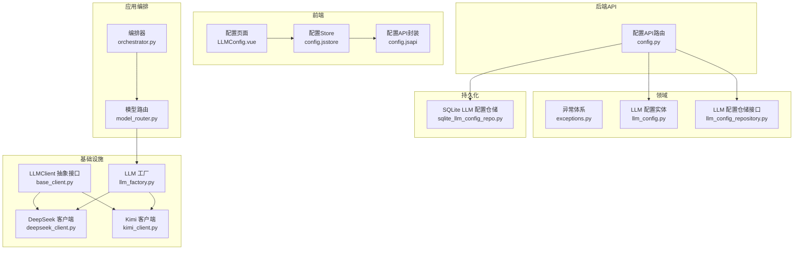
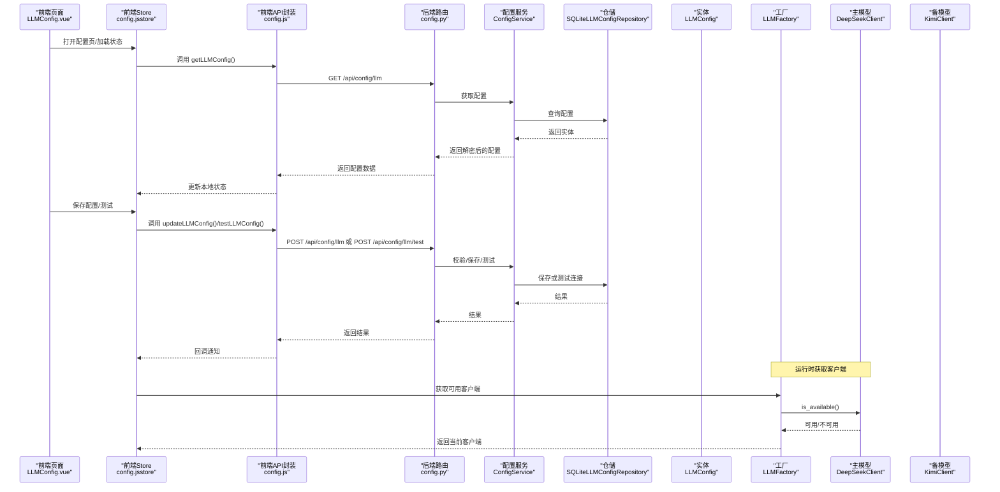
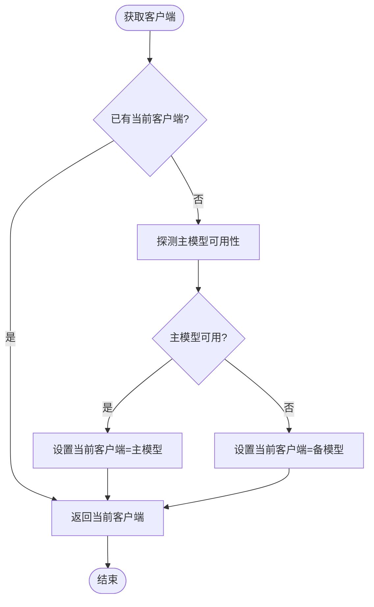
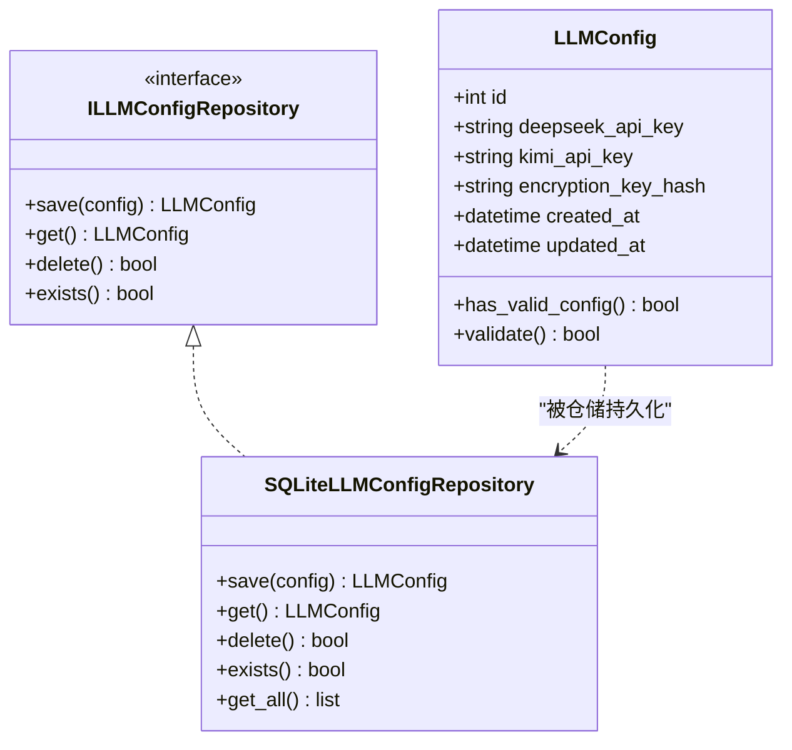
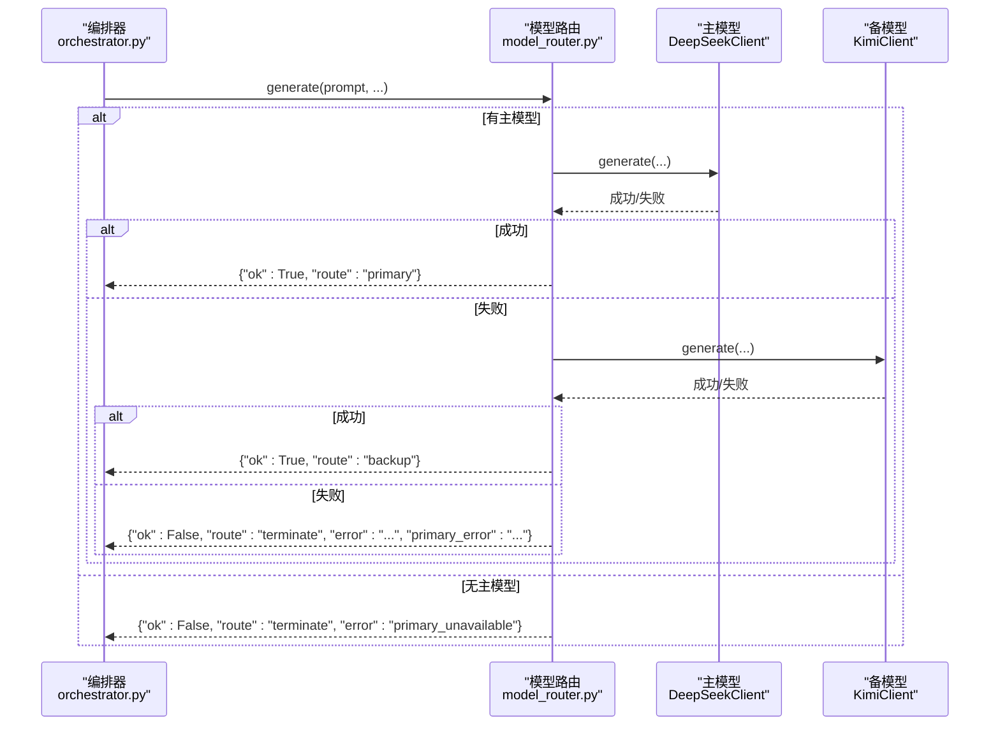
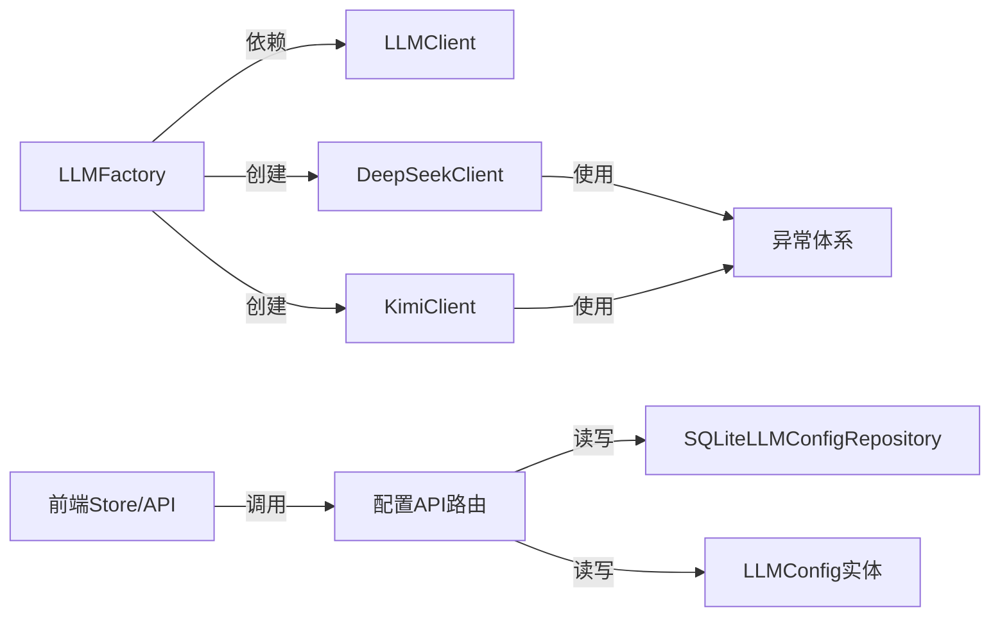

# AI模型集成

<cite>
**本文引用的文件**
- [llm_factory.py](file://infrastructure/llm/llm_factory.py)
- [base_client.py](file://infrastructure/llm/base_client.py)
- [deepseek_client.py](file://infrastructure/llm/deepseek_client.py)
- [kimi_client.py](file://infrastructure/llm/kimi_client.py)
- [llm_config.py](file://domain/entities/llm_config.py)
- [llm_config_repository.py](file://domain/repositories/llm_config_repository.py)
- [exceptions.py](file://domain/exceptions.py)
- [sqlite_llm_config_repo.py](file://infrastructure/persistence/sqlite_llm_config_repo.py)
- [config.py](file://presentation/api/routers/config.py)
- [config.js](file://frontend/src/api/config.js)
- [config.js（store）](file://frontend/src/stores/config.js)
- [LLMConfig.vue](file://frontend/src/views/config/LLMConfig.vue)
- [model_router.py](file://application/agent_mvp/model_router.py)
- [orchestrator.py](file://application/agent_mvp/orchestrator.py)
- [test_llm_client.py](file://tests/unit/test_llm_client.py)
</cite>

## 目录
1. [简介](#简介)
2. [项目结构](#项目结构)
3. [核心组件](#核心组件)
4. [架构总览](#架构总览)
5. [详细组件分析](#详细组件分析)
6. [依赖分析](#依赖分析)
7. [性能考虑](#性能考虑)
8. [故障排查指南](#故障排查指南)
9. [结论](#结论)
10. [附录](#附录)

## 简介
本文件面向InkTrace项目的AI模型集成，系统性阐述基于工厂模式的大模型客户端统一管理方案，详解DeepSeek与Kimi两大模型的接入方式、参数配置、错误处理与主备切换机制；并覆盖LLM配置管理（API密钥、模型参数、调用频率限制）、模型选择策略与性能优化、最佳实践与调试方法，以及如何扩展新的AI模型支持。

## 项目结构
围绕AI模型集成的关键目录与文件如下：
- 基础接口与客户端：infrastructure/llm 下的抽象接口与具体实现
- 工厂与配置：llm_factory、llm_config 实体与仓储
- 异常体系：domain/exceptions 统一错误类型
- 后端API：presentation/api/routers/config 提供配置读写与测试
- 前端配置界面与状态：frontend/src/views/config 与 stores
- 应用编排：application/agent_mvp/model_router 与 orchestrator 的调用链路

图表来源
- [base_client.py:14-83](file://infrastructure/llm/base_client.py#L14-L83)
- [deepseek_client.py:25-238](file://infrastructure/llm/deepseek_client.py#L25-L238)
- [kimi_client.py:25-244](file://infrastructure/llm/kimi_client.py#L25-L244)
- [llm_factory.py:31-121](file://infrastructure/llm/llm_factory.py#L31-L121)
- [exceptions.py:51-100](file://domain/exceptions.py#L51-L100)
- [llm_config.py:15-54](file://domain/entities/llm_config.py#L15-L54)
- [llm_config_repository.py:16-68](file://domain/repositories/llm_config_repository.py#L16-L68)
- [sqlite_llm_config_repo.py:18-145](file://infrastructure/persistence/sqlite_llm_config_repo.py#L18-L145)
- [config.py:19-173](file://presentation/api/routers/config.py#L19-L173)
- [LLMConfig.vue:1-285](file://frontend/src/views/config/LLMConfig.vue#L1-L285)
- [config.js（store）:14-240](file://frontend/src/stores/config.js#L14-L240)
- [config.js:1-240](file://frontend/src/api/config.js#L1-L240)
- [model_router.py:6-42](file://application/agent_mvp/model_router.py#L6-L42)
- [orchestrator.py:17-212](file://application/agent_mvp/orchestrator.py#L17-L212)

章节来源
- [llm_factory.py:1-121](file://infrastructure/llm/llm_factory.py#L1-L121)
- [base_client.py:1-83](file://infrastructure/llm/base_client.py#L1-L83)
- [deepseek_client.py:1-238](file://infrastructure/llm/deepseek_client.py#L1-L238)
- [kimi_client.py:1-244](file://infrastructure/llm/kimi_client.py#L1-L244)
- [llm_config.py:1-54](file://domain/entities/llm_config.py#L1-L54)
- [llm_config_repository.py:1-68](file://domain/repositories/llm_config_repository.py#L1-L68)
- [exceptions.py:1-100](file://domain/exceptions.py#L1-L100)
- [sqlite_llm_config_repo.py:1-145](file://infrastructure/persistence/sqlite_llm_config_repo.py#L1-L145)
- [config.py:1-173](file://presentation/api/routers/config.py#L1-L173)
- [LLMConfig.vue:1-285](file://frontend/src/views/config/LLMConfig.vue#L1-L285)
- [config.js（store）:1-240](file://frontend/src/stores/config.js#L1-L240)
- [config.js:1-240](file://frontend/src/api/config.js#L1-L240)
- [model_router.py:1-42](file://application/agent_mvp/model_router.py#L1-L42)
- [orchestrator.py:1-212](file://application/agent_mvp/orchestrator.py#L1-L212)

## 核心组件
- 抽象接口 LLMClient：定义 generate/chat/model_name/max_context_tokens/is_available 等标准方法，保证不同模型客户端的一致行为契约。
- 具体客户端 DeepSeekClient/KimiClient：分别封装对应平台的API调用、参数组装、重试与错误处理、连接池与可用性探测。
- LLM 工厂 LLMFactory：负责主备模型的按需实例化、可用性检测与切换、当前客户端缓存。
- 配置与仓储：LLMConfig 实体与 SQLiteLLMConfigRepository 提供配置的持久化与查询。
- 异常体系：统一的 LLMClientError 及其子类（APIKeyError、RateLimitError、NetworkError、TokenLimitError）便于上层捕获与处理。
- 前后端配置通道：后端 FastAPI 路由提供配置读取/保存/测试；前端 Store/API 组件完成用户交互与状态同步。

章节来源
- [base_client.py:14-83](file://infrastructure/llm/base_client.py#L14-L83)
- [deepseek_client.py:25-238](file://infrastructure/llm/deepseek_client.py#L25-L238)
- [kimi_client.py:25-244](file://infrastructure/llm/kimi_client.py#L25-L244)
- [llm_factory.py:31-121](file://infrastructure/llm/llm_factory.py#L31-L121)
- [llm_config.py:15-54](file://domain/entities/llm_config.py#L15-L54)
- [sqlite_llm_config_repo.py:18-145](file://infrastructure/persistence/sqlite_llm_config_repo.py#L18-L145)
- [exceptions.py:51-100](file://domain/exceptions.py#L51-L100)
- [config.py:19-173](file://presentation/api/routers/config.py#L19-L173)

## 架构总览
下图展示从前端配置到后端API再到LLM客户端工厂与具体模型的完整调用链与数据流。

图表来源
- [LLMConfig.vue:104-164](file://frontend/src/views/config/LLMConfig.vue#L104-L164)
- [config.js（store）:42-107](file://frontend/src/stores/config.js#L42-L107)
- [config.js:1-240](file://frontend/src/api/config.js#L1-L240)
- [config.py:67-147](file://presentation/api/routers/config.py#L67-L147)
- [sqlite_llm_config_repo.py:92-110](file://infrastructure/persistence/sqlite_llm_config_repo.py#L92-L110)
- [llm_factory.py:78-121](file://infrastructure/llm/llm_factory.py#L78-L121)
- [deepseek_client.py:213-227](file://infrastructure/llm/deepseek_client.py#L213-L227)
- [kimi_client.py:219-227](file://infrastructure/llm/kimi_client.py#L219-L227)

## 详细组件分析

### 工厂模式与主备切换
- 设计要点
  - 抽象接口 LLMClient 统一不同模型客户端的行为契约。
  - LLMFactory 负责延迟创建主/备客户端，并根据 is_available() 决定当前可用客户端。
  - 提供显式切换接口 switch_to_backup/reset_to_primary，便于运行时干预。
- 关键流程
  - 获取客户端：优先检测主模型可用性，否则回退到备模型。
  - 切换逻辑：手动切换或重置为主模型，均基于可用性探测。
- 适用场景
  - 稳定性：主模型故障时自动切备模型。
  - 可运维性：支持强制切换与恢复，便于维护窗口内的主动切换。

图表来源
- [llm_factory.py:78-95](file://infrastructure/llm/llm_factory.py#L78-L95)
- [llm_factory.py:97-121](file://infrastructure/llm/llm_factory.py#L97-L121)
- [deepseek_client.py:213-227](file://infrastructure/llm/deepseek_client.py#L213-L227)
- [kimi_client.py:219-227](file://infrastructure/llm/kimi_client.py#L219-L227)

章节来源
- [llm_factory.py:31-121](file://infrastructure/llm/llm_factory.py#L31-L121)
- [base_client.py:14-83](file://infrastructure/llm/base_client.py#L14-L83)

### DeepSeek 客户端集成
- 能力与特性
  - 支持 generate/chat 接口，可选 system_prompt。
  - 参数：max_tokens、temperature；内部对输入进行字符级截断以控制Token。
  - 连接复用：使用 httpx.AsyncClient 并配置连接池与超时。
  - 错误处理：针对 401、429、5xx 等状态码抛出特定异常；支持指数退避重试。
  - 可用性探测：通过一次短文本生成测试连通性。
- 关键点
  - 基础URL与模型名可配置，默认值见工厂配置。
  - 日志记录便于问题定位。

章节来源
- [deepseek_client.py:25-238](file://infrastructure/llm/deepseek_client.py#L25-L238)

### Kimi（Moonshot）客户端集成
- 能力与特性
  - 与 DeepSeek 类似的接口与错误处理策略。
  - 模型上下文长度根据模型后缀动态判定（如 128k/32k/8k）。
  - 同样具备连接复用、重试与可用性探测。
- 关键点
  - 不同模型族的上下文上限差异，需在调用侧合理设置 max_tokens。

章节来源
- [kimi_client.py:25-244](file://infrastructure/llm/kimi_client.py#L25-L244)

### LLM 配置管理
- 配置实体与仓储
  - LLMConfig 实体包含 DeepSeek/Kimi 密钥、加密密钥哈希与时间戳。
  - ILLMConfigRepository 定义保存/获取/删除/存在性检查接口。
  - SQLiteLLMConfigRepository 提供 SQLite 实现，含建表、CRUD、历史查询。
- 后端API
  - 提供 /api/config/llm 的 GET/POST/DELETE 与 /api/config/llm/test 的测试接口。
  - 依赖注入配置服务，统一处理校验、保存与测试。
- 前端配置界面
  - LLMConfig.vue 展示配置状态、提供删除与测试能力。
  - Store/Api 封装了加载、保存、测试与状态更新逻辑。

图表来源
- [llm_config.py:15-54](file://domain/entities/llm_config.py#L15-L54)
- [llm_config_repository.py:16-68](file://domain/repositories/llm_config_repository.py#L16-L68)
- [sqlite_llm_config_repo.py:18-145](file://infrastructure/persistence/sqlite_llm_config_repo.py#L18-L145)

章节来源
- [llm_config.py:15-54](file://domain/entities/llm_config.py#L15-L54)
- [llm_config_repository.py:16-68](file://domain/repositories/llm_config_repository.py#L16-L68)
- [sqlite_llm_config_repo.py:18-145](file://infrastructure/persistence/sqlite_llm_config_repo.py#L18-L145)
- [config.py:19-173](file://presentation/api/routers/config.py#L19-L173)
- [LLMConfig.vue:1-285](file://frontend/src/views/config/LLMConfig.vue#L1-L285)
- [config.js（store）:14-240](file://frontend/src/stores/config.js#L14-L240)
- [config.js:1-240](file://frontend/src/api/config.js#L1-L240)

### 模型选择策略与应用编排
- 模型路由 ModelRouter
  - 优先尝试主模型 generate；若失败则回退备模型；若两者均失败则终止。
  - 返回结果包含 ok、text、route（primary/backup/terminate）与 primary_error 信息，便于上层决策。
- 编排器 Orchestrator
  - 在工具执行失败时结合可重试标记决定是否重试。
  - 与模型路由配合，形成“主模型优先、备模型兜底”的稳定输出链路。

图表来源
- [model_router.py:11-42](file://application/agent_mvp/model_router.py#L11-L42)
- [orchestrator.py:189-191](file://application/agent_mvp/orchestrator.py#L189-L191)

章节来源
- [model_router.py:6-42](file://application/agent_mvp/model_router.py#L6-L42)
- [orchestrator.py:17-212](file://application/agent_mvp/orchestrator.py#L17-L212)

### 错误处理与异常体系
- 统一异常类型
  - LLMClientError 为基础异常。
  - APIKeyError、RateLimitError、NetworkError、TokenLimitError 分别对应密钥、限流、网络与Token超限。
- 客户端错误映射
  - DeepSeek/Kimi 客户端在收到特定HTTP状态码或网络异常时，抛出对应领域异常，便于上层统一处理。
- 建议处理策略
  - 限流：等待 retry-after 或降低并发。
  - 网络：指数退避重试，必要时切换备模型。
  - Token：缩短输入或调整 max_tokens。

章节来源
- [exceptions.py:51-100](file://domain/exceptions.py#L51-L100)
- [deepseek_client.py:163-193](file://infrastructure/llm/deepseek_client.py#L163-L193)
- [kimi_client.py:169-199](file://infrastructure/llm/kimi_client.py#L169-L199)

## 依赖分析
- 组件耦合
  - 工厂仅依赖抽象接口与具体实现类，保持低耦合。
  - 客户端依赖异常体系与HTTP库，职责清晰。
  - 前后端通过API路由与数据模型解耦。
- 外部依赖
  - httpx 用于异步HTTP请求与连接池。
  - FastAPI/Pydantic 用于后端API与数据校验。
  - Element Plus/Vue/Pinia 用于前端配置界面与状态管理。

图表来源
- [llm_factory.py:14-16](file://infrastructure/llm/llm_factory.py#L14-L16)
- [base_client.py:10-12](file://infrastructure/llm/base_client.py#L10-L12)
- [deepseek_client.py:13-22](file://infrastructure/llm/deepseek_client.py#L13-L22)
- [kimi_client.py:13-22](file://infrastructure/llm/kimi_client.py#L13-L22)
- [config.py:13-16](file://presentation/api/routers/config.py#L13-L16)
- [sqlite_llm_config_repo.py:14-15](file://infrastructure/persistence/sqlite_llm_config_repo.py#L14-L15)
- [llm_config.py:10-12](file://domain/entities/llm_config.py#L10-L12)

章节来源
- [llm_factory.py:14-16](file://infrastructure/llm/llm_factory.py#L14-L16)
- [base_client.py:10-12](file://infrastructure/llm/base_client.py#L10-L12)
- [deepseek_client.py:13-22](file://infrastructure/llm/deepseek_client.py#L13-L22)
- [kimi_client.py:13-22](file://infrastructure/llm/kimi_client.py#L13-L22)
- [config.py:13-16](file://presentation/api/routers/config.py#L13-L16)
- [sqlite_llm_config_repo.py:14-15](file://infrastructure/persistence/sqlite_llm_config_repo.py#L14-L15)
- [llm_config.py:10-12](file://domain/entities/llm_config.py#L10-L12)

## 性能考虑
- 连接复用与并发
  - 客户端使用 httpx.AsyncClient 并配置连接池上限与 keepalive，减少TCP握手开销。
- 超时与重试
  - 合理设置超时与最大重试次数，避免长时间阻塞；对网络与限流错误采用指数退避。
- 输入控制
  - 在客户端内部对输入进行字符级截断，避免Token超限导致的失败与资源浪费。
- 上下文长度
  - 根据模型族选择合适的 max_tokens，避免超出模型上下文上限。
- 主备切换
  - 通过 is_available() 快速探测，减少无效调用；在高负载或限流时主动切换备模型。

## 故障排查指南
- 常见问题定位
  - API密钥错误：检查前端配置页面与后端保存结果；确认密钥格式与权限。
  - 限流：关注 RateLimitError 中的 retry-after；降低并发或等待。
  - 网络异常：检查客户端日志与网络连通性；必要时切换备模型。
  - Token超限：缩短输入或调整 max_tokens；确认模型上下文上限。
- 调试步骤
  - 前端：使用配置页面的“测试”按钮，观察返回结果与错误信息。
  - 后端：通过 /api/config/llm/test 获取各模型连通性测试结果。
  - 客户端：启用更详细的日志级别，观察重试与错误堆栈。
- 单元测试参考
  - 测试覆盖了客户端接口一致性、上下文长度判断与工厂创建逻辑，可作为行为回归依据。

章节来源
- [exceptions.py:58-100](file://domain/exceptions.py#L58-L100)
- [deepseek_client.py:155-193](file://infrastructure/llm/deepseek_client.py#L155-L193)
- [kimi_client.py:161-199](file://infrastructure/llm/kimi_client.py#L161-L199)
- [config.py:126-147](file://presentation/api/routers/config.py#L126-L147)
- [test_llm_client.py:1-133](file://tests/unit/test_llm_client.py#L1-L133)

## 结论
InkTrace 的AI模型集成为后续扩展提供了清晰的抽象与稳定的主备切换机制。通过工厂模式统一管理不同模型客户端，结合完善的异常体系与前后端配置通道，既满足了易用性也兼顾了可靠性。建议在生产环境中进一步完善密钥轮换、限流策略与可观测性指标，持续优化主备切换与重试策略。

## 附录

### 如何扩展新的AI模型支持
- 新增客户端
  - 继承 LLMClient，实现 generate/chat/model_name/max_context_tokens/is_available。
  - 在客户端内完成参数组装、HTTP调用、错误映射与重试策略。
- 注册到工厂
  - 在 LLMFactory 中新增备用客户端的创建逻辑，并在 get_client 中纳入可用性检测。
- 配置与前端
  - 在前端配置页面增加对应字段与校验规则；后端路由与仓储保持一致的数据结构。
- 测试
  - 补充单元测试，覆盖接口一致性、上下文长度与工厂创建逻辑。

章节来源
- [base_client.py:14-83](file://infrastructure/llm/base_client.py#L14-L83)
- [llm_factory.py:31-121](file://infrastructure/llm/llm_factory.py#L31-L121)
- [LLMConfig.vue:1-285](file://frontend/src/views/config/LLMConfig.vue#L1-L285)
- [config.js（store）:75-107](file://frontend/src/stores/config.js#L75-L107)
- [config.py:102-124](file://presentation/api/routers/config.py#L102-L124)