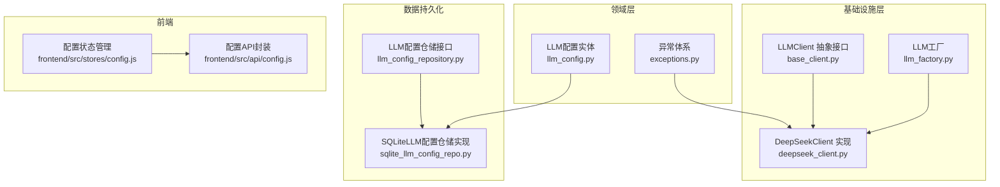
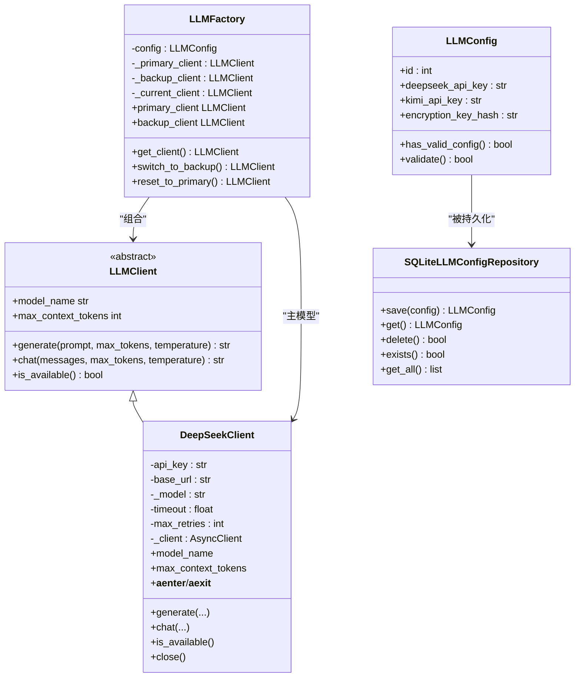
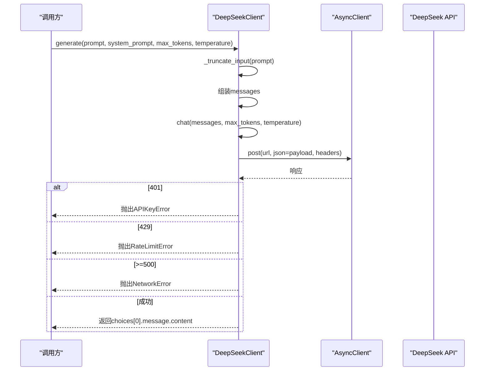
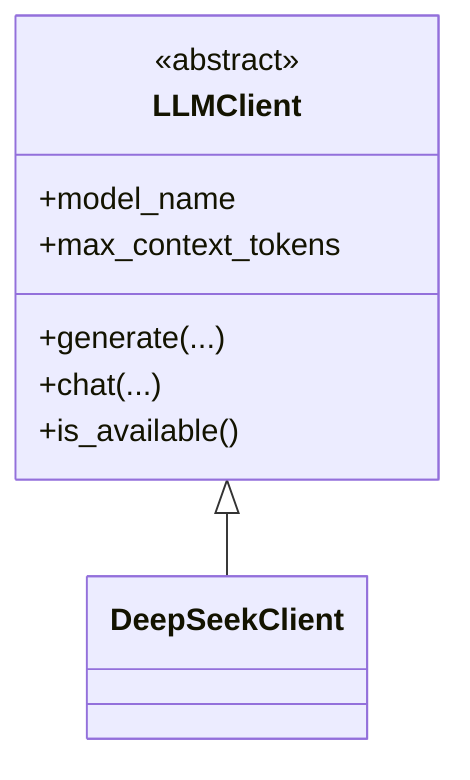
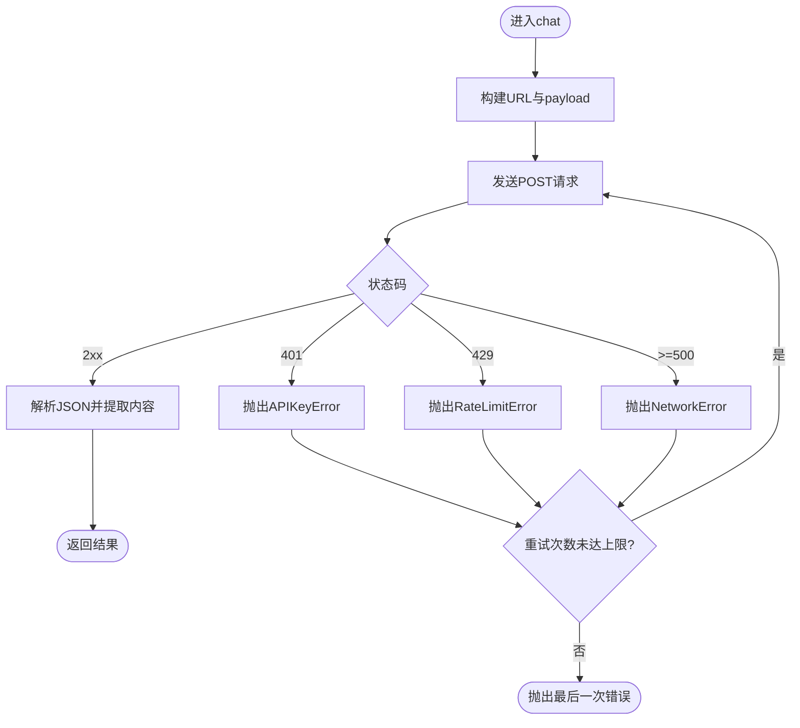
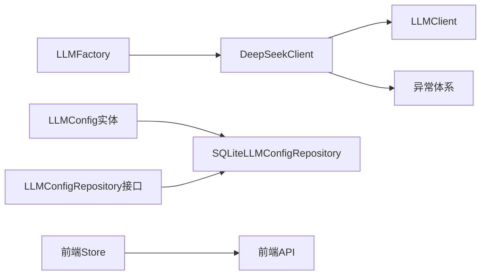

# DeepSeek模型集成

<cite>
**本文引用的文件**
- [deepseek_client.py](file://infrastructure/llm/deepseek_client.py)
- [base_client.py](file://infrastructure/llm/base_client.py)
- [llm_factory.py](file://infrastructure/llm/llm_factory.py)
- [llm_config.py](file://domain/entities/llm_config.py)
- [exceptions.py](file://domain/exceptions.py)
- [sqlite_llm_config_repo.py](file://infrastructure/persistence/sqlite_llm_config_repo.py)
- [llm_config_repository.py](file://domain/repositories/llm_config_repository.py)
- [test_llm_client.py](file://tests/unit/test_llm_client.py)
- [config.js](file://frontend/src/stores/config.js)
- [config.js](file://frontend/src/api/config.js)
</cite>

## 目录
1. [简介](#简介)
2. [项目结构](#项目结构)
3. [核心组件](#核心组件)
4. [架构总览](#架构总览)
5. [详细组件分析](#详细组件分析)
6. [依赖关系分析](#依赖关系分析)
7. [性能考虑](#性能考虑)
8. [故障排查指南](#故障排查指南)
9. [结论](#结论)
10. [附录](#附录)

## 简介
本文件面向InkTrace项目中的DeepSeek模型集成，系统性阐述DeepSeekClient类的实现细节、与基类LLMClient的继承关系、配置项与参数、错误处理策略、性能优化建议以及实际使用示例。文档同时覆盖前端配置存储与后端持久化层，帮助开发者快速理解并正确集成DeepSeek模型。

## 项目结构
与DeepSeek集成相关的关键文件分布如下：
- 基础抽象与具体实现：infrastructure/llm/base_client.py、infrastructure/llm/deepseek_client.py、infrastructure/llm/llm_factory.py
- 领域模型与异常：domain/entities/llm_config.py、domain/exceptions.py
- 数据持久化：infrastructure/persistence/sqlite_llm_config_repo.py、domain/repositories/llm_config_repository.py
- 前端配置：frontend/src/stores/config.js、frontend/src/api/config.js
- 单元测试：tests/unit/test_llm_client.py

图表来源
- [base_client.py:14-83](file://infrastructure/llm/base_client.py#L14-L83)
- [deepseek_client.py:25-238](file://infrastructure/llm/deepseek_client.py#L25-L238)
- [llm_factory.py:31-121](file://infrastructure/llm/llm_factory.py#L31-L121)
- [llm_config.py:15-54](file://domain/entities/llm_config.py#L15-L54)
- [exceptions.py:51-100](file://domain/exceptions.py#L51-L100)
- [llm_config_repository.py:16-68](file://domain/repositories/llm_config_repository.py#L16-L68)
- [sqlite_llm_config_repo.py:18-145](file://infrastructure/persistence/sqlite_llm_config_repo.py#L18-L145)
- [config.js:1-240](file://frontend/src/stores/config.js#L1-L240)
- [config.js:148-191](file://frontend/src/api/config.js#L148-L191)

章节来源
- [base_client.py:14-83](file://infrastructure/llm/base_client.py#L14-L83)
- [deepseek_client.py:25-238](file://infrastructure/llm/deepseek_client.py#L25-L238)
- [llm_factory.py:31-121](file://infrastructure/llm/llm_factory.py#L31-L121)
- [llm_config.py:15-54](file://domain/entities/llm_config.py#L15-L54)
- [exceptions.py:51-100](file://domain/exceptions.py#L51-L100)
- [llm_config_repository.py:16-68](file://domain/repositories/llm_config_repository.py#L16-L68)
- [sqlite_llm_config_repo.py:18-145](file://infrastructure/persistence/sqlite_llm_config_repo.py#L18-L145)
- [config.js:1-240](file://frontend/src/stores/config.js#L1-L240)
- [config.js:148-191](file://frontend/src/api/config.js#L148-L191)

## 核心组件
- DeepSeekClient：基于LLMClient抽象接口的具体实现，负责与DeepSeek API交互，封装请求构建、响应解析、错误处理与重试机制。
- LLMClient：抽象接口，定义generate、chat、model_name、max_context_tokens、is_available等统一能力。
- LLMFactory：工厂类，负责主备模型选择与切换，当前默认主模型为DeepSeekClient。
- LLMConfig：领域实体，承载DeepSeek/Kimi等模型的API密钥与加密密钥哈希等配置信息。
- 异常体系：LLMClientError及其子类（APIKeyError、RateLimitError、NetworkError、TokenLimitError）用于统一错误类型。
- 仓储层：SQLiteLLMConfigRepository实现LLM配置的持久化读写；接口ILLMConfigRepository定义标准契约。
- 前端配置：Pinia Store与API封装负责配置的加载、保存、校验与状态展示。

章节来源
- [deepseek_client.py:25-238](file://infrastructure/llm/deepseek_client.py#L25-L238)
- [base_client.py:14-83](file://infrastructure/llm/base_client.py#L14-L83)
- [llm_factory.py:31-121](file://infrastructure/llm/llm_factory.py#L31-L121)
- [llm_config.py:15-54](file://domain/entities/llm_config.py#L15-L54)
- [exceptions.py:51-100](file://domain/exceptions.py#L51-L100)
- [sqlite_llm_config_repo.py:18-145](file://infrastructure/persistence/sqlite_llm_config_repo.py#L18-L145)
- [llm_config_repository.py:16-68](file://domain/repositories/llm_config_repository.py#L16-L68)
- [config.js:1-240](file://frontend/src/stores/config.js#L1-L240)
- [config.js:148-191](file://frontend/src/api/config.js#L148-L191)

## 架构总览
下图展示了DeepSeekClient在整体架构中的位置与其依赖关系。

图表来源
- [base_client.py:14-83](file://infrastructure/llm/base_client.py#L14-L83)
- [deepseek_client.py:25-238](file://infrastructure/llm/deepseek_client.py#L25-L238)
- [llm_factory.py:31-121](file://infrastructure/llm/llm_factory.py#L31-L121)
- [llm_config.py:15-54](file://domain/entities/llm_config.py#L15-L54)
- [sqlite_llm_config_repo.py:18-145](file://infrastructure/persistence/sqlite_llm_config_repo.py#L18-L145)

## 详细组件分析

### DeepSeekClient 类实现细节
- 继承关系：DeepSeekClient实现LLMClient抽象接口，提供generate与chat两个核心方法，并暴露model_name与max_context_tokens属性。
- 初始化参数：
  - api_key：DeepSeek API密钥
  - base_url：DeepSeek API基础URL，默认值指向官方v1端点
  - model：模型名称，默认“deepseek-chat”
  - timeout：请求超时（秒）
  - max_retries：最大重试次数
- 连接复用：内部使用httpx.AsyncClient，配置了连接池上限与keep-alive连接数，提升并发性能。
- 请求构建：
  - generate：支持system_prompt，内部将prompt与可选system_prompt组装为消息列表，随后调用chat。
  - chat：构造/chat/completions请求，包含model、messages、max_tokens、temperature等参数。
- 错误处理与重试：
  - 对401、429、>=500等状态码进行特定异常抛出
  - 对httpx.TimeoutException与httpx.NetworkError进行捕获并记录日志
  - 最终回退为通用LLMClientError
  - 重试循环最多max_retries次
- 输入截断：_truncate_input对过长输入进行字符级截断，避免超出上下文限制。
- 资源管理：实现异步上下文管理器，支持close释放连接。

图表来源
- [deepseek_client.py:78-193](file://infrastructure/llm/deepseek_client.py#L78-L193)

章节来源
- [deepseek_client.py:25-238](file://infrastructure/llm/deepseek_client.py#L25-L238)

### 与基类LLMClient的关系与继承结构
- LLMClient定义统一接口：generate、chat、model_name、max_context_tokens、is_available。
- DeepSeekClient必须实现上述接口，确保上层逻辑无需关心具体模型差异。
- 工厂模式：LLMFactory通过primary_client/backup_client按可用性选择当前客户端，便于主备切换。

图表来源
- [base_client.py:14-83](file://infrastructure/llm/base_client.py#L14-L83)
- [deepseek_client.py:25-77](file://infrastructure/llm/deepseek_client.py#L25-L77)

章节来源
- [base_client.py:14-83](file://infrastructure/llm/base_client.py#L14-L83)
- [deepseek_client.py:25-77](file://infrastructure/llm/deepseek_client.py#L25-L77)
- [llm_factory.py:31-121](file://infrastructure/llm/llm_factory.py#L31-L121)

### DeepSeek配置选项与参数
- API密钥设置：通过构造函数传入api_key；前端store与API封装提供加载、保存与格式校验。
- 基础URL配置：可通过构造函数传入base_url，默认官方v1端点。
- 模型参数：model、max_tokens、temperature等作为generate/chat的入参。
- 上下文限制：max_context_tokens返回64000，内部还对输入进行字符级截断以进一步控制长度。
- 超时与重试：timeout与max_retries可调，增强稳定性。

章节来源
- [deepseek_client.py:33-76](file://infrastructure/llm/deepseek_client.py#L33-L76)
- [llm_factory.py:19-30](file://infrastructure/llm/llm_factory.py#L19-L30)
- [config.js:75-96](file://frontend/src/stores/config.js#L75-L96)
- [config.js:148-191](file://frontend/src/api/config.js#L148-L191)

### DeepSeek特有能力与限制
- 特有能力：
  - 连接复用与并发控制
  - 重试机制与多类异常细分
  - 输入截断与上下文控制
  - 异步上下文管理器
- 限制：
  - 默认模型上下文为64000 tokens
  - 依赖外部API，需关注网络与配额限制

章节来源
- [deepseek_client.py:71-76](file://infrastructure/llm/deepseek_client.py#L71-L76)
- [deepseek_client.py:195-211](file://infrastructure/llm/deepseek_client.py#L195-L211)

### API调用流程与错误处理策略
- 调用流程：generate -> 组装messages -> chat -> 发送请求 -> 解析响应 -> 返回结果
- 错误处理：
  - 401：抛出APIKeyError
  - 429：抛出RateLimitError（可携带retry-after）
  - >=500：抛出NetworkError
  - 超时/网络异常：记录warning并回退为NetworkError
  - 其他异常：记录error并回退为LLMClientError
- 重试策略：最多max_retries次，每次记录日志并继续尝试

图表来源
- [deepseek_client.py:143-193](file://infrastructure/llm/deepseek_client.py#L143-L193)

章节来源
- [deepseek_client.py:143-193](file://infrastructure/llm/deepseek_client.py#L143-L193)
- [exceptions.py:58-100](file://domain/exceptions.py#L58-L100)

### 性能优化技巧与最佳实践
- 连接池配置：保持httpx.AsyncClient复用，避免频繁建立连接；根据并发量调整max_connections与keep-alive连接数。
- 超时与重试：合理设置timeout与max_retries，平衡稳定性与响应速度。
- 输入控制：利用_char级截断与max_tokens限制，避免超上下文导致的失败与浪费。
- 异步上下文：使用异步上下文管理器确保资源及时释放，防止连接泄漏。
- 主备切换：通过LLMFactory在主模型不可用时自动切换备用模型，提升可用性。

章节来源
- [deepseek_client.py:60-64](file://infrastructure/llm/deepseek_client.py#L60-L64)
- [deepseek_client.py:155-193](file://infrastructure/llm/deepseek_client.py#L155-L193)
- [llm_factory.py:78-95](file://infrastructure/llm/llm_factory.py#L78-L95)

### 配置与持久化
- 领域实体：LLMConfig包含deepseek_api_key、kimi_api_key与encryption_key_hash等字段，并提供has_valid_config与validate校验。
- 仓储接口：ILLMConfigRepository定义save、get、delete、exists等标准方法。
- SQLite实现：SQLiteLLMConfigRepository负责表创建、插入/更新、查询与删除，支持历史配置查询。
- 前端配置：Pinia Store负责加载/保存配置，API封装提供格式校验与状态查询。

章节来源
- [llm_config.py:15-54](file://domain/entities/llm_config.py#L15-L54)
- [llm_config_repository.py:16-68](file://domain/repositories/llm_config_repository.py#L16-L68)
- [sqlite_llm_config_repo.py:18-145](file://infrastructure/persistence/sqlite_llm_config_repo.py#L18-L145)
- [config.js:42-96](file://frontend/src/stores/config.js#L42-L96)
- [config.js:148-191](file://frontend/src/api/config.js#L148-L191)

### 单元测试要点
- 接口一致性：确保DeepSeekClient实现LLMClient接口的所有方法与属性。
- 上下文限制：验证max_context_tokens返回值。
- 工厂行为：验证主/备客户端类型与可用性切换逻辑。

章节来源
- [test_llm_client.py:40-87](file://tests/unit/test_llm_client.py#L40-L87)

## 依赖关系分析
- DeepSeekClient依赖LLMClient抽象接口与异常体系，确保跨模型的一致行为与错误语义。
- LLMFactory组合LLMClient实例，当前默认主模型为DeepSeekClient。
- 仓储层通过接口与实现分离，便于替换不同存储后端。
- 前端通过Store与API封装与后端配置服务对接，完成配置的读取与保存。

图表来源
- [deepseek_client.py:15-22](file://infrastructure/llm/deepseek_client.py#L15-L22)
- [base_client.py:14-83](file://infrastructure/llm/base_client.py#L14-L83)
- [llm_factory.py:31-121](file://infrastructure/llm/llm_factory.py#L31-L121)
- [llm_config.py:15-54](file://domain/entities/llm_config.py#L15-L54)
- [llm_config_repository.py:16-68](file://domain/repositories/llm_config_repository.py#L16-L68)
- [sqlite_llm_config_repo.py:18-145](file://infrastructure/persistence/sqlite_llm_config_repo.py#L18-L145)
- [config.js:1-240](file://frontend/src/stores/config.js#L1-L240)
- [config.js:148-191](file://frontend/src/api/config.js#L148-L191)

章节来源
- [deepseek_client.py:15-22](file://infrastructure/llm/deepseek_client.py#L15-L22)
- [llm_factory.py:31-121](file://infrastructure/llm/llm_factory.py#L31-L121)
- [llm_config_repository.py:16-68](file://domain/repositories/llm_config_repository.py#L16-L68)
- [sqlite_llm_config_repo.py:18-145](file://infrastructure/persistence/sqlite_llm_config_repo.py#L18-L145)
- [config.js:1-240](file://frontend/src/stores/config.js#L1-L240)
- [config.js:148-191](file://frontend/src/api/config.js#L148-L191)

## 性能考虑
- 连接复用：使用AsyncClient并配置连接池上限与keep-alive连接数，减少握手开销。
- 超时与重试：合理设置timeout与max_retries，避免长时间阻塞；在高并发场景下适当降低timeout。
- 输入控制：在上游阶段尽量控制输入长度，减少不必要的截断与重试。
- 异步上下文：确保在使用完成后调用close或使用异步上下文管理器，避免连接泄漏。
- 主备切换：在主模型不稳定时自动切换备用模型，提高整体可用性。

[本节为通用指导，无需列出章节来源]

## 故障排查指南
- API密钥无效（401）：检查前端配置保存是否成功，确认密钥格式与有效期；必要时重新生成并保存。
- 限流（429）：根据响应头retry-after等待后再试；若持续限流，考虑降低并发或调整重试策略。
- 网络错误（>=500）：检查网络连通性与代理设置；观察日志中的错误详情，必要时重试或切换备用模型。
- 超时/网络异常：增大timeout或减少并发；检查防火墙与DNS设置。
- 上下文超限：减少max_tokens或缩短输入；确认_deepseek_client.py中的字符截断阈值是否合适。
- 资源泄漏：确保使用异步上下文管理器或显式调用close释放连接。

章节来源
- [deepseek_client.py:163-172](file://infrastructure/llm/deepseek_client.py#L163-L172)
- [deepseek_client.py:182-190](file://infrastructure/llm/deepseek_client.py#L182-L190)
- [exceptions.py:58-100](file://domain/exceptions.py#L58-L100)

## 结论
DeepSeekClient在InkTrace中提供了稳定、可扩展的模型接入能力：通过抽象接口与工厂模式实现跨模型统一访问，通过连接复用、重试与错误细分提升鲁棒性，结合前端配置与后端持久化形成完整的配置生命周期。遵循本文的配置、错误处理与性能优化建议，可有效提升DeepSeek模型在项目中的可用性与稳定性。

[本节为总结性内容，无需列出章节来源]

## 附录

### API调用示例（步骤说明）
- 初始化客户端：传入api_key、base_url、model、timeout、max_retries
- 调用generate：传入prompt、可选system_prompt、max_tokens、temperature
- 调用chat：直接传入messages数组、max_tokens、temperature
- 资源释放：使用异步上下文管理器或显式调用close

章节来源
- [deepseek_client.py:33-115](file://infrastructure/llm/deepseek_client.py#L33-L115)
- [deepseek_client.py:222-237](file://infrastructure/llm/deepseek_client.py#L222-L237)

### 配置示例（步骤说明）
- 前端保存：校验至少配置一个API密钥，格式符合要求后提交保存
- 后端持久化：LLMConfig实体保存到SQLite，包含加密密钥哈希
- 加载与验证：前端加载配置并显示状态，后端提供has_valid_config与validate

章节来源
- [config.js:75-96](file://frontend/src/stores/config.js#L75-L96)
- [config.js:148-191](file://frontend/src/api/config.js#L148-L191)
- [llm_config.py:39-54](file://domain/entities/llm_config.py#L39-L54)
- [sqlite_llm_config_repo.py:50-90](file://infrastructure/persistence/sqlite_llm_config_repo.py#L50-L90)