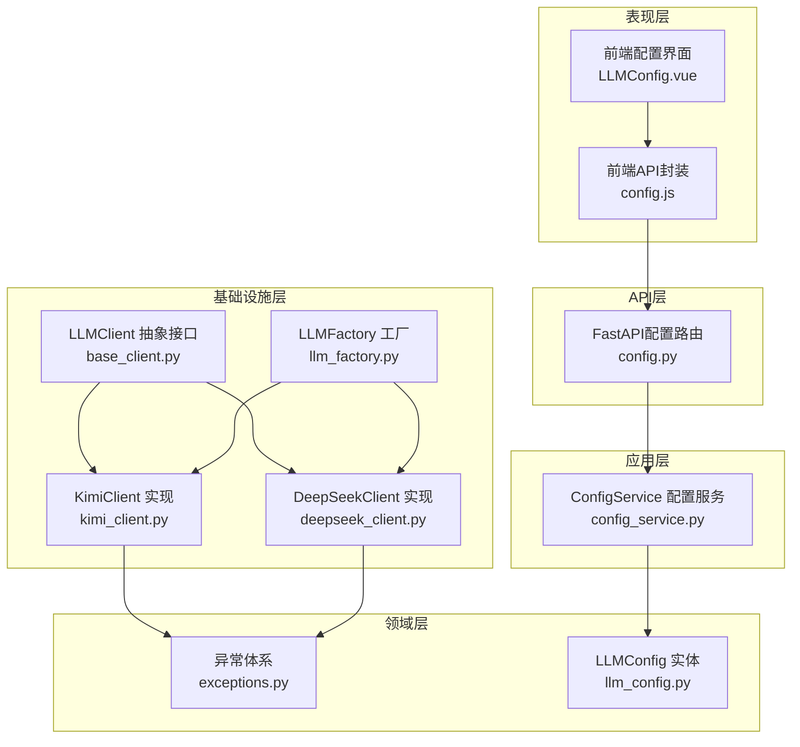
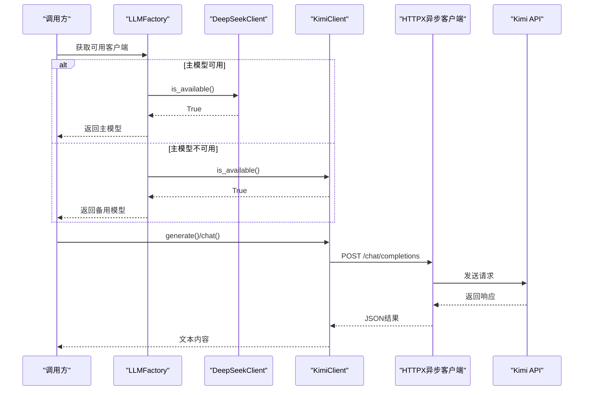
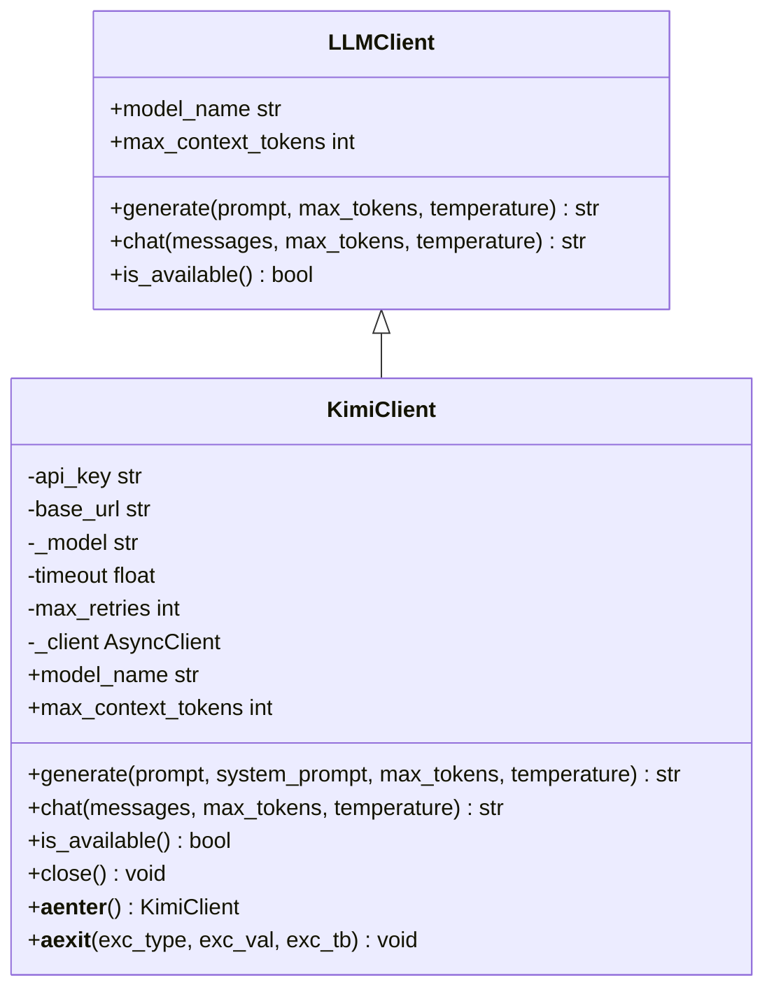
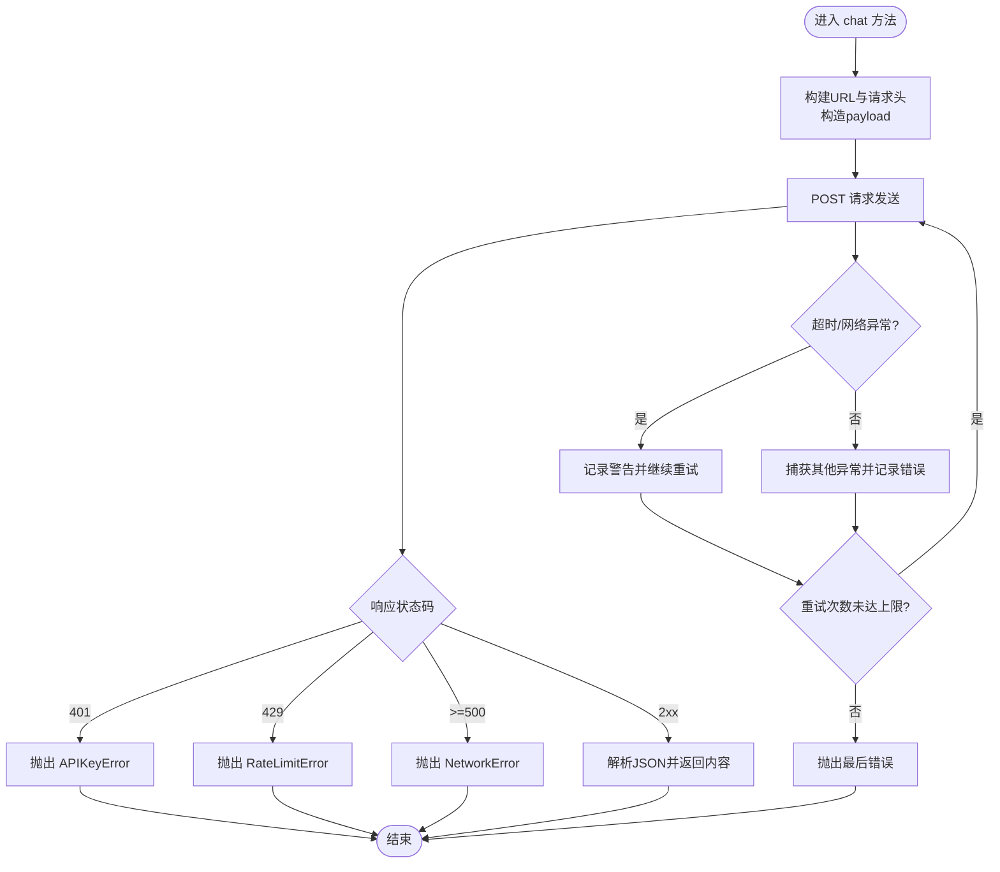
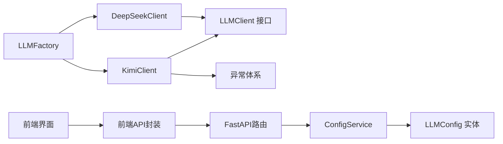

# Kimi模型集成

<cite>
**本文引用的文件**
- [kimi_client.py](file://infrastructure/llm/kimi_client.py)
- [base_client.py](file://infrastructure/llm/base_client.py)
- [deepseek_client.py](file://infrastructure/llm/deepseek_client.py)
- [llm_factory.py](file://infrastructure/llm/llm_factory.py)
- [exceptions.py](file://domain/exceptions.py)
- [config_service.py](file://application/services/config_service.py)
- [llm_config.py](file://domain/entities/llm_config.py)
- [test_llm_client.py](file://tests/unit/test_llm_client.py)
- [config.js](file://frontend/src/api/config.js)
- [LLMConfig.vue](file://frontend/src/views/config/LLMConfig.vue)
- [config.py](file://presentation/api/routers/config.py)
</cite>

## 目录
1. [简介](#简介)
2. [项目结构](#项目结构)
3. [核心组件](#核心组件)
4. [架构总览](#架构总览)
5. [详细组件分析](#详细组件分析)
6. [依赖分析](#依赖分析)
7. [性能考虑](#性能考虑)
8. [故障排查指南](#故障排查指南)
9. [结论](#结论)
10. [附录](#附录)

## 简介
本文件面向InkTrace项目中的Kimi（Moonshot）模型集成，系统性阐述KimiClient类的实现细节、与基类LLMClient的关系、配置项与参数、错误处理策略、性能优化与最佳实践，并对比DeepSeek模型的差异与选择策略。文档同时提供API调用流程图、类关系图与数据流图，帮助开发者快速理解与正确使用Kimi模型。

## 项目结构
Kimi模型集成位于基础设施层的LLM子系统中，采用“抽象接口 + 具体实现 + 工厂 + 异常体系”的分层设计：
- 抽象接口：LLMClient（定义统一的generate/chat接口）
- 具体实现：KimiClient、DeepSeekClient（分别对接Kimi与DeepSeek）
- 工厂：LLMFactory（主备模型切换与客户端获取）
- 异常：Domain层异常（APIKeyError、RateLimitError、NetworkError、TokenLimitError）
- 配置：ConfigService、LLMConfig实体、FastAPI路由与前端界面

图表来源
- [base_client.py:14-83](file://infrastructure/llm/base_client.py#L14-L83)
- [kimi_client.py:25-244](file://infrastructure/llm/kimi_client.py#L25-L244)
- [deepseek_client.py:25-238](file://infrastructure/llm/deepseek_client.py#L25-L238)
- [llm_factory.py:31-121](file://infrastructure/llm/llm_factory.py#L31-L121)
- [exceptions.py:51-100](file://domain/exceptions.py#L51-L100)
- [llm_config.py:15-54](file://domain/entities/llm_config.py#L15-L54)
- [config_service.py:19-151](file://application/services/config_service.py#L19-L151)
- [config.js:55-102](file://frontend/src/api/config.js#L55-L102)
- [config.py:20-185](file://presentation/api/routers/config.py#L20-L185)

章节来源
- [kimi_client.py:1-244](file://infrastructure/llm/kimi_client.py#L1-L244)
- [base_client.py:1-83](file://infrastructure/llm/base_client.py#L1-L83)
- [llm_factory.py:1-121](file://infrastructure/llm/llm_factory.py#L1-L121)

## 核心组件
- KimiClient：Kimi（Moonshot）API的异步客户端，支持连接复用、重试机制、系统提示与Token控制。
- LLMClient：抽象接口，定义generate/chat/model_name/max_context_tokens/is_available等标准能力。
- LLMFactory：主备模型工厂，优先使用DeepSeek，失败时自动切换到Kimi。
- 异常体系：统一的LLM客户端异常类型，便于上层捕获与处理。
- 配置服务：负责配置的保存、读取、解密与连接测试。

章节来源
- [kimi_client.py:25-244](file://infrastructure/llm/kimi_client.py#L25-L244)
- [base_client.py:14-83](file://infrastructure/llm/base_client.py#L14-L83)
- [llm_factory.py:31-121](file://infrastructure/llm/llm_factory.py#L31-L121)
- [exceptions.py:51-100](file://domain/exceptions.py#L51-L100)
- [config_service.py:19-151](file://application/services/config_service.py#L19-L151)

## 架构总览
Kimi模型集成遵循“接口抽象 + 具体实现 + 工厂切换 + 异常处理 + 配置管理”的架构模式。客户端通过HTTPX异步客户端发起请求，统一处理401、429、5xx等错误码，并在失败时按策略重试或切换备用模型。

图表来源
- [llm_factory.py:78-95](file://infrastructure/llm/llm_factory.py#L78-L95)
- [kimi_client.py:149-199](file://infrastructure/llm/kimi_client.py#L149-L199)

## 详细组件分析

### KimiClient 类分析
- 继承关系：KimiClient 继承自 LLMClient，实现统一接口。
- 关键属性与行为：
  - 初始化参数：api_key、base_url、model、timeout、max_retries
  - 连接复用：使用httpx.AsyncClient，配置超时与连接池
  - 上下文Token上限：根据模型后缀自动推断（8k/32k/128k）
  - 文本生成：generate(prompt, system_prompt, max_tokens, temperature)
  - 对话生成：chat(messages, max_tokens, temperature)
  - 输入截断：_truncate_input，防止过长输入导致Token超限
  - 可用性检测：is_available
  - 资源管理：close/__aenter__/__aexit__

图表来源
- [base_client.py:14-83](file://infrastructure/llm/base_client.py#L14-L83)
- [kimi_client.py:25-244](file://infrastructure/llm/kimi_client.py#L25-L244)

章节来源
- [kimi_client.py:33-82](file://infrastructure/llm/kimi_client.py#L33-L82)
- [kimi_client.py:84-121](file://infrastructure/llm/kimi_client.py#L84-L121)
- [kimi_client.py:123-199](file://infrastructure/llm/kimi_client.py#L123-L199)
- [kimi_client.py:201-217](file://infrastructure/llm/kimi_client.py#L201-L217)
- [kimi_client.py:219-244](file://infrastructure/llm/kimi_client.py#L219-L244)

### Kimi API 调用流程
- 构建请求：拼接base_url与/chat/completions，设置Authorization与Content-Type，构造payload（model、messages、max_tokens、temperature）。
- 发起请求：使用复用的AsyncClient.post。
- 错误处理：对401（APIKeyError）、429（RateLimitError）、>=500（NetworkError）进行分类处理；其他异常包装为LLMClientError。
- 结果解析：从JSON中提取choices[0].message.content。

图表来源
- [kimi_client.py:149-199](file://infrastructure/llm/kimi_client.py#L149-L199)

章节来源
- [kimi_client.py:149-199](file://infrastructure/llm/kimi_client.py#L149-L199)

### Kimi 配置选项与参数
- 基础配置
  - api_key：Kimi API密钥
  - base_url：Kimi API基础URL，默认为 https://api.moonshot.cn/v1
  - model：模型名称，默认 moonshot-v1-8k
  - timeout：请求超时（秒），默认120
  - max_retries：最大重试次数，默认3
- 上下文Token上限
  - 根据模型名称后缀自动判断：128k/32k/8k，分别对应131072/32768/8192
- 参数说明
  - max_tokens：最大生成Token数
  - temperature：采样温度
  - system_prompt：可选的系统提示词

章节来源
- [kimi_client.py:33-82](file://infrastructure/llm/kimi_client.py#L33-L82)
- [kimi_client.py:72-82](file://infrastructure/llm/kimi_client.py#L72-L82)

### 与基类 LLMClient 的关系
- KimiClient实现了LLMClient定义的所有抽象方法，保证了统一的调用方式。
- 通过model_name与max_context_tokens属性，向上层暴露模型信息与上下文限制。

章节来源
- [base_client.py:21-82](file://infrastructure/llm/base_client.py#L21-L82)
- [kimi_client.py:66-79](file://infrastructure/llm/kimi_client.py#L66-L79)

### Kimi 特有的功能与API特性
- 连接复用：使用httpx.AsyncClient，配置超时与连接池，提升并发性能。
- 重试机制：在超时或网络异常时按max_retries进行重试。
- 输入截断：_truncate_input对过长输入进行截断，避免Token超限。
- 可用性检测：is_available通过一次短文本生成测试模型连通性。
- 异步上下文管理：支持with语句自动释放资源。

章节来源
- [kimi_client.py:60-64](file://infrastructure/llm/kimi_client.py#L60-L64)
- [kimi_client.py:161-199](file://infrastructure/llm/kimi_client.py#L161-L199)
- [kimi_client.py:201-217](file://infrastructure/llm/kimi_client.py#L201-L217)
- [kimi_client.py:219-226](file://infrastructure/llm/kimi_client.py#L219-L226)
- [kimi_client.py:235-243](file://infrastructure/llm/kimi_client.py#L235-L243)

### API 调用示例与错误处理策略
- 示例路径
  - 文本生成：[generate 方法:84-121](file://infrastructure/llm/kimi_client.py#L84-L121)
  - 对话生成：[chat 方法:123-199](file://infrastructure/llm/kimi_client.py#L123-L199)
  - 可用性检测：[is_available 方法:219-226](file://infrastructure/llm/kimi_client.py#L219-L226)
- 错误处理
  - APIKeyError：401未授权
  - RateLimitError：429限流，支持retry-after
  - NetworkError：>=500服务器错误或网络异常
  - LLMClientError：其他未预期错误
- 重试策略
  - 超时/网络异常时按max_retries重试，记录警告日志
  - 重试间隔由HTTPX内部策略与超时配置共同决定

章节来源
- [kimi_client.py:168-199](file://infrastructure/llm/kimi_client.py#L168-L199)
- [exceptions.py:58-100](file://domain/exceptions.py#L58-L100)

### 与 DeepSeek 模型的差异与选择策略
- 差异点
  - 基础URL与模型名称：Kimi使用moonshot前缀，DeepSeek使用deepseek前缀
  - 上下文Token上限：DeepSeek固定64k，Kimi按模型后缀动态计算
  - 工厂默认主备策略：LLMFactory默认优先DeepSeek，失败再切Kimi
- 选择策略
  - 同时配置两个密钥以获得高可用性
  - 根据任务复杂度选择Kimi的128k/32k模型以容纳更长上下文
  - 在网络不稳定场景下，Kimi的重试机制与连接池有助于提升稳定性

章节来源
- [deepseek_client.py:33-76](file://infrastructure/llm/deepseek_client.py#L33-L76)
- [llm_factory.py:59-95](file://infrastructure/llm/llm_factory.py#L59-L95)

## 依赖分析
- 组件耦合
  - KimiClient依赖LLMClient接口与Domain异常体系
  - LLMFactory依赖具体实现类以实现主备切换
  - 配置服务依赖仓储与加密服务，向上提供配置存取与测试能力
- 外部依赖
  - httpx：异步HTTP客户端
  - FastAPI：配置API路由
  - Element Plus/Vue：前端配置界面

图表来源
- [kimi_client.py:15-22](file://infrastructure/llm/kimi_client.py#L15-L22)
- [base_client.py:14-15](file://infrastructure/llm/base_client.py#L14-L15)
- [llm_factory.py:14-16](file://infrastructure/llm/llm_factory.py#L14-L16)
- [config_service.py:14-28](file://application/services/config_service.py#L14-L28)
- [llm_config.py:15-24](file://domain/entities/llm_config.py#L15-L24)
- [config.py:10-17](file://presentation/api/routers/config.py#L10-L17)
- [config.js:55-102](file://frontend/src/api/config.js#L55-L102)

章节来源
- [kimi_client.py:15-22](file://infrastructure/llm/kimi_client.py#L15-L22)
- [llm_factory.py:14-16](file://infrastructure/llm/llm_factory.py#L14-L16)
- [config_service.py:14-28](file://application/services/config_service.py#L14-L28)
- [config.py:10-17](file://presentation/api/routers/config.py#L10-L17)

## 性能考虑
- 连接复用：使用httpx.AsyncClient并配置超时与连接池，减少TCP握手开销
- 重试策略：在超时/网络异常时按max_retries重试，避免瞬时波动影响
- 输入截断：_truncate_input限制输入长度，降低Token超限风险
- 上下文选择：根据任务需求选择合适模型（8k/32k/128k），平衡成本与效果
- 并发与超时：合理设置timeout与max_retries，避免长时间阻塞

章节来源
- [kimi_client.py:60-64](file://infrastructure/llm/kimi_client.py#L60-L64)
- [kimi_client.py:161-199](file://infrastructure/llm/kimi_client.py#L161-L199)
- [kimi_client.py:201-217](file://infrastructure/llm/kimi_client.py#L201-L217)

## 故障排查指南
- 常见错误与定位
  - APIKeyError：检查api_key是否正确且未过期
  - RateLimitError：关注retry-after字段，等待后重试
  - NetworkError：检查网络连通性与代理设置
  - LLMClientError：查看日志中的原始错误信息
- 自检与恢复
  - 使用is_available进行连通性测试
  - 工厂自动切换：主模型不可用时自动切换到备用模型
  - 资源释放：确保在异常情况下调用close或使用异步上下文管理器

章节来源
- [kimi_client.py:168-199](file://infrastructure/llm/kimi_client.py#L168-L199)
- [kimi_client.py:219-226](file://infrastructure/llm/kimi_client.py#L219-L226)
- [llm_factory.py:89-95](file://infrastructure/llm/llm_factory.py#L89-L95)

## 结论
Kimi模型集成通过清晰的接口抽象、完善的错误处理与重试机制、以及主备切换策略，为InkTrace提供了稳定可靠的文本生成能力。结合DeepSeek的互补特性与统一的配置管理，用户可以在不同场景下灵活选择与切换模型，获得更好的写作体验。

## 附录

### 配置与使用要点
- 配置项
  - api_key：Kimi API密钥
  - base_url：Kimi API基础URL
  - model：Kimi模型名称（如moonshot-v1-8k/32k/128k）
  - timeout/max_retries：请求超时与重试次数
- 前端配置界面
  - 提供API密钥输入、保存、删除与连接测试功能
  - 展示配置状态与更新时间
- API路由
  - GET /api/config/llm：获取配置
  - POST /api/config/llm：更新配置
  - POST /api/config/llm/test：测试连接
  - DELETE /api/config/llm：删除配置
  - GET /api/config/llm/exists：检查配置是否存在

章节来源
- [LLMConfig.vue:1-285](file://frontend/src/views/config/LLMConfig.vue#L1-L285)
- [config.js:55-102](file://frontend/src/api/config.js#L55-L102)
- [config.py:72-185](file://presentation/api/routers/config.py#L72-L185)

### 单元测试参考
- 测试覆盖
  - 客户端初始化与上下文Token上限
  - 工厂主备模型获取
  - 接口一致性与模拟实现
- 测试文件路径
  - [test_llm_client.py:1-134](file://tests/unit/test_llm_client.py#L1-L134)

章节来源
- [test_llm_client.py:61-87](file://tests/unit/test_llm_client.py#L61-L87)
- [test_llm_client.py:89-117](file://tests/unit/test_llm_client.py#L89-L117)
- [test_llm_client.py:120-130](file://tests/unit/test_llm_client.py#L120-L130)