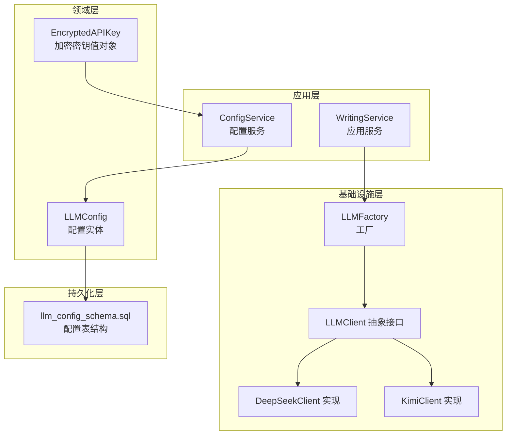
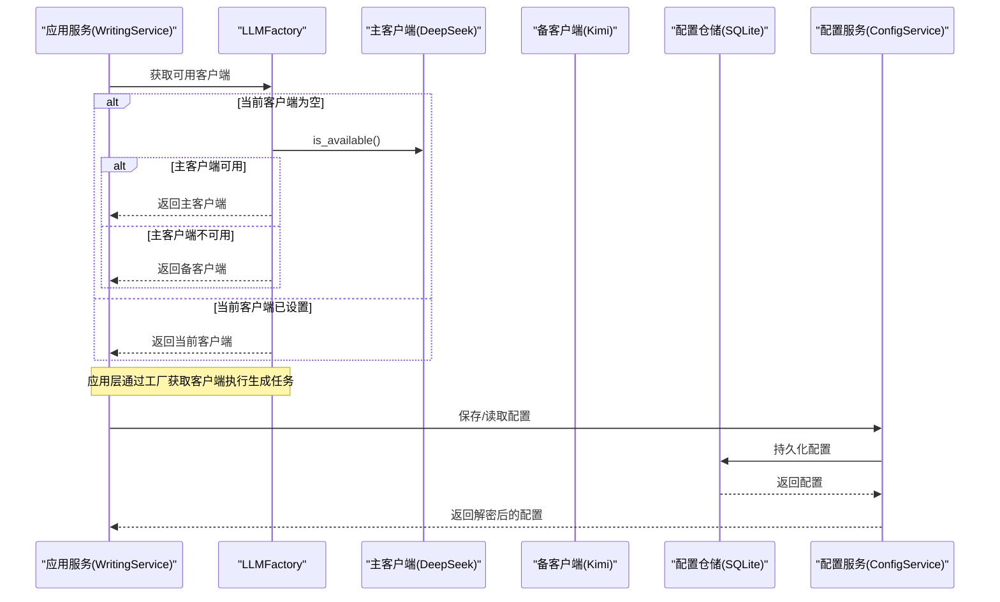
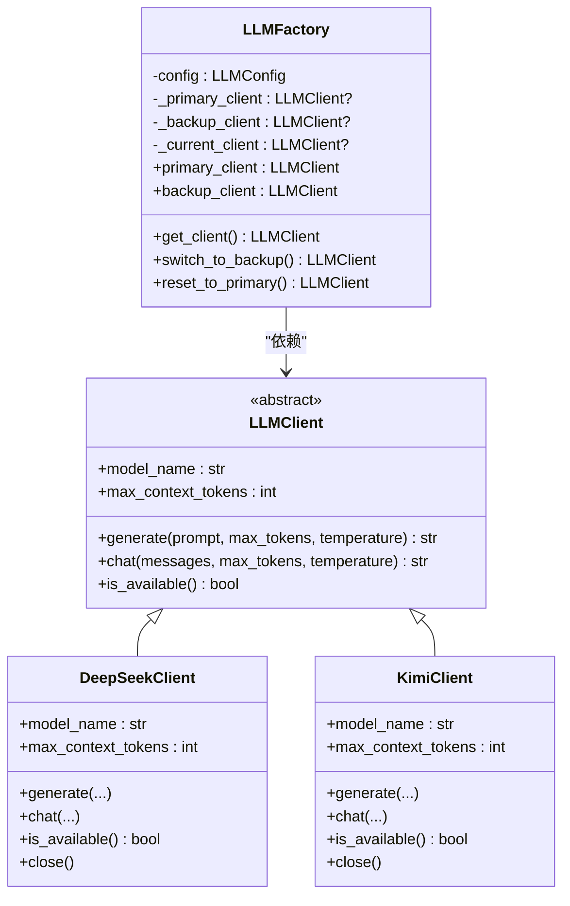
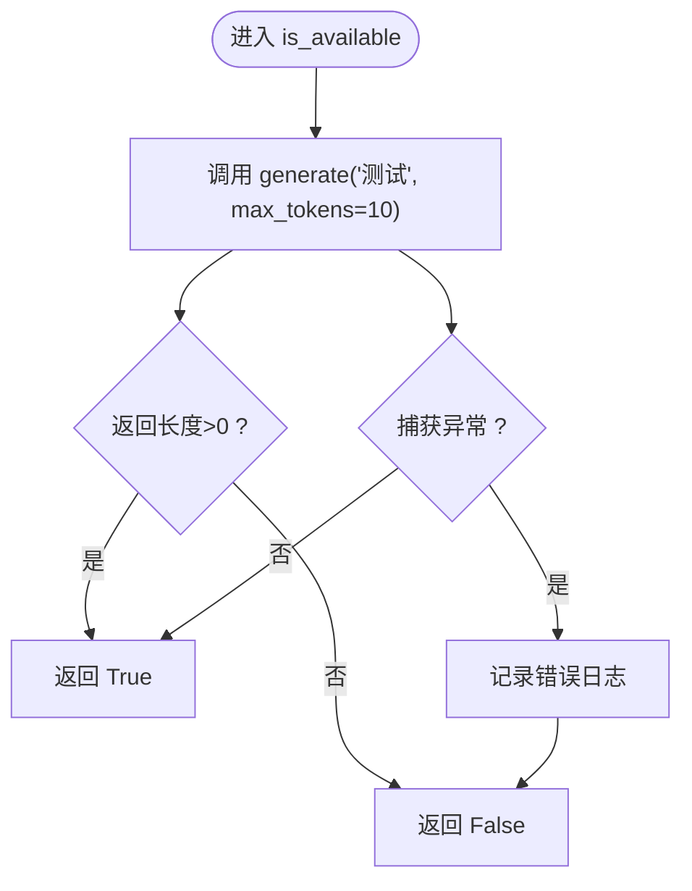
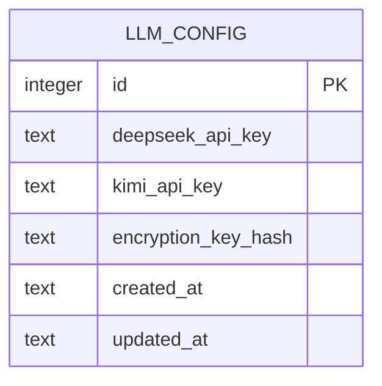
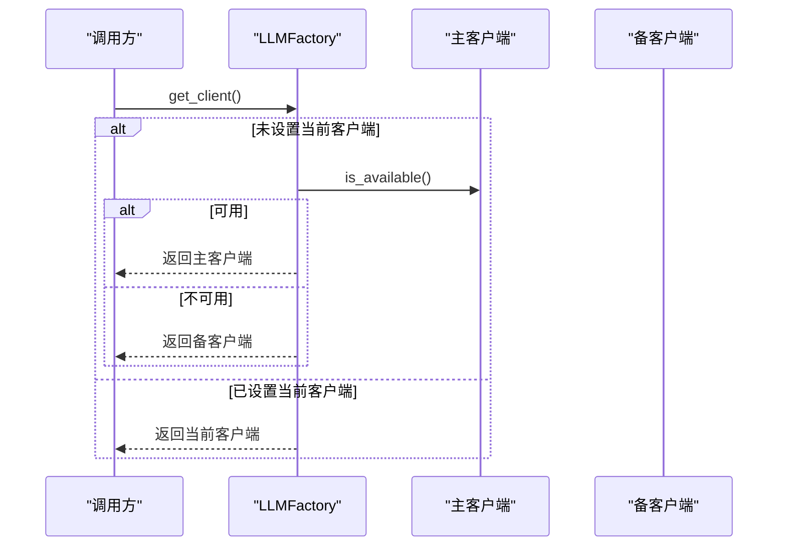
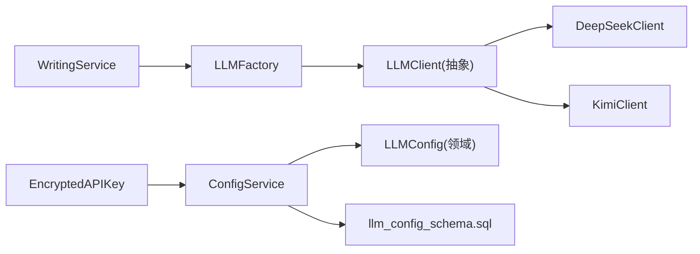

# LLM客户端工厂

<cite>
**本文引用的文件**
- [llm_factory.py](file://infrastructure/llm/llm_factory.py)
- [base_client.py](file://infrastructure/llm/base_client.py)
- [deepseek_client.py](file://infrastructure/llm/deepseek_client.py)
- [kimi_client.py](file://infrastructure/llm/kimi_client.py)
- [llm_config.py](file://domain/entities/llm_config.py)
- [llm_config_schema.sql](file://infrastructure/persistence/llm_config_schema.sql)
- [config_service.py](file://application/services/config_service.py)
- [writing_service.py](file://application/services/writing_service.py)
- [config.py](file://presentation/api/routers/config.py)
- [test_llm_client.py](file://tests/unit/test_llm_client.py)
- [test_llm_config.py](file://tests/unit/test_llm_config.py)
- [exceptions.py](file://domain/exceptions.py)
- [encrypted_api_key.py](file://domain/value_objects/encrypted_api_key.py)
</cite>

## 目录
1. [简介](#简介)
2. [项目结构](#项目结构)
3. [核心组件](#核心组件)
4. [架构总览](#架构总览)
5. [详细组件分析](#详细组件分析)
6. [依赖关系分析](#依赖关系分析)
7. [性能考量](#性能考量)
8. [故障排查指南](#故障排查指南)
9. [结论](#结论)
10. [附录](#附录)

## 简介
本技术文档围绕 InkTrace 项目的 LLM 客户端工厂展开，系统性阐述工厂模式在 AI 模型管理中的应用，重点解析 LLMFactory 类的设计架构与实现原理；详细说明主备模型切换机制的工作流程，包括客户端初始化、可用性检测、自动切换策略等；介绍 LLMConfig 配置类的作用与配置项说明；解释延迟初始化模式如何按需创建与缓存客户端实例；并提供工厂模式的最佳实践与扩展指南，辅以具体代码示例与使用场景。

## 项目结构
InkTrace 的 LLM 工厂位于基础设施层，采用“接口 + 多实现 + 工厂”的分层设计：
- 接口层：抽象出统一的 LLMClient 接口，屏蔽不同供应商 API 的差异
- 实现层：分别实现 DeepSeek 与 Kimi 的具体客户端
- 工厂层：LLMFactory 负责主备模型的创建、缓存与切换
- 配置层：Domain 层的 LLMConfig 实体与应用层 ConfigService 协同，负责配置的持久化、加解密与校验
- 应用服务：WritingService 等业务服务通过工厂获取客户端，完成写作引擎的调用

图表来源
- [llm_factory.py:31-121](file://infrastructure/llm/llm_factory.py#L31-L121)
- [base_client.py:14-83](file://infrastructure/llm/base_client.py#L14-L83)
- [deepseek_client.py:25-238](file://infrastructure/llm/deepseek_client.py#L25-L238)
- [kimi_client.py:25-244](file://infrastructure/llm/kimi_client.py#L25-L244)
- [llm_config.py:15-54](file://domain/entities/llm_config.py#L15-L54)
- [llm_config_schema.sql:4-15](file://infrastructure/persistence/llm_config_schema.sql#L4-L15)
- [config_service.py:19-151](file://application/services/config_service.py#L19-L151)
- [writing_service.py:30-180](file://application/services/writing_service.py#L30-L180)

章节来源
- [llm_factory.py:1-121](file://infrastructure/llm/llm_factory.py#L1-L121)
- [base_client.py:1-83](file://infrastructure/llm/base_client.py#L1-L83)
- [deepseek_client.py:1-238](file://infrastructure/llm/deepseek_client.py#L1-L238)
- [kimi_client.py:1-244](file://infrastructure/llm/kimi_client.py#L1-L244)
- [llm_config.py:1-54](file://domain/entities/llm_config.py#L1-L54)
- [llm_config_schema.sql:1-31](file://infrastructure/persistence/llm_config_schema.sql#L1-L31)
- [config_service.py:1-151](file://application/services/config_service.py#L1-L151)
- [writing_service.py:1-180](file://application/services/writing_service.py#L1-L180)

## 核心组件
- LLMClient 抽象接口：定义 generate/chat/model_name/max_context_tokens/is_available 等统一方法，确保不同供应商客户端的一致性
- DeepSeekClient/KimiClient：具体实现，封装 HTTP 客户端复用、重试机制、错误分类与可用性检测
- LLMFactory：工厂类，负责主备客户端的延迟初始化、当前客户端选择与切换
- LLMConfig：配置实体，承载各供应商 API 密钥、基础地址与模型名等信息
- ConfigService：应用服务，负责配置的保存、读取、加解密与校验，并提供连接测试能力
- 异常体系：LLMClientError 及其子类（APIKeyError、RateLimitError、NetworkError、TokenLimitError），用于统一错误处理

章节来源
- [base_client.py:14-83](file://infrastructure/llm/base_client.py#L14-L83)
- [deepseek_client.py:25-238](file://infrastructure/llm/deepseek_client.py#L25-L238)
- [kimi_client.py:25-244](file://infrastructure/llm/kimi_client.py#L25-L244)
- [llm_factory.py:31-121](file://infrastructure/llm/llm_factory.py#L31-L121)
- [llm_config.py:15-54](file://domain/entities/llm_config.py#L15-L54)
- [config_service.py:19-151](file://application/services/config_service.py#L19-L151)
- [exceptions.py:51-100](file://domain/exceptions.py#L51-L100)

## 架构总览
下图展示 LLM 工厂在系统中的角色与交互关系，以及主备切换的典型流程。

图表来源
- [writing_service.py:69-107](file://application/services/writing_service.py#L69-L107)
- [llm_factory.py:78-121](file://infrastructure/llm/llm_factory.py#L78-L121)
- [config_service.py:30-87](file://application/services/config_service.py#L30-L87)
- [llm_config_schema.sql:4-15](file://infrastructure/persistence/llm_config_schema.sql#L4-L15)

## 详细组件分析

### LLMFactory 工厂类
- 设计目标：统一管理主备模型客户端，提供延迟初始化与自动切换能力
- 关键属性与职责
  - config：注入 LLMConfig，驱动客户端创建
  - _primary_client/_backup_client/_current_client：三态缓存，避免重复创建
- 核心方法
  - primary_client/backup_client：延迟初始化，首次访问才创建对应客户端
  - get_client：优先返回可用客户端；若当前未设置，则先检测主客户端可用性，否则回退到备客户端
  - switch_to_backup/reset_to_primary：手动切换与重置逻辑，reset_to_primary 会再次检测主客户端可用性

图表来源
- [llm_factory.py:31-121](file://infrastructure/llm/llm_factory.py#L31-L121)
- [base_client.py:14-83](file://infrastructure/llm/base_client.py#L14-L83)
- [deepseek_client.py:25-238](file://infrastructure/llm/deepseek_client.py#L25-L238)
- [kimi_client.py:25-244](file://infrastructure/llm/kimi_client.py#L25-L244)

章节来源
- [llm_factory.py:31-121](file://infrastructure/llm/llm_factory.py#L31-L121)

### LLMClient 抽象接口与具体实现
- 抽象接口 LLMClient 定义了统一的生成与对话能力、模型元信息与可用性检测
- DeepSeekClient/KimiClient 实现
  - 使用 httpx.AsyncClient 进行连接复用与超时控制
  - 内置重试机制与错误分类（APIKeyError、RateLimitError、NetworkError、TokenLimitError）
  - is_available 通过一次最小生成调用来快速探测可用性
  - 提供异步上下文管理器，便于资源释放

图表来源
- [deepseek_client.py:213-221](file://infrastructure/llm/deepseek_client.py#L213-L221)
- [kimi_client.py:219-227](file://infrastructure/llm/kimi_client.py#L219-L227)

章节来源
- [base_client.py:14-83](file://infrastructure/llm/base_client.py#L14-L83)
- [deepseek_client.py:25-238](file://infrastructure/llm/deepseek_client.py#L25-L238)
- [kimi_client.py:25-244](file://infrastructure/llm/kimi_client.py#L25-L244)
- [exceptions.py:51-100](file://domain/exceptions.py#L51-L100)

### LLMConfig 配置类与持久化
- LLMConfig（领域层）：包含各供应商 API 密钥、基础地址、模型名、时间戳等字段
- LLMConfig（基础设施层）：用于工厂内部的配置载体，包含默认值与基础 URL/模型名
- 配置持久化：llm_config_schema.sql 定义了配置表结构，支持加密存储与索引
- 配置服务：ConfigService 负责配置的保存、读取、加解密与校验，并提供连接测试

图表来源
- [llm_config_schema.sql:4-15](file://infrastructure/persistence/llm_config_schema.sql#L4-L15)
- [llm_config.py:15-54](file://domain/entities/llm_config.py#L15-L54)
- [config_service.py:30-87](file://application/services/config_service.py#L30-L87)

章节来源
- [llm_config.py:15-54](file://domain/entities/llm_config.py#L15-L54)
- [llm_config_schema.sql:1-31](file://infrastructure/persistence/llm_config_schema.sql#L1-L31)
- [config_service.py:19-151](file://application/services/config_service.py#L19-L151)

### 延迟初始化模式与缓存策略
- 延迟初始化：通过属性访问触发客户端创建，避免启动时不必要的资源消耗
- 缓存策略：_primary_client/_backup_client/_current_client 三态缓存，减少重复创建与检测开销
- 适用场景：多客户端、高并发、资源敏感的 AI 生成服务

章节来源
- [llm_factory.py:54-121](file://infrastructure/llm/llm_factory.py#L54-L121)

### 主备模型切换机制
- 自动切换：get_client 在当前客户端未设置时，优先检测主客户端可用性，否则回退到备客户端
- 手动切换：switch_to_backup/reset_to_primary 提供显式控制
- 切换流程：工厂仅维护当前客户端引用，不改变主备客户端实例本身

图表来源
- [llm_factory.py:78-95](file://infrastructure/llm/llm_factory.py#L78-L95)

章节来源
- [llm_factory.py:78-121](file://infrastructure/llm/llm_factory.py#L78-L121)

### 应用服务中的使用示例
- WritingService 在规划剧情与生成章节时，通过工厂获取主客户端执行生成任务
- 该模式确保业务层无需关心底层供应商差异，只需面向统一接口

章节来源
- [writing_service.py:69-107](file://application/services/writing_service.py#L69-L107)

## 依赖关系分析
- 工厂依赖接口层 LLMClient，不直接依赖具体实现，满足开闭原则
- 客户端实现依赖异常体系，保证错误传播一致性
- 配置服务依赖仓储与加密服务，支撑配置的持久化与安全存储
- 应用服务依赖工厂，形成清晰的控制反转

图表来源
- [writing_service.py:30-46](file://application/services/writing_service.py#L30-L46)
- [llm_factory.py:14-16](file://infrastructure/llm/llm_factory.py#L14-L16)
- [base_client.py:14-83](file://infrastructure/llm/base_client.py#L14-L83)
- [deepseek_client.py:15-22](file://infrastructure/llm/deepseek_client.py#L15-L22)
- [kimi_client.py:15-22](file://infrastructure/llm/kimi_client.py#L15-L22)
- [config_service.py:19-28](file://application/services/config_service.py#L19-L28)
- [llm_config.py:15-54](file://domain/entities/llm_config.py#L15-L54)
- [llm_config_schema.sql:4-15](file://infrastructure/persistence/llm_config_schema.sql#L4-L15)
- [encrypted_api_key.py:14-68](file://domain/value_objects/encrypted_api_key.py#L14-L68)

章节来源
- [writing_service.py:1-180](file://application/services/writing_service.py#L1-L180)
- [llm_factory.py:1-121](file://infrastructure/llm/llm_factory.py#L1-L121)
- [base_client.py:1-83](file://infrastructure/llm/base_client.py#L1-L83)
- [deepseek_client.py:1-238](file://infrastructure/llm/deepseek_client.py#L1-L238)
- [kimi_client.py:1-244](file://infrastructure/llm/kimi_client.py#L1-L244)
- [config_service.py:1-151](file://application/services/config_service.py#L1-L151)
- [llm_config.py:1-54](file://domain/entities/llm_config.py#L1-L54)
- [llm_config_schema.sql:1-31](file://infrastructure/persistence/llm_config_schema.sql#L1-L31)
- [encrypted_api_key.py:1-68](file://domain/value_objects/encrypted_api_key.py#L1-L68)

## 性能考量
- 连接复用：客户端内部使用 httpx.AsyncClient 并配置连接池上限，降低握手成本
- 超时与重试：统一的超时与重试策略，提升稳定性与吞吐
- 延迟初始化：按需创建客户端，避免启动时资源占用
- 缓存策略：三态缓存减少重复创建与可用性检测
- 上下文令牌控制：输入截断与上下文限制，防止超限导致的失败

章节来源
- [deepseek_client.py:60-64](file://infrastructure/llm/deepseek_client.py#L60-L64)
- [kimi_client.py:60-64](file://infrastructure/llm/kimi_client.py#L60-L64)
- [deepseek_client.py:155-193](file://infrastructure/llm/deepseek_client.py#L155-L193)
- [kimi_client.py:161-199](file://infrastructure/llm/kimi_client.py#L161-L199)
- [llm_factory.py:54-121](file://infrastructure/llm/llm_factory.py#L54-L121)

## 故障排查指南
- 常见错误类型
  - APIKeyError：密钥无效或未配置
  - RateLimitError：触发限流，可参考 retry_after 字段
  - NetworkError：网络超时或连接异常
  - TokenLimitError：输入过长或上下文超限
- 排查步骤
  - 使用 is_available 快速判断客户端可用性
  - 查看日志输出，定位具体异常来源
  - 检查配置服务中的密钥格式与加密密钥哈希一致性
  - 在接口层调用配置测试接口，验证供应商 API 连通性
- 相关实现参考
  - 客户端错误分类与抛出
  - 工厂可用性检测与回退
  - 配置服务的连接测试与密钥校验

章节来源
- [exceptions.py:51-100](file://domain/exceptions.py#L51-L100)
- [deepseek_client.py:155-193](file://infrastructure/llm/deepseek_client.py#L155-L193)
- [kimi_client.py:161-199](file://infrastructure/llm/kimi_client.py#L161-L199)
- [llm_factory.py:78-121](file://infrastructure/llm/llm_factory.py#L78-L121)
- [config_service.py:120-151](file://application/services/config_service.py#L120-L151)

## 结论
LLM 客户端工厂通过“接口 + 多实现 + 工厂”的架构，实现了主备模型的统一管理与自动切换，结合延迟初始化与缓存策略，在保证稳定性的同时提升了资源利用率。配合领域层配置实体与应用层配置服务，形成了从配置存储、加解密到连接测试的完整闭环。该设计易于扩展新供应商客户端，遵循开闭原则，适合在复杂业务场景中持续演进。

## 附录

### 配置项说明（LLMConfig）
- deepseek_api_key：DeepSeek API 密钥（加密存储）
- deepseek_base_url：DeepSeek API 基础地址（默认值）
- deepseek_model：DeepSeek 模型名（默认值）
- kimi_api_key：Kimi API 密钥（加密存储）
- kimi_base_url：Kimi API 基础地址（默认值）
- kimi_model：Kimi 模型名（默认值）

章节来源
- [llm_factory.py:19-29](file://infrastructure/llm/llm_factory.py#L19-L29)
- [llm_config.py:15-54](file://domain/entities/llm_config.py#L15-L54)

### 使用场景与最佳实践
- 场景一：写作服务中按需获取主客户端执行生成
  - 参考路径：[writing_service.py:69-107](file://application/services/writing_service.py#L69-L107)
- 场景二：配置管理与连接测试
  - 参考路径：[config_service.py:120-151](file://application/services/config_service.py#L120-L151)
  - 接口路由：[config.py:67-173](file://presentation/api/routers/config.py#L67-L173)
- 最佳实践
  - 将工厂注入到应用服务，避免在业务层直接依赖具体客户端
  - 使用 is_available 进行快速可用性检测，必要时进行手动切换
  - 对配置进行加密存储与密钥哈希校验，确保安全性
  - 合理设置超时与重试参数，平衡稳定性与性能
  - 通过异常体系统一处理不同类型的错误，便于监控与告警

章节来源
- [writing_service.py:69-107](file://application/services/writing_service.py#L69-L107)
- [config_service.py:120-151](file://application/services/config_service.py#L120-L151)
- [config.py:67-173](file://presentation/api/routers/config.py#L67-L173)

### 测试参考
- 工厂与客户端单元测试
  - 参考路径：[test_llm_client.py:89-118](file://tests/unit/test_llm_client.py#L89-L118)
- 配置实体与服务测试
  - 参考路径：[test_llm_config.py:22-74](file://tests/unit/test_llm_config.py#L22-L74)

章节来源
- [test_llm_client.py:89-118](file://tests/unit/test_llm_client.py#L89-L118)
- [test_llm_config.py:22-74](file://tests/unit/test_llm_config.py#L22-L74)