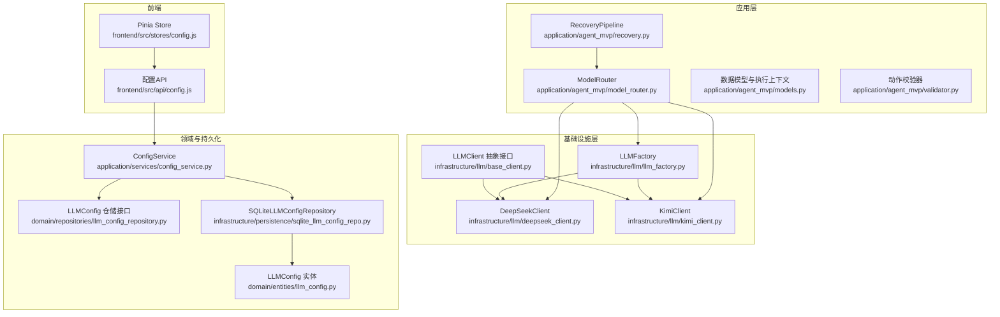
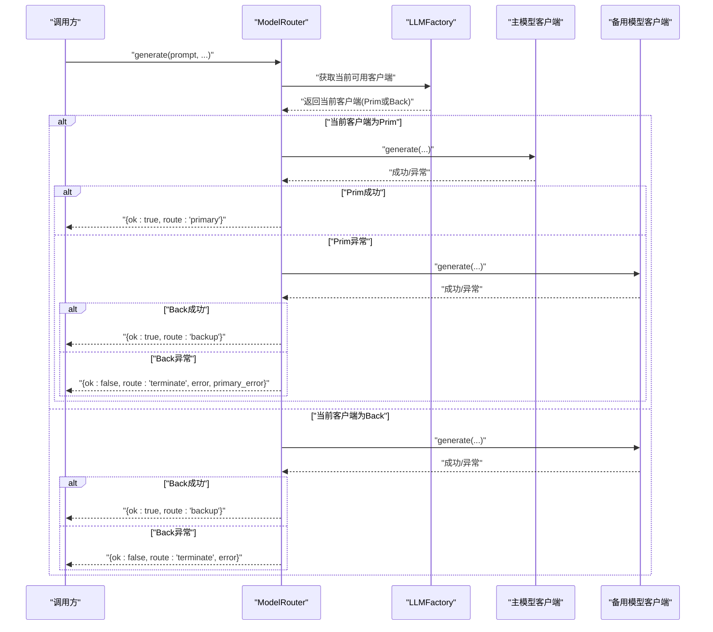
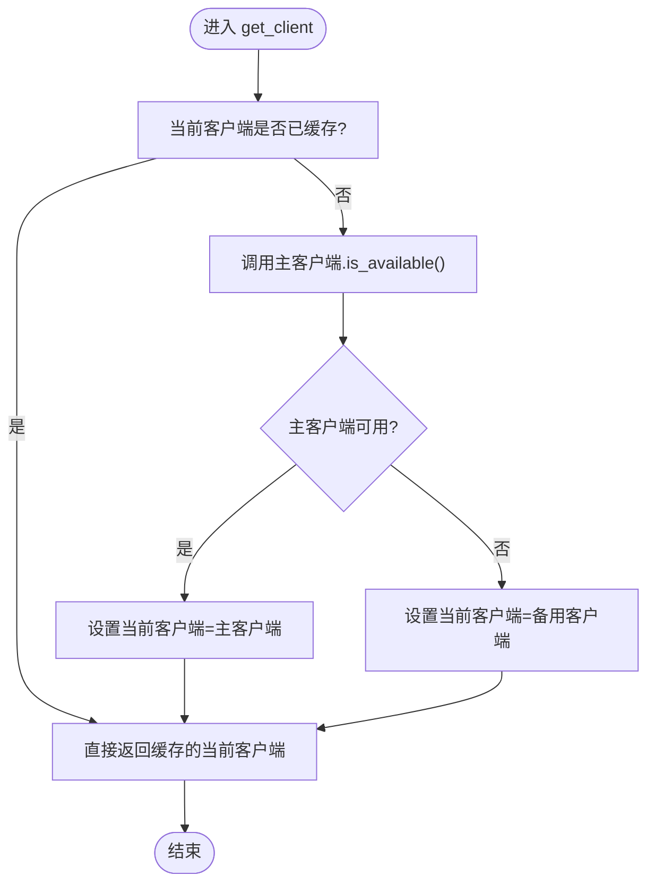
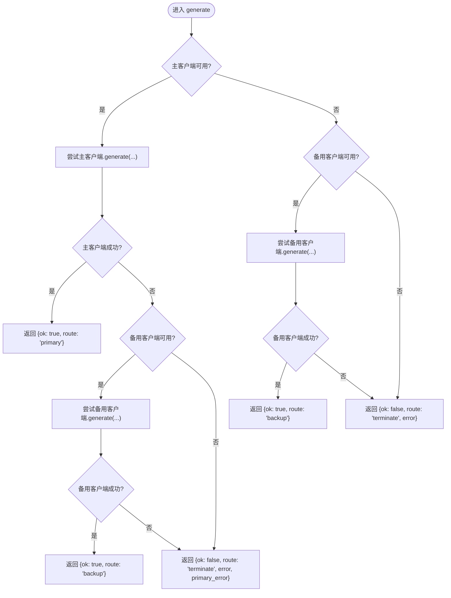
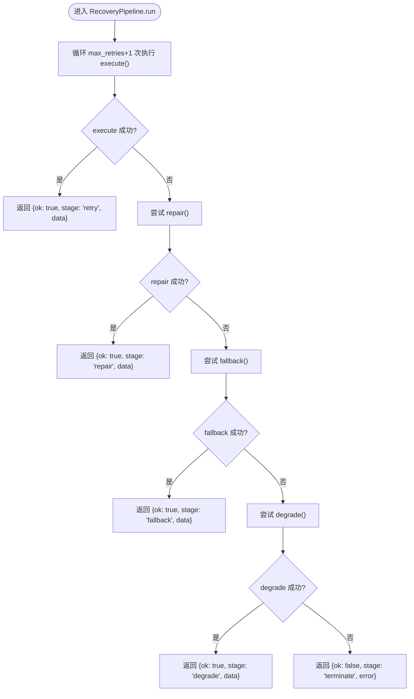
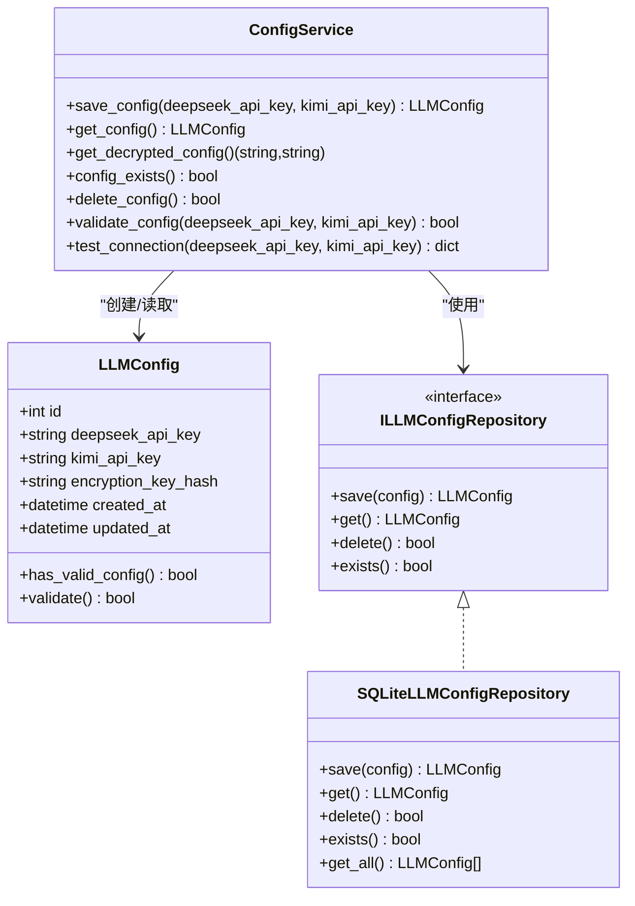
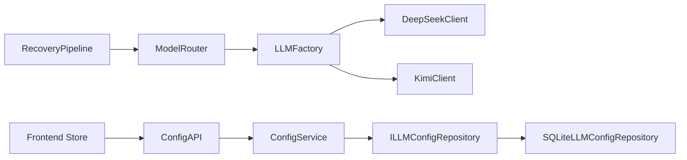

# 模型切换机制

<cite>
**本文引用的文件**
- [application/agent_mvp/model_router.py](file://application/agent_mvp/model_router.py)
- [application/agent_mvp/recovery.py](file://application/agent_mvp/recovery.py)
- [application/agent_mvp/models.py](file://application/agent_mvp/models.py)
- [application/agent_mvp/validator.py](file://application/agent_mvp/validator.py)
- [infrastructure/llm/base_client.py](file://infrastructure/llm/base_client.py)
- [infrastructure/llm/deepseek_client.py](file://infrastructure/llm/deepseek_client.py)
- [infrastructure/llm/kimi_client.py](file://infrastructure/llm/kimi_client.py)
- [infrastructure/llm/llm_factory.py](file://infrastructure/llm/llm_factory.py)
- [domain/entities/llm_config.py](file://domain/entities/llm_config.py)
- [domain/repositories/llm_config_repository.py](file://domain/repositories/llm_config_repository.py)
- [infrastructure/persistence/sqlite_llm_config_repo.py](file://infrastructure/persistence/sqlite_llm_config_repo.py)
- [application/services/config_service.py](file://application/services/config_service.py)
- [domain/exceptions.py](file://domain/exceptions.py)
- [tests/unit/test_llm_client.py](file://tests/unit/test_llm_client.py)
- [frontend/src/stores/config.js](file://frontend/src/stores/config.js)
- [frontend/src/api/config.js](file://frontend/src/api/config.js)
</cite>

## 目录
1. [简介](#简介)
2. [项目结构](#项目结构)
3. [核心组件](#核心组件)
4. [架构总览](#架构总览)
5. [详细组件分析](#详细组件分析)
6. [依赖分析](#依赖分析)
7. [性能考量](#性能考量)
8. [故障排查指南](#故障排查指南)
9. [结论](#结论)
10. [附录](#附录)

## 简介
本文件面向InkTrace项目的“模型切换机制”，系统性阐述主备模型的自动检测、故障转移、手动切换、切换策略、可用性检测原理、客户端状态与缓存策略、配置项与自定义方法、异常处理与恢复机制、使用示例与调试方法，以及切换效果的监控与评估建议。文档基于仓库中的实际代码实现进行分析，并通过图示帮助读者快速理解各模块之间的协作关系。

## 项目结构
围绕模型切换机制的关键代码分布在以下层次：
- 基础接口与客户端实现：抽象接口定义与具体厂商客户端（DeepSeek、Kimi），负责与外部大模型服务通信。
- 工厂与路由：工厂负责主备客户端的创建与当前可用客户端的选择；路由负责一次请求的主备链路调用与结果返回。
- 领域与应用服务：配置实体、仓储接口与SQLite实现、配置服务，支撑模型配置的持久化与校验。
- 异常体系：统一的领域异常类型，便于上层识别与处理不同类型的错误。
- 前端状态与API：Pinia状态管理与配置API，用于展示配置状态与触发配置变更。

图表来源
- [infrastructure/llm/base_client.py:14-82](file://infrastructure/llm/base_client.py#L14-L82)
- [infrastructure/llm/deepseek_client.py:25-238](file://infrastructure/llm/deepseek_client.py#L25-L238)
- [infrastructure/llm/kimi_client.py:25-244](file://infrastructure/llm/kimi_client.py#L25-L244)
- [infrastructure/llm/llm_factory.py:31-121](file://infrastructure/llm/llm_factory.py#L31-L121)
- [application/agent_mvp/model_router.py:6-42](file://application/agent_mvp/model_router.py#L6-L42)
- [application/agent_mvp/recovery.py:15-51](file://application/agent_mvp/recovery.py#L15-L51)
- [domain/entities/llm_config.py:15-54](file://domain/entities/llm_config.py#L15-L54)
- [domain/repositories/llm_config_repository.py:16-68](file://domain/repositories/llm_config_repository.py#L16-L68)
- [infrastructure/persistence/sqlite_llm_config_repo.py:18-134](file://infrastructure/persistence/sqlite_llm_config_repo.py#L18-L134)
- [application/services/config_service.py:19-151](file://application/services/config_service.py#L19-L151)
- [frontend/src/stores/config.js:14-57](file://frontend/src/stores/config.js#L14-L57)
- [frontend/src/api/config.js:19-194](file://frontend/src/api/config.js#L19-L194)

章节来源
- [infrastructure/llm/base_client.py:14-82](file://infrastructure/llm/base_client.py#L14-L82)
- [infrastructure/llm/llm_factory.py:31-121](file://infrastructure/llm/llm_factory.py#L31-L121)
- [application/agent_mvp/model_router.py:6-42](file://application/agent_mvp/model_router.py#L6-L42)
- [domain/entities/llm_config.py:15-54](file://domain/entities/llm_config.py#L15-L54)
- [application/services/config_service.py:19-151](file://application/services/config_service.py#L19-L151)
- [frontend/src/stores/config.js:14-57](file://frontend/src/stores/config.js#L14-L57)
- [frontend/src/api/config.js:19-194](file://frontend/src/api/config.js#L19-L194)

## 核心组件
- LLMClient 抽象接口：定义统一的generate/chat/model_name/max_context_tokens/is_available等方法，确保不同厂商客户端的一致行为契约。
- DeepSeekClient/KimiClient：具体客户端实现，封装HTTP调用、重试、错误分类、可用性检测与连接池管理。
- LLMFactory：负责主备客户端的延迟创建、当前可用客户端选择、手动切换与重置。
- ModelRouter：对单次请求进行主备链路调用，捕获异常并返回路由结果。
- RecoveryPipeline：通用的重试-修复-回退-降级恢复流水线，可与ModelRouter配合使用。
- 领域与持久化：LLMConfig实体与仓储接口/实现，支撑配置的保存、读取、校验与历史记录。
- 异常体系：APIKeyError、RateLimitError、NetworkError、TokenLimitError等，便于上层区分处理。
- 前端状态与API：Pinia Store与配置API，用于展示配置状态、触发配置变更与连接测试。

章节来源
- [infrastructure/llm/base_client.py:14-82](file://infrastructure/llm/base_client.py#L14-L82)
- [infrastructure/llm/deepseek_client.py:25-238](file://infrastructure/llm/deepseek_client.py#L25-L238)
- [infrastructure/llm/kimi_client.py:25-244](file://infrastructure/llm/kimi_client.py#L25-L244)
- [infrastructure/llm/llm_factory.py:31-121](file://infrastructure/llm/llm_factory.py#L31-L121)
- [application/agent_mvp/model_router.py:6-42](file://application/agent_mvp/model_router.py#L6-L42)
- [application/agent_mvp/recovery.py:15-51](file://application/agent_mvp/recovery.py#L15-L51)
- [domain/entities/llm_config.py:15-54](file://domain/entities/llm_config.py#L15-L54)
- [domain/repositories/llm_config_repository.py:16-68](file://domain/repositories/llm_config_repository.py#L16-L68)
- [infrastructure/persistence/sqlite_llm_config_repo.py:18-134](file://infrastructure/persistence/sqlite_llm_config_repo.py#L18-L134)
- [application/services/config_service.py:19-151](file://application/services/config_service.py#L19-L151)
- [domain/exceptions.py:51-100](file://domain/exceptions.py#L51-L100)
- [frontend/src/stores/config.js:14-57](file://frontend/src/stores/config.js#L14-L57)
- [frontend/src/api/config.js:19-194](file://frontend/src/api/config.js#L19-L194)

## 架构总览
模型切换机制采用“工厂+路由”的分层设计：
- 工厂层负责主备客户端的创建与当前可用客户端的判定；
- 路由层负责单次请求的主备调用与结果返回；
- 恢复层提供重试-修复-回退-降级的恢复策略；
- 领域与持久化层负责配置的实体、仓储与服务；
- 前端负责配置状态展示与用户交互。

图表来源
- [application/agent_mvp/model_router.py:11-41](file://application/agent_mvp/model_router.py#L11-L41)
- [infrastructure/llm/llm_factory.py:78-95](file://infrastructure/llm/llm_factory.py#L78-L95)

## 详细组件分析

### 组件一：可用性检测与工厂切换
- 可用性检测：每个客户端实现is_available，通常通过一次短文本生成调用来验证连通性与基本响应。
- 工厂切换：
  - 首次获取客户端时，优先选择可用的主模型；若主模型不可用，则回退到备用模型。
  - 提供手动切换到备用模型与重置为主模型的方法，便于运维干预与故障演练。
- 关键实现位置：
  - 客户端可用性检测：[is_available 实现:213-220](file://infrastructure/llm/deepseek_client.py#L213-L220)、[is_available 实现:219-226](file://infrastructure/llm/kimi_client.py#L219-L226)
  - 工厂获取当前客户端：[get_client:78-95](file://infrastructure/llm/llm_factory.py#L78-L95)
  - 手动切换与重置：[switch_to_backup:97-107](file://infrastructure/llm/llm_factory.py#L97-L107)、[reset_to_primary:109-121](file://infrastructure/llm/llm_factory.py#L109-L121)

图表来源
- [infrastructure/llm/llm_factory.py:78-95](file://infrastructure/llm/llm_factory.py#L78-L95)
- [infrastructure/llm/deepseek_client.py:213-220](file://infrastructure/llm/deepseek_client.py#L213-L220)
- [infrastructure/llm/kimi_client.py:219-226](file://infrastructure/llm/kimi_client.py#L219-L226)

章节来源
- [infrastructure/llm/llm_factory.py:78-121](file://infrastructure/llm/llm_factory.py#L78-L121)
- [infrastructure/llm/deepseek_client.py:213-220](file://infrastructure/llm/deepseek_client.py#L213-L220)
- [infrastructure/llm/kimi_client.py:219-226](file://infrastructure/llm/kimi_client.py#L219-L226)

### 组件二：主备路由与故障转移
- 单次请求的主备链路：先尝试当前客户端（通常由工厂缓存），失败则尝试备用客户端；若备用也失败，则终止并返回错误信息与主客户端错误原因。
- 返回结构包含：
  - ok：布尔值，表示本次调用是否成功
  - text：当成功时返回生成文本
  - route：指示使用的客户端来源（primary/backup/terminate）
  - error/primary_error：错误信息
- 关键实现位置：
  - [ModelRouter.generate:11-41](file://application/agent_mvp/model_router.py#L11-L41)

图表来源
- [application/agent_mvp/model_router.py:11-41](file://application/agent_mvp/model_router.py#L11-L41)

章节来源
- [application/agent_mvp/model_router.py:11-41](file://application/agent_mvp/model_router.py#L11-L41)

### 组件三：恢复流水线（重试-修复-回退-降级）
- RecoveryPipeline提供统一的恢复策略：多次重试execute，失败则尝试repair，再尝试fallback，最后降级degrade；任一步骤成功即返回数据，否则返回terminate阶段与错误。
- 适用场景：在业务层对单次调用增加稳健性，结合ModelRouter形成“外层恢复+内层主备”的双重保障。
- 关键实现位置：
  - [RecoveryPipeline.run:19-50](file://application/agent_mvp/recovery.py#L19-L50)

图表来源
- [application/agent_mvp/recovery.py:19-50](file://application/agent_mvp/recovery.py#L19-L50)

章节来源
- [application/agent_mvp/recovery.py:15-51](file://application/agent_mvp/recovery.py#L15-L51)

### 组件四：配置管理与持久化
- 配置实体：包含DeepSeek与Kimi的加密API密钥、加密密钥哈希、创建/更新时间戳。
- 仓储接口与SQLite实现：提供保存、读取、删除、存在性检查与历史查询能力。
- 配置服务：负责加密/解密、格式校验、连接测试、密钥哈希一致性验证。
- 关键实现位置：
  - [LLMConfig 实体:15-54](file://domain/entities/llm_config.py#L15-L54)
  - [LLMConfig 仓储接口:16-68](file://domain/repositories/llm_config_repository.py#L16-L68)
  - [SQLiteLLMConfigRepository:18-134](file://infrastructure/persistence/sqlite_llm_config_repo.py#L18-134)
  - [ConfigService:19-151](file://application/services/config_service.py#L19-151)

图表来源
- [domain/entities/llm_config.py:15-54](file://domain/entities/llm_config.py#L15-L54)
- [domain/repositories/llm_config_repository.py:16-68](file://domain/repositories/llm_config_repository.py#L16-L68)
- [infrastructure/persistence/sqlite_llm_config_repo.py:18-134](file://infrastructure/persistence/sqlite_llm_config_repo.py#L18-L134)
- [application/services/config_service.py:19-151](file://application/services/config_service.py#L19-L151)

章节来源
- [domain/entities/llm_config.py:15-54](file://domain/entities/llm_config.py#L15-L54)
- [domain/repositories/llm_config_repository.py:16-68](file://domain/repositories/llm_config_repository.py#L16-L68)
- [infrastructure/persistence/sqlite_llm_config_repo.py:18-134](file://infrastructure/persistence/sqlite_llm_config_repo.py#L18-L134)
- [application/services/config_service.py:19-151](file://application/services/config_service.py#L19-L151)

### 组件五：前端状态与配置API
- Pinia Store：维护配置对象、配置状态、加载与错误标志，计算属性用于判断是否已配置、是否需要配置等。
- 配置API：封装Axios客户端，提供获取配置、检查配置存在性、配置状态查询等方法，并内置请求/响应拦截器。
- 关键实现位置：
  - [Pinia Store:14-57](file://frontend/src/stores/config.js#L14-57)
  - [配置API:19-194](file://frontend/src/api/config.js#L19-194)

章节来源
- [frontend/src/stores/config.js:14-57](file://frontend/src/stores/config.js#L14-L57)
- [frontend/src/api/config.js:19-194](file://frontend/src/api/config.js#L19-L194)

## 依赖分析
- 组件耦合与内聚：
  - 工厂与客户端：低耦合，通过抽象接口隔离具体实现；高内聚于“可用性检测”与“连接池管理”。
  - 路由与工厂：路由依赖工厂提供的当前客户端；工厂负责缓存与切换。
  - 恢复流水线与路由：可组合使用，增强鲁棒性。
  - 领域与持久化：配置服务依赖仓储接口，仓储实现依赖SQLite；实体与服务职责清晰。
- 外部依赖与集成点：
  - HTTP客户端：客户端内部使用异步HTTP客户端进行请求与连接池管理。
  - 前端Axios：用于与后端配置API交互。
- 循环依赖：未发现循环依赖迹象。

图表来源
- [application/agent_mvp/model_router.py:6-42](file://application/agent_mvp/model_router.py#L6-L42)
- [infrastructure/llm/llm_factory.py:31-121](file://infrastructure/llm/llm_factory.py#L31-L121)
- [application/agent_mvp/recovery.py:15-51](file://application/agent_mvp/recovery.py#L15-L51)
- [application/services/config_service.py:19-151](file://application/services/config_service.py#L19-L151)
- [domain/repositories/llm_config_repository.py:16-68](file://domain/repositories/llm_config_repository.py#L16-L68)
- [infrastructure/persistence/sqlite_llm_config_repo.py:18-134](file://infrastructure/persistence/sqlite_llm_config_repo.py#L18-L134)
- [frontend/src/stores/config.js:14-57](file://frontend/src/stores/config.js#L14-L57)
- [frontend/src/api/config.js:19-194](file://frontend/src/api/config.js#L19-L194)

章节来源
- [application/agent_mvp/model_router.py:6-42](file://application/agent_mvp/model_router.py#L6-L42)
- [infrastructure/llm/llm_factory.py:31-121](file://infrastructure/llm/llm_factory.py#L31-L121)
- [application/agent_mvp/recovery.py:15-51](file://application/agent_mvp/recovery.py#L15-L51)
- [application/services/config_service.py:19-151](file://application/services/config_service.py#L19-L151)
- [domain/repositories/llm_config_repository.py:16-68](file://domain/repositories/llm_config_repository.py#L16-L68)
- [infrastructure/persistence/sqlite_llm_config_repo.py:18-134](file://infrastructure/persistence/sqlite_llm_config_repo.py#L18-L134)
- [frontend/src/stores/config.js:14-57](file://frontend/src/stores/config.js#L14-L57)
- [frontend/src/api/config.js:19-194](file://frontend/src/api/config.js#L19-L194)

## 性能考量
- 连接复用与并发：客户端内部使用异步HTTP客户端并配置连接池，减少握手开销，提升并发吞吐。
- 重试策略：客户端内置有限次数的重试，避免瞬时网络波动导致的失败放大。
- 缓存与懒加载：工厂对主/备客户端采用延迟创建与当前客户端缓存，降低初始化成本与重复检测开销。
- 上下文与Token控制：客户端对输入进行字符级截断，防止超限引发的失败与资源浪费。
- 建议：
  - 合理设置超时与重试次数，平衡成功率与响应时延。
  - 在高并发场景下，关注连接池上限与后端限流策略。
  - 对频繁切换的场景，考虑延长可用性检测间隔或引入指数退避。

## 故障排查指南
- 常见错误类型与定位：
  - API密钥错误：抛出APIKeyError，需检查密钥有效性与权限。
  - 限流错误：抛出RateLimitError，需等待冷却时间或调整请求频率。
  - 网络错误：抛出NetworkError，需检查网络连通性与代理设置。
  - Token超限：抛出TokenLimitError，需缩短输入或调整上下文策略。
- 排查步骤：
  - 使用客户端is_available进行快速自检。
  - 查看工厂当前客户端缓存状态与最近一次切换记录。
  - 检查配置服务的密钥哈希一致性与解密过程。
  - 观察前端配置状态与错误提示，确认密钥格式与存在性。
- 相关实现位置：
  - [异常类型定义:51-100](file://domain/exceptions.py#L51-100)
  - [客户端错误处理与重试:155-193](file://infrastructure/llm/deepseek_client.py#L155-L193)
  - [客户端错误处理与重试:161-199](file://infrastructure/llm/kimi_client.py#L161-L199)
  - [工厂可用性检测与切换:78-121](file://infrastructure/llm/llm_factory.py#L78-121)
  - [配置服务解密与校验:49-78](file://application/services/config_service.py#L49-78)

章节来源
- [domain/exceptions.py:51-100](file://domain/exceptions.py#L51-L100)
- [infrastructure/llm/deepseek_client.py:155-193](file://infrastructure/llm/deepseek_client.py#L155-L193)
- [infrastructure/llm/kimi_client.py:161-199](file://infrastructure/llm/kimi_client.py#L161-L199)
- [infrastructure/llm/llm_factory.py:78-121](file://infrastructure/llm/llm_factory.py#L78-L121)
- [application/services/config_service.py:49-78](file://application/services/config_service.py#L49-L78)

## 结论
InkTrace的模型切换机制通过“抽象接口+具体客户端+工厂缓存+路由主备”的架构实现了稳定可靠的主备切换。结合恢复流水线与完善的异常体系，系统在面对网络波动、限流与密钥问题时具备较强的韧性。配置管理与前端状态联动提供了良好的可观测性与可运维性。建议在生产环境中根据业务负载与SLA要求，进一步优化超时、重试与连接池参数，并建立切换事件的审计与告警机制。

## 附录

### 切换策略与条件
- 自动检测：工厂在首次获取客户端时调用is_available进行可用性判断；后续请求优先使用当前缓存客户端。
- 故障转移：路由层在主客户端失败时自动尝试备用客户端；若备用也失败则终止并返回错误。
- 手动切换：提供切换到备用与重置为主模型的接口，便于运维干预。
- 回退机制：结合恢复流水线，可在execute失败后依次尝试repair/fallback/degrade。

章节来源
- [infrastructure/llm/llm_factory.py:78-121](file://infrastructure/llm/llm_factory.py#L78-L121)
- [application/agent_mvp/model_router.py:11-41](file://application/agent_mvp/model_router.py#L11-L41)
- [application/agent_mvp/recovery.py:19-50](file://application/agent_mvp/recovery.py#L19-L50)

### 客户端状态管理与缓存策略
- 状态管理：工厂缓存当前客户端，避免重复检测；路由层在单次请求中复用当前客户端。
- 缓存策略：主备客户端惰性创建；可用性检测结果在当前生命周期内生效。
- 前端状态：Store维护配置对象与状态，计算属性驱动UI更新；API封装错误处理与拦截器。

章节来源
- [infrastructure/llm/llm_factory.py:40-52](file://infrastructure/llm/llm_factory.py#L40-L52)
- [frontend/src/stores/config.js:14-57](file://frontend/src/stores/config.js#L14-L57)
- [frontend/src/api/config.js:19-55](file://frontend/src/api/config.js#L19-L55)

### 配置选项与自定义方法
- 配置实体字段：DeepSeek与Kimi的API密钥、加密密钥哈希、时间戳。
- 工厂配置：可通过LLMConfig传入不同厂商的API密钥、基础URL与模型名称。
- 自定义扩展：新增客户端时需实现LLMClient接口，并在工厂中注册；路由与恢复层无需改动即可适配。

章节来源
- [domain/entities/llm_config.py:15-54](file://domain/entities/llm_config.py#L15-L54)
- [infrastructure/llm/llm_factory.py:19-38](file://infrastructure/llm/llm_factory.py#L19-L38)
- [infrastructure/llm/base_client.py:14-82](file://infrastructure/llm/base_client.py#L14-L82)

### 使用示例与调试方法
- 使用示例（路径参考）：
  - 获取可用客户端：[LLMFactory.get_client:78-95](file://infrastructure/llm/llm_factory.py#L78-L95)
  - 发起一次主备路由请求：[ModelRouter.generate:11-41](file://application/agent_mvp/model_router.py#L11-L41)
  - 手动切换到备用模型：[LLMFactory.switch_to_backup:97-107](file://infrastructure/llm/llm_factory.py#L97-L107)
  - 重置为主模型：[LLMFactory.reset_to_primary:109-121](file://infrastructure/llm/llm_factory.py#L109-L121)
  - 前端加载配置状态：[Pinia Store:42-57](file://frontend/src/stores/config.js#L42-L57)
- 调试方法：
  - 在客户端is_available与generate中加入日志，观察可用性检测与错误类型。
  - 使用恢复流水线包装关键调用，记录stage与错误信息。
  - 通过前端配置API测试连接，验证密钥格式与服务可达性。

章节来源
- [infrastructure/llm/llm_factory.py:78-121](file://infrastructure/llm/llm_factory.py#L78-L121)
- [application/agent_mvp/model_router.py:11-41](file://application/agent_mvp/model_router.py#L11-L41)
- [frontend/src/stores/config.js:42-57](file://frontend/src/stores/config.js#L42-L57)
- [frontend/src/api/config.js:120-150](file://frontend/src/api/config.js#L120-L150)

### 监控与评估切换效果
- 指标建议：
  - 切换次数与触发原因（主客户端失败、备用客户端失败、手动切换）。
  - 平均响应时延与成功率（主/备分别统计）。
  - 错误类型分布（APIKeyError、RateLimitError、NetworkError、TokenLimitError）。
- 方法建议：
  - 在路由层记录route与错误信息，在恢复层记录stage，便于统计分析。
  - 前端展示配置状态与最近切换记录，辅助用户感知与反馈。
  - 建立告警阈值（如连续失败次数、切换频率异常）。

章节来源
- [application/agent_mvp/model_router.py:11-41](file://application/agent_mvp/model_router.py#L11-L41)
- [application/agent_mvp/recovery.py:19-50](file://application/agent_mvp/recovery.py#L19-L50)
- [frontend/src/stores/config.js:14-57](file://frontend/src/stores/config.js#L14-L57)