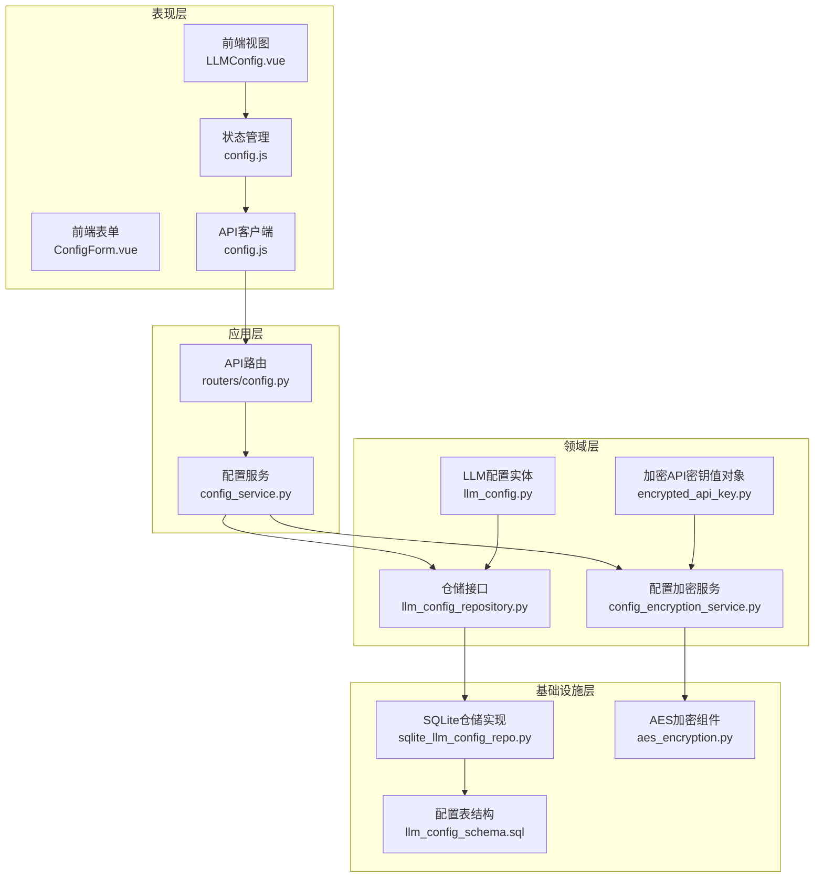
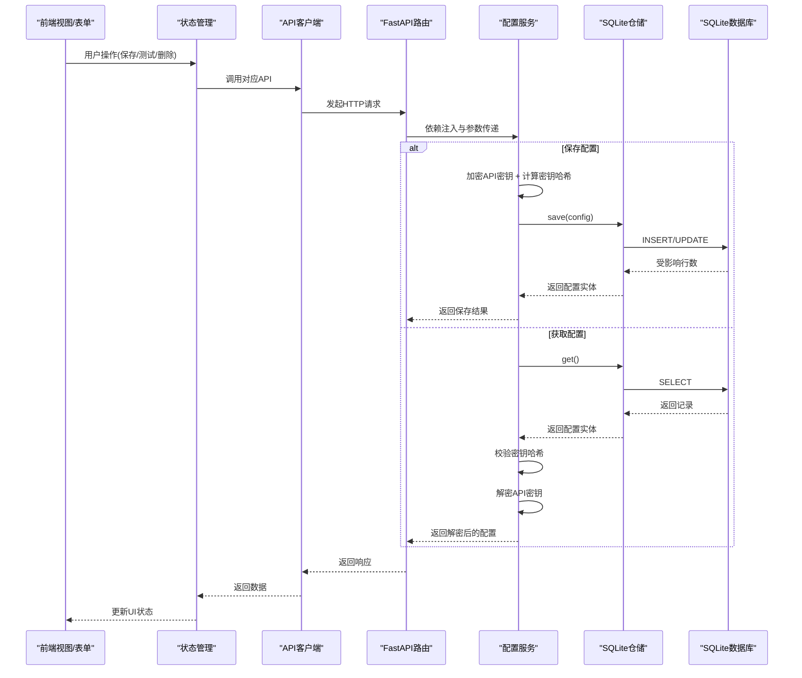
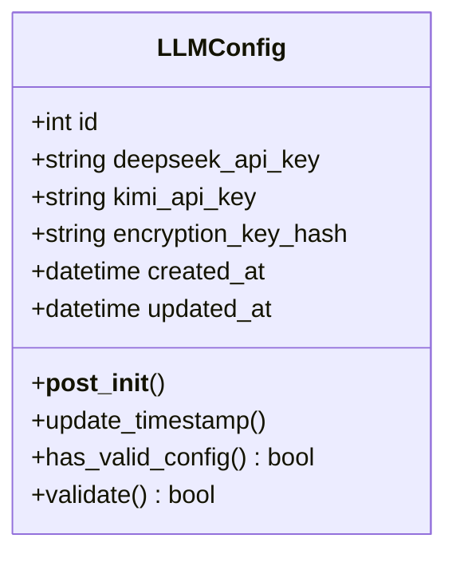
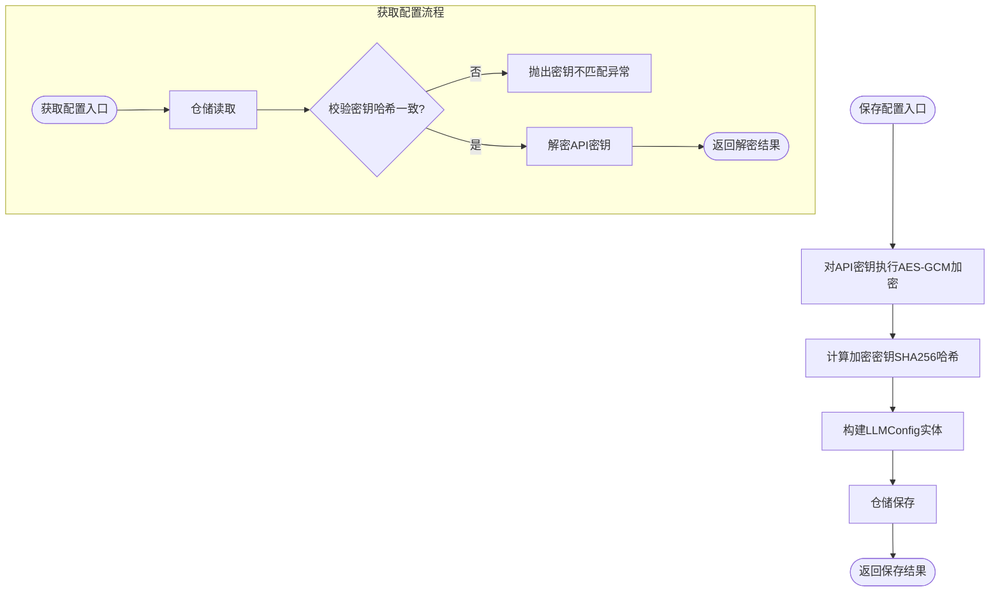
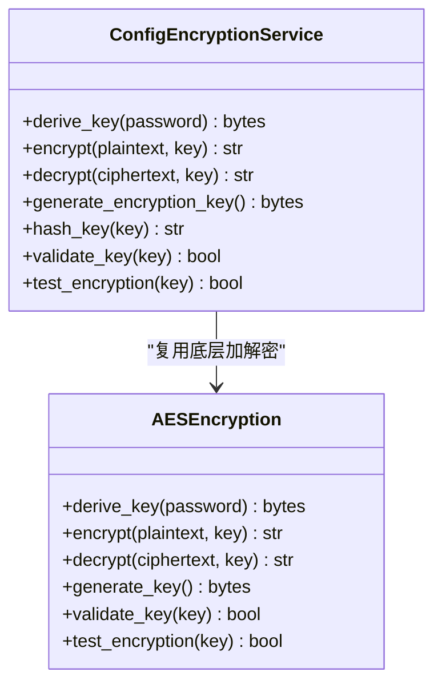
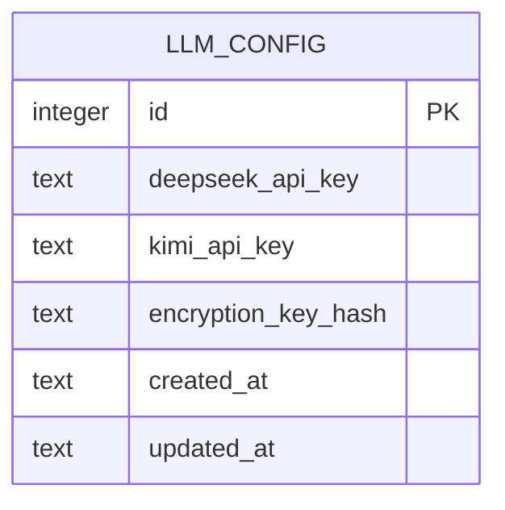
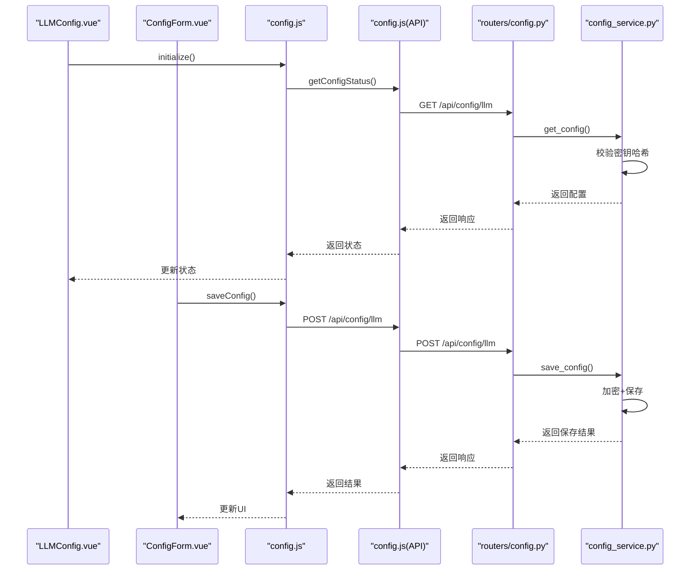
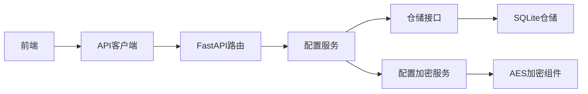

# 配置管理

<cite>
**本文引用的文件**
- [domain/entities/llm_config.py](file://domain/entities/llm_config.py)
- [domain/repositories/llm_config_repository.py](file://domain/repositories/llm_config_repository.py)
- [infrastructure/persistence/sqlite_llm_config_repo.py](file://infrastructure/persistence/sqlite_llm_config_repo.py)
- [domain/services/config_encryption_service.py](file://domain/services/config_encryption_service.py)
- [infrastructure/security/aes_encryption.py](file://infrastructure/security/aes_encryption.py)
- [domain/value_objects/encrypted_api_key.py](file://domain/value_objects/encrypted_api_key.py)
- [application/services/config_service.py](file://application/services/config_service.py)
- [presentation/api/routers/config.py](file://presentation/api/routers/config.py)
- [frontend/src/views/config/LLMConfig.vue](file://frontend/src/views/config/LLMConfig.vue)
- [frontend/src/views/config/components/ConfigForm.vue](file://frontend/src/views/config/components/ConfigForm.vue)
- [frontend/src/stores/config.js](file://frontend/src/stores/config.js)
- [frontend/src/api/config.js](file://frontend/src/api/config.js)
- [infrastructure/persistence/llm_config_schema.sql](file://infrastructure/persistence/llm_config_schema.sql)
- [tests/unit/test_llm_config.py](file://tests/unit/test_llm_config.py)
</cite>

## 目录
1. [简介](#简介)
2. [项目结构](#项目结构)
3. [核心组件](#核心组件)
4. [架构总览](#架构总览)
5. [详细组件分析](#详细组件分析)
6. [依赖分析](#依赖分析)
7. [性能考虑](#性能考虑)
8. [故障排除指南](#故障排除指南)
9. [结论](#结论)
10. [附录](#附录)

## 简介
本文件面向InkTrace项目的AI模型配置管理，系统性阐述LLMConfig值对象设计与实现、配置服务的读取/更新/持久化流程、API密钥安全与加密存储策略、动态更新与热重载机制、配置文件格式与示例、多环境配置管理策略、配置验证与错误处理方法，并给出扩展新配置项的最佳实践。

## 项目结构
围绕配置管理的关键代码分布在以下层次：
- 领域层：LLMConfig实体、配置加密服务、加密API密钥值对象、仓储接口
- 应用层：配置服务，负责业务编排、验证、加解密与仓储交互
- 基础设施层：SQLite仓储实现、AES加密组件
- 表现层：FastAPI路由、前端页面与状态管理、API客户端

图表来源
- [presentation/api/routers/config.py:52-185](file://presentation/api/routers/config.py#L52-L185)
- [application/services/config_service.py:19-151](file://application/services/config_service.py#L19-L151)
- [domain/entities/llm_config.py:15-54](file://domain/entities/llm_config.py#L15-L54)
- [domain/value_objects/encrypted_api_key.py:14-68](file://domain/value_objects/encrypted_api_key.py#L14-L68)
- [domain/services/config_encryption_service.py:20-111](file://domain/services/config_encryption_service.py#L20-L111)
- [infrastructure/security/aes_encryption.py:19-106](file://infrastructure/security/aes_encryption.py#L19-L106)
- [domain/repositories/llm_config_repository.py:16-68](file://domain/repositories/llm_config_repository.py#L16-L68)
- [infrastructure/persistence/sqlite_llm_config_repo.py:18-134](file://infrastructure/persistence/sqlite_llm_config_repo.py#L18-L134)
- [infrastructure/persistence/llm_config_schema.sql:5-15](file://infrastructure/persistence/llm_config_schema.sql#L5-L15)

章节来源
- [presentation/api/routers/config.py:52-185](file://presentation/api/routers/config.py#L52-L185)
- [application/services/config_service.py:19-151](file://application/services/config_service.py#L19-L151)
- [domain/entities/llm_config.py:15-54](file://domain/entities/llm_config.py#L15-L54)
- [domain/value_objects/encrypted_api_key.py:14-68](file://domain/value_objects/encrypted_api_key.py#L14-L68)
- [domain/services/config_encryption_service.py:20-111](file://domain/services/config_encryption_service.py#L20-L111)
- [infrastructure/security/aes_encryption.py:19-106](file://infrastructure/security/aes_encryption.py#L19-L106)
- [domain/repositories/llm_config_repository.py:16-68](file://domain/repositories/llm_config_repository.py#L16-L68)
- [infrastructure/persistence/sqlite_llm_config_repo.py:18-134](file://infrastructure/persistence/sqlite_llm_config_repo.py#L18-L134)
- [infrastructure/persistence/llm_config_schema.sql:5-15](file://infrastructure/persistence/llm_config_schema.sql#L5-L15)

## 核心组件
- LLMConfig值对象：封装API密钥与加密密钥哈希、时间戳，提供有效性检查与验证
- 配置服务：协调加解密、验证、仓储持久化与连接测试
- 加密服务与AES组件：提供PBKDF2派生密钥、GCM加解密、密钥哈希与校验
- SQLite仓储：负责配置的增删改查、历史版本查询与表结构维护
- 前端配置界面与状态管理：表单校验、保存/测试/删除、状态展示与错误提示

章节来源
- [domain/entities/llm_config.py:15-54](file://domain/entities/llm_config.py#L15-L54)
- [application/services/config_service.py:19-151](file://application/services/config_service.py#L19-L151)
- [domain/services/config_encryption_service.py:20-111](file://domain/services/config_encryption_service.py#L20-L111)
- [infrastructure/security/aes_encryption.py:19-106](file://infrastructure/security/aes_encryption.py#L19-L106)
- [infrastructure/persistence/sqlite_llm_config_repo.py:18-134](file://infrastructure/persistence/sqlite_llm_config_repo.py#L18-L134)
- [frontend/src/views/config/LLMConfig.vue:1-285](file://frontend/src/views/config/LLMConfig.vue#L1-L285)
- [frontend/src/views/config/components/ConfigForm.vue:1-309](file://frontend/src/views/config/components/ConfigForm.vue#L1-L309)
- [frontend/src/stores/config.js:14-240](file://frontend/src/stores/config.js#L14-L240)
- [frontend/src/api/config.js:19-195](file://frontend/src/api/config.js#L19-L195)

## 架构总览
配置管理采用分层架构，从前端到后端再到持久化，形成闭环的数据流与控制流。前端通过API客户端调用后端路由，路由注入配置服务，配置服务通过仓储访问SQLite数据库，同时使用加密服务对敏感信息进行加解密。

图表来源
- [presentation/api/routers/config.py:56-185](file://presentation/api/routers/config.py#L56-L185)
- [application/services/config_service.py:30-87](file://application/services/config_service.py#L30-L87)
- [infrastructure/persistence/sqlite_llm_config_repo.py:46-107](file://infrastructure/persistence/sqlite_llm_config_repo.py#L46-L107)
- [frontend/src/api/config.js:68-141](file://frontend/src/api/config.js#L68-L141)

## 详细组件分析

### LLMConfig值对象设计与实现
- 字段定义与默认值
  - id：可选整型，自增主键
  - deepseek_api_key、kimi_api_key：字符串，加密存储的API密钥
  - encryption_key_hash：字符串，加密密钥的SHA256哈希，用于密钥一致性校验
  - created_at、updated_at：可选时间戳，默认初始化为当前时间
- 初始化后处理：若未提供时间戳，则自动填充当前时间
- 时间戳更新：提供update_timestamp方法，便于更新操作时刷新updated_at
- 有效性检查：
  - has_valid_config：只要任一API密钥非空即视为有效
  - validate：除API密钥有效性外，还要求encryption_key_hash非空

图表来源
- [domain/entities/llm_config.py:15-54](file://domain/entities/llm_config.py#L15-L54)

章节来源
- [domain/entities/llm_config.py:15-54](file://domain/entities/llm_config.py#L15-L54)

### 配置服务实现（读取/更新/持久化/验证/测试）
- 依赖注入：接收仓储接口与加密密钥，内部持有加密服务实例
- 保存配置：
  - 对两个API密钥分别进行AES-GCM加密
  - 计算当前加密密钥的SHA256哈希并写入实体
  - 调用仓储保存，返回持久化后的实体
- 获取配置：
  - 从仓储读取最新配置
  - 校验encryption_key_hash与当前密钥哈希一致，否则抛出异常
  - 返回原始实体（不解密）
- 获取解密配置：
  - 在get_config基础上，使用相同密钥对密文进行解密，返回明文API密钥元组
- 存在性与删除：委托仓储实现
- 配置验证：
  - 至少有一个API密钥非空
  - 对非空密钥执行基础格式校验（长度与字符类型）
- 连接测试：
  - 对每个配置的API密钥执行“可用性”测试（当前为占位逻辑，可扩展为真实API调用）

图表来源
- [application/services/config_service.py:30-87](file://application/services/config_service.py#L30-L87)
- [domain/services/config_encryption_service.py:39-85](file://domain/services/config_encryption_service.py#L39-L85)

章节来源
- [application/services/config_service.py:19-151](file://application/services/config_service.py#L19-L151)

### 加密服务与AES组件
- 配置加密服务：
  - PBKDF2-HMAC-SHA256派生密钥
  - AES-256-GCM加解密，IV+Tag+密文组合并Base64编码
  - 提供密钥生成、哈希、校验与功能自测
- AES加密组件：
  - 与配置加密服务类似，但使用独立盐值，用于通用加密场景
  - 提供密钥派生、加解密、密钥校验与自测

图表来源
- [domain/services/config_encryption_service.py:20-111](file://domain/services/config_encryption_service.py#L20-L111)
- [infrastructure/security/aes_encryption.py:19-106](file://infrastructure/security/aes_encryption.py#L19-L106)

章节来源
- [domain/services/config_encryption_service.py:20-111](file://domain/services/config_encryption_service.py#L20-L111)
- [infrastructure/security/aes_encryption.py:19-106](file://infrastructure/security/aes_encryption.py#L19-L106)

### SQLite配置仓储实现
- 表结构：llm_config包含id、两个加密API密钥字段、加密密钥哈希、创建/更新时间戳
- 初始化：自动创建表与必要索引
- CRUD：
  - save：支持插入与更新，更新时刷新updated_at
  - get：按id倒序取最新一条
  - delete：清空表
  - exists：统计记录数判断是否存在
  - get_all：历史版本查询（按id倒序）
- 事务与连接：使用上下文管理连接，保证资源释放

图表来源
- [infrastructure/persistence/llm_config_schema.sql:5-15](file://infrastructure/persistence/llm_config_schema.sql#L5-L15)
- [infrastructure/persistence/sqlite_llm_config_repo.py:32-134](file://infrastructure/persistence/sqlite_llm_config_repo.py#L32-L134)

章节来源
- [infrastructure/persistence/sqlite_llm_config_repo.py:18-134](file://infrastructure/persistence/sqlite_llm_config_repo.py#L18-L134)
- [infrastructure/persistence/llm_config_schema.sql:5-15](file://infrastructure/persistence/llm_config_schema.sql#L5-L15)

### 前端配置界面与状态管理
- 页面布局：状态提示、配置表单、配置说明
- 表单校验：至少配置一个API密钥；密钥长度≥20；包含字母与数字
- 状态管理：
  - 加载配置、保存配置、测试配置、删除配置、加载状态
  - 计算属性：是否已配置、是否需要配置
- API客户端：
  - 统一基址、超时、拦截器
  - 封装GET/POST/DELETE与状态检查
  - 基础密钥格式校验

图表来源
- [frontend/src/views/config/LLMConfig.vue:103-164](file://frontend/src/views/config/LLMConfig.vue#L103-L164)
- [frontend/src/views/config/components/ConfigForm.vue:164-238](file://frontend/src/views/config/components/ConfigForm.vue#L164-L238)
- [frontend/src/stores/config.js:42-182](file://frontend/src/stores/config.js#L42-L182)
- [frontend/src/api/config.js:68-141](file://frontend/src/api/config.js#L68-L141)
- [presentation/api/routers/config.py:72-133](file://presentation/api/routers/config.py#L72-L133)
- [application/services/config_service.py:30-47](file://application/services/config_service.py#L30-L47)

章节来源
- [frontend/src/views/config/LLMConfig.vue:1-285](file://frontend/src/views/config/LLMConfig.vue#L1-L285)
- [frontend/src/views/config/components/ConfigForm.vue:1-309](file://frontend/src/views/config/components/ConfigForm.vue#L1-L309)
- [frontend/src/stores/config.js:14-240](file://frontend/src/stores/config.js#L14-L240)
- [frontend/src/api/config.js:19-195](file://frontend/src/api/config.js#L19-L195)

### API密钥安全与加密存储策略
- 加密算法：AES-256-GCM，带随机IV与认证标签，Base64编码便于存储
- 密钥派生：PBKDF2-HMAC-SHA256，迭代次数较高，增强抗暴力破解能力
- 存储策略：
  - API密钥以密文形式存储于llm_config表
  - 加密密钥哈希随配置一同存储，用于后续解密时校验密钥一致性
- 安全要点：
  - 仅在内存中持有加密密钥，避免落盘
  - 通过哈希校验防止密钥变更导致的解密失败
  - 前端不显示明文密钥，仅在解密后短暂使用

章节来源
- [domain/services/config_encryption_service.py:29-95](file://domain/services/config_encryption_service.py#L29-L95)
- [infrastructure/security/aes_encryption.py:28-94](file://infrastructure/security/aes_encryption.py#L28-L94)
- [infrastructure/persistence/llm_config_schema.sql:7-9](file://infrastructure/persistence/llm_config_schema.sql#L7-L9)
- [application/services/config_service.py:30-47](file://application/services/config_service.py#L30-L47)

### 配置项的动态更新与热重载机制
- 动态更新：
  - 前端保存配置后，立即触发状态刷新与UI提示
  - 后端保存配置时更新updated_at，便于前端感知变更
- 热重载：
  - 当前实现未提供自动热重载机制；可在应用启动或配置变更时重新初始化相关组件
  - 建议在业务引擎或路由层增加配置变更监听，触发缓存清理与重新加载

章节来源
- [frontend/src/views/config/LLMConfig.vue:124-132](file://frontend/src/views/config/LLMConfig.vue#L124-L132)
- [frontend/src/stores/config.js:96-97](file://frontend/src/stores/config.js#L96-L97)
- [application/services/config_service.py:35-37](file://application/services/config_service.py#L35-L37)

### 配置文件格式与示例
- 数据库表结构：llm_config
  - 字段：id、deepseek_api_key、kimi_api_key、encryption_key_hash、created_at、updated_at
  - 约束：encryption_key_hash非空
  - 索引：按created_at与updated_at建立索引
- 示例（概念性，非代码片段）：
  - 插入一条配置记录，包含两个加密后的API密钥与当前密钥哈希
  - 更新时仅更新密文与updated_at

章节来源
- [infrastructure/persistence/llm_config_schema.sql:5-15](file://infrastructure/persistence/llm_config_schema.sql#L5-L15)

### 不同环境下的配置管理策略
- 开发环境：
  - 默认加密密钥与数据库路径可通过环境变量配置
  - 前端通过本地代理或固定端口访问后端
- 生产环境：
  - 加密密钥应来自安全存储（如密钥管理服务），避免硬编码
  - 数据库路径与文件权限需严格控制
- 多实例部署：
  - 建议集中式密钥管理与共享数据库
  - 配置变更需统一发布与回滚策略

章节来源
- [presentation/api/routers/config.py:57-69](file://presentation/api/routers/config.py#L57-L69)
- [frontend/src/api/config.js:12-14](file://frontend/src/api/config.js#L12-L14)

### 配置验证、错误处理与故障排除
- 配置验证：
  - 实体层面：has_valid_config与validate
  - 服务层面：save前的格式校验与连接测试占位
  - 前端层面：表单级校验（至少一个密钥、长度与字符类型）
- 错误处理：
  - 后端：捕获异常并转换为HTTP异常，携带明确错误信息
  - 前端：统一响应拦截器解析错误详情，区分服务器错误与网络错误
- 故障排除：
  - 密钥哈希不匹配：更换加密密钥或恢复原密钥
  - 解密失败：检查密钥长度与完整性
  - 数据库异常：检查表结构、索引与文件权限

章节来源
- [application/services/config_service.py:49-87](file://application/services/config_service.py#L49-L87)
- [frontend/src/api/config.js:42-64](file://frontend/src/api/config.js#L42-L64)
- [tests/unit/test_llm_config.py:248-331](file://tests/unit/test_llm_config.py#L248-L331)

### 扩展新的配置项
- 新增字段步骤：
  - 在LLMConfig中添加新字段（含默认值与类型）
  - 在仓储SQL中新增列并更新INSERT/UPDATE语句
  - 在配置服务save/get中同步处理新字段
  - 在前端表单与状态管理中添加对应输入与展示
- 安全与兼容：
  - 新字段建议同样采用加密存储
  - 保持encryption_key_hash的完整性与一致性校验
  - 为新字段提供默认值与向前兼容逻辑

章节来源
- [domain/entities/llm_config.py:19-24](file://domain/entities/llm_config.py#L19-L24)
- [infrastructure/persistence/sqlite_llm_config_repo.py:53-77](file://infrastructure/persistence/sqlite_llm_config_repo.py#L53-L77)
- [application/services/config_service.py:40-44](file://application/services/config_service.py#L40-L44)

## 依赖分析
- 松耦合设计：
  - 应用层通过仓储接口与加密服务抽象依赖，便于替换实现
  - 前端通过API客户端与后端解耦
- 关键依赖链：
  - 前端 → API客户端 → FastAPI路由 → 配置服务 → 仓储接口 → SQLite仓储
  - 配置服务 → 加密服务 → AES组件

图表来源
- [presentation/api/routers/config.py:56-69](file://presentation/api/routers/config.py#L56-L69)
- [application/services/config_service.py:22-28](file://application/services/config_service.py#L22-L28)
- [domain/repositories/llm_config_repository.py:16-32](file://domain/repositories/llm_config_repository.py#L16-L32)
- [infrastructure/persistence/sqlite_llm_config_repo.py:18-24](file://infrastructure/persistence/sqlite_llm_config_repo.py#L18-L24)
- [domain/services/config_encryption_service.py:20-27](file://domain/services/config_encryption_service.py#L20-L27)
- [infrastructure/security/aes_encryption.py:19-26](file://infrastructure/security/aes_encryption.py#L19-L26)

章节来源
- [presentation/api/routers/config.py:56-69](file://presentation/api/routers/config.py#L56-L69)
- [application/services/config_service.py:22-28](file://application/services/config_service.py#L22-L28)
- [domain/repositories/llm_config_repository.py:16-32](file://domain/repositories/llm_config_repository.py#L16-L32)
- [infrastructure/persistence/sqlite_llm_config_repo.py:18-24](file://infrastructure/persistence/sqlite_llm_config_repo.py#L18-L24)
- [domain/services/config_encryption_service.py:20-27](file://domain/services/config_encryption_service.py#L20-L27)
- [infrastructure/security/aes_encryption.py:19-26](file://infrastructure/security/aes_encryption.py#L19-L26)

## 性能考虑
- 加密成本：PBKDF2迭代次数较高，建议在批量导入或后台任务中异步处理
- 数据库IO：合理使用索引，避免频繁全表扫描；更新时仅更新必要字段
- 前端渲染：表单校验尽量在客户端完成，减少无效请求
- 缓存策略：对于不频繁变动的配置，可在应用层引入轻量缓存，结合updated_at做失效控制

## 故障排除指南
- “密钥哈希不匹配”：确认使用的加密密钥与存储时一致；检查密钥长度与来源
- “解密失败”：检查密文是否被篡改或截断；确认密钥有效性
- “保存失败”：检查数据库连接与权限；确认表结构与字段类型
- “测试失败”：确认网络可达性与API密钥有效性；查看后端日志定位具体错误

章节来源
- [application/services/config_service.py:57-60](file://application/services/config_service.py#L57-L60)
- [frontend/src/api/config.js:49-62](file://frontend/src/api/config.js#L49-L62)
- [tests/unit/test_llm_config.py:248-331](file://tests/unit/test_llm_config.py#L248-L331)

## 结论
InkTrace的配置管理通过清晰的分层设计与严格的加密策略，实现了API密钥的安全存储与便捷管理。LLMConfig值对象、配置服务与仓储实现共同构成了稳定可靠的配置生命周期。前端提供了直观的配置界面与完善的错误反馈。未来可在密钥管理与热重载方面进一步完善，以适配更复杂的部署与运维需求。

## 附录
- 单元测试覆盖点：
  - LLMConfig实体创建、验证与有效性检查
  - 加密API密钥值对象的加密/解密与相等性
  - 配置加密服务的加解密、密钥校验与自测
  - SQLite仓储的保存/获取/删除/存在性检查
  - 配置服务的保存/获取/验证/测试流程

章节来源
- [tests/unit/test_llm_config.py:22-331](file://tests/unit/test_llm_config.py#L22-L331)