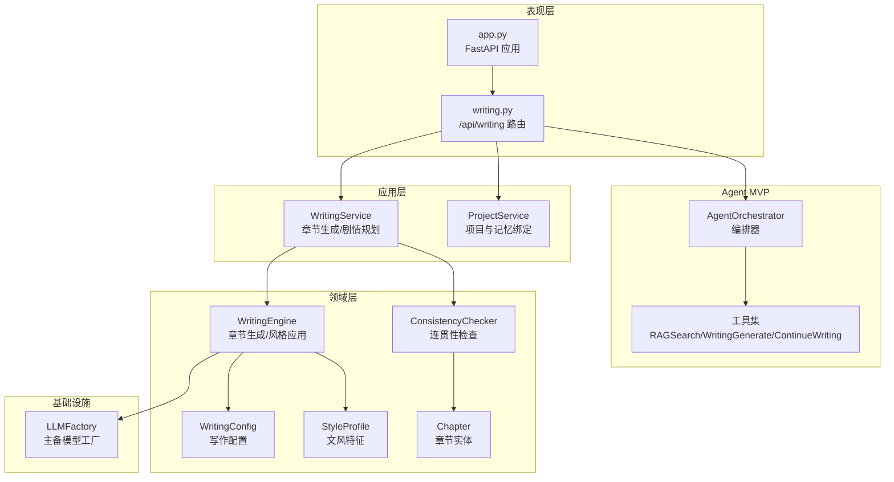
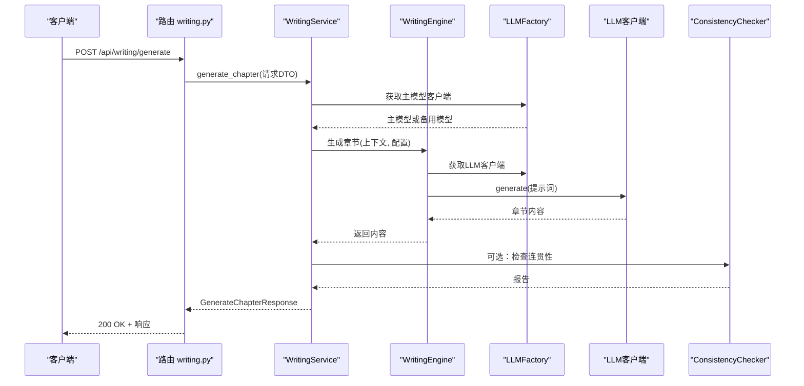
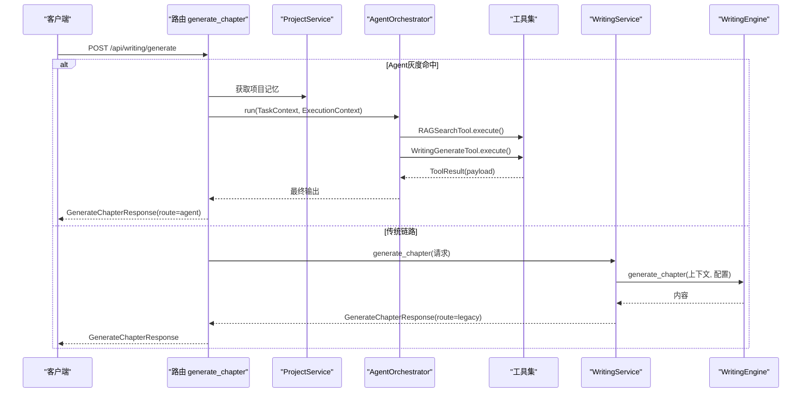
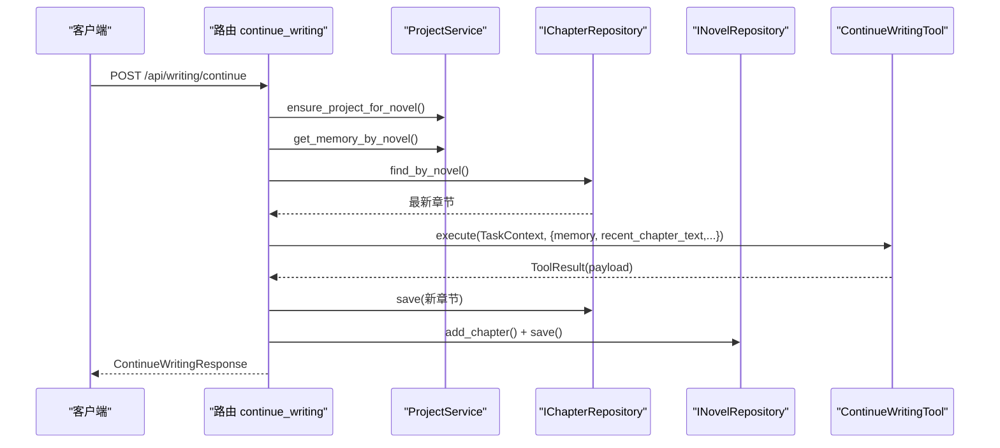
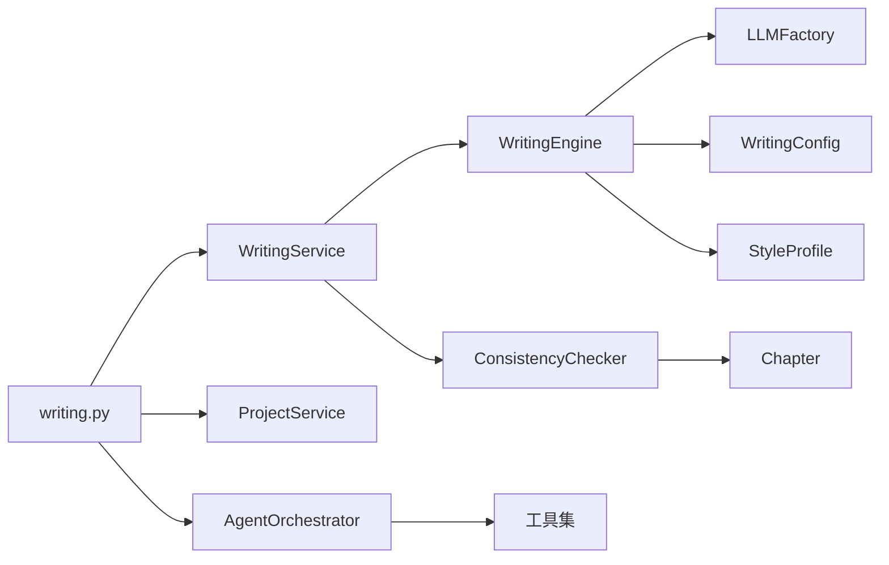

# AI写作引擎API

<cite>
**本文引用的文件**
- [presentation/api/routers/writing.py](file://presentation/api/routers/writing.py)
- [application/dto/request_dto.py](file://application/dto/request_dto.py)
- [application/dto/response_dto.py](file://application/dto/response_dto.py)
- [application/services/writing_service.py](file://application/services/writing_service.py)
- [domain/services/writing_engine.py](file://domain/services/writing_engine.py)
- [domain/value_objects/writing_config.py](file://domain/value_objects/writing_config.py)
- [domain/value_objects/style_profile.py](file://domain/value_objects/style_profile.py)
- [domain/services/consistency_checker.py](file://domain/services/consistency_checker.py)
- [domain/entities/chapter.py](file://domain/entities/chapter.py)
- [infrastructure/llm/llm_factory.py](file://infrastructure/llm/llm_factory.py)
- [application/agent_mvp/orchestrator.py](file://application/agent_mvp/orchestrator.py)
- [application/agent_mvp/tools.py](file://application/agent_mvp/tools.py)
- [presentation/api/app.py](file://presentation/api/app.py)
- [tests/unit/test_story_chains_integration.py](file://tests/unit/test_story_chains_integration.py)
</cite>

## 目录
1. [简介](#简介)
2. [项目结构](#项目结构)
3. [核心组件](#核心组件)
4. [架构总览](#架构总览)
5. [详细组件分析](#详细组件分析)
6. [依赖分析](#依赖分析)
7. [性能考虑](#性能考虑)
8. [故障排查指南](#故障排查指南)
9. [结论](#结论)
10. [附录](#附录)

## 简介
本文件为 InkTrace 小说AI自动编写助手的AI写作引擎API详细接口文档，覆盖章节生成、续写、剧情规划、风格模仿、连贯性检查等能力。文档面向开发者与产品人员，提供请求/响应格式、参数约束、错误码、进度与错误处理机制，并给出典型场景的请求示例与响应格式。

## 项目结构
- 后端采用 FastAPI 应用，路由集中在 presentation/api/routers 下，其中 writing.py 提供写作相关接口。
- 应用层服务位于 application/services，负责编排业务流程（如 WritingService）。
- 领域层位于 domain，包含写作引擎、文风特征、连贯性检查等核心逻辑。
- 基础设施层封装大模型客户端与工厂，支持主备切换。
- Agent MVP 能力通过 application/agent_mvp 提供自动化编排与工具链。

图表来源
- [presentation/api/routers/writing.py:37-278](file://presentation/api/routers/writing.py#L37-L278)
- [application/services/writing_service.py:30-180](file://application/services/writing_service.py#L30-L180)
- [domain/services/writing_engine.py:30-184](file://domain/services/writing_engine.py#L30-L184)
- [domain/value_objects/writing_config.py:13-28](file://domain/value_objects/writing_config.py#L13-L28)
- [domain/value_objects/style_profile.py:14-30](file://domain/value_objects/style_profile.py#L14-L30)
- [domain/services/consistency_checker.py:37-218](file://domain/services/consistency_checker.py#L37-L218)
- [domain/entities/chapter.py:18-109](file://domain/entities/chapter.py#L18-L109)
- [infrastructure/llm/llm_factory.py:31-121](file://infrastructure/llm/llm_factory.py#L31-L121)
- [application/agent_mvp/orchestrator.py:17-212](file://application/agent_mvp/orchestrator.py#L17-L212)
- [application/agent_mvp/tools.py:343-516](file://application/agent_mvp/tools.py#L343-L516)

章节来源
- [presentation/api/app.py:19-66](file://presentation/api/app.py#L19-L66)
- [presentation/api/routers/writing.py:37-278](file://presentation/api/routers/writing.py#L37-L278)

## 核心组件
- 写作服务：负责章节生成、剧情规划、连贯性检查与文风应用。
- 写作引擎：构建提示词、调用大模型、应用文风特征。
- 写作配置：控制目标字数、风格强度、温度、上下文章节数量、开关连贯性检查与风格模仿。
- 文风特征：记录词汇、句式、修辞、对白风格、叙述语态、节奏等统计信息。
- 连贯性检查：基于人物状态、时间线、剧情连续性进行一致性校验。
- LLM工厂：统一管理主备模型客户端，支持可用性检测与切换。
- Agent MVP：灰度启用的自动化编排链路，包含RAG检索与写作生成工具。

章节来源
- [application/services/writing_service.py:30-180](file://application/services/writing_service.py#L30-L180)
- [domain/services/writing_engine.py:30-184](file://domain/services/writing_engine.py#L30-L184)
- [domain/value_objects/writing_config.py:13-28](file://domain/value_objects/writing_config.py#L13-L28)
- [domain/value_objects/style_profile.py:14-30](file://domain/value_objects/style_profile.py#L14-L30)
- [domain/services/consistency_checker.py:37-218](file://domain/services/consistency_checker.py#L37-L218)
- [infrastructure/llm/llm_factory.py:31-121](file://infrastructure/llm/llm_factory.py#L31-L121)

## 架构总览
AI写作引擎API采用分层架构：
- 表现层：FastAPI路由，接收HTTP请求，调用应用服务。
- 应用层：编排业务流程，读取/保存实体，调用领域服务与基础设施。
- 领域层：核心算法与规则，如写作引擎、文风特征、连贯性检查。
- 基础设施层：LLM客户端与工厂，提供模型可用性检测与主备切换。

图表来源
- [presentation/api/routers/writing.py:111-174](file://presentation/api/routers/writing.py#L111-L174)
- [application/services/writing_service.py:91-165](file://application/services/writing_service.py#L91-L165)
- [domain/services/writing_engine.py:52-80](file://domain/services/writing_engine.py#L52-L80)
- [infrastructure/llm/llm_factory.py:78-95](file://infrastructure/llm/llm_factory.py#L78-L95)
- [domain/services/consistency_checker.py:44-87](file://domain/services/consistency_checker.py#L44-L87)

## 详细组件分析

### 接口总览
- GET /health：健康检查
- POST /api/writing/plan：剧情规划
- POST /api/writing/generate：章节生成
- POST /api/writing/continue：续写下一章

章节来源
- [presentation/api/app.py:54-61](file://presentation/api/app.py#L54-L61)
- [presentation/api/routers/writing.py:88-278](file://presentation/api/routers/writing.py#L88-L278)

### 请求与响应数据模型

#### 通用请求基类
- BaseRequest
  - 字段：user_id, session_id, trace_id（可选）

章节来源
- [application/dto/request_dto.py:14-19](file://application/dto/request_dto.py#L14-L19)

#### 章节生成请求（GenerateChapterRequest）
- 字段
  - novel_id: 小说标识（必填）
  - goal: 章节目标（必填）
  - constraints: 约束条件列表（可选）
  - context_summary: 上下文摘要（可选）
  - chapter_count: 计划生成章节数（默认1，范围1-100）
  - target_word_count: 目标字数（默认2100，范围1-50000）
  - options: 扩展选项（可选），支持：
    - enable_style_mimicry: 是否启用风格模仿（布尔）
    - enable_consistency_check: 是否启用连贯性检查（布尔）

章节来源
- [application/dto/request_dto.py:45-54](file://application/dto/request_dto.py#L45-L54)
- [application/dto/request_dto.py:14-19](file://application/dto/request_dto.py#L14-L19)

#### 续写请求（ContinueWritingRequest）
- 字段
  - novel_id: 小说标识（必填）
  - goal: 章节目标（必填）
  - target_word_count: 目标字数（默认2100，范围1-50000）
  - options: 扩展选项（可选）

章节来源
- [application/dto/request_dto.py:56-62](file://application/dto/request_dto.py#L56-L62)

#### 剧情规划请求（PlanPlotRequest）
- 字段
  - novel_id: 小说标识（必填）
  - goal: 总体方向（必填）
  - constraints: 约束条件列表（可选）
  - chapter_count: 章节数（必填，范围1-100）
  - options: 扩展选项（可选）

章节来源
- [application/dto/request_dto.py:64-71](file://application/dto/request_dto.py#L64-L71)

#### 章节生成响应（GenerateChapterResponse）
- 字段
  - success: 成功标志（布尔）
  - message: 附加消息（可选）
  - trace_id: 追踪ID（可选）
  - chapter_id: 章节标识
  - content: 章节内容
  - word_count: 字数
  - metadata: 元数据（可选），包含：
    - route: 路由类型（"legacy" 或 "agent"）
    - gray_ratio: 灰度比例
    - steps: Agent步骤数（仅agent）
    - request_id: 请求ID（仅agent）

章节来源
- [application/dto/response_dto.py:86-92](file://application/dto/response_dto.py#L86-L92)
- [application/dto/response_dto.py:15-20](file://application/dto/response_dto.py#L15-L20)

#### 续写响应（ContinueWritingResponse）
- 字段
  - success: 成功标志（布尔）
  - message: 附加消息（可选）
  - trace_id: 追踪ID（可选）
  - content: 章节内容
  - word_count: 字数
  - metadata: 元数据（可选），包含：
    - route: 路由类型（"continue_tool"）
    - used_memory: 使用的记忆摘要
    - project_bound: 是否绑定项目记忆
    - chapter_number: 当前章节序号

章节来源
- [application/dto/response_dto.py:94-99](file://application/dto/response_dto.py#L94-L99)
- [application/dto/response_dto.py:15-20](file://application/dto/response_dto.py#L15-L20)

#### 错误响应（ErrorResponse）
- 字段
  - success: false
  - error_code: 错误码
  - message: 错误消息
  - details: 详情（可选）
  - trace_id: 追踪ID（可选）

章节来源
- [application/dto/response_dto.py:109-116](file://application/dto/response_dto.py#L109-L116)

### 章节生成（POST /api/writing/generate）
- 功能：生成指定目标字数的章节内容，支持风格模仿与连贯性检查。
- 流程要点
  - Agent灰度控制：根据环境变量与MD5哈希决定是否走Agent链路。
  - Agent链路：构建TaskContext，调用AgentOrchestrator，串联RAGSearchTool与WritingGenerateTool，最终产出章节内容。
  - 传统链路：调用WritingService.generate_chapter，构建WritingContext与WritingConfig，交由WritingEngine生成内容，必要时执行连贯性检查。
- 关键参数
  - options.enable_style_mimicry：启用文风模仿（默认关闭）
  - options.enable_consistency_check：启用连贯性检查（默认开启）
- 响应
  - 返回GenerateChapterResponse，包含章节内容、字数与元数据。

图表来源
- [presentation/api/routers/writing.py:111-174](file://presentation/api/routers/writing.py#L111-L174)
- [application/agent_mvp/orchestrator.py:28-164](file://application/agent_mvp/orchestrator.py#L28-L164)
- [application/agent_mvp/tools.py:343-411](file://application/agent_mvp/tools.py#L343-L411)
- [application/services/writing_service.py:91-165](file://application/services/writing_service.py#L91-L165)
- [domain/services/writing_engine.py:52-80](file://domain/services/writing_engine.py#L52-L80)

章节来源
- [presentation/api/routers/writing.py:111-174](file://presentation/api/routers/writing.py#L111-L174)
- [application/agent_mvp/orchestrator.py:28-164](file://application/agent_mvp/orchestrator.py#L28-L164)
- [application/agent_mvp/tools.py:343-411](file://application/agent_mvp/tools.py#L343-L411)
- [application/services/writing_service.py:91-165](file://application/services/writing_service.py#L91-L165)
- [domain/services/writing_engine.py:52-80](file://domain/services/writing_engine.py#L52-L80)

### 续写下一章（POST /api/writing/continue）
- 功能：基于项目记忆与最新章节，生成下一章内容并持久化。
- 流程要点
  - 校验项目/小说存在性，确保记忆存在。
  - 计算下一章节号，读取最近章节内容作为上下文。
  - 调用ContinueWritingTool.execute，融合记忆信息生成内容。
  - 保存章节，更新小说与记忆中的进度。
- 响应
  - 返回ContinueWritingResponse，包含内容、字数与元数据（含章节号）。

图表来源
- [presentation/api/routers/writing.py:176-278](file://presentation/api/routers/writing.py#L176-L278)
- [application/agent_mvp/tools.py:413-516](file://application/agent_mvp/tools.py#L413-L516)

章节来源
- [presentation/api/routers/writing.py:176-278](file://presentation/api/routers/writing.py#L176-L278)
- [application/agent_mvp/tools.py:413-516](file://application/agent_mvp/tools.py#L413-L516)

### 剧情规划（POST /api/writing/plan）
- 功能：根据小说大纲与方向，规划若干剧情节点。
- 流程要点
  - 校验小说与大纲是否存在。
  - 使用WritingEngine.plan_plot生成节点列表。
- 响应
  - 返回节点数组，包含id、title、description、type、status。

章节来源
- [presentation/api/routers/writing.py:88-109](file://presentation/api/routers/writing.py#L88-L109)
- [application/services/writing_service.py:50-90](file://application/services/writing_service.py#L50-L90)
- [domain/services/writing_engine.py:82-113](file://domain/services/writing_engine.py#L82-L113)

### 写作配置（WritingConfig）
- 字段
  - target_word_count: 目标字数（默认2100）
  - style_intensity: 风格强度（默认0.8）
  - temperature: 采样温度（默认0.7）
  - max_context_chapters: 上下文章节数量（默认5）
  - enable_consistency_check: 是否启用连贯性检查（默认True）
  - enable_style_mimicry: 是否启用风格模仿（默认True）

章节来源
- [domain/value_objects/writing_config.py:13-28](file://domain/value_objects/writing_config.py#L13-L28)

### 文风特征（StyleProfile）
- 字段
  - vocabulary_stats: 词汇统计
  - sentence_patterns: 句式模式
  - rhetoric_stats: 修辞统计
  - dialogue_style: 对白风格
  - narrative_voice: 叙述语态
  - pacing: 节奏
  - sample_sentences: 示例句子

章节来源
- [domain/value_objects/style_profile.py:14-30](file://domain/value_objects/style_profile.py#L14-L30)

### 连贯性检查（ConsistencyChecker）
- 功能：检查新章节与已有章节、人物状态、时间线的连贯性。
- 输出
  - is_valid: 是否有效
  - inconsistencies: 不一致项列表（含类型、描述、严重程度、建议）
  - warnings: 警告列表

章节来源
- [domain/services/consistency_checker.py:27-87](file://domain/services/consistency_checker.py#L27-L87)

### 大模型工厂（LLMFactory）
- 功能：统一管理主备模型客户端，支持可用性检测与切换。
- 方法
  - primary_client/backup_client：获取主/备客户端
  - get_client：优先主模型，不可用则切换备用
  - switch_to_backup/reset_to_primary：手动切换

章节来源
- [infrastructure/llm/llm_factory.py:31-121](file://infrastructure/llm/llm_factory.py#L31-L121)

### Agent MVP 编排与工具
- AgentOrchestrator
  - 规划下一步动作，执行工具调用，记录追踪，支持重试与终止策略。
- 工具集
  - RAGSearchTool：检索上下文块
  - WritingGenerateTool：按目标生成章节草稿
  - ContinueWritingTool：基于记忆与上下文续写

章节来源
- [application/agent_mvp/orchestrator.py:17-212](file://application/agent_mvp/orchestrator.py#L17-L212)
- [application/agent_mvp/tools.py:343-516](file://application/agent_mvp/tools.py#L343-L516)

## 依赖分析

图表来源
- [presentation/api/routers/writing.py:18-34](file://presentation/api/routers/writing.py#L18-L34)
- [application/services/writing_service.py:14-24](file://application/services/writing_service.py#L14-L24)
- [domain/services/writing_engine.py:19-51](file://domain/services/writing_engine.py#L19-L51)
- [domain/services/consistency_checker.py:14-16](file://domain/services/consistency_checker.py#L14-L16)
- [infrastructure/llm/llm_factory.py:14-16](file://infrastructure/llm/llm_factory.py#L14-L16)
- [application/agent_mvp/orchestrator.py:5-14](file://application/agent_mvp/orchestrator.py#L5-L14)

章节来源
- [presentation/api/routers/writing.py:18-34](file://presentation/api/routers/writing.py#L18-L34)
- [application/services/writing_service.py:14-24](file://application/services/writing_service.py#L14-L24)

## 性能考虑
- 模型切换：LLMFactory优先主模型，失败自动切换备用，减少单点故障影响。
- 上下文限制：WritingEngine默认最多使用最近3章摘要作为上下文，避免提示词过长导致延迟与成本上升。
- 连贯性检查：可选开关，默认开启，建议在批量生成时按需关闭以提升吞吐。
- Agent灰度：通过环境变量控制灰度比例，结合MD5哈希实现稳定的分流。

章节来源
- [infrastructure/llm/llm_factory.py:78-121](file://infrastructure/llm/llm_factory.py#L78-L121)
- [domain/services/writing_engine.py:139-184](file://domain/services/writing_engine.py#L139-L184)
- [presentation/api/routers/writing.py:44-68](file://presentation/api/routers/writing.py#L44-L68)

## 故障排查指南
- 常见错误码与处理
  - CONTINUE_FAILED/MEMORY_REQUIRED：续写失败或记忆缺失，检查项目与记忆是否绑定。
  - NOVEL_NOT_FOUND：小说/项目不存在，确认novel_id正确。
  - CONTINUE_INPUT_INVALID：续写参数无效，检查goal、target_word_count等。
  - INVALID_ACTION/INVALID_QUERY/INVALID_GOAL：Agent动作被拒绝或查询/目标非法。
  - ANALYSIS_FAILED/INIT_FAILED：分析/初始化失败，检查输入完整性与模型可用性。
- 错误响应字段
  - error_code：错误码
  - message：错误消息
  - details：详细说明
  - trace_id：追踪ID便于定位问题
- 单元/集成测试参考
  - 续写返回错误码（MEMORY_REQUIRED）
  - 续写持久化下一章并更新进度

章节来源
- [presentation/api/routers/writing.py:183-278](file://presentation/api/routers/writing.py#L183-L278)
- [tests/unit/test_story_chains_integration.py:128-183](file://tests/unit/test_story_chains_integration.py#L128-L183)

## 结论
本API提供了从剧情规划、章节生成、风格模仿到连贯性检查的完整写作能力，并通过Agent MVP实现自动化编排与灰度控制。通过明确的请求/响应模型、可配置的写作参数与完善的错误处理，能够满足不同写作模式与质量要求的需求。

## 附录

### 请求示例与响应格式

- 章节生成（传统链路）
  - 请求
    - POST /api/writing/generate
    - Body: 包含 novel_id、goal、target_word_count、options（如 enable_style_mimicry、enable_consistency_check）
  - 响应
    - 200 OK + GenerateChapterResponse

- 章节生成（Agent链路）
  - 请求
    - POST /api/writing/generate
    - Body: 同上（命中灰度）
  - 响应
    - 200 OK + GenerateChapterResponse（metadata.route=agent）

- 续写下一章
  - 请求
    - POST /api/writing/continue
    - Body: 包含 novel_id、goal、target_word_count
  - 响应
    - 200 OK + ContinueWritingResponse（metadata包含chapter_number）

- 剧情规划
  - 请求
    - POST /api/writing/plan
    - Body: 包含 novel_id、goal、chapter_count
  - 响应
    - 200 OK + 节点数组

章节来源
- [presentation/api/routers/writing.py:88-174](file://presentation/api/routers/writing.py#L88-L174)
- [application/dto/request_dto.py:45-71](file://application/dto/request_dto.py#L45-L71)
- [application/dto/response_dto.py:86-99](file://application/dto/response_dto.py#L86-L99)