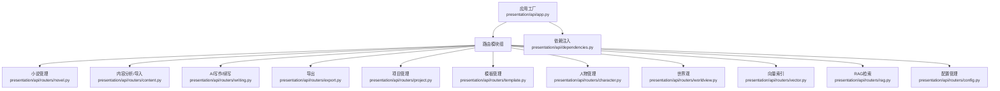
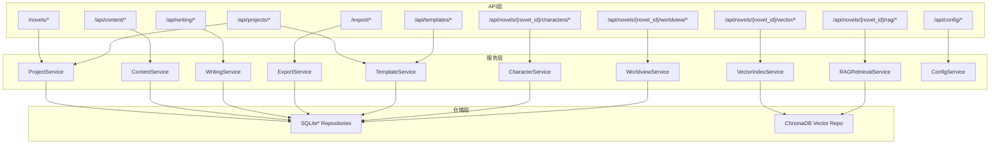
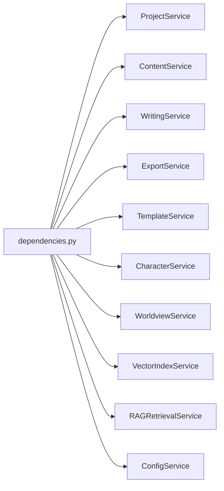

# API接口文档

<cite>
**本文引用的文件**
- [presentation/api/app.py](file://presentation/api/app.py)
- [presentation/api/dependencies.py](file://presentation/api/dependencies.py)
- [presentation/api/routers/novel.py](file://presentation/api/routers/novel.py)
- [presentation/api/routers/content.py](file://presentation/api/routers/content.py)
- [presentation/api/routers/writing.py](file://presentation/api/routers/writing.py)
- [presentation/api/routers/export.py](file://presentation/api/routers/export.py)
- [presentation/api/routers/project.py](file://presentation/api/routers/project.py)
- [presentation/api/routers/template.py](file://presentation/api/routers/template.py)
- [presentation/api/routers/character.py](file://presentation/api/routers/character.py)
- [presentation/api/routers/worldview.py](file://presentation/api/routers/worldview.py)
- [presentation/api/routers/vector.py](file://presentation/api/routers/vector.py)
- [presentation/api/routers/rag.py](file://presentation/api/routers/rag.py)
- [presentation/api/routers/config.py](file://presentation/api/routers/config.py)
- [application/dto/request_dto.py](file://application/dto/request_dto.py)
- [application/dto/response_dto.py](file://application/dto/response_dto.py)
- [domain/exceptions.py](file://domain/exceptions.py)
</cite>

## 目录
1. [简介](#简介)
2. [项目结构](#项目结构)
3. [核心组件](#核心组件)
4. [架构总览](#架构总览)
5. [详细组件分析](#详细组件分析)
6. [依赖分析](#依赖分析)
7. [性能与限流](#性能与限流)
8. [故障排查指南](#故障排查指南)
9. [结论](#结论)
10. [附录](#附录)

## 简介
本文件为 InkTrace 项目的完整 API 接口文档，覆盖小说管理、内容分析、AI写作、导出、项目与模板、人物与世界观、向量索引、RAG检索、配置管理等核心能力。文档包含：
- RESTful 接口清单（HTTP 方法、URL 模式、请求参数、响应格式）
- 数据传输对象（DTO）设计与验证规则
- 错误码说明与异常处理机制
- 认证授权与安全考虑
- API 版本管理与向后兼容策略
- 请求/响应示例与测试调试方法
- 性能优化与限流建议

## 项目结构
InkTrace 后端采用 FastAPI 构建，API 路由按功能域划分，统一在应用工厂中注册，并通过依赖注入模块提供仓储与服务层实例。

图表来源
- [presentation/api/app.py:19-62](file://presentation/api/app.py#L19-L62)
- [presentation/api/dependencies.py:50-177](file://presentation/api/dependencies.py#L50-L177)

章节来源
- [presentation/api/app.py:19-62](file://presentation/api/app.py#L19-L62)
- [presentation/api/dependencies.py:50-177](file://presentation/api/dependencies.py#L50-L177)

## 核心组件
- 应用工厂与中间件：创建 FastAPI 实例、注册 CORS、挂载各路由模块、健康检查端点
- 依赖注入：集中管理仓储与服务实例，支持 LRU 缓存与环境变量配置
- DTO 层：统一请求/响应模型与字段校验规则
- 异常体系：领域异常与 LLM 客户端异常，便于统一错误处理

章节来源
- [presentation/api/app.py:19-62](file://presentation/api/app.py#L19-L62)
- [presentation/api/dependencies.py:50-177](file://presentation/api/dependencies.py#L50-L177)
- [application/dto/request_dto.py:14-97](file://application/dto/request_dto.py#L14-L97)
- [application/dto/response_dto.py:15-200](file://application/dto/response_dto.py#L15-L200)
- [domain/exceptions.py:11-99](file://domain/exceptions.py#L11-L99)

## 架构总览
下图展示 API 路由与服务层交互关系，以及关键 DTO 的映射。

图表来源
- [presentation/api/routers/novel.py:24-161](file://presentation/api/routers/novel.py#L24-L161)
- [presentation/api/routers/content.py:88-213](file://presentation/api/routers/content.py#L88-L213)
- [presentation/api/routers/writing.py:111-277](file://presentation/api/routers/writing.py#L111-L277)
- [presentation/api/routers/export.py:60-102](file://presentation/api/routers/export.py#L60-L102)
- [presentation/api/routers/project.py:91-289](file://presentation/api/routers/project.py#L91-L289)
- [presentation/api/routers/template.py:90-159](file://presentation/api/routers/template.py#L90-L159)
- [presentation/api/routers/character.py:76-279](file://presentation/api/routers/character.py#L76-L279)
- [presentation/api/routers/worldview.py:119-374](file://presentation/api/routers/worldview.py#L119-L374)
- [presentation/api/routers/vector.py:39-76](file://presentation/api/routers/vector.py#L39-L76)
- [presentation/api/routers/rag.py:46-111](file://presentation/api/routers/rag.py#L46-L111)
- [presentation/api/routers/config.py:67-172](file://presentation/api/routers/config.py#L67-L172)

## 详细组件分析

### 小说管理接口（CRUD）
- 基础路径：/novels
- 支持：创建、列表、详情、删除

接口定义
- POST /novels/
  - 请求体：CreateNovelRequest
  - 响应体：NovelResponse
  - 说明：创建小说项目并返回项目概要
- GET /novels/
  - 查询参数：无
  - 响应体：List[NovelResponse]
  - 说明：列出所有小说项目
- GET /novels/{novel_id}
  - 路径参数：novel_id
  - 响应体：NovelResponse
  - 说明：获取指定小说详情
- DELETE /novels/{novel_id}
  - 路径参数：novel_id
  - 响应体：字典
  - 说明：删除小说项目

请求 DTO
- CreateNovelRequest
  - 字段：title、author、genre、target_word_count、options
  - 校验：字符串长度、数值范围

响应 DTO
- NovelResponse
  - 字段：id、title、author、genre、target_word_count、current_word_count、chapter_count、status、created_at、updated_at、chapters、memory

章节来源
- [presentation/api/routers/novel.py:24-161](file://presentation/api/routers/novel.py#L24-L161)
- [application/dto/request_dto.py:21-28](file://application/dto/request_dto.py#L21-L28)
- [application/dto/response_dto.py:22-34](file://application/dto/response_dto.py#L22-L34)

### 内容分析接口（文风/剧情/内存/结构整理）
- 基础路径：/api/content
- 支持：导入小说、文风分析、剧情分析、获取记忆、组织故事结构

接口定义
- POST /api/content/import
  - 请求体：ImportNovelRequest
  - 响应体：字典（包含 novel、project_id、memory、analysis_status）
  - 说明：导入小说并进行章节拆分与增量分析，合并记忆
- GET /api/content/style/{novel_id}
  - 路径参数：novel_id
  - 响应体：StyleAnalysisResponse
  - 说明：分析文风特征
- GET /api/content/plot/{novel_id}
  - 路径参数：novel_id
  - 响应体：PlotAnalysisResponse
  - 说明：分析剧情要素
- GET /api/content/memory/{novel_id}
  - 路径参数：novel_id
  - 响应体：字典（project_id、memory）
  - 说明：获取项目绑定的记忆
- POST /api/content/organize/{novel_id}
  - 路径参数：novel_id
  - 响应体：字典（status、project_id、memory）
  - 说明：对导入内容进行全局收敛与进度更新

请求 DTO
- ImportNovelRequest
  - 字段：novel_id、file_path、options
- AnalyzeNovelRequest
  - 字段：novel_id、analyze_style、analyze_plot、options

响应 DTO
- StyleAnalysisResponse
  - 字段：vocabulary_stats、sentence_patterns、rhetoric_stats、dialogue_style、narrative_voice、pacing、sample_sentences
- PlotAnalysisResponse
  - 字段：characters、timeline、foreshadowings

章节来源
- [presentation/api/routers/content.py:88-213](file://presentation/api/routers/content.py#L88-L213)
- [application/dto/request_dto.py:30-43](file://application/dto/request_dto.py#L30-L43)
- [application/dto/response_dto.py:61-77](file://application/dto/response_dto.py#L61-L77)
- [application/dto/response_dto.py:72-77](file://application/dto/response_dto.py#L72-L77)

### AI写作接口（章节生成/续写/剧情规划）
- 基础路径：/api/writing
- 支持：生成章节、续写下一章、规划剧情走向

接口定义
- POST /api/writing/generate
  - 请求体：GenerateChapterRequest
  - 响应体：GenerateChapterResponse
  - 说明：生成章节；支持灰度切换至 Agent 链路
- POST /api/writing/continue
  - 请求体：ContinueWritingRequest
  - 响应体：ContinueWritingResponse
  - 说明：基于最新章节与记忆续写下一章
- POST /api/writing/plan
  - 请求体：PlanPlotRequest
  - 响应体：List[dict]
  - 说明：规划剧情节点

请求 DTO
- GenerateChapterRequest
  - 字段：novel_id、goal、constraints、context_summary、chapter_count、target_word_count、options
- ContinueWritingRequest
  - 字段：novel_id、goal、target_word_count、options
- PlanPlotRequest
  - 字段：novel_id、goal、constraints、chapter_count、options

响应 DTO
- GenerateChapterResponse
  - 字段：chapter_id、content、word_count、metadata
- ContinueWritingResponse
  - 字段：content、word_count、metadata

灰度与路由控制
- 环境变量：
  - INKTRACE_ENABLE_AGENT：启用 Agent 链路
  - INKTRACE_AGENT_GRAY_RATIO：灰度比例（0-100）
- 路由逻辑：根据 novel_id 与 goal 的哈希决定是否走 Agent 链路

章节来源
- [presentation/api/routers/writing.py:111-277](file://presentation/api/routers/writing.py#L111-L277)
- [application/dto/request_dto.py:45-71](file://application/dto/request_dto.py#L45-L71)
- [application/dto/response_dto.py:86-99](file://application/dto/response_dto.py#L86-L99)
- [application/dto/response_dto.py:94-99](file://application/dto/response_dto.py#L94-L99)

### 导出接口
- 基础路径：/export
- 支持：导出小说、下载文件

接口定义
- POST /export/
  - 请求体：ExportNovelRequest
  - 响应体：ExportResponse
  - 说明：导出小说到 exports 目录
- GET /export/download/{file_path:path}
  - 路径参数：file_path（相对 exports 目录）
  - 响应体：FileResponse
  - 说明：安全下载导出文件

请求 DTO
- ExportNovelRequest
  - 字段：novel_id、output_path、format、options

响应 DTO
- ExportResponse
  - 字段：file_path、format、word_count、chapter_count

安全校验
- 路径校验：防止目录穿越，仅允许 exports 目录内文件

章节来源
- [presentation/api/routers/export.py:60-102](file://presentation/api/routers/export.py#L60-L102)
- [application/dto/request_dto.py:73-79](file://application/dto/request_dto.py#L73-L79)
- [application/dto/response_dto.py:101-107](file://application/dto/response_dto.py#L101-L107)

### 项目管理接口（二期）
- 基础路径：/api/projects
- 支持：创建项目（含AI初始化）、列表、详情、更新、归档/激活、删除

接口定义
- POST /api/projects
  - 请求体：CreateProjectRequest
  - 响应体：CreateProjectAIResponse
  - 说明：创建项目并生成首章，返回项目、记忆与首章
- GET /api/projects
  - 查询参数：status（可选）
  - 响应体：List[ProjectResponse]
  - 说明：按状态过滤项目列表
- GET /api/projects/{project_id}
  - 路径参数：project_id
  - 响应体：ProjectResponse
  - 说明：获取项目详情
- PUT /api/projects/{project_id}
  - 请求体：UpdateProjectRequest
  - 响应体：ProjectResponse
  - 说明：更新项目配置
- POST /api/projects/{project_id}/archive
  - 路径参数：project_id
  - 响应体：ProjectResponse
  - 说明：归档项目
- POST /api/projects/{project_id}/activate
  - 路径参数：project_id
  - 响应体：ProjectResponse
  - 说明：激活项目
- DELETE /api/projects/{project_id}
  - 路径参数：project_id
  - 响应体：字典
  - 说明：删除项目

请求 DTO
- CreateProjectRequest
  - 字段：name、genre、target_words、style、protagonist_setting、worldview
- UpdateProjectRequest
  - 字段：name、genre、target_words、chapter_words、style_intensity

响应 DTO
- ProjectResponse
  - 字段：id、name、novel_id、genre、target_words、chapter_words、style_intensity、status、created_at、updated_at
- CreateProjectAIResponse
  - 字段：project、memory、first_chapter（包含 title、content、word_count）

章节来源
- [presentation/api/routers/project.py:91-289](file://presentation/api/routers/project.py#L91-L289)

### 模板管理接口（二期）
- 基础路径：/api/templates
- 支持：列表、内置/自定义筛选、详情、创建、应用、删除

接口定义
- GET /api/templates
  - 查询参数：include_builtin（默认 true）
  - 响应体：List[TemplateResponse]
- GET /api/templates/builtin
  - 响应体：List[TemplateResponse]
- GET /api/templates/custom
  - 响应体：List[TemplateResponse]
- GET /api/templates/{template_id}
  - 路径参数：template_id
  - 响应体：TemplateDetailResponse
- POST /api/templates
  - 请求体：CreateTemplateRequest
  - 响应体：TemplateResponse
- POST /api/templates/{template_id}/apply/{project_id}
  - 路径参数：template_id、project_id
  - 响应体：字典
- DELETE /api/templates/{template_id}
  - 路径参数：template_id
  - 响应体：字典

请求 DTO
- CreateTemplateRequest
  - 字段：name、genre、description

响应 DTO
- TemplateResponse
  - 字段：id、name、genre、description、is_builtin
- TemplateDetailResponse
  - 字段：id、name、genre、description、worldview_framework、character_templates、plot_templates、style_reference、is_builtin

章节来源
- [presentation/api/routers/template.py:90-159](file://presentation/api/routers/template.py#L90-L159)

### 人物管理接口（二期）
- 基础路径：/api/novels/{novel_id}/characters
- 支持：创建、列表（按角色/关键词）、详情、更新、删除、添加/获取/删除关系、更新状态/查询历史

接口定义
- POST /api/novels/{novel_id}/characters
- GET /api/novels/{novel_id}/characters
- GET /api/novels/{novel_id}/characters/{character_id}
- PUT /api/novels/{novel_id}/characters/{character_id}
- DELETE /api/novels/{novel_id}/characters/{character_id}
- POST /api/novels/{novel_id}/characters/{character_id}/relations
- GET /api/novels/{novel_id}/characters/{character_id}/relations
- DELETE /api/novels/{novel_id}/characters/{character_id}/relations/{target_id}
- POST /api/novels/{novel_id}/characters/{character_id}/state
- GET /api/novels/{novel_id}/characters/{character_id}/states

请求 DTO
- CreateCharacterRequest
  - 字段：name、role、background、personality、appearance、age、gender、title
- UpdateCharacterRequest
  - 字段：name、background、personality、appearance、age、gender、title
- AddRelationRequest
  - 字段：target_id、relation_type、description

响应 DTO
- CharacterResponse
  - 字段：id、novel_id、name、role、background、personality、appearance、age、gender、title、abilities、current_state、appearance_count
- RelationResponse
  - 字段：target_id、relation_type、description

章节来源
- [presentation/api/routers/character.py:76-279](file://presentation/api/routers/character.py#L76-L279)

### 世界观接口（二期）
- 基础路径：/api/novels/{novel_id}/worldview
- 支持：获取/更新力量体系、一致性检查、功法/势力/地点/物品的增删改查

接口定义
- GET /api/novels/{novel_id}/worldview
- PUT /api/novels/{novel_id}/worldview/power-system
- POST /api/novels/{novel_id}/worldview/check
- POST /api/novels/{novel_id}/worldview/techniques
- GET /api/novels/{novel_id}/worldview/techniques
- DELETE /api/novels/{novel_id}/worldview/techniques/{technique_id}
- POST /api/novels/{novel_id}/worldview/factions
- GET /api/novels/{novel_id}/worldview/factions
- DELETE /api/novels/{novel_id}/worldview/factions/{faction_id}
- POST /api/novels/{novel_id}/worldview/locations
- GET /api/novels/{novel_id}/worldview/locations
- DELETE /api/novels/{novel_id}/worldview/locations/{location_id}
- POST /api/novels/{novel_id}/worldview/items
- GET /api/novels/{novel_id}/worldview/items
- DELETE /api/novels/{novel_id}/worldview/items/{item_id}

请求 DTO
- UpdatePowerSystemRequest
  - 字段：name、levels
- CreateTechniqueRequest
  - 字段：name、level_name、level_rank、description、effect、requirement
- CreateFactionRequest
  - 字段：name、level、description、territory、leader
- CreateLocationRequest
  - 字段：name、description、faction_id、parent_id
- CreateItemRequest
  - 字段：name、item_type、description、effect、rarity

响应 DTO
- WorldviewResponse
  - 字段：id、novel_id、name、power_system
- 技术/势力/地点/物品响应 DTO 对应字段详见路由文件

章节来源
- [presentation/api/routers/worldview.py:119-374](file://presentation/api/routers/worldview.py#L119-L374)

### 向量索引接口（三期）
- 基础路径：/api/novels/{novel_id}/vector
- 支持：索引小说内容、查询索引状态、删除索引

接口定义
- POST /api/novels/{novel_id}/vector/index
- GET /api/novels/{novel_id}/vector/status
- DELETE /api/novels/{novel_id}/vector/index

响应 DTO
- IndexStatusResponse
  - 字段：total_vectors、chapters_count、is_indexed
- IndexResultResponse
  - 字段：chapters_indexed、characters_indexed、worldview_indexed、errors

章节来源
- [presentation/api/routers/vector.py:39-76](file://presentation/api/routers/vector.py#L39-L76)

### RAG检索接口（三期）
- 基础路径：/api/novels/{novel_id}/rag
- 支持：语义检索、获取RAG上下文、构建Prompt

接口定义
- POST /api/novels/{novel_id}/rag/search
- POST /api/novels/{novel_id}/rag/context
- POST /api/novels/{novel_id}/rag/prompt

请求 DTO
- SearchRequest
  - 字段：query、n_results

响应 DTO
- SearchResultItem
  - 字段：id、content、score、source_type、source_id
- RAGContextResponse
  - 字段：query、chapters、characters、worldview

章节来源
- [presentation/api/routers/rag.py:46-111](file://presentation/api/routers/rag.py#L46-L111)

### 配置管理接口（配置管理路由）
- 基础路径：/api/config
- 支持：获取/更新/测试/删除 LLM 配置、检查配置是否存在

接口定义
- GET /api/config/llm
- POST /api/config/llm
- POST /api/config/llm/test
- DELETE /api/config/llm
- GET /api/config/llm/exists

请求 DTO
- LLMConfigRequest
  - 字段：deepseek_api_key、kimi_api_key
- ConfigTestRequest
  - 字段：deepseek_api_key、kimi_api_key

响应 DTO
- LLMConfigResponse
  - 字段：deepseek_api_key、kimi_api_key、created_at、updated_at、has_config
- ConfigTestResponse
  - 字段：deepseek、kimi

章节来源
- [presentation/api/routers/config.py:67-172](file://presentation/api/routers/config.py#L67-L172)

## 依赖分析
- 路由与服务层解耦：路由仅负责参数解析与调用服务，业务逻辑集中在服务层
- 仓储抽象：通过接口隔离具体实现（SQLite、ChromaDB），便于替换与扩展
- 依赖注入：集中管理服务实例与缓存，减少重复创建与配置分散

图表来源
- [presentation/api/dependencies.py:122-177](file://presentation/api/dependencies.py#L122-L177)

章节来源
- [presentation/api/dependencies.py:50-177](file://presentation/api/dependencies.py#L50-L177)

## 性能与限流
- Agent 灰度控制：通过环境变量 INKTRACE_AGENT_GRAY_RATIO 控制流量比例，避免全量切换风险
- LRU 缓存：依赖注入模块使用 LRU 缓存仓储与工厂实例，降低重复初始化开销
- I/O 优化：导出接口对文件路径进行严格校验，避免无效扫描与磁盘 IO
- 并发建议：对外部 LLM 调用建议增加超时与重试策略，结合服务端队列与幂等键避免重复执行

[本节为通用性能建议，无需特定文件引用]

## 故障排查指南
常见错误与处理
- 400 参数错误：请求 DTO 校验失败（如数值越界、枚举非法）
- 404 资源不存在：小说/项目/模板/人物等实体未找到
- 500 服务器内部错误：服务层异常、外部 LLM 连接失败、向量索引异常
- Agent 链路失败：检查 INKTRACE_ENABLE_AGENT 与 INKTRACE_AGENT_GRAY_RATIO 配置，确认 novel_id 与 goal 的哈希分布

异常类型参考
- 领域异常：EntityNotFoundError、InvalidOperationError、ValidationError
- LLM 客户端异常：APIKeyError、RateLimitError、NetworkError、TokenLimitError

章节来源
- [domain/exceptions.py:11-99](file://domain/exceptions.py#L11-L99)
- [presentation/api/routers/writing.py:130-171](file://presentation/api/routers/writing.py#L130-L171)
- [presentation/api/routers/export.py:26-57](file://presentation/api/routers/export.py#L26-L57)

## 结论
本 API 文档系统化梳理了 InkTrace 的核心接口与数据模型，明确了请求/响应 DTO 的设计与验证规则，提供了错误处理与安全策略建议。通过依赖注入与仓储抽象，系统具备良好的可维护性与扩展性。建议在生产环境中配合限流、熔断与日志审计机制，确保稳定性与可观测性。

[本节为总结性内容，无需特定文件引用]

## 附录

### API 版本管理与向后兼容
- 版本号：应用工厂中声明版本号，便于客户端识别
- 兼容策略：新增接口以新路由前缀区分（如 /api/content、/api/writing、/api/projects 等），旧接口保持不变以保证兼容

章节来源
- [presentation/api/app.py:21-25](file://presentation/api/app.py#L21-L25)

### 认证授权与安全
- CORS：应用工厂已启用跨域支持，生产部署需限制允许来源
- 路径安全：导出下载接口对文件路径进行严格校验，防止目录穿越
- 配置安全：LLM 密钥存储于本地数据库并加密，测试接口用于验证可用性而非明文暴露

章节来源
- [presentation/api/app.py:27-33](file://presentation/api/app.py#L27-L33)
- [presentation/api/routers/export.py:26-57](file://presentation/api/routers/export.py#L26-L57)
- [presentation/api/routers/config.py:56-64](file://presentation/api/routers/config.py#L56-L64)

### 请求/响应示例与测试方法
- 请求示例：使用 curl 或 Postman 发送 JSON 请求，参考各接口的请求 DTO 字段
- 响应示例：关注 success、message、trace_id 等通用字段，以及各接口特有的 payload
- 调试技巧：
  - 开启服务端日志，观察路由匹配与异常栈
  - 使用 DTO 的字段约束定位问题（如长度、范围、枚举）
  - 对外部 LLM 调用增加超时与重试，必要时降级为“传统”生成路径

[本节为通用指导，无需特定文件引用]