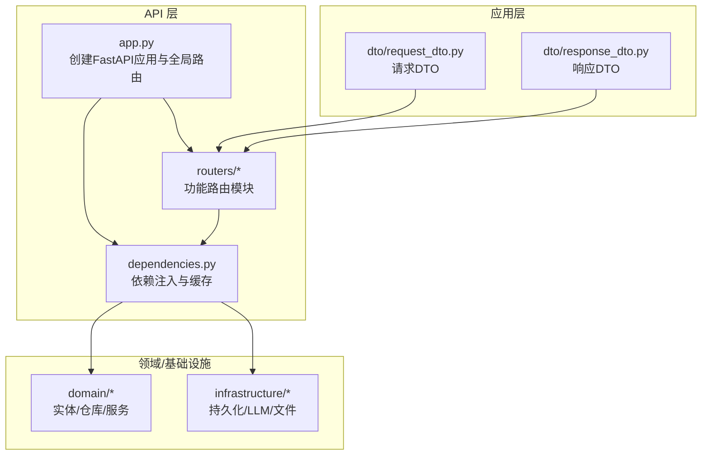
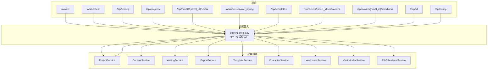
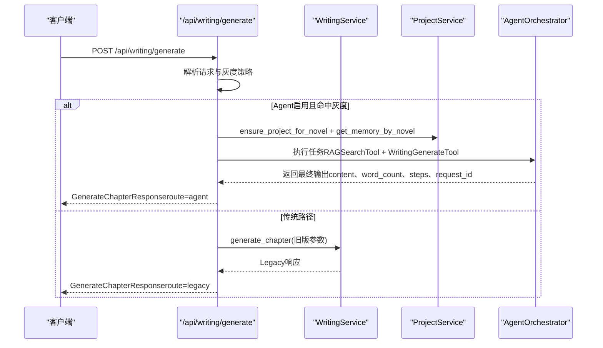
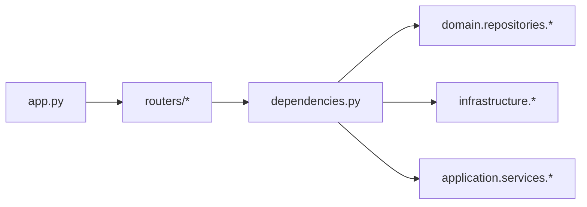

# API接口文档

<cite>
**本文引用的文件**
- [presentation/api/app.py](file://presentation/api/app.py)
- [presentation/api/dependencies.py](file://presentation/api/dependencies.py)
- [presentation/api/routers/novel.py](file://presentation/api/routers/novel.py)
- [presentation/api/routers/content.py](file://presentation/api/routers/content.py)
- [presentation/api/routers/writing.py](file://presentation/api/routers/writing.py)
- [presentation/api/routers/project.py](file://presentation/api/routers/project.py)
- [presentation/api/routers/vector.py](file://presentation/api/routers/vector.py)
- [presentation/api/routers/rag.py](file://presentation/api/routers/rag.py)
- [presentation/api/routers/template.py](file://presentation/api/routers/template.py)
- [presentation/api/routers/character.py](file://presentation/api/routers/character.py)
- [presentation/api/routers/worldview.py](file://presentation/api/routers/worldview.py)
- [presentation/api/routers/export.py](file://presentation/api/routers/export.py)
- [presentation/api/routers/config.py](file://presentation/api/routers/config.py)
- [application/dto/request_dto.py](file://application/dto/request_dto.py)
- [application/dto/response_dto.py](file://application/dto/response_dto.py)
</cite>

## 目录
1. [简介](#简介)
2. [项目结构](#项目结构)
3. [核心组件](#核心组件)
4. [架构总览](#架构总览)
5. [详细组件分析](#详细组件分析)
6. [依赖分析](#依赖分析)
7. [性能考虑](#性能考虑)
8. [故障排查指南](#故障排查指南)
9. [结论](#结论)
10. [附录](#附录)

## 简介
本文件为 InkTrace 项目的完整 API 接口文档，覆盖小说管理、内容分析、写作服务、向量检索、系统管理等模块。文档按功能模块组织，逐项给出 HTTP 方法、URL 模式、请求参数、响应格式与错误码，并说明认证机制、权限控制与安全注意事项。同时提供 DTO 设计说明、API 版本管理与兼容策略、测试指南、调试技巧以及客户端集成最佳实践与性能优化建议。

## 项目结构
后端采用 FastAPI 应用，通过路由模块化组织各功能域；依赖注入在统一的依赖模块中集中管理；应用层 DTO 提供请求/响应的数据契约；领域层与基础设施层负责业务逻辑与持久化实现。

图表来源
- [presentation/api/app.py:19-62](file://presentation/api/app.py#L19-L62)
- [presentation/api/dependencies.py:50-178](file://presentation/api/dependencies.py#L50-L178)

章节来源
- [presentation/api/app.py:19-62](file://presentation/api/app.py#L19-L62)
- [presentation/api/dependencies.py:50-178](file://presentation/api/dependencies.py#L50-L178)

## 核心组件
- FastAPI 应用与路由注册：统一创建应用、启用 CORS、注册各期路由与健康检查端点。
- 依赖注入：集中管理数据库、向量库、LLM 工厂、各类服务实例，支持缓存与延迟加载。
- DTO：统一的请求/响应数据模型，确保前后端契约一致与参数校验。

章节来源
- [presentation/api/app.py:19-62](file://presentation/api/app.py#L19-L62)
- [presentation/api/dependencies.py:50-178](file://presentation/api/dependencies.py#L50-L178)
- [application/dto/request_dto.py:14-97](file://application/dto/request_dto.py#L14-L97)
- [application/dto/response_dto.py:15-200](file://application/dto/response_dto.py#L15-L200)

## 架构总览
下图展示 API 路由与服务依赖关系，体现“路由 → 依赖注入 → 应用服务 → 领域/基础设施”的调用链。

图表来源
- [presentation/api/app.py:35-52](file://presentation/api/app.py#L35-L52)
- [presentation/api/dependencies.py:122-178](file://presentation/api/dependencies.py#L122-L178)

## 详细组件分析

### 小说管理 API（/novels）
- 功能：创建、查询、删除小说项目；获取小说详情与章节统计。
- 关键路由
  - POST /novels/：创建小说项目
  - GET /novels/：列出所有小说
  - GET /novels/{novel_id}：获取小说详情
  - DELETE /novels/{novel_id}：删除小说
- 认证与权限：无显式鉴权装饰器，遵循全局中间件策略。
- 错误码
  - 404：小说不存在
  - 200/201：成功
- 请求参数
  - POST /novels/：CreateNovelRequest（标题、作者、题材、目标字数、可选选项）
- 响应格式
  - NovelResponse（含 id、title、genre、word_count、章节统计、状态、时间戳等）

章节来源
- [presentation/api/routers/novel.py:24-133](file://presentation/api/routers/novel.py#L24-L133)
- [application/dto/request_dto.py:21-28](file://application/dto/request_dto.py#L21-L28)
- [application/dto/response_dto.py:22-34](file://application/dto/response_dto.py#L22-L34)

### 内容分析 API（/api/content）
- 功能：导入小说文件、分析文风/剧情、获取记忆体、整理故事结构。
- 关键路由
  - POST /api/content/import：导入并分析
  - GET /api/content/style/{novel_id}：文风分析
  - GET /api/content/plot/{novel_id}：剧情分析
  - GET /api/content/memory/{novel_id}：获取记忆体
  - POST /api/content/organize/{novel_id}：整理故事结构
- 认证与权限：无显式鉴权装饰器。
- 错误码
  - 400：参数或处理失败
  - 404：资源不存在
  - 200：成功
- 请求参数
  - POST /api/content/import：ImportNovelRequest（novel_id、file_path、可选选项）
- 响应格式
  - StyleAnalysisResponse、PlotAnalysisResponse、通用响应结构

章节来源
- [presentation/api/routers/content.py:66-178](file://presentation/api/routers/content.py#L66-L178)
- [application/dto/request_dto.py:30-35](file://application/dto/request_dto.py#L30-L35)
- [application/dto/response_dto.py:61-77](file://application/dto/response_dto.py#L61-L77)

### 写作服务 API（/api/writing）
- 功能：规划剧情、生成章节、继续写作（工具链）。
- 关键路由
  - POST /api/writing/plan：规划剧情节点
  - POST /api/writing/generate：生成章节（支持 Agent 灰度分流）
  - POST /api/writing/continue：继续写作并落库
- 认证与权限：无显式鉴权装饰器。
- 错误码
  - 400：参数或执行失败
  - 500：Agent 未生成内容等内部错误
  - 200：成功
- 请求参数
  - POST /api/writing/plan：PlanPlotRequest（novel_id、goal、chapter_count 等）
  - POST /api/writing/generate：GenerateChapterRequest（novel_id、goal、target_word_count、options 等）
  - POST /api/writing/continue：ContinueWritingRequest（novel_id、goal、target_word_count 等）
- 响应格式
  - PlanPlot 返回节点数组
  - Generate 返回 GenerateChapterResponse（含元数据 route、灰度比例等）
  - Continue 返回 ContinueWritingResponse（含章节号、使用记忆体等）

图表来源
- [presentation/api/routers/writing.py:107-170](file://presentation/api/routers/writing.py#L107-L170)

章节来源
- [presentation/api/routers/writing.py:84-247](file://presentation/api/routers/writing.py#L84-L247)
- [application/dto/request_dto.py:45-62](file://application/dto/request_dto.py#L45-L62)
- [application/dto/response_dto.py:86-99](file://application/dto/response_dto.py#L86-L99)

### 项目管理 API（/api/projects）
- 功能：创建/查询/更新/归档/激活/删除项目；返回项目与首章信息。
- 关键路由
  - POST /api/projects：创建项目（AI 初始化设定、首章生成）
  - GET /api/projects：列表（可按状态过滤）
  - GET /api/projects/{project_id}：详情
  - PUT /api/projects/{project_id}：更新配置
  - POST /api/projects/{project_id}/archive：归档
  - POST /api/projects/{project_id}/activate：激活
  - DELETE /api/projects/{project_id}：删除
- 认证与权限：无显式鉴权装饰器。
- 错误码
  - 400：无效枚举值或操作失败
  - 404：资源不存在
  - 200：成功
- 请求参数
  - POST：CreateProjectRequest（name、genre、target_words、style、protagonist_setting、可选 worldview）
  - PUT：UpdateProjectRequest（name、genre、target_words、chapter_words、style_intensity 可选）
- 响应格式
  - CreateProjectAIResponse（包含项目、记忆体、首章）
  - ProjectResponse（项目基本信息）

章节来源
- [presentation/api/routers/project.py:91-290](file://presentation/api/routers/project.py#L91-L290)
- [application/dto/request_dto.py:29-35](file://application/dto/request_dto.py#L29-L35)
- [application/dto/response_dto.py:49-59](file://application/dto/response_dto.py#L49-L59)

### 向量检索 API（/api/novels/{novel_id}/vector）
- 功能：对小说内容建立向量索引、查询索引状态、删除索引。
- 关键路由
  - POST /api/novels/{novel_id}/vector/index：建立索引
  - GET /api/novels/{novel_id}/vector/status：索引状态
  - DELETE /api/novels/{novel_id}/vector/index：删除索引
- 认证与权限：无显式鉴权装饰器。
- 错误码
  - 500：索引异常
  - 200：成功
- 响应格式
  - IndexResultResponse（章节/角色/世界观索引统计与错误列表）
  - IndexStatusResponse（总数、章节数、是否已索引）

章节来源
- [presentation/api/routers/vector.py:39-77](file://presentation/api/routers/vector.py#L39-L77)
- [application/dto/response_dto.py:101-107](file://application/dto/response_dto.py#L101-L107)

### RAG 检索 API（/api/novels/{novel_id}/rag）
- 功能：语义检索、构建 RAG 上下文、生成 Prompt。
- 关键路由
  - POST /api/novels/{novel_id}/rag/search：语义搜索
  - POST /api/novels/{novel_id}/rag/context：获取上下文
  - POST /api/novels/{novel_id}/rag/prompt：构建 Prompt
- 认证与权限：无显式鉴权装饰器。
- 错误码
  - 200：成功
- 请求参数
  - SearchRequest：query、n_results（默认5）
- 响应格式
  - 搜索返回 SearchResultItem 列表
  - 上下文返回 RAGContextResponse（按章节/角色/世界观分类）
  - Prompt 返回字符串

章节来源
- [presentation/api/routers/rag.py:46-112](file://presentation/api/routers/rag.py#L46-L112)
- [application/dto/response_dto.py:26-39](file://application/dto/response_dto.py#L26-L39)

### 模板 API（/api/templates）
- 功能：模板列表、内置/自定义模板、模板详情、创建/应用/删除模板。
- 关键路由
  - GET /api/templates：模板列表
  - GET /api/templates/builtin：内置模板
  - GET /api/templates/custom：自定义模板
  - GET /api/templates/{template_id}：模板详情
  - POST /api/templates：创建自定义模板
  - POST /api/templates/{template_id}/apply/{project_id}：应用到项目
  - DELETE /api/templates/{template_id}：删除模板
- 认证与权限：无显式鉴权装饰器。
- 错误码
  - 400：无效题材类型或操作失败
  - 404：模板不存在
  - 200：成功
- 请求参数
  - POST：CreateTemplateRequest（name、genre、description）
- 响应格式
  - TemplateResponse、TemplateDetailResponse

章节来源
- [presentation/api/routers/template.py:53-160](file://presentation/api/routers/template.py#L53-L160)
- [application/dto/response_dto.py:28-46](file://application/dto/response_dto.py#L28-L46)

### 人物管理 API（/api/novels/{novel_id}/characters）
- 功能：创建/查询/更新/删除人物；添加/获取/删除人物关系；更新人物状态与查看历史。
- 关键路由
  - POST /api/novels/{novel_id}/characters：创建人物
  - GET /api/novels/{novel_id}/characters：列表（支持按角色/关键词筛选）
  - GET /api/novels/{novel_id}/characters/{character_id}：详情
  - PUT /api/novels/{novel_id}/characters/{character_id}：更新人物
  - DELETE /api/novels/{novel_id}/characters/{character_id}：删除人物
  - POST /api/novels/{novel_id}/characters/{character_id}/relations：添加关系
  - GET /api/novels/{novel_id}/characters/{character_id}/relations：关系列表
  - DELETE /api/novels/{novel_id}/characters/{character_id}/relations/{target_id}：移除关系
  - POST /api/novels/{novel_id}/characters/{character_id}/state：更新状态
  - GET /api/novels/{novel_id}/characters/{character_id}/states：状态历史
- 认证与权限：无显式鉴权装饰器。
- 错误码
  - 400：无效角色/关系类型或操作失败
  - 404：人物不存在
  - 200：成功
- 请求参数
  - POST：CreateCharacterRequest（name、role、背景/个性/外貌/年龄/性别/头衔）
  - PUT：UpdateCharacterRequest（可选字段）
  - POST 添加关系：AddRelationRequest（target_id、relation_type、description）
  - POST 更新状态：state 字符串
- 响应格式
  - CharacterResponse、RelationResponse

章节来源
- [presentation/api/routers/character.py:76-280](file://presentation/api/routers/character.py#L76-L280)
- [application/dto/response_dto.py:49-69](file://application/dto/response_dto.py#L49-L69)

### 世界观 API（/api/novels/{novel_id}/worldview）
- 功能：获取/更新力量体系；一致性检查；功法/势力/地点/物品的增删改查。
- 关键路由
  - GET /api/novels/{novel_id}/worldview：获取世界观
  - PUT /api/novels/{novel_id}/worldview/power-system：更新力量体系
  - POST /api/novels/{novel_id}/worldview/check：一致性检查
  - 功法：POST/GET/DELETE /api/novels/{novel_id}/worldview/techniques
  - 势力：POST/GET/DELETE /api/novels/{novel_id}/worldview/factions
  - 地点：POST/GET/DELETE /api/novels/{novel_id}/worldview/locations
  - 物品：POST/GET/DELETE /api/novels/{novel_id}/worldview/items
- 认证与权限：无显式鉴权装饰器。
- 错误码
  - 400：无效枚举或操作失败
  - 404：资源不存在
  - 200：成功
- 请求参数
  - 功法：CreateTechniqueRequest（name、level_name、level_rank、description、effect、requirement）
  - 势力：CreateFactionRequest（name、level、description、territory、leader）
  - 地点：CreateLocationRequest（name、description、faction_id、parent_id）
  - 物品：CreateItemRequest（name、item_type、description、effect、rarity）
  - 力量体系：UpdatePowerSystemRequest（name、levels）
- 响应格式
  - 技能/势力/地点/物品/世界观/一致性检查等专用响应模型

章节来源
- [presentation/api/routers/worldview.py:119-375](file://presentation/api/routers/worldview.py#L119-L375)
- [application/dto/response_dto.py:65-97](file://application/dto/response_dto.py#L65-L97)

### 导出服务 API（/export）
- 功能：导出小说、下载导出文件。
- 关键路由
  - POST /export：导出小说
  - GET /export/download/{file_path}：下载文件（相对 exports 目录的安全路径校验）
- 认证与权限：无显式鉴权装饰器。
- 错误码
  - 400：无效文件路径/非文件
  - 403：路径越权
  - 404：文件不存在
  - 200：成功
- 请求参数
  - POST：ExportNovelRequest（novel_id、output_path、format、options）
- 响应格式
  - ExportResponse（文件路径、格式、字数、章节数）

章节来源
- [presentation/api/routers/export.py:60-103](file://presentation/api/routers/export.py#L60-L103)
- [application/dto/request_dto.py:73-79](file://application/dto/request_dto.py#L73-L79)
- [application/dto/response_dto.py:101-107](file://application/dto/response_dto.py#L101-L107)

### 配置管理 API（/api/config）
- 功能：获取/更新/测试/删除 LLM 配置；检查配置是否存在。
- 关键路由
  - GET /api/config/llm：获取 LLM 配置（解密后）
  - POST /api/config/llm：更新 LLM 配置
  - POST /api/config/llm/test：测试 LLM 配置
  - DELETE /api/config/llm：删除 LLM 配置
  - GET /api/config/llm/exists：检查配置是否存在
- 认证与权限：无显式鉴权装饰器。
- 错误码
  - 400：配置验证失败
  - 500：解密失败或测试异常
  - 200：成功
- 请求参数
  - POST 更新：LLMConfigRequest（deepseek_api_key、kimi_api_key）
  - POST 测试：ConfigTestRequest（同上）
- 响应格式
  - LLMConfigResponse、ConfigTestResponse、存在性检查布尔值

章节来源
- [presentation/api/routers/config.py:67-173](file://presentation/api/routers/config.py#L67-L173)

## 依赖分析
- 路由与应用：app.py 注册全部路由，统一暴露健康检查。
- 依赖注入：dependencies.py 提供 LRU 缓存的工厂方法，集中创建仓储与服务实例，降低重复初始化成本。
- 服务耦合：各路由通过依赖注入获取对应服务，避免直接构造，提升可测试性与可替换性。
- 外部依赖：SQLite、ChromaDB、LLM 客户端工厂，均通过环境变量与配置文件管理。

图表来源
- [presentation/api/app.py:35-52](file://presentation/api/app.py#L35-L52)
- [presentation/api/dependencies.py:122-178](file://presentation/api/dependencies.py#L122-L178)

章节来源
- [presentation/api/app.py:35-52](file://presentation/api/app.py#L35-L52)
- [presentation/api/dependencies.py:122-178](file://presentation/api/dependencies.py#L122-L178)

## 性能考虑
- 依赖缓存：LRU 缓存减少数据库与向量库初始化开销，适合高并发场景。
- Agent 灰度分流：通过哈希与百分比控制 Agent 使用比例，便于渐进式上线与性能评估。
- 分页与限制：搜索结果数量可控（默认5），避免过大数据集返回。
- I/O 安全：导出下载路径严格校验，防止路径穿越与越权访问。

## 故障排查指南
- 常见错误定位
  - 参数校验失败：检查请求 DTO 字段范围与必填项（如长度、数值范围、枚举值）。
  - 资源不存在：确认 novel_id/project_id/character_id 等标识有效。
  - Agent 未生成内容：检查 AgentOrchestrator 执行上下文与工具链配置。
  - 导出下载失败：确认文件位于 exports 目录且路径未被篡改。
- 调试技巧
  - 开启服务端日志，观察路由与依赖注入调用链。
  - 使用最小请求体复现问题，逐步缩小范围。
  - 对 Agent 路径与传统路径分别测试，确认灰度策略生效。
- 安全建议
  - 生产环境配置 CORS 白名单与安全头。
  - 配置管理仅用于开发/测试，生产密钥应来自安全存储。

章节来源
- [presentation/api/routers/writing.py:40-64](file://presentation/api/routers/writing.py#L40-L64)
- [presentation/api/routers/export.py:26-58](file://presentation/api/routers/export.py#L26-L58)
- [presentation/api/routers/config.py:102-124](file://presentation/api/routers/config.py#L102-L124)

## 结论
本 API 文档系统梳理了 InkTrace 的核心功能域与接口契约，明确了请求/响应模型、错误处理与安全策略。通过依赖注入与 DTO 设计，API 具备良好的扩展性与可维护性。建议在生产环境中完善鉴权与审计、强化配置管理与密钥安全，并持续监控 Agent 灰度效果与性能指标。

## 附录

### DTO 设计与使用
- 请求 DTO（request_dto.py）
  - BaseRequest：通用上下文（用户ID、会话ID、追踪ID）
  - CreateNovelRequest、ImportNovelRequest、AnalyzeNovelRequest、GenerateChapterRequest、ContinueWritingRequest、PlanPlotRequest、ExportNovelRequest、UpdateChapterRequest、CreateCharacterRequest
- 响应 DTO（response_dto.py）
  - BaseResponse：通用响应结构（success、message、trace_id）
  - NovelResponse、ChapterResponse、CharacterResponse、StyleAnalysisResponse、PlotAnalysisResponse、ConsistencyCheckResponse、GenerateChapterResponse、ContinueWritingResponse、ExportResponse、ErrorResponse、PagedResponse
- 使用原则
  - 所有路由参数与返回值均基于 Pydantic 模型，自动进行字段校验与序列化。
  - 建议客户端以 DTO 为准对接，避免硬编码字段名与类型。

章节来源
- [application/dto/request_dto.py:14-97](file://application/dto/request_dto.py#L14-L97)
- [application/dto/response_dto.py:15-200](file://application/dto/response_dto.py#L15-L200)

### API 版本管理与向后兼容
- 当前版本：3.0.0（根路径与健康检查返回版本号）
- 兼容策略
  - 新增端点：在现有路由前缀下扩展，不破坏既有契约。
  - 参数扩展：新增可选字段，保持必填字段不变。
  - 响应扩展：新增字段不影响已有客户端解析（建议客户端忽略未知字段）。
  - 弃用策略：通过响应中的元数据提示（如 route 字段）引导迁移。

章节来源
- [presentation/api/app.py:21-25](file://presentation/api/app.py#L21-L25)
- [presentation/api/app.py:54-61](file://presentation/api/app.py#L54-L61)

### 客户端集成最佳实践
- 使用 DTO 进行请求/响应建模，确保类型安全。
- 对 Agent 灰度路径做好降级处理，优先使用传统路径。
- 对导出下载接口进行本地路径拼接与安全校验，避免路径注入。
- 在批量操作（如索引、检索）中设置合理的超时与重试策略。

### API 测试指南
- 单元测试建议
  - 路由层：Mock 依赖注入，验证参数校验与错误码。
  - 服务层：Mock 仓储与外部 LLM 客户端，验证业务流程。
  - DTO 层：覆盖边界值与非法输入，确保 Pydantic 校验生效。
- 端到端测试建议
  - 导入 → 分析 → 生成/续写 → 导出 → 下载全流程验证。
  - Agent 灰度比例测试：构造相同 novel_id+goal 的请求，统计命中率与成功率。