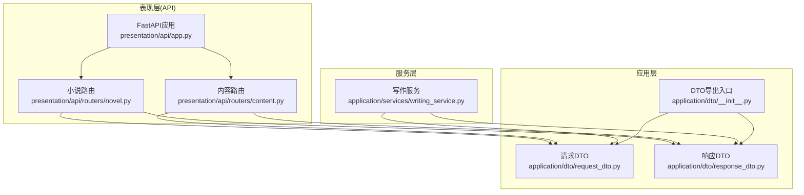
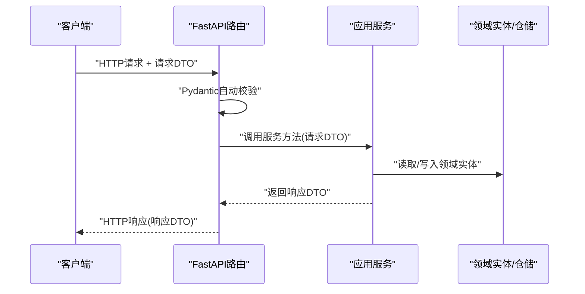
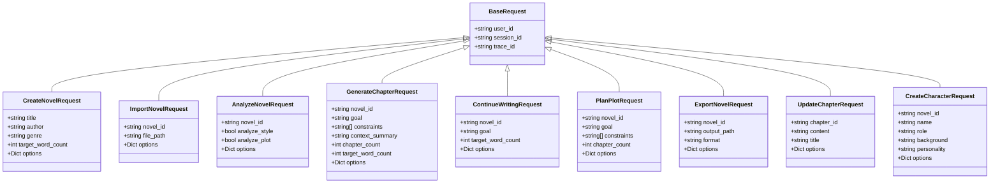
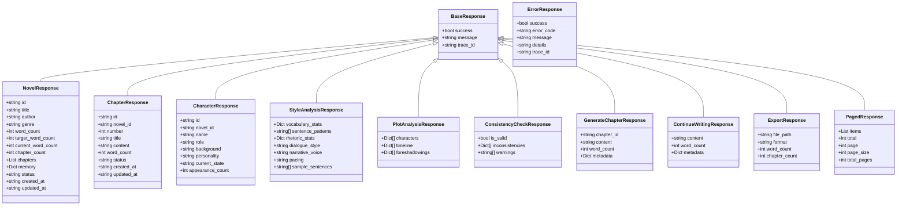
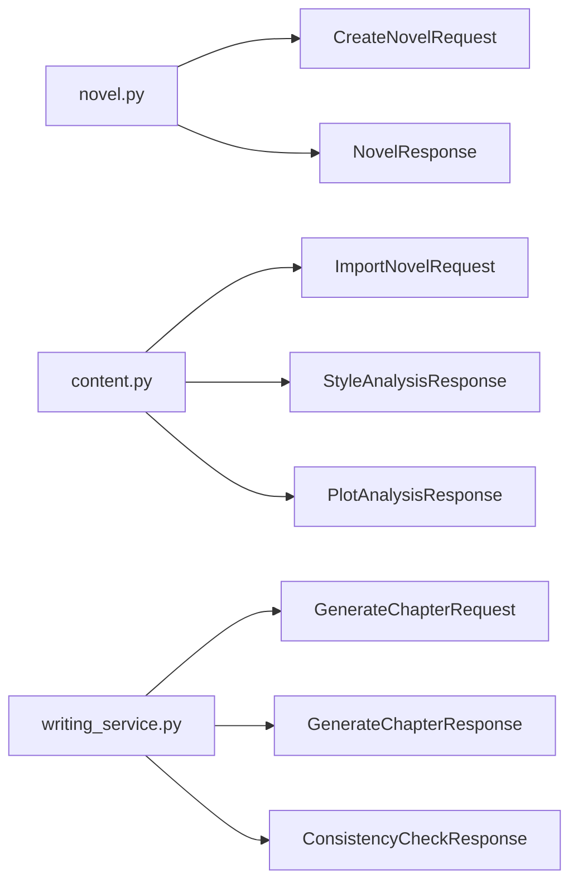

# DTO数据传输对象

<cite>
**本文引用的文件**
- [application/dto/__init__.py](file://application/dto/__init__.py)
- [application/dto/request_dto.py](file://application/dto/request_dto.py)
- [application/dto/response_dto.py](file://application/dto/response_dto.py)
- [tests/unit/test_dto_validation.py](file://tests/unit/test_dto_validation.py)
- [presentation/api/routers/novel.py](file://presentation/api/routers/novel.py)
- [presentation/api/routers/content.py](file://presentation/api/routers/content.py)
- [presentation/api/app.py](file://presentation/api/app.py)
- [application/services/writing_service.py](file://application/services/writing_service.py)
- [docs/ALIGN_DTO输入校验修复.md](file://docs/ALIGN_DTO输入校验修复.md)
</cite>

## 目录
1. [简介](#简介)
2. [项目结构](#项目结构)
3. [核心组件](#核心组件)
4. [架构总览](#架构总览)
5. [详细组件分析](#详细组件分析)
6. [依赖分析](#依赖分析)
7. [性能考虑](#性能考虑)
8. [故障排查指南](#故障排查指南)
9. [结论](#结论)
10. [附录](#附录)

## 简介
本文件系统性梳理了 InkTrace 小说 AI 编写助手项目中的数据传输对象（DTO）体系，覆盖请求 DTO 与响应 DTO 的设计、字段定义、验证规则、默认值、层间传递与验证机制、转换映射关系、版本管理与向后兼容策略、最佳实践与注意事项，并提供面向实际开发的使用示例与代码片段路径。

## 项目结构
DTO 模块位于 application/dto，分为请求 DTO 与响应 DTO 两大类，通过统一的导出入口集中暴露给上层 API 路由与服务层使用。API 层（presentation/api/routers）以 FastAPI 路由函数参数的形式接收请求 DTO，服务层（application/services）接收请求 DTO 并返回响应 DTO，形成清晰的“输入校验—业务处理—输出封装”链路。

图示来源
- [application/dto/request_dto.py:1-97](file://application/dto/request_dto.py#L1-L97)
- [application/dto/response_dto.py:1-200](file://application/dto/response_dto.py#L1-L200)
- [application/dto/__init__.py:11-56](file://application/dto/__init__.py#L11-L56)
- [presentation/api/routers/novel.py:1-162](file://presentation/api/routers/novel.py#L1-L162)
- [presentation/api/routers/content.py:1-196](file://presentation/api/routers/content.py#L1-L196)
- [presentation/api/app.py:1-66](file://presentation/api/app.py#L1-L66)
- [application/services/writing_service.py:1-180](file://application/services/writing_service.py#L1-L180)

章节来源
- [application/dto/__init__.py:11-56](file://application/dto/__init__.py#L11-L56)
- [presentation/api/app.py:19-62](file://presentation/api/app.py#L19-L62)

## 核心组件
本节对请求 DTO 与响应 DTO 进行分类说明，涵盖字段定义、数据类型、验证规则与默认值。

- 请求 DTO（request_dto.py）
  - BaseRequest：基础上下文信息（用户标识、会话标识、追踪标识），均为可选字段，便于在不同环境灵活注入。
  - CreateNovelRequest：创建小说，字段含标题、作者、题材、目标字数等；目标字数为正整数且上限约束；支持可选扩展选项。
  - ImportNovelRequest：导入小说，字段含小说ID、文件路径与可选扩展选项。
  - AnalyzeNovelRequest：分析小说，字段含小说ID、是否分析文风/剧情、可选扩展选项。
  - GenerateChapterRequest：生成章节（面向 Agent 的友好语义），字段含小说ID、目标、约束、上下文摘要、章节数量、目标字数、可选扩展选项；提供默认值与范围约束。
  - ContinueWritingRequest：续写下一章，字段含小说ID、目标、目标字数、可选扩展选项。
  - PlanPlotRequest：规划剧情（面向 Agent 的友好语义），字段含小说ID、目标、约束、章节数量、可选扩展选项。
  - ExportNovelRequest：导出小说，字段含小说ID、输出路径、格式（默认 markdown）、可选扩展选项。
  - UpdateChapterRequest：更新章节，字段含章节ID、内容与标题（均可选）。
  - CreateCharacterRequest：创建人物，字段含小说ID、姓名、角色、背景、个性，以及可选扩展选项；姓名长度有限制。

- 响应 DTO（response_dto.py）
  - BaseResponse：基础响应，包含成功标志、消息、追踪标识。
  - ErrorResponse：错误响应，包含成功标志、错误码、消息、细节与追踪标识。
  - NovelResponse：小说响应，包含 ID、标题、作者、题材、字数统计、状态、时间戳等。
  - ChapterResponse：章节响应，包含 ID、所属小说ID、序号、标题、内容、字数、状态、时间戳等。
  - CharacterResponse：人物响应，包含 ID、所属小说ID、姓名、角色、背景、个性、当前状态、出场次数等。
  - StyleAnalysisResponse：文风分析响应，包含词汇统计、句式模式、修辞统计、对话风格、叙述口吻、节奏、示例句子等。
  - PlotAnalysisResponse：剧情分析响应，包含人物、时间线、伏笔等。
  - ConsistencyCheckResponse：连贯性检查响应，包含有效性、不一致项、警告。
  - GenerateChapterResponse：章节生成响应，包含章节ID、内容、字数、可选元数据。
  - ContinueWritingResponse：续写响应，包含内容、字数、可选元数据。
  - ExportResponse：导出响应，包含输出路径、格式、字数、章节数。
  - PagedResponse：分页响应，包含条目列表、总数、页码、页大小、总页数。

章节来源
- [application/dto/request_dto.py:14-97](file://application/dto/request_dto.py#L14-L97)
- [application/dto/response_dto.py:15-200](file://application/dto/response_dto.py#L15-L200)

## 架构总览
DTO 在系统中的职责与流转如下：
- API 层：FastAPI 路由函数以 Pydantic DTO 作为请求参数，自动进行字段验证与类型转换。
- 服务层：接收 DTO，执行业务逻辑，必要时将领域实体转换为响应 DTO 返回。
- 测试层：通过单元测试验证 DTO 的字段验证规则与默认值行为。

图示来源
- [presentation/api/routers/novel.py:24-61](file://presentation/api/routers/novel.py#L24-L61)
- [presentation/api/routers/content.py:70-102](file://presentation/api/routers/content.py#L70-L102)
- [application/services/writing_service.py:91-165](file://application/services/writing_service.py#L91-L165)

## 详细组件分析

### 请求 DTO 类图

图示来源
- [application/dto/request_dto.py:14-97](file://application/dto/request_dto.py#L14-L97)

章节来源
- [application/dto/request_dto.py:14-97](file://application/dto/request_dto.py#L14-L97)

### 响应 DTO 类图

图示来源
- [application/dto/response_dto.py:15-200](file://application/dto/response_dto.py#L15-L200)

章节来源
- [application/dto/response_dto.py:15-200](file://application/dto/response_dto.py#L15-L200)

### DTO 使用示例与代码片段路径
以下示例均提供“代码片段路径”，便于定位到具体实现与测试用例：

- 创建小说（请求 DTO → 响应 DTO）
  - 示例路径：[presentation/api/routers/novel.py:24-61](file://presentation/api/routers/novel.py#L24-L61)
  - 单测参考：[tests/unit/test_dto_validation.py:48-96](file://tests/unit/test_dto_validation.py#L48-L96)

- 导入小说（请求 DTO → 响应 DTO）
  - 示例路径：[presentation/api/routers/content.py:70-102](file://presentation/api/routers/content.py#L70-L102)
  - 单测参考：[tests/unit/test_dto_validation.py:146-165](file://tests/unit/test_dto_validation.py#L146-L165)

- 生成章节（请求 DTO → 服务层处理 → 响应 DTO）
  - 示例路径：[application/services/writing_service.py:91-165](file://application/services/writing_service.py#L91-L165)
  - 单测参考：[tests/unit/test_dto_validation.py:98-144](file://tests/unit/test_dto_validation.py#L98-L144)

- 更新章节（请求 DTO → 响应 DTO）
  - 示例路径：[presentation/api/routers/novel.py:113-132](file://presentation/api/routers/novel.py#L113-L132)
  - 单测参考：[tests/unit/test_dto_validation.py:212-234](file://tests/unit/test_dto_validation.py#L212-L234)

- 创建人物（请求 DTO → 响应 DTO）
  - 示例路径：[presentation/api/routers/content.py:155-167](file://presentation/api/routers/content.py#L155-L167)
  - 单测参考：[tests/unit/test_dto_validation.py:236-260](file://tests/unit/test_dto_validation.py#L236-L260)

章节来源
- [presentation/api/routers/novel.py:24-61](file://presentation/api/routers/novel.py#L24-L61)
- [presentation/api/routers/content.py:70-102](file://presentation/api/routers/content.py#L70-L102)
- [application/services/writing_service.py:91-165](file://application/services/writing_service.py#L91-L165)
- [tests/unit/test_dto_validation.py:48-96](file://tests/unit/test_dto_validation.py#L48-L96)
- [tests/unit/test_dto_validation.py:98-144](file://tests/unit/test_dto_validation.py#L98-L144)
- [tests/unit/test_dto_validation.py:146-165](file://tests/unit/test_dto_validation.py#L146-L165)
- [tests/unit/test_dto_validation.py:212-234](file://tests/unit/test_dto_validation.py#L212-L234)
- [tests/unit/test_dto_validation.py:236-260](file://tests/unit/test_dto_validation.py#L236-L260)

### DTO 转换关系与映射规则
- API 层到服务层：FastAPI 自动将 JSON 请求体绑定为 Pydantic DTO 实例，随后服务层直接消费 DTO 字段。
- 服务层到响应层：服务层将领域实体转换为响应 DTO，确保对外输出的结构稳定与安全。
- 特殊映射：
  - 小说路由中，请求 DTO 的 title/genre/target_word_count 映射到项目与小说实体的对应字段。
  - 内容路由中，导入流程返回小说与记忆体（memory）的组合结构，内部使用通用字典转换工具进行序列化。
  - 写作服务中，生成章节流程返回章节内容与字数，并可选附带一致性检查报告。

章节来源
- [presentation/api/routers/novel.py:41-61](file://presentation/api/routers/novel.py#L41-L61)
- [presentation/api/routers/content.py:70-102](file://presentation/api/routers/content.py#L70-L102)
- [application/services/writing_service.py:91-165](file://application/services/writing_service.py#L91-L165)

### 验证规则与默认值
- 字段验证：
  - 长度限制：min_length/max_length（如标题、作者、角色名等）。
  - 数值范围：gt/le/ge（如目标字数、章节数等）。
  - 可选字段：使用 Optional 或默认值，保证向后兼容。
- 默认值：
  - 生成章节请求：默认章节数为 1，目标字数为 2100，其他字段默认 None。
  - 分析请求：默认开启文风与剧情分析。
  - 导出请求：默认格式为 markdown。
  - 基础请求：上下文字段默认 None。
- 测试覆盖：
  - 单元测试覆盖了非法输入触发验证异常、默认值生效、部分字段更新等场景。

章节来源
- [application/dto/request_dto.py:21-97](file://application/dto/request_dto.py#L21-L97)
- [tests/unit/test_dto_validation.py:64-82](file://tests/unit/test_dto_validation.py#L64-L82)
- [tests/unit/test_dto_validation.py:116-126](file://tests/unit/test_dto_validation.py#L116-L126)
- [tests/unit/test_dto_validation.py:170-179](file://tests/unit/test_dto_validation.py#L170-L179)

### 版本管理与向后兼容策略
- 向后兼容设计：
  - 所有新增字段采用 Optional 或提供合理默认值，避免破坏既有调用方。
  - 基础请求 DTO 统一承载 user_id/session_id/trace_id，便于追踪与审计。
- 迁移建议：
  - 新增字段优先通过 options 字段承载动态扩展，逐步沉淀为正式字段。
  - 对于强约束字段，采用渐进式放宽策略并在文档中标注变更日志。
- 文档驱动：
  - 通过需求文档明确变更范围与验收标准，确保 API 表面稳定。

章节来源
- [docs/ALIGN_DTO输入校验修复.md:1-94](file://docs/ALIGN_DTO输入校验修复.md#L1-L94)

### 最佳实践与注意事项
- 字段设计
  - 关键字段必须设置最小/最大长度与数值范围，可选字段提供默认值。
  - 使用 options 字段承载临时扩展，避免频繁破坏 API。
- 上下文注入
  - 在网关或中间件层统一注入 user_id/session_id/trace_id，减少重复传参。
- 错误处理
  - 使用 ErrorResponse 统一错误响应结构，保留 trace_id 便于定位问题。
- 序列化
  - 使用 model_dump()/dict() 进行模型到字典的转换，避免直接序列化原生对象。
- 测试
  - 为每个 DTO 编写单元测试，覆盖边界值、空值、非法值与默认值场景。

章节来源
- [presentation/api/routers/content.py:25-35](file://presentation/api/routers/content.py#L25-L35)
- [tests/unit/test_dto_validation.py:26-264](file://tests/unit/test_dto_validation.py#L26-L264)

## 依赖分析
- API 路由依赖 DTO：路由函数参数类型标注为请求 DTO，返回类型标注为响应 DTO。
- 服务层依赖 DTO：服务方法接收请求 DTO，返回响应 DTO。
- DTO 导出入口：统一从 __init__.py 导出，便于跨模块引用。

图示来源
- [presentation/api/routers/novel.py:14-16](file://presentation/api/routers/novel.py#L14-L16)
- [presentation/api/routers/content.py:16-18](file://presentation/api/routers/content.py#L16-L18)
- [application/services/writing_service.py:23-25](file://application/services/writing_service.py#L23-L25)

章节来源
- [presentation/api/routers/novel.py:14-16](file://presentation/api/routers/novel.py#L14-L16)
- [presentation/api/routers/content.py:16-18](file://presentation/api/routers/content.py#L16-L18)
- [application/services/writing_service.py:23-25](file://application/services/writing_service.py#L23-L25)

## 性能考虑
- DTO 验证开销：Pydantic 验证在 API 边界集中进行，避免在服务层重复校验，降低重复成本。
- 序列化成本：尽量复用 model_dump() 的缓存结果，避免多次转换。
- 分页响应：使用 PagedResponse 减少单次响应体积，提升网络传输效率。
- 默认值与可选字段：合理使用默认值与 Optional 字段，减少冗余数据传输。

## 故障排查指南
- 常见错误
  - 字段长度/数值范围不合法：检查 min_length/le/ge/gt 等约束。
  - 缺少必需字段：确认请求 DTO 中必填字段是否缺失。
  - 上下文缺失：确认 user_id/session_id/trace_id 是否按需注入。
- 定位手段
  - 开启 API 日志，结合 trace_id 快速定位请求链路。
  - 使用单元测试复现问题，缩小问题范围。
- 修复建议
  - 优先通过调整请求 DTO 字段约束或默认值解决。
  - 对外暴露错误响应（ErrorResponse）并保留 trace_id，便于前端与运维定位。

章节来源
- [tests/unit/test_dto_validation.py:64-144](file://tests/unit/test_dto_validation.py#L64-L144)
- [application/dto/response_dto.py:109-116](file://application/dto/response_dto.py#L109-L116)

## 结论
本 DTO 体系以 Pydantic 为基础，实现了严格的字段验证、合理的默认值与扩展能力，配合统一的导出入口与清晰的层间传递机制，满足了小说 AI 编写助手在多场景下的输入输出需求。通过单元测试与文档化的变更策略，确保了系统的稳定性与可演进性。

## 附录
- 快速索引
  - 请求 DTO：[application/dto/request_dto.py:14-97](file://application/dto/request_dto.py#L14-L97)
  - 响应 DTO：[application/dto/response_dto.py:15-200](file://application/dto/response_dto.py#L15-L200)
  - API 路由示例：[presentation/api/routers/novel.py:24-61](file://presentation/api/routers/novel.py#L24-L61)、[presentation/api/routers/content.py:70-102](file://presentation/api/routers/content.py#L70-L102)
  - 服务层示例：[application/services/writing_service.py:91-165](file://application/services/writing_service.py#L91-L165)
  - 单元测试：[tests/unit/test_dto_validation.py:26-264](file://tests/unit/test_dto_validation.py#L26-L264)
  - 变更需求文档：[docs/ALIGN_DTO输入校验修复.md:1-94](file://docs/ALIGN_DTO输入校验修复.md#L1-L94)