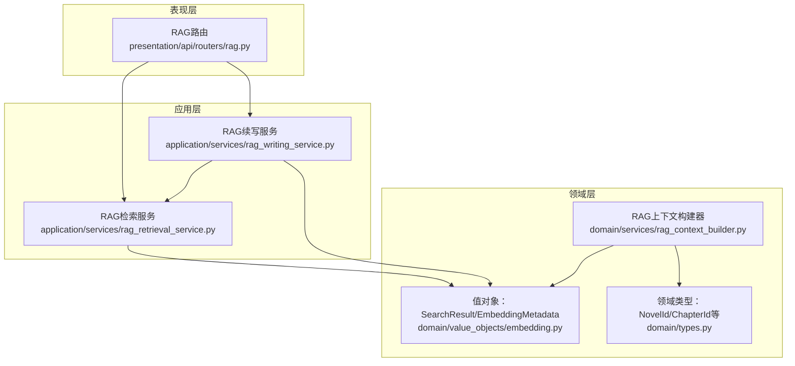
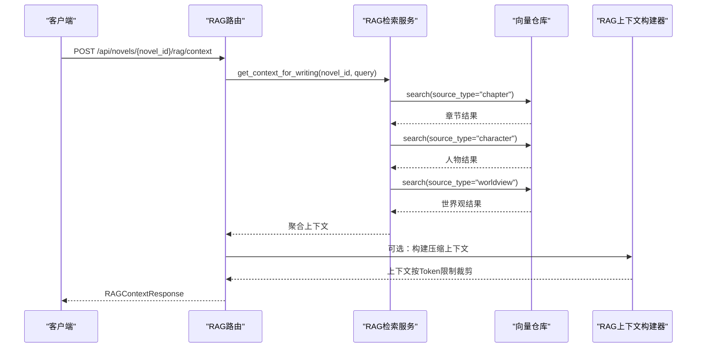
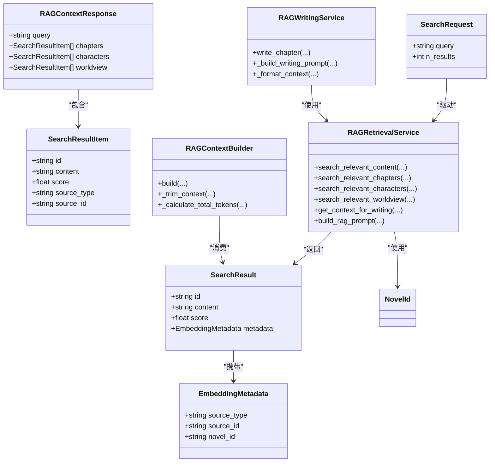
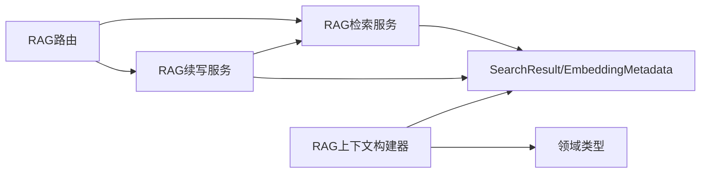
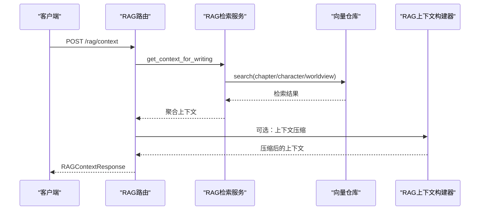
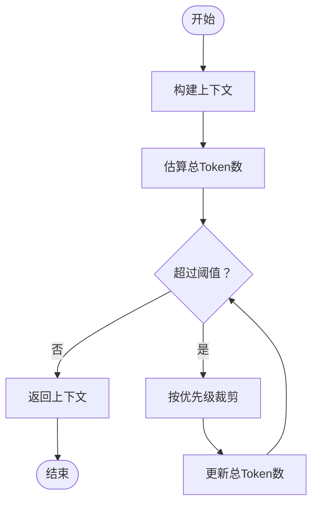

# RAG上下文API

<cite>
**本文引用的文件**
- [presentation/api/routers/rag.py](file://presentation/api/routers/rag.py)
- [application/services/rag_retrieval_service.py](file://application/services/rag_retrieval_service.py)
- [application/services/rag_writing_service.py](file://application/services/rag_writing_service.py)
- [domain/services/rag_context_builder.py](file://domain/services/rag_context_builder.py)
- [domain/value_objects/embedding.py](file://domain/value_objects/embedding.py)
- [domain/types.py](file://domain/types.py)
- [tests/unit/test_rag_retrieval_service.py](file://tests/unit/test_rag_retrieval_service.py)
- [tests/unit/test_rag_context_builder.py](file://tests/unit/test_rag_context_builder.py)
- [README.md](file://README.md)
</cite>

## 目录
1. [简介](#简介)
2. [项目结构](#项目结构)
3. [核心组件](#核心组件)
4. [架构总览](#架构总览)
5. [详细组件分析](#详细组件分析)
6. [依赖分析](#依赖分析)
7. [性能考量](#性能考量)
8. [故障排查指南](#故障排查指南)
9. [结论](#结论)
10. [附录](#附录)

## 简介
本文件为基于检索增强生成（RAG）的上下文API接口文档，覆盖上下文检索、信息整合、智能问答与续写增强等能力。文档详细说明RAGContextRequest请求格式与RAGResponse响应格式，包含检索增强、上下文压缩、多源信息融合等高级功能的API规范，并提供RAG工作流程的请求示例与响应格式，以及上下文质量评估与生成内容审核机制。

## 项目结构
RAG相关能力分布在表现层路由、应用服务与领域服务之间，形成清晰的分层架构：
- 表现层：提供REST API路由，定义请求/响应模型与业务入口
- 应用层：实现RAG检索与写作增强的核心业务逻辑
- 领域层：提供上下文构建、值对象与领域类型定义

图表来源
- [presentation/api/routers/rag.py:18-112](file://presentation/api/routers/rag.py#L18-L112)
- [application/services/rag_retrieval_service.py:20-156](file://application/services/rag_retrieval_service.py#L20-L156)
- [application/services/rag_writing_service.py:25-146](file://application/services/rag_writing_service.py#L25-L146)
- [domain/services/rag_context_builder.py:16-126](file://domain/services/rag_context_builder.py#L16-L126)
- [domain/value_objects/embedding.py:14-79](file://domain/value_objects/embedding.py#L14-L79)
- [domain/types.py:15-284](file://domain/types.py#L15-L284)

章节来源
- [presentation/api/routers/rag.py:18-112](file://presentation/api/routers/rag.py#L18-L112)
- [application/services/rag_retrieval_service.py:20-156](file://application/services/rag_retrieval_service.py#L20-L156)
- [application/services/rag_writing_service.py:25-146](file://application/services/rag_writing_service.py#L25-L146)
- [domain/services/rag_context_builder.py:16-126](file://domain/services/rag_context_builder.py#L16-L126)
- [domain/value_objects/embedding.py:14-79](file://domain/value_objects/embedding.py#L14-L79)
- [domain/types.py:15-284](file://domain/types.py#L15-L284)

## 核心组件
- RAG检索路由：提供/search、/context、/prompt三个端点，分别用于语义检索、上下文聚合与Prompt构建
- RAG检索服务：封装向量检索、多源搜索与上下文组装
- RAG续写服务：在续写流程中注入RAG上下文，生成章节内容
- RAG上下文构建器：负责上下文聚合、Token估算与上下文压缩
- 值对象与领域类型：统一表示检索结果、元数据与领域标识

章节来源
- [presentation/api/routers/rag.py:21-112](file://presentation/api/routers/rag.py#L21-L112)
- [application/services/rag_retrieval_service.py:20-156](file://application/services/rag_retrieval_service.py#L20-L156)
- [application/services/rag_writing_service.py:25-146](file://application/services/rag_writing_service.py#L25-L146)
- [domain/services/rag_context_builder.py:16-126](file://domain/services/rag_context_builder.py#L16-L126)
- [domain/value_objects/embedding.py:14-79](file://domain/value_objects/embedding.py#L14-L79)
- [domain/types.py:15-284](file://domain/types.py#L15-L284)

## 架构总览
RAG工作流从API入口开始，经过检索服务获取相关章节、人物与世界观信息，再由上下文构建器进行压缩与格式化，最终用于Prompt构建或直接返回上下文。

图表来源
- [presentation/api/routers/rag.py:69-97](file://presentation/api/routers/rag.py#L69-L97)
- [application/services/rag_retrieval_service.py:92-121](file://application/services/rag_retrieval_service.py#L92-L121)
- [domain/services/rag_context_builder.py:75-116](file://domain/services/rag_context_builder.py#L75-L116)

## 详细组件分析

### RAG检索路由与模型
- 端点
  - POST /api/novels/{novel_id}/rag/search：语义搜索，返回匹配结果列表
  - POST /api/novels/{novel_id}/rag/context：获取RAG上下文，按章节/人物/世界观分类返回
  - POST /api/novels/{novel_id}/rag/prompt：构建RAG Prompt
- 请求模型
  - SearchRequest：包含查询语句与返回条数
  - SearchResultItem：单条检索结果，包含内容、相似度与来源信息
  - RAGContextResponse：上下文聚合响应，包含章节、人物、世界观三类结果
- 响应模型
  - List[SearchResultItem]：搜索结果列表
  - RAGContextResponse：上下文聚合结果
  - JSON对象：包含生成的Prompt字符串

章节来源
- [presentation/api/routers/rag.py:21-112](file://presentation/api/routers/rag.py#L21-L112)

### RAG检索服务
- 能力
  - 搜索相关内容：通用向量检索
  - 搜索相关章节/人物/世界观：按source_type过滤
  - 获取续写上下文：聚合三类结果
  - 构建RAG Prompt：拼接上下文与创作要求
- 关键参数
  - novel_id：小说唯一标识
  - query：查询语句
  - n_results：返回条数（默认5）

章节来源
- [application/services/rag_retrieval_service.py:33-156](file://application/services/rag_retrieval_service.py#L33-L156)

### RAG续写服务
- 能力
  - 续写章节：结合小说、上一章与RAG上下文生成新章节
  - 构建续写Prompt：组织背景信息与用户要求
  - 上下文格式化：将检索结果转为简洁提示
- 关键参数
  - target_words：目标字数
  - user_prompt：创作要求

章节来源
- [application/services/rag_writing_service.py:42-146](file://application/services/rag_writing_service.py#L42-L146)

### RAG上下文构建器
- 能力
  - 构建上下文：聚合章节、人物、世界观与伏笔
  - Token估算与压缩：按阈值裁剪，优先级依次为伏笔、世界观、人物、章节
- 关键参数
  - max_context_tokens：上下文最大Token数（默认8000）

章节来源
- [domain/services/rag_context_builder.py:69-126](file://domain/services/rag_context_builder.py#L69-L126)

### 值对象与领域类型
- 值对象
  - SearchResult：包含id、content、score与EmbeddingMetadata
  - EmbeddingMetadata：包含source_type、source_id、novel_id等
- 领域类型
  - NovelId、ChapterId等：强类型标识符

章节来源
- [domain/value_objects/embedding.py:43-79](file://domain/value_objects/embedding.py#L43-L79)
- [domain/types.py:15-284](file://domain/types.py#L15-L284)

### 类关系图

图表来源
- [presentation/api/routers/rag.py:21-112](file://presentation/api/routers/rag.py#L21-L112)
- [application/services/rag_retrieval_service.py:20-156](file://application/services/rag_retrieval_service.py#L20-L156)
- [application/services/rag_writing_service.py:25-146](file://application/services/rag_writing_service.py#L25-L146)
- [domain/services/rag_context_builder.py:16-126](file://domain/services/rag_context_builder.py#L16-L126)
- [domain/value_objects/embedding.py:43-79](file://domain/value_objects/embedding.py#L43-L79)
- [domain/types.py:15-284](file://domain/types.py#L15-L284)

## 依赖分析
- 路由依赖应用服务：RAG路由通过依赖注入获取RAG检索服务与续写服务
- 应用服务依赖领域服务与值对象：检索服务依赖向量仓库与值对象；续写服务依赖检索服务与LLM工厂
- 领域服务依赖值对象与领域类型：上下文构建器依赖SearchResult与领域类型

图表来源
- [presentation/api/routers/rag.py:18-112](file://presentation/api/routers/rag.py#L18-L112)
- [application/services/rag_retrieval_service.py:20-156](file://application/services/rag_retrieval_service.py#L20-L156)
- [application/services/rag_writing_service.py:25-146](file://application/services/rag_writing_service.py#L25-L146)
- [domain/services/rag_context_builder.py:16-126](file://domain/services/rag_context_builder.py#L16-L126)
- [domain/value_objects/embedding.py:14-79](file://domain/value_objects/embedding.py#L14-L79)
- [domain/types.py:15-284](file://domain/types.py#L15-L284)

章节来源
- [presentation/api/routers/rag.py:18-112](file://presentation/api/routers/rag.py#L18-L112)
- [application/services/rag_retrieval_service.py:20-156](file://application/services/rag_retrieval_service.py#L20-L156)
- [application/services/rag_writing_service.py:25-146](file://application/services/rag_writing_service.py#L25-L146)
- [domain/services/rag_context_builder.py:16-126](file://domain/services/rag_context_builder.py#L16-L126)
- [domain/value_objects/embedding.py:14-79](file://domain/value_objects/embedding.py#L14-L79)
- [domain/types.py:15-284](file://domain/types.py#L15-L284)

## 性能考量
- 检索性能
  - 向量检索的n_results建议控制在合理范围，避免过多结果导致上下文过长
  - 按source_type过滤可减少无关搜索开销
- 上下文压缩
  - 通过Token估算与优先级裁剪，确保上下文在模型输入限制内
  - 建议在构建Prompt前先进行上下文压缩
- 生成性能
  - 续写时根据目标字数设置max_tokens，避免超限
  - 使用主备模型策略提升稳定性

## 故障排查指南
- 常见问题
  - 检索结果为空：确认novel_id有效、向量库已建立、query非空
  - 上下文过长：调整n_results或启用上下文压缩
  - Prompt构建异常：检查上下文字段是否齐全
- 单元测试参考
  - 检索服务测试：验证搜索方法、上下文聚合与Prompt构建
  - 上下文构建器测试：验证上下文构建、裁剪优先级与Token估算

章节来源
- [tests/unit/test_rag_retrieval_service.py:17-278](file://tests/unit/test_rag_retrieval_service.py#L17-L278)
- [tests/unit/test_rag_context_builder.py:16-331](file://tests/unit/test_rag_context_builder.py#L16-L331)

## 结论
本文档系统梳理了RAG上下文API的接口规范与实现要点，涵盖检索、上下文聚合、Prompt构建与续写增强等关键环节。通过明确的请求/响应模型、上下文压缩策略与审核机制，可有效支撑高质量的RAG工作流。

## 附录

### 接口定义与示例

- 搜索内容
  - 方法与路径：POST /api/novels/{novel_id}/rag/search
  - 请求体：SearchRequest
    - query：string，必填
    - n_results：integer，默认5
  - 响应体：List[SearchResultItem]
    - id：string
    - content：string（内容截断）
    - score：number
    - source_type：string
    - source_id：string

- 获取RAG上下文
  - 方法与路径：POST /api/novels/{novel_id}/rag/context
  - 请求体：SearchRequest
  - 响应体：RAGContextResponse
    - query：string
    - chapters：List[SearchResultItem]
    - characters：List[SearchResultItem]
    - worldview：List[SearchResultItem]

- 构建RAG Prompt
  - 方法与路径：POST /api/novels/{novel_id}/rag/prompt
  - 请求体：SearchRequest
  - 响应体：JSON对象
    - prompt：string

章节来源
- [presentation/api/routers/rag.py:21-112](file://presentation/api/routers/rag.py#L21-L112)

### RAG工作流程时序图

图表来源
- [presentation/api/routers/rag.py:69-97](file://presentation/api/routers/rag.py#L69-L97)
- [application/services/rag_retrieval_service.py:92-121](file://application/services/rag_retrieval_service.py#L92-L121)
- [domain/services/rag_context_builder.py:75-116](file://domain/services/rag_context_builder.py#L75-L116)

### 上下文压缩流程图

图表来源
- [domain/services/rag_context_builder.py:98-126](file://domain/services/rag_context_builder.py#L98-L126)

### 审核与质量评估
- 上下文质量评估
  - Token估算与裁剪确保上下文在模型输入限制内
  - 按优先级保留重要信息（伏笔→世界观→人物→章节）
- 生成内容审核
  - 建议结合人工审核与第三方检测工具（如腾讯朱雀）评估AI检测率
  - 在续写流程中进行连贯性检查，确保人物状态、时间线与伏笔一致性

章节来源
- [domain/services/rag_context_builder.py:69-126](file://domain/services/rag_context_builder.py#L69-L126)
- [application/services/rag_writing_service.py:42-146](file://application/services/rag_writing_service.py#L42-L146)
- [README.md:139-156](file://README.md#L139-L156)