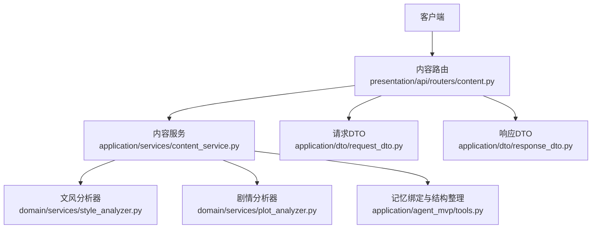
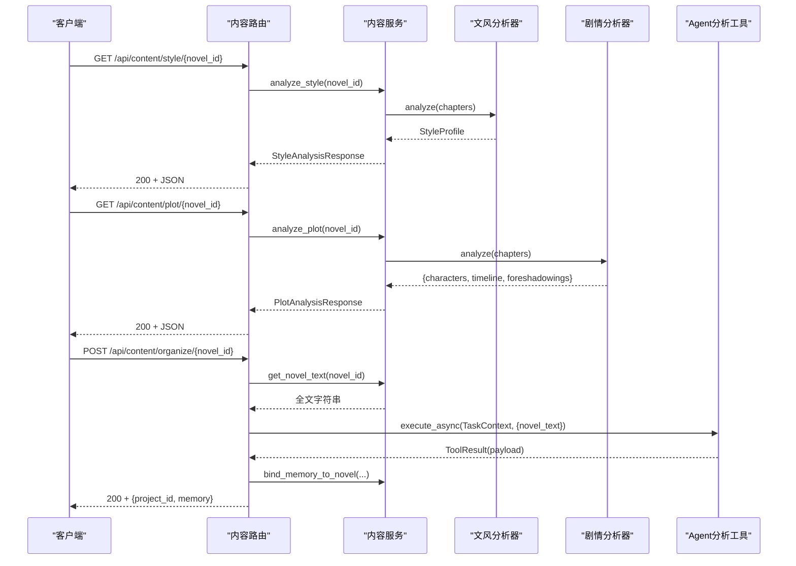
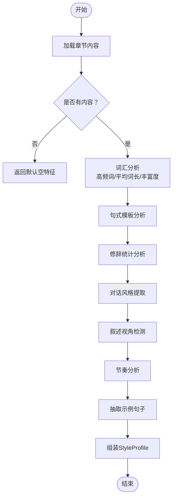
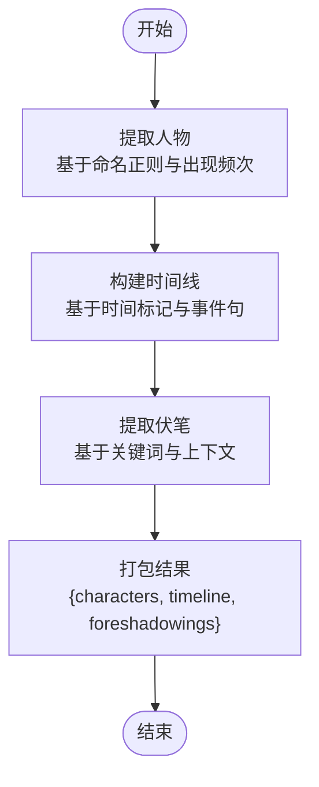
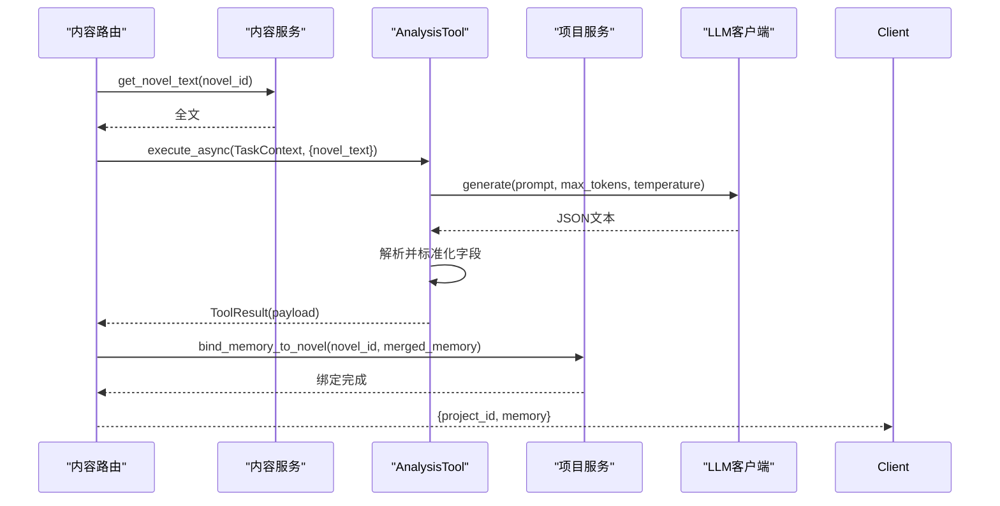
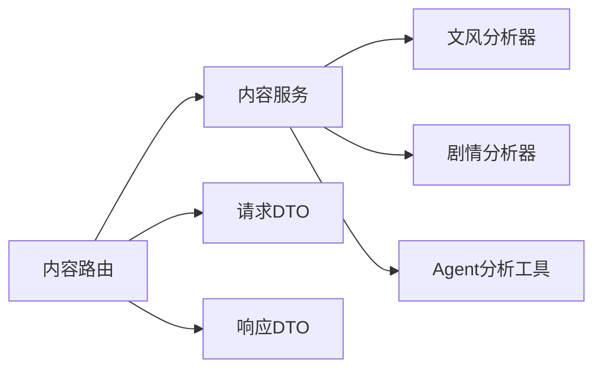

# 内容分析API

<cite>
**本文引用的文件**
- [presentation/api/routers/content.py](file://presentation/api/routers/content.py)
- [application/services/content_service.py](file://application/services/content_service.py)
- [domain/services/style_analyzer.py](file://domain/services/style_analyzer.py)
- [domain/services/plot_analyzer.py](file://domain/services/plot_analyzer.py)
- [application/dto/request_dto.py](file://application/dto/request_dto.py)
- [application/dto/response_dto.py](file://application/dto/response_dto.py)
- [domain/value_objects/style_profile.py](file://domain/value_objects/style_profile.py)
- [application/agent_mvp/tools.py](file://application/agent_mvp/tools.py)
- [presentation/api/app.py](file://presentation/api/app.py)
- [frontend/src/api/index.js](file://frontend/src/api/index.js)
- [tests/unit/test_style_analyzer.py](file://tests/unit/test_style_analyzer.py)
- [tests/unit/test_plot_analyzer.py](file://tests/unit/test_plot_analyzer.py)
</cite>

## 目录
1. [简介](#简介)
2. [项目结构](#项目结构)
3. [核心组件](#核心组件)
4. [架构总览](#架构总览)
5. [详细组件分析](#详细组件分析)
6. [依赖分析](#依赖分析)
7. [性能考虑](#性能考虑)
8. [故障排查指南](#故障排查指南)
9. [结论](#结论)
10. [附录](#附录)

## 简介
本文件为内容分析API的完整接口文档，覆盖文风分析、剧情分析、风格分析、故事结构整理与记忆绑定、以及状态查询等能力。文档详细说明请求与响应规范、数据结构字段含义、分析算法与配置选项，并提供使用场景、示例与性能优化建议。

## 项目结构
内容分析API位于表现层路由与应用层服务之间，结合领域层分析器与Agent分析工具，形成“路由 → 服务 → 分析器/工具”的清晰分层。

图表来源
- [presentation/api/routers/content.py:1-196](file://presentation/api/routers/content.py#L1-L196)
- [application/services/content_service.py:1-169](file://application/services/content_service.py#L1-L169)
- [domain/services/style_analyzer.py:1-286](file://domain/services/style_analyzer.py#L1-L286)
- [domain/services/plot_analyzer.py:1-225](file://domain/services/plot_analyzer.py#L1-L225)
- [application/agent_mvp/tools.py:1-446](file://application/agent_mvp/tools.py#L1-L446)
- [application/dto/request_dto.py:1-97](file://application/dto/request_dto.py#L1-L97)
- [application/dto/response_dto.py:1-200](file://application/dto/response_dto.py#L1-L200)

章节来源
- [presentation/api/routers/content.py:1-196](file://presentation/api/routers/content.py#L1-L196)
- [application/services/content_service.py:1-169](file://application/services/content_service.py#L1-L169)
- [presentation/api/app.py:1-66](file://presentation/api/app.py#L1-L66)

## 核心组件
- 内容路由：提供导入、文风分析、剧情分析、记忆查询、故事结构整理等端点。
- 内容服务：封装导入、解析、分析与文本拼接逻辑，协调仓储与分析器。
- 文风分析器：基于正则与统计的文本特征抽取，生成词汇、句式、修辞、对话风格、叙述视角、节奏等指标。
- 剧情分析器：提取人物、时间线事件、伏笔线索，支持基础命名识别与时间标记。
- Agent分析工具：通过LLM进行结构化分析与恢复重试，产出角色、世界观、剧情大纲与写作风格等。
- 请求/响应DTO：统一输入输出结构，便于前端对接与扩展。

章节来源
- [presentation/api/routers/content.py:70-196](file://presentation/api/routers/content.py#L70-L196)
- [application/services/content_service.py:29-169](file://application/services/content_service.py#L29-L169)
- [domain/services/style_analyzer.py:18-286](file://domain/services/style_analyzer.py#L18-L286)
- [domain/services/plot_analyzer.py:46-225](file://domain/services/plot_analyzer.py#L46-L225)
- [application/agent_mvp/tools.py:13-142](file://application/agent_mvp/tools.py#L13-L142)
- [application/dto/request_dto.py:30-43](file://application/dto/request_dto.py#L30-L43)
- [application/dto/response_dto.py:61-185](file://application/dto/response_dto.py#L61-L185)

## 架构总览
内容分析API采用分层架构，路由负责HTTP协议与错误处理，服务层负责业务编排，领域层负责具体分析算法，Agent工具负责LLM驱动的结构化分析与容错恢复。

图表来源
- [presentation/api/routers/content.py:109-196](file://presentation/api/routers/content.py#L109-L196)
- [application/services/content_service.py:93-154](file://application/services/content_service.py#L93-L154)
- [domain/services/style_analyzer.py:25-66](file://domain/services/style_analyzer.py#L25-L66)
- [domain/services/plot_analyzer.py:55-75](file://domain/services/plot_analyzer.py#L55-L75)
- [application/agent_mvp/tools.py:35-81](file://application/agent_mvp/tools.py#L35-L81)

## 详细组件分析

### 接口总览
- 导入小说
  - 方法与路径：POST /api/content/import
  - 功能：导入TXT章节并自动进行故事结构整理与记忆绑定
  - 请求体：参见“请求DTO：ImportNovelRequest”
  - 响应体：包含小说信息、项目ID、内存（记忆）与分析状态
- 文风分析
  - 方法与路径：GET /api/content/style/{novel_id}
  - 功能：分析文风特征（词汇、句式、修辞、对话风格、叙述视角、节奏、示例句）
  - 响应体：StyleAnalysisResponse
- 剧情分析
  - 方法与路径：GET /api/content/plot/{novel_id}
  - 功能：提取人物、时间线事件、伏笔线索
  - 响应体：PlotAnalysisResponse
- 记忆查询
  - 方法与路径：GET /api/content/memory/{novel_id}
  - 功能：查询项目绑定的记忆（含进度）
  - 响应体：包含project_id与memory
- 故事结构整理
  - 方法与路径：POST /api/content/organize/{novel_id}
  - 功能：基于LLM进行结构化分析，合并到记忆并绑定至项目
  - 响应体：包含status、project_id与memory

章节来源
- [presentation/api/routers/content.py:70-196](file://presentation/api/routers/content.py#L70-L196)

### 请求与响应DTO规范

- 请求DTO
  - ImportNovelRequest
    - 字段：novel_id, file_path, options
    - 用途：导入小说文件
  - AnalyzeNovelRequest
    - 字段：novel_id, analyze_style, analyze_plot, options
    - 用途：统一分析入口（当前路由未直接使用该DTO，但结构已定义）
  - 其他通用字段：BaseRequest包含user_id、session_id、trace_id，便于追踪与上下文传递

- 响应DTO
  - StyleAnalysisResponse
    - vocabulary_stats: 词汇统计（高频词、平均词长、词汇丰富度、总词数、独立词数）
    - sentence_patterns: 句式模板（示例模式）
    - rhetoric_stats: 修辞统计（比喻、拟人、排比、夸张等计数）
    - dialogue_style: 对话风格（长度与情感倾向）
    - narrative_voice: 叙述视角（第一/第三人称/混合）
    - pacing: 节奏（快/中等/慢）
    - sample_sentences: 示例句子
  - PlotAnalysisResponse
    - characters: 人物列表（名称、别名、出场次数、首次出场章节等）
    - timeline: 时间线事件列表（章节号、事件描述、涉及人物）
    - foreshadowings: 伏笔列表（描述、章节号、状态）

章节来源
- [application/dto/request_dto.py:30-43](file://application/dto/request_dto.py#L30-L43)
- [application/dto/response_dto.py:61-185](file://application/dto/response_dto.py#L61-L185)
- [domain/value_objects/style_profile.py:14-30](file://domain/value_objects/style_profile.py#L14-L30)

### 文风分析流程与算法

图表来源
- [domain/services/style_analyzer.py:25-66](file://domain/services/style_analyzer.py#L25-L66)
- [domain/services/style_analyzer.py:68-286](file://domain/services/style_analyzer.py#L68-L286)

- 算法要点
  - 词汇统计：基于中文词序列，计算高频词、平均词长、词汇丰富度等
  - 句式模板：识别逗号分割的句式模式，限制样本数量
  - 修辞统计：通过预设正则匹配统计比喻、拟人、排比、夸张等
  - 对话风格：统计对话长度与语气标点，判断风格倾向
  - 叙述视角：比较“我/咱”与“他/她/它”出现频次
  - 节奏：按句长分布计算短句比例，判定快/中/慢节奏
  - 示例句：抽取符合长度阈值的句子作为示例

章节来源
- [domain/services/style_analyzer.py:25-286](file://domain/services/style_analyzer.py#L25-L286)
- [tests/unit/test_style_analyzer.py:19-140](file://tests/unit/test_style_analyzer.py#L19-L140)

### 剧情分析流程与算法

图表来源
- [domain/services/plot_analyzer.py:55-75](file://domain/services/plot_analyzer.py#L55-L75)
- [domain/services/plot_analyzer.py:77-225](file://domain/services/plot_analyzer.py#L77-L225)

- 算法要点
  - 人物提取：通过多种命名正则匹配，统计出现次数并排序
  - 时间线：识别时间词与事件句，按章节聚合若干事件
  - 伏笔：基于关键词与上下文截断，控制数量上限

章节来源
- [domain/services/plot_analyzer.py:46-225](file://domain/services/plot_analyzer.py#L46-L225)
- [tests/unit/test_plot_analyzer.py:19-158](file://tests/unit/test_plot_analyzer.py#L19-L158)

### 结构整理与记忆绑定（LLM驱动）

图表来源
- [presentation/api/routers/content.py:37-67](file://presentation/api/routers/content.py#L37-L67)
- [application/agent_mvp/tools.py:35-142](file://application/agent_mvp/tools.py#L35-L142)

- 关键行为
  - Prompt结构：要求仅输出JSON，包含角色、世界观、剧情大纲、写作风格与进度
  - 容错机制：主备模型切换、文本修复、降级回退
  - 进度字段：latest_chapter_number、latest_goal、last_summary
  - 绑定策略：合并分析结果到NovelMemory并写入项目

章节来源
- [presentation/api/routers/content.py:37-67](file://presentation/api/routers/content.py#L37-L67)
- [application/agent_mvp/tools.py:83-142](file://application/agent_mvp/tools.py#L83-L142)

### 状态查询与进度监控
- 记忆查询端点：GET /api/content/memory/{novel_id}
  - 返回：project_id与memory（包含current_progress）
  - 用途：前端轮询或一次性读取进度与上下文

章节来源
- [presentation/api/routers/content.py:155-167](file://presentation/api/routers/content.py#L155-L167)

### 错误处理与质量评估
- HTTP状态码
  - 404：小说不存在或章节缺失
  - 400：输入非法或分析失败
  - 500：内部错误
- 错误详情结构：包含code、message、user_message，便于前端展示
- 质量评估与验证
  - 文风/剧情分析：通过单元测试覆盖边界条件与典型场景
  - LLM分析：具备重试与降级策略，保证稳定性

章节来源
- [presentation/api/routers/content.py:25-26](file://presentation/api/routers/content.py#L25-L26)
- [presentation/api/routers/content.py:103-107](file://presentation/api/routers/content.py#L103-L107)
- [presentation/api/routers/content.py:180-195](file://presentation/api/routers/content.py#L180-L195)
- [tests/unit/test_style_analyzer.py:42-114](file://tests/unit/test_style_analyzer.py#L42-L114)
- [tests/unit/test_plot_analyzer.py:82-103](file://tests/unit/test_plot_analyzer.py#L82-L103)

### 使用场景与示例

- 场景一：导入小说并自动分析
  - 步骤：POST /api/content/import → 自动执行结构整理 → 返回memory
  - 适用：首次导入或需要快速建立上下文时
- 场景二：单独文风分析
  - 步骤：GET /api/content/style/{novel_id}
  - 适用：需要了解词汇、句式、修辞、节奏等语言特征
- 场景三：单独剧情分析
  - 步骤：GET /api/content/plot/{novel_id}
  - 适用：需要提取人物、时间线与伏笔线索
- 场景四：手动触发结构整理
  - 步骤：POST /api/content/organize/{novel_id}
  - 适用：需要重新梳理或补充上下文
- 场景五：进度查询
  - 步骤：GET /api/content/memory/{novel_id}
  - 适用：前端轮询或断点续用

章节来源
- [frontend/src/api/index.js:50-56](file://frontend/src/api/index.js#L50-L56)
- [presentation/api/routers/content.py:70-196](file://presentation/api/routers/content.py#L70-L196)

## 依赖分析

图表来源
- [presentation/api/routers/content.py:13-19](file://presentation/api/routers/content.py#L13-L19)
- [application/services/content_service.py:22-50](file://application/services/content_service.py#L22-L50)
- [application/agent_mvp/tools.py:17-21](file://application/agent_mvp/tools.py#L17-L21)

章节来源
- [presentation/api/routers/content.py:13-19](file://presentation/api/routers/content.py#L13-L19)
- [application/services/content_service.py:22-50](file://application/services/content_service.py#L22-L50)
- [application/agent_mvp/tools.py:17-21](file://application/agent_mvp/tools.py#L17-L21)

## 性能考虑
- 文风/剧情分析
  - 时间复杂度：与文本长度线性相关，建议对超长文本分段或采样
  - 缓存策略：对已分析章节结果进行缓存，避免重复计算
- LLM分析
  - 温度与token上限：当前温度较低以提升确定性，注意控制输入长度
  - 重试与降级：主备模型切换与降级回退减少失败率
- 批量分析
  - 并发控制：限制并发数，避免资源争用
  - 分片处理：将长文本切分为块，分别分析后合并
- 前端交互
  - 轮询间隔：合理设置轮询周期，避免频繁请求
  - 断点续传：利用memory中的进度字段实现断点续用

## 故障排查指南
- 常见错误
  - 小说不存在：检查novel_id与文件路径
  - 文件不存在：确认file_path有效
  - 分析失败：查看错误详情中的code与message
- 定位方法
  - 查看HTTP状态码与错误详情
  - 检查memory中的current_progress，定位卡住环节
  - 单元测试参考：文风与剧情分析的边界条件测试
- 建议
  - 在网关层增加限流与熔断
  - 对LLM调用增加可观测性（trace_id）

章节来源
- [presentation/api/routers/content.py:103-107](file://presentation/api/routers/content.py#L103-L107)
- [presentation/api/routers/content.py:180-195](file://presentation/api/routers/content.py#L180-L195)
- [tests/unit/test_style_analyzer.py:42-114](file://tests/unit/test_style_analyzer.py#L42-L114)
- [tests/unit/test_plot_analyzer.py:82-103](file://tests/unit/test_plot_analyzer.py#L82-L103)

## 结论
内容分析API提供了从文风到剧情的全面分析能力，并通过LLM驱动的故事结构整理与记忆绑定，为后续写作与RAG检索奠定基础。通过清晰的DTO规范、完善的错误处理与性能建议，可在实际工程中稳定落地并扩展。

## 附录

### 端点一览表
- POST /api/content/import
  - 请求体：ImportNovelRequest
  - 响应体：包含novel、project_id、memory、analysis_status
- GET /api/content/style/{novel_id}
  - 响应体：StyleAnalysisResponse
- GET /api/content/plot/{novel_id}
  - 响应体：PlotAnalysisResponse
- GET /api/content/memory/{novel_id}
  - 响应体：{project_id, memory}
- POST /api/content/organize/{novel_id}
  - 响应体：{status, project_id, memory}

章节来源
- [presentation/api/routers/content.py:70-196](file://presentation/api/routers/content.py#L70-L196)
- [frontend/src/api/index.js:50-56](file://frontend/src/api/index.js#L50-L56)