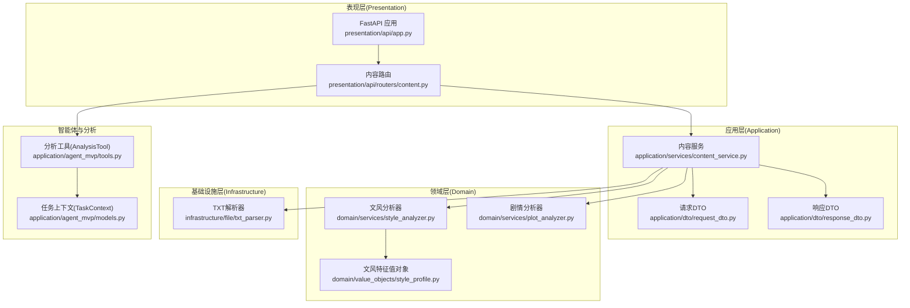
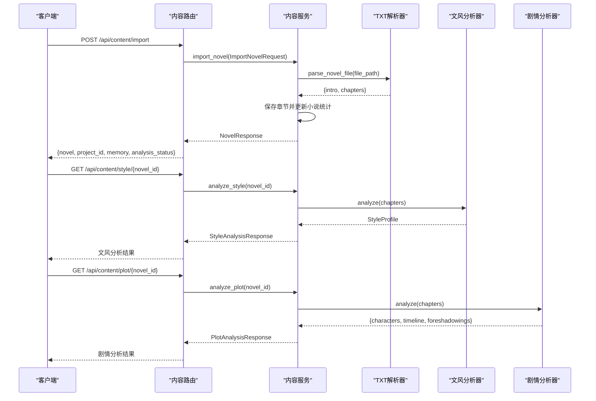
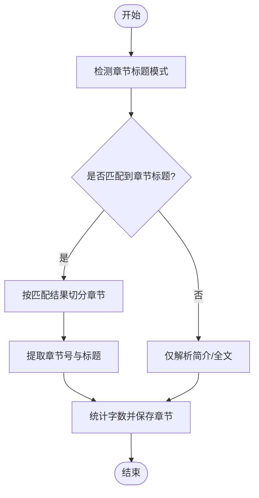
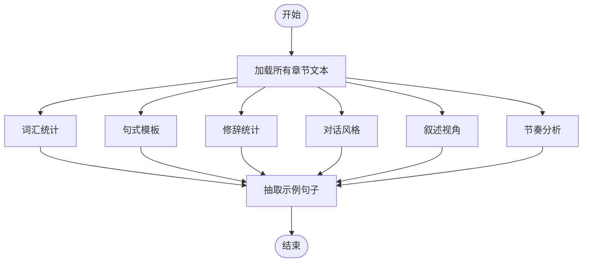
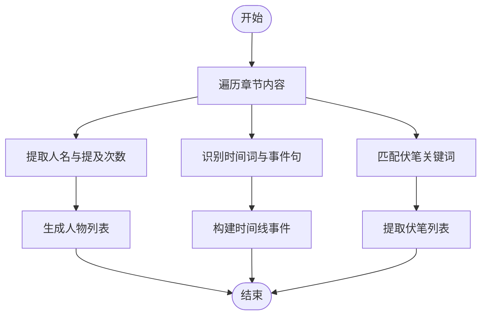
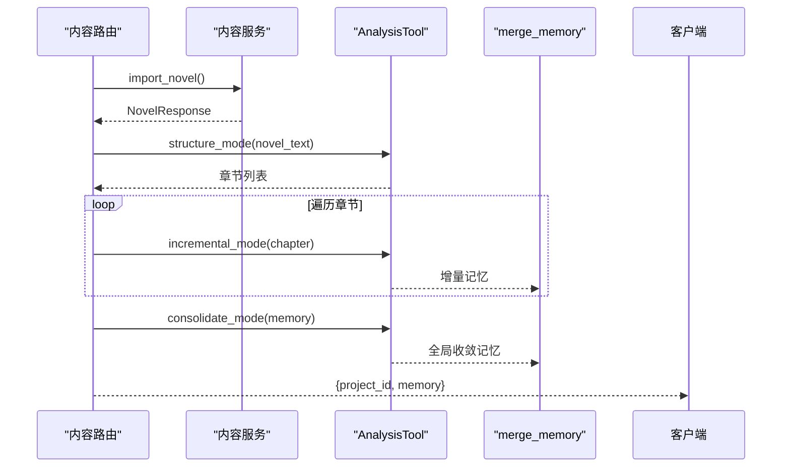
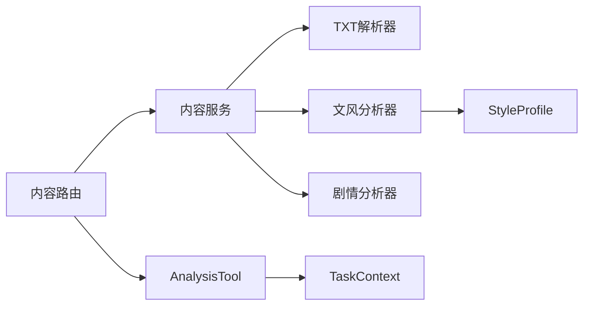

# 内容分析API

<cite>
**本文引用的文件**
- [presentation/api/routers/content.py](file://presentation/api/routers/content.py)
- [application/dto/request_dto.py](file://application/dto/request_dto.py)
- [application/dto/response_dto.py](file://application/dto/response_dto.py)
- [application/services/content_service.py](file://application/services/content_service.py)
- [domain/services/style_analyzer.py](file://domain/services/style_analyzer.py)
- [domain/services/plot_analyzer.py](file://domain/services/plot_analyzer.py)
- [domain/value_objects/style_profile.py](file://domain/value_objects/style_profile.py)
- [infrastructure/file/txt_parser.py](file://infrastructure/file/txt_parser.py)
- [presentation/api/app.py](file://presentation/api/app.py)
- [application/agent_mvp/tools.py](file://application/agent_mvp/tools.py)
- [application/agent_mvp/models.py](file://application/agent_mvp/models.py)
</cite>

## 目录
1. [简介](#简介)
2. [项目结构](#项目结构)
3. [核心组件](#核心组件)
4. [架构总览](#架构总览)
5. [详细组件分析](#详细组件分析)
6. [依赖分析](#依赖分析)
7. [性能考虑](#性能考虑)
8. [故障排除指南](#故障排除指南)
9. [结论](#结论)
10. [附录](#附录)

## 简介
本文件为内容分析API的完整接口文档，覆盖小说导入与分析相关能力，包括：
- 小说文件导入（TXT解析、章节拆分、入库）
- 文风分析（词汇统计、句式分析、修辞统计、对话风格、叙述视角、节奏）
- 剧情分析（人物、时间线、伏笔）
- 结构整理与记忆绑定（基于LLM的增量/收敛分析）
- 错误处理与异常情况说明

接口均通过HTTP暴露，遵循REST风格，响应采用统一的DTO结构。

## 项目结构
内容分析API位于presentation层的路由模块，业务逻辑由application层服务实现，分析算法封装在domain层的服务与值对象中，基础设施层负责TXT解析。

**图示来源**
- [presentation/api/app.py:19-66](file://presentation/api/app.py#L19-L66)
- [presentation/api/routers/content.py:23-214](file://presentation/api/routers/content.py#L23-L214)
- [application/services/content_service.py:29-169](file://application/services/content_service.py#L29-L169)
- [domain/services/style_analyzer.py:18-286](file://domain/services/style_analyzer.py#L18-L286)
- [domain/services/plot_analyzer.py:46-225](file://domain/services/plot_analyzer.py#L46-L225)
- [domain/value_objects/style_profile.py:14-30](file://domain/value_objects/style_profile.py#L14-L30)
- [infrastructure/file/txt_parser.py:25-316](file://infrastructure/file/txt_parser.py#L25-L316)
- [application/agent_mvp/tools.py:15-516](file://application/agent_mvp/tools.py#L15-L516)
- [application/agent_mvp/models.py:40-91](file://application/agent_mvp/models.py#L40-L91)

**章节来源**
- [presentation/api/app.py:19-66](file://presentation/api/app.py#L19-L66)
- [presentation/api/routers/content.py:23-214](file://presentation/api/routers/content.py#L23-L214)

## 核心组件
- 路由与控制器：定义HTTP端点、参数校验、异常映射与响应序列化。
- 内容服务：协调TXT解析、章节入库、文风/剧情分析、文本聚合。
- 文风分析器：统计词汇、句式、修辞、对话风格、叙述视角、节奏。
- 剧情分析器：抽取人物、构建时间线、提取伏笔。
- TXT解析器：自动识别章节标题、切分章节、统计字数。
- 分析工具：面向LLM的章节拆分、增量分析、全局收敛与记忆合并。
- DTO：统一请求/响应结构，便于前端消费与契约约束。

**章节来源**
- [application/services/content_service.py:29-169](file://application/services/content_service.py#L29-L169)
- [domain/services/style_analyzer.py:18-286](file://domain/services/style_analyzer.py#L18-L286)
- [domain/services/plot_analyzer.py:46-225](file://domain/services/plot_analyzer.py#L46-L225)
- [infrastructure/file/txt_parser.py:25-316](file://infrastructure/file/txt_parser.py#L25-L316)
- [application/agent_mvp/tools.py:15-516](file://application/agent_mvp/tools.py#L15-L516)

## 架构总览
内容分析API采用分层架构：
- 表现层：FastAPI路由，负责HTTP协议与异常映射。
- 应用层：服务编排，连接仓储、解析器与分析器。
- 领域层：文风/剧情分析算法，封装语言学与故事学规则。
- 基础设施层：TXT解析与文件IO。
- 智能体层：基于LLM的章节拆分、增量分析与记忆收敛。

**图示来源**
- [presentation/api/routers/content.py:88-171](file://presentation/api/routers/content.py#L88-L171)
- [application/services/content_service.py:52-169](file://application/services/content_service.py#L52-L169)
- [infrastructure/file/txt_parser.py:108-139](file://infrastructure/file/txt_parser.py#L108-L139)
- [domain/services/style_analyzer.py:25-66](file://domain/services/style_analyzer.py#L25-L66)
- [domain/services/plot_analyzer.py:55-75](file://domain/services/plot_analyzer.py#L55-L75)

## 详细组件分析

### 接口总览
- POST /api/content/import
  - 功能：导入小说文件，解析章节并入库，同时进行结构整理与记忆绑定。
  - 请求体：ImportNovelRequest
  - 响应体：包含小说信息、项目ID、内存快照与分析状态。
- GET /api/content/style/{novel_id}
  - 功能：分析文风，返回词汇统计、句式模板、修辞统计、对话风格、叙述视角、节奏与示例句子。
  - 响应体：StyleAnalysisResponse
- GET /api/content/plot/{novel_id}
  - 功能：分析剧情，返回人物、时间线、伏笔信息。
  - 响应体：PlotAnalysisResponse
- GET /api/content/memory/{novel_id}
  - 功能：查询项目与小说绑定的记忆。
  - 响应体：{project_id, memory}
- POST /api/content/organize/{novel_id}
  - 功能：对已有内容进行结构整理与记忆收敛。
  - 响应体：{status, project_id, memory}

**章节来源**
- [presentation/api/routers/content.py:88-171](file://presentation/api/routers/content.py#L88-L171)

### 请求与响应数据结构

#### 请求体：ImportNovelRequest
- novel_id: string（必填，小说唯一标识）
- file_path: string（必填，本地TXT文件绝对路径）
- options: object（可选，扩展参数）

字段校验与默认值参考请求DTO定义。

**章节来源**
- [application/dto/request_dto.py:30-34](file://application/dto/request_dto.py#L30-L34)

#### 响应体：StyleAnalysisResponse
- vocabulary_stats: object（词汇统计）
  - 高频词：数组，每项包含词与频次
  - 平均词长：数值
  - 词汇丰富度：数值
  - 总词数：数值
  - 独立词数：数值
- sentence_patterns: array[string]（句式模板示例）
- rhetoric_stats: object（修辞统计）
  - 比喻：整数
  - 拟人：整数
  - 排比：整数
  - 夸张：整数
- dialogue_style: string（对话风格，如“简洁，情感强烈”）
- narrative_voice: string（叙述视角，如“第一人称”）
- pacing: string（节奏，如“快节奏”）
- sample_sentences: array[string]（示例句子）

**章节来源**
- [application/dto/response_dto.py:61-70](file://application/dto/response_dto.py#L61-L70)
- [domain/value_objects/style_profile.py:23-29](file://domain/value_objects/style_profile.py#L23-L29)

#### 响应体：PlotAnalysisResponse
- characters: array[object]（人物信息）
  - name: string
  - aliases: array[string]
  - appearance_count: integer
  - first_appearance_chapter: integer
- timeline: array[object]（时间线事件）
  - chapter_number: integer
  - event_description: string
  - characters_involved: array[string]
- foreshadowings: array[object]（伏笔）
  - description: string
  - chapter_number: integer
  - status: string

**章节来源**
- [application/dto/response_dto.py:72-77](file://application/dto/response_dto.py#L72-L77)
- [domain/services/plot_analyzer.py:77-202](file://domain/services/plot_analyzer.py#L77-L202)

### 文本解析与章节拆分
- 自动识别章节标题模式（支持中文序数词、Chapter数字、中文顿号等）。
- 提取章节标题与正文，计算字数。
- 支持大纲文件解析（提取题材、背景、字数等）。

**图示来源**
- [infrastructure/file/txt_parser.py:45-106](file://infrastructure/file/txt_parser.py#L45-L106)
- [infrastructure/file/txt_parser.py:108-139](file://infrastructure/file/txt_parser.py#L108-L139)

**章节来源**
- [infrastructure/file/txt_parser.py:25-316](file://infrastructure/file/txt_parser.py#L25-L316)

### 文风分析流程
- 词汇统计：高频词、平均词长、词汇丰富度、总词数、独立词数。
- 句式分析：提取句式模板（如“X字+，+Y字+...”）。
- 修辞统计：统计比喻、拟人、排比、夸张出现次数。
- 对话风格：基于引号内对话长度与语气标点判断。
- 叙述视角：基于“我/他/她/它”的相对频次判断。
- 节奏分析：基于句子长度分布判断快/中/慢节奏。
- 示例句子：抽取若干代表性句子。

**图示来源**
- [domain/services/style_analyzer.py:25-66](file://domain/services/style_analyzer.py#L25-L66)
- [domain/services/style_analyzer.py:68-286](file://domain/services/style_analyzer.py#L68-L286)

**章节来源**
- [domain/services/style_analyzer.py:18-286](file://domain/services/style_analyzer.py#L18-L286)
- [domain/value_objects/style_profile.py:14-30](file://domain/value_objects/style_profile.py#L14-L30)

### 剧情分析流程
- 人物抽取：基于命名模式与出现频率提取主要角色。
- 时间线构建：识别时间词与事件句，抽取关键事件。
- 伏笔提取：基于关键词模式匹配潜在伏笔。

**图示来源**
- [domain/services/plot_analyzer.py:77-202](file://domain/services/plot_analyzer.py#L77-L202)

**章节来源**
- [domain/services/plot_analyzer.py:46-225](file://domain/services/plot_analyzer.py#L46-L225)

### 结构整理与记忆绑定（智能体分析）
- 章节拆分：将长文本拆分为章节单元。
- 增量分析：逐章分析，产出人物、世界设定、剧情主线、文风特征与进度。
- 全局收敛：合并各章增量记忆，精简并标准化文风特征。
- 记忆绑定：将最终记忆绑定到项目，供后续续写/生成使用。

**图示来源**
- [presentation/api/routers/content.py:38-85](file://presentation/api/routers/content.py#L38-L85)
- [application/agent_mvp/tools.py:37-134](file://application/agent_mvp/tools.py#L37-L134)
- [application/agent_mvp/tools.py:197-212](file://application/agent_mvp/tools.py#L197-L212)

**章节来源**
- [presentation/api/routers/content.py:38-85](file://presentation/api/routers/content.py#L38-L85)
- [application/agent_mvp/tools.py:15-516](file://application/agent_mvp/tools.py#L15-L516)
- [application/agent_mvp/models.py:40-91](file://application/agent_mvp/models.py#L40-L91)

## 依赖分析
- 路由依赖应用服务与项目服务，应用服务依赖仓储、解析器与分析器。
- 文风/剧情分析器依赖章节实体与类型系统。
- TXT解析器提供章节切分与字数统计。
- 智能体分析工具依赖模型路由与恢复管道，实现鲁棒的LLM调用。

**图示来源**
- [presentation/api/routers/content.py:13-20](file://presentation/api/routers/content.py#L13-L20)
- [application/services/content_service.py:29-51](file://application/services/content_service.py#L29-L51)
- [domain/services/style_analyzer.py:18-25](file://domain/services/style_analyzer.py#L18-L25)
- [domain/services/plot_analyzer.py:46-66](file://domain/services/plot_analyzer.py#L46-L66)
- [application/agent_mvp/tools.py:15-36](file://application/agent_mvp/tools.py#L15-L36)
- [application/agent_mvp/models.py:40-51](file://application/agent_mvp/models.py#L40-L51)

**章节来源**
- [presentation/api/routers/content.py:13-20](file://presentation/api/routers/content.py#L13-L20)
- [application/services/content_service.py:29-51](file://application/services/content_service.py#L29-L51)

## 性能考虑
- 文风/剧情分析复杂度近似于章节总数与文本长度的线性组合，建议：
  - 控制单次分析的章节数量，避免超长文本导致内存与计算压力。
  - 对大文件优先进行结构整理与增量分析，减少重复计算。
  - 合理设置LLM调用的温度与最大令牌数，平衡质量与成本。
- TXT解析器对大文件的正则匹配可能成为瓶颈，建议：
  - 使用更严格的章节标题模式以减少误匹配。
  - 对超大文件分块处理或预切分。

## 故障排除指南
常见错误与处理：
- 小说不存在
  - 触发条件：查询小说或章节时未找到对应实体。
  - 返回：404，消息包含具体提示。
- 文件不存在
  - 触发条件：导入请求的file_path指向的文件不存在。
  - 返回：404，消息包含文件路径。
- 章节拆分失败
  - 触发条件：未识别到有效章节标题或解析失败。
  - 返回：400，消息提示章节拆分失败。
- 章节分析失败
  - 触发条件：某章节分析返回非成功状态。
  - 返回：400，消息包含章节标题或索引。
- 全局收敛失败
  - 触发条件：记忆收敛阶段失败。
  - 返回：400，消息提示收敛失败。
- 内部错误
  - 触发条件：未知异常。
  - 返回：500，消息提示内部错误。

异常映射与错误详情构造参考路由实现。

**章节来源**
- [presentation/api/routers/content.py:121-124](file://presentation/api/routers/content.py#L121-L124)
- [presentation/api/routers/content.py:198-213](file://presentation/api/routers/content.py#L198-L213)

## 结论
内容分析API提供了从文件导入、章节解析、文风/剧情分析到结构整理与记忆绑定的完整链路。通过清晰的DTO契约与分层设计，既保证了易用性，也为后续扩展（如续写、生成）奠定了基础。建议在生产环境中结合缓存与分批处理策略，进一步提升吞吐与稳定性。

## 附录

### API端点一览
- POST /api/content/import
  - 请求体：ImportNovelRequest
  - 成功响应：包含novel、project_id、memory、analysis_status
- GET /api/content/style/{novel_id}
  - 成功响应：StyleAnalysisResponse
- GET /api/content/plot/{novel_id}
  - 成功响应：PlotAnalysisResponse
- GET /api/content/memory/{novel_id}
  - 成功响应：{project_id, memory}
- POST /api/content/organize/{novel_id}
  - 成功响应：{status, project_id, memory}

**章节来源**
- [presentation/api/routers/content.py:88-171](file://presentation/api/routers/content.py#L88-L171)