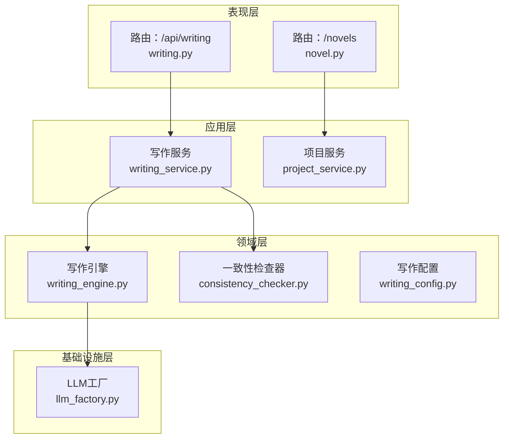
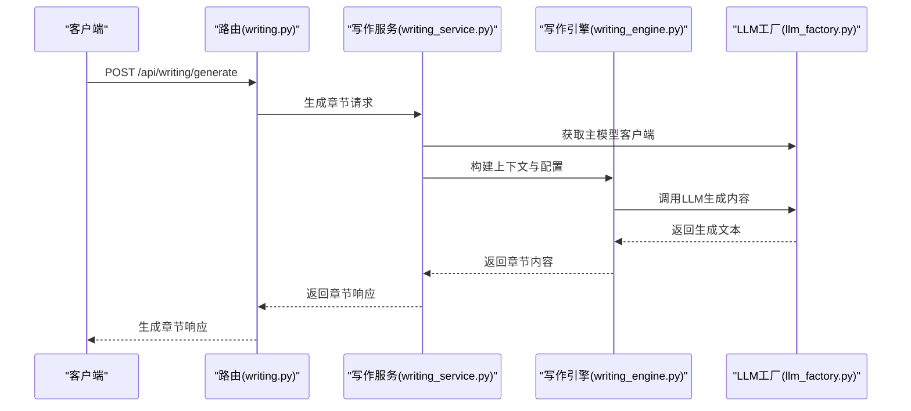
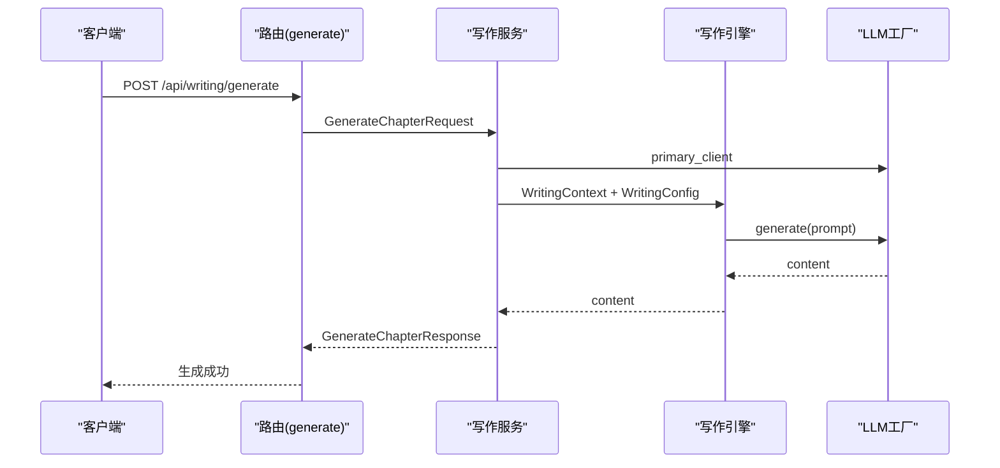
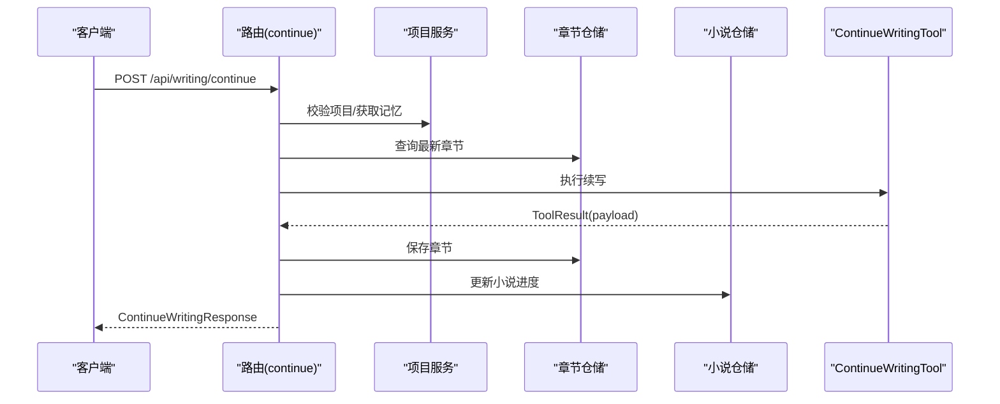
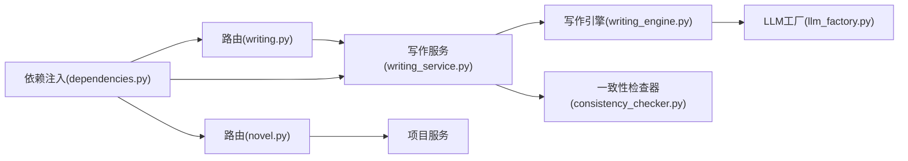

# 写作服务API

<cite>
**本文引用的文件**
- [writing.py](file://presentation/api/routers/writing.py)
- [writing_service.py](file://application/services/writing_service.py)
- [writing_engine.py](file://domain/services/writing_engine.py)
- [writing_config.py](file://domain/value_objects/writing_config.py)
- [request_dto.py](file://application/dto/request_dto.py)
- [response_dto.py](file://application/dto/response_dto.py)
- [chapter.py](file://domain/entities/chapter.py)
- [novel.py](file://domain/entities/novel.py)
- [chapter_repository.py](file://domain/repositories/chapter_repository.py)
- [novel.py](file://presentation/api/routers/novel.py)
- [dependencies.py](file://presentation/api/dependencies.py)
- [llm_factory.py](file://infrastructure/llm/llm_factory.py)
- [orchestrator.py](file://application/agent_mvp/orchestrator.py)
- [tools.py](file://application/agent_mvp/tools.py)
- [consistency_checker.py](file://domain/services/consistency_checker.py)
</cite>

## 目录
1. [简介](#简介)
2. [项目结构](#项目结构)
3. [核心组件](#核心组件)
4. [架构总览](#架构总览)
5. [详细组件分析](#详细组件分析)
6. [依赖分析](#依赖分析)
7. [性能考虑](#性能考虑)
8. [故障排查指南](#故障排查指南)
9. [结论](#结论)
10. [附录](#附录)

## 简介
本文件为“写作服务API”的权威接口文档，覆盖章节生成、智能续写、内容修改、质量评估与审核、进度与中断、历史与版本管理等能力。文档面向开发者与产品人员，提供端点定义、请求/响应规范、参数说明、错误码、工作流图解与最佳实践建议。

## 项目结构
- 后端采用FastAPI路由层，通过依赖注入装配应用服务与基础设施。
- 应用层提供写作服务（生成/续写/规划）、项目服务、导出服务等。
- 领域层包含写作引擎、一致性检查器、文风特征、写作配置等。
- 基础设施层包含LLM工厂、SQLite仓储、向量索引等。

图表来源
- [writing.py:37-278](file://presentation/api/routers/writing.py#L37-L278)
- [novel.py:21-162](file://presentation/api/routers/novel.py#L21-L162)
- [writing_service.py:30-180](file://application/services/writing_service.py#L30-L180)
- [writing_engine.py:30-184](file://domain/services/writing_engine.py#L30-L184)
- [consistency_checker.py:37-218](file://domain/services/consistency_checker.py#L37-L218)
- [llm_factory.py:31-121](file://infrastructure/llm/llm_factory.py#L31-L121)

章节来源
- [writing.py:37-278](file://presentation/api/routers/writing.py#L37-L278)
- [novel.py:21-162](file://presentation/api/routers/novel.py#L21-L162)
- [dependencies.py:50-178](file://presentation/api/dependencies.py#L50-L178)

## 核心组件
- 写作服务：负责章节生成、剧情规划、一致性检查。
- 写作引擎：构建提示词、调用LLM、应用文风。
- 写作配置：目标字数、风格模拟、一致性检查开关等。
- LLM工厂：主备模型切换与可用性检测。
- 续写工具链（Agent MVP）：RAG检索+写作生成的编排。
- 一致性检查器：基于人物、时间线、剧情连续性的检查。

章节来源
- [writing_service.py:30-180](file://application/services/writing_service.py#L30-L180)
- [writing_engine.py:30-184](file://domain/services/writing_engine.py#L30-L184)
- [writing_config.py:13-28](file://domain/value_objects/writing_config.py#L13-L28)
- [llm_factory.py:31-121](file://infrastructure/llm/llm_factory.py#L31-L121)
- [consistency_checker.py:37-218](file://domain/services/consistency_checker.py#L37-L218)

## 架构总览
写作API通过路由层接收请求，经由应用服务调用领域服务与基础设施，最终返回统一格式的响应。

图表来源
- [writing.py:111-174](file://presentation/api/routers/writing.py#L111-L174)
- [writing_service.py:91-165](file://application/services/writing_service.py#L91-L165)
- [writing_engine.py:52-80](file://domain/services/writing_engine.py#L52-L80)
- [llm_factory.py:54-95](file://infrastructure/llm/llm_factory.py#L54-L95)

## 详细组件分析

### 1) 章节生成接口
- 端点：POST /api/writing/generate
- 功能：根据小说与目标生成章节内容，支持风格模拟与一致性检查。
- 请求体字段（节选）：
  - novel_id：小说ID
  - goal：生成目标（用于提示词）
  - target_word_count：目标字数
  - options：扩展选项（如启用风格模拟、一致性检查）
- 响应体字段（节选）：
  - chapter_id：生成章节ID
  - content：章节内容
  - word_count：字数
  - metadata：元数据（路由、灰度比例等）

图表来源
- [writing.py:111-174](file://presentation/api/routers/writing.py#L111-L174)
- [writing_service.py:91-165](file://application/services/writing_service.py#L91-L165)
- [writing_engine.py:52-80](file://domain/services/writing_engine.py#L52-L80)

章节来源
- [writing.py:111-174](file://presentation/api/routers/writing.py#L111-L174)
- [writing_service.py:91-165](file://application/services/writing_service.py#L91-L165)
- [request_dto.py:45-54](file://application/dto/request_dto.py#L45-L54)
- [response_dto.py:86-100](file://application/dto/response_dto.py#L86-L100)

### 2) 智能续写接口
- 端点：POST /api/writing/continue
- 功能：基于项目记忆与最新章节，生成下一章草稿，并持久化到数据库。
- 请求体字段（节选）：
  - novel_id：小说ID
  - goal：续写目标
  - target_word_count：目标字数
  - options：扩展选项
- 响应体字段（节选）：
  - content：章节内容
  - word_count：字数
  - metadata：包含使用的记忆信息、章节号等

图表来源
- [writing.py:176-278](file://presentation/api/routers/writing.py#L176-L278)
- [tools.py:343-446](file://application/agent_mvp/tools.py#L343-L446)
- [chapter_repository.py:17-89](file://domain/repositories/chapter_repository.py#L17-L89)

章节来源
- [writing.py:176-278](file://presentation/api/routers/writing.py#L176-L278)
- [tools.py:343-446](file://application/agent_mvp/tools.py#L343-L446)
- [request_dto.py:56-62](file://application/dto/request_dto.py#L56-L62)
- [response_dto.py:94-100](file://application/dto/response_dto.py#L94-L100)

### 3) 剧情规划接口
- 端点：POST /api/writing/plan
- 功能：根据小说大纲与目标生成剧情节点列表。
- 请求体字段（节选）：
  - novel_id：小说ID
  - goal：规划目标
  - chapter_count：期望节点数量
  - options：扩展选项
- 响应体字段（节选）：
  - 列表项包含id、title、description、type、status

章节来源
- [writing.py:88-109](file://presentation/api/routers/writing.py#L88-L109)
- [writing_service.py:50-89](file://application/services/writing_service.py#L50-L89)
- [request_dto.py:64-71](file://application/dto/request_dto.py#L64-L71)

### 4) 写作质量评估与审核
- 一致性检查：可选开启，返回一致性检查报告，包含不一致项与警告。
- 报告字段（节选）：
  - is_valid：是否通过
  - inconsistencies：不一致项列表（含类型、描述、严重程度）
  - warnings：警告列表

章节来源
- [writing_service.py:144-159](file://application/services/writing_service.py#L144-L159)
- [consistency_checker.py:28-87](file://domain/services/consistency_checker.py#L28-L87)
- [response_dto.py:79-84](file://application/dto/response_dto.py#L79-L84)

### 5) 写作进度状态与中断
- 状态查询：通过小说详情接口获取章节列表与字数统计。
- 中断机制：Agent链路内置终止策略与超时控制，可通过环境变量控制灰度与步数限制。
- 关键环境变量：
  - INKTRACE_ENABLE_AGENT：启用Agent链路
  - INKTRACE_AGENT_GRAY_RATIO：灰度比例（0-100）

章节来源
- [writing.py:44-68](file://presentation/api/routers/writing.py#L44-L68)
- [novel.py:88-162](file://presentation/api/routers/novel.py#L88-L162)
- [orchestrator.py:17-212](file://application/agent_mvp/orchestrator.py#L17-L212)

### 6) 写作历史记录与版本管理
- 历史记录：章节仓储提供按小说查询、最新章节查询等能力。
- 版本管理：章节实体包含创建/更新时间戳，可用于版本追踪。
- 小说聚合根维护章节顺序与总字数。

章节来源
- [chapter_repository.py:17-89](file://domain/repositories/chapter_repository.py#L17-L89)
- [chapter.py:18-109](file://domain/entities/chapter.py#L18-L109)
- [novel.py:20-178](file://domain/entities/novel.py#L20-L178)

### 7) 写作请求接口规范与参数说明
- 通用请求头：Content-Type: application/json
- 公共字段（BaseRequest）：
  - user_id：用户标识
  - session_id：会话标识
  - trace_id：追踪ID
- 生成章节请求（GenerateChapterRequest）：
  - novel_id：小说ID
  - goal：生成目标
  - target_word_count：目标字数（默认2100，范围1-50000）
  - options：扩展选项（enable_style_mimicry、enable_consistency_check等）
- 续写请求（ContinueWritingRequest）：
  - novel_id：小说ID
  - goal：续写目标
  - target_word_count：目标字数
  - options：扩展选项
- 剧情规划请求（PlanPlotRequest）：
  - novel_id：小说ID
  - goal：规划目标
  - chapter_count：节点数量（1-100）
  - options：扩展选项

章节来源
- [request_dto.py:14-97](file://application/dto/request_dto.py#L14-L97)

### 8) 写作引擎工作流程与配置选项
- 工作流程：
  - 构建写作上下文（标题、大纲摘要、前文、方向）
  - 生成提示词
  - 调用LLM生成内容
  - 可选应用文风特征
- 配置选项（WritingConfig）：
  - target_word_count：目标字数
  - style_intensity：风格强度
  - temperature：温度
  - max_context_chapters：上下文章节数上限
  - enable_consistency_check：启用一致性检查
  - enable_style_mimicry：启用风格模拟

章节来源
- [writing_engine.py:19-184](file://domain/services/writing_engine.py#L19-L184)
- [writing_config.py:13-28](file://domain/value_objects/writing_config.py#L13-L28)

### 9) Agent链路与灰度控制
- Agent链路：RAG检索 → 写作生成，支持幂等键、重试与追踪。
- 灰度控制：基于novel_id与goal的哈希进行分桶，受环境变量控制。

章节来源
- [writing.py:44-68](file://presentation/api/routers/writing.py#L44-L68)
- [orchestrator.py:17-212](file://application/agent_mvp/orchestrator.py#L17-L212)
- [tools.py:273-341](file://application/agent_mvp/tools.py#L273-L341)

## 依赖分析
- 路由层依赖应用服务与仓储接口。
- 应用服务依赖领域服务与LLM工厂。
- 领域服务依赖LLM客户端与配置对象。
- 依赖注入通过缓存函数统一装配。

图表来源
- [writing.py:37-278](file://presentation/api/routers/writing.py#L37-L278)
- [novel.py:21-162](file://presentation/api/routers/novel.py#L21-L162)
- [dependencies.py:50-178](file://presentation/api/dependencies.py#L50-L178)
- [writing_service.py:30-180](file://application/services/writing_service.py#L30-L180)
- [writing_engine.py:30-184](file://domain/services/writing_engine.py#L30-L184)
- [consistency_checker.py:37-218](file://domain/services/consistency_checker.py#L37-L218)
- [llm_factory.py:31-121](file://infrastructure/llm/llm_factory.py#L31-L121)

章节来源
- [dependencies.py:50-178](file://presentation/api/dependencies.py#L50-L178)

## 性能考虑
- 上下文截断：写作引擎仅取最近若干章节作为上下文，避免上下文过长导致延迟与成本上升。
- 并发与重试：Agent链路支持重试与降级策略，提升稳定性。
- 模型切换：LLM工厂在主模型不可用时自动切换备用模型，保证可用性。
- 缓存：依赖注入使用LRU缓存减少重复实例化开销。

章节来源
- [writing_engine.py:139-184](file://domain/services/writing_engine.py#L139-L184)
- [llm_factory.py:78-121](file://infrastructure/llm/llm_factory.py#L78-L121)
- [dependencies.py:50-110](file://presentation/api/dependencies.py#L50-L110)

## 故障排查指南
- 常见错误码与含义：
  - NOVEL_NOT_FOUND：未找到对应作品
  - CONTINUE_INPUT_INVALID：续写参数无效
  - CONTINUE_FAILED：续写失败
  - MEMORY_REQUIRED：需要先整理故事结构
  - INTERNAL_ERROR：内部错误
- 错误响应包含：
  - success：布尔
  - error_code：错误码
  - message：错误消息
  - details：详细说明
  - trace_id：追踪ID

章节来源
- [writing.py:183-278](file://presentation/api/routers/writing.py#L183-L278)
- [response_dto.py:109-116](file://application/dto/response_dto.py#L109-L116)

## 结论
写作服务API以清晰的分层设计与可插拔的LLM工厂为核心，提供从章节生成、智能续写到质量评估与历史管理的完整能力。通过Agent链路与灰度控制，系统具备良好的扩展性与稳定性。建议在生产环境中结合缓存、限流与可观测性进一步优化体验。

## 附录

### A. 端点一览与示例
- 生成章节
  - 方法：POST
  - 路径：/api/writing/generate
  - 请求体字段参考：novel_id、goal、target_word_count、options
  - 响应体字段参考：chapter_id、content、word_count、metadata
- 续写章节
  - 方法：POST
  - 路径：/api/writing/continue
  - 请求体字段参考：novel_id、goal、target_word_count、options
  - 响应体字段参考：content、word_count、metadata
- 规划剧情
  - 方法：POST
  - 路径：/api/writing/plan
  - 请求体字段参考：novel_id、goal、chapter_count、options
  - 响应体字段：节点数组（id、title、description、type、status）
- 小说详情
  - 方法：GET
  - 路径：/novels/{novel_id}
  - 响应体字段参考：id、title、genre、chapter_count、chapters、memory、status

章节来源
- [writing.py:88-174](file://presentation/api/routers/writing.py#L88-L174)
- [novel.py:88-162](file://presentation/api/routers/novel.py#L88-L162)

### B. 参数与约束
- 字数范围：1-50000
- 章节数量：1-100
- 默认目标字数：2100
- 开关选项：enable_style_mimicry、enable_consistency_check

章节来源
- [request_dto.py:45-71](file://application/dto/request_dto.py#L45-L71)
- [writing_config.py:22-27](file://domain/value_objects/writing_config.py#L22-L27)

### C. 环境变量
- INKTRACE_ENABLE_AGENT：启用Agent链路
- INKTRACE_AGENT_GRAY_RATIO：灰度比例（0-100）
- DEEPSEEK_API_KEY、KIMI_API_KEY：模型密钥
- INKTRACE_DB_PATH：SQLite数据库路径
- INKTRACE_TEMPLATES_DIR：模板目录
- INKTRACE_CHROMA_DIR：向量库目录

章节来源
- [writing.py:44-68](file://presentation/api/routers/writing.py#L44-L68)
- [dependencies.py:45-47](file://presentation/api/dependencies.py#L45-L47)
- [dependencies.py:104-109](file://presentation/api/dependencies.py#L104-L109)