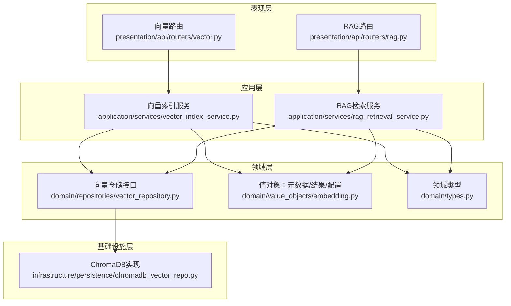
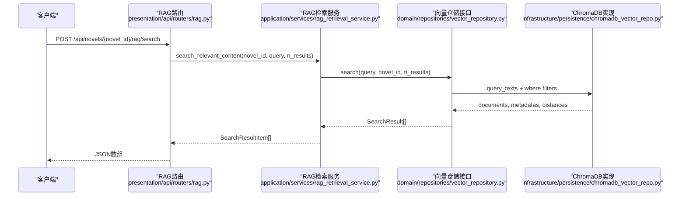
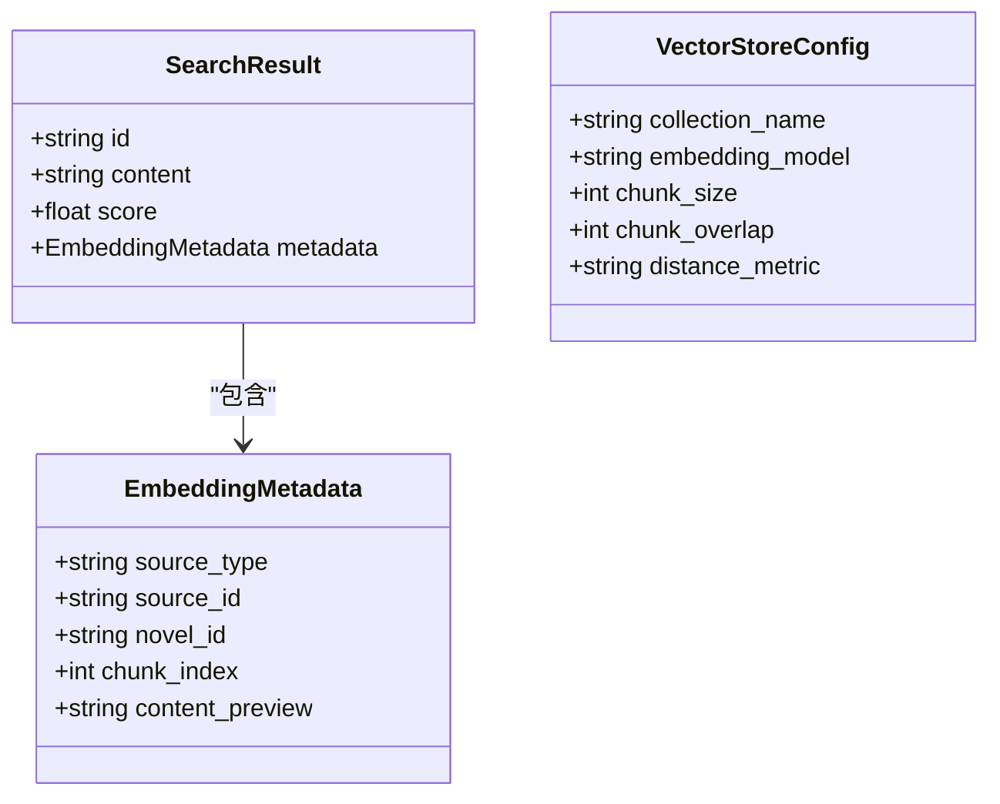
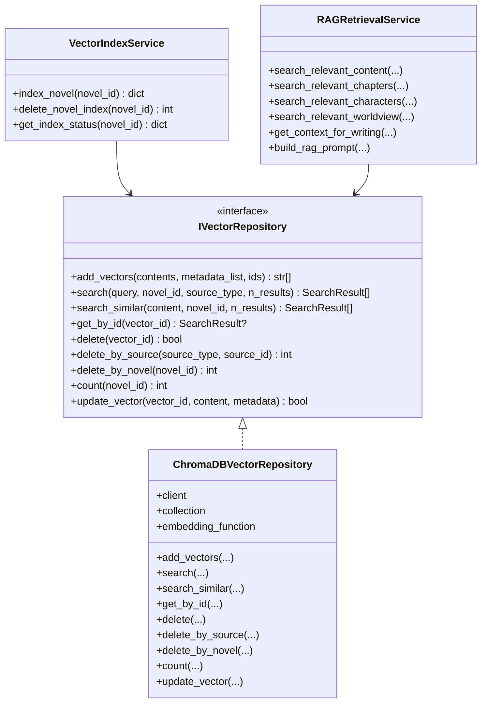
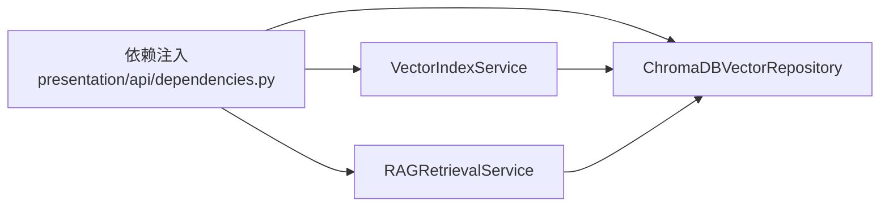
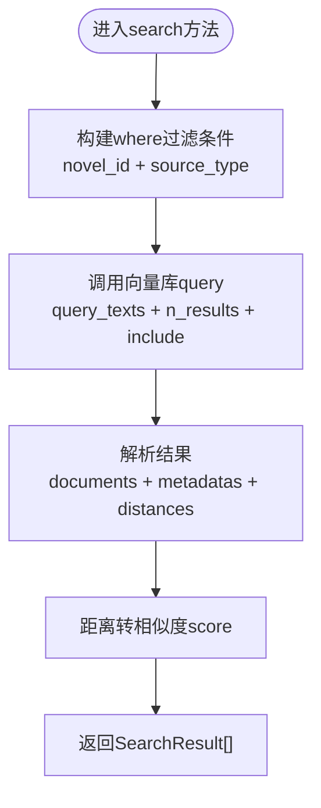

# 向量检索API

<cite>
**本文引用的文件列表**
- [vector.py](file://presentation/api/routers/vector.py)
- [rag.py](file://presentation/api/routers/rag.py)
- [vector_index_service.py](file://application/services/vector_index_service.py)
- [rag_retrieval_service.py](file://application/services/rag_retrieval_service.py)
- [vector_repository.py](file://domain/repositories/vector_repository.py)
- [chromadb_vector_repo.py](file://infrastructure/persistence/chromadb_vector_repo.py)
- [embedding.py](file://domain/value_objects/embedding.py)
- [types.py](file://domain/types.py)
- [dependencies.py](file://presentation/api/dependencies.py)
- [test_vector_index_service.py](file://tests/unit/test_vector_index_service.py)
- [test_rag_retrieval_service.py](file://tests/unit/test_rag_retrieval_service.py)
</cite>

## 目录
1. [简介](#简介)
2. [项目结构](#项目结构)
3. [核心组件](#核心组件)
4. [架构总览](#架构总览)
5. [详细组件分析](#详细组件分析)
6. [依赖关系分析](#依赖关系分析)
7. [性能与优化](#性能与优化)
8. [故障排查指南](#故障排查指南)
9. [结论](#结论)
10. [附录](#附录)

## 简介
本文件面向“向量检索API”的使用者与维护者，系统化梳理向量索引管理、内容检索、上下文构建与RAG提示词生成等能力的接口规范与实现细节。重点覆盖：
- 向量索引的创建、状态查询与删除
- 基于语义相似度的检索与相关性评分
- 检索结果的来源过滤与数量控制
- 上下文构建与RAG提示词生成
- 向量数据库的配置与性能要点
- 使用场景与请求/响应示例路径

## 项目结构
该系统采用分层架构：表现层（FastAPI路由）、应用层（服务）、领域层（值对象与仓储接口）、基础设施层（ChromaDB实现）。向量检索API主要由以下文件构成：
- 路由层：向量索引路由与RAG检索路由
- 应用服务：向量索引服务与RAG检索服务
- 领域模型：向量元数据、搜索结果、配置值对象
- 仓储接口：统一的向量操作抽象
- 基础设施：ChromaDB持久化实现
- 依赖注入：统一的服务实例化与缓存

图表来源
- [vector.py:18-76](file://presentation/api/routers/vector.py#L18-L76)
- [rag.py:18-111](file://presentation/api/routers/rag.py#L18-L111)
- [vector_index_service.py:21-37](file://application/services/vector_index_service.py#L21-L37)
- [rag_retrieval_service.py:20-31](file://application/services/rag_retrieval_service.py#L20-L31)
- [vector_repository.py:17-95](file://domain/repositories/vector_repository.py#L17-L95)
- [chromadb_vector_repo.py:19-34](file://infrastructure/persistence/chromadb_vector_repo.py#L19-L34)
- [embedding.py:14-79](file://domain/value_objects/embedding.py#L14-L79)
- [types.py:15-30](file://domain/types.py#L15-L30)

章节来源
- [vector.py:18-76](file://presentation/api/routers/vector.py#L18-L76)
- [rag.py:18-111](file://presentation/api/routers/rag.py#L18-L111)
- [vector_index_service.py:21-37](file://application/services/vector_index_service.py#L21-L37)
- [rag_retrieval_service.py:20-31](file://application/services/rag_retrieval_service.py#L20-L31)
- [vector_repository.py:17-95](file://domain/repositories/vector_repository.py#L17-L95)
- [chromadb_vector_repo.py:19-34](file://infrastructure/persistence/chromadb_vector_repo.py#L19-L34)
- [embedding.py:14-79](file://domain/value_objects/embedding.py#L14-L79)
- [types.py:15-30](file://domain/types.py#L15-L30)

## 核心组件
- 向量索引服务：负责将小说章节、人物、世界观内容切片后嵌入并写入向量库；支持按小说维度删除索引与查询索引状态。
- RAG检索服务：提供通用语义检索、按来源类型检索（章节/人物/世界观），以及基于检索结果构建续写上下文与RAG提示词。
- 向量仓储接口：定义统一的向量增删改查、按来源/小说过滤、计数与相似检索等能力。
- ChromaDB实现：基于ChromaDB持久化，提供延迟初始化客户端、集合与嵌入函数，支持where条件过滤与距离到相似度转换。
- 值对象与类型：EmbeddingMetadata、SearchResult、VectorStoreConfig与领域ID类型（如NovelId）。

章节来源
- [vector_index_service.py:38-53](file://application/services/vector_index_service.py#L38-L53)
- [rag_retrieval_service.py:33-90](file://application/services/rag_retrieval_service.py#L33-L90)
- [vector_repository.py:20-94](file://domain/repositories/vector_repository.py#L20-L94)
- [chromadb_vector_repo.py:74-143](file://infrastructure/persistence/chromadb_vector_repo.py#L74-L143)
- [embedding.py:14-79](file://domain/value_objects/embedding.py#L14-L79)
- [types.py:15-30](file://domain/types.py#L15-L30)

## 架构总览
下面以序列图展示“RAG检索”与“向量索引管理”的典型调用链路。

图表来源
- [rag.py:46-66](file://presentation/api/routers/rag.py#L46-L66)
- [rag_retrieval_service.py:33-46](file://application/services/rag_retrieval_service.py#L33-L46)
- [vector_repository.py:32-41](file://domain/repositories/vector_repository.py#L32-L41)
- [chromadb_vector_repo.py:97-130](file://infrastructure/persistence/chromadb_vector_repo.py#L97-L130)

## 详细组件分析

### 向量索引管理API
- 路由前缀：/api/novels/{novel_id}/vector
- 依赖注入：通过依赖注入容器获取VectorIndexService实例

端点一览
- POST /api/novels/{novel_id}/vector/index
  - 功能：对指定小说执行全文索引（章节、人物、世界观）
  - 请求体：无
  - 响应体：IndexResultResponse
  - 返回字段：章节索引数、人物索引数、世界观索引数、错误列表
  - 异常：内部错误返回500

- GET /api/novels/{novel_id}/vector/status
  - 功能：查询当前小说的向量索引状态
  - 响应体：IndexStatusResponse
  - 返回字段：向量总数、章节计数、是否已索引

- DELETE /api/novels/{novel_id}/vector/index
  - 功能：删除指定小说的所有向量
  - 响应体：JSON消息，包含删除的向量数量

请求/响应示例路径
- POST /api/novels/{novel_id}/vector/index
  - 示例请求：无请求体
  - 示例响应：见 [vector.py:47-52](file://presentation/api/routers/vector.py#L47-L52)
- GET /api/novels/{novel_id}/vector/status
  - 示例响应：见 [vector.py:65-66](file://presentation/api/routers/vector.py#L65-L66)
- DELETE /api/novels/{novel_id}/vector/index
  - 示例响应：见 [vector.py:75-76](file://presentation/api/routers/vector.py#L75-L76)

实现要点
- 内容分块：章节内容按配置的chunk_size与chunk_overlap进行滑动分块，避免重复丢失信息
- 元数据：为每条向量附加来源类型、源ID、小说ID、分块索引与内容预览
- 删除策略：按novel_id批量删除，确保清理干净

章节来源
- [vector.py:39-76](file://presentation/api/routers/vector.py#L39-L76)
- [vector_index_service.py:38-53](file://application/services/vector_index_service.py#L38-L53)
- [vector_index_service.py:55-105](file://application/services/vector_index_service.py#L55-L105)
- [vector_index_service.py:107-153](file://application/services/vector_index_service.py#L107-L153)
- [vector_index_service.py:193-205](file://application/services/vector_index_service.py#L193-L205)
- [embedding.py:14-41](file://domain/value_objects/embedding.py#L14-L41)

### RAG检索API
- 路由前缀：/api/novels/{novel_id}/rag
- 依赖注入：通过依赖注入容器获取RAGRetrievalService实例

端点一览
- POST /api/novels/{novel_id}/rag/search
  - 功能：通用语义检索，支持n_results数量控制
  - 请求体：SearchRequest（query, n_results）
  - 响应体：SearchResultItem[]（id, content, score, source_type, source_id）

- POST /api/novels/{novel_id}/rag/context
  - 功能：获取续写上下文（章节、人物、世界观）
  - 请求体：SearchRequest（query）
  - 响应体：RAGContextResponse（query, chapters[], characters[], worldview[]）

- POST /api/novels/{novel_id}/rag/prompt
  - 功能：构建RAG提示词（包含上下文与用户请求）
  - 请求体：SearchRequest（query）
  - 响应体：JSON（prompt）

请求/响应示例路径
- POST /api/novels/{novel_id}/rag/search
  - 示例请求：见 [rag.py:21-24](file://presentation/api/routers/rag.py#L21-L24)
  - 示例响应：见 [rag.py:58-66](file://presentation/api/routers/rag.py#L58-L66)
- POST /api/novels/{novel_id}/rag/context
  - 示例请求：见 [rag.py:70-73](file://presentation/api/routers/rag.py#L70-L73)
  - 示例响应：见 [rag.py:92-97](file://presentation/api/routers/rag.py#L92-L97)
- POST /api/novels/{novel_id}/rag/prompt
  - 示例请求：见 [rag.py:100-104](file://presentation/api/routers/rag.py#L100-L104)
  - 示例响应：见 [rag.py:110-111](file://presentation/api/routers/rag.py#L110-L111)

实现要点
- 条件过滤：支持按source_type过滤（chapter/character/worldview），或按novel_id过滤
- 相似度计算：将底层距离转换为相似度score，便于前端排序与展示
- 上下文构建：分别限定各来源的最大返回数量，保证上下文可控
- 提示词拼装：在固定格式中拼接章节、人物、世界观与用户请求

章节来源
- [rag.py:46-111](file://presentation/api/routers/rag.py#L46-L111)
- [rag_retrieval_service.py:33-90](file://application/services/rag_retrieval_service.py#L33-L90)
- [rag_retrieval_service.py:99-155](file://application/services/rag_retrieval_service.py#L99-L155)
- [chromadb_vector_repo.py:97-143](file://infrastructure/persistence/chromadb_vector_repo.py#L97-L143)
- [chromadb_vector_repo.py:224-247](file://infrastructure/persistence/chromadb_vector_repo.py#L224-L247)

### 数据模型与值对象
- EmbeddingMetadata：向量元数据，包含source_type、source_id、novel_id、chunk_index、content_preview
- SearchResult：搜索结果，包含id、content、score、metadata
- VectorStoreConfig：向量存储配置，包含collection_name、embedding_model、chunk_size、chunk_overlap、distance_metric

图表来源
- [embedding.py:14-79](file://domain/value_objects/embedding.py#L14-L79)

章节来源
- [embedding.py:14-79](file://domain/value_objects/embedding.py#L14-L79)

### 类关系与依赖
- IVectorRepository为向量操作的抽象接口，ChromaDBVectorRepository为其具体实现
- VectorIndexService与RAGRetrievalService均依赖IVectorRepository
- 依赖注入通过dependencies.py集中管理，使用LRU缓存复用实例

图表来源
- [vector_repository.py:17-95](file://domain/repositories/vector_repository.py#L17-L95)
- [chromadb_vector_repo.py:19-270](file://infrastructure/persistence/chromadb_vector_repo.py#L19-L270)
- [vector_index_service.py:21-37](file://application/services/vector_index_service.py#L21-L37)
- [rag_retrieval_service.py:20-31](file://application/services/rag_retrieval_service.py#L20-L31)

章节来源
- [vector_repository.py:17-95](file://domain/repositories/vector_repository.py#L17-L95)
- [chromadb_vector_repo.py:19-270](file://infrastructure/persistence/chromadb_vector_repo.py#L19-L270)
- [vector_index_service.py:21-37](file://application/services/vector_index_service.py#L21-L37)
- [rag_retrieval_service.py:20-31](file://application/services/rag_retrieval_service.py#L20-L31)

## 依赖关系分析
- 依赖注入：通过dependencies.py集中管理仓储与服务实例，使用@lru_cache减少重复创建
- 运行时环境变量：INKTRACE_DB_PATH、INKTRACE_TEMPLATES_DIR、INKTRACE_CHROMA_DIR、DEEPSEEK_API_KEY、KIMI_API_KEY
- 向量库初始化：ChromaDBPersistentClient与Collection按需延迟初始化，避免启动开销

图表来源
- [dependencies.py:50-178](file://presentation/api/dependencies.py#L50-L178)

章节来源
- [dependencies.py:50-178](file://presentation/api/dependencies.py#L50-L178)

## 性能与优化
- 向量嵌入与存储
  - 嵌入模型：使用Chinese Sentence Transformer模型，适合中文文本
  - 距离度量：默认余弦距离，相似度score通过距离转换
  - 分块策略：chunk_size与chunk_overlap可调，平衡召回与性能
- 查询性能
  - 过滤条件：支持按novel_id与source_type组合过滤，缩小检索范围
  - 结果数量：通过n_results控制返回条数，避免超大数据集传输
- 存储与清理
  - 批量删除：按novel_id删除，清理成本低
  - 计数统计：快速判断索引状态
- 建议
  - 对长文本分块时，适当增大chunk_size并减小overlap，提升召回质量
  - 在高频查询场景下，结合source_type过滤减少扫描范围
  - 定期清理不再使用的索引，保持向量库规模可控

章节来源
- [chromadb_vector_repo.py:64-72](file://infrastructure/persistence/chromadb_vector_repo.py#L64-L72)
- [chromadb_vector_repo.py:107-128](file://infrastructure/persistence/chromadb_vector_repo.py#L107-L128)
- [vector_index_service.py:155-176](file://application/services/vector_index_service.py#L155-L176)
- [embedding.py:71-79](file://domain/value_objects/embedding.py#L71-L79)

## 故障排查指南
- 常见问题
  - 无法连接向量库：检查INKTRACE_CHROMA_DIR目录权限与磁盘空间
  - 检索结果为空：确认是否已完成索引、novel_id是否正确、query是否为空
  - 相似度异常：确认distance_metric与score转换逻辑一致
- 排查步骤
  - 使用GET /api/novels/{novel_id}/vector/status确认索引状态
  - 使用POST /api/novels/{novel_id}/rag/search验证检索是否返回结果
  - 检查依赖注入容器是否成功创建ChromaDBVectorRepository实例
- 单元测试参考
  - 向量索引服务：见 [test_vector_index_service.py](file://tests/unit/test_vector_index_service.py)
  - RAG检索服务：见 [test_rag_retrieval_service.py](file://tests/unit/test_rag_retrieval_service.py)

章节来源
- [vector.py:57-66](file://presentation/api/routers/vector.py#L57-L66)
- [rag.py:46-66](file://presentation/api/routers/rag.py#L46-L66)
- [dependencies.py:92-95](file://presentation/api/dependencies.py#L92-L95)
- [test_vector_index_service.py:87-96](file://tests/unit/test_vector_index_service.py#L87-L96)
- [test_rag_retrieval_service.py:56-71](file://tests/unit/test_rag_retrieval_service.py#L56-L71)

## 结论
本API围绕“向量索引管理—语义检索—上下文构建—提示词生成”的完整链路设计，具备清晰的分层与可扩展性。通过ChromaDB实现与统一的仓储接口，既满足中文文本的嵌入需求，又提供了灵活的过滤与计数能力。建议在实际部署中结合业务场景调整分块参数与过滤策略，并定期清理索引以维持性能稳定。

## 附录

### API定义与使用示例路径
- 向量索引管理
  - POST /api/novels/{novel_id}/vector/index
    - 示例响应：见 [vector.py:47-52](file://presentation/api/routers/vector.py#L47-L52)
  - GET /api/novels/{novel_id}/vector/status
    - 示例响应：见 [vector.py:65-66](file://presentation/api/routers/vector.py#L65-L66)
  - DELETE /api/novels/{novel_id}/vector/index
    - 示例响应：见 [vector.py:75-76](file://presentation/api/routers/vector.py#L75-L76)

- RAG检索
  - POST /api/novels/{novel_id}/rag/search
    - 请求体：见 [rag.py:21-24](file://presentation/api/routers/rag.py#L21-L24)
    - 示例响应：见 [rag.py:58-66](file://presentation/api/routers/rag.py#L58-L66)
  - POST /api/novels/{novel_id}/rag/context
    - 请求体：见 [rag.py:70-73](file://presentation/api/routers/rag.py#L70-L73)
    - 示例响应：见 [rag.py:92-97](file://presentation/api/routers/rag.py#L92-L97)
  - POST /api/novels/{novel_id}/rag/prompt
    - 请求体：见 [rag.py:100-104](file://presentation/api/routers/rag.py#L100-L104)
    - 示例响应：见 [rag.py:110-111](file://presentation/api/routers/rag.py#L110-L111)

### 关键流程图：检索算法

图表来源
- [chromadb_vector_repo.py:97-130](file://infrastructure/persistence/chromadb_vector_repo.py#L97-L130)
- [chromadb_vector_repo.py:224-247](file://infrastructure/persistence/chromadb_vector_repo.py#L224-L247)