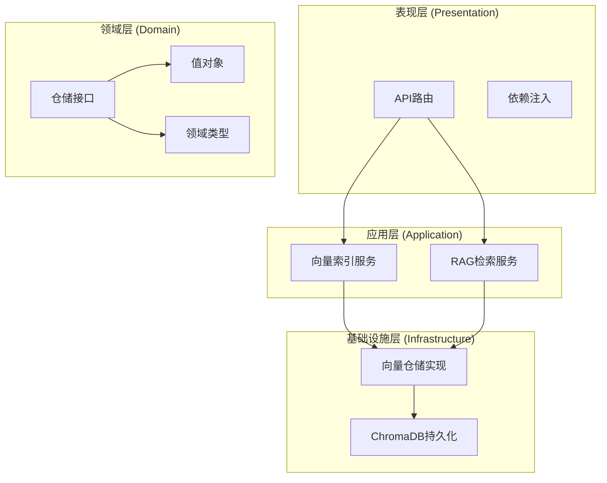
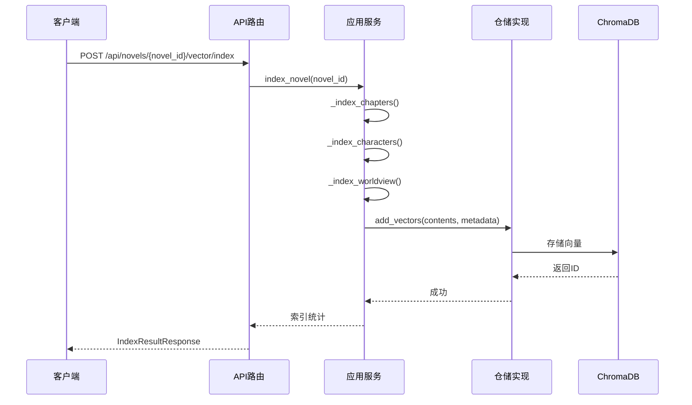
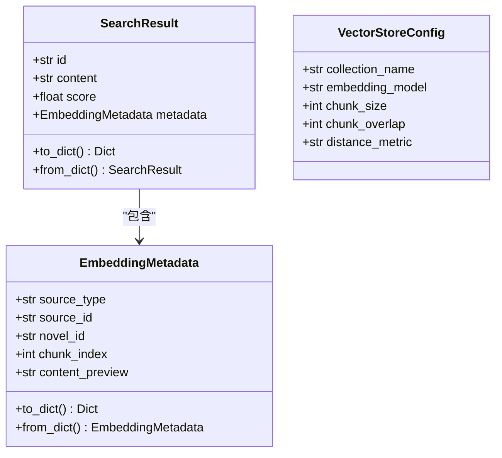
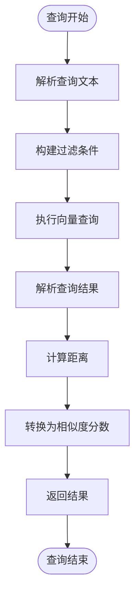
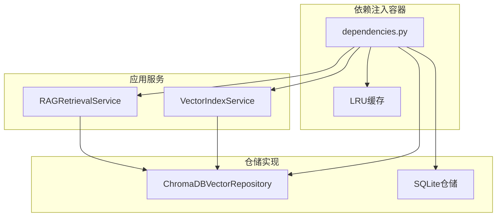

# 向量检索API

<cite>
**本文档引用的文件**
- [vector.py](file://presentation/api/routers/vector.py)
- [rag.py](file://presentation/api/routers/rag.py)
- [vector_index_service.py](file://application/services/vector_index_service.py)
- [rag_retrieval_service.py](file://application/services/rag_retrieval_service.py)
- [vector_repository.py](file://domain/repositories/vector_repository.py)
- [chromadb_vector_repo.py](file://infrastructure/persistence/chromadb_vector_repo.py)
- [embedding.py](file://domain/value_objects/embedding.py)
- [types.py](file://domain/types.py)
- [dependencies.py](file://presentation/api/dependencies.py)
- [test_vector_index_service.py](file://tests/unit/test_vector_index_service.py)
- [test_vector_repository.py](file://tests/unit/test_vector_repository.py)
</cite>

## 目录
1. [简介](#简介)
2. [项目结构](#项目结构)
3. [核心组件](#核心组件)
4. [架构概览](#架构概览)
5. [详细组件分析](#详细组件分析)
6. [依赖关系分析](#依赖关系分析)
7. [性能考虑](#性能考虑)
8. [故障排除指南](#故障排除指南)
9. [结论](#结论)

## 简介

InkTrace Novel AI 是一款基于向量检索的AI小说自动编写助手。该系统通过构建向量索引，实现了基于语义相似度的小说内容检索、RAG（Retrieval-Augmented Generation）上下文查询和智能续写功能。

本向量检索API提供了完整的向量索引管理、内容检索和上下文查询能力，支持基于文本相似度的智能搜索、内容匹配和上下文查询等核心功能。

## 项目结构

向量检索系统采用分层架构设计，主要包含以下层次：



**图表来源**
- [vector.py:18-77](file://presentation/api/routers/vector.py#L18-L77)
- [rag.py:18-112](file://presentation/api/routers/rag.py#L18-L112)
- [vector_index_service.py:21-37](file://application/services/vector_index_service.py#L21-L37)
- [rag_retrieval_service.py:20-32](file://application/services/rag_retrieval_service.py#L20-L32)

**章节来源**
- [vector.py:1-77](file://presentation/api/routers/vector.py#L1-L77)
- [rag.py:1-112](file://presentation/api/routers/rag.py#L1-L112)
- [dependencies.py:163-178](file://presentation/api/dependencies.py#L163-L178)

## 核心组件

### 向量索引服务 (VectorIndexService)

向量索引服务负责管理小说内容的向量化索引过程，包括章节、人物和世界观内容的索引。

**主要功能：**
- 索引小说内容（章节、人物、世界观）
- 内容分块处理
- 元数据管理
- 索引状态查询

**章节来源**
- [vector_index_service.py:21-206](file://application/services/vector_index_service.py#L21-L206)

### RAG检索服务 (RAGRetrievalService)

RAG检索服务提供基于检索增强生成的上下文查询能力，支持多维度的内容检索。

**主要功能：**
- 语义搜索
- 分类检索（章节、人物、世界观）
- 上下文构建
- Prompt生成

**章节来源**
- [rag_retrieval_service.py:20-156](file://application/services/rag_retrieval_service.py#L20-L156)

### 向量仓储接口 (IVectorRepository)

向量仓储接口定义了向量存储的标准操作规范，确保不同存储实现的一致性。

**核心方法：**
- `add_vectors()`: 添加向量
- `search()`: 语义搜索
- `search_similar()`: 相似内容搜索
- `delete_by_novel()`: 删除小说索引

**章节来源**
- [vector_repository.py:17-95](file://domain/repositories/vector_repository.py#L17-L95)

## 架构概览

向量检索系统采用经典的分层架构，实现了清晰的关注点分离：



**图表来源**
- [vector.py:39-54](file://presentation/api/routers/vector.py#L39-L54)
- [vector_index_service.py:38-53](file://application/services/vector_index_service.py#L38-L53)
- [chromadb_vector_repo.py:74-95](file://infrastructure/persistence/chromadb_vector_repo.py#L74-L95)

## 详细组件分析

### API路由设计

#### 向量索引管理路由

系统提供了完整的向量索引管理API：

```mermaid
classDiagram
class VectorRouter {
+POST /api/novels/{novel_id}/vector/index
+GET /api/novels/{novel_id}/vector/status
+DELETE /api/novels/{novel_id}/vector/index
}
class IndexResultResponse {
+int chapters_indexed
+int characters_indexed
+int worldview_indexed
+str[] errors
}
class IndexStatusResponse {
+int total_vectors
+int chapters_count
+bool is_indexed
}
VectorRouter --> IndexResultResponse : "返回"
VectorRouter --> IndexStatusResponse : "返回"
```

**图表来源**
- [vector.py:18-77](file://presentation/api/routers/vector.py#L18-L77)

#### RAG检索路由

RAG检索提供了三种核心检索模式：

```mermaid
classDiagram
class RAGRouter {
+POST /api/novels/{novel_id}/rag/search
+POST /api/novels/{novel_id}/rag/context
+POST /api/novels/{novel_id}/rag/prompt
}
class SearchRequest {
+str query
+int n_results
}
class RAGContextResponse {
+str query
+SearchResultItem[] chapters
+SearchResultItem[] characters
+SearchResultItem[] worldview
}
RAGRouter --> SearchRequest : "接收"
RAGRouter --> RAGContextResponse : "返回"
```

**图表来源**
- [rag.py:18-112](file://presentation/api/routers/rag.py#L18-L112)

**章节来源**
- [vector.py:39-77](file://presentation/api/routers/vector.py#L39-L77)
- [rag.py:46-112](file://presentation/api/routers/rag.py#L46-L112)

### 数据模型设计

#### 搜索结果模型

向量检索系统使用强类型的值对象来确保数据完整性：



**图表来源**
- [embedding.py:44-79](file://domain/value_objects/embedding.py#L44-L79)

#### 领域类型定义

系统使用值对象来确保类型安全：

**章节来源**
- [embedding.py:14-79](file://domain/value_objects/embedding.py#L14-L79)
- [types.py:15-30](file://domain/types.py#L15-L30)

### 检索算法实现

#### 相似度计算

ChromaDB向量仓库实现了基于余弦相似度的相似度计算：



**图表来源**
- [chromadb_vector_repo.py:97-131](file://infrastructure/persistence/chromadb_vector_repo.py#L97-L131)
- [chromadb_vector_repo.py:224-247](file://infrastructure/persistence/chromadb_vector_repo.py#L224-L247)

**章节来源**
- [chromadb_vector_repo.py:97-143](file://infrastructure/persistence/chromadb_vector_repo.py#L97-L143)

## 依赖关系分析

### 依赖注入架构

系统使用依赖注入模式来管理组件间的依赖关系：



**图表来源**
- [dependencies.py:50-96](file://presentation/api/dependencies.py#L50-L96)
- [dependencies.py:163-178](file://presentation/api/dependencies.py#L163-L178)

### 组件耦合分析

系统采用了松耦合的设计原则：

- **接口隔离**: 所有仓储都通过抽象接口定义
- **依赖倒置**: 上层服务依赖抽象而非具体实现
- **单一职责**: 每个组件专注于特定的功能领域

**章节来源**
- [dependencies.py:92-96](file://presentation/api/dependencies.py#L92-L96)
- [vector_index_service.py:24-36](file://application/services/vector_index_service.py#L24-L36)

## 性能考虑

### 缓存策略

系统实现了多级缓存机制来提升性能：

1. **依赖注入缓存**: 使用LRU缓存避免重复创建仓储实例
2. **向量存储优化**: ChromaDB内置的索引和查询优化
3. **批量操作**: 支持批量向量添加和查询

### 查询优化

- **过滤条件**: 支持按小说ID和源类型过滤查询
- **结果限制**: 可配置返回结果数量
- **距离度量**: 使用高效的余弦相似度计算

### 存储优化

- **分块索引**: 内容分块处理，提高检索精度
- **元数据索引**: 丰富的元数据支持精确过滤
- **持久化存储**: 基于ChromaDB的高效向量存储

## 故障排除指南

### 常见问题诊断

#### 向量索引失败

**症状**: 索引过程中出现异常
**可能原因**:
- 数据库连接问题
- 内容为空或格式不正确
- ChromaDB存储权限问题

**解决步骤**:
1. 检查数据库连接状态
2. 验证输入内容格式
3. 确认存储目录权限

#### 检索结果为空

**症状**: 查询返回空结果
**可能原因**:
- 未建立向量索引
- 查询条件过于严格
- 向量模型不匹配

**解决步骤**:
1. 确认已完成索引建立
2. 调整查询条件
3. 检查向量模型配置

#### 性能问题

**症状**: 查询响应缓慢
**可能原因**:
- 索引数据量过大
- 查询过滤条件过多
- 系统资源不足

**解决步骤**:
1. 优化索引结构
2. 简化查询条件
3. 增加系统资源

**章节来源**
- [test_vector_index_service.py:87-206](file://tests/unit/test_vector_index_service.py#L87-L206)
- [test_vector_repository.py:206-261](file://tests/unit/test_vector_repository.py#L206-L261)

## 结论

InkTrace的向量检索API提供了一个完整、高性能的向量搜索解决方案。通过分层架构设计、强类型数据模型和优化的检索算法，系统能够有效支持小说内容的智能检索和RAG应用。

**核心优势：**
- **模块化设计**: 清晰的分层架构便于维护和扩展
- **类型安全**: 强类型的值对象确保数据完整性
- **性能优化**: 多级缓存和查询优化提升响应速度
- **灵活配置**: 支持多种检索场景和参数调整

该API为AI小说自动编写提供了坚实的技术基础，能够支持复杂的文本相似度检索、内容匹配和上下文查询等高级功能。