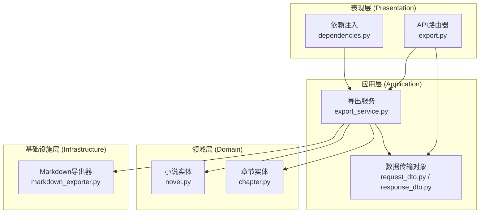
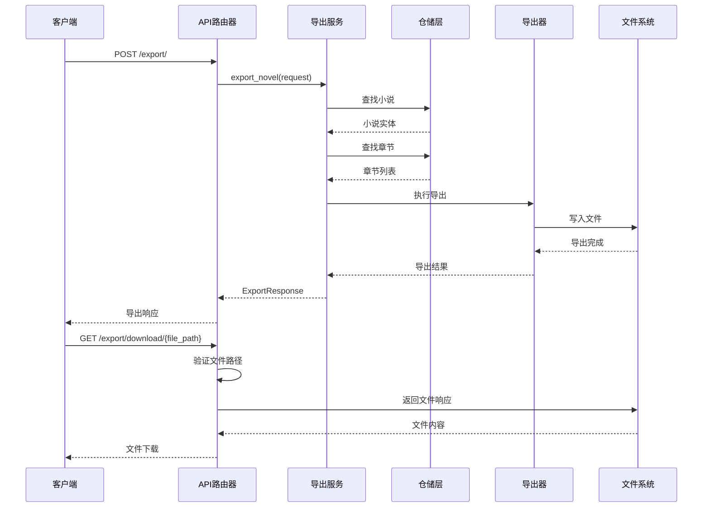
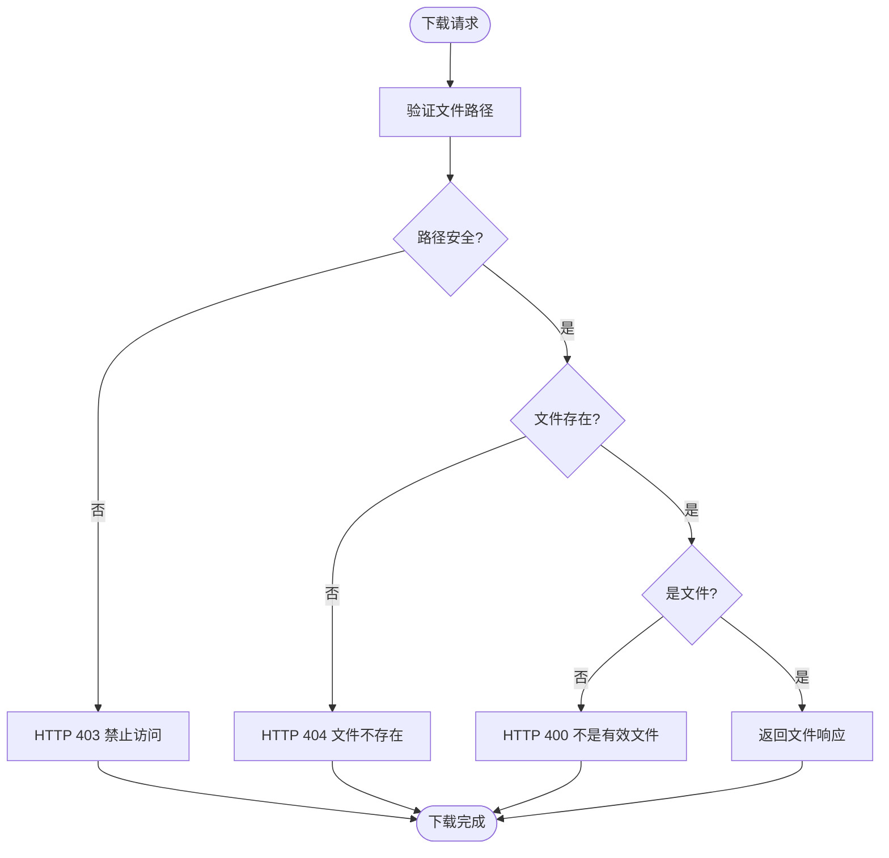
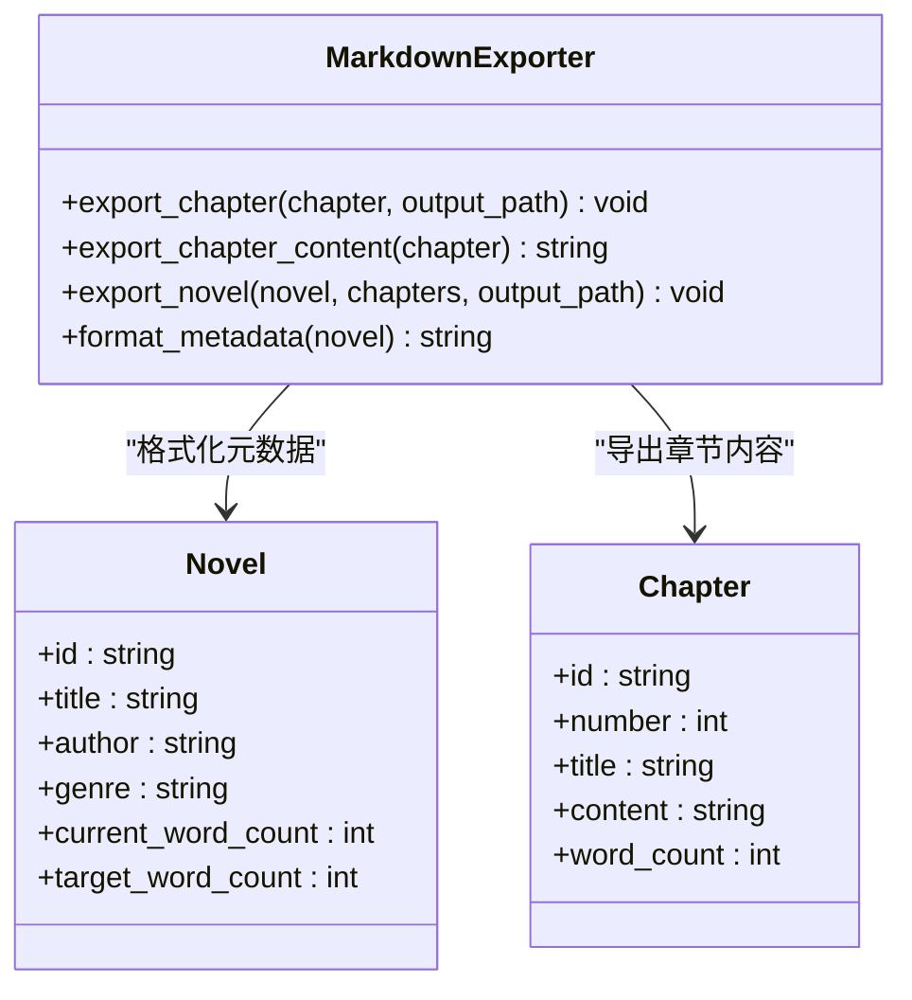
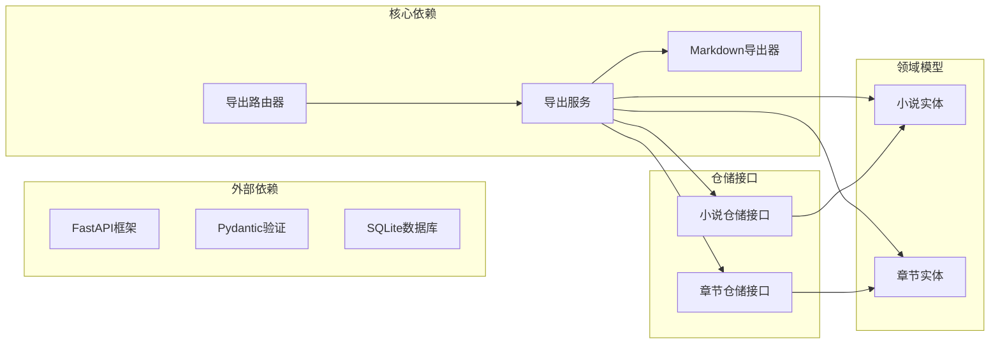
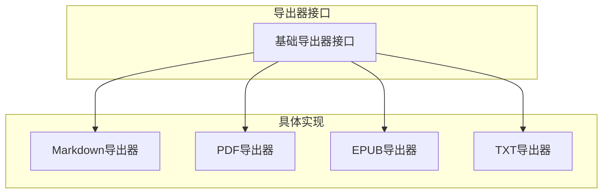

# 导出功能API

<cite>
**本文档引用的文件**
- [export.py](file://presentation/api/routers/export.py)
- [export_service.py](file://application/services/export_service.py)
- [request_dto.py](file://application/dto/request_dto.py)
- [response_dto.py](file://application/dto/response_dto.py)
- [markdown_exporter.py](file://infrastructure/file/markdown_exporter.py)
- [dependencies.py](file://presentation/api/dependencies.py)
- [app.py](file://presentation/api/app.py)
- [novel.py](file://domain/entities/novel.py)
- [chapter.py](file://domain/entities/chapter.py)
- [test_markdown_exporter.py](file://tests/unit/test_markdown_exporter.py)
</cite>

## 目录
1. [简介](#简介)
2. [项目结构](#项目结构)
3. [核心组件](#核心组件)
4. [架构概览](#架构概览)
5. [详细组件分析](#详细组件分析)
6. [依赖关系分析](#依赖关系分析)
7. [性能考虑](#性能考虑)
8. [故障排除指南](#故障排除指南)
9. [结论](#结论)

## 简介

本文件为InkTrace小说创作助手项目的导出功能API完整接口文档。该系统提供了小说内容的导出能力，当前版本支持Markdown格式导出，并具备扩展为其他格式的基础架构。文档详细说明了导出相关的接口规范、数据结构定义、错误处理机制以及最佳实践。

## 项目结构

导出功能采用分层架构设计，遵循Clean Architecture原则：



**图表来源**
- [export.py:1-103](file://presentation/api/routers/export.py#L1-L103)
- [export_service.py:1-70](file://application/services/export_service.py#L1-L70)
- [dependencies.py:1-178](file://presentation/api/dependencies.py#L1-L178)

**章节来源**
- [export.py:1-103](file://presentation/api/routers/export.py#L1-L103)
- [export_service.py:1-70](file://application/services/export_service.py#L1-L70)
- [dependencies.py:1-178](file://presentation/api/dependencies.py#L1-L178)

## 核心组件

### 导出API路由器

导出功能通过FastAPI路由提供RESTful接口，包含两个主要端点：

- `POST /export/` - 触发小说导出操作
- `GET /export/download/{file_path}` - 提供导出文件下载

### 导出服务

导出服务负责协调整个导出流程，包括：
- 验证小说存在性
- 检索相关章节
- 调用适当的导出器
- 生成导出响应

### 数据传输对象

系统使用Pydantic模型确保数据验证和序列化：

- `ExportNovelRequest` - 导出请求格式
- `ExportResponse` - 导出响应格式

**章节来源**
- [export.py:60-103](file://presentation/api/routers/export.py#L60-L103)
- [export_service.py:39-70](file://application/services/export_service.py#L39-L70)
- [request_dto.py:73-79](file://application/dto/request_dto.py#L73-L79)
- [response_dto.py:101-107](file://application/dto/response_dto.py#L101-L107)

## 架构概览

导出功能采用典型的三层架构模式：



**图表来源**
- [export.py:60-103](file://presentation/api/routers/export.py#L60-L103)
- [export_service.py:39-70](file://application/services/export_service.py#L39-L70)
- [markdown_exporter.py:62-100](file://infrastructure/file/markdown_exporter.py#L62-L100)

## 详细组件分析

### 导出请求格式 (ExportNovelRequest)

导出请求包含以下关键字段：

| 字段名 | 类型 | 必填 | 默认值 | 描述 |
|--------|------|------|--------|------|
| novel_id | string | 是 | - | 小说唯一标识符 |
| output_path | string | 是 | - | 输出文件完整路径 |
| format | string | 否 | "markdown" | 导出格式类型 |
| options | Dict[str, Any] | 否 | null | 导出选项配置 |

**请求示例**：
```json
{
  "novel_id": "novel-001",
  "output_path": "exports/修仙从逃出生天开始.md",
  "format": "markdown",
  "options": {
    "include_metadata": true,
    "include_chapter_numbers": true
  }
}
```

### 导出响应格式 (ExportResponse)

导出响应包含以下字段：

| 字段名 | 类型 | 描述 |
|--------|------|------|
| success | boolean | 操作是否成功 |
| message | string | 操作结果描述 |
| trace_id | string | 请求追踪标识 |
| file_path | string | 导出文件路径 |
| format | string | 导出格式类型 |
| word_count | integer | 总字数统计 |
| chapter_count | integer | 章节数量 |

**响应示例**：
```json
{
  "success": true,
  "message": "导出完成",
  "trace_id": "req-12345",
  "file_path": "exports/修仙从逃出生天开始.md",
  "format": "markdown",
  "word_count": 15000,
  "chapter_count": 15
}
```

### 文件下载机制

系统提供安全的文件下载功能：



**图表来源**
- [export.py:26-58](file://presentation/api/routers/export.py#L26-L58)

**章节来源**
- [request_dto.py:73-79](file://application/dto/request_dto.py#L73-L79)
- [response_dto.py:101-107](file://application/dto/response_dto.py#L101-L107)
- [export.py:83-103](file://presentation/api/routers/export.py#L83-L103)

### Markdown导出器实现

Markdown导出器负责具体的格式化输出：



**图表来源**
- [markdown_exporter.py:17-126](file://infrastructure/file/markdown_exporter.py#L17-L126)
- [novel.py:20-40](file://domain/entities/novel.py#L20-L40)
- [chapter.py:18-42](file://domain/entities/chapter.py#L18-L42)

**章节来源**
- [markdown_exporter.py:24-126](file://infrastructure/file/markdown_exporter.py#L24-L126)

### 错误处理机制

系统实现了多层次的错误处理：

1. **请求验证错误**：HTTP 400 Bad Request
2. **权限验证错误**：HTTP 403 Forbidden  
3. **资源不存在**：HTTP 404 Not Found
4. **业务逻辑错误**：HTTP 400 Bad Request
5. **系统内部错误**：HTTP 500 Internal Server Error

**章节来源**
- [export.py:26-58](file://presentation/api/routers/export.py#L26-L58)
- [export_service.py:51-53](file://application/services/export_service.py#L51-L53)

## 依赖关系分析

导出功能的依赖关系清晰且职责分离：



**图表来源**
- [export.py:15-18](file://presentation/api/routers/export.py#L15-L18)
- [export_service.py:13-37](file://application/services/export_service.py#L13-L37)
- [dependencies.py:14-29](file://presentation/api/dependencies.py#L14-L29)

**章节来源**
- [export_service.py:13-37](file://application/services/export_service.py#L13-L37)
- [dependencies.py:14-47](file://presentation/api/dependencies.py#L14-L47)

## 性能考虑

### 导出性能优化

1. **内存管理**：批量处理章节，避免一次性加载所有内容到内存
2. **文件I/O优化**：使用流式写入减少内存占用
3. **缓存策略**：利用装饰器缓存数据库连接
4. **并发处理**：可扩展为异步导出任务队列

### 扩展性设计

当前架构支持轻松添加新的导出格式：



## 故障排除指南

### 常见问题及解决方案

1. **导出失败 (HTTP 500)**
   - 检查数据库连接状态
   - 验证输出路径权限
   - 确认磁盘空间充足

2. **文件下载失败 (HTTP 404)**
   - 确认导出已完成
   - 检查文件路径是否正确
   - 验证exports目录权限

3. **权限错误 (HTTP 403)**
   - 检查文件路径是否包含非法字符
   - 确认路径不超出exports目录范围

### 调试建议

1. **启用详细日志**：在开发环境中增加日志级别
2. **单元测试覆盖**：运行测试套件验证功能完整性
3. **性能监控**：监控导出过程的内存和CPU使用情况

**章节来源**
- [export.py:26-58](file://presentation/api/routers/export.py#L26-L58)
- [test_markdown_exporter.py:1-154](file://tests/unit/test_markdown_exporter.py#L1-L154)

## 结论

InkTrace的导出功能API展现了良好的架构设计和实现质量。系统采用分层架构，职责明确，易于维护和扩展。当前版本专注于Markdown格式导出，但整体设计为未来支持更多格式奠定了坚实基础。

关键优势包括：
- 清晰的分层架构和依赖注入
- 完善的数据验证和错误处理
- 安全的文件下载机制
- 可扩展的导出器架构
- 全面的单元测试覆盖

建议的后续改进方向：
1. 添加更多导出格式支持
2. 实现异步导出任务队列
3. 增强导出进度报告
4. 添加批量导出功能
5. 实现导出模板自定义