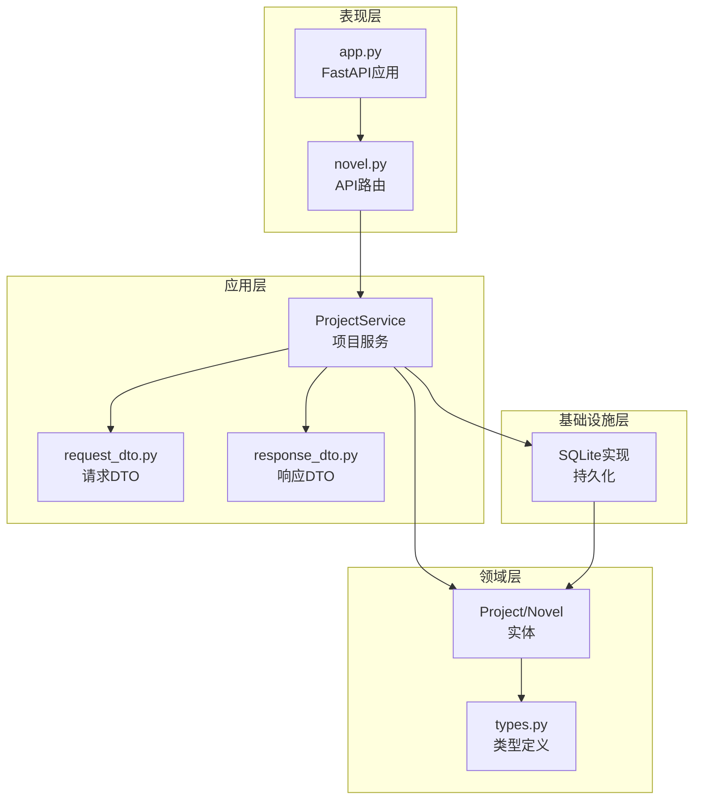
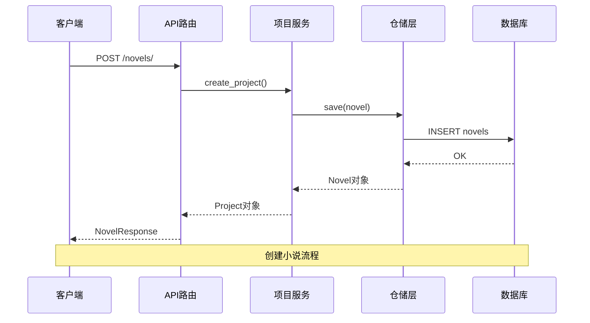
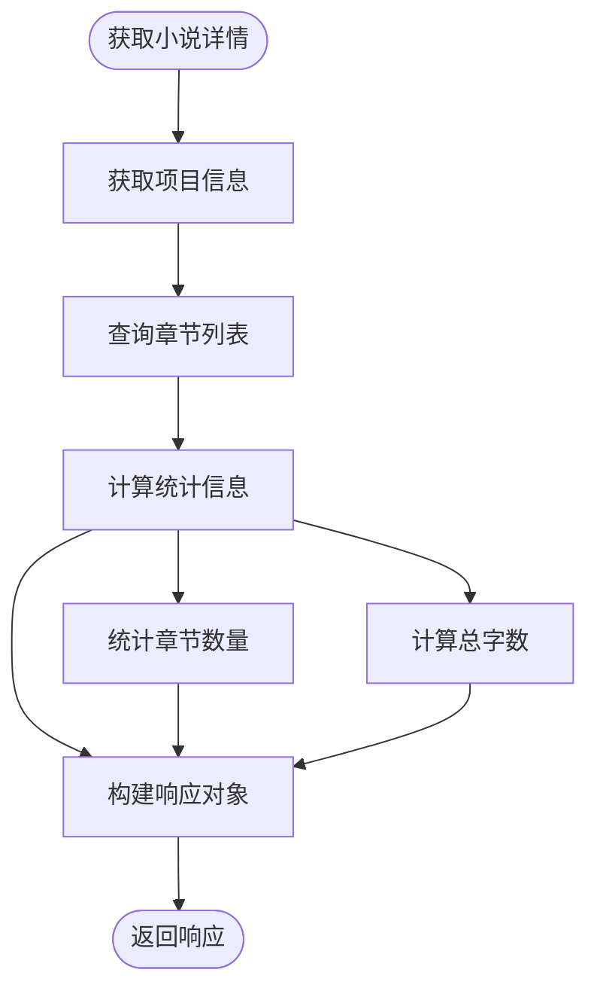
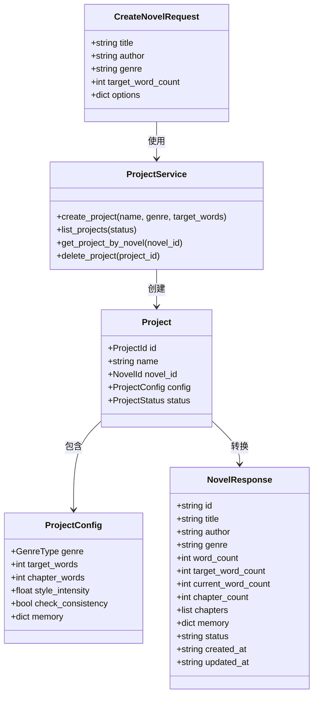
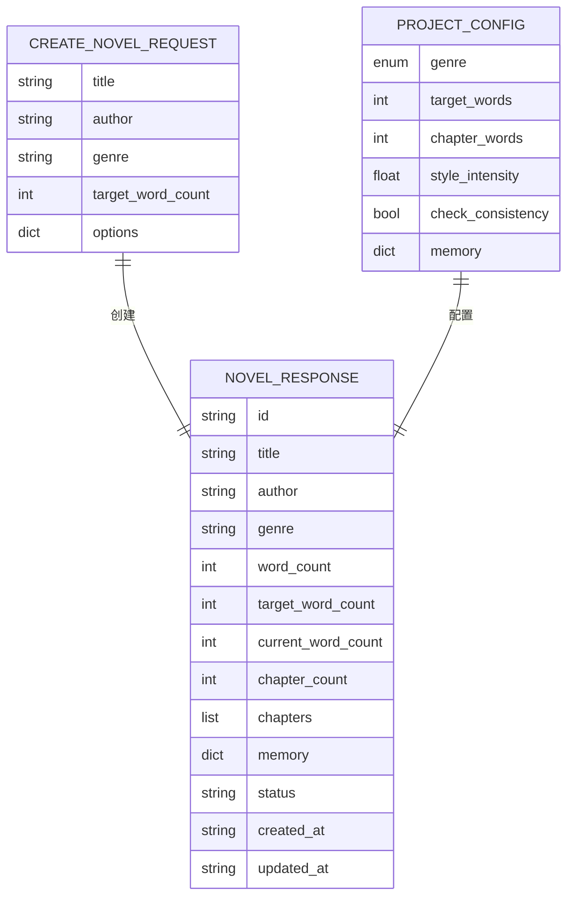

# 小说管理API

<cite>
**本文引用的文件**
- [novel.py](file://presentation/api/routers/novel.py)
- [project_service.py](file://application/services/project_service.py)
- [request_dto.py](file://application/dto/request_dto.py)
- [response_dto.py](file://application/dto/response_dto.py)
- [types.py](file://domain/types.py)
- [app.py](file://presentation/api/app.py)
- [sqlite_novel_repo.py](file://infrastructure/persistence/sqlite_novel_repo.py)
- [project.py](file://domain/entities/project.py)
- [novel_entity.py](file://domain/entities/novel.py)
- [index.js](file://frontend/src/api/index.js)
</cite>

## 目录
1. [简介](#简介)
2. [项目结构](#项目结构)
3. [核心组件](#核心组件)
4. [架构概览](#架构概览)
5. [详细组件分析](#详细组件分析)
6. [依赖关系分析](#依赖关系分析)
7. [性能考虑](#性能考虑)
8. [故障排除指南](#故障排除指南)
9. [结论](#结论)
10. [附录](#附录)

## 简介
本文件为小说管理API的详细接口文档，涵盖小说项目的CRUD操作接口，包括创建小说(create_novel)、列出小说(list_novels)、获取小说详情(get_novel)、删除小说(delete_novel)等核心接口。文档详细说明了每个接口的HTTP方法、URL路径、请求参数、响应格式和错误处理机制。同时提供了CreateNovelRequest请求DTO和NovelResponse响应DTO的字段定义与验证规则，并通过实际代码路径展示小说状态管理、章节统计和项目配置的API交互模式。

## 项目结构
小说管理API采用分层架构设计，主要分为以下层次：
- 表现层(Presentation Layer): FastAPI路由定义和API端点
- 应用层(Application Layer): 业务服务逻辑和DTO定义
- 领域层(Domain Layer): 实体、值对象和仓储接口
- 基础设施层(Infrastructure Layer): 数据持久化实现

**图表来源**
- [novel.py:1-162](file://presentation/api/routers/novel.py#L1-L162)
- [project_service.py:1-203](file://application/services/project_service.py#L1-L203)
- [request_dto.py:1-97](file://application/dto/request_dto.py#L1-L97)
- [response_dto.py:1-200](file://application/dto/response_dto.py#L1-L200)
- [types.py:1-284](file://domain/types.py#L1-L284)

**章节来源**
- [novel.py:1-162](file://presentation/api/routers/novel.py#L1-L162)
- [app.py:1-66](file://presentation/api/app.py#L1-L66)

## 核心组件
本系统的核心组件包括：

### API路由层
- novel.py: 定义小说管理相关的所有REST API端点
- 支持四种基本操作：POST创建、GET列表、GET详情、DELETE删除

### 业务服务层
- ProjectService: 实现项目管理的核心业务逻辑
- 负责小说项目与小说实体的关联管理
- 提供项目配置管理和状态控制功能

### 数据传输对象层
- CreateNovelRequest: 创建小说的请求DTO，包含验证规则
- NovelResponse: 小说详情的响应DTO，标准化输出格式

### 领域实体层
- Project: 项目实体，包含配置信息和状态管理
- Novel: 小说实体，管理章节、人物等聚合内容
- GenreType: 题材类型枚举，支持多种文学类型

**章节来源**
- [project_service.py:21-67](file://application/services/project_service.py#L21-L67)
- [request_dto.py:21-28](file://application/dto/request_dto.py#L21-L28)
- [response_dto.py:22-34](file://application/dto/response_dto.py#L22-L34)

## 架构概览
小说管理API采用经典的三层架构模式，通过依赖注入实现松耦合设计。

**图表来源**
- [novel.py:24-61](file://presentation/api/routers/novel.py#L24-L61)
- [project_service.py:32-67](file://application/services/project_service.py#L32-L67)
- [sqlite_novel_repo.py:54-72](file://infrastructure/persistence/sqlite_novel_repo.py#L54-L72)

## 详细组件分析

### CreateNovelRequest 请求DTO
CreateNovelRequest是创建小说的请求数据传输对象，包含以下字段和验证规则：

| 字段名 | 类型 | 必填 | 验证规则 | 描述 |
|--------|------|------|----------|------|
| user_id | string | 否 | 可选 | 用户标识符 |
| session_id | string | 否 | 可选 | 会话标识符 |
| trace_id | string | 否 | 可选 | 追踪标识符 |
| title | string | 是 | min_length=1, max_length=100 | 小说标题 |
| author | string | 是 | min_length=1, max_length=50 | 作者姓名 |
| genre | string | 是 | min_length=1 | 小说题材 |
| target_word_count | int | 是 | gt=0, le=1000000 | 目标字数 |
| options | dict | 否 | 可选 | 扩展选项 |

**章节来源**
- [request_dto.py:21-28](file://application/dto/request_dto.py#L21-L28)

### NovelResponse 响应DTO
NovelResponse是小说详情的标准响应格式，包含以下字段：

| 字段名 | 类型 | 默认值 | 描述 |
|--------|------|--------|------|
| success | boolean | true | 操作是否成功 |
| message | string | null | 操作消息 |
| trace_id | string | null | 追踪标识符 |
| id | string | - | 小说唯一标识符 |
| title | string | - | 小说标题 |
| author | string | "" | 作者姓名 |
| genre | string | - | 小说题材 |
| word_count | int | 0 | 总字数 |
| target_word_count | int | - | 目标字数 |
| current_word_count | int | 0 | 当前字数 |
| chapter_count | int | 0 | 章节数量 |
| chapters | array | null | 章节列表 |
| memory | dict | null | 记忆配置 |
| status | string | "draft" | 项目状态 |
| created_at | string | - | 创建时间(ISO格式) |
| updated_at | string | - | 更新时间(ISO格式) |

**章节来源**
- [response_dto.py:22-34](file://application/dto/response_dto.py#L22-L34)

### API接口规范

#### 创建小说 (create_novel)
- **HTTP方法**: POST
- **URL路径**: `/novels/`
- **请求体**: CreateNovelRequest
- **响应体**: NovelResponse
- **功能描述**: 创建新的小说项目，初始化小说实体和项目配置

**请求示例路径**:
- [请求示例](file://frontend/src/api/index.js#L46)

**响应示例路径**:
- [响应示例:47-61](file://presentation/api/routers/novel.py#L47-L61)

**错误处理**:
- 400: 请求参数验证失败
- 500: 服务器内部错误

**章节来源**
- [novel.py:24-61](file://presentation/api/routers/novel.py#L24-L61)
- [project_service.py:32-67](file://application/services/project_service.py#L32-L67)

#### 列出小说 (list_novels)
- **HTTP方法**: GET
- **URL路径**: `/novels/`
- **响应体**: List[NovelResponse]
- **功能描述**: 获取所有小说项目的列表，包含章节统计信息

**请求示例路径**:
- [请求示例](file://frontend/src/api/index.js#L44)

**响应示例路径**:
- [响应示例:82-85](file://presentation/api/routers/novel.py#L82-L85)

**错误处理**:
- 500: 数据库查询失败

**章节来源**
- [novel.py:64-85](file://presentation/api/routers/novel.py#L64-L85)

#### 获取小说详情 (get_novel)
- **HTTP方法**: GET
- **URL路径**: `/novels/{novel_id}`
- **路径参数**: novel_id (string)
- **响应体**: NovelResponse
- **功能描述**: 根据小说ID获取详细信息，包含章节列表和统计信息

**请求示例路径**:
- [请求示例](file://frontend/src/api/index.js#L45)

**响应示例路径**:
- [响应示例:106-110](file://presentation/api/routers/novel.py#L106-L110)

**错误处理**:
- 404: 小说不存在
- 500: 数据库查询失败

**章节来源**
- [novel.py:88-110](file://presentation/api/routers/novel.py#L88-L110)

#### 删除小说 (delete_novel)
- **HTTP方法**: DELETE
- **URL路径**: `/novels/{novel_id}`
- **路径参数**: novel_id (string)
- **响应体**: JSON对象
- **功能描述**: 删除指定的小说项目及其关联数据

**请求示例路径**:
- [请求示例](file://frontend/src/api/index.js#L47)

**响应示例路径**:
- [响应示例:131-132](file://presentation/api/routers/novel.py#L131-L132)

**错误处理**:
- 404: 小说不存在
- 500: 删除失败

**章节来源**
- [novel.py:113-132](file://presentation/api/routers/novel.py#L113-L132)

### 状态管理与章节统计

#### 小说状态管理
系统支持多种项目状态：
- draft: 草稿状态
- active: 激活状态  
- archived: 归档状态

状态转换通过Project实体的方法实现，确保状态变更的原子性和一致性。

#### 章节统计逻辑
章节统计通过_project_to_novel_response函数实现：
1. 查询小说关联的所有章节
2. 计算章节总数和总字数
3. 统计当前字数(current_word_count)
4. 生成章节列表(chapters)

**图表来源**
- [novel.py:135-161](file://presentation/api/routers/novel.py#L135-L161)

**章节来源**
- [novel.py:135-161](file://presentation/api/routers/novel.py#L135-L161)
- [project_service.py:79-81](file://application/services/project_service.py#L79-L81)

### 项目配置管理

#### GenreType 枚举
支持的题材类型包括：
- xuanhuan: 仙侠
- xianxia: 修仙
- dushi: 都市
- lishi: 历史
- kehuan: 科幻
- wuxia: 武侠
- qihuan: 奇幻
- other: 其他

#### ProjectConfig 配置
项目配置包含以下关键参数：
- genre: 小说题材类型
- target_words: 目标字数
- chapter_words: 章节目标字数(默认2100)
- style_intensity: 文风强度(默认0.8)
- check_consistency: 是否检查一致性(默认true)
- memory: 记忆配置(字典形式)

**章节来源**
- [types.py:251-261](file://domain/types.py#L251-L261)
- [project.py:18-46](file://domain/entities/project.py#L18-L46)

## 依赖关系分析

**图表来源**
- [request_dto.py:21-28](file://application/dto/request_dto.py#L21-L28)
- [response_dto.py:22-34](file://application/dto/response_dto.py#L22-L34)
- [project_service.py:32-67](file://application/services/project_service.py#L32-L67)
- [project.py:49-112](file://domain/entities/project.py#L49-L112)

**章节来源**
- [project_service.py:21-31](file://application/services/project_service.py#L21-L31)
- [types.py:14-18](file://domain/types.py#L14-L18)

## 性能考虑
1. **数据库优化**: 使用SQLite进行本地存储，适合中小规模项目
2. **缓存策略**: 可在章节仓库中添加缓存机制以提升查询性能
3. **批量操作**: 列表查询使用单次数据库扫描，避免多次往返
4. **内存管理**: 项目配置通过字典存储，便于序列化和传输
5. **并发处理**: FastAPI基于异步IO，支持高并发请求处理

## 故障排除指南

### 常见错误及解决方案

#### 404 错误
**现象**: 小说不存在
**原因**: 小说ID无效或已被删除
**解决方案**: 
- 验证小说ID格式
- 检查数据库中是否存在该记录
- 确认用户权限

#### 400 错误
**现象**: 请求参数验证失败
**原因**: CreateNovelRequest中的字段不符合验证规则
**解决方案**:
- 检查title长度(1-100字符)
- 确认target_word_count范围(1-1000000)
- 验证genre字段非空

#### 500 错误
**现象**: 服务器内部错误
**原因**: 数据库操作失败或业务逻辑异常
**解决方案**:
- 检查数据库连接状态
- 查看服务器日志
- 验证依赖服务可用性

**章节来源**
- [novel.py:107-108](file://presentation/api/routers/novel.py#L107-L108)
- [novel.py:127-129](file://presentation/api/routers/novel.py#L127-L129)

## 结论
小说管理API提供了完整的小说项目生命周期管理能力，包括创建、查询、更新和删除操作。通过清晰的分层架构设计和严格的DTO验证机制，确保了系统的可维护性和扩展性。系统支持多种题材类型和灵活的项目配置，能够满足不同类型的写作需求。建议在未来版本中增加更多的状态管理和监控功能，以进一步提升用户体验。

## 附录

### API端点对照表

| 方法 | 路径 | 功能 | 响应类型 |
|------|------|------|----------|
| POST | /novels/ | 创建小说 | NovelResponse |
| GET | /novels/ | 列出小说 | List[NovelResponse] |
| GET | /novels/{novel_id} | 获取小说详情 | NovelResponse |
| DELETE | /novels/{novel_id} | 删除小说 | JSON对象 |

### 数据模型关系图

**图表来源**
- [request_dto.py:21-28](file://application/dto/request_dto.py#L21-L28)
- [response_dto.py:22-34](file://application/dto/response_dto.py#L22-L34)
- [project.py:18-46](file://domain/entities/project.py#L18-L46)