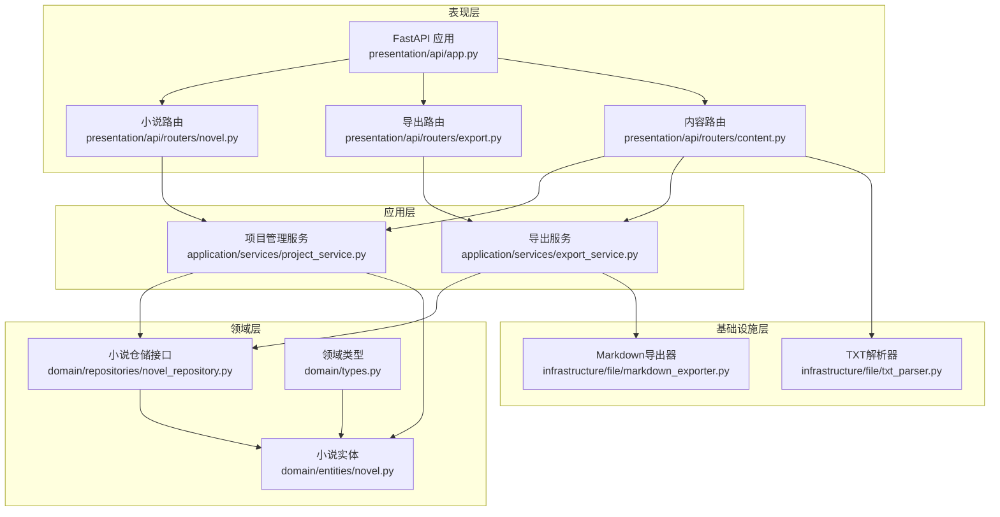
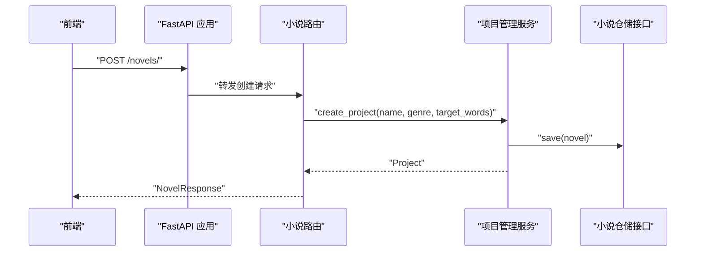
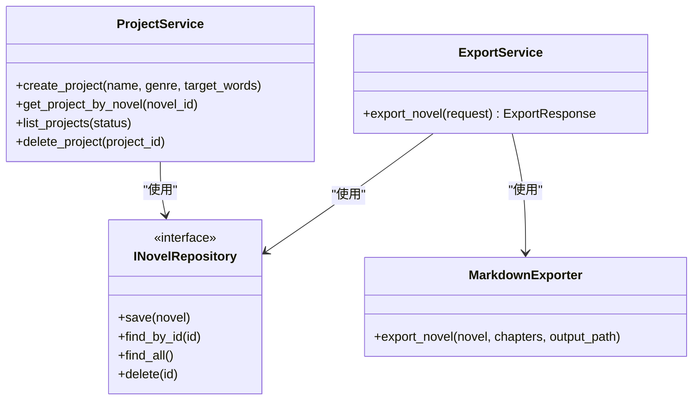

# 小说管理API

<cite>
**本文引用的文件**
- [presentation/api/routers/novel.py](file://presentation/api/routers/novel.py)
- [presentation/api/routers/export.py](file://presentation/api/routers/export.py)
- [presentation/api/routers/content.py](file://presentation/api/routers/content.py)
- [application/services/project_service.py](file://application/services/project_service.py)
- [application/services/export_service.py](file://application/services/export_service.py)
- [application/dto/request_dto.py](file://application/dto/request_dto.py)
- [application/dto/response_dto.py](file://application/dto/response_dto.py)
- [domain/entities/novel.py](file://domain/entities/novel.py)
- [domain/repositories/novel_repository.py](file://domain/repositories/novel_repository.py)
- [domain/types.py](file://domain/types.py)
- [infrastructure/file/markdown_exporter.py](file://infrastructure/file/markdown_exporter.py)
- [infrastructure/file/txt_parser.py](file://infrastructure/file/txt_parser.py)
- [presentation/api/app.py](file://presentation/api/app.py)
- [frontend/src/views/novel/NovelImport.vue](file://frontend/src/views/novel/NovelImport.vue)
- [frontend/src/api/index.js](file://frontend/src/api/index.js)
</cite>

## 目录
1. [简介](#简介)
2. [项目结构](#项目结构)
3. [核心组件](#核心组件)
4. [架构总览](#架构总览)
5. [详细组件分析](#详细组件分析)
6. [依赖分析](#依赖分析)
7. [性能考虑](#性能考虑)
8. [故障排查指南](#故障排查指南)
9. [结论](#结论)
10. [附录](#附录)

## 简介
本文件为“小说管理API”的权威接口文档，覆盖小说的CRUD操作、导入与导出能力，以及相关实体与数据结构说明。文档面向开发者与测试人员，提供HTTP方法、URL路径、请求参数、响应格式、请求/响应示例与错误处理机制，并给出最佳实践与常见问题解决方案。

## 项目结构
- 后端采用FastAPI框架，路由按功能模块划分：
  - 小说管理路由：/novels
  - 导出路由：/export
  - 内容导入路由：/api/content
- 应用层服务负责业务编排：
  - 项目管理服务：负责创建/查询/删除小说项目及绑定记忆体
  - 导出服务：负责小说与章节的导出
- 领域层实体与仓储：
  - 小说实体、仓储接口、领域类型（ID、枚举）
- 基础设施层：
  - Markdown导出器、TXT解析器
- 前端：
  - 小说导入页面与API封装

图表来源
- [presentation/api/app.py:19-62](file://presentation/api/app.py#L19-L62)
- [presentation/api/routers/novel.py:21](file://presentation/api/routers/novel.py#L21)
- [presentation/api/routers/export.py:21](file://presentation/api/routers/export.py#L21)
- [presentation/api/routers/content.py:22](file://presentation/api/routers/content.py#L22)
- [application/services/project_service.py:21-67](file://application/services/project_service.py#L21-L67)
- [application/services/export_service.py:23-69](file://application/services/export_service.py#L23-L69)
- [domain/entities/novel.py:20-178](file://domain/entities/novel.py#L20-L178)
- [domain/repositories/novel_repository.py:17-70](file://domain/repositories/novel_repository.py#L17-L70)
- [domain/types.py:15-284](file://domain/types.py#L15-L284)
- [infrastructure/file/markdown_exporter.py:17-126](file://infrastructure/file/markdown_exporter.py#L17-L126)
- [infrastructure/file/txt_parser.py:25-316](file://infrastructure/file/txt_parser.py#L25-L316)

章节来源
- [presentation/api/app.py:19-62](file://presentation/api/app.py#L19-L62)

## 核心组件
- 小说管理路由：提供创建、列出、查询、删除小说的REST接口
- 导出路由：提供小说导出与文件下载接口
- 内容导入路由：提供小说文件导入、文风/剧情分析、故事结构整理接口
- 项目管理服务：封装小说项目生命周期管理
- 导出服务：封装小说与章节导出逻辑
- DTO：统一请求/响应数据结构
- 实体与仓储：小说聚合根与仓储接口
- 基础设施：Markdown导出器、TXT解析器

章节来源
- [presentation/api/routers/novel.py:21-162](file://presentation/api/routers/novel.py#L21-L162)
- [presentation/api/routers/export.py:21-103](file://presentation/api/routers/export.py#L21-L103)
- [presentation/api/routers/content.py:22-196](file://presentation/api/routers/content.py#L22-L196)
- [application/services/project_service.py:21-203](file://application/services/project_service.py#L21-L203)
- [application/services/export_service.py:23-70](file://application/services/export_service.py#L23-L70)
- [application/dto/request_dto.py:14-97](file://application/dto/request_dto.py#L14-L97)
- [application/dto/response_dto.py:15-200](file://application/dto/response_dto.py#L15-L200)
- [domain/entities/novel.py:20-178](file://domain/entities/novel.py#L20-L178)
- [domain/repositories/novel_repository.py:17-70](file://domain/repositories/novel_repository.py#L17-L70)
- [domain/types.py:15-284](file://domain/types.py#L15-L284)
- [infrastructure/file/markdown_exporter.py:17-126](file://infrastructure/file/markdown_exporter.py#L17-L126)
- [infrastructure/file/txt_parser.py:25-316](file://infrastructure/file/txt_parser.py#L25-L316)

## 架构总览
- 控制器层：各路由模块接收请求，调用应用服务
- 应用服务层：封装业务规则，协调仓储与基础设施
- 领域层：实体与值对象承载业务语义
- 基础设施层：文件导出与文本解析
- 前端：通过封装的API调用后端接口

图表来源
- [presentation/api/routers/novel.py:24-61](file://presentation/api/routers/novel.py#L24-L61)
- [application/services/project_service.py:32-67](file://application/services/project_service.py#L32-L67)
- [domain/repositories/novel_repository.py:20-30](file://domain/repositories/novel_repository.py#L20-L30)

## 详细组件分析

### 小说管理API

- 基础路径：/novels
- 认证与鉴权：默认未启用，具体以部署配置为准

1) 创建小说
- 方法：POST
- 路径：/novels/
- 请求体：CreateNovelRequest
  - 字段：title, author, genre, target_word_count, options
  - 校验：长度、数值范围
- 成功响应：NovelResponse
- 错误码：400（参数校验失败）、500（内部异常）

2) 列出小说
- 方法：GET
- 路径：/novels/
- 查询参数：无
- 成功响应：NovelResponse数组
- 错误码：500（内部异常）

3) 获取小说详情
- 方法：GET
- 路径：/novels/{novel_id}
- 路径参数：novel_id（字符串）
- 成功响应：NovelResponse
- 错误码：404（小说不存在）、500（内部异常）

4) 删除小说
- 方法：DELETE
- 路径：/novels/{novel_id}
- 路径参数：novel_id（字符串）
- 成功响应：{"message": "删除成功"}
- 错误码：404（小说不存在）、500（内部异常）

请求示例（创建小说）
- 方法：POST
- 路径：/novels/
- 请求头：Content-Type: application/json
- 请求体：
  - title: "我的仙路"
  - author: "作者名"
  - genre: "玄幻"
  - target_word_count: 800000

响应示例（创建小说）
- 响应体：
  - id: "uuid字符串"
  - title: "我的仙路"
  - author: ""
  - genre: "玄幻"
  - target_word_count: 800000
  - current_word_count: 0
  - chapter_count: 0
  - status: "draft"
  - created_at: "ISO时间字符串"
  - updated_at: "ISO时间字符串"

章节来源
- [presentation/api/routers/novel.py:24-133](file://presentation/api/routers/novel.py#L24-L133)
- [application/dto/request_dto.py:21-28](file://application/dto/request_dto.py#L21-L28)
- [application/dto/response_dto.py:22-34](file://application/dto/response_dto.py#L22-L34)
- [application/services/project_service.py:32-67](file://application/services/project_service.py#L32-L67)

### 小说导入API

- 基础路径：/api/content
- 导入流程：前端先创建小说，再调用导入接口解析TXT并整理结构

1) 导入小说
- 方法：POST
- 路径：/api/content/import
- 请求体：ImportNovelRequest
  - novel_id: 小说ID
  - file_path: 小说文件路径
  - options: 可选参数
- 成功响应：包含novel、project_id、memory、analysis_status的对象
- 错误码：400（文件不存在/解析失败）、404（小说不存在）

2) 文风分析
- 方法：GET
- 路径：/api/content/style/{novel_id}
- 成功响应：StyleAnalysisResponse
- 错误码：404（小说不存在）

3) 剧情分析
- 方法：GET
- 路径：/api/content/plot/{novel_id}
- 成功响应：PlotAnalysisResponse
- 错误码：404（小说不存在）

4) 获取记忆体
- 方法：GET
- 路径：/api/content/memory/{novel_id}
- 成功响应：包含project_id与memory的对象
- 错误码：404（小说不存在）

5) 整理故事结构
- 方法：POST
- 路径：/api/content/organize/{novel_id}
- 成功响应：包含status、project_id与memory的对象
- 错误码：400/404/500（根据内部异常类型）

前端调用示意
- 先调用novelApi.create创建小说，得到novel.id
- 再调用contentApi.import传入novel_id与file_path
- 成功后可进行文风/剧情分析与续写

章节来源
- [presentation/api/routers/content.py:70-107](file://presentation/api/routers/content.py#L70-L107)
- [presentation/api/routers/content.py:109-153](file://presentation/api/routers/content.py#L109-L153)
- [presentation/api/routers/content.py:155-167](file://presentation/api/routers/content.py#L155-L167)
- [presentation/api/routers/content.py:170-196](file://presentation/api/routers/content.py#L170-L196)
- [application/dto/request_dto.py:30-35](file://application/dto/request_dto.py#L30-L35)
- [application/dto/response_dto.py:61-84](file://application/dto/response_dto.py#L61-L84)
- [application/dto/response_dto.py:72-84](file://application/dto/response_dto.py#L72-L84)
- [frontend/src/views/novel/NovelImport.vue:128-178](file://frontend/src/views/novel/NovelImport.vue#L128-L178)
- [frontend/src/api/index.js:43-56](file://frontend/src/api/index.js#L43-L56)

### 小说导出API

- 基础路径：/export
- 当前支持格式：markdown

1) 导出小说
- 方法：POST
- 路径：/export/
- 请求体：ExportNovelRequest
  - novel_id: 小说ID
  - output_path: 输出文件路径（相对exports目录）
  - format: 导出格式，默认markdown
  - options: 可选参数
- 成功响应：ExportResponse
  - file_path: 输出文件路径
  - format: 导出格式
  - word_count: 总字数
  - chapter_count: 章节数
- 错误码：400（无效/不支持格式）、404（文件不存在）

2) 下载导出文件
- 方法：GET
- 路径：/export/download/{file_path}
- 路径参数：file_path（相对exports目录的路径）
- 成功响应：文件流
- 安全校验：路径合法性、存在性、文件类型限制

前端调用示意
- 调用exportApi.export提交导出请求
- 使用exportApi.download拼接下载链接

章节来源
- [presentation/api/routers/export.py:60-103](file://presentation/api/routers/export.py#L60-L103)
- [application/dto/request_dto.py:73-79](file://application/dto/request_dto.py#L73-L79)
- [application/dto/response_dto.py:101-107](file://application/dto/response_dto.py#L101-L107)
- [application/services/export_service.py:39-70](file://application/services/export_service.py#L39-L70)
- [infrastructure/file/markdown_exporter.py:62-100](file://infrastructure/file/markdown_exporter.py#L62-L100)
- [frontend/src/api/index.js:64-67](file://frontend/src/api/index.js#L64-L67)

### 数据模型与字段定义

- 小说实体（部分关键字段）
  - id: NovelId
  - title: 标题
  - author: 作者
  - genre: 题材
  - target_word_count: 目标字数
  - current_word_count: 当前字数
  - created_at/updated_at: 时间戳
  - chapters: 章节列表
  - characters: 人物列表
  - outline: 大纲（可选）

- 小说响应（部分关键字段）
  - id: 字符串
  - title: 标题
  - author: 作者
  - genre: 题材
  - target_word_count: 目标字数
  - current_word_count: 当前字数
  - chapter_count: 章节数
  - status: 状态
  - created_at/updated_at: ISO时间字符串
  - chapters: 章节数组（可选）

- 导出响应（部分关键字段）
  - file_path: 输出文件路径
  - format: 导出格式
  - word_count: 总字数
  - chapter_count: 章节数

章节来源
- [domain/entities/novel.py:20-178](file://domain/entities/novel.py#L20-L178)
- [application/dto/response_dto.py:22-34](file://application/dto/response_dto.py#L22-L34)
- [application/dto/response_dto.py:101-107](file://application/dto/response_dto.py#L101-L107)

## 依赖分析

图表来源
- [application/services/project_service.py:21-203](file://application/services/project_service.py#L21-L203)
- [application/services/export_service.py:23-70](file://application/services/export_service.py#L23-L70)
- [domain/repositories/novel_repository.py:17-70](file://domain/repositories/novel_repository.py#L17-L70)
- [infrastructure/file/markdown_exporter.py:17-126](file://infrastructure/file/markdown_exporter.py#L17-L126)

章节来源
- [application/services/project_service.py:21-203](file://application/services/project_service.py#L21-L203)
- [application/services/export_service.py:23-70](file://application/services/export_service.py#L23-L70)
- [domain/repositories/novel_repository.py:17-70](file://domain/repositories/novel_repository.py#L17-L70)
- [infrastructure/file/markdown_exporter.py:17-126](file://infrastructure/file/markdown_exporter.py#L17-L126)

## 性能考虑
- 导出流程涉及磁盘IO与文件写入，建议：
  - 在高并发场景下对输出路径进行幂等与去重
  - 对大文件导出增加进度上报与超时控制
- 导入流程包含文件解析与LLM分析，建议：
  - 对TXT解析设置最大内存与超时阈值
  - 对LLM分析结果进行缓存与增量更新
- 建议在生产环境开启GZip压缩与限流策略

## 故障排查指南
- 创建小说返回400
  - 检查请求体字段长度与数值范围
  - 参考请求DTO字段约束
- 获取小说返回404
  - 确认novel_id是否存在
  - 检查数据库中是否存在对应记录
- 导出返回400/404
  - 确认format是否为支持格式（当前仅markdown）
  - 确认output_path位于exports目录且路径合法
- 导入返回400/404
  - 确认file_path指向有效文件
  - 确认TXT文件符合章节标题识别规则
- 下载文件提示路径不安全
  - 确认file_path不包含路径穿越字符
  - 确认文件存在于exports目录内

章节来源
- [presentation/api/routers/novel.py:107-109](file://presentation/api/routers/novel.py#L107-L109)
- [presentation/api/routers/export.py:26-58](file://presentation/api/routers/export.py#L26-L58)
- [presentation/api/routers/export.py:77-81](file://presentation/api/routers/export.py#L77-L81)
- [presentation/api/routers/content.py:103-107](file://presentation/api/routers/content.py#L103-L107)
- [infrastructure/file/txt_parser.py:34-66](file://infrastructure/file/txt_parser.py#L34-L66)

## 结论
本API围绕小说的创建、查询、删除与导入、导出提供了完整的REST接口，配合项目管理服务与导出服务，实现了从文本导入到结构整理再到多格式导出的闭环。建议在生产环境中加强安全校验、错误处理与性能优化，确保稳定可用。

## 附录

### API一览表

- 小说管理
  - POST /novels/：创建小说
  - GET /novels/：列出小说
  - GET /novels/{novel_id}：获取小说详情
  - DELETE /novels/{novel_id}：删除小说

- 内容导入与分析
  - POST /api/content/import：导入小说
  - GET /api/content/style/{novel_id}：文风分析
  - GET /api/content/plot/{novel_id}：剧情分析
  - GET /api/content/memory/{novel_id}：获取记忆体
  - POST /api/content/organize/{novel_id}：整理故事结构

- 导出
  - POST /export/：导出小说
  - GET /export/download/{file_path}：下载导出文件

章节来源
- [presentation/api/routers/novel.py:24-133](file://presentation/api/routers/novel.py#L24-L133)
- [presentation/api/routers/content.py:70-196](file://presentation/api/routers/content.py#L70-L196)
- [presentation/api/routers/export.py:60-103](file://presentation/api/routers/export.py#L60-L103)