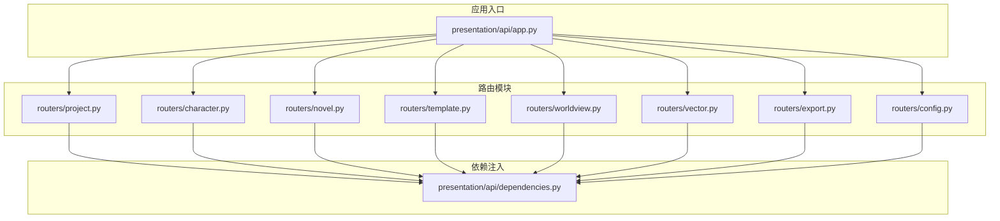
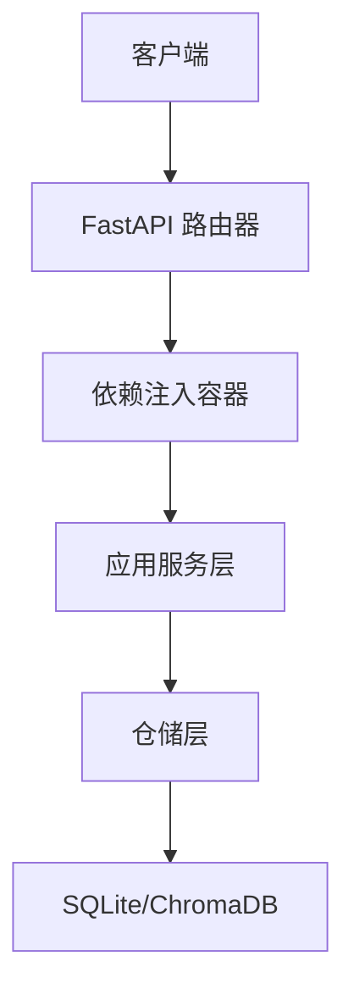
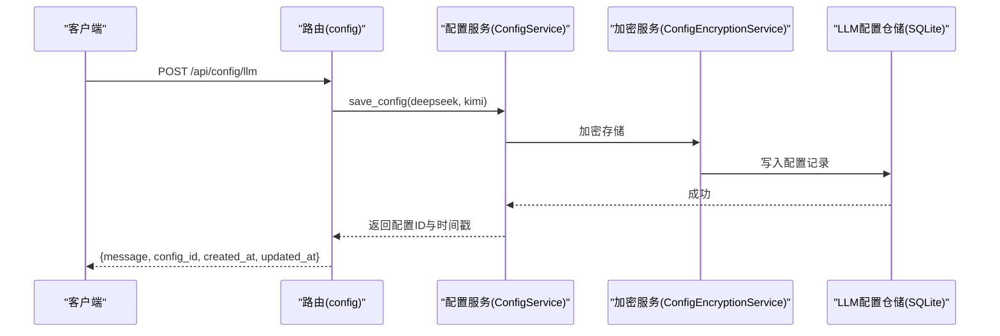
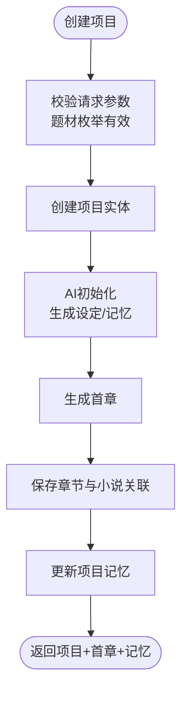
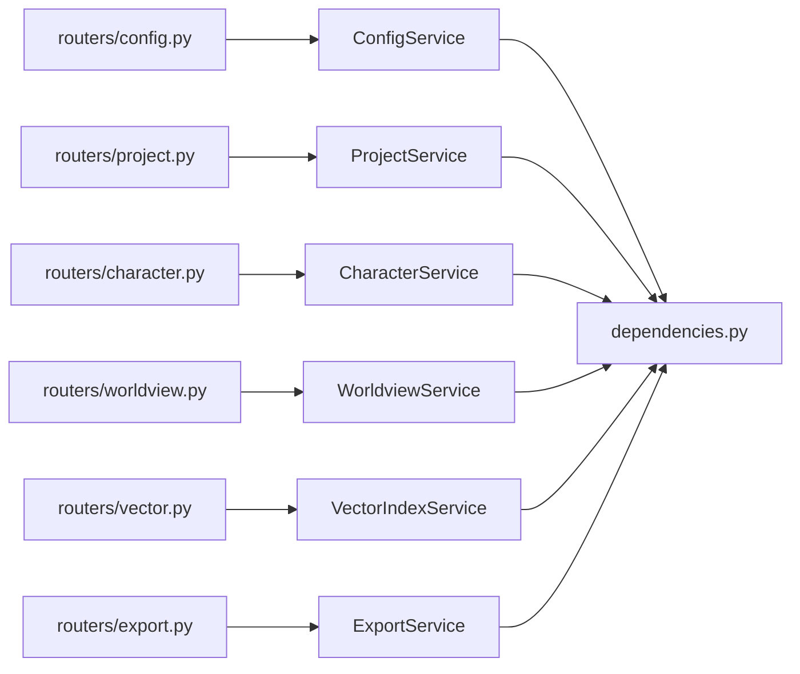

# 系统管理API

<cite>
**本文引用的文件**
- [presentation/api/app.py](file://presentation/api/app.py)
- [presentation/api/dependencies.py](file://presentation/api/dependencies.py)
- [presentation/api/routers/config.py](file://presentation/api/routers/config.py)
- [presentation/api/routers/project.py](file://presentation/api/routers/project.py)
- [presentation/api/routers/character.py](file://presentation/api/routers/character.py)
- [presentation/api/routers/novel.py](file://presentation/api/routers/novel.py)
- [presentation/api/routers/vector.py](file://presentation/api/routers/vector.py)
- [presentation/api/routers/template.py](file://presentation/api/routers/template.py)
- [presentation/api/routers/worldview.py](file://presentation/api/routers/worldview.py)
- [presentation/api/routers/export.py](file://presentation/api/routers/export.py)
- [application/dto/request_dto.py](file://application/dto/request_dto.py)
- [application/dto/response_dto.py](file://application/dto/response_dto.py)
- [domain/entities/project.py](file://domain/entities/project.py)
- [domain/entities/llm_config.py](file://domain/entities/llm_config.py)
- [domain/types.py](file://domain/types.py)
</cite>

## 目录
1. [简介](#简介)
2. [项目结构](#项目结构)
3. [核心组件](#核心组件)
4. [架构总览](#架构总览)
5. [详细组件分析](#详细组件分析)
6. [依赖分析](#依赖分析)
7. [性能考虑](#性能考虑)
8. [故障排除指南](#故障排除指南)
9. [结论](#结论)
10. [附录](#附录)

## 简介
本文件为 InkTrace 小说AI写作助手的系统管理API文档，覆盖配置管理、项目管理、人物与世界观管理、模板与导出、向量索引等管理功能。文档逐项列出端点、请求/响应模型、权限与错误处理，并对配置项的作用与影响范围进行说明，同时提供系统监控、日志查询、备份与恢复的建议方案。

## 项目结构
后端采用 FastAPI 应用，按功能模块划分路由，统一在应用入口注册；依赖通过依赖注入模块集中提供，确保仓储与服务层解耦。

**图表来源**
- [presentation/api/app.py:19-66](file://presentation/api/app.py#L19-L66)
- [presentation/api/dependencies.py:122-178](file://presentation/api/dependencies.py#L122-L178)

**章节来源**
- [presentation/api/app.py:19-66](file://presentation/api/app.py#L19-L66)
- [presentation/api/dependencies.py:11-178](file://presentation/api/dependencies.py#L11-L178)

## 核心组件
- 应用入口与路由注册：负责创建FastAPI实例、CORS配置、路由挂载与健康检查端点。
- 依赖注入：集中提供仓储、工厂与服务实例，支持缓存与环境变量配置。
- DTO：统一请求/响应模型，便于前后端契约一致与参数校验。
- 领域模型：项目、LLM配置、类型枚举等，定义业务规则与状态转换。

**章节来源**
- [presentation/api/app.py:19-66](file://presentation/api/app.py#L19-L66)
- [presentation/api/dependencies.py:45-178](file://presentation/api/dependencies.py#L45-L178)
- [application/dto/request_dto.py:14-97](file://application/dto/request_dto.py#L14-L97)
- [application/dto/response_dto.py:15-200](file://application/dto/response_dto.py#L15-L200)
- [domain/entities/project.py:17-112](file://domain/entities/project.py#L17-L112)
- [domain/entities/llm_config.py:15-54](file://domain/entities/llm_config.py#L15-L54)
- [domain/types.py:15-284](file://domain/types.py#L15-L284)

## 架构总览
系统采用分层架构：表现层（FastAPI路由）通过依赖注入调用应用层服务，服务层操作仓储与领域模型，完成业务逻辑与数据持久化。

**图表来源**
- [presentation/api/app.py:35-52](file://presentation/api/app.py#L35-L52)
- [presentation/api/dependencies.py:122-178](file://presentation/api/dependencies.py#L122-L178)

## 详细组件分析

### 配置管理API
- 端点概览
  - GET /api/config/llm：获取LLM配置（含存在标记与时间戳）
  - POST /api/config/llm：更新LLM配置（需验证）
  - POST /api/config/llm/test：测试LLM配置连通性
  - DELETE /api/config/llm：删除LLM配置
  - GET /api/config/llm/exists：检查配置是否存在

- 请求/响应模型
  - LLM配置请求：包含深思API Key与Kimi API Key
  - LLM配置响应：返回解密后的密钥占位、创建/更新时间、是否存在标记
  - 测试请求：同上
  - 测试响应：分别返回两个平台的测试结果字典

- 权限与安全
  - 当前路由未显式声明鉴权装饰器；生产环境建议增加鉴权中间件或依赖校验。
  - 加密密钥在路由中硬编码，生产环境应从安全位置读取。

- 错误处理
  - 参数校验失败返回400
  - 解密失败或内部异常返回500
  - 路由内捕获异常并统一HTTP异常抛出

- 配置项作用与影响范围
  - deepseek_api_key/kimi_api_key：用于外部大模型服务调用，直接影响续写、生成等能力可用性
  - 存在性检查：用于前端引导配置流程与功能开关

**图表来源**
- [presentation/api/routers/config.py:102-124](file://presentation/api/routers/config.py#L102-L124)
- [domain/entities/llm_config.py:15-54](file://domain/entities/llm_config.py#L15-L54)

**章节来源**
- [presentation/api/routers/config.py:67-173](file://presentation/api/routers/config.py#L67-L173)
- [domain/entities/llm_config.py:15-54](file://domain/entities/llm_config.py#L15-L54)

### 项目管理API
- 端点概览
  - POST /api/projects：创建项目（含AI初始化与首章生成）
  - GET /api/projects：列出项目（可按状态过滤）
  - GET /api/projects/{project_id}：获取项目详情
  - PUT /api/projects/{project_id}：更新项目配置与名称
  - POST /api/projects/{project_id}/archive：归档项目
  - POST /api/projects/{project_id}/activate：激活项目
  - DELETE /api/projects/{project_id}：删除项目

- 请求/响应模型
  - 创建请求：名称、题材、目标字数、风格、主角设定、可选世界观
  - 更新请求：名称、题材、目标字数、单章字数、风格强度（可选）
  - 响应：项目ID、名称、小说ID、题材、目标/当前字数、章节字数、风格强度、状态、时间戳

- 权限与安全
  - 当前路由未显式声明鉴权装饰器；建议在生产环境增加鉴权与角色控制。

- 错误处理
  - 无效枚举值返回400
  - 项目不存在返回404
  - 初始化/生成失败返回500

- 项目配置项的作用与影响范围
  - genre：题材类型，影响生成风格与模板选择
  - target_words：总目标字数，驱动生成进度与章节目标
  - chapter_words：单章目标字数，影响续写长度
  - style_intensity：风格强度系数，影响文风一致性与生成策略

**图表来源**
- [presentation/api/routers/project.py:91-182](file://presentation/api/routers/project.py#L91-L182)
- [domain/entities/project.py:17-112](file://domain/entities/project.py#L17-L112)

**章节来源**
- [presentation/api/routers/project.py:29-290](file://presentation/api/routers/project.py#L29-L290)
- [domain/entities/project.py:17-112](file://domain/entities/project.py#L17-L112)
- [domain/types.py:243-261](file://domain/types.py#L243-L261)

### 人物管理API
- 端点概览
  - POST /api/novels/{novel_id}/characters：创建人物
  - GET /api/novels/{novel_id}/characters：列出人物（可按角色或关键词过滤）
  - GET /api/novels/{novel_id}/characters/{character_id}：获取人物详情
  - PUT /api/novels/{novel_id}/characters/{character_id}：更新人物
  - DELETE /api/novels/{novel_id}/characters/{character_id}：删除人物
  - POST /api/novels/{novel_id}/characters/{character_id}/relations：添加关系
  - GET /api/novels/{novel_id}/characters/{character_id}/relations：获取关系列表
  - DELETE /api/novels/{novel_id}/characters/{character_id}/relations/{target_id}：移除关系
  - POST /api/novels/{novel_id}/characters/{character_id}/state：更新人物状态
  - GET /api/novels/{novel_id}/characters/{character_id}/states：获取状态历史

- 权限与安全
  - 当前路由未显式声明鉴权装饰器；建议在生产环境增加鉴权与资源归属校验。

- 错误处理
  - 无效角色/关系类型返回400
  - 人物不存在返回404

**章节来源**
- [presentation/api/routers/character.py:19-280](file://presentation/api/routers/character.py#L19-L280)
- [domain/types.py:109-275](file://domain/types.py#L109-L275)

### 小说管理API
- 端点概览
  - POST /novels：创建小说（基于项目服务）
  - GET /novels：列出所有小说
  - GET /novels/{novel_id}：获取小说详情
  - DELETE /novels/{novel_id}：删除小说

- 权限与安全
  - 当前路由未显式声明鉴权装饰器；建议在生产环境增加鉴权与资源归属校验。

- 错误处理
  - 小说不存在返回404

**章节来源**
- [presentation/api/routers/novel.py:21-162](file://presentation/api/routers/novel.py#L21-L162)

### 模板管理API
- 端点概览
  - GET /api/templates：获取模板列表（可包含内置模板）
  - GET /api/templates/builtin：获取内置模板列表
  - GET /api/templates/custom：获取自定义模板列表
  - GET /api/templates/{template_id}：获取模板详情（含框架与条目）
  - POST /api/templates：创建自定义模板
  - POST /api/templates/{template_id}/apply/{project_id}：将模板应用到项目
  - DELETE /api/templates/{template_id}：删除模板

- 权限与安全
  - 当前路由未显式声明鉴权装饰器；建议在生产环境增加鉴权与资源归属校验。

- 错误处理
  - 无效题材类型返回400
  - 模板不存在返回404

**章节来源**
- [presentation/api/routers/template.py:19-160](file://presentation/api/routers/template.py#L19-L160)
- [domain/types.py:251-261](file://domain/types.py#L251-L261)

### 世界观管理API
- 端点概览
  - GET /api/novels/{novel_id}/worldview：获取/创建世界观
  - PUT /api/novels/{novel_id}/worldview/power-system：更新力量体系
  - POST /api/novels/{novel_id}/worldview/check：检查一致性
  - 功法：POST/GET/DELETE
  - 势力：POST/GET/DELETE
  - 地点：POST/GET/DELETE
  - 物品：POST/GET/DELETE

- 权限与安全
  - 当前路由未显式声明鉴权装饰器；建议在生产环境增加鉴权与资源归属校验。

- 错误处理
  - 无效枚举类型返回400

**章节来源**
- [presentation/api/routers/worldview.py:25-375](file://presentation/api/routers/worldview.py#L25-L375)
- [domain/types.py:277-284](file://domain/types.py#L277-L284)

### 向量索引API
- 端点概览
  - POST /api/novels/{novel_id}/vector/index：索引小说内容（章节/人物/世界观）
  - GET /api/novels/{novel_id}/vector/status：获取索引状态
  - DELETE /api/novels/{novel_id}/vector/index：删除索引

- 权限与安全
  - 当前路由未显式声明鉴权装饰器；建议在生产环境增加鉴权与资源归属校验。

- 错误处理
  - 异常返回500

**章节来源**
- [presentation/api/routers/vector.py:18-77](file://presentation/api/routers/vector.py#L18-L77)

### 导出管理API
- 端点概览
  - POST /export：导出小说（相对exports目录）
  - GET /export/download/{file_path}：下载导出文件（路径安全校验）

- 权限与安全
  - 当前路由未显式声明鉴权装饰器；建议在生产环境增加鉴权与路径白名单校验。

- 错误处理
  - 无效/越权/非文件路径返回400/403/404

**章节来源**
- [presentation/api/routers/export.py:21-103](file://presentation/api/routers/export.py#L21-L103)

## 依赖分析
- 应用层服务依赖仓储层，仓储层依赖数据库/向量库；依赖注入模块集中提供并缓存实例。
- 路由层通过依赖函数获取服务实例，避免在路由内直接构造复杂对象。
- 环境变量用于数据库路径、模板目录、向量库目录与LLM密钥读取。

**图表来源**
- [presentation/api/dependencies.py:122-178](file://presentation/api/dependencies.py#L122-L178)

**章节来源**
- [presentation/api/dependencies.py:45-178](file://presentation/api/dependencies.py#L45-L178)

## 性能考虑
- 缓存策略：依赖注入使用LRU缓存减少重复初始化成本。
- I/O优化：导出与向量索引涉及磁盘与向量库I/O，建议异步任务与分批处理。
- 数据库：SQLite适合小中型项目，大型部署建议迁移到高性能数据库。
- CORS：当前允许任意源，生产环境应限制允许源与方法。

[本节为通用指导，无需特定文件引用]

## 故障排除指南
- 健康检查
  - GET /health：确认服务运行状态
- 配置问题
  - 若获取配置为空或解密失败，检查配置表是否存在与密钥哈希是否正确
- 导出问题
  - 下载403/404：确认文件路径在exports目录下且为文件
- 项目/人物/世界设定异常
  - 检查枚举值是否合法（题材、角色、关系、物品类型）
- 向量索引异常
  - 确认向量库目录存在且有写权限

**章节来源**
- [presentation/api/app.py:54-61](file://presentation/api/app.py#L54-L61)
- [presentation/api/routers/config.py:72-99](file://presentation/api/routers/config.py#L72-L99)
- [presentation/api/routers/export.py:26-57](file://presentation/api/routers/export.py#L26-L57)
- [domain/types.py:251-284](file://domain/types.py#L251-L284)

## 结论
本系统管理API覆盖了配置、项目、人物、世界观、模板、导出与向量索引等核心管理功能。建议在生产环境中完善鉴权、密钥管理、路径安全与数据库迁移策略，以提升安全性与可扩展性。

[本节为总结，无需特定文件引用]

## 附录

### 系统监控与日志查询
- 建议在应用层增加统一日志中间件与追踪ID，结合响应DTO中的trace_id定位问题。
- 可在路由层捕获异常并记录上下文，结合错误响应DTO统一返回。

[本节为概念性建议，无需特定文件引用]

### 用户认证与权限管理
- 当前路由未显式声明鉴权；建议引入认证中间件与权限装饰器，按资源与操作进行授权控制。
- 对于多用户场景，建议在DTO中加入用户标识字段并在服务层进行资源归属校验。

[本节为概念性建议，无需特定文件引用]

### 系统设置备份与恢复
- 配置备份：导出/备份LLM配置表与模板数据
- 项目备份：导出项目配置、章节内容与向量索引
- 恢复流程：导入配置与项目数据，重建向量索引

[本节为概念性建议，无需特定文件引用]