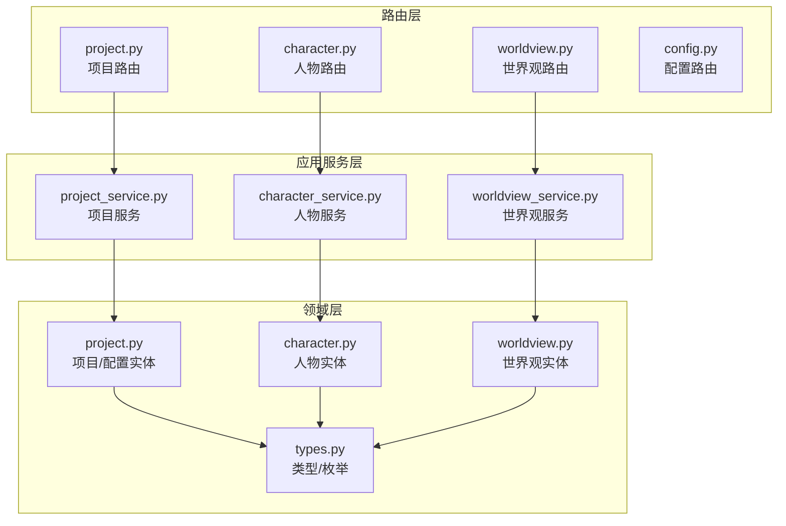
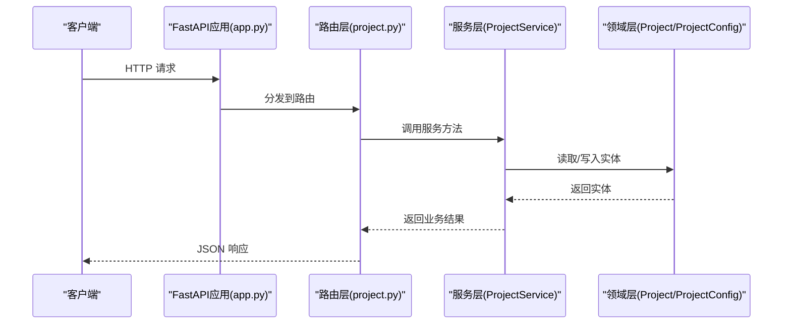
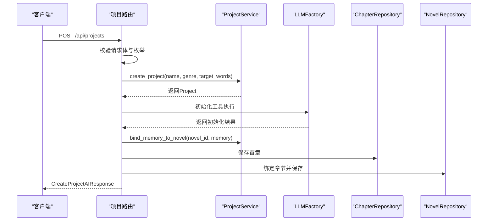
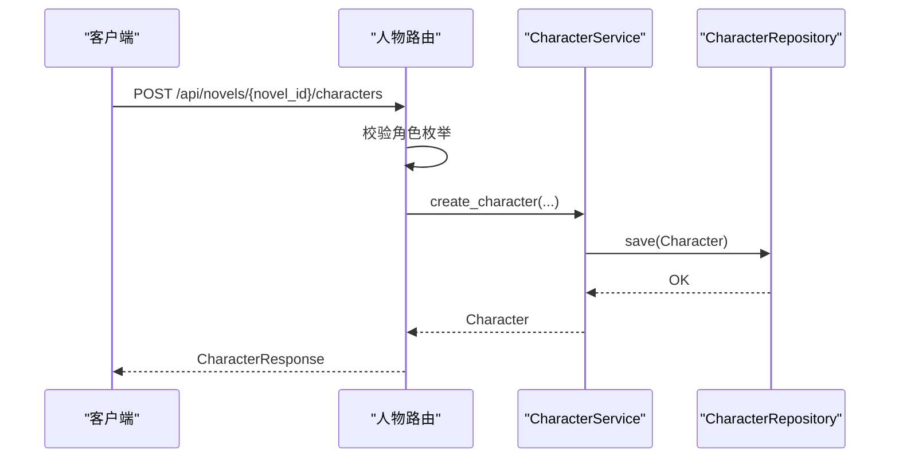
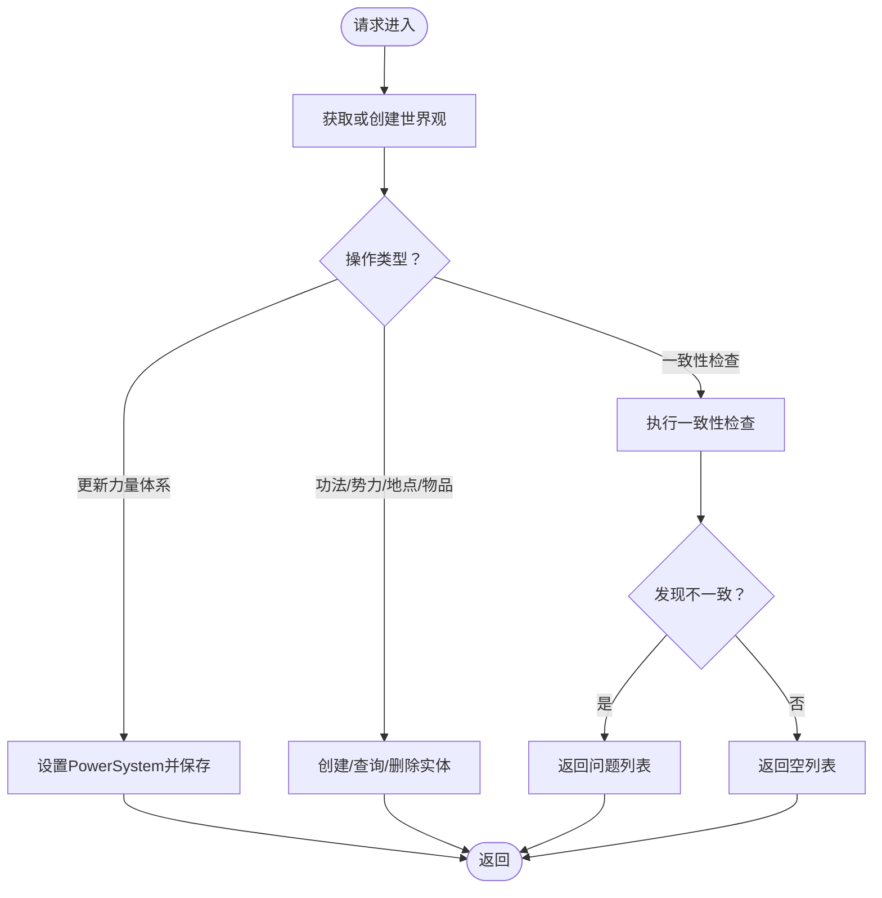
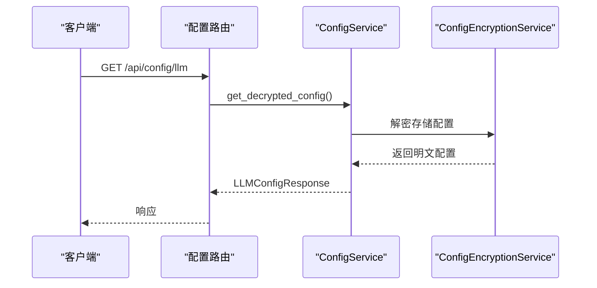
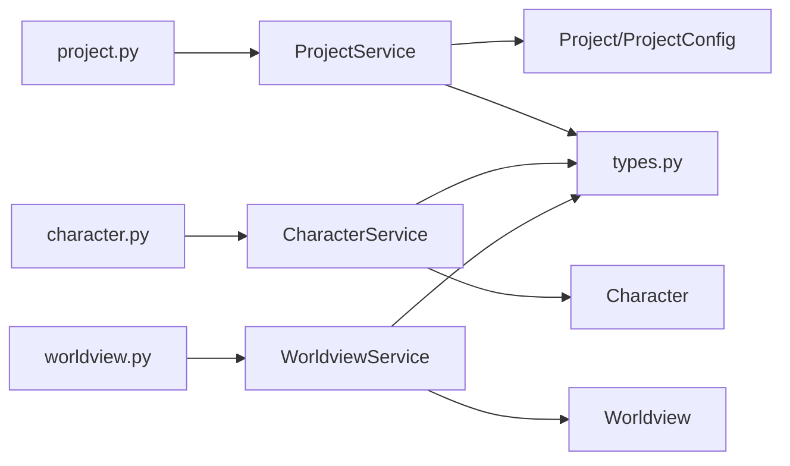

# 项目管理API

<cite>
**本文档引用的文件**
- [presentation/api/app.py](file://presentation/api/app.py)
- [presentation/api/dependencies.py](file://presentation/api/dependencies.py)
- [presentation/api/routers/project.py](file://presentation/api/routers/project.py)
- [presentation/api/routers/character.py](file://presentation/api/routers/character.py)
- [presentation/api/routers/worldview.py](file://presentation/api/routers/worldview.py)
- [presentation/api/routers/config.py](file://presentation/api/routers/config.py)
- [application/services/project_service.py](file://application/services/project_service.py)
- [application/services/character_service.py](file://application/services/character_service.py)
- [application/services/worldview_service.py](file://application/services/worldview_service.py)
- [domain/entities/project.py](file://domain/entities/project.py)
- [domain/entities/character.py](file://domain/entities/character.py)
- [domain/entities/worldview.py](file://domain/entities/worldview.py)
- [domain/types.py](file://domain/types.py)
- [application/dto/request_dto.py](file://application/dto/request_dto.py)
- [application/dto/response_dto.py](file://application/dto/response_dto.py)
</cite>

## 目录
1. [简介](#简介)
2. [项目结构](#项目结构)
3. [核心组件](#核心组件)
4. [架构总览](#架构总览)
5. [详细组件分析](#详细组件分析)
6. [依赖关系分析](#依赖关系分析)
7. [性能考虑](#性能考虑)
8. [故障排除指南](#故障排除指南)
9. [结论](#结论)

## 简介
本文件为 InkTrace 小说创作辅助系统的“项目管理API”技术文档，聚焦于项目配置与角色管理相关接口，涵盖以下功能域：
- 项目配置管理：创建、查询、更新、归档/激活、删除项目；项目配置参数（题材、目标字数、章节字数、风格强度）维护
- 人物管理：创建、查询、更新、删除人物；人物关系建立与维护；人物状态变更与历史记录
- 世界观管理：获取/创建世界观；力量体系更新；功法、势力、地点、物品的增删改查；一致性检查
- 配置管理：LLM配置的增删改查、连通性测试、存在性检查
- 数据验证与权限控制：基于 Pydantic 的请求体校验、枚举类型约束、异常处理与HTTP状态码返回

本API采用 FastAPI 构建，通过依赖注入模块统一装配仓储与服务层，确保路由层与业务逻辑清晰分离。

## 项目结构
后端API由三层组成：
- 路由层（presentation/api/routers/*）：定义REST接口、请求/响应模型、依赖注入调用
- 应用服务层（application/services/*）：封装业务流程，协调仓储与领域模型
- 领域层（domain/entities/*、domain/types.py）：定义实体、值对象、枚举类型与业务规则

**图表来源**
- [presentation/api/routers/project.py:26-290](file://presentation/api/routers/project.py#L26-L290)
- [presentation/api/routers/character.py:19-280](file://presentation/api/routers/character.py#L19-L280)
- [presentation/api/routers/worldview.py:25-375](file://presentation/api/routers/worldview.py#L25-L375)
- [presentation/api/routers/config.py:53-185](file://presentation/api/routers/config.py#L53-L185)
- [application/services/project_service.py:21-203](file://application/services/project_service.py#L21-L203)
- [application/services/character_service.py:18-213](file://application/services/character_service.py#L18-L213)
- [application/services/worldview_service.py:25-235](file://application/services/worldview_service.py#L25-L235)
- [domain/entities/project.py:17-112](file://domain/entities/project.py#L17-L112)
- [domain/entities/character.py:64-273](file://domain/entities/character.py#L64-L273)
- [domain/entities/worldview.py:44-154](file://domain/entities/worldview.py#L44-L154)
- [domain/types.py:15-284](file://domain/types.py#L15-L284)

**章节来源**
- [presentation/api/app.py:19-66](file://presentation/api/app.py#L19-L66)
- [presentation/api/dependencies.py:112-178](file://presentation/api/dependencies.py#L112-L178)

## 核心组件
- 项目管理路由与服务
  - 路由：创建项目、列出项目、获取项目详情、更新项目、归档/激活、删除项目
  - 服务：封装项目生命周期、配置更新、与小说实体绑定记忆数据
- 人物管理路由与服务
  - 路由：创建人物、列出人物、获取人物详情、更新人物、删除人物；关系增删查、状态变更与历史
  - 服务：人物CRUD、关系管理、状态历史维护
- 世界观管理路由与服务
  - 路由：获取/创建世界观、更新力量体系、一致性检查；功法、势力、地点、物品的CRUD
  - 服务：聚合根世界观的读写、子实体管理、一致性检查
- 配置管理路由与服务
  - 路由：获取/新增/测试/删除LLM配置、检查配置是否存在
  - 服务：配置校验、加解密、仓储持久化

**章节来源**
- [presentation/api/routers/project.py:91-290](file://presentation/api/routers/project.py#L91-L290)
- [application/services/project_service.py:32-203](file://application/services/project_service.py#L32-L203)
- [presentation/api/routers/character.py:76-280](file://presentation/api/routers/character.py#L76-L280)
- [application/services/character_service.py:24-213](file://application/services/character_service.py#L24-L213)
- [presentation/api/routers/worldview.py:119-375](file://presentation/api/routers/worldview.py#L119-L375)
- [application/services/worldview_service.py:36-235](file://application/services/worldview_service.py#L36-L235)
- [presentation/api/routers/config.py:72-185](file://presentation/api/routers/config.py#L72-L185)

## 架构总览
API启动时注册所有路由，并通过依赖注入工厂按需创建仓储与服务实例。路由层负责请求解析与响应序列化，服务层执行业务规则，领域层承载数据结构与不变量。

**图表来源**
- [presentation/api/app.py:19-66](file://presentation/api/app.py#L19-L66)
- [presentation/api/routers/project.py:91-181](file://presentation/api/routers/project.py#L91-L181)
- [application/services/project_service.py:32-67](file://application/services/project_service.py#L32-L67)
- [domain/entities/project.py:49-112](file://domain/entities/project.py#L49-L112)

## 详细组件分析

### 项目管理API
- 接口概览
  - 创建项目：POST /api/projects
  - 列表项目：GET /api/projects
  - 获取项目：GET /api/projects/{project_id}
  - 更新项目：PUT /api/projects/{project_id}
  - 归档项目：POST /api/projects/{project_id}/archive
  - 激活项目：POST /api/projects/{project_id}/activate
  - 删除项目：DELETE /api/projects/{project_id}

- 请求与响应模型
  - 创建请求：CreateProjectRequest
    - 字段：name、genre、target_words、style、protagonist_setting、worldview
  - 更新请求：UpdateProjectRequest
    - 字段：name、genre、target_words、chapter_words、style_intensity
  - 响应模型：ProjectResponse
    - 字段：id、name、novel_id、genre、target_words、chapter_words、style_intensity、status、created_at、updated_at
  - 创建AI响应：CreateProjectAIResponse
    - 字段：project(ProjectResponse)、memory(dict)、first_chapter(InitialChapterResponse)

- 关键流程
  - 创建项目：校验题材枚举 → 创建小说与项目 → 初始化记忆数据 → 自动生成首章 → 写回小说与记忆
  - 更新项目：校验字段 → 更新配置 → 可选更新项目名称 → 保存

**图表来源**
- [presentation/api/routers/project.py:91-181](file://presentation/api/routers/project.py#L91-L181)
- [application/services/project_service.py:32-99](file://application/services/project_service.py#L32-L99)

**章节来源**
- [presentation/api/routers/project.py:29-69](file://presentation/api/routers/project.py#L29-L69)
- [presentation/api/routers/project.py:91-290](file://presentation/api/routers/project.py#L91-L290)
- [application/services/project_service.py:32-203](file://application/services/project_service.py#L32-L203)
- [domain/entities/project.py:17-112](file://domain/entities/project.py#L17-L112)

### 人物管理API
- 接口概览
  - 创建人物：POST /api/novels/{novel_id}/characters
  - 列表人物：GET /api/novels/{novel_id}/characters
  - 获取人物：GET /api/novels/{novel_id}/characters/{character_id}
  - 更新人物：PUT /api/novels/{novel_id}/characters/{character_id}
  - 删除人物：DELETE /api/novels/{novel_id}/characters/{character_id}
  - 添加关系：POST /api/novels/{novel_id}/characters/{character_id}/relations
  - 获取关系：GET /api/novels/{novel_id}/characters/{character_id}/relations
  - 移除关系：DELETE /api/novels/{novel_id}/characters/{character_id}/relations/{target_id}
  - 更新状态：POST /api/novels/{novel_id}/characters/{character_id}/state
  - 获取状态历史：GET /api/novels/{novel_id}/characters/{character_id}/states

- 请求与响应模型
  - 创建请求：CreateCharacterRequest
    - 字段：name、role、background、personality、appearance、age、gender、title
  - 更新请求：UpdateCharacterRequest
    - 字段：name、background、personality、appearance、age、gender、title
  - 关系请求：AddRelationRequest
    - 字段：target_id、relation_type、description
  - 响应模型：CharacterResponse、RelationResponse

- 关键流程
  - 创建人物：校验角色枚举 → 保存人物 → 可选补充年龄/性别/头衔
  - 关系管理：校验关系类型 → 添加/移除详细关系 → 查询关系列表
  - 状态管理：更新当前状态并追加历史

**图表来源**
- [presentation/api/routers/character.py:76-105](file://presentation/api/routers/character.py#L76-L105)
- [application/services/character_service.py:24-46](file://application/services/character_service.py#L24-L46)

**章节来源**
- [presentation/api/routers/character.py:22-69](file://presentation/api/routers/character.py#L22-L69)
- [presentation/api/routers/character.py:76-280](file://presentation/api/routers/character.py#L76-L280)
- [application/services/character_service.py:24-213](file://application/services/character_service.py#L24-L213)
- [domain/entities/character.py:64-273](file://domain/entities/character.py#L64-L273)
- [domain/types.py:109-284](file://domain/types.py#L109-L284)

### 世界观管理API
- 接口概览
  - 获取/创建世界观：GET /api/novels/{novel_id}/worldview
  - 更新力量体系：PUT /api/novels/{novel_id}/worldview/power-system
  - 一致性检查：POST /api/novels/{novel_id}/worldview/check
  - 功法：POST/GET/DELETE /api/novels/{novel_id}/worldview/techniques
  - 势力：POST/GET/DELETE /api/novels/{novel_id}/worldview/factions
  - 地点：POST/GET/DELETE /api/novels/{novel_id}/worldview/locations
  - 物品：POST/GET/DELETE /api/novels/{novel_id}/worldview/items

- 请求与响应模型
  - 力量体系：UpdatePowerSystemRequest(name, levels)
  - 功法：CreateTechniqueRequest(name, level_name, level_rank, description, effect, requirement)
  - 势力：CreateFactionRequest(name, level, description, territory, leader)
  - 地点：CreateLocationRequest(name, description, faction_id, parent_id)
  - 物品：CreateItemRequest(name, item_type, description, effect, rarity)
  - 响应模型：WorldviewResponse、TechniqueResponse、FactionResponse、LocationResponse、ItemResponse、ConsistencyIssueResponse

- 关键流程
  - 获取/创建世界观：若不存在则创建并返回
  - 更新力量体系：设置PowerSystem并保存
  - 一致性检查：调用WorldviewChecker返回问题清单

**图表来源**
- [presentation/api/routers/worldview.py:119-375](file://presentation/api/routers/worldview.py#L119-L375)
- [application/services/worldview_service.py:36-235](file://application/services/worldview_service.py#L36-L235)
- [domain/entities/worldview.py:44-154](file://domain/entities/worldview.py#L44-L154)

**章节来源**
- [presentation/api/routers/worldview.py:28-112](file://presentation/api/routers/worldview.py#L28-L112)
- [presentation/api/routers/worldview.py:119-375](file://presentation/api/routers/worldview.py#L119-L375)
- [application/services/worldview_service.py:36-235](file://application/services/worldview_service.py#L36-L235)
- [domain/entities/worldview.py:21-154](file://domain/entities/worldview.py#L21-L154)

### 配置管理API
- 接口概览
  - 获取LLM配置：GET /api/config/llm
  - 新增/更新LLM配置：POST /api/config/llm
  - 测试LLM配置：POST /api/config/llm/test
  - 删除LLM配置：DELETE /api/config/llm
  - 检查配置是否存在：GET /api/config/llm/exists

- 请求与响应模型
  - LLM配置请求：LLMConfigRequest(deepseek_api_key, kimi_api_key)
  - LLM配置响应：LLMConfigResponse(deepseek_api_key, kimi_api_key, created_at, updated_at, has_config)
  - 测试请求/响应：ConfigTestRequest、ConfigTestResponse

- 关键流程
  - 获取配置：若不存在返回空字段；解密后返回
  - 新增配置：先校验再保存
  - 测试配置：校验后进行连通性测试
  - 删除配置：物理删除并返回结果

**图表来源**
- [presentation/api/routers/config.py:72-107](file://presentation/api/routers/config.py#L72-L107)
- [presentation/api/routers/config.py:109-159](file://presentation/api/routers/config.py#L109-L159)

**章节来源**
- [presentation/api/routers/config.py:21-51](file://presentation/api/routers/config.py#L21-L51)
- [presentation/api/routers/config.py:72-185](file://presentation/api/routers/config.py#L72-L185)

### 数据验证与权限控制
- 数据验证
  - 路由层使用 Pydantic BaseModel 定义请求体，自动进行字段类型与范围校验
  - 枚举类型（如 GenreType、CharacterRole、RelationType、ItemType）在路由层进行显式校验，非法值返回400
- 错误处理
  - 未找到资源返回404；状态转换错误返回400；其他异常统一包装为500
- 权限控制
  - 当前路由未实现鉴权中间件，建议在生产环境接入认证/授权机制（如JWT、RBAC）

**章节来源**
- [presentation/api/routers/project.py:101-103](file://presentation/api/routers/project.py#L101-L103)
- [presentation/api/routers/character.py:84-86](file://presentation/api/routers/character.py#L84-L86)
- [presentation/api/routers/worldview.py:291-293](file://presentation/api/routers/worldview.py#L291-L293)
- [presentation/api/routers/config.py:117-118](file://presentation/api/routers/config.py#L117-L118)

## 依赖关系分析
- 依赖注入
  - 通过 get_* 工厂函数创建仓储与服务实例，支持缓存避免重复创建
  - 路由层通过 Depends(get_service) 注入服务，降低耦合
- 组件耦合
  - 路由层仅依赖服务接口，服务层依赖仓储接口，领域层独立于外部框架
- 外部依赖
  - SQLite 作为默认持久化存储，ChromaDB 用于向量检索（与项目管理API同属系统，但非本模块职责）

**图表来源**
- [presentation/api/dependencies.py:122-160](file://presentation/api/dependencies.py#L122-L160)
- [application/services/project_service.py:21-31](file://application/services/project_service.py#L21-L31)
- [application/services/character_service.py:18-23](file://application/services/character_service.py#L18-L23)
- [application/services/worldview_service.py:25-35](file://application/services/worldview_service.py#L25-L35)
- [domain/types.py:15-284](file://domain/types.py#L15-L284)

**章节来源**
- [presentation/api/dependencies.py:50-178](file://presentation/api/dependencies.py#L50-L178)

## 性能考虑
- 缓存策略：依赖注入工厂使用 LRU 缓存，减少数据库连接与对象创建开销
- 批量操作：当前路由未提供批量接口，建议在需要时引入分页与批量更新
- I/O 优化：SQLite 默认配置满足单机场景，高并发建议评估连接池与索引优化
- 大对象处理：项目记忆数据（memory）可能较大，建议在入库前进行压缩或拆分

## 故障排除指南
- 常见错误与排查
  - 400 错误：请求体字段不合法或枚举值非法（如题材、角色、关系类型）
  - 404 错误：资源不存在（项目/人物/小说等）
  - 500 错误：内部异常（配置解密失败、LLM连接失败、数据库异常）
- 建议排查步骤
  - 检查请求体字段类型与范围
  - 核对枚举值是否在允许集合内
  - 查看服务日志定位异常堆栈
  - 对配置类接口，确认环境变量与数据库路径

**章节来源**
- [presentation/api/routers/project.py:101-103](file://presentation/api/routers/project.py#L101-L103)
- [presentation/api/routers/character.py:84-86](file://presentation/api/routers/character.py#L84-L86)
- [presentation/api/routers/config.py:94-96](file://presentation/api/routers/config.py#L94-L96)

## 结论
本项目管理API以清晰的分层设计实现了项目配置、人物关系与世界观管理的核心能力，配合Pydantic的强类型校验与FastAPI的自动生成文档，具备良好的可维护性与扩展性。建议后续增强：
- 引入鉴权与权限控制
- 提供分页与批量接口
- 优化大对象存储与检索
- 增加审计日志与追踪ID