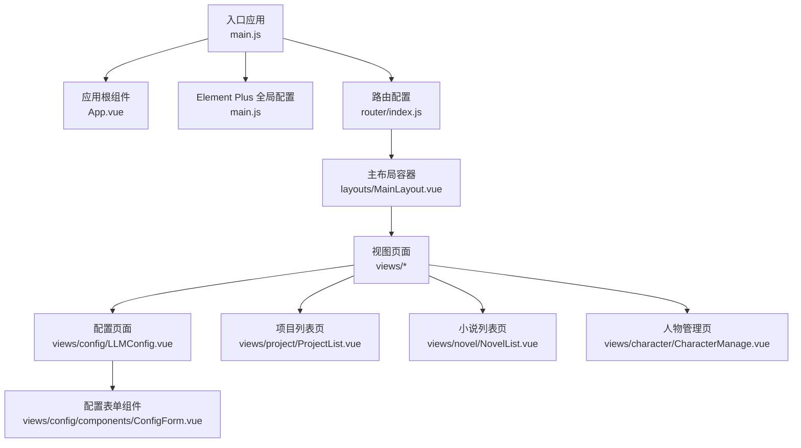
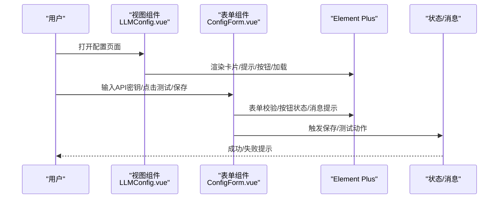
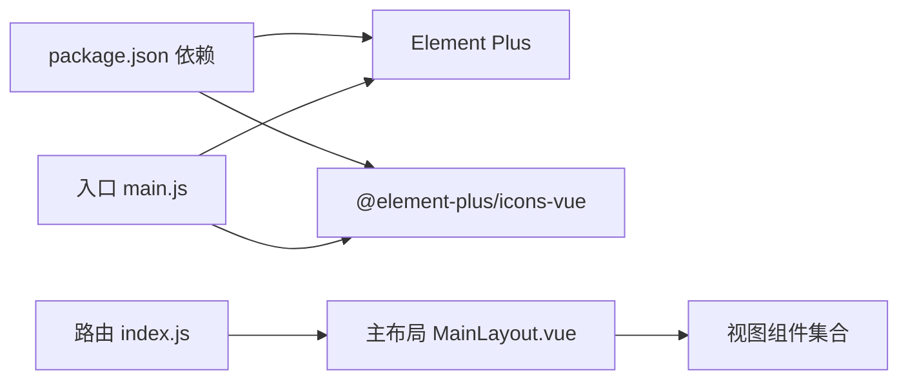

# UI组件库

<cite>
**本文引用的文件**
- [package.json](file://frontend/package.json)
- [vite.config.js](file://frontend/vite.config.js)
- [main.js](file://frontend/src/main.js)
- [App.vue](file://frontend/src/App.vue)
- [main.css](file://frontend/src/styles/main.css)
- [index.js](file://frontend/src/router/index.js)
- [MainLayout.vue](file://frontend/src/layouts/MainLayout.vue)
- [ConfigForm.vue](file://frontend/src/views/config/components/ConfigForm.vue)
- [LLMConfig.vue](file://frontend/src/views/config/LLMConfig.vue)
- [ProjectList.vue](file://frontend/src/views/project/ProjectList.vue)
- [NovelList.vue](file://frontend/src/views/novel/NovelList.vue)
- [CharacterManage.vue](file://frontend/src/views/character/CharacterManage.vue)
</cite>

## 目录
1. [简介](#简介)
2. [项目结构](#项目结构)
3. [核心组件](#核心组件)
4. [架构总览](#架构总览)
5. [组件详解](#组件详解)
6. [依赖关系分析](#依赖关系分析)
7. [性能与可维护性](#性能与可维护性)
8. [故障排查指南](#故障排查指南)
9. [结论](#结论)
10. [附录](#附录)

## 简介
本文件面向InkTrace项目的UI组件库使用与最佳实践，聚焦于Element Plus在Vue 3中的集成与配置、常用UI组件（表单、表格、对话框、树形控件、标签页、进度条、骨架屏、空态、分页等）的实际使用方式、主题定制与样式覆盖策略、图标系统与自定义图标添加、响应式布局与栅格系统、组件属性与事件处理、表单验证与数据绑定、页面组合布局、以及无障碍与可访问性优化建议。内容基于仓库前端代码进行提炼与总结，帮助开发者快速上手并规范使用。

## 项目结构
前端采用Vite构建，Element Plus作为主要UI库，通过全局注册图标与按需引入组件实现统一风格与高复用性。路由采用Vue Router，页面通过布局容器与卡片、表格、对话框等组件组合形成业务页面。

图表来源
- [main.js:1-23](file://frontend/src/main.js#L1-L23)
- [App.vue:1-17](file://frontend/src/App.vue#L1-L17)
- [index.js:1-74](file://frontend/src/router/index.js#L1-L74)
- [MainLayout.vue:1-143](file://frontend/src/layouts/MainLayout.vue#L1-L143)
- [LLMConfig.vue:1-285](file://frontend/src/views/config/LLMConfig.vue#L1-L285)
- [ProjectList.vue:1-226](file://frontend/src/views/project/ProjectList.vue#L1-L226)
- [NovelList.vue:1-203](file://frontend/src/views/novel/NovelList.vue#L1-L203)
- [CharacterManage.vue:1-385](file://frontend/src/views/character/CharacterManage.vue#L1-L385)
- [ConfigForm.vue:1-309](file://frontend/src/views/config/components/ConfigForm.vue#L1-L309)

章节来源
- [package.json:1-24](file://frontend/package.json#L1-L24)
- [vite.config.js:1-28](file://frontend/vite.config.js#L1-L28)
- [main.js:1-23](file://frontend/src/main.js#L1-L23)
- [App.vue:1-17](file://frontend/src/App.vue#L1-L17)
- [index.js:1-74](file://frontend/src/router/index.js#L1-L74)

## 核心组件
- Element Plus集成与配置
  - 在入口文件中全局安装Element Plus，并设置语言包为简体中文；同时批量注册图标组件，便于模板中直接使用。
  - 应用根组件通过ConfigProvider包裹，确保全局语言一致性。
- 路由与布局
  - 路由定义了项目管理、小说列表、导入、配置等页面；主布局容器提供头部、侧边栏菜单与主内容区。
- 页面级组件
  - 配置页面：包含状态提示、卡片、表单、按钮、消息、确认框、加载遮罩等。
  - 项目列表页：表格、标签、对话框、按钮、日期格式化等。
  - 小说列表页：卡片网格、标签、进度条、空态、骨架屏、按钮等。
  - 人物管理页：栅格、树形控件、标签页、表格、输入、按钮、对话框、时间线等。

章节来源
- [main.js:1-23](file://frontend/src/main.js#L1-L23)
- [App.vue:1-17](file://frontend/src/App.vue#L1-L17)
- [MainLayout.vue:1-143](file://frontend/src/layouts/MainLayout.vue#L1-L143)
- [LLMConfig.vue:1-285](file://frontend/src/views/config/LLMConfig.vue#L1-L285)
- [ProjectList.vue:1-226](file://frontend/src/views/project/ProjectList.vue#L1-L226)
- [NovelList.vue:1-203](file://frontend/src/views/novel/NovelList.vue#L1-L203)
- [CharacterManage.vue:1-385](file://frontend/src/views/character/CharacterManage.vue#L1-L385)

## 架构总览
下图展示了UI层的典型调用链：页面组件通过Element Plus组件渲染UI，结合路由与状态管理实现交互；表单组件负责数据收集与校验，表格组件承载数据展示，对话框用于弹窗交互，树形控件与标签页组织复杂信息，进度条与空态提升用户体验。

图表来源
- [LLMConfig.vue:1-285](file://frontend/src/views/config/LLMConfig.vue#L1-L285)
- [ConfigForm.vue:1-309](file://frontend/src/views/config/components/ConfigForm.vue#L1-L309)

## 组件详解

### 表单组件（el-form、el-input、el-select、el-input-number、el-button、el-alert）
- 使用场景
  - 配置页面的API密钥输入、密码显示/隐藏、清空、前缀图标、按钮加载态、错误提示、测试结果展示。
  - 项目创建对话框中的必填项校验、字数范围限制、风格与主角设定等文本输入。
- 关键点
  - 表单引用与校验：通过表单引用触发校验，避免无效提交。
  - 自定义校验器：对API密钥长度与至少配置一个的要求进行校验。
  - 事件与状态：保存/测试按钮的加载态、错误信息的展示与关闭、重置表单。
  - 模板插槽：使用前缀图标增强可读性。
- 最佳实践
  - 将校验规则集中定义，避免分散逻辑。
  - 对敏感字段使用密码输入与清空能力。
  - 使用消息提示与警告框反馈用户操作结果。

章节来源
- [ConfigForm.vue:1-309](file://frontend/src/views/config/components/ConfigForm.vue#L1-L309)
- [ProjectList.vue:1-226](file://frontend/src/views/project/ProjectList.vue#L1-L226)

### 表格组件（el-table、el-table-column、el-tag、el-button）
- 使用场景
  - 项目列表页展示项目名称、题材、目标字数、状态、更新时间，并提供进入、归档、删除等操作按钮。
- 关键点
  - 列模板插槽：对状态、字数、时间等进行格式化展示。
  - 数据绑定：表格数据来自异步接口返回。
  - 加载态：使用表格的加载占位提升体验。
- 最佳实践
  - 对状态与数值列使用标签与格式化函数，保持视觉一致。
  - 操作列宽度合理设置，保证移动端可点击。

章节来源
- [ProjectList.vue:1-226](file://frontend/src/views/project/ProjectList.vue#L1-L226)

### 对话框组件（el-dialog、el-form）
- 使用场景
  - 项目创建对话框，包含多行输入、数字输入、按钮与加载态。
- 关键点
  - 双向绑定控制显隐，表单数据重置与默认值设置。
  - 提交前的基础必填校验，避免无效请求。
- 最佳实践
  - 对话框内表单尽量收敛，减少嵌套层级。
  - 合理设置宽度与按钮布局，保证可读性。

章节来源
- [ProjectList.vue:1-226](file://frontend/src/views/project/ProjectList.vue#L1-L226)

### 树形控件与标签页（el-tree、el-tabs、el-tab-pane）
- 使用场景
  - 人物管理页左侧树形列表按角色分组展示，右侧标签页分别展示基本信息、人物关系、状态历史。
- 关键点
  - 树节点模板插槽自定义角色标签与名称显示。
  - 标签页内嵌表格与输入，支持关系增删与状态更新。
- 最佳实践
  - 树节点点击事件中同步右侧表单数据，保持联动一致。
  - 标签页内容较多时，注意滚动与留白，避免拥挤。

章节来源
- [CharacterManage.vue:1-385](file://frontend/src/views/character/CharacterManage.vue#L1-L385)

### 进度条与空态（el-progress、el-empty、el-skeleton）
- 使用场景
  - 小说列表页卡片底部展示完成度进度条；空态与骨架屏用于加载与无数据场景。
- 关键点
  - 进度条百分比计算与样式微调。
  - 空态与骨架屏提升首屏与加载体验。
- 最佳实践
  - 骨架屏与真实数据切换时注意过渡动画，避免闪烁。

章节来源
- [NovelList.vue:1-203](file://frontend/src/views/novel/NovelList.vue#L1-L203)

### 卡片与布局（el-card、el-row、el-col、el-container、el-header、el-aside、el-main）
- 使用场景
  - 页面主体采用卡片容器承载内容；主布局容器提供头部、侧边栏与主内容区；人物管理页使用栅格系统划分左右区域。
- 关键点
  - 卡片标题插槽与操作按钮组合，提升信息密度。
  - 栅格系统实现响应式布局，适配不同屏幕尺寸。
- 最佳实践
  - 栅格间距与断点设置应考虑移动端交互。
  - 布局容器嵌套层次不宜过深，避免样式冲突。

章节来源
- [MainLayout.vue:1-143](file://frontend/src/layouts/MainLayout.vue#L1-L143)
- [CharacterManage.vue:1-385](file://frontend/src/views/character/CharacterManage.vue#L1-L385)

### 图标系统与自定义图标添加
- 使用现状
  - 全局注册Element Plus图标库，应用根组件设置语言包；页面中通过图标组件与模板插槽使用图标。
- 自定义图标添加建议
  - 在入口处批量注册图标组件，或按需引入，避免重复注册。
  - 通过模板插槽（如前缀/后缀）与按钮配合，提升可读性与一致性。
- 注意事项
  - 图标命名与语义保持一致，避免歧义。
  - 控制图标大小与颜色，遵循Element Plus默认主题规范。

章节来源
- [main.js:1-23](file://frontend/src/main.js#L1-L23)
- [App.vue:1-17](file://frontend/src/App.vue#L1-L17)
- [ConfigForm.vue:1-309](file://frontend/src/views/config/components/ConfigForm.vue#L1-L309)
- [ProjectList.vue:1-226](file://frontend/src/views/project/ProjectList.vue#L1-L226)

### 响应式布局与栅格系统
- 使用现状
  - 页面普遍采用Element Plus栅格系统（el-row、el-col），在人物管理页实现左右分栏；小说列表页使用卡片网格布局。
- 断点与间距
  - 通过gutter设置列间距，结合媒体查询在小屏设备调整布局与字体大小。
- 最佳实践
  - 在小屏设备适当缩小卡片与按钮尺寸，保证触达性。
  - 栅格列宽与内容密度平衡，避免文字换行过多。

章节来源
- [CharacterManage.vue:1-385](file://frontend/src/views/character/CharacterManage.vue#L1-L385)
- [NovelList.vue:1-203](file://frontend/src/views/novel/NovelList.vue#L1-L203)
- [LLMConfig.vue:270-284](file://frontend/src/views/config/LLMConfig.vue#L270-L284)

### 组件属性配置与事件处理
- 属性配置要点
  - 表单：label-width、size、rules、model等。
  - 表格：data、loading、column插槽等。
  - 对话框：v-model显隐、宽度、footer插槽等。
  - 树形控件：props映射、node-click事件、highlight-current等。
  - 标签页：tab-pane标签、内容区布局。
  - 进度条：percentage、stroke-width、show-text等。
- 事件处理要点
  - 表单：submit、reset、validate、close等。
  - 按钮：click、loading状态切换。
  - 对话框：显隐变更、确认/取消回调。
  - 树形控件：node-click选择联动。
- 最佳实践
  - 将事件处理器与状态变量解耦，使用计算属性与watch处理联动。
  - 对异步操作使用loading状态，避免重复提交。

章节来源
- [ConfigForm.vue:1-309](file://frontend/src/views/config/components/ConfigForm.vue#L1-L309)
- [ProjectList.vue:1-226](file://frontend/src/views/project/ProjectList.vue#L1-L226)
- [CharacterManage.vue:1-385](file://frontend/src/views/character/CharacterManage.vue#L1-L385)
- [NovelList.vue:1-203](file://frontend/src/views/novel/NovelList.vue#L1-L203)

### 表单验证与数据绑定最佳实践
- 验证策略
  - 使用Element Plus内置校验器与自定义校验器结合，覆盖必填、长度、格式等场景。
  - 表单提交前统一校验，失败时阻止提交并提示错误。
- 数据绑定
  - 使用响应式对象承载表单数据，结合模板双向绑定与watch监听变化。
  - 对敏感字段使用密码输入与trim处理，避免多余空白。
- 交互反馈
  - 使用消息提示与警告框反馈保存/测试结果，区分成功、警告与错误。
- 最佳实践
  - 将校验规则与提示文案集中管理，便于维护。
  - 对复杂表单拆分为多个小组件，降低耦合。

章节来源
- [ConfigForm.vue:1-309](file://frontend/src/views/config/components/ConfigForm.vue#L1-L309)
- [LLMConfig.vue:1-285](file://frontend/src/views/config/LLMConfig.vue#L1-L285)

### 实际页面中的组合使用与布局设计
- 配置页面
  - 顶部状态提示、卡片容器、表单组件、按钮组、测试结果展示、错误提示与加载遮罩组合使用。
- 项目列表页
  - 卡片标题操作区、表格数据区、对话框创建区组合，形成完整的数据管理流程。
- 小说列表页
  - 页面头部、卡片网格、进度条、空态与骨架屏组合，提升信息密度与加载体验。
- 人物管理页
  - 左右栅格布局、树形控件、标签页、表格与表单组合，满足复杂信息管理需求。
- 最佳实践
  - 页面元素层级清晰，避免过度嵌套。
  - 使用统一的卡片与间距规范，保持视觉一致性。

章节来源
- [LLMConfig.vue:1-285](file://frontend/src/views/config/LLMConfig.vue#L1-L285)
- [ProjectList.vue:1-226](file://frontend/src/views/project/ProjectList.vue#L1-L226)
- [NovelList.vue:1-203](file://frontend/src/views/novel/NovelList.vue#L1-L203)
- [CharacterManage.vue:1-385](file://frontend/src/views/character/CharacterManage.vue#L1-L385)

### 无障碍访问与可访问性优化
- 当前实践
  - 使用Element Plus组件自带的可访问性特性（如键盘导航、焦点管理）。
  - 文案与图标结合，提升信息传达效率。
- 优化建议
  - 为按钮与链接提供明确的aria-label或title。
  - 对表单控件提供清晰的label与错误提示，确保读屏器可识别。
  - 控制色彩对比度，保证低视力用户的可读性。
  - 对加载与交互状态提供ARIA live region或状态提示，避免用户困惑。

## 依赖关系分析
- Element Plus版本与图标依赖
  - 项目使用Element Plus与图标库，入口文件全局安装并注册图标，页面中直接使用组件与图标。
- 构建与代理
  - Vite配置启用Vue插件、路径别名、开发服务器端口与API代理，构建输出目录与静态资源目录规范化。
- 路由与布局
  - 路由定义页面与面包屑标题，主布局容器提供统一头部与侧边栏，页面通过router-view渲染。

图表来源
- [package.json:1-24](file://frontend/package.json#L1-L24)
- [main.js:1-23](file://frontend/src/main.js#L1-L23)
- [index.js:1-74](file://frontend/src/router/index.js#L1-L74)
- [MainLayout.vue:1-143](file://frontend/src/layouts/MainLayout.vue#L1-L143)

章节来源
- [package.json:1-24](file://frontend/package.json#L1-L24)
- [vite.config.js:1-28](file://frontend/vite.config.js#L1-L28)
- [main.js:1-23](file://frontend/src/main.js#L1-L23)
- [index.js:1-74](file://frontend/src/router/index.js#L1-L74)

## 性能与可维护性
- 组件懒加载与按需引入
  - 路由采用动态导入页面组件，减少首屏体积。
- 样式隔离与主题定制
  - 通过全局样式与组件scoped样式结合，避免样式污染；必要时可通过CSS变量或主题包进行统一定制。
- 交互反馈与加载策略
  - 对长耗时操作使用加载遮罩与进度提示，避免用户误操作。
- 可维护性建议
  - 将通用表单、表格、对话框封装为可复用组件，统一属性与事件接口。
  - 对复杂页面拆分为多个子组件，降低单文件复杂度。

## 故障排查指南
- 表单校验不生效
  - 检查表单引用是否正确获取，校验规则是否完整，触发时机是否符合预期。
- 对话框无法关闭或重复打开
  - 检查v-model绑定与事件处理，确保显隐状态与按钮加载态一致。
- 表格数据不更新
  - 确认异步请求成功后更新响应式数据，避免直接修改引用导致的渲染问题。
- 图标不显示
  - 确认图标已在入口注册，或按需引入对应图标组件。
- 路由跳转异常
  - 检查路由history模式与协议类型，避免file协议下的Hash模式差异。

章节来源
- [ConfigForm.vue:1-309](file://frontend/src/views/config/components/ConfigForm.vue#L1-L309)
- [ProjectList.vue:1-226](file://frontend/src/views/project/ProjectList.vue#L1-L226)
- [CharacterManage.vue:1-385](file://frontend/src/views/character/CharacterManage.vue#L1-L385)
- [index.js:61-71](file://frontend/src/router/index.js#L61-L71)

## 结论
InkTrace项目基于Element Plus构建了统一的UI体系，通过路由与布局容器实现清晰的页面结构，结合表单、表格、对话框、树形控件、标签页、进度条、空态与骨架屏等组件，形成了完整的业务页面组合。建议在后续迭代中进一步沉淀通用组件、完善主题定制与无障碍优化，持续提升开发效率与用户体验。

## 附录
- Element Plus版本与图标依赖
  - Element Plus：用于提供UI组件与交互能力。
  - 图标库：提供大量矢量图标，便于在表单、按钮、菜单等场景中使用。
- 构建与运行
  - 开发：通过Vite启动本地服务，支持热更新与代理。
  - 构建：输出至dist目录，静态资源目录assets，支持生产环境部署。

章节来源
- [package.json:1-24](file://frontend/package.json#L1-L24)
- [vite.config.js:1-28](file://frontend/vite.config.js#L1-L28)
- [main.js:1-23](file://frontend/src/main.js#L1-L23)