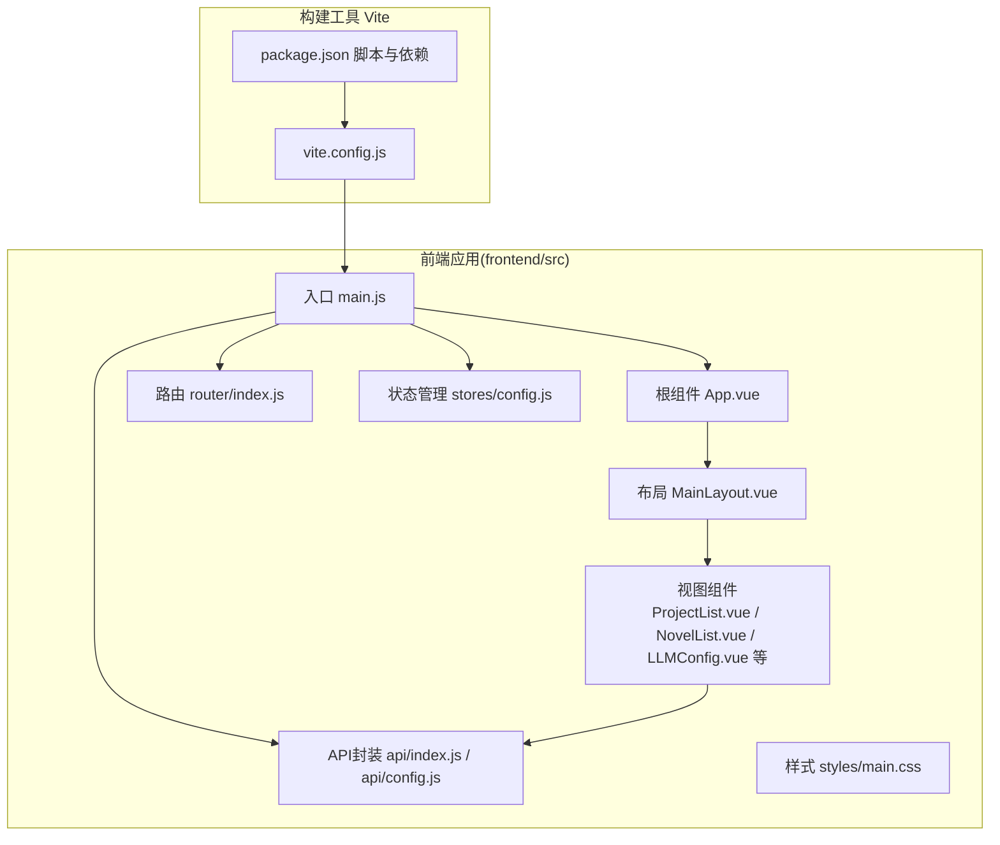
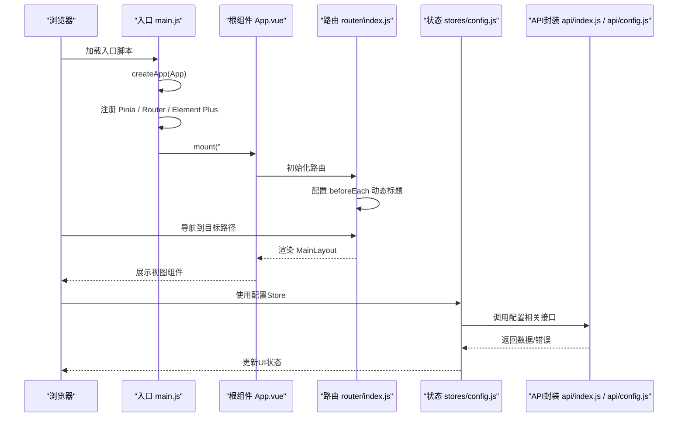
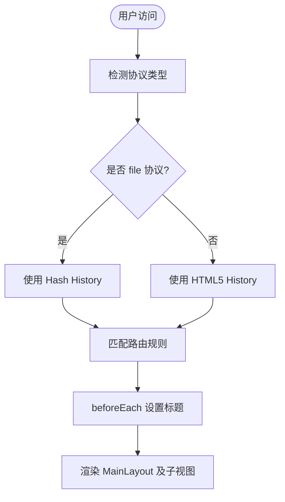
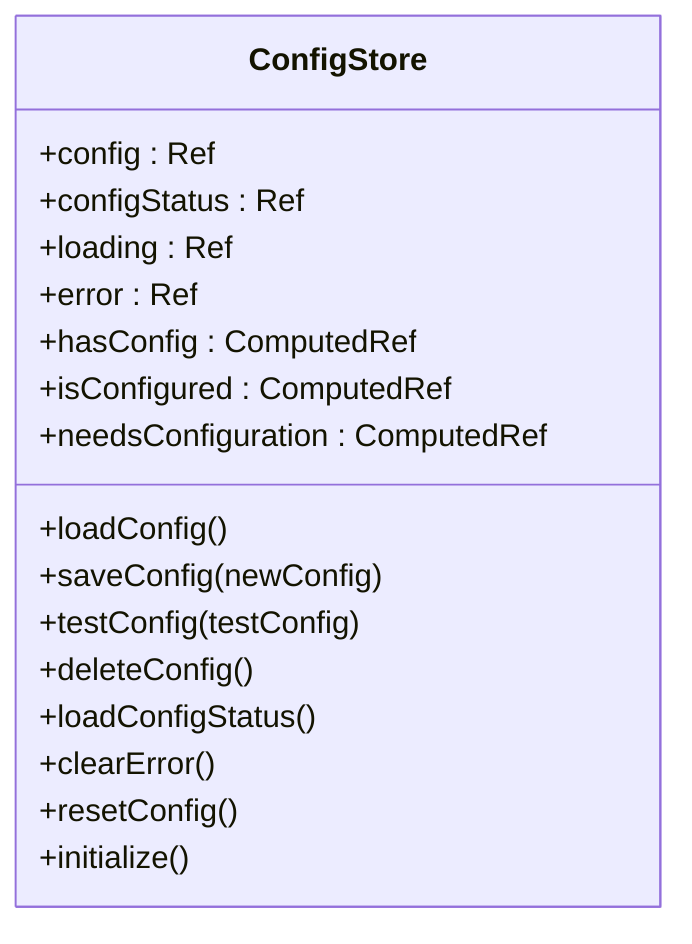
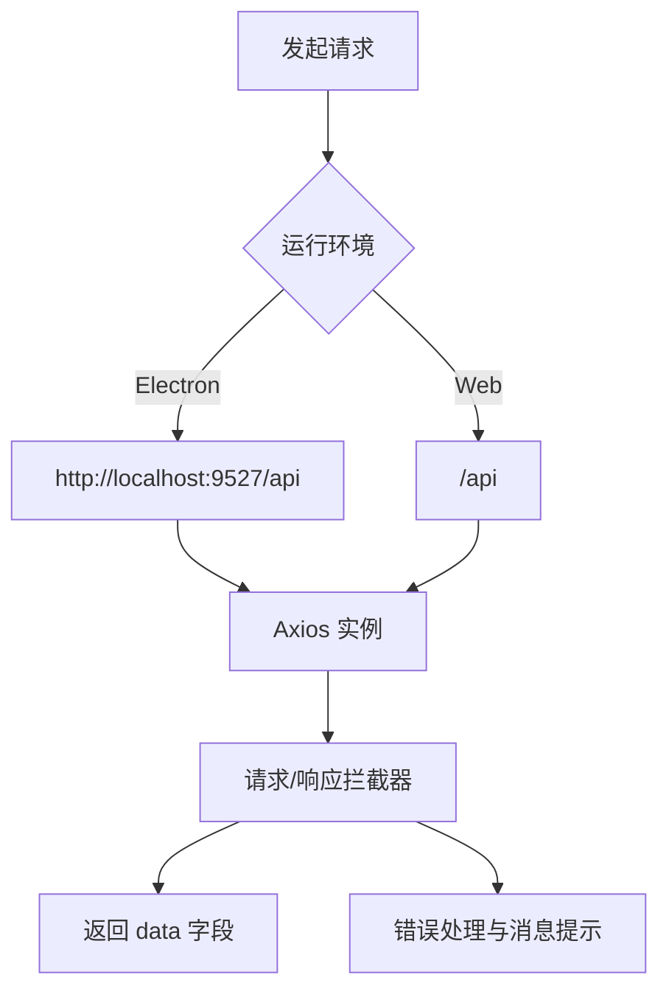
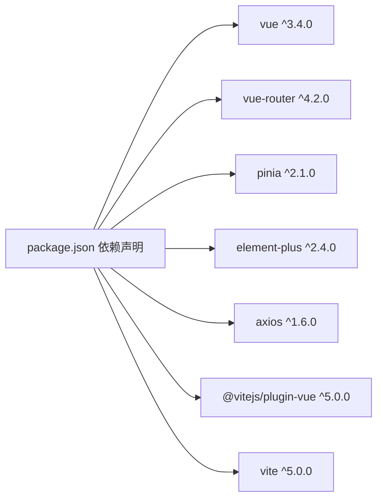

# Vue3架构设计

<cite>
**本文档引用的文件**
- [frontend/src/main.js](file://frontend/src/main.js)
- [frontend/vite.config.js](file://frontend/vite.config.js)
- [frontend/package.json](file://frontend/package.json)
- [frontend/src/App.vue](file://frontend/src/App.vue)
- [frontend/src/router/index.js](file://frontend/src/router/index.js)
- [frontend/src/stores/config.js](file://frontend/src/stores/config.js)
- [frontend/src/layouts/MainLayout.vue](file://frontend/src/layouts/MainLayout.vue)
- [frontend/src/views/project/ProjectList.vue](file://frontend/src/views/project/ProjectList.vue)
- [frontend/src/views/novel/NovelList.vue](file://frontend/src/views/novel/NovelList.vue)
- [frontend/src/views/config/LLMConfig.vue](file://frontend/src/views/config/LLMConfig.vue)
- [frontend/src/views/config/components/ConfigForm.vue](file://frontend/src/views/config/components/ConfigForm.vue)
- [frontend/src/views/novel/NovelDetail.vue](file://frontend/src/views/novel/NovelDetail.vue)
- [frontend/src/views/novel/NovelWrite.vue](file://frontend/src/views/novel/NovelWrite.vue)
- [frontend/src/views/character/CharacterManage.vue](file://frontend/src/views/character/CharacterManage.vue)
- [frontend/src/views/worldview/WorldviewManage.vue](file://frontend/src/views/worldview/WorldviewManage.vue)
- [frontend/src/api/config.js](file://frontend/src/api/config.js)
- [frontend/src/api/index.js](file://frontend/src/api/index.js)
- [frontend/src/styles/main.css](file://frontend/src/styles/main.css)
</cite>

## 目录
1. [引言](#引言)
2. [项目结构](#项目结构)
3. [核心组件](#核心组件)
4. [架构总览](#架构总览)
5. [详细组件分析](#详细组件分析)
6. [依赖分析](#依赖分析)
7. [性能考虑](#性能考虑)
8. [故障排除指南](#故障排除指南)
9. [结论](#结论)
10. [附录](#附录)

## 引言
本文件面向InkTrace项目的前端Vue3架构设计，系统梳理Composition API在组件中的使用方式、路由与状态管理的集成、插件注册机制（Pinia、Router、Element Plus）、Vite构建配置与优化策略，并结合实际代码路径给出组件树结构分析、性能优化建议以及开发与生产环境的最佳实践。

## 项目结构
前端采用标准的Vue3单页应用结构，核心位于frontend/src目录，包含入口、路由、状态管理、布局、视图组件、API封装与全局样式等模块。Vite负责开发服务器与打包构建，Element Plus提供UI组件库。

**图表来源**
- [frontend/src/main.js:1-23](file://frontend/src/main.js#L1-L23)
- [frontend/src/App.vue:1-17](file://frontend/src/App.vue#L1-L17)
- [frontend/src/router/index.js:1-74](file://frontend/src/router/index.js#L1-L74)
- [frontend/src/stores/config.js:1-240](file://frontend/src/stores/config.js#L1-L240)
- [frontend/src/layouts/MainLayout.vue:1-143](file://frontend/src/layouts/MainLayout.vue#L1-L143)
- [frontend/src/views/project/ProjectList.vue:1-226](file://frontend/src/views/project/ProjectList.vue#L1-L226)
- [frontend/src/api/index.js:1-119](file://frontend/src/api/index.js#L1-L119)
- [frontend/src/api/config.js:1-192](file://frontend/src/api/config.js#L1-L192)
- [frontend/src/styles/main.css:1-72](file://frontend/src/styles/main.css#L1-L72)
- [frontend/vite.config.js:1-28](file://frontend/vite.config.js#L1-L28)
- [frontend/package.json:1-24](file://frontend/package.json#L1-L24)

**章节来源**
- [frontend/src/main.js:1-23](file://frontend/src/main.js#L1-L23)
- [frontend/vite.config.js:1-28](file://frontend/vite.config.js#L1-L28)
- [frontend/package.json:1-24](file://frontend/package.json#L1-L24)

## 核心组件
- 应用入口与插件注册：在入口文件中创建Vue应用实例，注册Pinia、Router、Element Plus，并挂载根组件。
- 根组件与国际化：根组件提供Element Plus的本地化配置，统一语言设置。
- 路由系统：基于Vue Router实现嵌套路由与动态导入，支持Hash与History两种历史记录模式。
- 状态管理：使用Pinia定义配置Store，集中管理LLM配置、状态与异步操作。
- 视图组件：围绕项目管理、小说列表、小说详情、续写、人物管理、世界观管理等业务场景构建。
- API封装：对Axios进行二次封装，提供统一的响应拦截与错误处理，按领域拆分API模块。

**章节来源**
- [frontend/src/main.js:12-22](file://frontend/src/main.js#L12-L22)
- [frontend/src/App.vue:7-9](file://frontend/src/App.vue#L7-L9)
- [frontend/src/router/index.js:1-74](file://frontend/src/router/index.js#L1-L74)
- [frontend/src/stores/config.js:14-240](file://frontend/src/stores/config.js#L14-L240)
- [frontend/src/api/index.js:1-119](file://frontend/src/api/index.js#L1-L119)
- [frontend/src/api/config.js:19-192](file://frontend/src/api/config.js#L19-L192)

## 架构总览
下图展示了应用启动流程、插件注册、路由导航与状态管理的关键交互：

**图表来源**
- [frontend/src/main.js:12-22](file://frontend/src/main.js#L12-L22)
- [frontend/src/App.vue:1-17](file://frontend/src/App.vue#L1-L17)
- [frontend/src/router/index.js:68-71](file://frontend/src/router/index.js#L68-L71)
- [frontend/src/stores/config.js:42-107](file://frontend/src/stores/config.js#L42-L107)
- [frontend/src/api/config.js:67-124](file://frontend/src/api/config.js#L67-L124)

## 详细组件分析

### 应用入口与插件注册
- 插件注册顺序：先注册Element Plus（含本地化），再注册Router与Pinia，最后挂载应用。
- 图标组件批量注册：遍历Element Plus图标集合，统一注册为全局组件。
- 样式引入：在入口处引入全局样式，保证首屏渲染一致性。

**章节来源**
- [frontend/src/main.js:1-23](file://frontend/src/main.js#L1-L23)

### 根组件与国际化
- 根组件通过Element Plus的ConfigProvider提供本地化配置，确保全站语言一致。
- 根组件内联样式定义了应用容器尺寸与基础排版。

**章节来源**
- [frontend/src/App.vue:1-17](file://frontend/src/App.vue#L1-L17)

### 路由系统与导航守卫
- 嵌套路由：根路径指向MainLayout，子路由包含项目管理、小说列表、小说详情、续写、人物管理、世界观管理、导入与配置等。
- 动态导入：所有视图组件均使用动态导入，实现按需加载与代码分割。
- 历史模式：根据协议选择History或Hash模式，适配文件协议与生产部署。
- 导航守卫：在进入路由前设置页面标题，提升用户体验。

**图表来源**
- [frontend/src/router/index.js:61-71](file://frontend/src/router/index.js#L61-L71)

**章节来源**
- [frontend/src/router/index.js:1-74](file://frontend/src/router/index.js#L1-L74)

### 状态管理（Pinia）
- Store设计：使用组合式defineStore，集中管理配置对象、状态标志、加载与错误状态。
- 异步操作：封装加载配置、保存配置、测试配置、删除配置、加载状态等动作。
- 计算属性：对外暴露hasConfig、isConfigured、needsConfiguration等计算属性，简化模板逻辑。
- 生命周期：在组件挂载时调用initialize，确保配置状态的完整性。

**图表来源**
- [frontend/src/stores/config.js:14-240](file://frontend/src/stores/config.js#L14-L240)

**章节来源**
- [frontend/src/stores/config.js:14-240](file://frontend/src/stores/config.js#L14-L240)

### 布局组件（MainLayout）
- 结构：顶部导航栏、左侧菜单、主内容区，配合过渡动画实现页面切换体验。
- 菜单路由：菜单项与路由联动，支持面包屑与导航一致性。
- 响应式：侧边栏宽度固定，主内容滚动区域适配不同屏幕尺寸。

**章节来源**
- [frontend/src/layouts/MainLayout.vue:1-143](file://frontend/src/layouts/MainLayout.vue#L1-L143)

### 视图组件分析

#### 项目管理（ProjectList）
- 功能：展示项目列表、创建项目、归档与删除操作；创建后自动跳转续写流程。
- 数据流：使用API模块获取/提交数据，结合Element Plus的消息与确认框提升交互体验。
- 生命周期：组件挂载时加载项目列表。

**章节来源**
- [frontend/src/views/project/ProjectList.vue:126-211](file://frontend/src/views/project/ProjectList.vue#L126-L211)

#### 小说列表（NovelList）
- 功能：展示小说卡片、字数统计、完成度进度条、删除确认。
- 交互：骨架屏占位、空状态提示、点击进入详情。
- 性能：使用虚拟滚动容器承载章节列表，避免长列表渲染压力。

**章节来源**
- [frontend/src/views/novel/NovelList.vue:81-120](file://frontend/src/views/novel/NovelList.vue#L81-L120)

#### 小说详情（NovelDetail）
- 功能：展示基本信息、创作操作（整理结构、继续创作、导出）、内存摘要（人物、世界、剧情、文风）。
- 分析：提供文风与剧情分析对话框，支持导出Markdown。
- 状态：内存数据懒加载，避免首屏阻塞。

**章节来源**
- [frontend/src/views/novel/NovelDetail.vue:239-323](file://frontend/src/views/novel/NovelDetail.vue#L239-L323)

#### 续写（NovelWrite）
- 功能：输入剧情方向、生成章节数、每章字数、文风模仿与连贯性检查开关。
- 流程：支持“延展剧情”与“继续生成”，自动保存章节并显示最近章节。
- 体验：提供提示面板与一致性检查反馈。

**章节来源**
- [frontend/src/views/novel/NovelWrite.vue:170-269](file://frontend/src/views/novel/NovelWrite.vue#L170-L269)

#### 人物管理（CharacterManage）
- 功能：人物树形展示、搜索过滤、增删改查、人物关系维护、状态历史更新。
- 交互：标签化角色类型、关系类型枚举化，提升可维护性。

**章节来源**
- [frontend/src/views/character/CharacterManage.vue:227-366](file://frontend/src/views/character/CharacterManage.vue#L227-L366)

#### 世界观管理（WorldviewManage）
- 功能：力量体系、功法、势力、地点、物品的增删改查，以及一致性检查。
- 交互：多标签页组织，对话框创建实体，检查结果以告警形式呈现。

**章节来源**
- [frontend/src/views/worldview/WorldviewManage.vue:260-449](file://frontend/src/views/worldview/WorldviewManage.vue#L260-L449)

### API封装与错误处理
- 统一基座：根据运行环境判断API前缀，支持Electron与Web两种部署形态。
- 响应拦截：提取data字段，统一错误消息映射与提示。
- 领域划分：将小说、内容、写作、导出、向量检索、RAG、项目、模板、角色、世界观等API按模块拆分，便于维护与扩展。

**图表来源**
- [frontend/src/api/index.js:6-41](file://frontend/src/api/index.js#L6-L41)

**章节来源**
- [frontend/src/api/index.js:1-119](file://frontend/src/api/index.js#L1-L119)
- [frontend/src/api/config.js:19-192](file://frontend/src/api/config.js#L19-L192)

## 依赖分析
- 运行时依赖：Vue3、Vue Router、Pinia、Element Plus、Axios。
- 开发依赖：Vite、@vitejs/plugin-vue。
- 构建产物：输出至dist目录，静态资源放置于assets目录。

**图表来源**
- [frontend/package.json:11-22](file://frontend/package.json#L11-L22)

**章节来源**
- [frontend/package.json:1-24](file://frontend/package.json#L1-L24)

## 性能考虑
- 代码分割与懒加载：路由视图均采用动态导入，减少首屏包体。
- 组件级懒加载：在路由层面对大型视图组件进行按需加载，降低初始渲染时间。
- 状态持久化与缓存：配置Store在初始化时加载状态，避免重复请求；视图组件在挂载时才触发数据加载。
- 资源优化：Vite默认启用压缩与哈希命名，生产构建建议开启预加载与预取策略。
- UI渲染优化：大量列表使用骨架屏与滚动容器，减少DOM节点数量与重绘开销。
- 网络层优化：统一超时与错误处理，避免长时间阻塞；对高频请求进行节流或防抖。

[本节为通用性能指导，无需特定文件引用]

## 故障排除指南
- 配置加载失败：检查后端服务是否启动，确认代理配置与跨域设置。
- API请求报错：查看响应拦截器映射的错误码与用户提示，定位具体业务异常。
- 路由跳转异常：确认路由模式（Hash/History）与部署协议匹配，检查beforeEach标题设置。
- Element Plus样式冲突：确保全局样式优先级与主题变量配置正确。

**章节来源**
- [frontend/src/api/index.js:18-41](file://frontend/src/api/index.js#L18-L41)
- [frontend/src/api/config.js:42-61](file://frontend/src/api/config.js#L42-L61)
- [frontend/src/router/index.js:61-71](file://frontend/src/router/index.js#L61-L71)

## 结论
InkTrace前端采用Vue3 + Composition API + Pinia + Element Plus + Vite的技术栈，实现了清晰的模块化与良好的可维护性。通过路由懒加载、状态集中管理与API封装，提升了开发效率与用户体验。建议在生产环境中进一步完善构建优化、缓存策略与监控埋点，持续迭代以满足复杂业务场景的需求。

## 附录

### 开发环境配置与热重载
- 启动命令：通过Vite提供的开发服务器提供热重载与实时编译。
- 端口与代理：本地开发端口为3000，代理/api到后端服务地址。
- 路径别名：@指向src目录，便于模块导入与重构。

**章节来源**
- [frontend/vite.config.js:13-21](file://frontend/vite.config.js#L13-L21)
- [frontend/package.json:6-10](file://frontend/package.json#L6-L10)

### 生产环境优化建议
- 构建输出：确保outDir与assetsDir配置符合CDN与静态托管要求。
- 代码压缩：启用ESLint与Prettier规范，结合Rollup插件链进行Tree Shaking与压缩。
- 缓存策略：对静态资源设置长期缓存，对HTML与动态资源设置合理缓存头。
- 预加载：对关键路由与首屏组件进行预加载，提升首屏速度。

**章节来源**
- [frontend/vite.config.js:22-27](file://frontend/vite.config.js#L22-L27)

### TypeScript支持与模块化导入
- 当前项目未启用TypeScript，若后续需要类型安全与IDE增强，可在Vite中集成TypeScript与相关插件，并为API与Store补充类型定义，提升可维护性与协作效率。

[本节为概念性建议，无需特定文件引用]