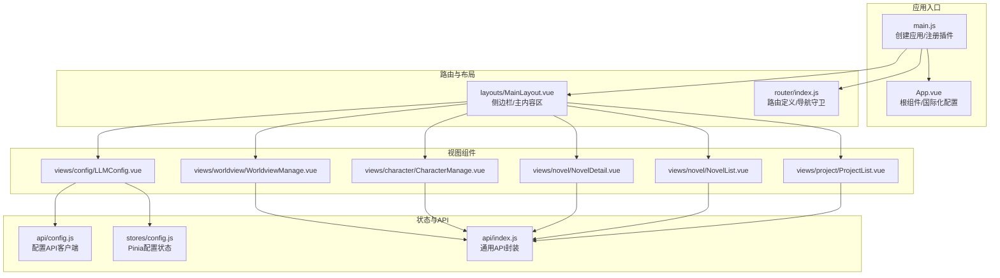
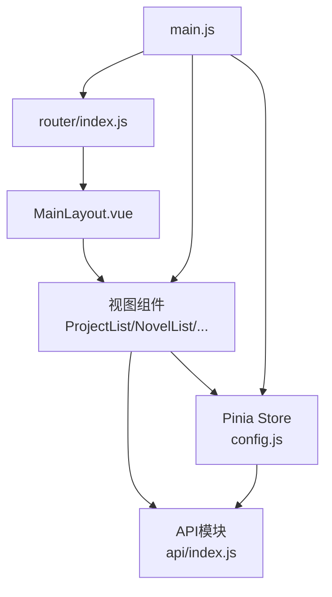
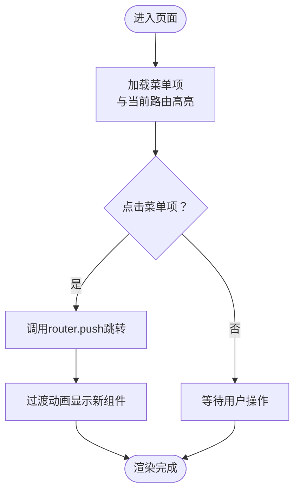
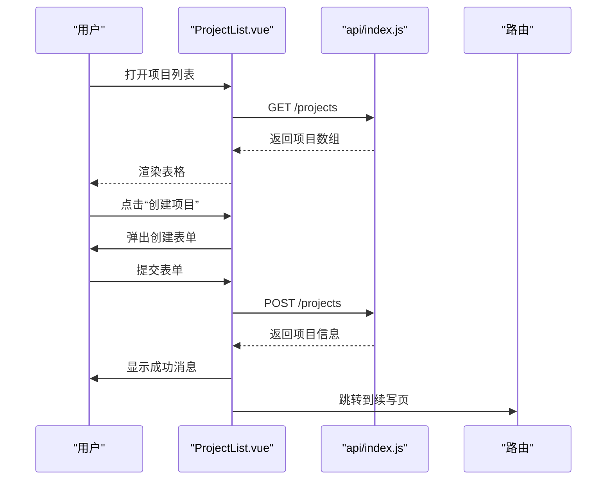
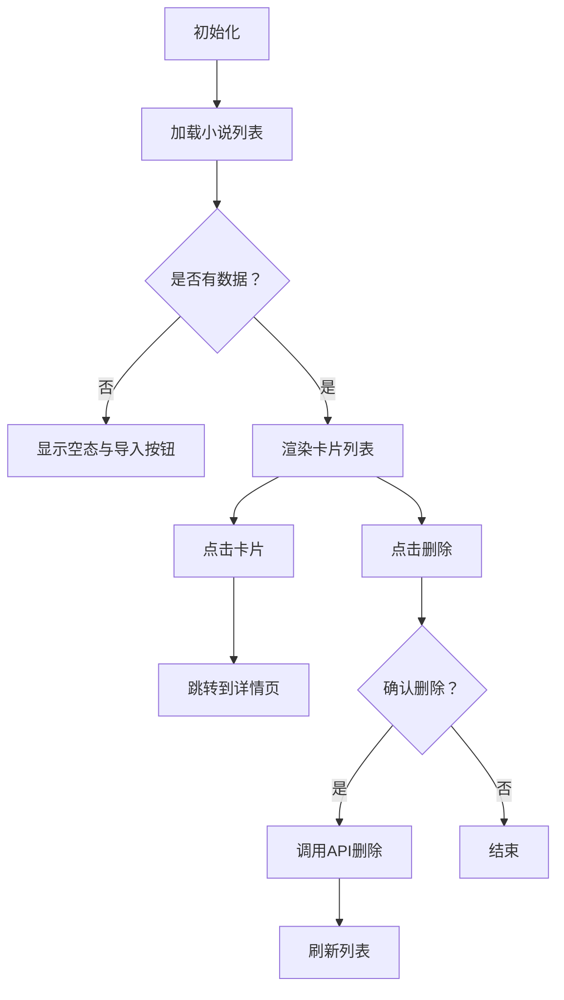
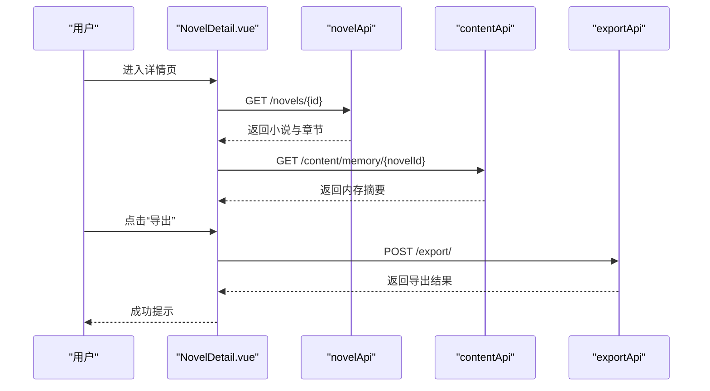
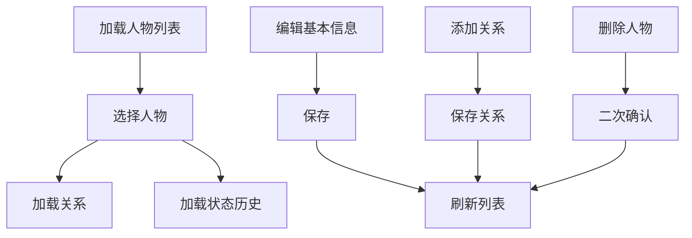
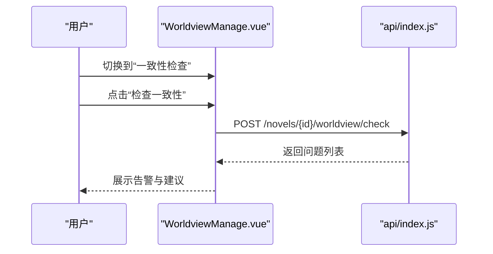
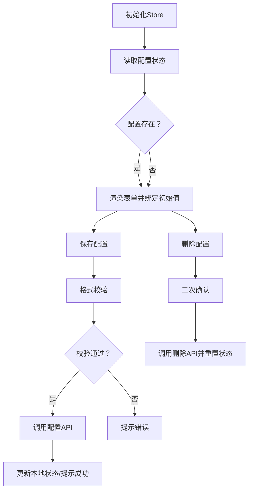
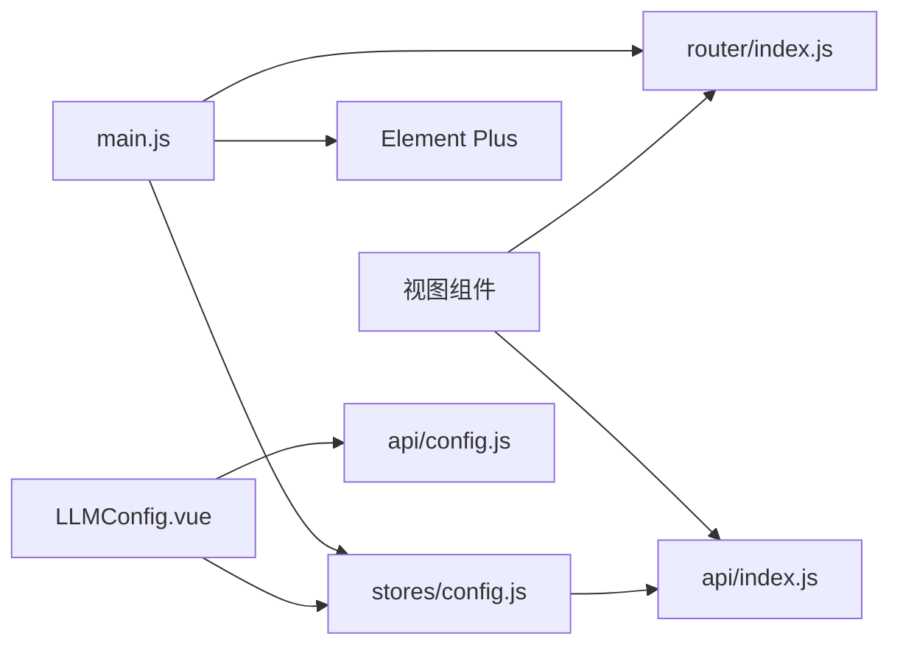

# 前端界面设计

<cite>
**本文引用的文件**
- [frontend/src/main.js](file://frontend/src/main.js)
- [frontend/src/App.vue](file://frontend/src/App.vue)
- [frontend/src/router/index.js](file://frontend/src/router/index.js)
- [frontend/src/stores/config.js](file://frontend/src/stores/config.js)
- [frontend/src/layouts/MainLayout.vue](file://frontend/src/layouts/MainLayout.vue)
- [frontend/src/views/project/ProjectList.vue](file://frontend/src/views/project/ProjectList.vue)
- [frontend/src/views/novel/NovelList.vue](file://frontend/src/views/novel/NovelList.vue)
- [frontend/src/views/novel/NovelDetail.vue](file://frontend/src/views/novel/NovelDetail.vue)
- [frontend/src/views/character/CharacterManage.vue](file://frontend/src/views/character/CharacterManage.vue)
- [frontend/src/views/worldview/WorldviewManage.vue](file://frontend/src/views/worldview/WorldviewManage.vue)
- [frontend/src/views/config/LLMConfig.vue](file://frontend/src/views/config/LLMConfig.vue)
- [frontend/src/views/config/components/ConfigForm.vue](file://frontend/src/views/config/components/ConfigForm.vue)
- [frontend/src/api/index.js](file://frontend/src/api/index.js)
- [frontend/src/api/config.js](file://frontend/src/api/config.js)
- [frontend/src/styles/main.css](file://frontend/src/styles/main.css)
- [frontend/package.json](file://frontend/package.json)
- [frontend/vite.config.js](file://frontend/vite.config.js)
</cite>

## 目录
1. [简介](#简介)
2. [项目结构](#项目结构)
3. [核心组件](#核心组件)
4. [架构总览](#架构总览)
5. [详细组件分析](#详细组件分析)
6. [依赖分析](#依赖分析)
7. [性能考虑](#性能考虑)
8. [故障排查指南](#故障排查指南)
9. [结论](#结论)
10. [附录](#附录)

## 简介
本文件面向InkTrace项目的前端界面设计，围绕基于Vue 3的前端架构进行系统化梳理，涵盖组件化开发、状态管理（Pinia）、路由配置、UI组件库（Element Plus）使用与主题配置、响应式与移动端适配、前后端数据交互与错误处理、组件间通信与事件传递、用户交互流程与体验优化、构建与部署策略以及组件开发最佳实践与代码规范。

## 项目结构
前端采用标准的Vue 3 + Vite工程，目录组织遵循“按功能域分层”的方式：
- 应用入口与全局配置：main.js、App.vue、router、stores、styles
- 视图层：views 下按业务域划分（project、novel、character、worldview、config）
- API封装：api 目录下按领域拆分接口模块
- 构建与依赖：package.json、vite.config.js

**图表来源**
- [frontend/src/main.js:1-23](file://frontend/src/main.js#L1-L23)
- [frontend/src/App.vue:1-17](file://frontend/src/App.vue#L1-L17)
- [frontend/src/router/index.js:1-74](file://frontend/src/router/index.js#L1-L74)
- [frontend/src/layouts/MainLayout.vue:1-143](file://frontend/src/layouts/MainLayout.vue#L1-L143)
- [frontend/src/views/project/ProjectList.vue:1-226](file://frontend/src/views/project/ProjectList.vue#L1-L226)
- [frontend/src/views/novel/NovelList.vue:1-203](file://frontend/src/views/novel/NovelList.vue#L1-L203)
- [frontend/src/views/novel/NovelDetail.vue:1-432](file://frontend/src/views/novel/NovelDetail.vue#L1-L432)
- [frontend/src/views/character/CharacterManage.vue:1-385](file://frontend/src/views/character/CharacterManage.vue#L1-L385)
- [frontend/src/views/worldview/WorldviewManage.vue:1-463](file://frontend/src/views/worldview/WorldviewManage.vue#L1-L463)
- [frontend/src/views/config/LLMConfig.vue:1-285](file://frontend/src/views/config/LLMConfig.vue#L1-L285)
- [frontend/src/stores/config.js:1-240](file://frontend/src/stores/config.js#L1-L240)
- [frontend/src/api/index.js:1-119](file://frontend/src/api/index.js#L1-L119)
- [frontend/src/api/config.js:1-192](file://frontend/src/api/config.js#L1-L192)

**章节来源**
- [frontend/src/main.js:1-23](file://frontend/src/main.js#L1-L23)
- [frontend/src/router/index.js:1-74](file://frontend/src/router/index.js#L1-L74)
- [frontend/src/layouts/MainLayout.vue:1-143](file://frontend/src/layouts/MainLayout.vue#L1-L143)
- [frontend/src/styles/main.css:1-72](file://frontend/src/styles/main.css#L1-L72)

## 核心组件
- 应用入口与插件注册：在入口文件中完成Vue应用创建、Pinia、路由、Element Plus国际化与图标注册、全局样式挂载。
- 路由系统：采用history/hash混合模式，支持文件协议与生产环境切换；通过beforeEach设置页面标题。
- 状态管理：Pinia Store集中管理LLM配置状态，提供加载、保存、测试、删除、状态查询等动作，并暴露计算属性。
- 视图组件：按业务域划分，每个页面组件负责自身数据加载、交互逻辑与UI展示。
- API封装：统一Axios实例，拦截器处理错误消息映射与提示，按领域拆分模块（novel/content/writing/export/vector/rag/project/template/character/worldview）。
- UI库与主题：Element Plus按需引入图标，全局样式覆盖滚动条与基础排版。

**章节来源**
- [frontend/src/main.js:1-23](file://frontend/src/main.js#L1-L23)
- [frontend/src/router/index.js:61-71](file://frontend/src/router/index.js#L61-L71)
- [frontend/src/stores/config.js:14-240](file://frontend/src/stores/config.js#L14-L240)
- [frontend/src/api/index.js:18-41](file://frontend/src/api/index.js#L18-L41)

## 架构总览
前端采用“布局-视图-状态-API”分层架构，组件通过路由驱动切换，Pinia集中管理跨页面共享状态，Axios统一处理HTTP请求与错误。

**图表来源**
- [frontend/src/layouts/MainLayout.vue:1-143](file://frontend/src/layouts/MainLayout.vue#L1-L143)
- [frontend/src/router/index.js:1-74](file://frontend/src/router/index.js#L1-L74)
- [frontend/src/stores/config.js:14-240](file://frontend/src/stores/config.js#L14-L240)
- [frontend/src/api/index.js:1-119](file://frontend/src/api/index.js#L1-L119)
- [frontend/src/main.js:1-23](file://frontend/src/main.js#L1-L23)

## 详细组件分析

### 布局与导航：MainLayout
- 功能：顶部标题栏、左侧菜单导航、主内容区域过渡动画。
- 特点：Element Plus容器组件组合，菜单router联动，路由变化时高亮同步；主内容区使用过渡动画提升切换体验。
- 交互：新建项目按钮跳转至项目列表页；菜单项与路由路径一一对应。

**图表来源**
- [frontend/src/layouts/MainLayout.vue:18-54](file://frontend/src/layouts/MainLayout.vue#L18-L54)
- [frontend/src/router/index.js:3-58](file://frontend/src/router/index.js#L3-L58)

**章节来源**
- [frontend/src/layouts/MainLayout.vue:1-143](file://frontend/src/layouts/MainLayout.vue#L1-L143)
- [frontend/src/router/index.js:1-74](file://frontend/src/router/index.js#L1-L74)

### 项目管理：ProjectList
- 功能：项目列表展示、创建项目弹窗、归档/删除项目、进入小说详情。
- 数据流：加载项目列表 -> 表格渲染 -> 用户操作 -> 调用API -> 刷新列表。
- 交互细节：必填字段校验、创建后自动提示并跳转续写页；日期格式化、状态标签化。

**图表来源**
- [frontend/src/views/project/ProjectList.vue:126-178](file://frontend/src/views/project/ProjectList.vue#L126-L178)
- [frontend/src/api/index.js:81-89](file://frontend/src/api/index.js#L81-L89)

**章节来源**
- [frontend/src/views/project/ProjectList.vue:1-226](file://frontend/src/views/project/ProjectList.vue#L1-L226)

### 小说列表：NovelList
- 功能：展示小说卡片、导入按钮、删除确认、进度条与字数格式化。
- 交互：空态与骨架屏占位；点击卡片跳转详情；删除前二次确认。

**图表来源**
- [frontend/src/views/novel/NovelList.vue:81-116](file://frontend/src/views/novel/NovelList.vue#L81-L116)
- [frontend/src/api/index.js:43-48](file://frontend/src/api/index.js#L43-L48)

**章节来源**
- [frontend/src/views/novel/NovelList.vue:1-203](file://frontend/src/views/novel/NovelList.vue#L1-L203)

### 小说详情：NovelDetail
- 功能：基本信息展示、创作工具面板、内存摘要（人物/世界/剧情/文风）、章节列表、导出与分析。
- 数据流：加载小说与章节 -> 加载内存摘要 -> 用户操作触发分析/导出/整理 -> 更新内存摘要。
- 交互：进度条、折叠面板、对话框、时间轴与表格展示。

**图表来源**
- [frontend/src/views/novel/NovelDetail.vue:239-307](file://frontend/src/views/novel/NovelDetail.vue#L239-L307)
- [frontend/src/api/index.js:43-48](file://frontend/src/api/index.js#L43-L48)
- [frontend/src/api/index.js:50-56](file://frontend/src/api/index.js#L50-L56)
- [frontend/src/api/index.js:64-67](file://frontend/src/api/index.js#L64-L67)

**章节来源**
- [frontend/src/views/novel/NovelDetail.vue:1-432](file://frontend/src/views/novel/NovelDetail.vue#L1-L432)

### 人物管理：CharacterManage
- 功能：人物树形列表、搜索、增删改、人物关系、状态历史。
- 数据流：加载人物 -> 选择人物 -> 加载关系与状态 -> 编辑保存/新增关系/删除关系/更新状态。
- 交互：树节点标签区分角色类型；关系类型枚举；状态历史时间轴。

**图表来源**
- [frontend/src/views/character/CharacterManage.vue:227-264](file://frontend/src/views/character/CharacterManage.vue#L227-L264)
- [frontend/src/views/character/CharacterManage.vue:316-344](file://frontend/src/views/character/CharacterManage.vue#L316-L344)

**章节来源**
- [frontend/src/views/character/CharacterManage.vue:1-385](file://frontend/src/views/character/CharacterManage.vue#L1-L385)

### 世界观管理：WorldviewManage
- 功能：力量体系（等级列表）、功法、势力、地点、物品管理，一致性检查。
- 数据流：按标签页加载不同实体 -> 新增/删除 -> 一致性检查。
- 交互：对话框表单、表格操作列、一致性问题告警。

**图表来源**
- [frontend/src/views/worldview/WorldviewManage.vue:426-436](file://frontend/src/views/worldview/WorldviewManage.vue#L426-L436)
- [frontend/src/api/index.js:108-116](file://frontend/src/api/index.js#L108-L116)

**章节来源**
- [frontend/src/views/worldview/WorldviewManage.vue:1-463](file://frontend/src/views/worldview/WorldviewManage.vue#L1-L463)

### 配置管理：LLMConfig 与 ConfigForm
- 功能：显示配置状态、API密钥表单、删除配置、测试连接、说明与指引。
- 状态：Pinia Store集中维护配置对象、状态标志、加载与错误。
- 交互：保存后提示成功；删除前二次确认；格式校验与服务端校验结合。

**图表来源**
- [frontend/src/views/config/LLMConfig.vue:109-164](file://frontend/src/views/config/LLMConfig.vue#L109-L164)
- [frontend/src/stores/config.js:42-107](file://frontend/src/stores/config.js#L42-L107)
- [frontend/src/api/config.js:67-124](file://frontend/src/api/config.js#L67-L124)

**章节来源**
- [frontend/src/views/config/LLMConfig.vue:1-285](file://frontend/src/views/config/LLMConfig.vue#L1-L285)
- [frontend/src/views/config/components/ConfigForm.vue](file://frontend/src/views/config/components/ConfigForm.vue)
- [frontend/src/stores/config.js:1-240](file://frontend/src/stores/config.js#L1-L240)
- [frontend/src/api/config.js:1-192](file://frontend/src/api/config.js#L1-L192)

## 依赖分析
- 依赖关系：main.js 依赖 router、stores、Element Plus；各视图组件依赖 api 模块；LLMConfig 依赖 Pinia Store。
- 外部依赖：Vue 3、Vue Router、Pinia、Element Plus、Axios、Vite。
- 构建与代理：Vite配置了本地开发代理到后端9527端口，构建输出目录为 dist。

**图表来源**
- [frontend/src/main.js:1-23](file://frontend/src/main.js#L1-L23)
- [frontend/src/router/index.js:1-74](file://frontend/src/router/index.js#L1-L74)
- [frontend/src/stores/config.js:1-240](file://frontend/src/stores/config.js#L1-L240)
- [frontend/src/api/index.js:1-119](file://frontend/src/api/index.js#L1-L119)
- [frontend/src/api/config.js:1-192](file://frontend/src/api/config.js#L1-L192)

**章节来源**
- [frontend/package.json:11-22](file://frontend/package.json#L11-L22)
- [frontend/vite.config.js:15-21](file://frontend/vite.config.js#L15-L21)

## 性能考虑
- 组件懒加载：路由使用动态导入，减少首屏体积。
- 状态最小化：Pinia Store仅存放必要状态，避免冗余响应式开销。
- 列表渲染优化：使用骨架屏与空态占位，降低长列表渲染压力。
- 图标按需注册：仅注册所需图标，避免全量引入。
- 构建优化：Vite默认启用压缩与资源分包，生产构建开启空目录清理。

[本节为通用指导，无需具体文件引用]

## 故障排查指南
- API错误处理：统一拦截器将后端错误映射为用户可读消息，优先读取detail中的user_message或code映射，其次回退到默认message。
- 配置错误：ConfigAPI对请求/响应分别设置拦截器，区分服务器错误、网络错误与其他错误，抛出明确异常供上层捕获。
- 常见问题定位：
  - 无法访问后端：检查Vite代理配置与后端服务是否启动。
  - 配置保存失败：查看控制台日志与错误消息，确认密钥格式与服务端可用性。
  - 页面空白：确认路由与组件导入路径正确，检查Element Plus主题与图标是否注册。

**章节来源**
- [frontend/src/api/index.js:18-41](file://frontend/src/api/index.js#L18-L41)
- [frontend/src/api/config.js:29-61](file://frontend/src/api/config.js#L29-L61)

## 结论
InkTrace前端采用清晰的分层架构与模块化设计，借助Vue 3与Element Plus实现高效开发，配合Pinia与Axios形成稳定的状态与数据流。通过路由与布局解耦、API封装与错误处理统一、组件间职责明确，整体具备良好的可维护性与扩展性。建议后续持续完善单元测试、接入TypeScript与ESLint/Prettier规范，进一步提升质量与协作效率。

[本节为总结性内容，无需具体文件引用]

## 附录

### 响应式与移动端适配
- 基础样式：全局重置、字体族、滚动条样式、页面容器与卡片网格布局。
- 移动端：在大屏配置页中提供媒体查询，缩小间距与字号，保证在小屏设备上的可读性与可用性。

**章节来源**
- [frontend/src/styles/main.css:1-72](file://frontend/src/styles/main.css#L1-L72)
- [frontend/src/views/config/LLMConfig.vue:270-284](file://frontend/src/views/config/LLMConfig.vue#L270-L284)

### 前后端数据交互与API封装
- 统一基地址：根据运行环境判断是否为Electron或浏览器，选择本地代理或相对路径。
- 错误映射：将后端返回的错误码映射为用户友好提示，增强可理解性。
- 领域模块：novel/content/writing/export/vector/rag/project/template/character/worldview等模块化封装，便于复用与维护。

**章节来源**
- [frontend/src/api/index.js:4-41](file://frontend/src/api/index.js#L4-L41)
- [frontend/src/api/index.js:43-116](file://frontend/src/api/index.js#L43-L116)

### 组件间通信与事件传递
- 路由驱动：通过router.push在页面间传递参数（如小说ID、自动续写标记），实现页面级通信。
- 父子组件：LLMConfig与ConfigForm通过事件（saved/tested）进行回调通知，保持松耦合。
- 状态共享：跨页面共享状态通过Pinia Store集中管理，避免深层传递。

**章节来源**
- [frontend/src/views/config/LLMConfig.vue:106-132](file://frontend/src/views/config/LLMConfig.vue#L106-L132)
- [frontend/src/stores/config.js:218-239](file://frontend/src/stores/config.js#L218-L239)

### 用户交互流程与体验优化
- 加载态：骨架屏与加载遮罩提升感知速度。
- 反馈：Element Plus消息与确认框提供即时反馈与二次确认。
- 导航：面包屑与返回按钮减少用户迷失感。
- 动效：路由切换过渡动画与卡片悬停提升交互愉悦度。

**章节来源**
- [frontend/src/views/novel/NovelList.vue:11-19](file://frontend/src/views/novel/NovelList.vue#L11-L19)
- [frontend/src/views/novel/NovelDetail.vue:48-52](file://frontend/src/views/novel/NovelDetail.vue#L48-L52)
- [frontend/src/views/project/ProjectList.vue:150-178](file://frontend/src/views/project/ProjectList.vue#L150-L178)

### 构建与部署策略
- 开发：Vite热更新与代理，指向后端9527端口。
- 生产：构建输出到dist，静态资源目录assets，空目录清理。
- 依赖：Vue 3、Vue Router、Pinia、Element Plus、Axios、Vite。

**章节来源**
- [frontend/vite.config.js:1-28](file://frontend/vite.config.js#L1-L28)
- [frontend/package.json:1-24](file://frontend/package.json#L1-L24)

### 组件开发最佳实践与代码规范
- 组件职责单一：每个页面组件聚焦自身业务，避免过度耦合。
- 命名规范：文件名采用PascalCase，组件内部使用语义化变量与函数名。
- 状态管理：共享状态放入Pinia Store，局部状态保留在组件内。
- API调用：统一通过api模块封装，避免分散的HTTP请求。
- 错误处理：在调用处捕获Promise错误，结合拦截器统一提示。
- 可访问性：为交互元素提供可读性标签与键盘导航支持（建议后续补充）。

[本节为通用指导，无需具体文件引用]