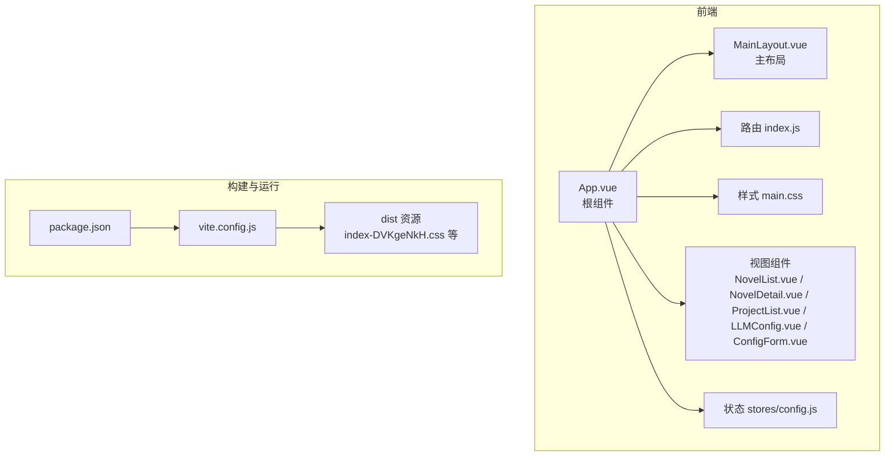
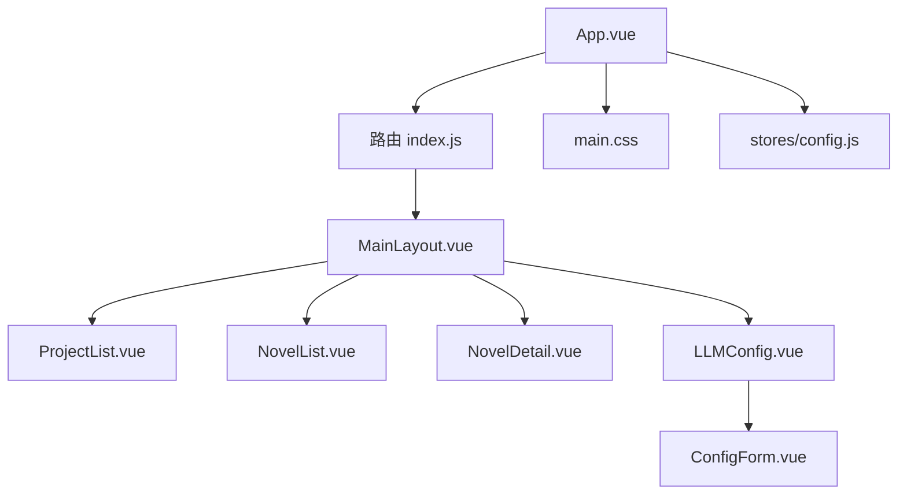
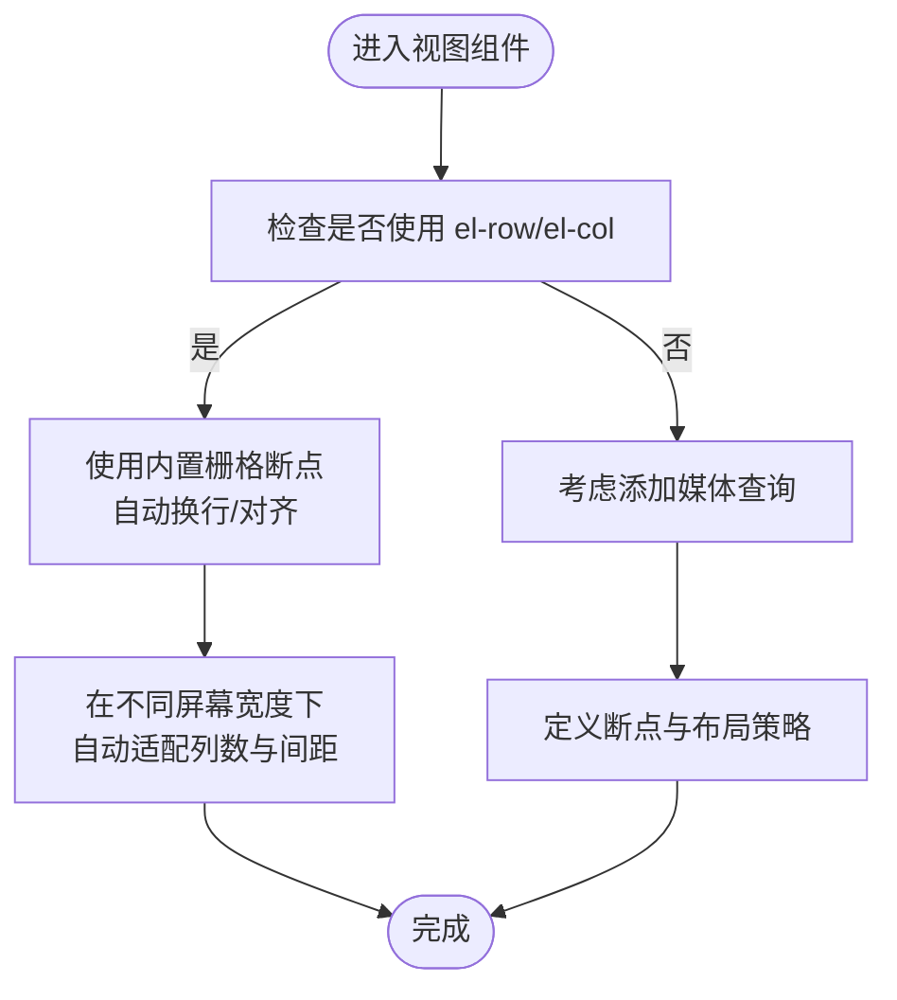
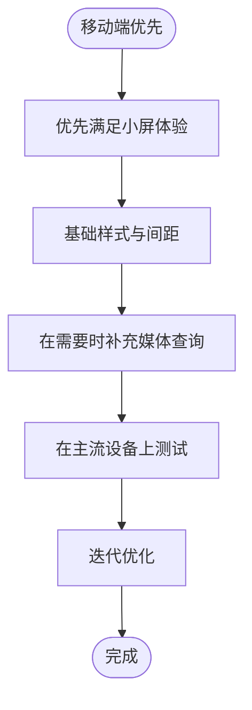
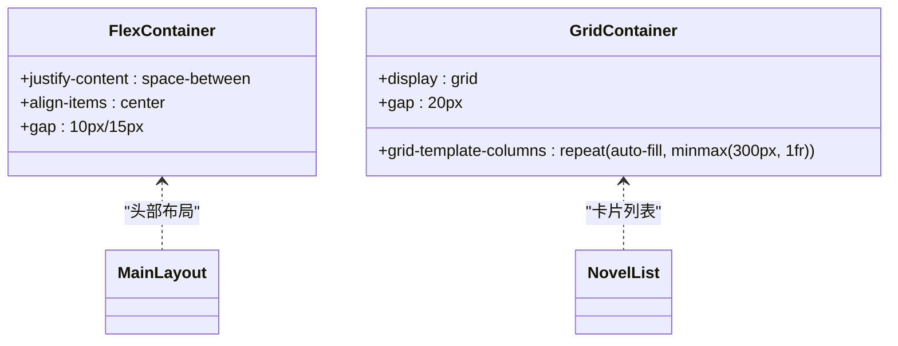
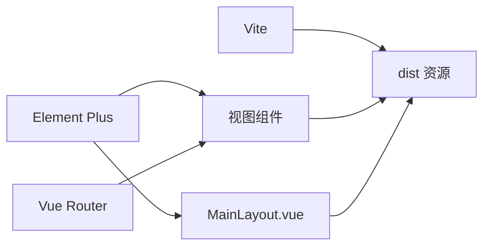

# 响应式设计

<cite>
**本文引用的文件**
- [main.css](file://frontend/src/styles/main.css)
- [App.vue](file://frontend/src/App.vue)
- [MainLayout.vue](file://frontend/src/layouts/MainLayout.vue)
- [NovelList.vue](file://frontend/src/views/novel/NovelList.vue)
- [NovelDetail.vue](file://frontend/src/views/novel/NovelDetail.vue)
- [ProjectList.vue](file://frontend/src/views/project/ProjectList.vue)
- [LLMConfig.vue](file://frontend/src/views/config/LLMConfig.vue)
- [ConfigForm.vue](file://frontend/src/views/config/components/ConfigForm.vue)
- [config.js](file://frontend/src/stores/config.js)
- [index.js](file://frontend/src/router/index.js)
- [package.json](file://frontend/package.json)
- [vite.config.js](file://frontend/vite.config.js)
- [index-DVKgeNkH.css](file://frontend/dist/assets/index-DVKgeNkH.css)
- [MainLayout-Q_LITRYk.css](file://frontend/dist/assets/MainLayout-Q_LITRYk.css)
- [NovelList-3QVeeQnZ.css](file://frontend/dist/assets/NovelList-3QVeeQnZ.css)
</cite>

## 目录
1. [简介](#简介)
2. [项目结构](#项目结构)
3. [核心组件](#核心组件)
4. [架构总览](#架构总览)
5. [详细组件分析](#详细组件分析)
6. [依赖关系分析](#依赖关系分析)
7. [性能考量](#性能考量)
8. [故障排查指南](#故障排查指南)
9. [结论](#结论)
10. [附录](#附录)

## 简介
本文件面向InkTrace项目的前端响应式设计，系统性梳理CSS媒体查询、弹性布局与栅格系统的使用现状，总结断点策略与移动端优先实践，阐述Flexbox与Grid在不同屏幕尺寸下的适配方式，并结合现有代码给出字体、间距与组件尺寸的响应式调整建议。同时，针对触摸交互、暗色主题与高对比度支持、图片与视频的响应式处理，以及性能优化与渲染性能考虑，提供可落地的改进建议与最佳实践。

## 项目结构
前端采用Vue 3 + Element Plus + Vite技术栈，样式通过全局样式与组件级scoped样式组织，路由采用history/hash混合模式，构建产物位于dist目录。整体结构清晰，便于扩展响应式能力。

**图表来源**
- [App.vue:1-17](file://frontend/src/App.vue#L1-L17)
- [MainLayout.vue:1-143](file://frontend/src/layouts/MainLayout.vue#L1-L143)
- [index.js:1-74](file://frontend/src/router/index.js#L1-L74)
- [main.css:1-72](file://frontend/src/styles/main.css#L1-L72)
- [package.json:1-24](file://frontend/package.json#L1-L24)
- [vite.config.js:1-28](file://frontend/vite.config.js#L1-L28)
- [index-DVKgeNkH.css:1-2](file://frontend/dist/assets/index-DVKgeNkH.css#L1-L2)

**章节来源**
- [App.vue:1-17](file://frontend/src/App.vue#L1-L17)
- [MainLayout.vue:1-143](file://frontend/src/layouts/MainLayout.vue#L1-L143)
- [index.js:1-74](file://frontend/src/router/index.js#L1-L74)
- [main.css:1-72](file://frontend/src/styles/main.css#L1-L72)
- [package.json:1-24](file://frontend/package.json#L1-L24)
- [vite.config.js:1-28](file://frontend/vite.config.js#L1-L28)

## 核心组件
- 全局样式与基础排版：通过全局样式统一字体、滚动条、容器与卡片等基础元素的默认表现，奠定响应式基础。
- 主布局：采用Element Plus容器与菜单组件，配合Flex布局实现头部、侧边栏与主内容区的自适应。
- 视图组件：使用Element Plus栅格系统（el-row/el-col）进行列布局，配合组件级scoped样式实现局部响应式。
- 配置页：在768px以下引入@media规则，对标题与状态展示进行移动端优化。

**章节来源**
- [main.css:1-72](file://frontend/src/styles/main.css#L1-L72)
- [MainLayout.vue:62-142](file://frontend/src/layouts/MainLayout.vue#L62-L142)
- [LLMConfig.vue:270-284](file://frontend/src/views/config/LLMConfig.vue#L270-L284)
- [NovelList.vue:123-202](file://frontend/src/views/novel/NovelList.vue#L123-L202)
- [NovelDetail.vue:326-431](file://frontend/src/views/novel/NovelDetail.vue#L326-L431)

## 架构总览
InkTrace前端采用“布局组件 + 视图组件 + 状态管理 + 路由”的分层架构。响应式策略主要依托：
- Element Plus内置栅格系统（el-col系列）在不同断点下自动换行与对齐。
- 全局CSS与组件scoped样式共同定义字体、间距、卡片与网格布局。
- 路由根据协议选择history或hash模式，保证在不同部署环境下的可访问性。

**图表来源**
- [index.js:1-74](file://frontend/src/router/index.js#L1-L74)
- [MainLayout.vue:1-143](file://frontend/src/layouts/MainLayout.vue#L1-L143)
- [ProjectList.vue:1-226](file://frontend/src/views/project/ProjectList.vue#L1-L226)
- [NovelList.vue:1-203](file://frontend/src/views/novel/NovelList.vue#L1-L203)
- [NovelDetail.vue:1-432](file://frontend/src/views/novel/NovelDetail.vue#L1-L432)
- [LLMConfig.vue:1-285](file://frontend/src/views/config/LLMConfig.vue#L1-L285)
- [ConfigForm.vue:1-309](file://frontend/src/views/config/components/ConfigForm.vue#L1-L309)
- [App.vue:1-17](file://frontend/src/App.vue#L1-L17)
- [main.css:1-72](file://frontend/src/styles/main.css#L1-L72)
- [config.js:1-240](file://frontend/src/stores/config.js#L1-L240)

## 详细组件分析

### 布局与栅格系统
- 主布局采用Element Plus容器与菜单，头部使用Flex布局，侧边栏与主内容区通过高度与阴影实现层次感。
- 视图组件普遍使用el-row/el-col进行两列/三列布局，例如小说详情页的信息卡与章节列表，以及配置页的工具卡片网格。
- Element Plus内置栅格系统在CSS层面提供了xs/sm/md/lg断点类（参考构建产物中的媒体查询），无需额外手写媒体查询即可实现响应式。

**图表来源**
- [MainLayout.vue:62-142](file://frontend/src/layouts/MainLayout.vue#L62-L142)
- [NovelDetail.vue:19-137](file://frontend/src/views/novel/NovelDetail.vue#L19-L137)
- [LLMConfig.vue:30-52](file://frontend/src/views/config/LLMConfig.vue#L30-L52)
- [index-DVKgeNkH.css:1-2](file://frontend/dist/assets/index-DVKgeNkH.css#L1-L2)

**章节来源**
- [MainLayout.vue:62-142](file://frontend/src/layouts/MainLayout.vue#L62-L142)
- [NovelDetail.vue:19-137](file://frontend/src/views/novel/NovelDetail.vue#L19-L137)
- [LLMConfig.vue:30-52](file://frontend/src/views/config/LLMConfig.vue#L30-L52)
- [index-DVKgeNkH.css:1-2](file://frontend/dist/assets/index-DVKgeNkH.css#L1-L2)

### 断点策略与移动端优先
- 现有代码在配置页中使用@media (max-width: 768px)对标题与状态展示进行优化，体现移动端优先思想。
- Element Plus内置断点覆盖常见移动设备宽度，建议在自定义样式中仅在必要时补充更细粒度的断点。

**图表来源**
- [LLMConfig.vue:270-284](file://frontend/src/views/config/LLMConfig.vue#L270-L284)

**章节来源**
- [LLMConfig.vue:270-284](file://frontend/src/views/config/LLMConfig.vue#L270-L284)

### Flexbox与Grid适配
- Flexbox：主布局头部采用Flex布局实现两端对齐与垂直居中；卡片悬停效果通过transform过渡增强交互反馈。
- Grid：全局样式中使用CSS Grid实现卡片列表的自适应网格，最小宽度与gap控制在不同屏幕下的密度与间距。

**图表来源**
- [MainLayout.vue:68-98](file://frontend/src/layouts/MainLayout.vue#L68-L98)
- [main.css:50-54](file://frontend/src/styles/main.css#L50-L54)
- [NovelList.vue:21-69](file://frontend/src/views/novel/NovelList.vue#L21-L69)

**章节来源**
- [MainLayout.vue:68-98](file://frontend/src/layouts/MainLayout.vue#L68-L98)
- [main.css:50-54](file://frontend/src/styles/main.css#L50-L54)
- [NovelList.vue:21-69](file://frontend/src/views/novel/NovelList.vue#L21-L69)

### 触摸设备交互优化与手势支持
- 现有组件普遍使用Element Plus提供的交互控件（按钮、卡片、表格、进度条等），这些控件在移动端具备基础的触摸反馈。
- 建议在需要的场景增加触摸友好的尺寸与间距，例如增大按钮与可点击区域的触控目标面积，减少密集排列导致的手指误触。

**章节来源**
- [NovelDetail.vue:52-73](file://frontend/src/views/novel/NovelDetail.vue#L52-L73)
- [ProjectList.vue:11-42](file://frontend/src/views/project/ProjectList.vue#L11-L42)

### 字体大小、间距与组件尺寸的响应式调整
- 字体：全局样式指定中文字体链，组件内标题、标签与描述采用相对字号，建议在小屏下进一步缩小字号权重。
- 间距：全局容器与卡片内边距在不同视图中保持一致，建议在小屏下适度减小以提升信息密度。
- 组件尺寸：Element Plus组件尺寸通过CSS变量与类名控制，可在媒体查询中按需调整组件的尺寸类（如size="large/small"）。

**章节来源**
- [main.css:10-12](file://frontend/src/styles/main.css#L10-L12)
- [NovelList.vue:147-158](file://frontend/src/views/novel/NovelList.vue#L147-L158)
- [LLMConfig.vue:179-189](file://frontend/src/views/config/LLMConfig.vue#L179-L189)

### 暗色主题与高对比度模式支持
- Element Plus提供深色模式与浅色模式切换能力，建议在应用根组件中启用深色模式开关，并在路由或全局样式中注入颜色变量。
- 高对比度：可通过CSS媒体查询与颜色变量在高对比度模式下强制使用高对比配色方案，确保可读性与可访问性。

**章节来源**
- [App.vue:2-4](file://frontend/src/App.vue#L2-L4)
- [index-DVKgeNkH.css:1-2](file://frontend/dist/assets/index-DVKgeNkH.css#L1-L2)

### 图片与视频的响应式处理
- 当前项目未见专门的图片/视频组件，建议在需要展示图片或视频的场景中：
  - 使用max-width: 100%与height: auto保证缩放；
  - 对于视频容器使用aspect-ratio或padding-bottom技巧维持比例；
  - 在小屏下限制最大宽度并居中显示，避免横向滚动。

**章节来源**
- [main.css:1-72](file://frontend/src/styles/main.css#L1-L72)

### 实际页面在不同设备上的显示效果与交互体验
- 小屏（<768px）：配置页标题与状态展示在768px以下进行堆叠与字号调整；卡片列表在小屏下列数减少，间距适当压缩。
- 中屏（768px及以上）：配置页采用横向布局，标题与状态展示更紧凑；网格布局在中屏下呈现更佳的密度与可读性。
- 大屏（>1200px）：主布局与视图组件在大屏下充分利用空间，卡片与表格在更大可视区域内保持良好可读性。

**章节来源**
- [LLMConfig.vue:270-284](file://frontend/src/views/config/LLMConfig.vue#L270-L284)
- [MainLayout-Q_LITRYk.css:1-2](file://frontend/dist/assets/MainLayout-Q_LITRYk.css#L1-L2)
- [NovelList-3QVeeQnZ.css:1-2](file://frontend/dist/assets/NovelList-3QVeeQnZ.css#L1-L2)

## 依赖关系分析
- Element Plus：提供UI组件、栅格系统、动画过渡与主题变量，是响应式布局的核心依赖。
- Vue Router：负责页面导航与标题设置，影响首屏加载与路由切换的交互体验。
- Vite：提供开发服务器与构建打包，支持静态资源与CSS产物输出。

**图表来源**
- [package.json:11-18](file://frontend/package.json#L11-L18)
- [index.js:1-74](file://frontend/src/router/index.js#L1-L74)
- [vite.config.js:1-28](file://frontend/vite.config.js#L1-L28)

**章节来源**
- [package.json:11-18](file://frontend/package.json#L11-L18)
- [index.js:1-74](file://frontend/src/router/index.js#L1-L74)
- [vite.config.js:1-28](file://frontend/vite.config.js#L1-L28)

## 性能考量
- 构建产物中包含大量Element Plus的CSS变量与过渡动画，建议在生产环境中开启CSS压缩与Tree Shaking，减少冗余样式。
- 路由采用history模式时需注意服务端配置，避免小概率的404问题导致回退至hash模式影响用户体验。
- 组件内使用骨架屏与滚动加载（如章节列表）有助于在弱网环境下提升感知性能。

**章节来源**
- [index-DVKgeNkH.css:1-2](file://frontend/dist/assets/index-DVKgeNkH.css#L1-L2)
- [index.js:61-66](file://frontend/src/router/index.js#L61-L66)
- [NovelDetail.vue:119-134](file://frontend/src/views/novel/NovelDetail.vue#L119-L134)

## 故障排查指南
- 路由模式问题：若在文件协议下打开页面出现路由异常，系统会自动切换为hash模式，属于预期行为。
- 配置状态：通过Pinia状态管理加载与更新配置，若初始化失败可检查网络请求与API返回值。
- 样式冲突：scoped样式与全局样式的优先级通常由Vue编译器处理，若出现意外覆盖，可检查选择器特异性与媒体查询顺序。

**章节来源**
- [index.js:61-66](file://frontend/src/router/index.js#L61-L66)
- [config.js:205-216](file://frontend/src/stores/config.js#L205-L216)

## 结论
InkTrace前端已具备良好的响应式基础：Element Plus栅格系统与Flex布局满足主流断点需求；全局样式与组件样式协同提供一致的视觉与交互体验。建议在现有基础上：
- 在768px以下补充更多媒体查询，细化小屏体验；
- 引入深色模式与高对比度支持，提升可访问性；
- 优化触摸交互目标尺寸，减少误触；
- 在生产构建中进一步精简CSS与优化首屏渲染。

## 附录
- 断点参考：Element Plus内置断点在构建产物中体现，建议在自定义样式中按需补充更细粒度的断点。
- 变量与主题：通过CSS变量与Element Plus主题系统统一管理颜色与尺寸，便于扩展深色模式与高对比度。

**章节来源**
- [index-DVKgeNkH.css:1-2](file://frontend/dist/assets/index-DVKgeNkH.css#L1-L2)