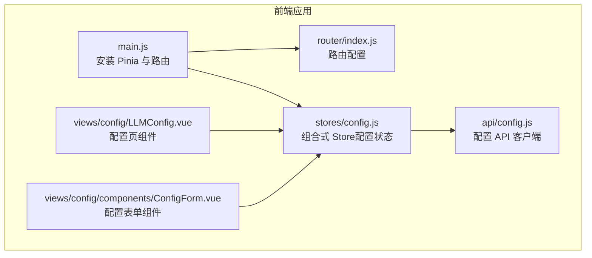
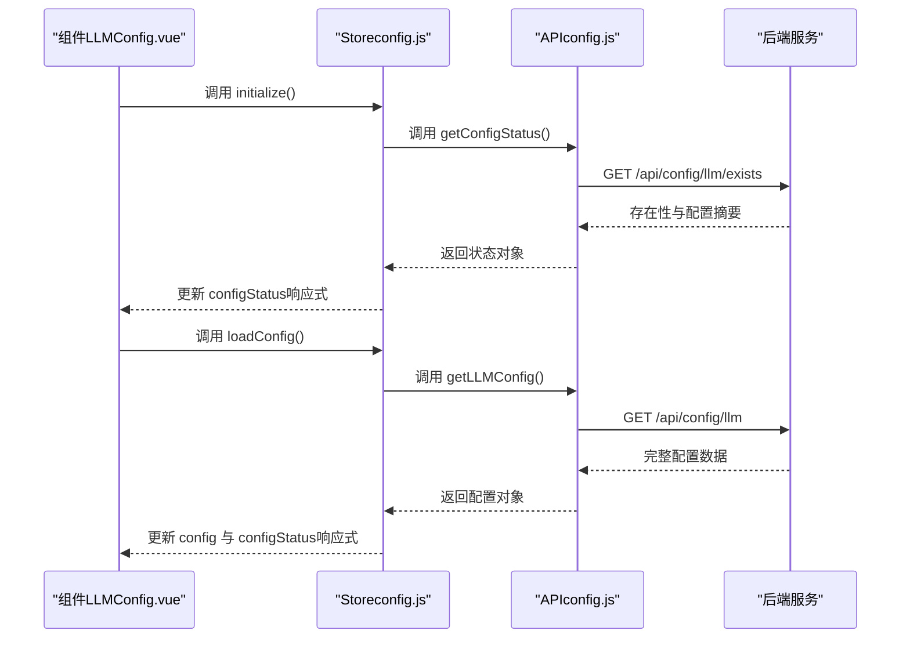
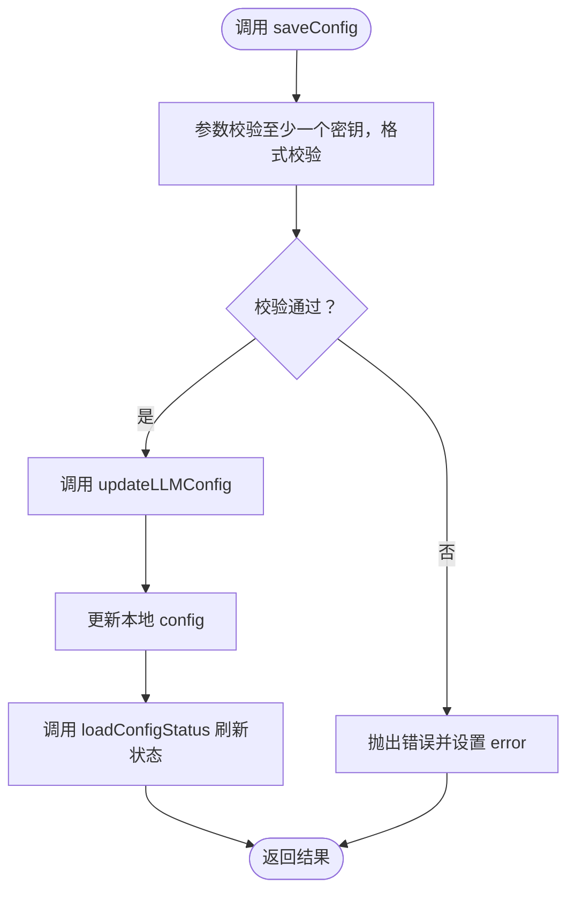
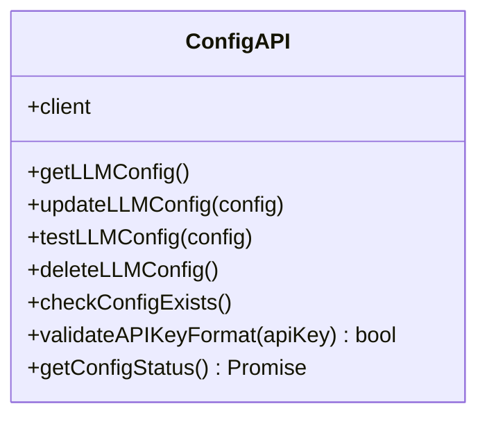
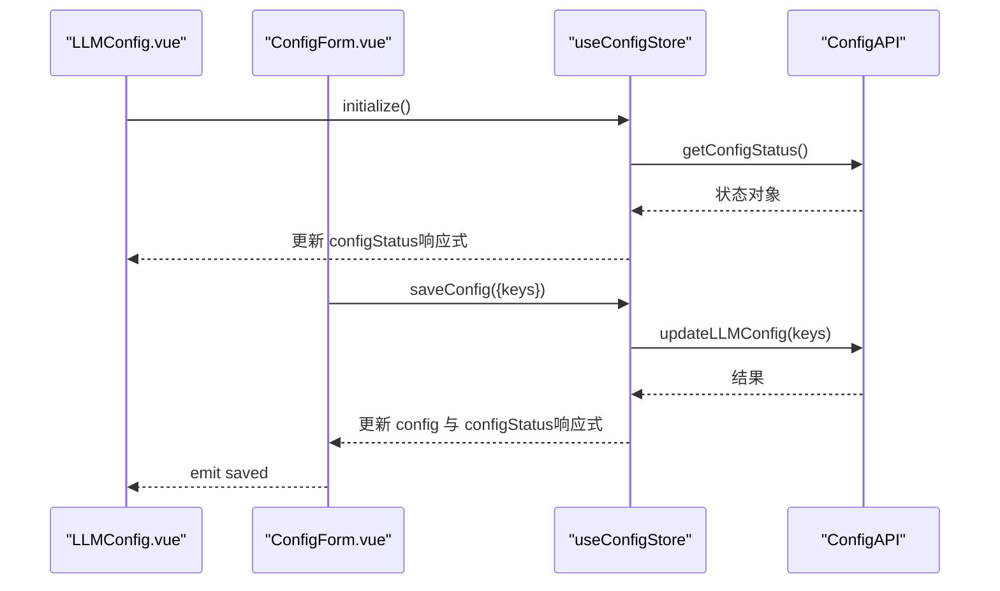
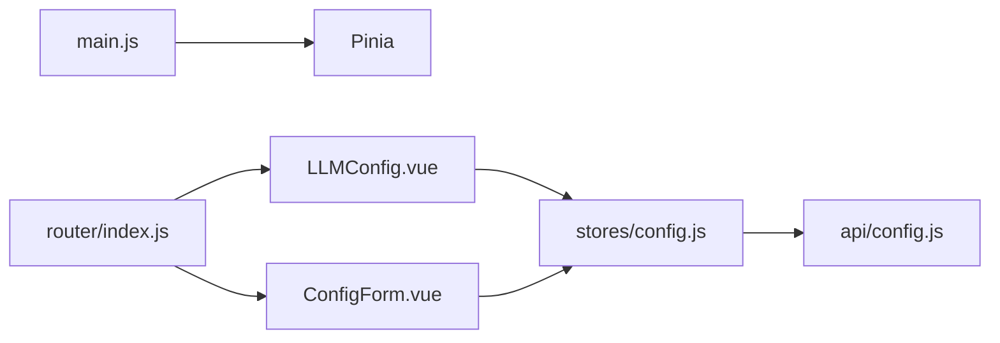

# 状态管理

<cite>
**本文引用的文件**
- [frontend/src/stores/config.js](file://frontend/src/stores/config.js)
- [frontend/src/api/config.js](file://frontend/src/api/config.js)
- [frontend/src/main.js](file://frontend/src/main.js)
- [frontend/src/views/config/LLMConfig.vue](file://frontend/src/views/config/LLMConfig.vue)
- [frontend/src/views/config/components/ConfigForm.vue](file://frontend/src/views/config/components/ConfigForm.vue)
- [frontend/src/router/index.js](file://frontend/src/router/index.js)
- [frontend/package.json](file://frontend/package.json)
</cite>

## 目录
1. [简介](#简介)
2. [项目结构](#项目结构)
3. [核心组件](#核心组件)
4. [架构总览](#架构总览)
5. [详细组件分析](#详细组件分析)
6. [依赖分析](#依赖分析)
7. [性能考虑](#性能考虑)
8. [故障排查指南](#故障排查指南)
9. [结论](#结论)
10. [附录](#附录)

## 简介
本文件系统性梳理 InkTrace 前端的状态管理方案，聚焦 Pinia 在组合式 Store（Composition API）下的使用与实践。内容涵盖状态定义与计算属性、异步 Action 的组织、组件与 Store 的绑定与响应式更新、错误与加载状态管理、以及与后端 API 的交互流程。文档同时给出调试与性能优化建议，并总结最佳实践与常见陷阱。

## 项目结构
InkTrace 前端采用 Vue 3 + Pinia 架构，状态集中在 stores 目录下，通过组合式 Store 定义状态、计算属性与 Action；视图层在组件中通过组合式 API 使用 Store 并驱动 UI 响应式更新；路由负责页面级导航与标题设置；API 层封装了与后端的通信逻辑。

**图表来源**
- [frontend/src/main.js:1-23](file://frontend/src/main.js#L1-L23)
- [frontend/src/router/index.js:1-74](file://frontend/src/router/index.js#L1-L74)
- [frontend/src/stores/config.js:1-240](file://frontend/src/stores/config.js#L1-L240)
- [frontend/src/views/config/LLMConfig.vue:1-285](file://frontend/src/views/config/LLMConfig.vue#L1-L285)
- [frontend/src/views/config/components/ConfigForm.vue:1-309](file://frontend/src/views/config/components/ConfigForm.vue#L1-L309)
- [frontend/src/api/config.js:1-195](file://frontend/src/api/config.js#L1-L195)

**章节来源**
- [frontend/src/main.js:1-23](file://frontend/src/main.js#L1-L23)
- [frontend/src/router/index.js:1-74](file://frontend/src/router/index.js#L1-L74)
- [frontend/package.json:1-24](file://frontend/package.json#L1-L24)

## 核心组件
- 组合式 Store（配置状态）
  - 状态：ref 定义的配置对象与状态标记、加载与错误标志
  - 计算属性：基于状态派生的布尔值与便捷判断
  - 异步 Action：加载配置、保存配置、测试连接、删除配置、刷新状态、初始化等
  - 返回值：将状态、计算属性与 Action 暴露给组件使用
- API 客户端（配置）
  - 封装 axios 实例，统一请求/响应拦截
  - 提供获取配置、更新配置、测试配置、删除配置、检查存在性、格式校验、获取状态等方法
- 视图组件
  - 配置页组件：展示配置状态、触发初始化、处理删除等
  - 配置表单组件：表单校验、保存与测试、错误提示、与 Store 同步

**章节来源**
- [frontend/src/stores/config.js:14-240](file://frontend/src/stores/config.js#L14-L240)
- [frontend/src/api/config.js:19-195](file://frontend/src/api/config.js#L19-L195)
- [frontend/src/views/config/LLMConfig.vue:103-165](file://frontend/src/views/config/LLMConfig.vue#L103-L165)
- [frontend/src/views/config/components/ConfigForm.vue:96-246](file://frontend/src/views/config/components/ConfigForm.vue#L96-L246)

## 架构总览
下图展示了“组件 -> Store -> API -> 后端”的典型调用链路，以及 Store 内部的状态流转与计算属性的使用。

**图表来源**
- [frontend/src/views/config/LLMConfig.vue:156-164](file://frontend/src/views/config/LLMConfig.vue#L156-L164)
- [frontend/src/stores/config.js:205-216](file://frontend/src/stores/config.js#L205-L216)
- [frontend/src/api/config.js:166-188](file://frontend/src/api/config.js#L166-L188)

## 详细组件分析

### Store 设计与数据流（config.js）
- 状态定义
  - 配置对象：包含多个 LLM 相关密钥字段
  - 状态标记：存在性、有效性、各模型配置状态、最后更新时间
  - 控制状态：loading、error
- 计算属性
  - hasConfig、isConfigured、needsConfiguration 基于 configStatus 派生
- 异步 Action
  - loadConfig：拉取完整配置并更新本地状态
  - saveConfig：参数校验、调用更新接口、回写本地状态并刷新状态
  - testConfig：调用测试接口，返回测试结果
  - deleteConfig：删除配置并清空本地状态
  - loadConfigStatus：刷新状态（存在性、有效性、配置项标记）
  - initialize：先刷新状态，再按需加载完整配置
  - clearError/resetConfig：辅助清理错误与重置表单
- 数据流与副作用
  - 所有 Action 内部统一设置 loading 与 error，finally 中统一复位
  - 保存成功后主动刷新状态，保证 UI 与后端一致
  - 错误通过 error 暴露，组件可监听并在 UI 上提示

**图表来源**
- [frontend/src/stores/config.js:75-107](file://frontend/src/stores/config.js#L75-L107)
- [frontend/src/api/config.js:82-98](file://frontend/src/api/config.js#L82-L98)

**章节来源**
- [frontend/src/stores/config.js:14-240](file://frontend/src/stores/config.js#L14-L240)

### API 客户端（config.js）
- axios 实例
  - 自动拼接 baseURL（开发/文件协议与生产环境区分）
  - 超时与通用头设置
- 拦截器
  - 请求日志与错误处理
  - 响应拦截：统一提取 data，对不同错误分支抛出可读异常
- 方法
  - getLLMConfig/updateLLMConfig/testLLMConfig/deleteLLMConfig/checkConfigExists
  - validateAPIKeyFormat：基础格式校验
  - getConfigStatus：聚合配置与存在性，生成 configStatus

**图表来源**
- [frontend/src/api/config.js:19-195](file://frontend/src/api/config.js#L19-L195)

**章节来源**
- [frontend/src/api/config.js:19-195](file://frontend/src/api/config.js#L19-L195)

### 组件绑定与响应式更新（LLMConfig.vue 与 ConfigForm.vue）
- 组件使用
  - 通过组合式 API 获取 Store 实例，直接读取状态与计算属性
  - 在生命周期或事件回调中调用 Store 的 Action
- 响应式更新
  - Store 状态为 ref，组件模板与逻辑自动响应变化
  - 表单组件通过 watch 监听 Store.error，同步显示错误
- 交互流程
  - 配置页初始化：调用 initialize，根据状态决定是否加载完整配置
  - 表单保存：执行 saveConfig，成功后通知父组件并提示
  - 连接测试：执行 testConfig，展示测试结果
  - 删除配置：调用 deleteConfig，清空本地状态并提示

**图表来源**
- [frontend/src/views/config/LLMConfig.vue:103-165](file://frontend/src/views/config/LLMConfig.vue#L103-L165)
- [frontend/src/views/config/components/ConfigForm.vue:96-246](file://frontend/src/views/config/components/ConfigForm.vue#L96-L246)
- [frontend/src/stores/config.js:205-216](file://frontend/src/stores/config.js#L205-L216)
- [frontend/src/api/config.js:82-98](file://frontend/src/api/config.js#L82-L98)

**章节来源**
- [frontend/src/views/config/LLMConfig.vue:103-165](file://frontend/src/views/config/LLMConfig.vue#L103-L165)
- [frontend/src/views/config/components/ConfigForm.vue:96-246](file://frontend/src/views/config/components/ConfigForm.vue#L96-L246)

## 依赖分析
- 应用入口
  - main.js 安装 Pinia，使全局可用
- 路由
  - router/index.js 定义页面路由，包含配置页
- 依赖
  - package.json 指定 vue、vue-router、pinia、axios 等

**图表来源**
- [frontend/src/main.js:18](file://frontend/src/main.js#L18)
- [frontend/src/router/index.js:52-56](file://frontend/src/router/index.js#L52-L56)
- [frontend/src/stores/config.js:7](file://frontend/src/stores/config.js#L7)
- [frontend/src/api/config.js:7](file://frontend/src/api/config.js#L7)

**章节来源**
- [frontend/src/main.js:1-23](file://frontend/src/main.js#L1-L23)
- [frontend/src/router/index.js:1-74](file://frontend/src/router/index.js#L1-L74)
- [frontend/package.json:11-18](file://frontend/package.json#L11-L18)

## 性能考虑
- 状态粒度
  - 将配置对象与状态标记拆分，避免不必要的响应式开销
  - 仅在需要时加载完整配置，减少初始渲染压力
- 异步处理
  - 统一在 Action 内设置 loading/error，避免重复渲染
  - 成功后立即刷新状态，减少二次请求
- 组件层面
  - 使用计算属性派生布尔值，降低模板复杂度
  - 表单组件通过 watch 同步错误，避免深层嵌套监听

## 故障排查指南
- 常见问题
  - 保存失败：检查 API 返回的错误消息，确认至少配置一个密钥且格式满足要求
  - 加载失败：确认后端服务运行正常，网络可达
  - 删除后仍显示配置：确认前端已调用 deleteConfig 并清空本地状态
- 调试建议
  - 在 API 客户端中启用请求/响应日志，定位具体错误
  - 在组件中监听 Store.error 并提示用户
  - 使用浏览器开发者工具观察 Store 状态变化与组件渲染次数

**章节来源**
- [frontend/src/api/config.js:30-64](file://frontend/src/api/config.js#L30-L64)
- [frontend/src/stores/config.js:63-106](file://frontend/src/stores/config.js#L63-L106)

## 结论
InkTrace 的状态管理以 Pinia 组合式 Store 为核心，围绕“配置状态”建立了清晰的数据流与交互边界：Store 负责状态与异步 Action，API 客户端负责与后端通信，组件通过组合式 API 与 Store 绑定并驱动 UI 响应式更新。该模式具备良好的可维护性与扩展性，适合在多页面、多异步场景下持续演进。

## 附录
- 状态持久化与本地存储策略
  - 当前实现中，Store 仅维护内存状态；若需持久化，可在初始化阶段从本地存储读取，并在关键状态变更时写入本地存储
- 状态调试工具
  - 可结合浏览器 Vue DevTools 查看 Store 状态与变更轨迹
- 最佳实践与常见陷阱
  - 最佳实践
    - 将 UI 控制状态（如 loading/error）与业务状态分离
    - 在 Action 内统一处理错误与 finally 复位
    - 使用计算属性派生 UI 用布尔值，减少模板复杂度
  - 常见陷阱
    - 忽略 finally 中的 loading 复位，导致 UI 卡死
    - 在组件内直接修改 Store 的深层对象而非整体替换，影响响应式追踪