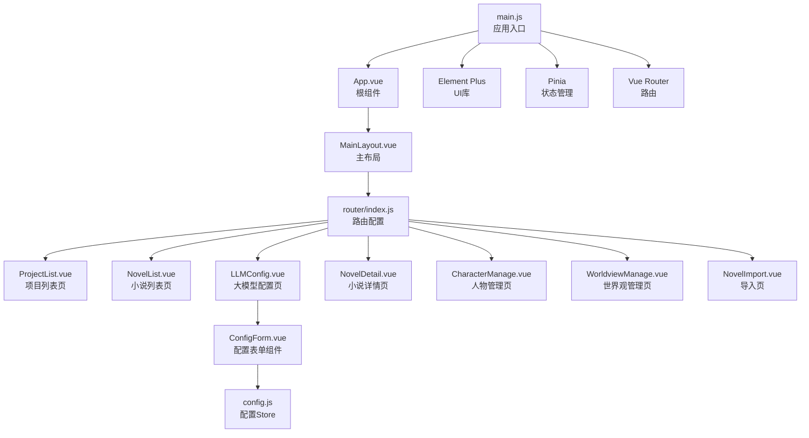
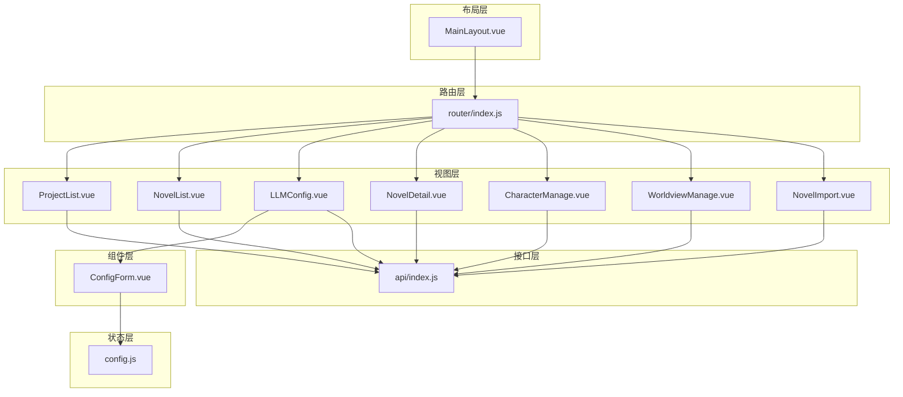
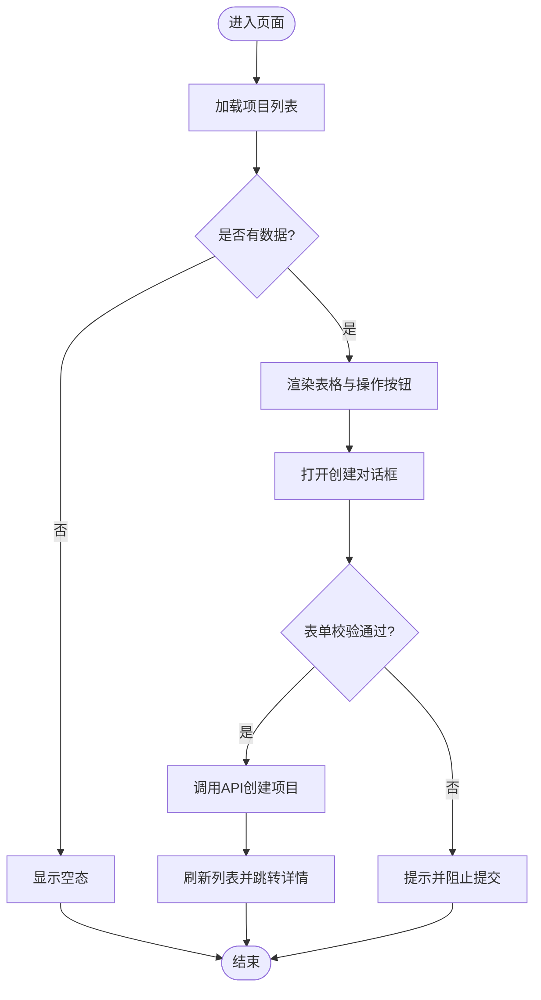
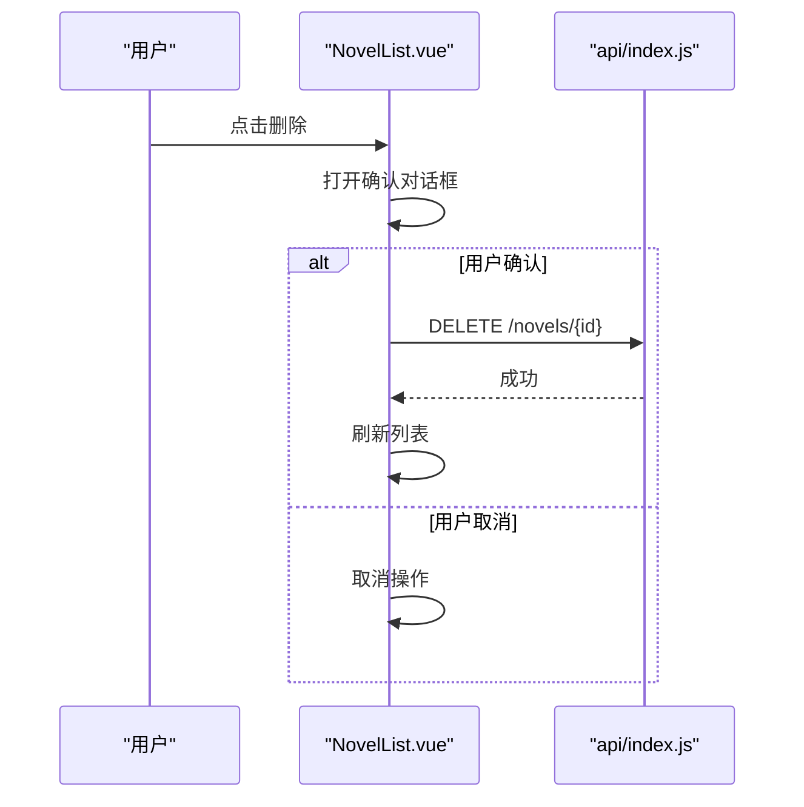
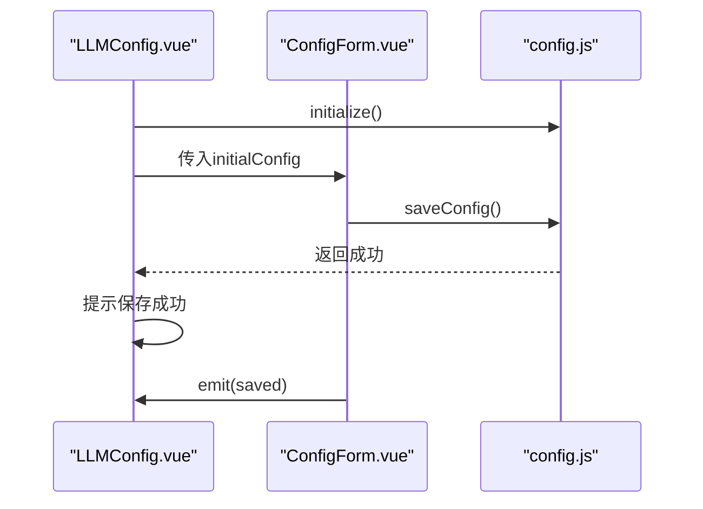
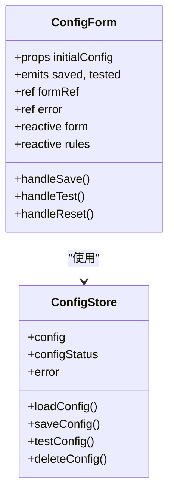
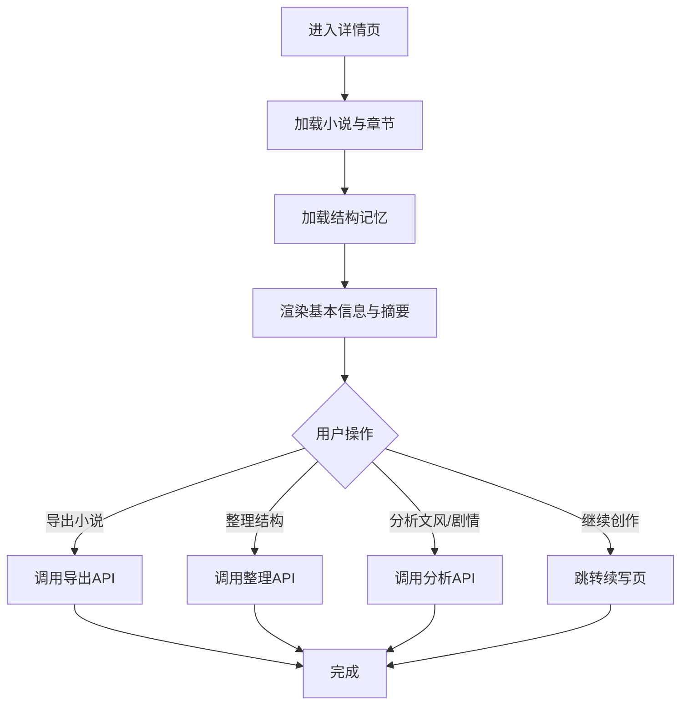
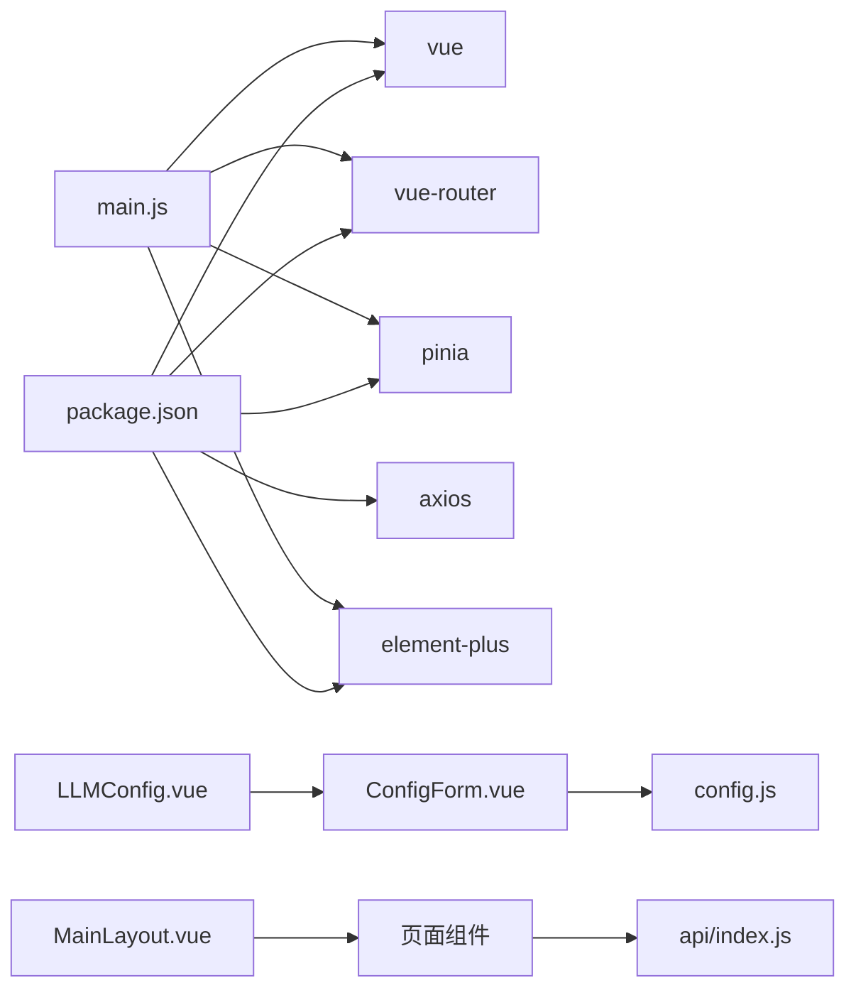

# 组件系统设计

<cite>
**本文引用的文件**
- [App.vue](file://frontend/src/App.vue)
- [main.js](file://frontend/src/main.js)
- [MainLayout.vue](file://frontend/src/layouts/MainLayout.vue)
- [router/index.js](file://frontend/src/router/index.js)
- [ProjectList.vue](file://frontend/src/views/project/ProjectList.vue)
- [NovelList.vue](file://frontend/src/views/novel/NovelList.vue)
- [ConfigForm.vue](file://frontend/src/views/config/components/ConfigForm.vue)
- [LLMConfig.vue](file://frontend/src/views/config/LLMConfig.vue)
- [config.js](file://frontend/src/stores/config.js)
- [index.js](file://frontend/src/api/index.js)
- [NovelDetail.vue](file://frontend/src/views/novel/NovelDetail.vue)
- [CharacterManage.vue](file://frontend/src/views/character/CharacterManage.vue)
- [WorldviewManage.vue](file://frontend/src/views/worldview/WorldviewManage.vue)
- [NovelImport.vue](file://frontend/src/views/novel/NovelImport.vue)
- [package.json](file://frontend/package.json)
</cite>

## 目录
1. [引言](#引言)
2. [项目结构](#项目结构)
3. [核心组件](#核心组件)
4. [架构总览](#架构总览)
5. [详细组件分析](#详细组件分析)
6. [依赖分析](#依赖分析)
7. [性能考虑](#性能考虑)
8. [故障排查指南](#故障排查指南)
9. [结论](#结论)
10. [附录](#附录)

## 引言
本文件面向InkTrace项目的前端组件系统，系统性梳理Vue组件的分类与设计原则，明确页面级组件、业务组件与通用组件的边界；阐述props传递、事件发射与插槽使用；总结父子、兄弟与跨层级通信模式；给出组件复用策略与组合式API应用要点；说明生命周期管理与状态提升；提供开发规范与命名约定；并结合现有代码示例给出测试策略与调试技巧。

## 项目结构
前端采用Vue 3 + Vue Router + Pinia + Element Plus技术栈，路由采用嵌套路由组织页面，布局组件统一承载导航与内容区，视图组件负责具体业务页面，配置组件封装表单与状态逻辑，API层抽象HTTP调用，Pinia Store集中管理全局状态。

图表来源
- [main.js:1-23](file://frontend/src/main.js#L1-L23)
- [App.vue:1-17](file://frontend/src/App.vue#L1-L17)
- [MainLayout.vue:1-143](file://frontend/src/layouts/MainLayout.vue#L1-L143)
- [router/index.js:1-74](file://frontend/src/router/index.js#L1-L74)
- [ProjectList.vue:1-226](file://frontend/src/views/project/ProjectList.vue#L1-L226)
- [NovelList.vue:1-203](file://frontend/src/views/novel/NovelList.vue#L1-L203)
- [LLMConfig.vue:1-285](file://frontend/src/views/config/LLMConfig.vue#L1-L285)
- [ConfigForm.vue:1-309](file://frontend/src/views/config/components/ConfigForm.vue#L1-L309)
- [config.js:1-240](file://frontend/src/stores/config.js#L1-L240)
- [NovelDetail.vue:1-432](file://frontend/src/views/novel/NovelDetail.vue#L1-L432)
- [CharacterManage.vue:1-385](file://frontend/src/views/character/CharacterManage.vue#L1-L385)
- [WorldviewManage.vue:1-463](file://frontend/src/views/worldview/WorldviewManage.vue#L1-L463)
- [NovelImport.vue:1-217](file://frontend/src/views/novel/NovelImport.vue#L1-L217)

章节来源
- [main.js:1-23](file://frontend/src/main.js#L1-L23)
- [App.vue:1-17](file://frontend/src/App.vue#L1-L17)
- [MainLayout.vue:1-143](file://frontend/src/layouts/MainLayout.vue#L1-L143)
- [router/index.js:1-74](file://frontend/src/router/index.js#L1-L74)

## 核心组件
- 页面级组件：负责路由级别的页面容器与业务编排，如项目列表、小说列表、配置页、详情页、人物管理、世界观管理、导入页等。它们通常包含完整的业务流程、状态管理与交互。
- 业务组件：在页面内承担特定业务职责的组件，如配置表单组件，封装表单校验、保存、测试等逻辑，并通过事件向上汇报状态变化。
- 通用组件：基于Element Plus构建的通用UI组件，如表格、表单、对话框、步骤条、标签、进度条等，用于页面级组件与业务组件复用。

章节来源
- [ProjectList.vue:1-226](file://frontend/src/views/project/ProjectList.vue#L1-L226)
- [NovelList.vue:1-203](file://frontend/src/views/novel/NovelList.vue#L1-L203)
- [LLMConfig.vue:1-285](file://frontend/src/views/config/LLMConfig.vue#L1-L285)
- [ConfigForm.vue:1-309](file://frontend/src/views/config/components/ConfigForm.vue#L1-L309)
- [NovelDetail.vue:1-432](file://frontend/src/views/novel/NovelDetail.vue#L1-L432)
- [CharacterManage.vue:1-385](file://frontend/src/views/character/CharacterManage.vue#L1-L385)
- [WorldviewManage.vue:1-463](file://frontend/src/views/worldview/WorldviewManage.vue#L1-L463)
- [NovelImport.vue:1-217](file://frontend/src/views/novel/NovelImport.vue#L1-L217)

## 架构总览
InkTrace前端采用“布局-路由-视图-组件-状态-接口”的分层架构：
- 布局层：MainLayout提供统一导航与内容区过渡动画。
- 路由层：router/index.js定义嵌套路由，子路由指向各页面级组件。
- 视图层：页面级组件承载业务逻辑与用户交互。
- 组件层：业务组件（如ConfigForm）封装可复用的业务能力。
- 状态层：Pinia Store集中管理配置状态，页面通过store读取与更新。
- 接口层：API模块封装Axios实例与错误拦截，统一封装各业务API。

图表来源
- [MainLayout.vue:1-143](file://frontend/src/layouts/MainLayout.vue#L1-L143)
- [router/index.js:1-74](file://frontend/src/router/index.js#L1-L74)
- [ProjectList.vue:1-226](file://frontend/src/views/project/ProjectList.vue#L1-L226)
- [NovelList.vue:1-203](file://frontend/src/views/novel/NovelList.vue#L1-L203)
- [LLMConfig.vue:1-285](file://frontend/src/views/config/LLMConfig.vue#L1-L285)
- [ConfigForm.vue:1-309](file://frontend/src/views/config/components/ConfigForm.vue#L1-L309)
- [config.js:1-240](file://frontend/src/stores/config.js#L1-L240)
- [index.js:1-119](file://frontend/src/api/index.js#L1-L119)

## 详细组件分析

### 页面级组件：项目列表（ProjectList）
- 设计原则
  - 使用卡片容器承载表格与对话框，保证信息层次清晰。
  - 通过加载状态与空态组件优化用户体验。
  - 将业务动作（新建、归档、删除）封装为独立方法，便于维护。
- Props/事件/插槽
  - 无外部props输入。
  - 通过事件发射与父组件解耦（本组件内部无向上emit）。
  - 使用具名插槽渲染表格列与操作按钮。
- 通信模式
  - 父子通信：与表格、表单、对话框等子组件通过响应式数据双向绑定。
  - 跨层级：通过API模块与后端交互，状态通过本地ref管理。
- 生命周期与状态提升
  - 在挂载时加载项目列表；创建项目后刷新列表。
- 复用策略
  - 将格式化函数、日期处理抽离为工具函数，减少重复逻辑。

图表来源
- [ProjectList.vue:126-211](file://frontend/src/views/project/ProjectList.vue#L126-L211)

章节来源
- [ProjectList.vue:1-226](file://frontend/src/views/project/ProjectList.vue#L1-L226)

### 页面级组件：小说列表（NovelList）
- 设计原则
  - 使用骨架屏与空态组件提升弱网体验。
  - 卡片式布局与悬停效果增强交互反馈。
  - 进度条与统计信息直观展示创作进度。
- Props/事件/插槽
  - 无外部props输入。
  - 通过事件触发删除确认与路由跳转。
- 通信模式
  - 子父通信：对话框确认通过Promise链路返回结果。
  - 跨层级：通过API模块与后端交互。
- 生命周期与状态提升
  - 挂载时加载小说列表；删除后刷新。

图表来源
- [NovelList.vue:103-116](file://frontend/src/views/novel/NovelList.vue#L103-L116)
- [index.js:43-48](file://frontend/src/api/index.js#L43-L48)

章节来源
- [NovelList.vue:1-203](file://frontend/src/views/novel/NovelList.vue#L1-L203)

### 页面级组件：大模型配置（LLMConfig）
- 设计原则
  - 将配置状态、表单与说明三部分分离，结构清晰。
  - 通过Store初始化配置状态，避免重复加载。
- Props/事件/插槽
  - 通过props传入初始配置对象。
  - 通过emit向上汇报“保存”“测试”事件，供父组件处理。
- 通信模式
  - 父子通信：ConfigForm负责表单逻辑，LLMConfig负责页面编排与状态提示。
  - 跨层级：Store集中管理配置状态与错误信息。
- 生命周期与状态提升
  - 挂载时初始化配置状态；保存后提示成功。

图表来源
- [LLMConfig.vue:156-164](file://frontend/src/views/config/LLMConfig.vue#L156-L164)
- [ConfigForm.vue:170-193](file://frontend/src/views/config/components/ConfigForm.vue#L170-L193)
- [config.js:205-216](file://frontend/src/stores/config.js#L205-L216)

章节来源
- [LLMConfig.vue:1-285](file://frontend/src/views/config/LLMConfig.vue#L1-L285)
- [ConfigForm.vue:1-309](file://frontend/src/views/config/components/ConfigForm.vue#L1-L309)
- [config.js:1-240](file://frontend/src/stores/config.js#L1-L240)

### 业务组件：配置表单（ConfigForm）
- 设计原则
  - 使用组合式API管理表单数据、校验规则与错误状态。
  - 通过watch监听Store错误，实现错误同步。
  - 通过emit向上汇报保存与测试结果。
- Props/事件/插槽
  - props: initialConfig（初始配置对象）
  - emits: saved、tested
  - 插槽：表单项前缀图标等。
- 通信模式
  - 父子通信：接收父组件传入的初始配置，向上emit事件。
  - 跨层级：通过Store进行状态持久化与错误管理。

图表来源
- [ConfigForm.vue:102-246](file://frontend/src/views/config/components/ConfigForm.vue#L102-L246)
- [config.js:14-240](file://frontend/src/stores/config.js#L14-L240)

章节来源
- [ConfigForm.vue:1-309](file://frontend/src/views/config/components/ConfigForm.vue#L1-L309)
- [config.js:1-240](file://frontend/src/stores/config.js#L1-L240)

### 页面级组件：小说详情（NovelDetail）
- 设计原则
  - 使用折叠面板与描述列表组织结构摘要，支持展开/收起。
  - 使用对话框展示复杂分析结果（文风、剧情）。
  - 通过计算属性对内存数据进行二次加工，降低模板复杂度。
- 通信模式
  - 子父通信：通过路由参数与API交互获取数据。
  - 跨层级：通过API模块与后端交互。

图表来源
- [NovelDetail.vue:239-323](file://frontend/src/views/novel/NovelDetail.vue#L239-L323)

章节来源
- [NovelDetail.vue:1-432](file://frontend/src/views/novel/NovelDetail.vue#L1-L432)

### 页面级组件：人物管理（CharacterManage）
- 设计原则
  - 使用树形控件展示角色分类，支持搜索过滤。
  - 分Tab页组织基本信息、关系与状态历史，结构清晰。
  - 通过对话框管理新增与编辑流程。
- 通信模式
  - 子父通信：树节点点击选择角色，表格与表单联动。
  - 跨层级：通过API模块与后端交互。

章节来源
- [CharacterManage.vue:1-385](file://frontend/src/views/character/CharacterManage.vue#L1-L385)

### 页面级组件：世界观管理（WorldviewManage）
- 设计原则
  - 使用选项卡组织多个子系统的管理界面（力量体系、功法、势力、地点、物品）。
  - 通过对话框管理新增实体，统一表单结构。
  - 提供一致性检查功能，展示问题列表。
- 通信模式
  - 子父通信：Tab切换与表单交互。
  - 跨层级：通过API模块与后端交互。

章节来源
- [WorldviewManage.vue:1-463](file://frontend/src/views/worldview/WorldviewManage.vue#L1-L463)

### 页面级组件：导入小说（NovelImport）
- 设计原则
  - 表单校验与步骤条结合，引导用户完成导入流程。
  - 通过消息提示与步骤状态反馈进度。
  - 导入完成后写入会话提示，引导后续创作。
- 通信模式
  - 子父通信：表单校验与步骤控制。
  - 跨层级：通过API模块与后端交互。

章节来源
- [NovelImport.vue:1-217](file://frontend/src/views/novel/NovelImport.vue#L1-L217)

## 依赖分析
- 技术栈依赖
  - Vue 3、Vue Router、Pinia、Element Plus、Axios。
- 组件间依赖
  - LLMConfig依赖ConfigForm与config Store。
  - 各页面组件依赖API模块与Element Plus UI组件。
  - MainLayout为路由子组件提供统一布局与过渡动画。

图表来源
- [package.json:1-24](file://frontend/package.json#L1-L24)
- [main.js:1-23](file://frontend/src/main.js#L1-L23)
- [LLMConfig.vue:106-110](file://frontend/src/views/config/LLMConfig.vue#L106-L110)
- [ConfigForm.vue:100-100](file://frontend/src/views/config/components/ConfigForm.vue#L100-L100)
- [config.js:1-240](file://frontend/src/stores/config.js#L1-L240)
- [index.js:1-119](file://frontend/src/api/index.js#L1-L119)
- [MainLayout.vue:1-143](file://frontend/src/layouts/MainLayout.vue#L1-L143)

章节来源
- [package.json:1-24](file://frontend/package.json#L1-L24)
- [main.js:1-23](file://frontend/src/main.js#L1-L23)

## 性能考虑
- 路由过渡动画：MainLayout使用过渡组件实现页面切换的淡入淡出，提升视觉流畅度。
- 条件渲染与骨架屏：NovelList在加载时使用骨架屏，减少白屏时间。
- 计算属性缓存：NovelDetail对内存数据进行计算属性转换，避免模板中重复处理。
- API错误拦截：统一的Axios拦截器将错误消息转化为用户可理解的消息，减少异常传播成本。

## 故障排查指南
- 配置相关
  - 若配置保存失败，检查Store中的错误字段与API返回；通过ConfigForm的错误提示定位问题。
  - 若测试连接失败，查看测试结果与错误消息，确认密钥格式与网络连通性。
- 列表加载
  - 小说列表为空时，确认后端数据是否存在；检查API拦截器中的错误映射。
- 导入流程
  - 导入过程中出现异常，检查步骤状态与API调用链，确认文件路径与权限。

章节来源
- [ConfigForm.vue:187-189](file://frontend/src/views/config/components/ConfigForm.vue#L187-L189)
- [config.js:63-67](file://frontend/src/stores/config.js#L63-L67)
- [index.js:18-41](file://frontend/src/api/index.js#L18-L41)
- [NovelImport.vue:172-178](file://frontend/src/views/novel/NovelImport.vue#L172-L178)

## 结论
InkTrace前端组件系统以布局-路由-视图-组件-状态-接口为主线，形成清晰的分层与职责划分。页面级组件承载业务流程，业务组件封装可复用能力，通用组件提供一致的UI体验。通过组合式API与Pinia Store实现状态集中管理，配合Axios拦截器统一处理错误，整体具备良好的可维护性与扩展性。

## 附录

### 组件分类与设计原则
- 页面级组件
  - 职责：承载完整业务流程与页面布局。
  - 特点：包含较多交互与状态管理，模板复杂度较高。
  - 示例：ProjectList、NovelList、LLMConfig、NovelDetail、CharacterManage、WorldviewManage、NovelImport。
- 业务组件
  - 职责：封装特定业务能力，如表单、对话框、列表等。
  - 特点：高内聚、低耦合，可通过props与events与父组件通信。
  - 示例：ConfigForm。
- 通用组件
  - 职责：提供基础UI能力，如表格、表单、按钮、对话框等。
  - 特点：可跨页面复用，尽量保持无状态或最小状态。

### 组件通信模式
- 父子通信
  - 通过props向下传递数据，通过events向上汇报状态变化。
  - 示例：LLMConfig向ConfigForm传递initialConfig，ConfigForm通过saved与tested事件向上汇报。
- 兄弟组件通信
  - 通过共同父组件协调，或通过Store共享状态。
  - 示例：页面内多个对话框与表单通过父组件状态协调。
- 跨层级通信
  - 通过Store集中管理全局状态，或通过事件总线（本项目未使用）。
  - 示例：ConfigForm通过useConfigStore访问与更新配置状态。

### 组件复用策略与组合式API
- 复用策略
  - 将通用UI封装为通用组件，如表格、表单、对话框等。
  - 将业务逻辑抽取为可复用的composables或Store actions。
- 组合式API
  - 使用ref、reactive、computed、watch等API管理组件状态。
  - 将生命周期钩子（onMounted等）与业务逻辑结合，保持组件简洁。

### 生命周期管理与状态提升
- 生命周期管理
  - 在onMounted中执行初始化加载；在onUnmounted中清理资源（如有）。
- 状态提升
  - 将共享状态提升至Store，避免多处重复管理。
  - 对于页面内临时状态，保持在组件内部ref中。

### 开发规范与命名约定
- 文件命名
  - 页面组件：名词短语，如ProjectList.vue、NovelDetail.vue。
  - 业务组件：名词短语，如ConfigForm.vue。
- 组件命名
  - 页面组件：采用名词短语，首字母大写。
  - 业务组件：采用名词短语，首字母大写。
- Props命名
  - 使用camelCase，语义明确，必要时提供默认值与类型声明。
- Events命名
  - 使用camelCase，动词短语，描述事件动作，如saved、tested。
- 插槽命名
  - 使用语义化名称，如header、default、footer等。

### 组件测试策略与调试技巧
- 单元测试
  - 对组合式API逻辑（如计算属性、watch、方法）进行单元测试。
  - 对Store actions进行mock API测试，覆盖成功与失败分支。
- 集成测试
  - 对页面组件进行端到端测试，覆盖关键流程（如导入、保存、删除）。
- 调试技巧
  - 使用浏览器开发者工具观察组件状态与事件流。
  - 在API拦截器中打印请求与响应，快速定位接口问题。
  - 对复杂流程使用步骤条或日志输出，辅助定位问题。