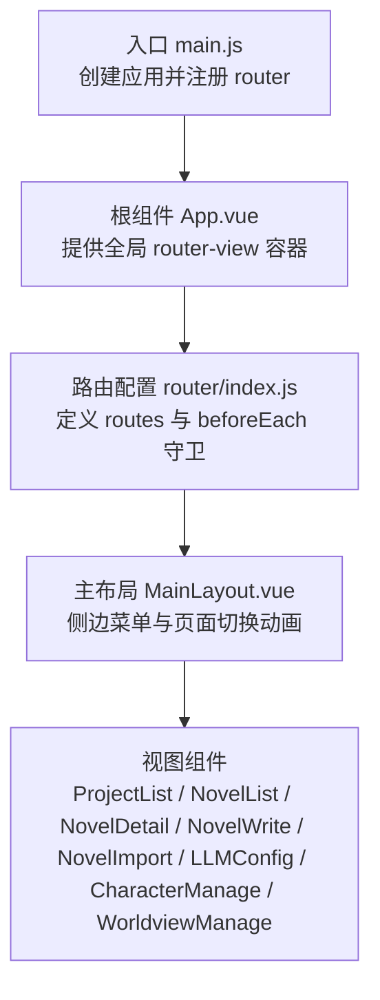
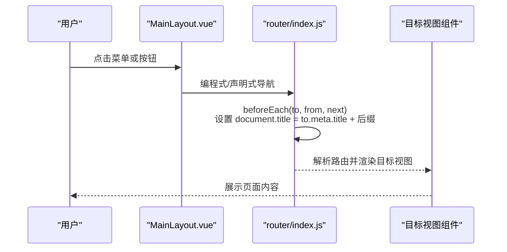
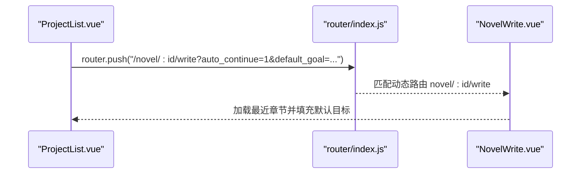
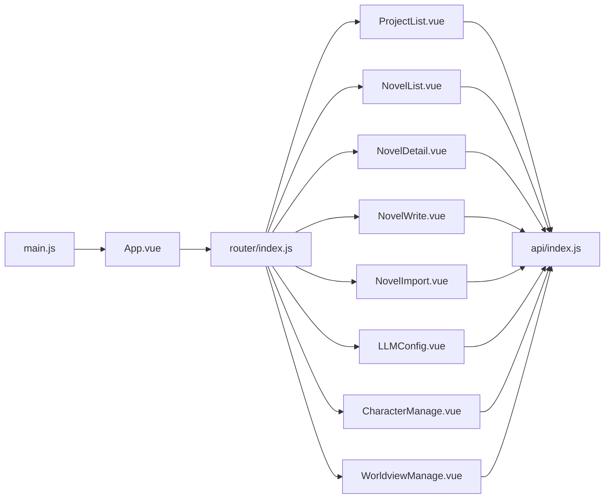

# 路由导航

<cite>
**本文引用的文件**
- [frontend/src/router/index.js](file://frontend/src/router/index.js)
- [frontend/src/main.js](file://frontend/src/main.js)
- [frontend/src/App.vue](file://frontend/src/App.vue)
- [frontend/src/layouts/MainLayout.vue](file://frontend/src/layouts/MainLayout.vue)
- [frontend/src/views/project/ProjectList.vue](file://frontend/src/views/project/ProjectList.vue)
- [frontend/src/views/novel/NovelList.vue](file://frontend/src/views/novel/NovelList.vue)
- [frontend/src/views/novel/NovelDetail.vue](file://frontend/src/views/novel/NovelDetail.vue)
- [frontend/src/views/novel/NovelWrite.vue](file://frontend/src/views/novel/NovelWrite.vue)
- [frontend/src/views/novel/NovelImport.vue](file://frontend/src/views/novel/NovelImport.vue)
- [frontend/src/views/config/LLMConfig.vue](file://frontend/src/views/config/LLMConfig.vue)
- [frontend/src/views/character/CharacterManage.vue](file://frontend/src/views/character/CharacterManage.vue)
- [frontend/src/views/worldview/WorldviewManage.vue](file://frontend/src/views/worldview/WorldviewManage.vue)
- [frontend/src/stores/config.js](file://frontend/src/stores/config.js)
- [frontend/src/api/index.js](file://frontend/src/api/index.js)
- [frontend/vite.config.js](file://frontend/vite.config.js)
- [frontend/package.json](file://frontend/package.json)
</cite>

## 目录
1. [简介](#简介)
2. [项目结构](#项目结构)
3. [核心组件](#核心组件)
4. [架构总览](#架构总览)
5. [详细组件分析](#详细组件分析)
6. [依赖分析](#依赖分析)
7. [性能考虑](#性能考虑)
8. [故障排查指南](#故障排查指南)
9. [结论](#结论)
10. [附录](#附录)

## 简介
本文件围绕 InkTrace 前端的路由导航体系，系统化梳理 Vue Router 的配置与使用方式，涵盖路由定义、嵌套路由、动态路由匹配、导航拦截与页面标题管理、编程式导航与声明式导航、路由懒加载与代码分割、路由参数与查询字符串处理、以及页面切换过渡动画等主题。文档同时结合项目中的实际组件与交互，给出可操作的实践建议与可视化图示。

## 项目结构
InkTrace 前端采用标准的 Vue 3 + Vite 工程结构，路由集中于 router 模块，视图组件位于 views 下，布局组件位于 layouts，入口在 main.js 中挂载。

图表来源
- [frontend/src/main.js:1-23](file://frontend/src/main.js#L1-L23)
- [frontend/src/App.vue:1-17](file://frontend/src/App.vue#L1-L17)
- [frontend/src/router/index.js:1-74](file://frontend/src/router/index.js#L1-L74)
- [frontend/src/layouts/MainLayout.vue:1-143](file://frontend/src/layouts/MainLayout.vue#L1-L143)

章节来源
- [frontend/src/main.js:1-23](file://frontend/src/main.js#L1-L23)
- [frontend/src/App.vue:1-17](file://frontend/src/App.vue#L1-L17)
- [frontend/src/router/index.js:1-74](file://frontend/src/router/index.js#L1-L74)

## 核心组件
- 路由配置与守卫
  - 路由定义：采用嵌套路由，根路径 '/' 对应主布局，子路由包括项目管理、小说列表、小说详情、续写、人物管理、世界观管理、导入小说、大模型配置等。
  - 动态路由：使用路径参数 ':id' 实现对具体小说的动态访问。
  - 导航拦截与页面标题：通过 beforeEach 守卫设置 document.title，标题来源于路由元信息 meta.title。
  - 历史模式选择：根据协议自动选择 history 或 hash 模式，适配本地文件协议场景。
- 布局与导航
  - 主布局 MainLayout 提供顶部标题区与左侧菜单，菜单项通过 Element Plus el-menu 的 router 属性启用声明式导航。
  - 页面切换使用 transition 包裹 router-view，实现淡入淡出过渡。
- 视图组件与导航
  - 多处使用编程式导航：router.push(...) 进行页面跳转，常用于创建/导入完成后自动进入目标页面。
  - 查询字符串处理：在编程式导航中传入 query 参数，用于携带初始目标、自动继续等状态。
- 路由懒加载与代码分割
  - 所有视图组件均通过动态 import 实现懒加载，配合 Vite 构建自动进行代码分割，提升首屏性能。
- API 与状态
  - API 封装统一处理响应与错误消息，视图组件通过 API 与后端交互，驱动路由跳转与状态变更。

章节来源
- [frontend/src/router/index.js:3-71](file://frontend/src/router/index.js#L3-L71)
- [frontend/src/layouts/MainLayout.vue:18-52](file://frontend/src/layouts/MainLayout.vue#L18-L52)
- [frontend/src/views/project/ProjectList.vue:150-183](file://frontend/src/views/project/ProjectList.vue#L150-L183)
- [frontend/src/views/novel/NovelList.vue:5-6](file://frontend/src/views/novel/NovelList.vue#L5-L6)
- [frontend/src/views/novel/NovelDetail.vue:5-16](file://frontend/src/views/novel/NovelDetail.vue#L5-L16)
- [frontend/src/views/novel/NovelWrite.vue:5-11](file://frontend/src/views/novel/NovelWrite.vue#L5-L11)
- [frontend/src/views/novel/NovelImport.vue:56-61](file://frontend/src/views/novel/NovelImport.vue#L56-L61)
- [frontend/src/api/index.js:1-119](file://frontend/src/api/index.js#L1-L119)

## 架构总览
下图展示了路由、布局与视图之间的交互关系，以及导航拦截与页面标题更新流程。

图表来源
- [frontend/src/router/index.js:68-71](file://frontend/src/router/index.js#L68-L71)
- [frontend/src/layouts/MainLayout.vue:18-52](file://frontend/src/layouts/MainLayout.vue#L18-L52)

## 详细组件分析

### 路由配置与嵌套路由
- 根路由 '/' 使用 MainLayout 作为容器，并重定向至 '/projects'。
- 子路由覆盖项目管理、小说列表、小说详情、续写、人物管理、世界观管理、导入小说、大模型配置等。
- 动态路由匹配：'novel/:id' 用于进入指定小说的详情页、续写页、人物管理页、世界观管理页。
- 元信息 meta.title 用于页面标题与面包屑文案的基础来源。

章节来源
- [frontend/src/router/index.js:3-59](file://frontend/src/router/index.js#L3-L59)

### 导航拦截与页面标题管理
- beforeEach 守卫统一设置 document.title，标题格式为“页面标题 - InkTrace Novel AI”，页面标题来源于路由 meta.title。
- 该机制保证每次路由切换都同步更新浏览器标题，提升用户体验与 SEO 友好性。

章节来源
- [frontend/src/router/index.js:68-71](file://frontend/src/router/index.js#L68-L71)

### 声明式导航与编程式导航
- 声明式导航：MainLayout 的 el-menu 设置 router=true，菜单项的 index 即为路由路径，点击即触发导航。
- 编程式导航：各视图组件在业务逻辑中调用 router.push(...)，如创建项目后跳转续写页、导入完成后跳转小说详情页等。
- 查询字符串处理：在 router.push(...) 中通过 query 传递参数，如自动继续创作的提示与默认目标。

图表来源
- [frontend/src/views/project/ProjectList.vue:170-172](file://frontend/src/views/project/ProjectList.vue#L170-L172)
- [frontend/src/views/novel/NovelWrite.vue:245-269](file://frontend/src/views/novel/NovelWrite.vue#L245-L269)

章节来源
- [frontend/src/layouts/MainLayout.vue:18-39](file://frontend/src/layouts/MainLayout.vue#L18-L39)
- [frontend/src/views/project/ProjectList.vue:150-183](file://frontend/src/views/project/ProjectList.vue#L150-L183)
- [frontend/src/views/novel/NovelImport.vue:168-170](file://frontend/src/views/novel/NovelImport.vue#L168-L170)
- [frontend/src/views/novel/NovelWrite.vue:245-269](file://frontend/src/views/novel/NovelWrite.vue#L245-L269)

### 路由懒加载与代码分割
- 所有视图组件均通过动态 import 实现懒加载，避免一次性加载全部资源。
- Vite 在构建阶段自动进行代码分割，生成独立 chunk，降低首屏体积与加载时间。

章节来源
- [frontend/src/router/index.js:6-56](file://frontend/src/router/index.js#L6-L56)
- [frontend/vite.config.js:1-27](file://frontend/vite.config.js#L1-L27)

### 页面切换过渡动画
- MainLayout 的 router-view 外层包裹 transition，使用 name="fade" 实现页面切换的淡入淡出效果。
- 过渡类名 fade-enter-active、fade-leave-active、fade-enter-from、fade-leave-to 在组件内定义，控制透明度变化。

章节来源
- [frontend/src/layouts/MainLayout.vue:48-52](file://frontend/src/layouts/MainLayout.vue#L48-L52)
- [frontend/src/layouts/MainLayout.vue:133-141](file://frontend/src/layouts/MainLayout.vue#L133-L141)

### 路由参数与查询字符串处理
- 动态路由参数：通过路由定义中的 ':id' 获取小说 ID，视图组件使用 useRoute() 读取 $route.params.id。
- 查询参数：通过 router.push(...) 的 query 传递参数，视图组件使用 $route.query 读取。
- 示例：续写页在首次进入时读取 auto_continue 与 default_goal，并结合 sessionStorage 的提示信息进行引导。

章节来源
- [frontend/src/views/novel/NovelDetail.vue:190](file://frontend/src/views/novel/NovelDetail.vue#L190)
- [frontend/src/views/novel/NovelWrite.vue:245-269](file://frontend/src/views/novel/NovelWrite.vue#L245-L269)

### 面包屑导航与页面标题
- 页面标题：由 beforeEach 守卫统一设置，标题文本来自路由 meta.title。
- 面包屑：当前代码未实现专门的面包屑组件，但可通过路由 meta.title 与当前路由路径组合实现基础面包屑。
- 建议：在布局或工具函数中根据 $route.matched 生成面包屑路径，结合 meta.title 显示层级结构。

章节来源
- [frontend/src/router/index.js:68-71](file://frontend/src/router/index.js#L68-L71)

### 权限控制与导航守卫
- 当前路由未实现全局或局部的权限守卫。若需加入权限控制，可在 beforeEach 中增加鉴权逻辑，如判断登录状态、角色权限等，必要时重定向至登录页或 403 页面。
- 若未来引入更细粒度的权限，可在路由 meta 中扩展字段（如 roles、requireAuth），并在守卫中读取并校验。

章节来源
- [frontend/src/router/index.js:68-71](file://frontend/src/router/index.js#L68-L71)

### API 与导航联动
- API 封装统一处理响应与错误消息，视图组件在成功后触发 router.push(...) 完成页面跳转。
- 示例：导入完成后，通过 sessionStorage 传递提示信息，续写页在 mounted 时读取并展示。

章节来源
- [frontend/src/api/index.js:1-119](file://frontend/src/api/index.js#L1-L119)
- [frontend/src/views/novel/NovelImport.vue:159-170](file://frontend/src/views/novel/NovelImport.vue#L159-L170)
- [frontend/src/views/novel/NovelWrite.vue:245-269](file://frontend/src/views/novel/NovelWrite.vue#L245-L269)

## 依赖分析
- 路由与应用集成
  - main.js 注册 router 并挂载应用，App.vue 提供根级 router-view。
  - router/index.js 定义路由与守卫，history 模式根据协议自动选择。
- 视图与路由
  - 各视图组件通过编程式导航与查询参数实现业务流转，配合 API 与状态管理完成数据驱动的导航。
- 构建与代理
  - vite.config.js 配置了开发服务器代理，便于前后端联调；生产构建输出 dist。

图表来源
- [frontend/src/main.js:1-23](file://frontend/src/main.js#L1-L23)
- [frontend/src/App.vue:1-17](file://frontend/src/App.vue#L1-L17)
- [frontend/src/router/index.js:1-74](file://frontend/src/router/index.js#L1-L74)
- [frontend/src/api/index.js:1-119](file://frontend/src/api/index.js#L1-L119)

章节来源
- [frontend/src/main.js:1-23](file://frontend/src/main.js#L1-L23)
- [frontend/src/router/index.js:1-74](file://frontend/src/router/index.js#L1-L74)
- [frontend/src/api/index.js:1-119](file://frontend/src/api/index.js#L1-L119)

## 性能考虑
- 路由懒加载：所有视图组件均采用动态 import，减少初始包体，提升首屏速度。
- 代码分割：Vite 自动拆分 chunk，配合路由懒加载，进一步优化加载性能。
- 过渡动画：仅使用透明度变化的轻量过渡，避免复杂动画带来的性能开销。
- 建议：对于大型视图组件，可考虑在组件内部再做子组件的异步加载；对频繁切换的页面，可评估 keep-alive 缓存策略。

## 故障排查指南
- 页面标题未更新
  - 检查路由 meta.title 是否正确设置，确认 beforeEach 守卫执行。
  - 参考：[frontend/src/router/index.js:68-71](file://frontend/src/router/index.js#L68-L71)
- 导航后页面不跳转或参数丢失
  - 确认编程式导航的路径与参数拼接正确，查询参数使用 query 传递。
  - 参考：[frontend/src/views/project/ProjectList.vue:170-172](file://frontend/src/views/project/ProjectList.vue#L170-L172)
- 动态路由无法匹配
  - 确认路由定义中的 ':id' 与视图组件读取的 $route.params.id 一致。
  - 参考：[frontend/src/views/novel/NovelDetail.vue:190](file://frontend/src/views/novel/NovelDetail.vue#L190)
- 开发环境接口 404
  - 检查 vite 代理配置与后端服务端口，确保 '/api' 代理指向正确地址。
  - 参考：[frontend/vite.config.js:15-20](file://frontend/vite.config.js#L15-L20)
- 错误消息未显示
  - API 封装已统一拦截错误并弹窗，若未出现提示，检查网络请求与后端返回结构。
  - 参考：[frontend/src/api/index.js:28-41](file://frontend/src/api/index.js#L28-L41)

章节来源
- [frontend/src/router/index.js:68-71](file://frontend/src/router/index.js#L68-L71)
- [frontend/src/views/project/ProjectList.vue:170-172](file://frontend/src/views/project/ProjectList.vue#L170-L172)
- [frontend/src/views/novel/NovelDetail.vue:190](file://frontend/src/views/novel/NovelDetail.vue#L190)
- [frontend/vite.config.js:15-20](file://frontend/vite.config.js#L15-L20)
- [frontend/src/api/index.js:28-41](file://frontend/src/api/index.js#L28-L41)

## 结论
InkTrace 的路由导航体系以 Vue Router 为核心，采用嵌套路由与动态路由匹配满足多层级页面需求；通过 beforeEach 守卫统一管理页面标题；视图组件广泛使用编程式导航与查询参数实现业务流转；配合路由懒加载与过渡动画，兼顾性能与体验。未来可在权限控制、面包屑与更精细的状态管理方面进一步增强。

## 附录
- 版本与依赖
  - Vue 3、Vue Router 4、Element Plus、Vite 等版本信息可参考 package.json。
  - 参考：[frontend/package.json:1-24](file://frontend/package.json#L1-L24)