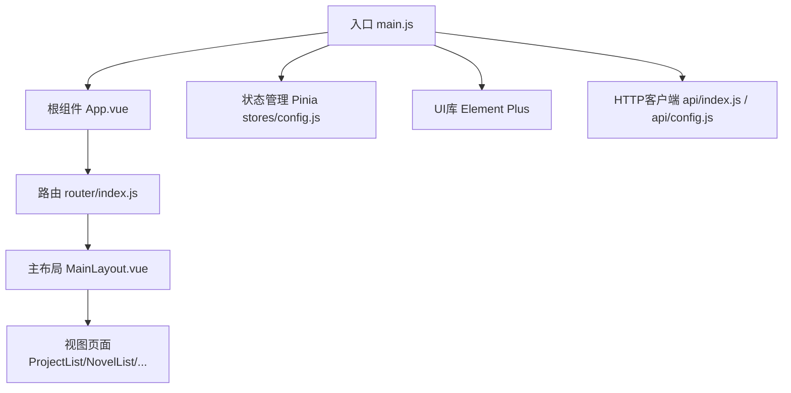
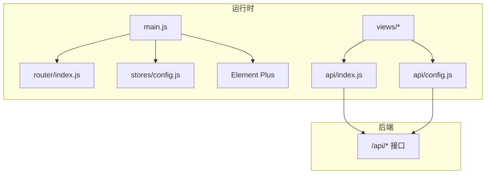
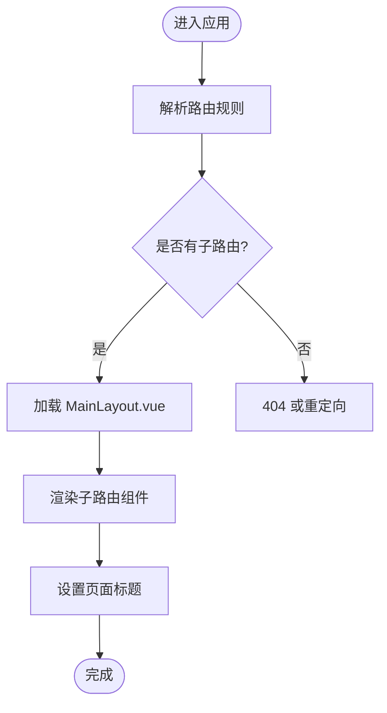
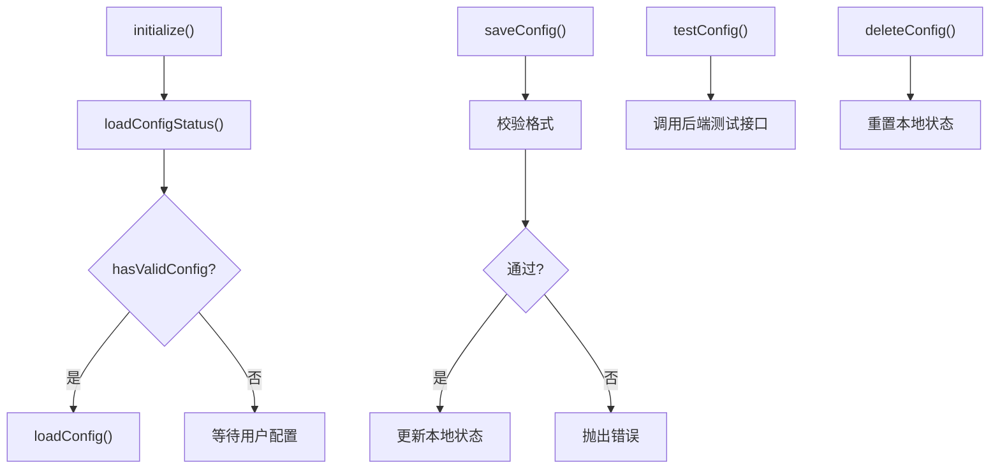
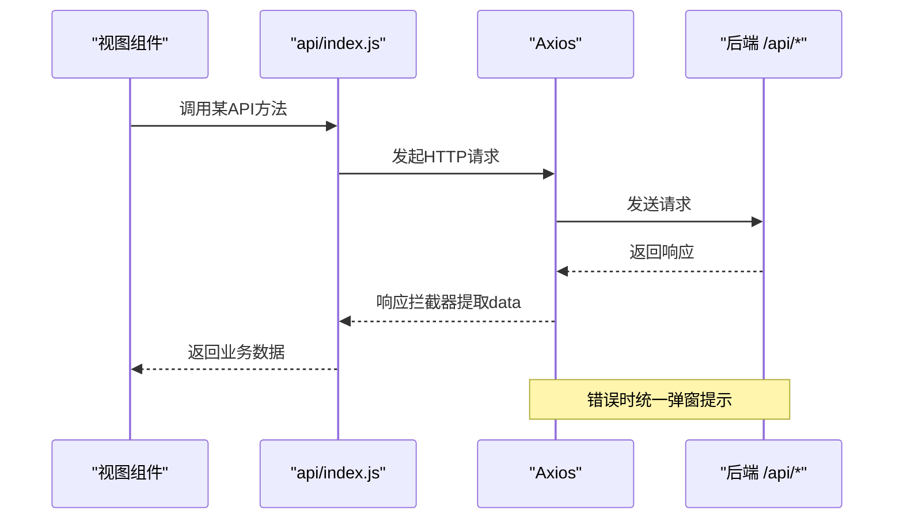
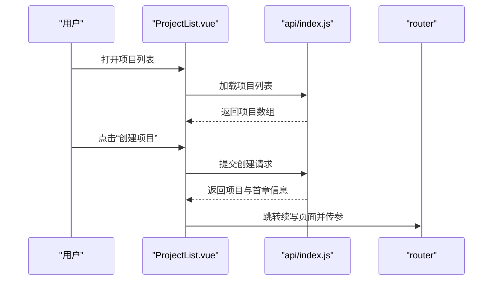
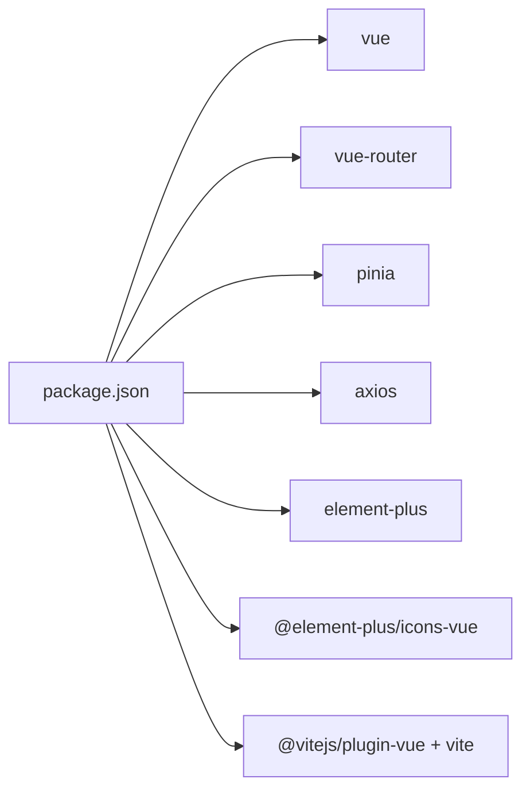

# 前端系统

<cite>
**本文引用的文件**
- [frontend/src/main.js](file://frontend/src/main.js)
- [frontend/src/App.vue](file://frontend/src/App.vue)
- [frontend/src/router/index.js](file://frontend/src/router/index.js)
- [frontend/src/layouts/MainLayout.vue](file://frontend/src/layouts/MainLayout.vue)
- [frontend/src/stores/config.js](file://frontend/src/stores/config.js)
- [frontend/src/api/index.js](file://frontend/src/api/index.js)
- [frontend/src/api/config.js](file://frontend/src/api/config.js)
- [frontend/src/views/project/ProjectList.vue](file://frontend/src/views/project/ProjectList.vue)
- [frontend/src/views/novel/NovelList.vue](file://frontend/src/views/novel/NovelList.vue)
- [frontend/src/views/novel/NovelDetail.vue](file://frontend/src/views/novel/NovelDetail.vue)
- [frontend/src/views/novel/NovelWrite.vue](file://frontend/src/views/novel/NovelWrite.vue)
- [frontend/src/views/character/CharacterManage.vue](file://frontend/src/views/character/CharacterManage.vue)
- [frontend/src/views/worldview/WorldviewManage.vue](file://frontend/src/views/worldview/WorldviewManage.vue)
- [frontend/src/views/config/LLMConfig.vue](file://frontend/src/views/config/LLMConfig.vue)
- [frontend/src/views/config/components/ConfigForm.vue](file://frontend/src/views/config/components/ConfigForm.vue)
- [frontend/src/styles/main.css](file://frontend/src/styles/main.css)
- [frontend/package.json](file://frontend/package.json)
- [frontend/vite.config.js](file://frontend/vite.config.js)
</cite>

## 目录
1. [简介](#简介)
2. [项目结构](#项目结构)
3. [核心组件](#核心组件)
4. [架构总览](#架构总览)
5. [详细组件分析](#详细组件分析)
6. [依赖分析](#依赖分析)
7. [性能考虑](#性能考虑)
8. [故障排查指南](#故障排查指南)
9. [结论](#结论)
10. [附录](#附录)

## 简介
本文件面向InkTrace前端系统的开发者与维护者，系统化梳理基于Vue3 + Element Plus的单页应用架构，涵盖组件层次、状态管理（Pinia）、路由配置（Vue Router）、前后端API集成、页面功能实现、最佳实践、响应式与用户体验优化、构建与部署流程以及调试技巧。文档以“可读性优先”的原则组织，既适合初学者快速上手，也便于资深工程师深入分析与优化。

## 项目结构
前端工程位于仓库根目录的frontend子目录，采用Vite作为构建工具，使用Vue3 Composition API与Element Plus UI库。核心目录与职责如下：
- src/main.js：应用入口，注册插件、挂载应用
- src/App.vue：根组件，提供语言环境与全局样式容器
- src/router/index.js：路由定义与导航守卫
- src/layouts/MainLayout.vue：主布局与侧边菜单
- src/stores/config.js：配置状态管理（Pinia）
- src/api/index.js：通用API模块聚合
- src/api/config.js：配置类API客户端
- src/views/*：页面级组件，按功能域划分
- src/styles/main.css：全局样式与通用布局
- vite.config.js：开发服务器、代理与构建配置
- package.json：依赖与脚本

图表来源
- [frontend/src/main.js:1-23](file://frontend/src/main.js#L1-L23)
- [frontend/src/App.vue:1-17](file://frontend/src/App.vue#L1-L17)
- [frontend/src/router/index.js:1-74](file://frontend/src/router/index.js#L1-L74)
- [frontend/src/layouts/MainLayout.vue:1-143](file://frontend/src/layouts/MainLayout.vue#L1-L143)
- [frontend/src/stores/config.js:1-240](file://frontend/src/stores/config.js#L1-L240)
- [frontend/src/api/index.js:1-103](file://frontend/src/api/index.js#L1-L103)
- [frontend/src/api/config.js:1-192](file://frontend/src/api/config.js#L1-L192)

章节来源
- [frontend/src/main.js:1-23](file://frontend/src/main.js#L1-L23)
- [frontend/src/App.vue:1-17](file://frontend/src/App.vue#L1-L17)
- [frontend/src/router/index.js:1-74](file://frontend/src/router/index.js#L1-L74)
- [frontend/src/layouts/MainLayout.vue:1-143](file://frontend/src/layouts/MainLayout.vue#L1-L143)
- [frontend/src/stores/config.js:1-240](file://frontend/src/stores/config.js#L1-L240)
- [frontend/src/api/index.js:1-103](file://frontend/src/api/index.js#L1-L103)
- [frontend/src/api/config.js:1-192](file://frontend/src/api/config.js#L1-L192)
- [frontend/package.json:1-24](file://frontend/package.json#L1-L24)
- [frontend/vite.config.js:1-28](file://frontend/vite.config.js#L1-L28)

## 核心组件
- 应用入口与插件注册
  - 注册Pinia、Vue Router、Element Plus及图标全局组件，设置中文语言包
- 根组件
  - 提供Element Plus的ConfigProvider与全局样式容器
- 路由
  - 定义嵌套路由，支持项目管理、小说列表、小说详情、续写、人物管理、世界观管理、导入、大模型配置等页面
  - 导航前钩子动态设置页面标题
- 主布局
  - 顶部标题栏与新建项目按钮，左侧菜单导航，右侧内容区过渡动画
- 状态管理（Pinia）
  - 配置状态模块：集中管理LLM配置、状态、加载与错误，提供加载、保存、测试、删除、状态查询等动作
- API层
  - 通用API模块聚合：novel、content、writing、export、vector、rag、project、template、character、worldview等接口
  - 配置API类：统一请求/响应拦截、错误处理、配置校验与状态查询
- 视图组件
  - 项目管理：列表、创建、归档、删除、跳转创作
  - 小说管理：列表、详情、续写、导出、分析
  - 人物管理：树形展示、增删改、关系与状态历史
  - 世界观管理：功法、势力、地点、物品、一致性检查
  - 配置管理：配置表单、测试、删除、状态提示

章节来源
- [frontend/src/main.js:1-23](file://frontend/src/main.js#L1-L23)
- [frontend/src/App.vue:1-17](file://frontend/src/App.vue#L1-L17)
- [frontend/src/router/index.js:1-74](file://frontend/src/router/index.js#L1-L74)
- [frontend/src/layouts/MainLayout.vue:1-143](file://frontend/src/layouts/MainLayout.vue#L1-L143)
- [frontend/src/stores/config.js:1-240](file://frontend/src/stores/config.js#L1-L240)
- [frontend/src/api/index.js:1-103](file://frontend/src/api/index.js#L1-L103)
- [frontend/src/api/config.js:1-192](file://frontend/src/api/config.js#L1-L192)

## 架构总览
前端采用“入口 -> 路由 -> 布局 -> 视图 -> API -> 状态管理”的分层架构。Element Plus提供UI基础，Axios负责HTTP通信，Pinia集中管理跨组件共享的状态，Vite提供开发与构建能力。

图表来源
- [frontend/src/main.js:1-23](file://frontend/src/main.js#L1-L23)
- [frontend/src/router/index.js:1-74](file://frontend/src/router/index.js#L1-L74)
- [frontend/src/stores/config.js:1-240](file://frontend/src/stores/config.js#L1-L240)
- [frontend/src/api/index.js:1-103](file://frontend/src/api/index.js#L1-L103)
- [frontend/src/api/config.js:1-192](file://frontend/src/api/config.js#L1-L192)

## 详细组件分析

### 路由与导航
- 嵌套路由
  - 根路径指向MainLayout，子路由覆盖项目、小说、人物、世界观、导入、配置等页面
- 动态标题
  - beforeEach中根据meta.title设置页面标题
- 历史模式适配
  - 文件协议下使用Hash模式，否则使用History模式

图表来源
- [frontend/src/router/index.js:1-74](file://frontend/src/router/index.js#L1-L74)

章节来源
- [frontend/src/router/index.js:1-74](file://frontend/src/router/index.js#L1-L74)

### 主布局与菜单
- 顶部区域：Logo与新建项目按钮
- 左侧菜单：项目管理、小说列表、导入、配置
- 右侧内容区：路由视图，带淡入淡出过渡

章节来源
- [frontend/src/layouts/MainLayout.vue:1-143](file://frontend/src/layouts/MainLayout.vue#L1-L143)

### 状态管理（Pinia）——配置模块
- 状态
  - 配置对象与状态标志（存在、有效、各平台配置状态、最后更新时间）
  - 加载与错误标记
- 计算属性
  - hasConfig、isConfigured、needsConfiguration
- 动作
  - loadConfig、saveConfig（含格式校验）、testConfig、deleteConfig、loadConfigStatus、clearError、resetConfig、initialize

图表来源
- [frontend/src/stores/config.js:1-240](file://frontend/src/stores/config.js#L1-L240)

章节来源
- [frontend/src/stores/config.js:1-240](file://frontend/src/stores/config.js#L1-L240)

### API集成与错误处理
- 通用API模块
  - novelApi、contentApi、writingApi、exportApi、vectorApi、ragApi、projectApi、templateApi、characterApi、worldviewApi
  - 自动提取data字段，统一错误提示
- 配置API类
  - 统一baseURL（开发/文件协议/生产），请求/响应拦截器，错误分类处理
  - 配置校验（长度、字符集）、状态查询、测试连接

图表来源
- [frontend/src/api/index.js:1-103](file://frontend/src/api/index.js#L1-L103)

章节来源
- [frontend/src/api/index.js:1-103](file://frontend/src/api/index.js#L1-L103)
- [frontend/src/api/config.js:1-192](file://frontend/src/api/config.js#L1-L192)

### 页面组件功能实现

#### 项目管理（ProjectList）
- 列表展示：名称、题材、目标字数、状态、更新时间
- 操作：进入、归档、删除
- 创建：弹窗表单，提交后自动跳转续写并提示继续创作

图表来源
- [frontend/src/views/project/ProjectList.vue:1-226](file://frontend/src/views/project/ProjectList.vue#L1-L226)

章节来源
- [frontend/src/views/project/ProjectList.vue:1-226](file://frontend/src/views/project/ProjectList.vue#L1-L226)

#### 小说列表（NovelList）
- 展示卡片：标题、作者、题材、当前/目标字数、章节数、进度条
- 操作：续写、删除（二次确认）

章节来源
- [frontend/src/views/novel/NovelList.vue:1-203](file://frontend/src/views/novel/NovelList.vue#L1-L203)

#### 小说详情（NovelDetail）
- 基本信息与进度
- 创作操作：整理结构、继续创作、导出
- 内容记忆：人物、世界观、剧情主线、文风标签
- 分析：文风分析、剧情分析（人物、时间线、伏笔）

章节来源
- [frontend/src/views/novel/NovelDetail.vue:1-432](file://frontend/src/views/novel/NovelDetail.vue#L1-L432)

#### 续写小说（NovelWrite）
- 表单：剧情方向、生成章节数、每章字数、文风模仿、连贯性检查
- 结果：生成内容、复制、重新生成
- 历史：最近章节预览
- 自动提示：创建后或会话提示继续

章节来源
- [frontend/src/views/novel/NovelWrite.vue:1-333](file://frontend/src/views/novel/NovelWrite.vue#L1-L333)

#### 人物管理（CharacterManage）
- 树形列表：按角色分组筛选与搜索
- 详情：基本信息、人物关系、状态历史
- 操作：新增、编辑、删除、添加关系、更新状态

章节来源
- [frontend/src/views/character/CharacterManage.vue:1-385](file://frontend/src/views/character/CharacterManage.vue#L1-L385)

#### 世界观管理（WorldviewManage）
- 选项卡：力量体系、功法、势力、地点、物品、一致性检查
- 操作：增删改、批量管理、一致性检测

章节来源
- [frontend/src/views/worldview/WorldviewManage.vue:1-463](file://frontend/src/views/worldview/WorldviewManage.vue#L1-L463)

#### 大模型配置（LLMConfig + ConfigForm）
- 状态展示：已配置平台、更新时间
- 表单：DeepSeek/Kimi密钥输入、保存、测试、重置
- 删除：二次确认
- 响应式与提示：移动端适配、链接提示、测试结果可视化

章节来源
- [frontend/src/views/config/LLMConfig.vue:1-285](file://frontend/src/views/config/LLMConfig.vue#L1-L285)
- [frontend/src/views/config/components/ConfigForm.vue:1-309](file://frontend/src/views/config/components/ConfigForm.vue#L1-L309)

## 依赖分析
- 运行时依赖
  - vue、vue-router、pinia、axios、element-plus、@element-plus/icons-vue
- 开发依赖
  - @vitejs/plugin-vue、vite
- 构建与开发
  - Vite插件、路径别名@、开发服务器端口、代理到后端9527、输出目录与静态资源目录

图表来源
- [frontend/package.json:1-24](file://frontend/package.json#L1-L24)

章节来源
- [frontend/package.json:1-24](file://frontend/package.json#L1-L24)
- [frontend/vite.config.js:1-28](file://frontend/vite.config.js#L1-L28)

## 性能考虑
- 组件懒加载
  - 路由级异步加载视图组件，减少首屏体积
- 数据加载优化
  - 使用骨架屏与加载状态，避免阻塞交互
- 图标与UI
  - Element Plus按需引入图标组件，减少打包体积
- 构建优化
  - Vite默认启用压缩与模块联邦特性，合理拆分第三方依赖
- 网络层
  - 合理设置超时与重试策略，避免长时间挂起
- 状态管理
  - Pinia Store按模块拆分，避免全局污染

## 故障排查指南
- 常见错误类型
  - 网络错误：Axios响应拦截器统一提示，检查代理与后端服务
  - 参数校验：配置表单与保存动作包含格式校验，关注提示信息
  - 权限/认证：确认后端鉴权与跨域配置
- 调试技巧
  - 在浏览器控制台查看拦截器日志与错误堆栈
  - 使用Vue DevTools观察Pinia状态变化
  - 在Vite开发服务器中启用严格模式与断点调试
- 常见问题定位
  - 路由跳转异常：检查路由元信息与导航守卫
  - 表单提交失败：查看表单校验规则与错误消息
  - 配置无法保存：确认后端接口与加密逻辑

章节来源
- [frontend/src/api/index.js:1-103](file://frontend/src/api/index.js#L1-L103)
- [frontend/src/api/config.js:1-192](file://frontend/src/api/config.js#L1-L192)
- [frontend/src/views/config/components/ConfigForm.vue:1-309](file://frontend/src/views/config/components/ConfigForm.vue#L1-L309)

## 结论
InkTrace前端系统以Vue3为核心，结合Element Plus与Pinia，构建了清晰的单页应用架构。通过模块化的API封装、完善的路由与布局、以及可扩展的状态管理，系统在功能完整性与开发体验之间取得了良好平衡。建议后续持续完善单元测试、接入缓存策略与离线能力，并进一步优化移动端交互细节。

## 附录

### 响应式设计与用户体验
- 布局
  - 侧边栏固定宽度，内容区自适应
  - 卡片网格与滚动条优化长列表体验
- 交互
  - 按钮禁用与加载态，避免重复提交
  - 成功/警告/错误消息统一提示
- 移动端
  - 配置页面在小屏设备下的布局调整

章节来源
- [frontend/src/styles/main.css:1-72](file://frontend/src/styles/main.css#L1-L72)
- [frontend/src/views/config/LLMConfig.vue:270-284](file://frontend/src/views/config/LLMConfig.vue#L270-L284)

### 构建与部署流程
- 开发
  - npm run dev 启动Vite开发服务器，端口3000，代理到后端9527
- 构建
  - npm run build 输出至dist，静态资源目录assets
- 预览
  - npm run preview 本地预览构建产物
- 部署
  - 将dist目录部署至Nginx/Apache等静态服务器，确保代理与路由回退配置正确

章节来源
- [frontend/package.json:6-10](file://frontend/package.json#L6-L10)
- [frontend/vite.config.js:13-27](file://frontend/vite.config.js#L13-L27)