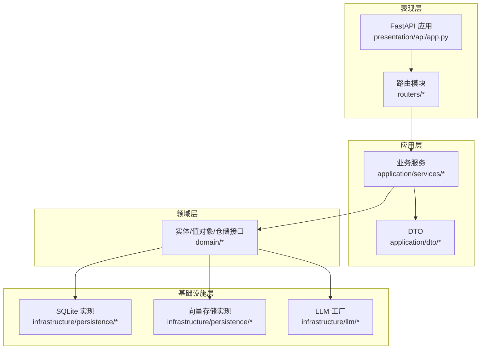
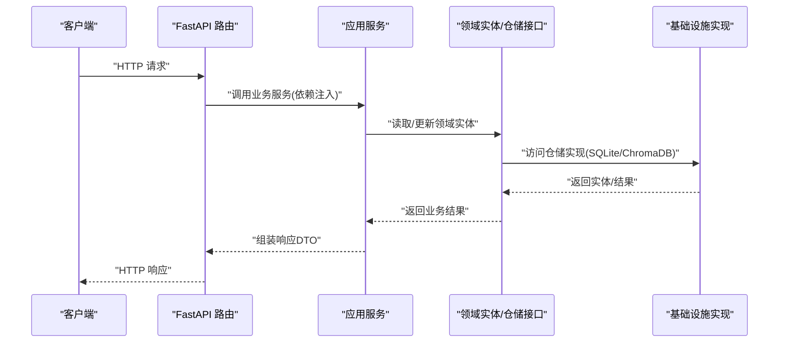
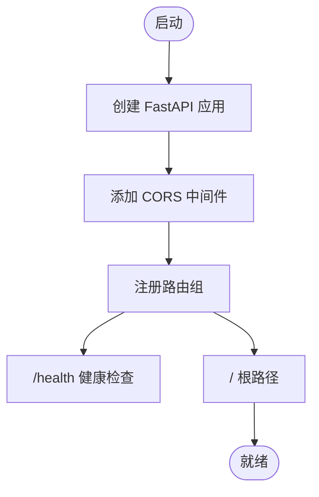
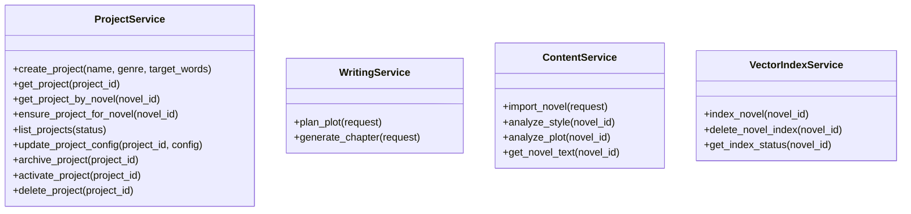
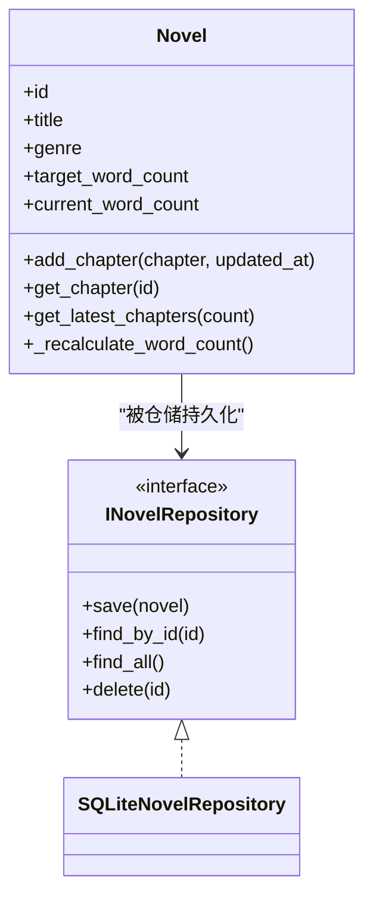
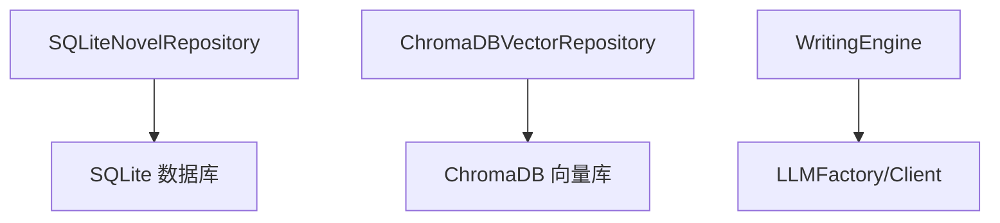
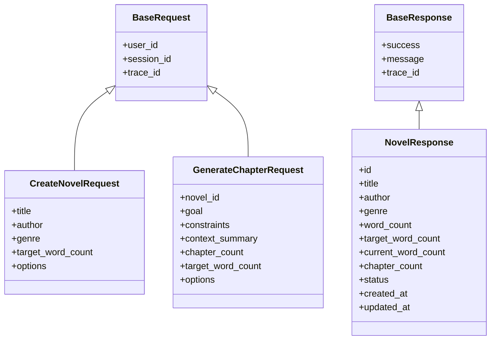
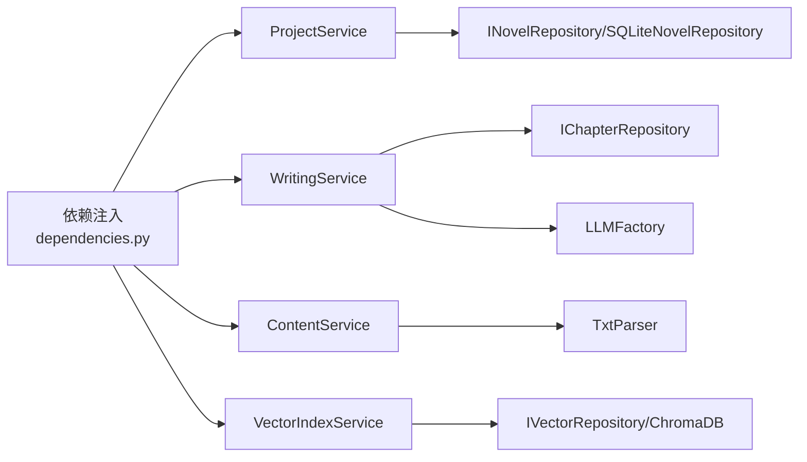

# 后端系统

<cite>
**本文引用的文件**
- [main.py](file://main.py)
- [presentation/api/app.py](file://presentation/api/app.py)
- [presentation/api/dependencies.py](file://presentation/api/dependencies.py)
- [presentation/api/routers/novel.py](file://presentation/api/routers/novel.py)
- [presentation/api/routers/writing.py](file://presentation/api/routers/writing.py)
- [presentation/api/routers/vector.py](file://presentation/api/routers/vector.py)
- [application/dto/request_dto.py](file://application/dto/request_dto.py)
- [application/dto/response_dto.py](file://application/dto/response_dto.py)
- [application/services/project_service.py](file://application/services/project_service.py)
- [application/services/content_service.py](file://application/services/content_service.py)
- [application/services/writing_service.py](file://application/services/writing_service.py)
- [application/services/vector_index_service.py](file://application/services/vector_index_service.py)
- [domain/entities/novel.py](file://domain/entities/novel.py)
- [domain/repositories/novel_repository.py](file://domain/repositories/novel_repository.py)
- [infrastructure/persistence/sqlite_novel_repo.py](file://infrastructure/persistence/sqlite_novel_repo.py)
</cite>

## 目录
1. [简介](#简介)
2. [项目结构](#项目结构)
3. [核心组件](#核心组件)
4. [架构总览](#架构总览)
5. [详细组件分析](#详细组件分析)
6. [依赖分析](#依赖分析)
7. [性能考量](#性能考量)
8. [故障排查指南](#故障排查指南)
9. [结论](#结论)
10. [附录](#附录)

## 简介
本文件为 InkTrace 后端系统的全面技术文档，基于 FastAPI 构建，采用分层架构设计：表现层（API 路由）、应用层（业务服务）、领域层（核心业务逻辑）、基础设施层（技术实现）。文档覆盖 RESTful API 设计与实现、请求/响应 DTO 模式、错误处理与安全、各业务模块功能（小说管理、内容分析、写作服务、向量检索），以及性能优化、并发与缓存策略，并提供面向开发者的实现指南与最佳实践。

## 项目结构
后端采用“表现层-应用层-领域层-基础设施层”的清晰分层：
- 表现层：FastAPI 应用与路由，负责 HTTP 请求接入、参数校验、响应封装与中间件配置。
- 应用层：业务服务，编排领域与基础设施，提供对外稳定的业务能力。
- 领域层：实体、值对象、仓储接口与领域服务，表达核心业务规则。
- 基础设施层：数据库与外部服务实现（SQLite、ChromaDB、LLM 客户端工厂等）。

**图表来源**
- [presentation/api/app.py:19-62](file://presentation/api/app.py#L19-L62)
- [presentation/api/routers/novel.py:21](file://presentation/api/routers/novel.py#L21)
- [presentation/api/routers/writing.py:37](file://presentation/api/routers/writing.py#L37)
- [presentation/api/routers/vector.py:18](file://presentation/api/routers/vector.py#L18)
- [application/services/project_service.py:21-67](file://application/services/project_service.py#L21-L67)
- [application/services/writing_service.py:30-47](file://application/services/writing_service.py#L30-L47)
- [application/services/vector_index_service.py:21-36](file://application/services/vector_index_service.py#L21-L36)
- [domain/entities/novel.py:20-40](file://domain/entities/novel.py#L20-L40)
- [infrastructure/persistence/sqlite_novel_repo.py:20-33](file://infrastructure/persistence/sqlite_novel_repo.py#L20-L33)

**章节来源**
- [presentation/api/app.py:19-62](file://presentation/api/app.py#L19-L62)
- [presentation/api/dependencies.py:14-47](file://presentation/api/dependencies.py#L14-L47)

## 核心组件
- FastAPI 应用与中间件：统一创建应用、注册路由、配置 CORS。
- 依赖注入：集中定义仓储与服务实例的构造与缓存，降低耦合。
- DTO：统一请求/响应结构，确保 API 的一致性与可测试性。
- 业务服务：封装具体业务流程，协调仓储与领域服务。
- 领域实体与仓储接口：表达核心业务对象与持久化契约。
- 基础设施实现：SQLite、ChromaDB、LLM 工厂等。

**章节来源**
- [presentation/api/app.py:19-62](file://presentation/api/app.py#L19-L62)
- [presentation/api/dependencies.py:50-178](file://presentation/api/dependencies.py#L50-L178)
- [application/dto/request_dto.py:14-97](file://application/dto/request_dto.py#L14-L97)
- [application/dto/response_dto.py:15-200](file://application/dto/response_dto.py#L15-L200)

## 架构总览
下图展示从 HTTP 请求到业务执行与数据持久化的整体流程，体现表现层、应用层、领域层与基础设施层的协作关系。

**图表来源**
- [presentation/api/routers/novel.py:24-61](file://presentation/api/routers/novel.py#L24-L61)
- [application/services/project_service.py:32-67](file://application/services/project_service.py#L32-L67)
- [domain/entities/novel.py:46-62](file://domain/entities/novel.py#L46-L62)
- [infrastructure/persistence/sqlite_novel_repo.py:54-72](file://infrastructure/persistence/sqlite_novel_repo.py#L54-L72)

## 详细组件分析

### 表现层（API 路由）
- 应用创建与中间件：统一创建 FastAPI 应用，启用 CORS；注册多组路由（小说、内容、写作、导出、项目、模板、角色、世界观、向量、RAG、配置）。
- 健康检查与根路径：提供健康检查与版本信息。
- 路由模块：按功能域拆分路由，如小说管理、写作续写、向量索引等。

**图表来源**
- [presentation/api/app.py:19-62](file://presentation/api/app.py#L19-L62)

**章节来源**
- [presentation/api/app.py:19-62](file://presentation/api/app.py#L19-L62)
- [presentation/api/routers/novel.py:21-162](file://presentation/api/routers/novel.py#L21-L162)
- [presentation/api/routers/writing.py:37-247](file://presentation/api/routers/writing.py#L37-L247)
- [presentation/api/routers/vector.py:18-77](file://presentation/api/routers/vector.py#L18-L77)

### 应用层（业务服务）
- 项目服务：创建/查询/更新/归档/删除项目，维护小说与项目的绑定及记忆体。
- 写作服务：剧情规划、章节生成、连贯性检查，结合 LLM 与风格特征。
- 内容服务：导入小说、文风分析、剧情分析、拼接文本。
- 向量索引服务：对章节、人物、世界观进行内容分块与嵌入索引，支持统计与清理。

**图表来源**
- [application/services/project_service.py:21-203](file://application/services/project_service.py#L21-L203)
- [application/services/writing_service.py:30-180](file://application/services/writing_service.py#L30-L180)
- [application/services/content_service.py:29-169](file://application/services/content_service.py#L29-L169)
- [application/services/vector_index_service.py:21-206](file://application/services/vector_index_service.py#L21-L206)

**章节来源**
- [application/services/project_service.py:21-203](file://application/services/project_service.py#L21-L203)
- [application/services/writing_service.py:30-180](file://application/services/writing_service.py#L30-L180)
- [application/services/content_service.py:29-169](file://application/services/content_service.py#L29-L169)
- [application/services/vector_index_service.py:21-206](file://application/services/vector_index_service.py#L21-L206)

### 领域层（核心业务逻辑）
- 小说聚合根：维护章节、人物、大纲、字数统计等，提供排序、最新章节等便捷方法。
- 仓储接口：定义小说、章节、角色、大纲、项目、模板、世界观、向量等仓储契约。
- 实体与值对象：承载业务不变量与行为，保证数据一致性。

**图表来源**
- [domain/repositories/novel_repository.py:17-70](file://domain/repositories/novel_repository.py#L17-L70)
- [domain/entities/novel.py:20-178](file://domain/entities/novel.py#L20-L178)
- [infrastructure/persistence/sqlite_novel_repo.py:20-126](file://infrastructure/persistence/sqlite_novel_repo.py#L20-L126)

**章节来源**
- [domain/entities/novel.py:20-178](file://domain/entities/novel.py#L20-L178)
- [domain/repositories/novel_repository.py:17-70](file://domain/repositories/novel_repository.py#L17-L70)
- [infrastructure/persistence/sqlite_novel_repo.py:20-126](file://infrastructure/persistence/sqlite_novel_repo.py#L20-L126)

### 基础设施层（技术实现）
- SQLite 实现：初始化表结构、保存/查询/删除小说记录。
- ChromaDB 向量仓库：添加向量、按小说统计、按条件删除。
- LLM 工厂：按环境变量配置不同 LLM 客户端，供写作引擎使用。

**图表来源**
- [infrastructure/persistence/sqlite_novel_repo.py:35-53](file://infrastructure/persistence/sqlite_novel_repo.py#L35-L53)
- [presentation/api/dependencies.py:93-95](file://presentation/api/dependencies.py#L93-L95)
- [application/services/writing_service.py:69-72](file://application/services/writing_service.py#L69-L72)

**章节来源**
- [infrastructure/persistence/sqlite_novel_repo.py:20-126](file://infrastructure/persistence/sqlite_novel_repo.py#L20-L126)
- [presentation/api/dependencies.py:93-95](file://presentation/api/dependencies.py#L93-L95)
- [application/services/writing_service.py:69-72](file://application/services/writing_service.py#L69-L72)

### 数据传输对象（DTO）
- 请求 DTO：统一携带用户标识、会话标识、追踪标识等上下文，以及各业务请求参数（如创建小说、生成章节、续写等）。
- 响应 DTO：统一 success/message/trace_id 基础字段，针对不同业务返回结构化数据；提供分页与错误响应结构。

**图表来源**
- [application/dto/request_dto.py:14-97](file://application/dto/request_dto.py#L14-L97)
- [application/dto/response_dto.py:15-200](file://application/dto/response_dto.py#L15-L200)

**章节来源**
- [application/dto/request_dto.py:14-97](file://application/dto/request_dto.py#L14-L97)
- [application/dto/response_dto.py:15-200](file://application/dto/response_dto.py#L15-L200)

### API 接口与使用说明
- 小说管理
  - POST /novels：创建小说项目，返回小说响应。
  - GET /novels：列出所有小说。
  - GET /novels/{novel_id}：获取小说详情。
  - DELETE /novels/{novel_id}：删除小说。
- 写作服务
  - POST /api/writing/plan：规划剧情节点。
  - POST /api/writing/generate：生成章节（支持灰度切换与 Agent 路径）。
  - POST /api/writing/continue：续写下一章（工具链执行，保存章节并更新记忆体进度）。
- 向量索引
  - POST /api/novels/{novel_id}/vector/index：为小说建立向量索引。
  - GET /api/novels/{novel_id}/vector/status：查询索引状态。
  - DELETE /api/novels/{novel_id}/vector/index：删除索引。

请求/响应均遵循 DTO 约束，错误通过 HTTP 状态码与错误响应结构返回。

**章节来源**
- [presentation/api/routers/novel.py:24-162](file://presentation/api/routers/novel.py#L24-L162)
- [presentation/api/routers/writing.py:84-247](file://presentation/api/routers/writing.py#L84-L247)
- [presentation/api/routers/vector.py:39-77](file://presentation/api/routers/vector.py#L39-L77)

### 错误处理与安全
- 错误处理：路由中捕获业务异常并映射为 HTTP 400/404/500，返回统一错误响应结构。
- 安全与跨域：应用级启用 CORS，生产部署建议限制允许源与方法。
- 认证授权：当前未见显式鉴权中间件，建议在路由层增加鉴权依赖或全局中间件。

**章节来源**
- [presentation/api/routers/novel.py:107-108](file://presentation/api/routers/novel.py#L107-L108)
- [presentation/api/routers/writing.py:103-104](file://presentation/api/routers/writing.py#L103-L104)
- [presentation/api/app.py:27-33](file://presentation/api/app.py#L27-L33)

## 依赖分析
- 依赖注入：通过缓存函数集中构造仓储与服务实例，避免重复创建与 IO 开销。
- 路由到服务：路由层仅负责参数与响应，业务逻辑集中在应用服务。
- 领域与基础设施：仓储接口隔离实现细节，便于替换与测试。

**图表来源**
- [presentation/api/dependencies.py:50-178](file://presentation/api/dependencies.py#L50-L178)
- [application/services/project_service.py:24-30](file://application/services/project_service.py#L24-L30)
- [application/services/writing_service.py:37-46](file://application/services/writing_service.py#L37-L46)
- [application/services/vector_index_service.py:24-36](file://application/services/vector_index_service.py#L24-L36)

**章节来源**
- [presentation/api/dependencies.py:50-178](file://presentation/api/dependencies.py#L50-L178)

## 性能考量
- 缓存与懒加载：依赖注入层使用缓存装饰器减少实例创建成本。
- 数据库连接：仓储实现使用连接池友好的方式（单次事务内完成操作）。
- 向量索引：内容分块与元数据组织，支持批量插入与按小说清理。
- 并发与限流：建议在网关或中间件层增加速率限制与超时控制。
- 日志与追踪：建议在路由层统一记录 trace_id，便于问题定位。

**章节来源**
- [presentation/api/dependencies.py:50-110](file://presentation/api/dependencies.py#L50-L110)
- [application/services/vector_index_service.py:155-176](file://application/services/vector_index_service.py#L155-L176)

## 故障排查指南
- 常见错误
  - 小说不存在：路由层返回 404，检查 novel_id 是否正确。
  - 参数非法：请求 DTO 字段校验失败，检查必填项与范围约束。
  - 写作失败：工具链执行失败或 Agent 未生成内容，查看元数据与日志。
- 排查步骤
  - 确认依赖注入是否成功（仓储/服务实例可用）。
  - 检查数据库/向量库路径与权限。
  - 核对 LLM API Key 环境变量配置。
  - 使用 /health 与根路径确认服务运行状态。

**章节来源**
- [presentation/api/routers/novel.py:107-108](file://presentation/api/routers/novel.py#L107-L108)
- [presentation/api/routers/writing.py:149-150](file://presentation/api/routers/writing.py#L149-L150)
- [presentation/api/app.py:58-60](file://presentation/api/app.py#L58-L60)

## 结论
InkTrace 后端以 FastAPI 为核心，通过清晰的分层与依赖注入，实现了可扩展的小说创作辅助系统。表现层路由简洁、应用层服务职责明确、领域层保持业务纯净、基础设施层可替换性强。配合统一的 DTO、错误处理与健康检查，系统具备良好的可维护性与可演进性。建议后续完善鉴权、限流与可观测性，进一步提升生产可用性。

## 附录
- 启动方式：通过主入口启动 Uvicorn，加载 FastAPI 应用。
- 环境变量：数据库路径、模板目录、向量库目录、LLM API Key 等通过环境变量配置。

**章节来源**
- [main.py:15-21](file://main.py#L15-L21)
- [presentation/api/dependencies.py:45-47](file://presentation/api/dependencies.py#L45-L47)