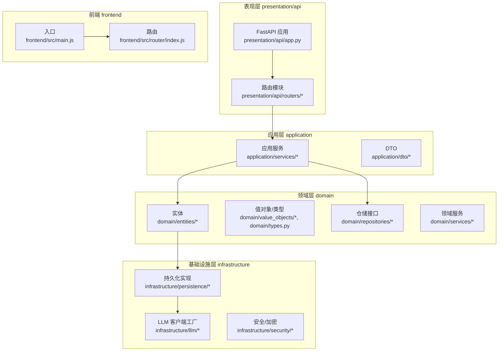
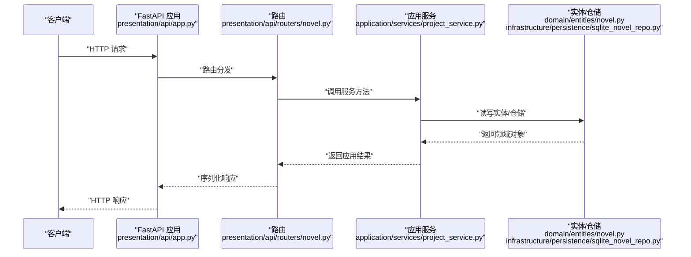
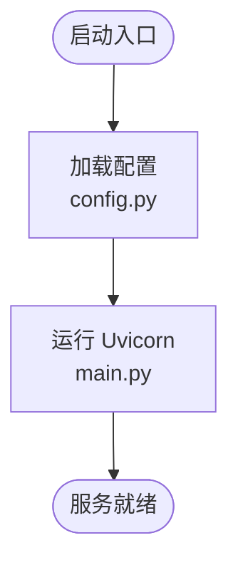
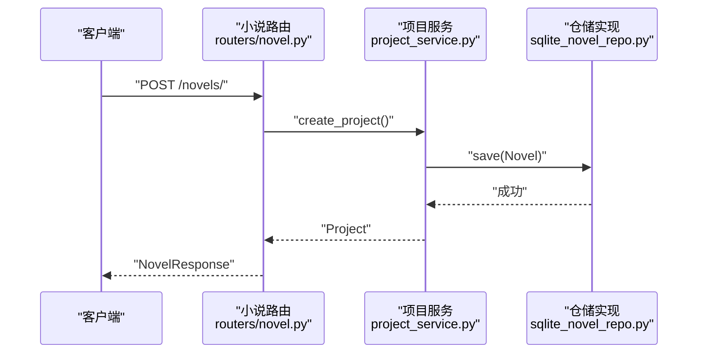
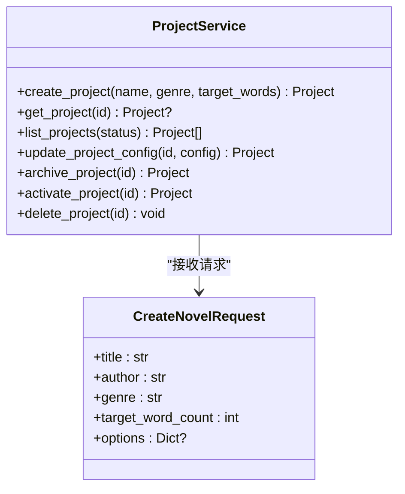
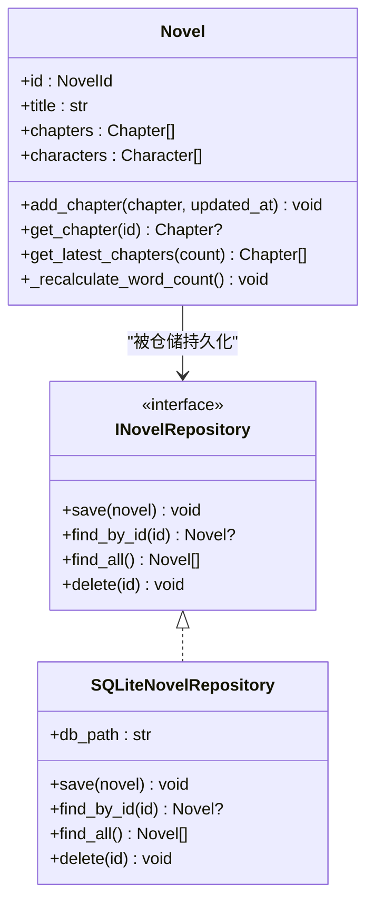
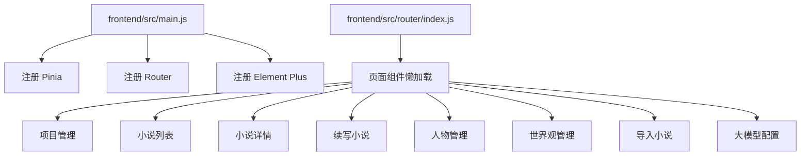
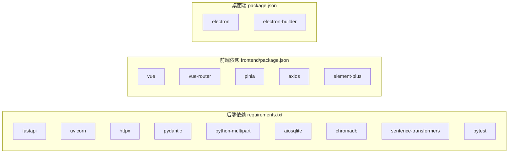

# 开发指南

<cite>
**本文引用的文件**
- [README.md](file://README.md)
- [requirements.txt](file://requirements.txt)
- [package.json](file://package.json)
- [main.py](file://main.py)
- [config.py](file://config.py)
- [presentation/api/app.py](file://presentation/api/app.py)
- [presentation/api/routers/novel.py](file://presentation/api/routers/novel.py)
- [application/dto/request_dto.py](file://application/dto/request_dto.py)
- [domain/entities/novel.py](file://domain/entities/novel.py)
- [domain/repositories/novel_repository.py](file://domain/repositories/novel_repository.py)
- [infrastructure/persistence/sqlite_novel_repo.py](file://infrastructure/persistence/sqlite_novel_repo.py)
- [frontend/src/main.js](file://frontend/src/main.js)
- [frontend/src/router/index.js](file://frontend/src/router/index.js)
- [frontend/package.json](file://frontend/package.json)
</cite>

## 目录
1. [引言](#引言)
2. [项目结构](#项目结构)
3. [核心组件](#核心组件)
4. [架构总览](#架构总览)
5. [详细组件分析](#详细组件分析)
6. [依赖分析](#依赖分析)
7. [性能考虑](#性能考虑)
8. [故障排除指南](#故障排除指南)
9. [结论](#结论)
10. [附录](#附录)

## 引言
本开发指南面向InkTrace项目的开发者与贡献者，系统阐述开发流程、代码规范、API设计、开发环境与工具链、调试与排错、版本与发布、代码评审流程、新开发者入职与学习资源，以及扩展点与插件机制。内容以仓库现有代码为依据，结合领域驱动设计（DDD）分层与前后端技术栈，帮助团队统一标准、提升协作效率与质量。

## 项目结构
InkTrace采用分层架构与前后端分离：
- 后端：FastAPI + SQLite，按领域驱动设计分为 domain、application、infrastructure、presentation 四层
- 前端：Vue3 + Vite + Element Plus + Vue Router + Pinia
- 桌面端：Electron（通过 package.json 的构建脚本集成）

图表来源
- [presentation/api/app.py:19-62](file://presentation/api/app.py#L19-L62)
- [presentation/api/routers/novel.py:21-162](file://presentation/api/routers/novel.py#L21-L162)
- [frontend/src/main.js:1-23](file://frontend/src/main.js#L1-L23)
- [frontend/src/router/index.js:1-74](file://frontend/src/router/index.js#L1-L74)

章节来源
- [README.md:72-106](file://README.md#L72-L106)

## 核心组件
- 启动入口与配置
  - 后端启动入口：[main.py:15-21](file://main.py#L15-L21)，读取配置并通过 Uvicorn 运行 FastAPI 应用
  - 应用配置：[config.py:14-45](file://config.py#L14-L45)，支持从环境变量注入主机、端口、调试开关、数据库路径与大模型密钥
- API 应用与路由
  - 应用装配：[presentation/api/app.py:19-62](file://presentation/api/app.py#L19-L62)，注册 CORS 与多期路由
  - 小说管理路由：[presentation/api/routers/novel.py:21-162](file://presentation/api/routers/novel.py#L21-L162)，提供创建、查询、删除等接口
- 应用服务与 DTO
  - 项目服务（示例）：[application/services/project_service.py:21-203](file://application/services/project_service.py#L21-L203)
  - 请求 DTO：[application/dto/request_dto.py:21-97](file://application/dto/request_dto.py#L21-L97)
- 领域模型与仓储
  - 小说实体：[domain/entities/novel.py:20-178](file://domain/entities/novel.py#L20-L178)
  - 小说仓储接口：[domain/repositories/novel_repository.py:17-70](file://domain/repositories/novel_repository.py#L17-L70)
  - SQLite 实现：[infrastructure/persistence/sqlite_novel_repo.py:20-126](file://infrastructure/persistence/sqlite_novel_repo.py#L20-L126)
- 前端入口与路由
  - 入口应用：[frontend/src/main.js:1-23](file://frontend/src/main.js#L1-L23)
  - 路由配置：[frontend/src/router/index.js:1-74](file://frontend/src/router/index.js#L1-L74)

章节来源
- [main.py:15-21](file://main.py#L15-L21)
- [config.py:14-45](file://config.py#L14-L45)
- [presentation/api/app.py:19-62](file://presentation/api/app.py#L19-L62)
- [presentation/api/routers/novel.py:21-162](file://presentation/api/routers/novel.py#L21-L162)
- [application/dto/request_dto.py:21-97](file://application/dto/request_dto.py#L21-L97)
- [domain/entities/novel.py:20-178](file://domain/entities/novel.py#L20-L178)
- [domain/repositories/novel_repository.py:17-70](file://domain/repositories/novel_repository.py#L17-L70)
- [infrastructure/persistence/sqlite_novel_repo.py:20-126](file://infrastructure/persistence/sqlite_novel_repo.py#L20-L126)
- [frontend/src/main.js:1-23](file://frontend/src/main.js#L1-L23)
- [frontend/src/router/index.js:1-74](file://frontend/src/router/index.js#L1-L74)

## 架构总览
InkTrace遵循 DDD 分层与 Clean Architecture 思想：
- 表现层负责 HTTP 接口与用户交互
- 应用层编排业务用例（服务）
- 领域层承载核心业务规则与不变量
- 基础设施层提供外部能力（数据库、LLM 客户端、文件处理等）

图表来源
- [presentation/api/app.py:19-62](file://presentation/api/app.py#L19-L62)
- [presentation/api/routers/novel.py:24-61](file://presentation/api/routers/novel.py#L24-L61)
- [application/services/project_service.py:32-67](file://application/services/project_service.py#L32-L67)
- [domain/entities/novel.py:20-178](file://domain/entities/novel.py#L20-L178)
- [infrastructure/persistence/sqlite_novel_repo.py:54-72](file://infrastructure/persistence/sqlite_novel_repo.py#L54-L72)

## 详细组件分析

### 后端启动与配置
- 启动入口通过 Uvicorn 运行 FastAPI 应用，支持热重载（调试模式）
- 配置项来源于环境变量，便于容器化与多环境部署

图表来源
- [main.py:15-21](file://main.py#L15-L21)
- [config.py:30-45](file://config.py#L30-L45)

章节来源
- [main.py:15-21](file://main.py#L15-L21)
- [config.py:14-45](file://config.py#L14-L45)

### API 应用与路由
- 应用装配：注册 CORS、多期路由（小说、内容、写作、导出、项目、模板、角色、世界观、向量、RAG、配置）
- 小说管理路由：提供创建、列表、详情、删除；内部委派给项目服务完成领域操作

图表来源
- [presentation/api/routers/novel.py:24-61](file://presentation/api/routers/novel.py#L24-L61)
- [application/services/project_service.py:32-67](file://application/services/project_service.py#L32-L67)
- [infrastructure/persistence/sqlite_novel_repo.py:54-72](file://infrastructure/persistence/sqlite_novel_repo.py#L54-L72)

章节来源
- [presentation/api/app.py:19-62](file://presentation/api/app.py#L19-L62)
- [presentation/api/routers/novel.py:21-162](file://presentation/api/routers/novel.py#L21-L162)

### 应用服务与 DTO
- 项目服务：封装项目生命周期（创建、查询、更新、归档、激活、删除），并与小说实体协同
- 请求 DTO：使用 Pydantic 校验输入参数，统一字段约束与默认值

图表来源
- [application/services/project_service.py:21-203](file://application/services/project_service.py#L21-L203)
- [application/dto/request_dto.py:21-28](file://application/dto/request_dto.py#L21-L28)

章节来源
- [application/services/project_service.py:21-203](file://application/services/project_service.py#L21-L203)
- [application/dto/request_dto.py:14-97](file://application/dto/request_dto.py#L14-L97)

### 领域模型与仓储
- 小说实体：聚合根，维护章节、人物、大纲等集合，提供统计与排序逻辑
- 仓储接口与 SQLite 实现：抽象与具体实现解耦，便于替换存储介质

图表来源
- [domain/repositories/novel_repository.py:17-70](file://domain/repositories/novel_repository.py#L17-L70)
- [infrastructure/persistence/sqlite_novel_repo.py:20-126](file://infrastructure/persistence/sqlite_novel_repo.py#L20-L126)
- [domain/entities/novel.py:20-178](file://domain/entities/novel.py#L20-L178)

章节来源
- [domain/entities/novel.py:20-178](file://domain/entities/novel.py#L20-L178)
- [domain/repositories/novel_repository.py:17-70](file://domain/repositories/novel_repository.py#L17-L70)
- [infrastructure/persistence/sqlite_novel_repo.py:20-126](file://infrastructure/persistence/sqlite_novel_repo.py#L20-L126)

### 前端入口与路由
- 入口应用：注册 Pinia、Vue Router、Element Plus，挂载根组件
- 路由：定义项目管理、小说列表、详情、续写、人物与世界观管理、导入、配置等页面

图表来源
- [frontend/src/main.js:1-23](file://frontend/src/main.js#L1-L23)
- [frontend/src/router/index.js:1-74](file://frontend/src/router/index.js#L1-L74)

章节来源
- [frontend/src/main.js:1-23](file://frontend/src/main.js#L1-L23)
- [frontend/src/router/index.js:1-74](file://frontend/src/router/index.js#L1-L74)

## 依赖分析
- 后端依赖：FastAPI、Uvicorn、HTTPX、Pydantic、SQLite 异步适配、ChromaDB、Sentence Transformers、PyTest
- 前端依赖：Vue3、Vue Router、Pinia、Axios、Element Plus、Vite 插件
- 桌面端：Electron、electron-builder，构建产物包含后端与前端静态资源

图表来源
- [requirements.txt:1-10](file://requirements.txt#L1-L10)
- [frontend/package.json:11-22](file://frontend/package.json#L11-L22)
- [package.json:16-79](file://package.json#L16-L79)

章节来源
- [requirements.txt:1-10](file://requirements.txt#L1-L10)
- [frontend/package.json:1-24](file://frontend/package.json#L1-L24)
- [package.json:1-81](file://package.json#L1-L81)

## 性能考虑
- 数据库访问
  - 使用连接池与批量操作减少 IO 延迟
  - 对高频查询建立索引（如 novels 表的 id 字段）
- LLM 调用
  - 合理设置超时与重试策略，避免阻塞主线程
  - 缓存常用提示词与上下文摘要
- 前端渲染
  - 路由懒加载与组件按需加载
  - Pinia 状态集中管理，避免重复渲染
- 构建优化
  - 生产构建开启压缩与 Tree Shaking
  - Electron 打包仅包含必要资源

## 故障排除指南
- 启动失败
  - 确认环境变量是否正确设置（主机、端口、调试、API 密钥）
  - 检查端口占用与防火墙
- API 404/422
  - 校验请求 DTO 字段长度、范围与必填项
  - 确认路由前缀与路径一致
- 数据库异常
  - 检查 SQLite 文件权限与路径
  - 确保迁移或初始化 SQL 已执行
- 前端页面空白
  - 检查路由历史模式与协议（file 协议使用 hash 模式）
  - 确认依赖安装与构建产物存在

章节来源
- [config.py:30-45](file://config.py#L30-L45)
- [presentation/api/routers/novel.py:106-110](file://presentation/api/routers/novel.py#L106-L110)
- [frontend/src/router/index.js:61-66](file://frontend/src/router/index.js#L61-L66)

## 结论
本指南基于仓库现有代码，梳理了 InkTrace 的分层架构、关键组件与开发流程。建议在后续迭代中补充单元测试覆盖率、完善 API 文档与错误码规范、制定 CI/CD 流水线与发布策略，以进一步提升工程化水平与交付质量。

## 附录

### 开发环境与工具链
- 后端
  - Python 3.11+，安装依赖：[requirements.txt:1-10](file://requirements.txt#L1-L10)
  - 启动：一键脚本或分别启动后端与前端
- 前端
  - Node.js 18+，安装依赖：[frontend/package.json:6-10](file://frontend/package.json#L6-L10)
  - 启动与构建：开发、构建、预览脚本
- 桌面端
  - Electron + electron-builder，构建脚本与平台配置见 [package.json:8-15](file://package.json#L8-L15) 与 build 配置段

章节来源
- [README.md:25-63](file://README.md#L25-L63)
- [requirements.txt:1-10](file://requirements.txt#L1-L10)
- [frontend/package.json:6-10](file://frontend/package.json#L6-L10)
- [package.json:8-79](file://package.json#L8-L79)

### 贡献指南（建议）
- 分支管理
  - 主分支保护，特性开发在 feature/*，修复在 hotfix/*
- 提交规范
  - 类型限定：feat、fix、docs、style、refactor、test、chore
  - 标题简洁，正文说明动机与变更点
- Pull Request
  - 关联 Issue，填写变更摘要与测试要点
  - 代码评审至少一名维护者同意
- 测试
  - 新增功能配套单元测试，保持覆盖率稳定

### 代码评审标准（建议）
- 正确性：覆盖边界条件与异常路径
- 可读性：命名清晰、注释充分、函数单一职责
- 性能：避免 N+1 查询、合理缓存与并发控制
- 安全：输入校验、敏感信息脱敏、CORS 配置审慎

### 新开发者入职指南（建议）
- 环境搭建：按 README 的“快速开始”准备后端与前端
- 代码走读：先从前端路由与页面组件入手，再进入后端路由与服务
- 学习资源
  - FastAPI 官方教程
  - Vue3 Composition API 与状态管理
  - DDD 分层架构与仓储模式
  - Pydantic 数据校验与序列化

### 版本管理与发布（建议）
- 版本号：语义化版本，变更记录在 CHANGELOG 中维护
- 发布流程
  - 合并到 main 分支，打标签并推送
  - 触发 CI 构建，产出各平台安装包
  - 上传至发布页并同步文档

### 扩展点与插件机制（建议）
- LLM 客户端：通过工厂模式新增第三方模型，统一接口与降级策略
- 仓储实现：可替换为其他数据库或搜索引擎，保持接口一致
- 插件化 UI：将常用功能拆分为可插拔组件，通过配置启用/禁用