# 开发者指南

<cite>
**本文引用的文件**
- [README.md](file://README.md)
- [.gitignore](file://.gitignore)
- [requirements.txt](file://requirements.txt)
- [package.json](file://package.json)
- [frontend/package.json](file://frontend/package.json)
- [config.py](file://config.py)
- [main.py](file://main.py)
- [presentation/api/app.py](file://presentation/api/app.py)
- [domain/entities/__init__.py](file://domain/entities/__init__.py)
- [application/services/__init__.py](file://application/services/__init__.py)
- [infrastructure/llm/base_client.py](file://infrastructure/llm/base_client.py)
- [application/services/content_service.py](file://application/services/content_service.py)
- [domain/services/writing_engine.py](file://domain/services/writing_engine.py)
- [infrastructure/persistence/sqlite_novel_repo.py](file://infrastructure/persistence/sqlite_novel_repo.py)
- [frontend/src/App.vue](file://frontend/src/App.vue)
- [frontend/src/main.js](file://frontend/src/main.js)
- [start-all.bat](file://start-all.bat)
- [start.bat](file://start.bat)
- [start-frontend.bat](file://start-frontend.bat)
- [stop.bat](file://stop.bat)
- [start_background.bat](file://start_background.bat)
- [build-desktop.bat](file://build-desktop.bat)
- [tests/unit/test_content_service.py](file://tests/unit/test_content_service.py)
- [tests/unit/test_writing_engine.py](file://tests/unit/test_writing_engine.py)
</cite>

## 更新摘要
**所做更改**
- 新增版本控制配置章节，详细说明 .gitignore 文件的作用和规则
- 更新开发环境配置说明，包含数据库和数据文件的忽略规则
- 完善代码规范中的版本控制相关内容
- 新增版本管理与分支管理策略章节

## 目录
1. [简介](#简介)
2. [项目结构](#项目结构)
3. [核心组件](#核心组件)
4. [架构总览](#架构总览)
5. [详细组件分析](#详细组件分析)
6. [依赖分析](#依赖分析)
7. [性能考虑](#性能考虑)
8. [故障排查指南](#故障排查指南)
9. [版本控制配置](#版本控制配置)
10. [版本管理与分支管理策略](#版本管理与分支管理策略)
11. [结论](#结论)
12. [附录](#附录)

## 简介
InkTrace Novel AI 是一款基于现有小说原文与大纲进行文风与剧情分析，并自动续写新章节的AI写作助手。项目采用分层架构（领域层、应用层、基础设施层、表现层），后端使用 FastAPI + Uvicorn，前端使用 Vue 3 + Vite，支持桌面端打包与发布。

- 核心能力：智能导入、文风分析、剧情分析、智能续写、连贯性检查、主备模型切换。
- 技术栈：后端 Python 3.11+、FastAPI、SQLite；前端 Vue 3、Element Plus、Pinia、Vue Router；桌面端 Electron + electron-builder。

**章节来源**
- [README.md:1-208](file://README.md#L1-L208)

## 项目结构
项目采用清晰的分层组织与功能模块划分，便于维护与扩展。

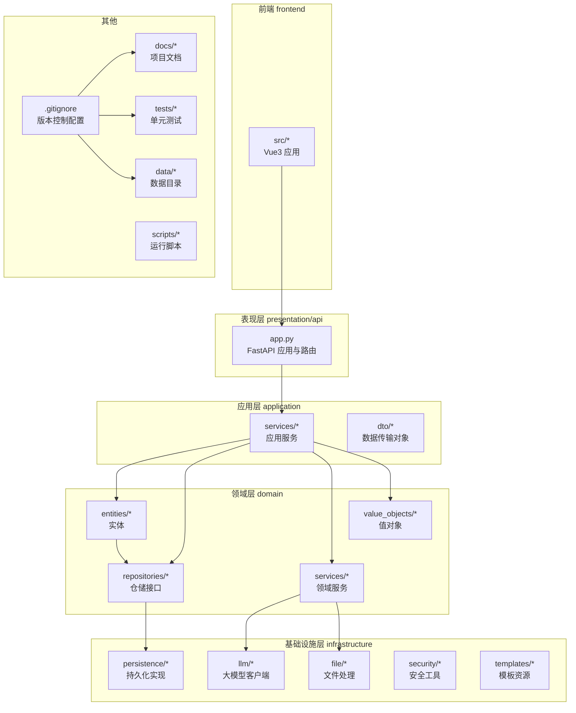

**图表来源**
- [presentation/api/app.py:19-66](file://presentation/api/app.py#L19-L66)
- [domain/entities/__init__.py:11-24](file://domain/entities/__init__.py#L11-L24)
- [application/services/__init__.py:11-21](file://application/services/__init__.py#L11-L21)
- [.gitignore:1-158](file://.gitignore#L1-L158)

**章节来源**
- [README.md:72-106](file://README.md#L72-L106)

## 核心组件
- 配置系统：通过环境变量加载应用配置，支持主机、端口、调试模式、数据库路径以及大模型密钥。
- 启动入口：后端通过 uvicorn 运行 FastAPI 应用；前端通过 Vite 启动开发服务器；桌面端通过 Electron 打包。
- API 应用：集中注册多期路由（小说、内容、写作、导出、项目、模板、角色、世界观、向量检索、RAG、配置）。
- 仓储与持久化：SQLite 实现小说等实体的增删改查。
- LLM 客户端抽象：定义统一的大模型接口，支持异步生成与可用性检查。
- 写作引擎：负责构建续写提示词、调用 LLM、应用文风特征与剧情规划。
- 内容服务：负责小说导入、章节解析、文风与剧情分析。

**章节来源**
- [config.py:14-46](file://config.py#L14-L46)
- [main.py:15-22](file://main.py#L15-L22)
- [presentation/api/app.py:19-66](file://presentation/api/app.py#L19-L66)
- [infrastructure/persistence/sqlite_novel_repo.py:20-126](file://infrastructure/persistence/sqlite_novel_repo.py#L20-L126)
- [infrastructure/llm/base_client.py:14-83](file://infrastructure/llm/base_client.py#L14-L83)
- [domain/services/writing_engine.py:30-184](file://domain/services/writing_engine.py#L30-L184)
- [application/services/content_service.py:29-169](file://application/services/content_service.py#L29-L169)

## 架构总览
InkTrace 采用 Clean Architecture 分层，前后端分离，桌面端作为独立发行载体。

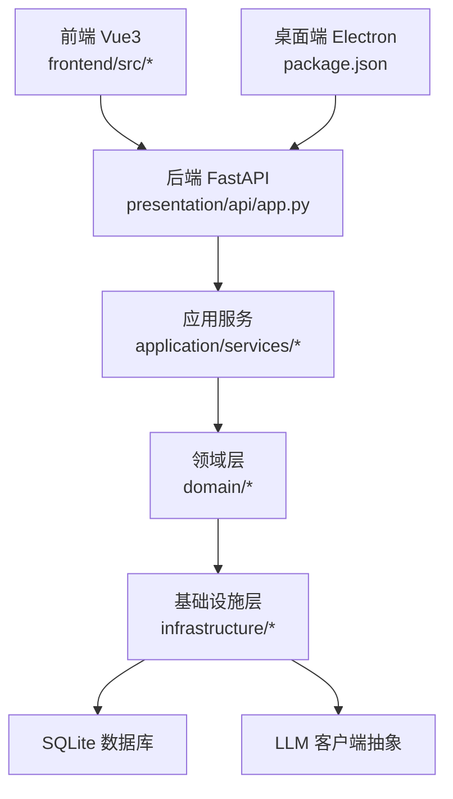

**图表来源**
- [presentation/api/app.py:19-66](file://presentation/api/app.py#L19-L66)
- [application/services/__init__.py:11-21](file://application/services/__init__.py#L11-L21)
- [domain/entities/__init__.py:11-24](file://domain/entities/__init__.py#L11-L24)
- [package.json:8-19](file://package.json#L8-L19)

## 详细组件分析

### 配置与启动
- 配置加载：从环境变量读取主机、端口、调试开关、数据库路径及大模型密钥，形成 AppConfig 并全局共享。
- 后端启动：main.py 通过 uvicorn 在指定主机与端口上运行 FastAPI 应用，调试模式下启用热重载。
- 前端启动：Vite 开发服务器，提供热更新与预览。
- 桌面端打包：electron-builder 支持多平台构建与安装包生成。

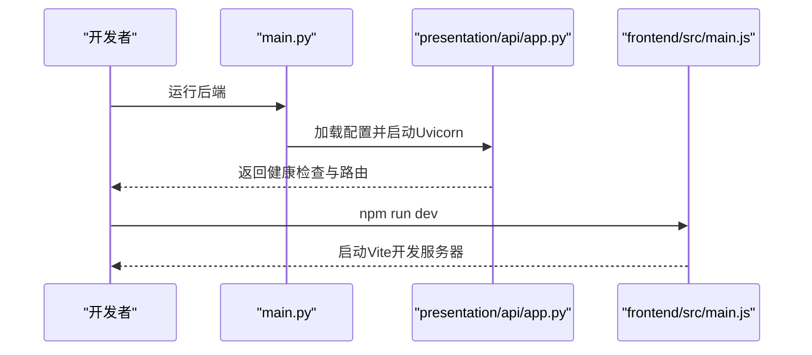

**图表来源**
- [main.py:15-22](file://main.py#L15-L22)
- [presentation/api/app.py:19-66](file://presentation/api/app.py#L19-L66)
- [frontend/src/main.js:1-23](file://frontend/src/main.js#L1-23)

**章节来源**
- [config.py:30-46](file://config.py#L30-L46)
- [main.py:15-22](file://main.py#L15-L22)
- [package.json:8-19](file://package.json#L8-L19)
- [frontend/package.json:6-10](file://frontend/package.json#L6-L10)

### API 应用与路由
- 应用创建：FastAPI 实例设置标题、描述、版本，并启用 CORS。
- 路由注册：按阶段分组注册路由（小说、内容、写作、导出、项目、模板、角色、世界观、向量、RAG、配置）。
- 健康检查：根路径与 /health 接口用于服务状态验证。

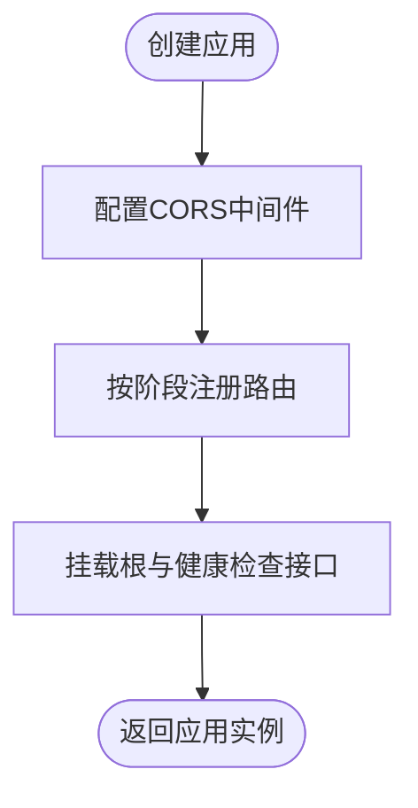

**图表来源**
- [presentation/api/app.py:19-66](file://presentation/api/app.py#L19-L66)

**章节来源**
- [presentation/api/app.py:19-66](file://presentation/api/app.py#L19-L66)

### LLM 客户端抽象
- 接口设计：定义 generate 与 chat 异步方法、模型名与上下文长度属性、可用性检查。
- 适配多模型：通过工厂或注入方式选择 DeepSeek/Kimi 等具体实现。
- 错误与降级：结合可用性检查与主备模型切换策略，提升稳定性。

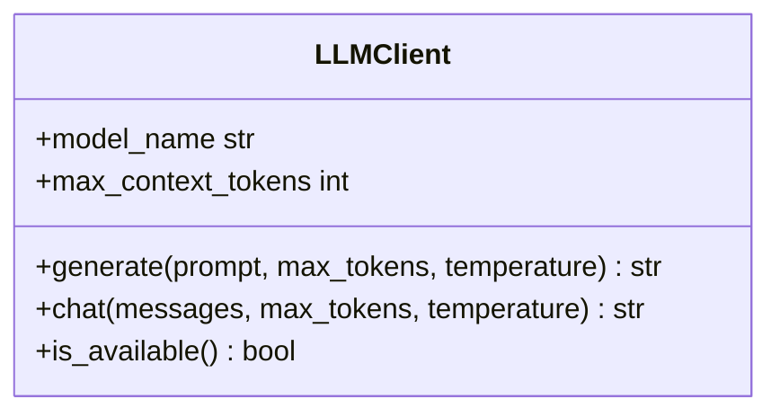

**图表来源**
- [infrastructure/llm/base_client.py:14-83](file://infrastructure/llm/base_client.py#L14-L83)

**章节来源**
- [infrastructure/llm/base_client.py:14-83](file://infrastructure/llm/base_client.py#L14-L83)

### 写作引擎
- 功能职责：构建续写提示词、调用 LLM 生成内容、应用文风特征、规划剧情节点。
- 上下文与配置：WritingContext 描述小说标题、大纲摘要、前文摘要、剧情方向等；WritingConfig 控制生成参数。
- 提示词工程：将小说信息、大纲摘要、剧情方向、前文摘要与写作要求拼接为提示词。

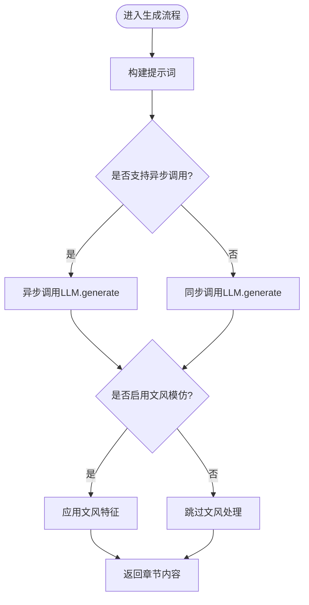

**图表来源**
- [domain/services/writing_engine.py:52-80](file://domain/services/writing_engine.py#L52-L80)
- [domain/services/writing_engine.py:139-184](file://domain/services/writing_engine.py#L139-L184)

**章节来源**
- [domain/services/writing_engine.py:30-184](file://domain/services/writing_engine.py#L30-L184)

### 内容服务（导入、分析）
- 小说导入：校验小说存在与文件路径有效性，解析 TXT 文件，批量创建章节并更新小说统计。
- 文风分析：聚合章节内容，调用 StyleAnalyzer 分析词汇、句式、修辞、对话风格与叙述节奏。
- 剧情分析：提取人物、时间线、伏笔等信息，支撑后续续写与一致性检查。

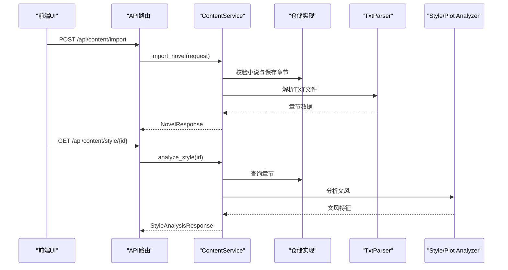

**图表来源**
- [application/services/content_service.py:52-92](file://application/services/content_service.py#L52-L92)
- [application/services/content_service.py:93-121](file://application/services/content_service.py#L93-L121)
- [application/services/content_service.py:123-147](file://application/services/content_service.py#L123-L147)

**章节来源**
- [application/services/content_service.py:29-169](file://application/services/content_service.py#L29-L169)

### 仓储与持久化（SQLite）
- 表结构：novels 表存储小说元数据；章节、角色、大纲、世界观等实体均有对应仓储接口与 SQLite 实现。
- 关键操作：初始化表、保存、按 ID 查询、查询全部、删除。
- 类型安全：使用 domain.types 中的 ID 类型确保实体标识类型安全。

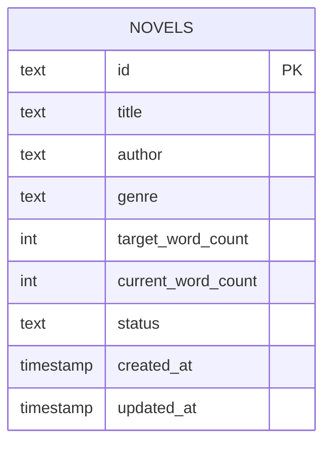

**图表来源**
- [infrastructure/persistence/sqlite_novel_repo.py:40-52](file://infrastructure/persistence/sqlite_novel_repo.py#L40-L52)

**章节来源**
- [infrastructure/persistence/sqlite_novel_repo.py:20-126](file://infrastructure/persistence/sqlite_novel_repo.py#L20-L126)

### 前端应用与国际化
- 入口配置：注册 Pinia、路由、Element Plus 国际化与全局样式。
- 布局与视图：App.vue 提供语言环境包裹，各页面组件按功能模块组织。
- 本地化：Element Plus 中文语言包集成。

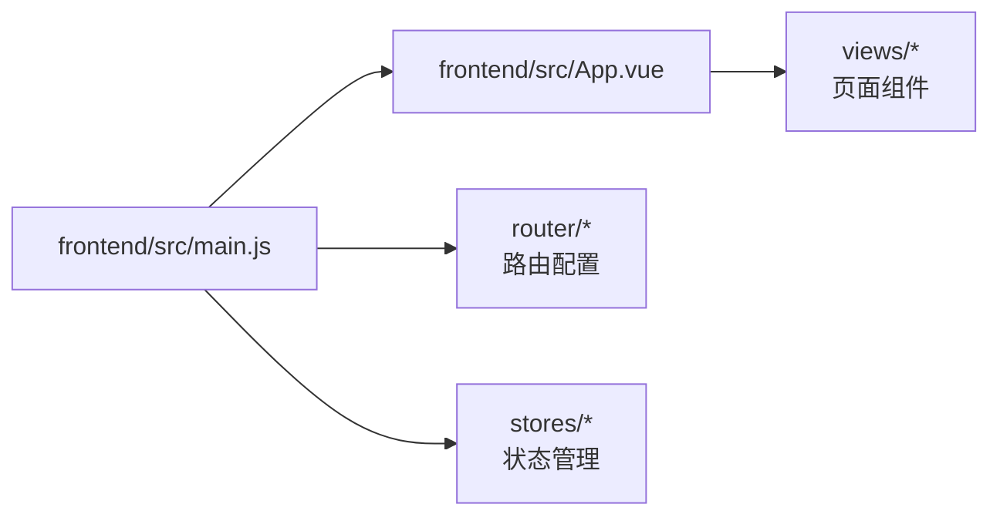

**图表来源**
- [frontend/src/main.js:1-23](file://frontend/src/main.js#L1-23)
- [frontend/src/App.vue:1-17](file://frontend/src/App.vue#L1-L17)

**章节来源**
- [frontend/src/main.js:1-23](file://frontend/src/main.js#L1-23)
- [frontend/src/App.vue:1-17](file://frontend/src/App.vue#L1-L17)

## 依赖分析
- 后端依赖：FastAPI、Uvicorn、HTTPX、Pydantic、aioSQLite、ChromaDB、Sentence Transformers、pytest。
- 前端依赖：Vue 3、Vue Router、Pinia、Axios、Element Plus、Vite。
- 桌面端：Electron、electron-builder，支持 Windows（NSIS）、macOS（DMG）、Linux（AppImage）。

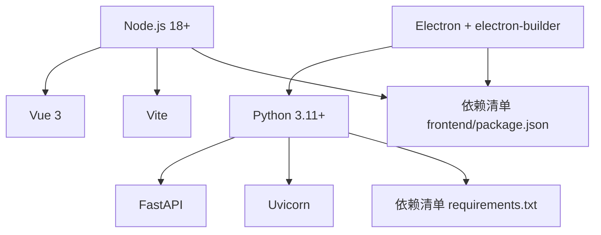

**图表来源**
- [requirements.txt:1-10](file://requirements.txt#L1-L10)
- [frontend/package.json:11-22](file://frontend/package.json#L11-L22)
- [package.json:16-79](file://package.json#L16-L79)

**章节来源**
- [requirements.txt:1-10](file://requirements.txt#L1-L10)
- [frontend/package.json:1-24](file://frontend/package.json#L1-L24)
- [package.json:1-81](file://package.json#L1-L81)

## 性能考虑
- 数据库连接：SQLite 采用短连接事务写入，避免长事务锁竞争；批量插入时合并 SQL 以减少往返。
- LLM 调用：对提示词进行裁剪与上下文压缩，控制 token 使用；异步调用优先，失败时回退到同步。
- 前端渲染：组件拆分与懒加载，避免一次性渲染大量章节；Pinia 状态按模块隔离。
- 缓存与索引：ChromaDB 向量索引加速检索；对常用分析结果进行短期缓存。
- 启动与打包：桌面端按需打包资源，减少安装体积；开发时启用热重载，生产构建开启压缩。

## 故障排查指南
- 启动失败
  - 后端：确认 INKTRACE_HOST、INKTRACE_PORT、INKTRACE_DEBUG 环境变量；检查端口占用。
  - 前端：确认 Node.js 版本与依赖安装；查看 Vite 控制台错误。
  - 桌面端：检查 electron-builder 配置与平台依赖。
- API 无响应
  - 检查 /health 健康检查接口；核对 CORS 配置与跨域策略。
- 数据库异常
  - 核对 INKTRACE_DB_PATH；确认数据库文件权限；必要时重建 novels 表。
- LLM 调用失败
  - 校验 DEEPSEEK_API_KEY、KIMI_API_KEY；检查网络代理与超时设置；启用主备模型切换。
- 单元测试
  - 使用 python -m unittest discover -s tests/unit；关注 ContentService、WritingEngine、SQLite 仓储相关用例。

**章节来源**
- [config.py:30-46](file://config.py#L30-L46)
- [presentation/api/app.py:54-61](file://presentation/api/app.py#L54-L61)
- [infrastructure/persistence/sqlite_novel_repo.py:35-52](file://infrastructure/persistence/sqlite_novel_repo.py#L35-L52)
- [README.md:189-196](file://README.md#L189-L196)

## 版本控制配置
InkTrace 项目采用完善的版本控制配置，通过 .gitignore 文件管理开发环境中的各种文件和目录，确保代码仓库的整洁性和安全性。

### .gitignore 文件详解
.gitignore 文件包含以下主要忽略规则：

#### Python 相关文件
- 编译缓存：`__pycache__/` 和 `*.py[cod]`、`*$py.class`
- 分发文件：`build/`、`dist/`、`*.egg-info/` 等打包产物
- 虚拟环境：`.venv`、`venv/`、`ENV/` 等 Python 环境文件
- 日志文件：`*.log`、`*.pyc` 等编译和运行日志

#### 前端相关文件
- 依赖管理：`node_modules`、`package-lock.json`
- 构建产物：`dist/`、`build/` 等前端构建输出
- 缓存文件：`.cache`、`.vite` 等开发工具缓存

#### 数据库和数据文件
- SQLite 数据库：`/data/inktrace.db`
- 小说数据：`/data/novel/修仙从逃出生天开始.txt`、`/data/novel/大纲.txt`
- 工具生成文件：`codeline_report.py`、`collect_code.py` 等代码统计工具文件

#### 开发工具配置
- IDE 配置：`.vscode/`、`.idea/` 等编辑器配置
- 测试报告：`coverage.xml`、`htmlcov/` 等测试覆盖率报告
- 临时文件：`*.tmp`、`*.bak` 等临时备份文件

#### 环境变量和敏感信息
- 环境配置：`.env`、`.env.local` 等环境变量文件
- 密钥文件：`secrets.json`、`config.key` 等敏感配置文件

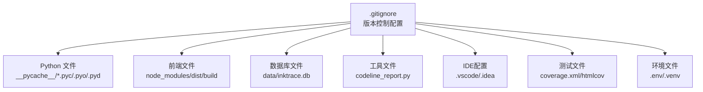

**图表来源**
- [.gitignore:1-158](file://.gitignore#L1-L158)

**章节来源**
- [.gitignore:1-158](file://.gitignore#L1-L158)

## 版本管理与分支管理策略
InkTrace 项目采用标准化的版本管理和分支管理策略，确保代码开发的有序性和可追溯性。

### 版本管理策略
- **语义化版本控制**：采用主版本号.次版本号.修订号的格式
- **版本标签**：每个发布版本都创建对应的 Git 标签
- **变更日志**：维护详细的版本更新记录和功能说明

### 分支管理策略
项目采用 Git Flow 工作流，包含以下主要分支：

#### 主要分支
- **main**：生产环境分支，只接受发布版本
- **develop**：开发主分支，集成所有功能开发

#### 功能分支
- **feature/***：功能开发分支，从 develop 分支创建
- **hotfix/***：紧急修复分支，从 main 分支创建
- **release/***：发布准备分支，从 develop 分支创建

#### 分支命名规范
- 功能分支：`feature/user-authentication`
- 紧急修复：`hotfix/critical-bug-fix`
- 发布分支：`release/1.2.3`

#### 合并与冲突解决
- 功能分支完成开发后合并到 develop
- 发布分支完成后合并到 main 并打标签
- 紧急修复直接合并到 main 和 develop

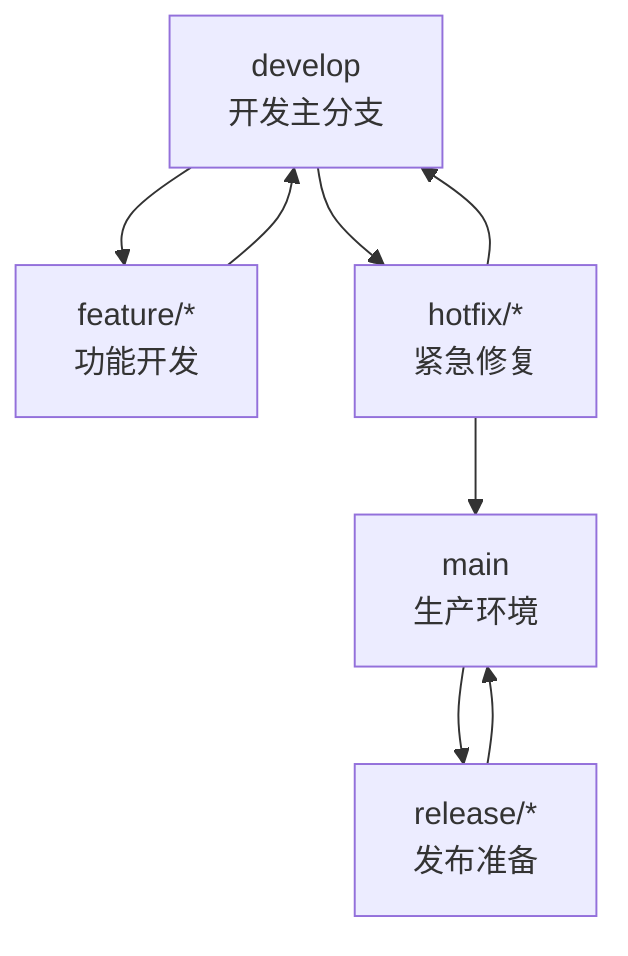

**图表来源**
- [README.md:158-169](file://README.md#L158-L169)

### 提交规范
- **提交消息格式**：`type(scope): subject`
- **类型说明**：
  - `feat`：新功能
  - `fix`：缺陷修复
  - `docs`：文档更新
  - `style`：代码格式调整
  - `refactor`：代码重构
  - `test`：测试相关
  - `chore`：构建过程或辅助工具变动

**章节来源**
- [README.md:158-169](file://README.md#L158-L169)

## 结论
InkTrace 通过清晰的分层架构与模块化设计，实现了从数据导入、文风与剧情分析到智能续写的完整工作流。完善的版本控制配置确保了开发环境的整洁性，标准化的版本管理策略保证了代码开发的有序性。建议在开发过程中严格遵循模块边界、保持 DTO 与实体分离、强化测试覆盖，并持续优化 LLM 提示词与向量检索策略，以提升生成质量与系统稳定性。

## 附录

### 开发环境搭建与代码规范
- **环境要求**
  - Python 3.11+、Node.js 18+、Git 版本控制系统
- **依赖安装**
  - 后端：pip install -r requirements.txt
  - 前端：cd frontend && npm install
- **环境变量**
  - INKTRACE_HOST、INKTRACE_PORT、INKTRACE_DEBUG、INKTRACE_DB_PATH、DEEPSEEK_API_KEY、KIMI_API_KEY
- **启动方式**
  - 一键启动：start-all.bat；分别启动：start.bat、start-frontend.bat；后台启动：start_background.bat；停止：stop.bat
- **代码规范**
  - Python：使用类型注解、数据类、异常明确抛出；模块内聚高、职责单一；DTO 与实体分离；仓储接口与实现分离
  - JavaScript/Vue：组件单文件组织、Props 明确、事件命名规范；Pinia 状态按模块拆分；路由按功能分层
  - 命名约定：类使用 PascalCase，函数与变量使用 snake_case 或 camelCase；常量全大写；文件夹小写加下划线
  - 文档：README.md、各模块 docstring 与变更日志；API 文档自动生成
- **版本控制**
  - 遵循 .gitignore 规则，避免提交不必要的文件
  - 使用有意义的提交消息，遵循约定式提交规范
  - 定期清理本地分支，保持仓库整洁

**章节来源**
- [README.md:25-47](file://README.md#L25-L47)
- [README.md:158-169](file://README.md#L158-L169)
- [.gitignore:1-158](file://.gitignore#L1-L158)
- [requirements.txt:1-10](file://requirements.txt#L1-L10)
- [frontend/package.json:6-10](file://frontend/package.json#L6-L10)
- [config.py:14-46](file://config.py#L14-L46)
- [start-all.bat](file://start-all.bat)
- [start.bat](file://start.bat)
- [start-frontend.bat](file://start-frontend.bat)
- [stop.bat](file://stop.bat)
- [start_background.bat](file://start_background.bat)

### 贡献指南与提交规范
- **分支策略**
  - develop：日常开发；feature/*：功能开发；hotfix/*：紧急修复；release/*：发布准备
- **提交规范**
  - 标题：type(scope): subject（如 feat(api): 新增路由注册）
  - 正文：简述变更动机与影响，引用 Issue 编号
  - 通过 CI 校验与代码审查后合并
- **代码审查**
  - 关注点：模块职责、异常处理、性能与安全性、测试覆盖、文档完整性
- **版本控制最佳实践**
  - 遵循 .gitignore 规则，不提交编译文件、日志文件、数据库文件等
  - 使用功能分支进行开发，避免直接在 main 分支提交
  - 定期同步上游分支，及时处理合并冲突

### IDE 配置与开发工具推荐
- **Python**：VS Code + Python 扩展，启用 Pylance、Black、Flake8；断点调试 FastAPI
- **JavaScript/Vue**：VS Code + Volar、ESLint、Prettier；Vite 集成热重载
- **数据库**：DB Browser for SQLite 查看 novels 表结构与数据
- **桌面端**：Electron 开发工具链，构建后验证安装包
- **版本控制**：Git GUI 工具或 VS Code Git 扩展，配合 .gitignore 规则

### 调试技巧与辅助工具
- **后端**：Uvicorn 调试模式自动重载；Postman 或 curl 验证 API；日志定位异常
- **前端**：Vue DevTools 检查组件与状态；浏览器 Network 面板观察请求与响应
- **桌面端**：electron-devtools-installer 辅助调试；构建后在目标平台验证
- **版本控制**：使用 git status 查看未跟踪文件；git clean -fd 删除未跟踪文件

### 文档编写规范与更新流程
- **文档类型**：README.md、模块 docstring、docs/* 专题文档
- **更新流程**：修改后在本地预览，提交 PR，审查通过后合并并更新 API 文档
- **版本控制**：文档变更同样遵循 .gitignore 规则，避免提交编译产物

### 新功能开发指导与模板
- **开发步骤**
  - 在 domain 定义实体与值对象；在 repositories 定义接口；在 infrastructure 实现持久化；在 application 编写服务；在 presentation 注册路由；在 frontend 新增页面与状态管理；补充测试
- **模板参考**
  - 参考 SQLiteNovelRepository 的表初始化与 CRUD 模板；参考 ContentService 的导入/分析模板；参考 WritingEngine 的提示词构建模板
- **版本控制注意事项**
  - 新增文件时检查 .gitignore 规则，确保不会意外提交不必要的文件
  - 功能开发使用 feature/* 分支，完成后合并到 develop

**章节来源**
- [infrastructure/persistence/sqlite_novel_repo.py:20-126](file://infrastructure/persistence/sqlite_novel_repo.py#L20-L126)
- [application/services/content_service.py:29-169](file://application/services/content_service.py#L29-L169)
- [domain/services/writing_engine.py:139-184](file://domain/services/writing_engine.py#L139-L184)

### 性能优化与代码重构建议
- **性能优化**
  - LLM：提示词裁剪、上下文压缩、并发限流；向量检索：合理分片与索引；前端：组件懒加载与虚拟滚动
- **代码重构**
  - 拆分大函数、消除重复代码、引入策略模式替换条件分支、增强异常与边界处理
- **测试驱动**
  - 为关键路径补充单元测试与集成测试，确保重构后行为一致
- **版本控制优化**
  - 定期清理未使用的分支，保持仓库整洁
  - 使用 .gitignore 规则避免提交不必要的文件，提高版本控制效率