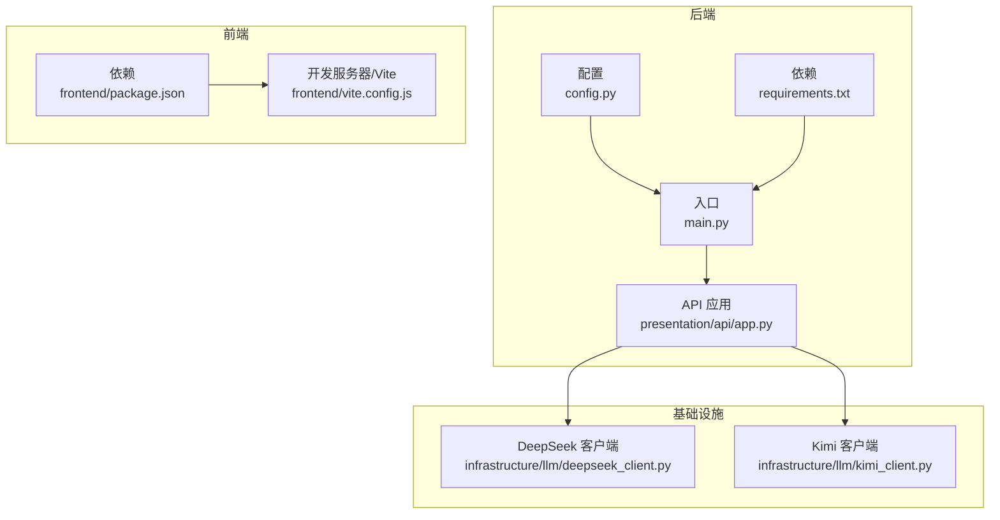
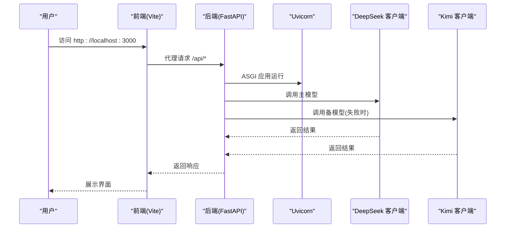
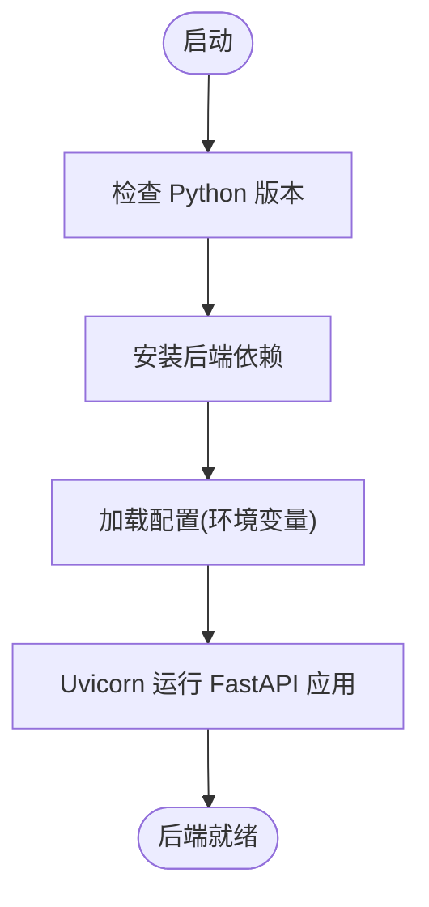
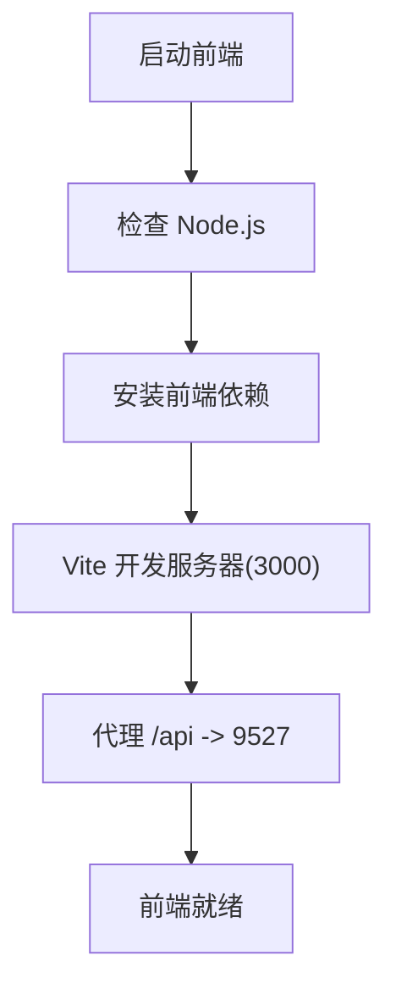
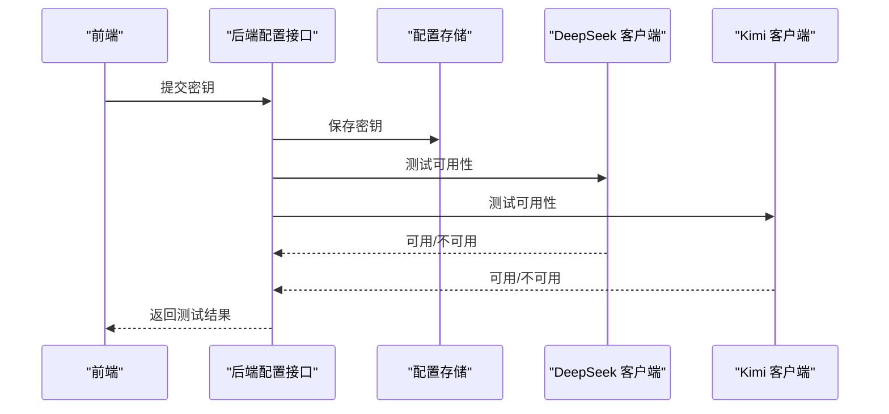
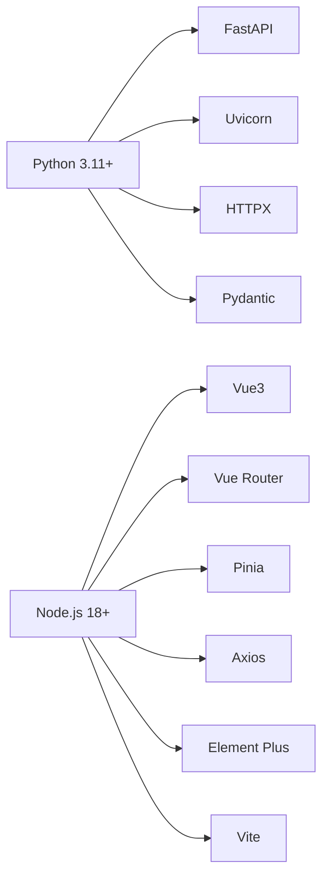

# 快速开始

<cite>
**本文引用的文件**
- [README.md](file://README.md)
- [STARTUP_GUIDE.md](file://docs/STARTUP_GUIDE.md)
- [requirements.txt](file://requirements.txt)
- [package.json](file://package.json)
- [frontend/package.json](file://frontend/package.json)
- [frontend/vite.config.js](file://frontend/vite.config.js)
- [config.py](file://config.py)
- [main.py](file://main.py)
- [presentation/api/app.py](file://presentation/api/app.py)
- [start.bat](file://start.bat)
- [start-frontend.bat](file://start-frontend.bat)
- [start-all.bat](file://start-all.bat)
- [stop.bat](file://stop.bat)
- [infrastructure/llm/deepseek_client.py](file://infrastructure/llm/deepseek_client.py)
- [infrastructure/llm/kimi_client.py](file://infrastructure/llm/kimi_client.py)
- [frontend/src/api/config.js](file://frontend/src/api/config.js)
</cite>

## 目录
1. [简介](#简介)
2. [项目结构](#项目结构)
3. [核心组件](#核心组件)
4. [架构总览](#架构总览)
5. [详细组件分析](#详细组件分析)
6. [依赖分析](#依赖分析)
7. [性能考虑](#性能考虑)
8. [故障排除指南](#故障排除指南)
9. [结论](#结论)
10. [附录](#附录)

## 简介
InkTrace 是一款基于现有小说原文与大纲，自动分析文风与剧情并进行智能续写的 AI 小说辅助工具。它采用前后端分离架构：后端基于 Python 的 FastAPI，前端基于 Vue3 + Vite，通过统一的 API 接口提供小说导入、文风/剧情分析、智能续写与导出等功能。

- 核心特性
  - 智能导入：自动解析 TXT 小说，识别章节结构
  - 文风分析：词汇、句式、修辞、对话风格
  - 剧情分析：人物关系、时间线、伏笔
  - 智能续写：基于文风模仿的章节生成
  - 连贯性检查：人物状态、时间线一致性
  - 主备模型：DeepSeek 主 + Kimi 备，自动切换

- 访问地址
  - 前端界面：http://localhost:3000
  - API 文档：http://127.0.0.1:9527/docs

**章节来源**
- [README.md:23-69](file://README.md#L23-L69)

## 项目结构
项目采用分层架构，主要目录与职责如下：
- domain：领域层（实体、值对象、领域服务、仓储接口）
- infrastructure：基础设施层（LLM 客户端、持久化、文件处理）
- application：应用层（应用服务、DTO）
- presentation：表现层（API 路由）
- frontend：Vue3 前端界面
- backend：后端入口与配置
- docs：项目文档与启动手册
- tests：单元测试
- data/logs：数据与日志目录

**图表来源**
- [config.py:14-46](file://config.py#L14-L46)
- [main.py:11-22](file://main.py#L11-L22)
- [presentation/api/app.py:19-66](file://presentation/api/app.py#L19-L66)
- [requirements.txt:1-10](file://requirements.txt#L1-L10)
- [frontend/package.json:1-24](file://frontend/package.json#L1-L24)
- [frontend/vite.config.js:1-28](file://frontend/vite.config.js#L1-L28)
- [infrastructure/llm/deepseek_client.py:25-238](file://infrastructure/llm/deepseek_client.py#L25-L238)
- [infrastructure/llm/kimi_client.py:25-244](file://infrastructure/llm/kimi_client.py#L25-L244)

**章节来源**
- [README.md:72-106](file://README.md#L72-L106)

## 核心组件
- 后端框架与运行
  - FastAPI 应用创建与 CORS 中间件配置
  - Uvicorn 作为 ASGI 服务器，按配置启动
- 前端开发与代理
  - Vite 开发服务器，端口 3000
  - 本地开发代理到后端 API（127.0.0.1:9527）
- 配置中心
  - 从环境变量读取主机、端口、调试、数据库路径与 API 密钥
- LLM 客户端
  - DeepSeek 与 Kimi 异步 HTTP 客户端，具备连接池、重试、错误处理与可用性检测
- API 文档
  - Swagger（/docs）与 ReDoc（/redoc）在线文档

**章节来源**
- [presentation/api/app.py:19-66](file://presentation/api/app.py#L19-L66)
- [main.py:11-22](file://main.py#L11-L22)
- [config.py:14-46](file://config.py#L14-L46)
- [frontend/vite.config.js:13-21](file://frontend/vite.config.js#L13-L21)
- [infrastructure/llm/deepseek_client.py:25-238](file://infrastructure/llm/deepseek_client.py#L25-L238)
- [infrastructure/llm/kimi_client.py:25-244](file://infrastructure/llm/kimi_client.py#L25-L244)

## 架构总览
下图展示了启动流程与组件交互：

**图表来源**
- [presentation/api/app.py:19-66](file://presentation/api/app.py#L19-L66)
- [main.py:11-22](file://main.py#L11-L22)
- [frontend/vite.config.js:15-20](file://frontend/vite.config.js#L15-L20)
- [infrastructure/llm/deepseek_client.py:78-194](file://infrastructure/llm/deepseek_client.py#L78-L194)
- [infrastructure/llm/kimi_client.py:123-200](file://infrastructure/llm/kimi_client.py#L123-L200)

## 详细组件分析

### 后端启动与配置
- 启动方式
  - 一键启动：批处理脚本自动检查环境、启动后端与前端
  - 分别启动：独立启动后端与前端，便于调试
- 配置加载
  - 从环境变量读取主机、端口、调试开关、数据库路径与 API 密钥
  - 默认端口 9527，主机 127.0.0.1，调试开启
- 依赖安装
  - 使用 requirements.txt 安装后端依赖
  - 使用 pip 安装 FastAPI、Uvicorn、HTTPX、Pydantic 等

**图表来源**
- [start.bat:11-39](file://start.bat#L11-L39)
- [config.py:30-46](file://config.py#L30-L46)
- [main.py:15-22](file://main.py#L15-L22)

**章节来源**
- [start.bat:1-40](file://start.bat#L1-L40)
- [start-all.bat:10-39](file://start-all.bat#L10-L39)
- [config.py:14-46](file://config.py#L14-L46)
- [requirements.txt:1-10](file://requirements.txt#L1-L10)

### 前端开发与代理
- 端口与代理
  - Vite 默认端口 3000
  - 本地开发代理将 /api 前缀转发到后端 127.0.0.1:9527
- 依赖
  - Vue3、Vue Router、Pinia、Axios、Element Plus、Vite 插件等
- 启动
  - 执行前端脚本启动开发服务器

**图表来源**
- [start-frontend.bat:7-23](file://start-frontend.bat#L7-L23)
- [frontend/vite.config.js:13-21](file://frontend/vite.config.js#L13-L21)
- [frontend/package.json:6-23](file://frontend/package.json#L6-L23)

**章节来源**
- [start-frontend.bat:1-23](file://start-frontend.bat#L1-L23)
- [frontend/vite.config.js:1-28](file://frontend/vite.config.js#L1-L28)
- [frontend/package.json:1-24](file://frontend/package.json#L1-L24)

### API 密钥配置（DeepSeek 与 Kimi）
- 环境变量方式
  - Windows：设置 DEEPSEEK_API_KEY 与 KIMI_API_KEY
- 前端配置界面
  - 通过前端“配置”页面提交密钥，后端保存并进行有效性测试
- 客户端行为
  - DeepSeek 与 Kimi 客户端均实现重试、限流、网络错误与 APIKey 错误处理

**图表来源**
- [frontend/src/api/config.js:67-112](file://frontend/src/api/config.js#L67-L112)
- [config.py:26-42](file://config.py#L26-L42)
- [infrastructure/llm/deepseek_client.py:213-227](file://infrastructure/llm/deepseek_client.py#L213-L227)
- [infrastructure/llm/kimi_client.py:219-227](file://infrastructure/llm/kimi_client.py#L219-L227)

**章节来源**
- [README.md:41-48](file://README.md#L41-L48)
- [STARTUP_GUIDE.md:29-47](file://docs/STARTUP_GUIDE.md#L29-L47)
- [frontend/src/api/config.js:19-192](file://frontend/src/api/config.js#L19-L192)
- [config.py:26-42](file://config.py#L26-L42)

### API 文档与路由
- 启动后端后访问：
  - Swagger：http://127.0.0.1:9527/docs
  - ReDoc：http://127.0.0.1:9527/redoc
- 主要路由（部分）
  - 小说相关：创建、列表、详情、导入、导出
  - 内容分析：文风分析、剧情分析
  - 写作：章节生成
  - 项目、模板、角色、世界观、向量检索、RAG、配置管理等

**章节来源**
- [README.md:139-155](file://README.md#L139-L155)
- [STARTUP_GUIDE.md:93-100](file://docs/STARTUP_GUIDE.md#L93-L100)
- [presentation/api/app.py:35-53](file://presentation/api/app.py#L35-L53)

## 依赖分析
- 后端依赖（来自 requirements.txt）
  - FastAPI、Uvicorn、HTTPX、Pydantic、sqlite 异步驱动、ChromaDB、Sentence Transformers、pytest
- 前端依赖（来自 frontend/package.json）
  - Vue3、Vue Router、Pinia、Axios、Element Plus、Vite 及其插件
- 环境要求
  - Python 3.11+、Node.js 18+

**图表来源**
- [requirements.txt:1-10](file://requirements.txt#L1-L10)
- [frontend/package.json:11-22](file://frontend/package.json#L11-L22)
- [README.md:25-28](file://README.md#L25-L28)

**章节来源**
- [requirements.txt:1-10](file://requirements.txt#L1-L10)
- [frontend/package.json:1-24](file://frontend/package.json#L1-L24)
- [README.md:25-39](file://README.md#L25-L39)

## 性能考虑
- 异步与连接池
  - LLM 客户端使用异步 HTTP 客户端与连接池，提升并发与稳定性
- 超时与重试
  - 客户端内置超时与最大重试次数，降低网络波动影响
- Token 控制
  - 对输入文本进行长度截断，避免超出模型上下文限制
- 前端代理
  - 本地开发代理减少跨域与额外跳转开销

**章节来源**
- [infrastructure/llm/deepseek_client.py:60-64](file://infrastructure/llm/deepseek_client.py#L60-L64)
- [infrastructure/llm/kimi_client.py:60-64](file://infrastructure/llm/kimi_client.py#L60-L64)
- [infrastructure/llm/deepseek_client.py:155-194](file://infrastructure/llm/deepseek_client.py#L155-L194)
- [infrastructure/llm/kimi_client.py:161-200](file://infrastructure/llm/kimi_client.py#L161-L200)
- [frontend/vite.config.js:15-20](file://frontend/vite.config.js#L15-L20)

## 故障排除指南
- 端口被占用
  - 后端默认端口 9527；若被占用，先查找并终止对应进程，或修改端口
- Python/Node.js 未找到
  - 确认已安装并加入系统 PATH；重新安装时勾选“Add to PATH”
- npm 依赖安装失败
  - 删除 node_modules 并重新安装
- API 密钥无效
  - 检查环境变量或前端配置界面中的密钥格式与有效期
- 服务启动后无法访问
  - 检查防火墙、确认服务已启动、尝试使用 127.0.0.1 替代 localhost
- 停止服务
  - 使用停止脚本根据端口查找并终止进程

**章节来源**
- [STARTUP_GUIDE.md:119-160](file://docs/STARTUP_GUIDE.md#L119-L160)
- [stop.bat:7-24](file://stop.bat#L7-L24)

## 结论
通过一键启动脚本或分别启动方式，您可以快速运行 InkTrace 的前后端服务。按照本文档完成环境与依赖准备、配置 API 密钥、启动服务后，即可在浏览器中访问前端界面与 API 文档，开始体验小说智能导入、分析与续写功能。

## 附录

### 快速开始步骤
- 环境要求
  - Python 3.11+、Node.js 18+
- 安装后端依赖
  - 在项目根目录执行安装命令
- 安装前端依赖
  - 切换到 frontend 目录并安装
- 配置 API 密钥
  - 设置 DEEPSEEK_API_KEY 与 KIMI_API_KEY 环境变量
- 启动方式
  - 一键启动：执行一键启动脚本
  - 分别启动：先启动后端，再启动前端
- 访问界面
  - 前端：http://localhost:3000
  - API 文档：http://127.0.0.1:9527/docs

**章节来源**
- [README.md:25-69](file://README.md#L25-L69)
- [STARTUP_GUIDE.md:12-92](file://docs/STARTUP_GUIDE.md#L12-L92)