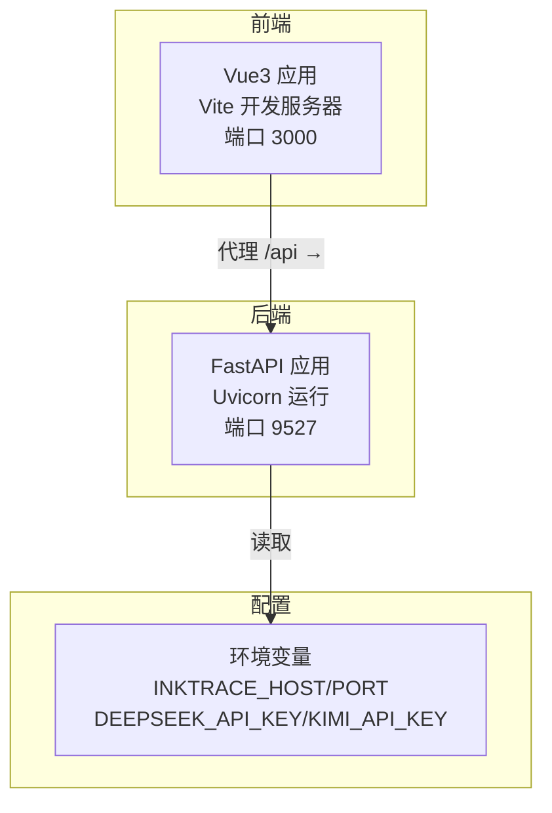
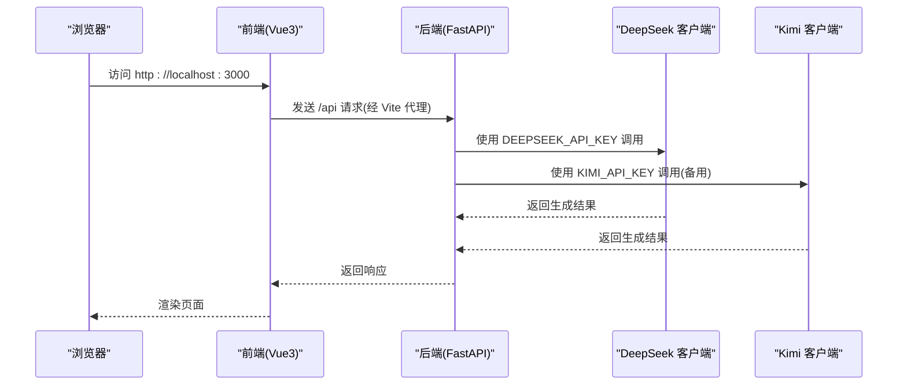
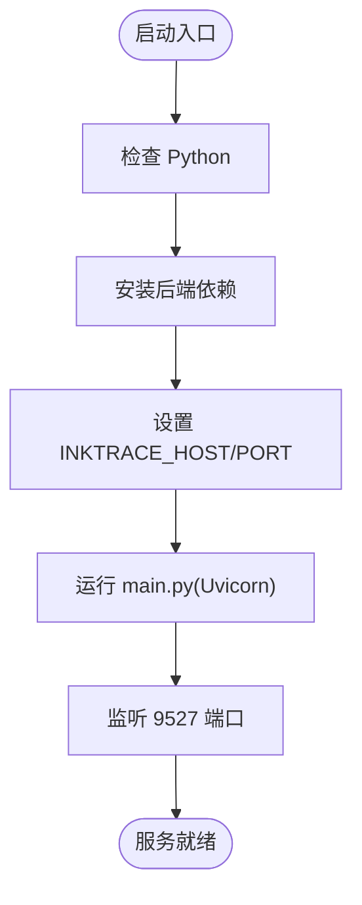
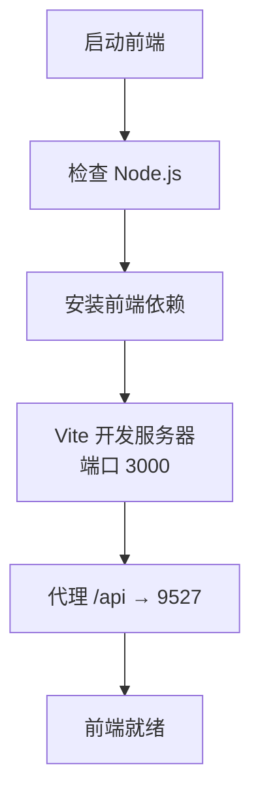
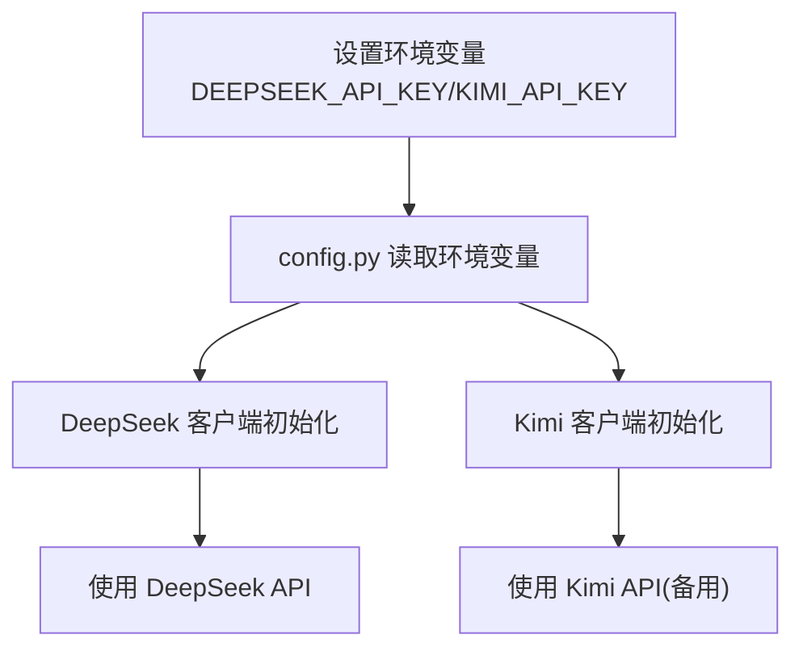
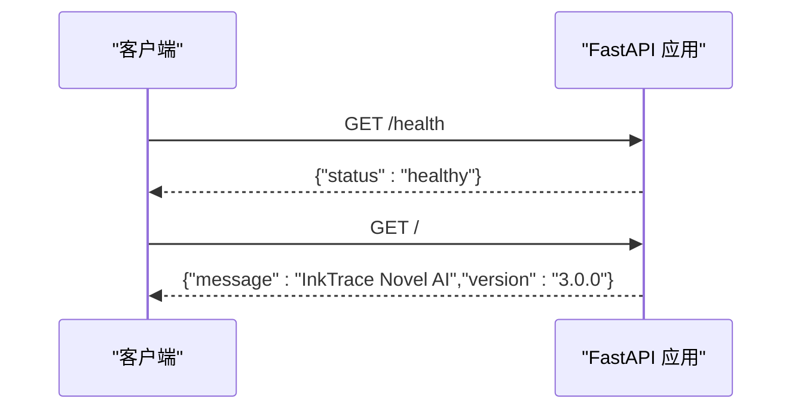
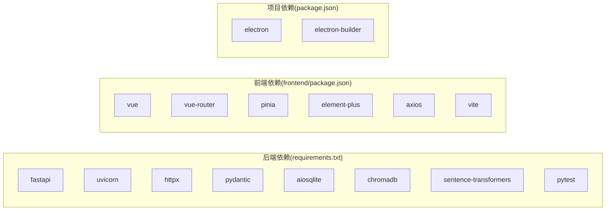

# 快速开始

<cite>
**本文引用的文件**
- [README.md](file://README.md)
- [docs/STARTUP_GUIDE.md](file://docs/STARTUP_GUIDE.md)
- [requirements.txt](file://requirements.txt)
- [package.json](file://package.json)
- [frontend/package.json](file://frontend/package.json)
- [frontend/vite.config.js](file://frontend/vite.config.js)
- [frontend/src/main.js](file://frontend/src/main.js)
- [config.py](file://config.py)
- [main.py](file://main.py)
- [presentation/api/app.py](file://presentation/api/app.py)
- [start.bat](file://start.bat)
- [start-frontend.bat](file://start-frontend.bat)
- [start-all.bat](file://start-all.bat)
- [stop.bat](file://stop.bat)
- [infrastructure/llm/deepseek_client.py](file://infrastructure/llm/deepseek_client.py)
- [infrastructure/llm/kimi_client.py](file://infrastructure/llm/kimi_client.py)
</cite>

## 目录
1. [简介](#简介)
2. [项目结构](#项目结构)
3. [核心组件](#核心组件)
4. [架构总览](#架构总览)
5. [详细组件分析](#详细组件分析)
6. [依赖分析](#依赖分析)
7. [性能考虑](#性能考虑)
8. [故障排除指南](#故障排除指南)
9. [结论](#结论)
10. [附录](#附录)

## 简介
InkTrace 是一款基于 FastAPI + Vue3 的 AI 小说自动编写助手，支持从 TXT 导入、文风与剧情分析、章节续写、连贯性检查与导出等功能。项目采用分层架构（领域层、应用层、基础设施层、表现层），并提供一键启动脚本与前后端分离的开发体验。

## 项目结构
- 后端：FastAPI 应用，通过 Uvicorn 运行，监听 9527 端口，默认主机 127.0.0.1。
- 前端：Vue3 + Vite，本地开发端口 3000，通过代理转发 /api 到后端。
- 配置：通过环境变量注入（如 INKTRACE_HOST、INKTRACE_PORT、DEEPSEEK_API_KEY、KIMI_API_KEY）。
- 启动脚本：Windows 批处理脚本，支持一键启动、分别启动与后台启动。

图表来源
- [frontend/vite.config.js:13-21](file://frontend/vite.config.js#L13-L21)
- [presentation/api/app.py:19-66](file://presentation/api/app.py#L19-L66)
- [config.py:14-46](file://config.py#L14-L46)

章节来源
- [README.md:72-106](file://README.md#L72-L106)
- [docs/STARTUP_GUIDE.md:161-183](file://docs/STARTUP_GUIDE.md#L161-L183)

## 核心组件
- 后端服务入口：通过 main.py 启动 Uvicorn，绑定 config 中的 host/port。
- FastAPI 应用：presentation/api/app.py 创建应用并注册多组路由。
- 配置模块：config.py 从环境变量加载服务与密钥配置。
- LLM 客户端：DeepSeek 与 Kimi 客户端封装，支持连接池、重试与错误处理。
- 前端应用：frontend/src/main.js 初始化 Vue3、路由、状态管理与 UI 组件库。

章节来源
- [main.py:11-22](file://main.py#L11-L22)
- [presentation/api/app.py:19-66](file://presentation/api/app.py#L19-L66)
- [config.py:14-46](file://config.py#L14-L46)
- [frontend/src/main.js:1-23](file://frontend/src/main.js#L1-L23)

## 架构总览
下图展示从前端到后端再到 LLM 的调用链路与配置注入点。

图表来源
- [frontend/vite.config.js:15-20](file://frontend/vite.config.js#L15-L20)
- [presentation/api/app.py:19-66](file://presentation/api/app.py#L19-L66)
- [config.py:26-42](file://config.py#L26-L42)
- [infrastructure/llm/deepseek_client.py:144-176](file://infrastructure/llm/deepseek_client.py#L144-L176)
- [infrastructure/llm/kimi_client.py:149-182](file://infrastructure/llm/kimi_client.py#L149-L182)

## 详细组件分析

### 后端启动与配置
- 环境变量优先级：INKTRACE_HOST、INKTRACE_PORT、INKTRACE_DEBUG、DEEPSEEK_API_KEY、KIMI_API_KEY。
- 默认端口：9527；默认主机：127.0.0.1；调试模式：开启。
- 启动方式：
  - 一键启动：start-all.bat 同时启动后端与前端。
  - 分别启动：start.bat 启动后端；start-frontend.bat 启动前端。
  - 后台启动：start_background.bat（另有脚本文件）。

图表来源
- [start.bat:11-39](file://start.bat#L11-L39)
- [main.py:15-22](file://main.py#L15-L22)
- [config.py:30-46](file://config.py#L30-L46)

章节来源
- [start.bat:1-40](file://start.bat#L1-L40)
- [start-all.bat:10-49](file://start-all.bat#L10-L49)
- [start-frontend.bat:7-23](file://start-frontend.bat#L7-L23)
- [stop.bat:7-31](file://stop.bat#L7-L31)
- [config.py:14-46](file://config.py#L14-L46)
- [main.py:11-22](file://main.py#L11-L22)

### 前端启动与代理
- 端口：3000；代理：/api → http://127.0.0.1:9527。
- 依赖：Vue3、Vue Router、Pinia、Element Plus、Axios、Vite。
- 启动：npm run dev；构建：npm run build。

图表来源
- [start-frontend.bat:7-23](file://start-frontend.bat#L7-L23)
- [frontend/vite.config.js:13-21](file://frontend/vite.config.js#L13-L21)
- [frontend/package.json:6-10](file://frontend/package.json#L6-L10)

章节来源
- [frontend/vite.config.js:1-28](file://frontend/vite.config.js#L1-L28)
- [frontend/package.json:1-24](file://frontend/package.json#L1-L24)
- [frontend/src/main.js:1-23](file://frontend/src/main.js#L1-L23)

### API 密钥配置
- 支持两种方式：
  - 环境变量：DEEPSEEK_API_KEY、KIMI_API_KEY。
  - .env 文件（项目根目录）：同样支持上述键名。
- 配置加载：config.py 从环境变量读取密钥；LLM 客户端在初始化时使用对应密钥。

图表来源
- [docs/STARTUP_GUIDE.md:29-47](file://docs/STARTUP_GUIDE.md#L29-L47)
- [config.py:30-42](file://config.py#L30-L42)
- [infrastructure/llm/deepseek_client.py:33-64](file://infrastructure/llm/deepseek_client.py#L33-L64)
- [infrastructure/llm/kimi_client.py:33-64](file://infrastructure/llm/kimi_client.py#L33-L64)

章节来源
- [docs/STARTUP_GUIDE.md:29-47](file://docs/STARTUP_GUIDE.md#L29-L47)
- [config.py:26-42](file://config.py#L26-L42)

### API 路由与健康检查
- 应用创建：presentation/api/app.py 注册多组路由（novel、content、writing、export、project、template、character、worldview、vector、rag、config）。
- 健康检查：/health 返回健康状态；根路径 / 返回应用信息。

图表来源
- [presentation/api/app.py:54-61](file://presentation/api/app.py#L54-L61)

章节来源
- [presentation/api/app.py:19-66](file://presentation/api/app.py#L19-L66)

## 依赖分析
- 后端依赖：requirements.txt 指定 FastAPI、Uvicorn、httpx、pydantic、sqlite、向量库与测试框架等。
- 前端依赖：frontend/package.json 指定 Vue3、Router、Pinia、Element Plus、Axios、Vite 等。
- 项目级依赖：package.json（桌面版 Electron 项目）包含打包与构建脚本。

图表来源
- [requirements.txt:1-10](file://requirements.txt#L1-L10)
- [frontend/package.json:11-22](file://frontend/package.json#L11-L22)
- [package.json:16-79](file://package.json#L16-L79)

章节来源
- [requirements.txt:1-10](file://requirements.txt#L1-L10)
- [frontend/package.json:1-24](file://frontend/package.json#L1-L24)
- [package.json:1-81](file://package.json#L1-L81)

## 性能考虑
- 连接池与超时：LLM 客户端使用 httpx.AsyncClient 并设置超时与连接限制，减少重复握手开销。
- 重试策略：对网络异常与临时错误进行有限次数重试，提升稳定性。
- 输入截断：对过长输入进行字符级截断，避免 Token 上限导致的失败。
- 前端代理：Vite 本地开发代理减少跨域与额外请求成本。

章节来源
- [infrastructure/llm/deepseek_client.py:61-64](file://infrastructure/llm/deepseek_client.py#L61-L64)
- [infrastructure/llm/kimi_client.py:61-64](file://infrastructure/llm/kimi_client.py#L61-L64)
- [infrastructure/llm/deepseek_client.py:155-193](file://infrastructure/llm/deepseek_client.py#L155-L193)
- [infrastructure/llm/kimi_client.py:161-199](file://infrastructure/llm/kimi_client.py#L161-L199)
- [frontend/vite.config.js:13-21](file://frontend/vite.config.js#L13-L21)

## 故障排除指南
- 端口被占用
  - 检查 9527 端口占用并终止对应进程。
  - 参考：[stop.bat:8-24](file://stop.bat#L8-L24)
- Python/Node.js 未找到
  - 确认已安装并加入 PATH；参考启动脚本中的版本检查。
  - 参考：[start.bat:11-18](file://start.bat#L11-L18)、[start-frontend.bat:7-14](file://start-frontend.bat#L7-L14)
- npm 依赖安装失败
  - 删除 node_modules 后重新安装。
  - 参考：[docs/STARTUP_GUIDE.md:140-146](file://docs/STARTUP_GUIDE.md#L140-L146)
- API 密钥无效
  - 检查环境变量或 .env 文件内容。
  - 参考：[docs/STARTUP_GUIDE.md:148-153](file://docs/STARTUP_GUIDE.md#L148-L153)
- 服务启动但无法访问
  - 检查防火墙；尝试使用 127.0.0.1；确认终端输出。
  - 参考：[docs/STARTUP_GUIDE.md:155-159](file://docs/STARTUP_GUIDE.md#L155-L159)

章节来源
- [stop.bat:7-31](file://stop.bat#L7-L31)
- [start.bat:11-18](file://start.bat#L11-L18)
- [start-frontend.bat:7-14](file://start-frontend.bat#L7-L14)
- [docs/STARTUP_GUIDE.md:121-159](file://docs/STARTUP_GUIDE.md#L121-L159)

## 结论
通过一键启动脚本与清晰的环境变量配置，InkTrace 能够快速搭建本地开发与生产环境。建议在首次使用前完成依赖安装、API 密钥配置与数据目录准备，并按“访问界面”指引验证服务可用性。

## 附录
- 访问地址
  - 前端界面：http://localhost:3000
  - API 文档：http://127.0.0.1:9527/docs
- 端口配置
  - 后端默认端口：9527；前端默认端口：3000
  - 可通过环境变量 INKTRACE_PORT 或修改 config.py 生效
- 快速启动检查清单
  - 已安装 Python 3.11+ 与 Node.js 18+
  - 已安装后端与前端依赖
  - 已配置 API 密钥（可选）
  - 已执行一键启动并访问前端界面

章节来源
- [README.md:65-69](file://README.md#L65-L69)
- [docs/STARTUP_GUIDE.md:93-118](file://docs/STARTUP_GUIDE.md#L93-L118)
- [docs/STARTUP_GUIDE.md:185-194](file://docs/STARTUP_GUIDE.md#L185-L194)