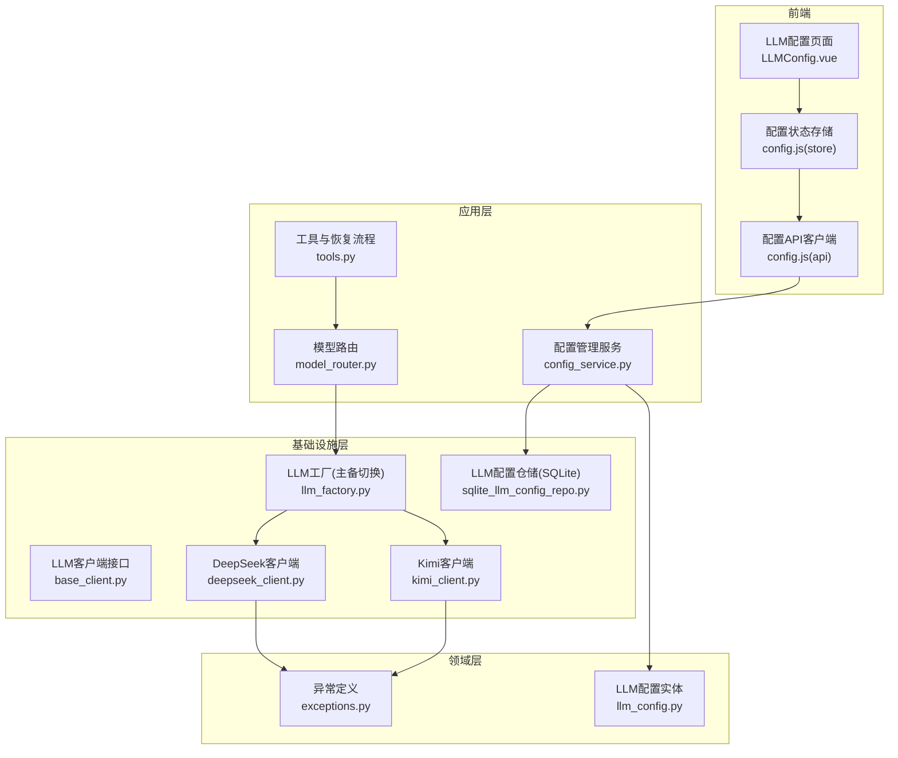
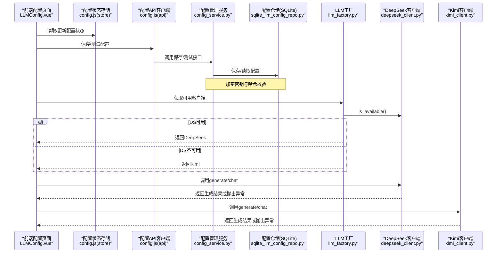
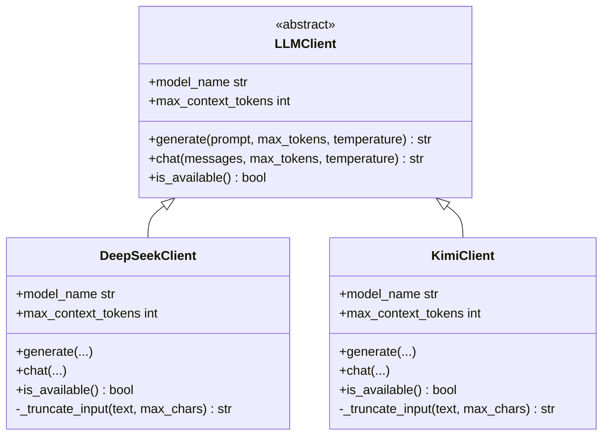
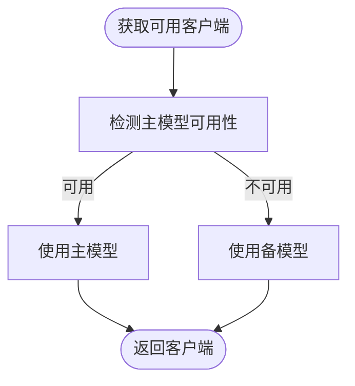
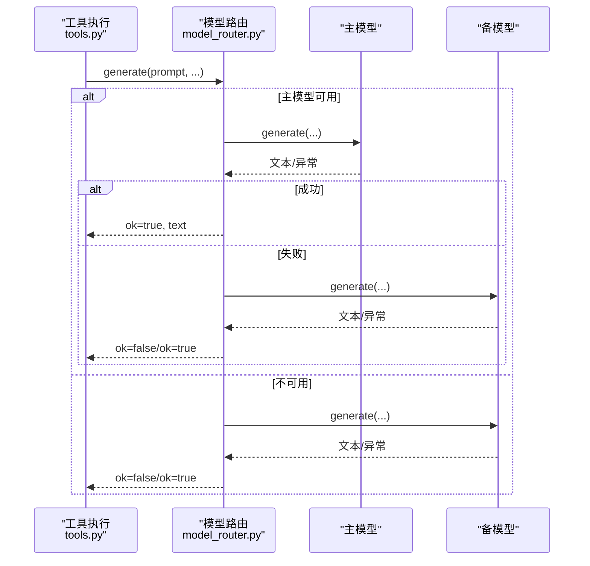
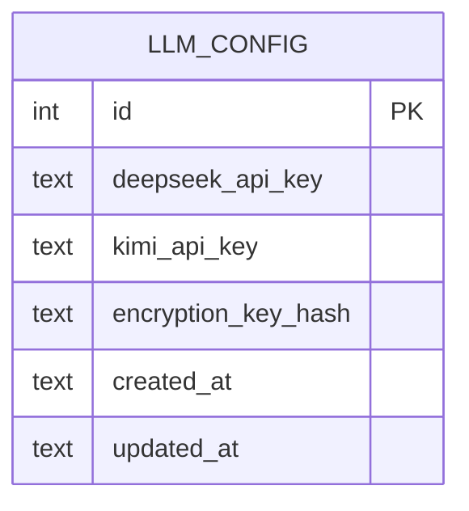
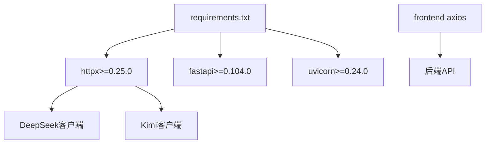

# AI模型问题

<cite>
**本文引用的文件**
- [base_client.py](file://infrastructure/llm/base_client.py)
- [deepseek_client.py](file://infrastructure/llm/deepseek_client.py)
- [kimi_client.py](file://infrastructure/llm/kimi_client.py)
- [llm_factory.py](file://infrastructure/llm/llm_factory.py)
- [llm_config.py](file://domain/entities/llm_config.py)
- [exceptions.py](file://domain/exceptions.py)
- [config_service.py](file://application/services/config_service.py)
- [sqlite_llm_config_repo.py](file://infrastructure/persistence/sqlite_llm_config_repo.py)
- [model_router.py](file://application/agent_mvp/model_router.py)
- [tools.py](file://application/agent_mvp/tools.py)
- [LLMConfig.vue](file://frontend/src/views/config/LLMConfig.vue)
- [config.js](file://frontend/src/stores/config.js)
- [config.js](file://frontend/src/api/config.js)
- [config.py](file://config.py)
- [requirements.txt](file://requirements.txt)
- [test_llm_client.py](file://tests/unit/test_llm_client.py)
- [test_llm_client_improved.py](file://tests/unit/test_llm_client_improved.py)
</cite>

## 目录
1. [简介](#简介)
2. [项目结构](#项目结构)
3. [核心组件](#核心组件)
4. [架构总览](#架构总览)
5. [详细组件分析](#详细组件分析)
6. [依赖分析](#依赖分析)
7. [性能考虑](#性能考虑)
8. [故障排除指南](#故障排除指南)
9. [结论](#结论)
10. [附录](#附录)

## 简介
本指南聚焦于InkTrace项目中AI模型连接与使用问题的专项排查与优化，覆盖以下主题：
- AI模型API调用失败的诊断方法：网络连接问题、API密钥配置错误、模型参数设置不当等
- DeepSeek与Kimi模型的连接问题排查：API端点验证、认证机制、速率限制处理
- 模型切换机制的故障排除：主备模型切换、降级策略、错误恢复
- AI生成内容质量差的问题分析与改进方法
- API调用超时与重试机制配置
- 不同网络环境下的AI模型连接优化建议
- 最佳实践与常见陷阱避免

## 项目结构
InkTrace围绕“基础设施层LLM客户端”“应用层配置与路由”“领域层异常与实体”“前端配置界面”四个维度组织AI模型相关代码，形成清晰的分层与职责划分。

图表来源
- [LLMConfig.vue:1-285](file://frontend/src/views/config/LLMConfig.vue#L1-L285)
- [config.js:94-147](file://frontend/src/stores/config.js#L94-L147)
- [config.js:1-55](file://frontend/src/api/config.js#L1-L55)
- [config_service.py:1-151](file://application/services/config_service.py#L1-L151)
- [sqlite_llm_config_repo.py:1-134](file://infrastructure/persistence/sqlite_llm_config_repo.py#L1-L134)
- [llm_config.py:1-54](file://domain/entities/llm_config.py#L1-L54)
- [model_router.py:1-41](file://application/agent_mvp/model_router.py#L1-L41)
- [tools.py:87-284](file://application/agent_mvp/tools.py#L87-L284)
- [llm_factory.py:1-121](file://infrastructure/llm/llm_factory.py#L1-L121)
- [base_client.py:1-83](file://infrastructure/llm/base_client.py#L1-L83)
- [deepseek_client.py:1-238](file://infrastructure/llm/deepseek_client.py#L1-L238)
- [kimi_client.py:1-244](file://infrastructure/llm/kimi_client.py#L1-L244)
- [exceptions.py:1-100](file://domain/exceptions.py#L1-L100)

章节来源
- [LLMConfig.vue:1-285](file://frontend/src/views/config/LLMConfig.vue#L1-L285)
- [config.js:94-147](file://frontend/src/stores/config.js#L94-L147)
- [config.js:1-55](file://frontend/src/api/config.js#L1-L55)
- [config_service.py:1-151](file://application/services/config_service.py#L1-L151)
- [sqlite_llm_config_repo.py:1-134](file://infrastructure/persistence/sqlite_llm_config_repo.py#L1-L134)
- [llm_config.py:1-54](file://domain/entities/llm_config.py#L1-L54)
- [model_router.py:1-41](file://application/agent_mvp/model_router.py#L1-L41)
- [tools.py:87-284](file://application/agent_mvp/tools.py#L87-L284)
- [llm_factory.py:1-121](file://infrastructure/llm/llm_factory.py#L1-L121)
- [base_client.py:1-83](file://infrastructure/llm/base_client.py#L1-L83)
- [deepseek_client.py:1-238](file://infrastructure/llm/deepseek_client.py#L1-L238)
- [kimi_client.py:1-244](file://infrastructure/llm/kimi_client.py#L1-L244)
- [exceptions.py:1-100](file://domain/exceptions.py#L1-L100)

## 核心组件
- 抽象客户端接口：定义统一的generate/chat/is_available等方法，保证多厂商客户端的一致行为契约。
- DeepSeek/Kimi具体客户端：封装HTTP调用、认证头、错误映射、重试与连接池、输入截断等。
- LLM工厂：负责主备模型选择与切换，提供优先主模型、失败自动切备的策略。
- 配置服务与实体：负责配置的保存、解密、校验与仓储持久化。
- 异常体系：对API密钥、限流、网络、Token超限等进行分类与统一抛出。
- 前端配置界面与API：提供密钥输入、测试连接、状态展示与删除配置的能力。

章节来源
- [base_client.py:14-83](file://infrastructure/llm/base_client.py#L14-L83)
- [deepseek_client.py:25-238](file://infrastructure/llm/deepseek_client.py#L25-L238)
- [kimi_client.py:25-244](file://infrastructure/llm/kimi_client.py#L25-L244)
- [llm_factory.py:31-121](file://infrastructure/llm/llm_factory.py#L31-L121)
- [llm_config.py:15-54](file://domain/entities/llm_config.py#L15-L54)
- [config_service.py:19-151](file://application/services/config_service.py#L19-L151)
- [exceptions.py:51-100](file://domain/exceptions.py#L51-L100)
- [LLMConfig.vue:1-285](file://frontend/src/views/config/LLMConfig.vue#L1-L285)

## 架构总览
下图展示了从前端配置到后端服务、再到LLM客户端与异常处理的整体调用链路与职责边界。

图表来源
- [LLMConfig.vue:1-285](file://frontend/src/views/config/LLMConfig.vue#L1-L285)
- [config.js:94-147](file://frontend/src/stores/config.js#L94-L147)
- [config.js:1-55](file://frontend/src/api/config.js#L1-L55)
- [config_service.py:19-151](file://application/services/config_service.py#L19-L151)
- [sqlite_llm_config_repo.py:18-134](file://infrastructure/persistence/sqlite_llm_config_repo.py#L18-L134)
- [llm_factory.py:78-121](file://infrastructure/llm/llm_factory.py#L78-L121)
- [deepseek_client.py:213-238](file://infrastructure/llm/deepseek_client.py#L213-L238)
- [kimi_client.py:219-244](file://infrastructure/llm/kimi_client.py#L219-L244)

## 详细组件分析

### 组件A：抽象客户端接口与具体实现
- 接口职责：统一定义generate/chat/is_available/max_context_tokens/model_name等方法，便于替换与扩展。
- DeepSeek实现要点：
  - 使用AsyncClient复用连接池，限制最大连接数与保活连接数
  - chat接口内置重试逻辑，按状态码映射异常类型
  - 对401映射为APIKeyError，429映射为RateLimitError，>=500映射为NetworkError
  - 超时与网络异常捕获为NetworkError
  - 输入文本截断以控制Token规模
  - is_available通过一次短文本生成测试可用性
- Kimi实现要点：
  - 同DeepSeek的错误映射与重试策略
  - 根据模型后缀动态返回max_context_tokens（如128k/32k/8k）

图表来源
- [base_client.py:14-83](file://infrastructure/llm/base_client.py#L14-L83)
- [deepseek_client.py:25-238](file://infrastructure/llm/deepseek_client.py#L25-L238)
- [kimi_client.py:25-244](file://infrastructure/llm/kimi_client.py#L25-L244)

章节来源
- [base_client.py:14-83](file://infrastructure/llm/base_client.py#L14-L83)
- [deepseek_client.py:25-238](file://infrastructure/llm/deepseek_client.py#L25-L238)
- [kimi_client.py:25-244](file://infrastructure/llm/kimi_client.py#L25-L244)

### 组件B：LLM工厂与主备切换
- 工厂职责：按配置创建主备客户端；优先使用主模型，若不可用则切换到备模型；支持手动切换与重置。
- 切换策略：get_client先检测主模型可用性，否则回退备模型；switch_to_backup/reset_to_primary提供显式控制。
- 适用场景：网络波动、配额耗尽、服务不稳定时的自动降级与恢复。

图表来源
- [llm_factory.py:78-121](file://infrastructure/llm/llm_factory.py#L78-L121)

章节来源
- [llm_factory.py:31-121](file://infrastructure/llm/llm_factory.py#L31-L121)

### 组件C：模型路由与降级恢复
- 模型路由：优先尝试主模型，失败则尝试备模型；若两者均失败，返回终止状态与错误信息。
- 工具与恢复：在工具执行失败时，提供修复、回退与降级策略，结合recovery.run实现容错闭环。

图表来源
- [model_router.py:11-41](file://application/agent_mvp/model_router.py#L11-L41)
- [tools.py:87-284](file://application/agent_mvp/tools.py#L87-L284)

章节来源
- [model_router.py:1-41](file://application/agent_mvp/model_router.py#L1-L41)
- [tools.py:87-284](file://application/agent_mvp/tools.py#L87-L284)

### 组件D：配置管理与异常体系
- 配置实体：包含DeepSeek/Kimi密钥、加密密钥哈希、时间戳等字段，并提供有效性检查。
- 配置服务：保存时加密密钥并计算哈希；获取时校验哈希一致性；提供基本格式校验与连接测试占位。
- 仓储实现：SQLite表结构与增删改查，支持历史版本查询。
- 异常体系：APIKeyError、RateLimitError、NetworkError、TokenLimitError等，统一由客户端在HTTP状态码映射。

图表来源
- [sqlite_llm_config_repo.py:32-82](file://infrastructure/persistence/sqlite_llm_config_repo.py#L32-L82)
- [llm_config.py:15-54](file://domain/entities/llm_config.py#L15-L54)

章节来源
- [llm_config.py:15-54](file://domain/entities/llm_config.py#L15-L54)
- [config_service.py:19-151](file://application/services/config_service.py#L19-L151)
- [sqlite_llm_config_repo.py:18-134](file://infrastructure/persistence/sqlite_llm_config_repo.py#L18-L134)
- [exceptions.py:51-100](file://domain/exceptions.py#L51-L100)

## 依赖分析
- 第三方依赖：FastAPI、Uvicorn、HTTPX、Pydantic、Aiosqlite、ChromaDB、Sentence-Transformers等，其中HTTPX用于异步HTTP客户端与连接池。
- 前端依赖：Axios用于配置API调用，Element Plus用于UI组件，Node代理相关包用于开发环境代理支持。

图表来源
- [requirements.txt:1-10](file://requirements.txt#L1-L10)
- [config.js:1-55](file://frontend/src/api/config.js#L1-L55)
- [deepseek_client.py:13-64](file://infrastructure/llm/deepseek_client.py#L13-L64)
- [kimi_client.py:13-64](file://infrastructure/llm/kimi_client.py#L13-L64)

章节来源
- [requirements.txt:1-10](file://requirements.txt#L1-L10)
- [config.js:1-55](file://frontend/src/api/config.js#L1-L55)
- [deepseek_client.py:13-64](file://infrastructure/llm/deepseek_client.py#L13-L64)
- [kimi_client.py:13-64](file://infrastructure/llm/kimi_client.py#L13-L64)

## 性能考虑
- 连接复用：客户端使用AsyncClient并配置最大连接数与保活连接数，减少TCP握手开销。
- 超时与重试：统一超时阈值与最大重试次数，避免长时间阻塞；对429限流进行等待提示。
- 输入截断：对过长输入进行截断，降低Token超限风险与网络传输压力。
- 上下文上限：根据模型规格设置max_context_tokens，避免超出模型上下文窗口导致的失败。
- 端到端优化：前端请求超时与后端超时协同，避免长时间占用资源。

## 故障排除指南

### 一、API调用失败诊断清单
- 网络连接问题
  - 现象：超时、连接异常、5xx错误
  - 排查：检查代理/防火墙、DNS解析、目标域名可达性
  - 客户端行为：捕获TimeoutException与NetworkError，记录警告并按重试策略处理
- API密钥配置错误
  - 现象：401未授权
  - 排查：确认密钥是否正确、是否过期、是否启用对应服务
  - 客户端行为：映射为APIKeyError，停止重试并提示用户修正
- 速率限制处理
  - 现象：429限流
  - 排查：查看retry-after头，评估配额使用情况
  - 客户端行为：映射为RateLimitError，建议等待后重试
- 模型参数不当
  - 现象：Token超限、响应异常
  - 排查：检查max_tokens、上下文长度、消息结构
  - 客户端行为：输入截断与Token超限异常映射

章节来源
- [deepseek_client.py:155-193](file://infrastructure/llm/deepseek_client.py#L155-L193)
- [kimi_client.py:161-199](file://infrastructure/llm/kimi_client.py#L161-L199)
- [exceptions.py:58-100](file://domain/exceptions.py#L58-L100)

### 二、DeepSeek连接问题排查
- 端点验证：确认基础URL与模型名正确，参考客户端构造参数
- 认证机制：Bearer Token需包含有效API密钥
- 速率限制：关注429响应与retry-after头
- 超时与重试：调整timeout与max_retries参数，观察日志重试次数
- 可用性检测：is_available通过短文本生成测试，失败时自动切换备模型

章节来源
- [deepseek_client.py:33-64](file://infrastructure/llm/deepseek_client.py#L33-L64)
- [deepseek_client.py:143-176](file://infrastructure/llm/deepseek_client.py#L143-L176)
- [deepseek_client.py:213-227](file://infrastructure/llm/deepseek_client.py#L213-L227)

### 三、Kimi连接问题排查
- 端点验证：确认基础URL与模型名正确，注意不同模型后缀对应上下文大小
- 认证机制：Bearer Token需包含有效API密钥
- 速率限制：关注429响应与retry-after头
- 上下文适配：根据模型后缀选择合适的max_context_tokens
- 可用性检测：is_available通过短文本生成测试，失败时自动切换备模型

章节来源
- [kimi_client.py:33-64](file://infrastructure/llm/kimi_client.py#L33-L64)
- [kimi_client.py:149-182](file://infrastructure/llm/kimi_client.py#L149-L182)
- [kimi_client.py:219-227](file://infrastructure/llm/kimi_client.py#L219-L227)

### 四、模型切换机制故障排除
- 自动切换：工厂优先主模型，不可用时自动切换备模型
- 手动切换：提供switch_to_backup/reset_to_primary接口
- 降级策略：在工具执行失败时，依次尝试修复、回退、降级
- 错误恢复：通过recovery.run实现容错闭环，避免任务中断

章节来源
- [llm_factory.py:78-121](file://infrastructure/llm/llm_factory.py#L78-L121)
- [model_router.py:11-41](file://application/agent_mvp/model_router.py#L11-L41)
- [tools.py:87-284](file://application/agent_mvp/tools.py#L87-L284)

### 五、AI生成内容质量差的问题分析与改进
- 参数调优：适当提高temperature与max_tokens，但需平衡成本与稳定性
- 上下文控制：合理拆分长文本，避免超出上下文窗口
- 系统提示：在generate中传入system_prompt，明确角色与风格
- 输入截断：利用客户端的截断逻辑，避免过长输入导致Token超限
- 多轮对话：使用chat接口构建消息序列，提升连贯性

章节来源
- [deepseek_client.py:78-115](file://infrastructure/llm/deepseek_client.py#L78-L115)
- [kimi_client.py:84-121](file://infrastructure/llm/kimi_client.py#L84-L121)
- [base_client.py:21-63](file://infrastructure/llm/base_client.py#L21-L63)

### 六、API调用超时与重试机制配置
- 超时阈值：客户端构造函数提供timeout参数，默认较高值以适应大模型响应
- 最大重试：max_retries参数控制重试次数，结合指数退避策略（由HTTPX连接池与状态码处理共同作用）
- 重试条件：仅对可重试错误（如网络超时/网络异常）进行重试
- 限流处理：遇到429时抛出RateLimitError，建议等待retry-after秒后再试

章节来源
- [deepseek_client.py:33-64](file://infrastructure/llm/deepseek_client.py#L33-L64)
- [kimi_client.py:33-64](file://infrastructure/llm/kimi_client.py#L33-L64)
- [deepseek_client.py:155-193](file://infrastructure/llm/deepseek_client.py#L155-L193)
- [kimi_client.py:161-199](file://infrastructure/llm/kimi_client.py#L161-L199)

### 七、不同网络环境下的连接优化建议
- 代理与DNS：在受限网络环境中配置HTTP代理与DNS缓存
- 连接池：保持AsyncClient复用，避免频繁重建连接
- 超时与重试：根据网络质量调整timeout与max_retries
- 限流监控：关注429响应，合理规划并发与频率
- 健康检查：定期调用is_available进行可用性检测

章节来源
- [deepseek_client.py:60-64](file://infrastructure/llm/deepseek_client.py#L60-L64)
- [kimi_client.py:60-64](file://infrastructure/llm/kimi_client.py#L60-L64)
- [deepseek_client.py:213-227](file://infrastructure/llm/deepseek_client.py#L213-L227)
- [kimi_client.py:219-227](file://infrastructure/llm/kimi_client.py#L219-L227)

### 八、最佳实践与常见陷阱
- 最佳实践
  - 同时配置DeepSeek与Kimi密钥，提高可用性
  - 使用前端配置页面进行密钥输入与连接测试
  - 在工具执行失败时启用降级与恢复流程
  - 合理设置temperature与max_tokens，避免过度消耗
  - 定期检查is_available，及时发现服务异常
- 常见陷阱
  - 忽视429限流，导致持续失败
  - 密钥格式不正确或过短，引发APIKeyError
  - 输入文本过长未截断，导致Token超限
  - 未配置代理导致外网访问失败
  - 未校验加密密钥哈希，导致解密失败

章节来源
- [LLMConfig.vue:62-90](file://frontend/src/views/config/LLMConfig.vue#L62-L90)
- [config_service.py:89-118](file://application/services/config_service.py#L89-L118)
- [exceptions.py:58-100](file://domain/exceptions.py#L58-L100)

## 结论
InkTrace通过分层设计与完善的异常体系，提供了可靠的AI模型接入与切换能力。针对API调用失败、模型参数不当、网络环境差异等问题，建议遵循本文提供的诊断步骤与优化策略，结合前端配置页面与工厂切换机制，实现稳定高效的AI写作体验。

## 附录
- 单元测试参考：涵盖客户端接口、工厂创建、异常类行为等，便于回归验证与扩展测试。

章节来源
- [test_llm_client.py:19-134](file://tests/unit/test_llm_client.py#L19-L134)
- [test_llm_client_improved.py:188-227](file://tests/unit/test_llm_client_improved.py#L188-L227)