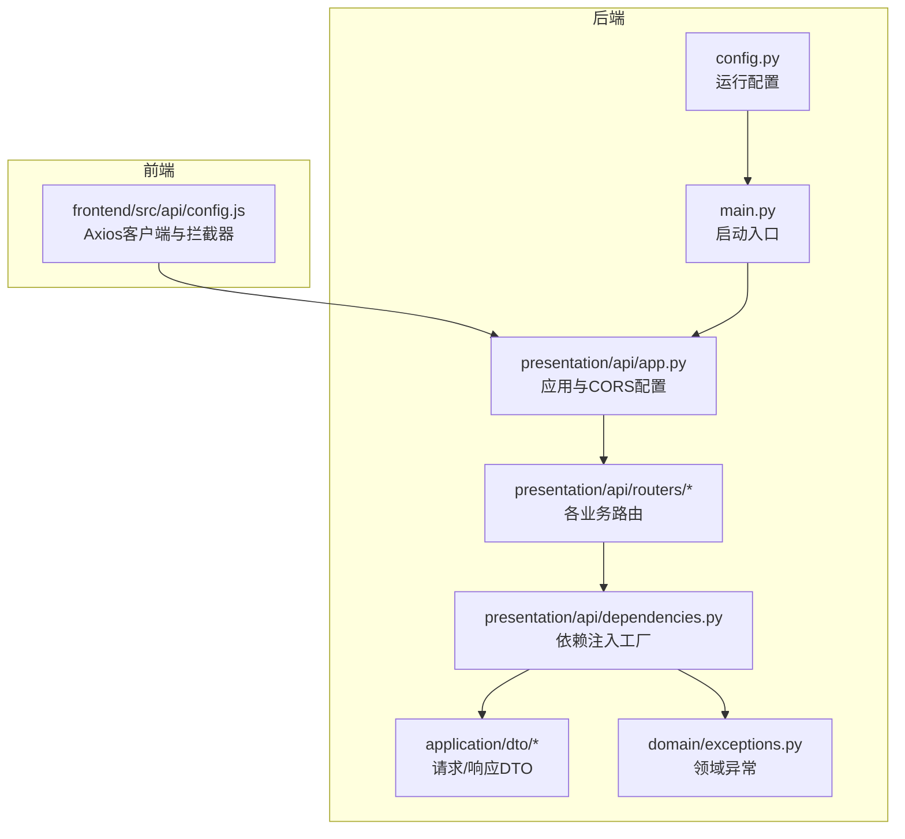
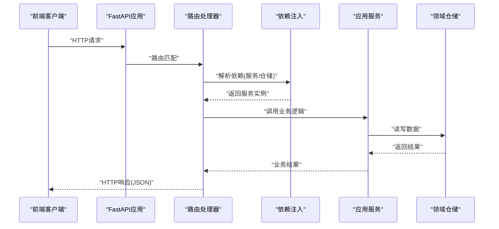
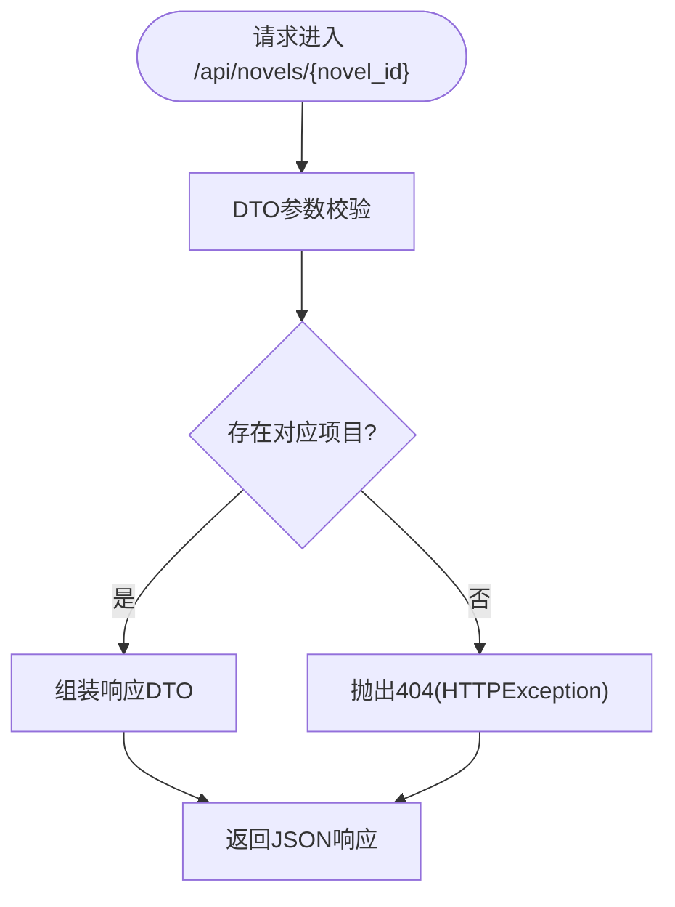
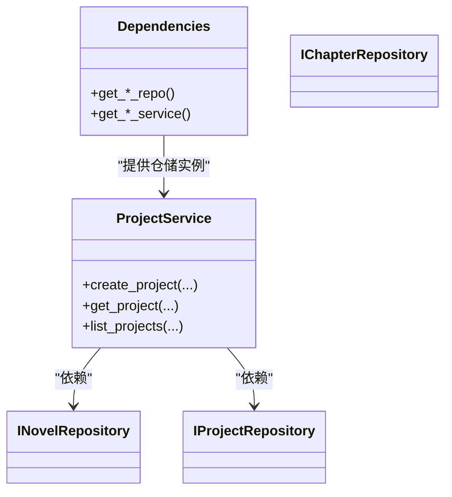
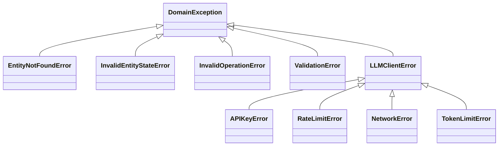

# API接口问题

<cite>
**本文引用的文件**
- [presentation/api/app.py](file://presentation/api/app.py)
- [presentation/api/dependencies.py](file://presentation/api/dependencies.py)
- [presentation/api/routers/novel.py](file://presentation/api/routers/novel.py)
- [presentation/api/routers/project.py](file://presentation/api/routers/project.py)
- [presentation/api/routers/content.py](file://presentation/api/routers/content.py)
- [presentation/api/routers/export.py](file://presentation/api/routers/export.py)
- [application/dto/request_dto.py](file://application/dto/request_dto.py)
- [application/dto/response_dto.py](file://application/dto/response_dto.py)
- [domain/exceptions.py](file://domain/exceptions.py)
- [config.py](file://config.py)
- [main.py](file://main.py)
- [frontend/src/api/config.js](file://frontend/src/api/config.js)
</cite>

## 目录
1. [简介](#简介)
2. [项目结构](#项目结构)
3. [核心组件](#核心组件)
4. [架构总览](#架构总览)
5. [详细组件分析](#详细组件分析)
6. [依赖分析](#依赖分析)
7. [性能考虑](#性能考虑)
8. [故障排查指南](#故障排查指南)
9. [结论](#结论)
10. [附录](#附录)

## 简介
本指南面向InkTrace项目的API使用者与维护者，聚焦于RESTful API调用失败的系统化排查方法。内容涵盖：
- HTTP状态码分析与常见错误定位
- 请求参数验证与响应格式检查
- 路由配置问题排查与修复
- 服务依赖注入失败的诊断与解决
- 性能问题的监控与优化建议
- 错误处理机制与自定义异常的使用
- API测试工具与调试技巧

## 项目结构
InkTrace采用FastAPI作为后端框架，API路由集中在presentation/api/routers下，通过依赖注入模块统一提供服务实例；前端使用Axios进行HTTP调用。

图表来源
- [presentation/api/app.py:19-62](file://presentation/api/app.py#L19-L62)
- [presentation/api/dependencies.py:50-177](file://presentation/api/dependencies.py#L50-L177)
- [presentation/api/routers/novel.py:21-161](file://presentation/api/routers/novel.py#L21-L161)
- [application/dto/request_dto.py:14-97](file://application/dto/request_dto.py#L14-L97)
- [application/dto/response_dto.py:15-200](file://application/dto/response_dto.py#L15-L200)
- [domain/exceptions.py:11-99](file://domain/exceptions.py#L11-L99)
- [config.py:14-46](file://config.py#L14-L46)
- [main.py:15-21](file://main.py#L15-L21)
- [frontend/src/api/config.js:19-55](file://frontend/src/api/config.js#L19-L55)

章节来源
- [presentation/api/app.py:19-62](file://presentation/api/app.py#L19-L62)
- [presentation/api/dependencies.py:50-177](file://presentation/api/dependencies.py#L50-L177)
- [presentation/api/routers/novel.py:21-161](file://presentation/api/routers/novel.py#L21-L161)
- [application/dto/request_dto.py:14-97](file://application/dto/request_dto.py#L14-L97)
- [application/dto/response_dto.py:15-200](file://application/dto/response_dto.py#L15-L200)
- [domain/exceptions.py:11-99](file://domain/exceptions.py#L11-L99)
- [config.py:14-46](file://config.py#L14-L46)
- [main.py:15-21](file://main.py#L15-L21)
- [frontend/src/api/config.js:19-55](file://frontend/src/api/config.js#L19-L55)

## 核心组件
- 应用与路由注册：在应用创建函数中集中注册各模块路由，并开放健康检查端点。
- 依赖注入：通过带缓存的工厂函数提供仓储与服务实例，支持环境变量配置。
- DTO：统一请求/响应结构，便于前后端契约一致与自动校验。
- 异常体系：领域异常与LLM客户端异常分类明确，便于HTTP映射与错误提示。
- 启动与配置：通过配置类读取环境变量，支持主机、端口、数据库路径与LLM密钥。

章节来源
- [presentation/api/app.py:19-62](file://presentation/api/app.py#L19-L62)
- [presentation/api/dependencies.py:50-177](file://presentation/api/dependencies.py#L50-L177)
- [application/dto/request_dto.py:14-97](file://application/dto/request_dto.py#L14-L97)
- [application/dto/response_dto.py:15-200](file://application/dto/response_dto.py#L15-L200)
- [domain/exceptions.py:11-99](file://domain/exceptions.py#L11-L99)
- [config.py:14-46](file://config.py#L14-L46)

## 架构总览
下图展示API调用的关键流程：前端Axios发起请求，经CORS中间件与路由处理器，进入服务层，最终通过依赖注入的仓储完成持久化。

图表来源
- [presentation/api/app.py:27-52](file://presentation/api/app.py#L27-L52)
- [presentation/api/routers/novel.py:24-61](file://presentation/api/routers/novel.py#L24-L61)
- [presentation/api/dependencies.py:122-141](file://presentation/api/dependencies.py#L122-L141)
- [application/services/project_service.py:32-67](file://application/services/project_service.py#L32-L67)

## 详细组件分析

### 路由与控制器（示例：小说管理）
- 路由前缀与标签：统一以/api/novels为前缀，便于URL组织与文档生成。
- 参数校验：请求体基于Pydantic DTO，自动进行字段长度、数值范围与必填约束。
- 错误映射：未找到实体时返回404，便于前端区分“资源不存在”场景。
- 响应模型：统一使用响应DTO，确保字段一致性与可扩展性。

图表来源
- [presentation/api/routers/novel.py:88-110](file://presentation/api/routers/novel.py#L88-L110)
- [application/dto/response_dto.py:22-34](file://application/dto/response_dto.py#L22-L34)

章节来源
- [presentation/api/routers/novel.py:21-161](file://presentation/api/routers/novel.py#L21-L161)
- [application/dto/request_dto.py:21-27](file://application/dto/request_dto.py#L21-L27)
- [application/dto/response_dto.py:15-200](file://application/dto/response_dto.py#L15-L200)

### 依赖注入与服务装配
- 缓存工厂：使用LRU缓存避免重复创建仓储与服务实例，提升性能。
- 环境变量：数据库路径、模板目录、向量库目录、LLM密钥均来自环境变量，便于部署定制。
- 服务组合：服务构造函数内组合多个仓储，体现应用层对多仓储的协调能力。

图表来源
- [presentation/api/dependencies.py:122-141](file://presentation/api/dependencies.py#L122-L141)
- [application/services/project_service.py:21-31](file://application/services/project_service.py#L21-L31)

章节来源
- [presentation/api/dependencies.py:50-177](file://presentation/api/dependencies.py#L50-L177)
- [application/services/project_service.py:21-31](file://application/services/project_service.py#L21-L31)

### 错误处理与异常体系
- 领域异常：提供实体未找到、状态非法、操作非法、验证错误等分类。
- LLM异常：API密钥、限流、网络、Token上限等，便于区分外部服务问题。
- 路由映射：在路由层将异常转换为HTTP状态码与可读消息，前端可据此提示用户。

图表来源
- [domain/exceptions.py:11-99](file://domain/exceptions.py#L11-L99)

章节来源
- [domain/exceptions.py:11-99](file://domain/exceptions.py#L11-L99)
- [presentation/api/routers/content.py:121-125](file://presentation/api/routers/content.py#L121-L125)
- [presentation/api/routers/project.py:102-103](file://presentation/api/routers/project.py#L102-L103)

### 前端Axios客户端与拦截器
- 基础URL：开发模式或本地文件协议下默认指向127.0.0.1:9527。
- 请求/响应拦截器：打印日志、统一错误处理与消息提取，便于调试。

章节来源
- [frontend/src/api/config.js:19-55](file://frontend/src/api/config.js#L19-L55)

## 依赖分析
- 组件耦合：路由依赖依赖注入模块提供的服务；服务依赖仓储接口；仓储实现位于基础设施层。
- 外部依赖：FastAPI、Pydantic、Axios；数据库与向量库路径通过环境变量注入。
- 潜在风险：依赖注入缓存失效、环境变量缺失、路由未注册导致404。

图表来源
- [presentation/api/dependencies.py:122-141](file://presentation/api/dependencies.py#L122-L141)
- [presentation/api/routers/novel.py:27-28](file://presentation/api/routers/novel.py#L27-L28)
- [frontend/src/api/config.js:19-55](file://frontend/src/api/config.js#L19-L55)

章节来源
- [presentation/api/dependencies.py:50-177](file://presentation/api/dependencies.py#L50-L177)
- [presentation/api/routers/novel.py:21-61](file://presentation/api/routers/novel.py#L21-L61)
- [frontend/src/api/config.js:19-55](file://frontend/src/api/config.js#L19-L55)

## 性能考虑
- 依赖缓存：使用LRU缓存减少重复初始化成本。
- 批量查询：在路由层合并多次查询（如统计字数、章节数）以降低数据库往返。
- DTO序列化：使用Pydantic模型自动序列化，避免手动拼装。
- 并发与超时：前端Axios设置合理超时，避免长时间阻塞；后端路由尽量短链路处理。
- 日志与追踪：在路由与服务层添加trace_id，便于跨服务定位性能瓶颈。

## 故障排查指南

### 一、HTTP状态码分析与常见错误定位
- 400（参数错误/业务异常）：检查请求DTO字段是否满足约束；查看路由中对枚举值、数值范围的校验与错误映射。
- 404（资源未找到）：确认ID有效且资源存在；关注路由中对“不存在”的HTTP映射。
- 401/403（鉴权相关）：当前路由未显式鉴权，若出现鉴权错误需检查网关或中间件配置。
- 500（服务器内部错误）：检查服务层异常是否被正确捕获并映射；关注外部服务（LLM）异常分支。

章节来源
- [presentation/api/routers/novel.py:107-108](file://presentation/api/routers/novel.py#L107-L108)
- [presentation/api/routers/content.py:121-125](file://presentation/api/routers/content.py#L121-L125)
- [presentation/api/routers/project.py:102-103](file://presentation/api/routers/project.py#L102-L103)

### 二、请求参数验证与响应格式检查
- 请求参数验证：确认请求体符合DTO字段要求（必填、长度、范围），并在路由中进行额外校验（如枚举值）。
- 响应格式检查：统一使用响应DTO，前端按DTO结构解析；若返回非标准结构，需在路由层修正。

章节来源
- [application/dto/request_dto.py:21-27](file://application/dto/request_dto.py#L21-L27)
- [application/dto/response_dto.py:15-200](file://application/dto/response_dto.py#L15-L200)

### 三、API路由配置问题排查与修复
- 路由未注册：确认在应用创建函数中include_router了对应模块。
- CORS问题：检查CORS中间件配置是否允许前端域名与方法。
- 根路径与健康检查：确认根路径与健康检查端点可用，便于快速验证服务可用性。

章节来源
- [presentation/api/app.py:35-52](file://presentation/api/app.py#L35-L52)
- [presentation/api/app.py:54-60](file://presentation/api/app.py#L54-L60)

### 四、服务依赖注入失败的诊断与解决
- 环境变量缺失：检查数据库路径、模板目录、向量库目录、LLM密钥是否正确设置。
- 缓存失效：确认依赖工厂函数未被意外禁用或覆盖；必要时清理缓存后重启。
- 仓储实现缺失：确保各仓储接口有对应实现类并正确导入。

章节来源
- [presentation/api/dependencies.py:45-47](file://presentation/api/dependencies.py#L45-L47)
- [presentation/api/dependencies.py:50-177](file://presentation/api/dependencies.py#L50-L177)
- [config.py:30-42](file://config.py#L30-L42)

### 五、API性能问题的监控与优化建议
- 监控指标：记录路由耗时、数据库查询次数、外部LLM调用延迟与失败率。
- 优化策略：合并查询、启用缓存、异步处理长任务、合理设置超时与重试。
- 日志追踪：为每个请求生成trace_id，贯穿前端、后端与外部服务。

### 六、错误处理机制与自定义异常的使用
- 路由层：将业务异常转换为HTTP状态码与可读消息；对外部服务异常进行分类处理。
- 领域层：使用领域异常表达业务语义；LLM异常用于区分外部服务问题。
- 前端：在响应拦截器中提取错误信息并友好提示。

章节来源
- [domain/exceptions.py:11-99](file://domain/exceptions.py#L11-L99)
- [presentation/api/routers/content.py:199-213](file://presentation/api/routers/content.py#L199-L213)

### 七、API测试工具与调试技巧
- 测试工具：推荐使用curl或Postman直接调用路由端点，快速验证参数与响应。
- 调试技巧：
  - 开启后端debug模式（通过配置项）以便热重载与更详细的错误栈。
  - 在前端Axios拦截器中打印请求与响应，结合后端日志定位问题。
  - 对外部LLM调用增加重试与退避策略，避免瞬时限流影响。

章节来源
- [main.py:15-21](file://main.py#L15-L21)
- [frontend/src/api/config.js:30-49](file://frontend/src/api/config.js#L30-L49)

## 结论
通过统一的路由与依赖注入设计、清晰的DTO契约与异常体系，InkTrace的API具备良好的可维护性与可扩展性。建议在日常运维中重点关注环境变量配置、路由注册与CORS设置，配合前端拦截器与后端日志实现快速定位与修复。

## 附录
- 快速检查清单
  - 确认应用监听地址与端口（host/port）正确
  - 确认数据库与向量库目录存在且可写
  - 确认LLM密钥已配置
  - 确认CORS允许前端来源
  - 确认路由已include_router
  - 使用curl/Postman验证关键端点
  - 查看后端日志与前端控制台错误