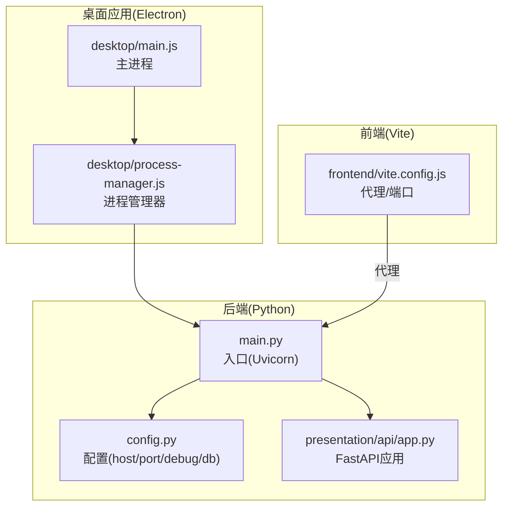
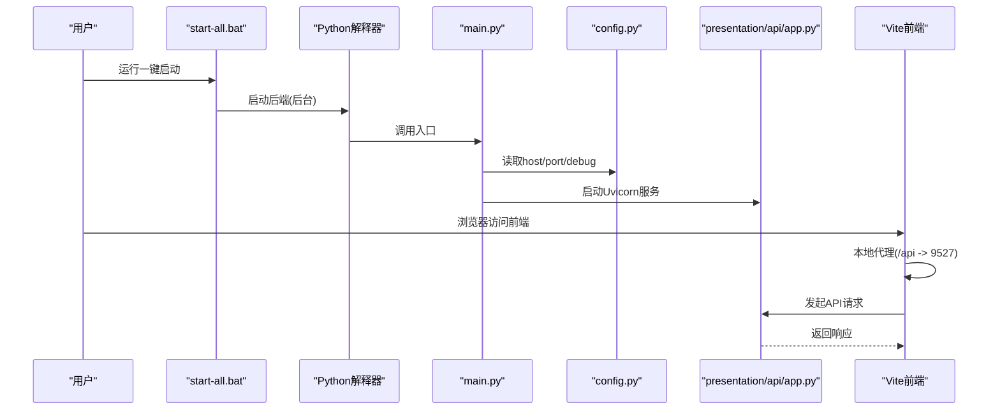
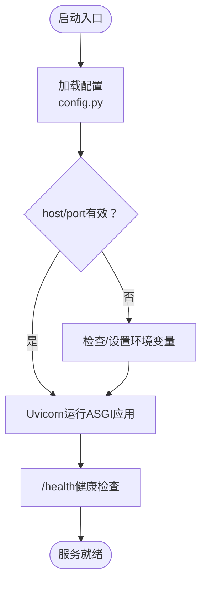
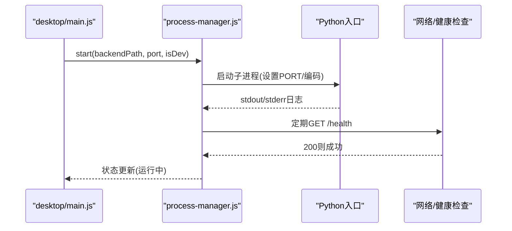
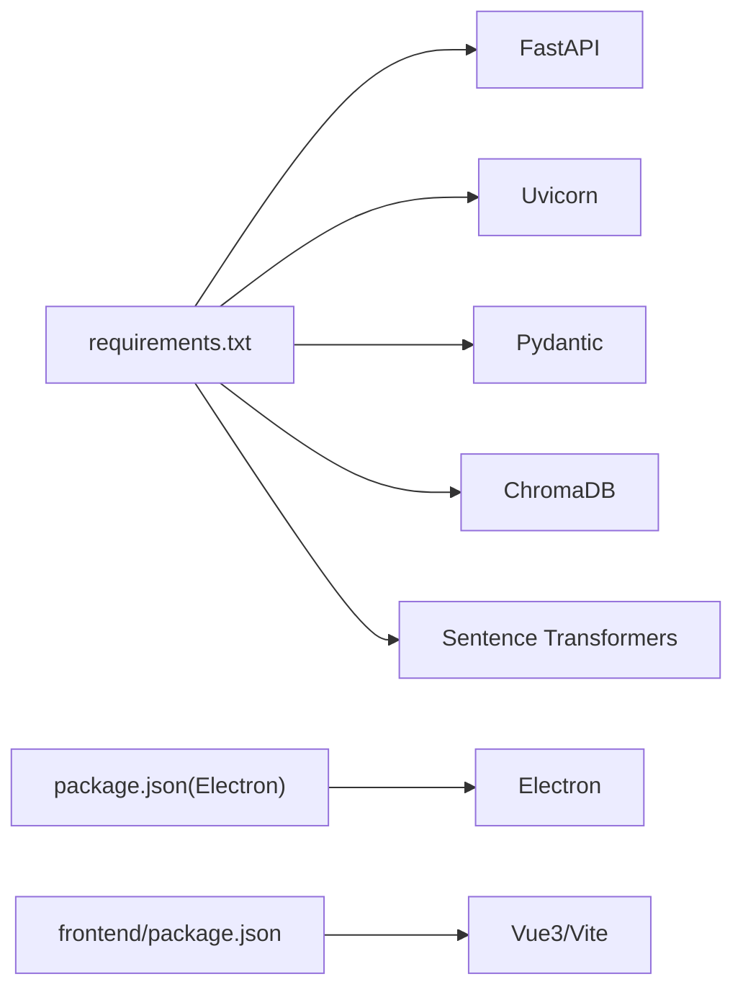

# 启动问题排查

<cite>
**本文引用的文件**
- [main.py](file://main.py)
- [config.py](file://config.py)
- [requirements.txt](file://requirements.txt)
- [start.bat](file://start.bat)
- [start-all.bat](file://start-all.bat)
- [start-frontend.bat](file://start-frontend.bat)
- [stop.bat](file://stop.bat)
- [presentation/api/app.py](file://presentation/api/app.py)
- [frontend/vite.config.js](file://frontend/vite.config.js)
- [docs/STARTUP_GUIDE.md](file://docs/STARTUP_GUIDE.md)
- [desktop/main.js](file://desktop/main.js)
- [desktop/process-manager.js](file://desktop/process-manager.js)
- [package.json](file://package.json)
- [frontend/package.json](file://frontend/package.json)
</cite>

## 目录
1. [简介](#简介)
2. [项目结构](#项目结构)
3. [核心组件](#核心组件)
4. [架构总览](#架构总览)
5. [详细组件分析](#详细组件分析)
6. [依赖分析](#依赖分析)
7. [性能考虑](#性能考虑)
8. [故障排查指南](#故障排查指南)
9. [结论](#结论)
10. [附录](#附录)

## 简介
本指南面向InkTrace项目的启动问题排查，覆盖Python环境与依赖、端口占用、配置文件、启动脚本与桌面应用进程管理等常见问题。内容基于仓库中的启动脚本、配置模块、API应用入口、前端代理与桌面进程管理器等实际实现，提供可操作的诊断步骤与解决建议。

## 项目结构
InkTrace采用前后端分离与桌面应用集成的启动模式：
- 后端：Python FastAPI服务，通过Uvicorn运行，监听配置的host与port。
- 前端：Vue3 + Vite开发服务器，默认端口3000，通过代理转发到后端9527端口。
- 桌面应用：Electron主进程负责窗口、托盘与后端进程管理，开发模式下直接调用Python入口，生产模式下调用打包后的后端可执行文件。
- 启动脚本：提供一键启动、单独启动后端/前端、后台启动与停止等能力。

图表来源
- [desktop/main.js:130-141](file://desktop/main.js#L130-L141)
- [desktop/process-manager.js:20-91](file://desktop/process-manager.js#L20-L91)
- [main.py:15-21](file://main.py#L15-L21)
- [config.py:14-46](file://config.py#L14-L46)
- [presentation/api/app.py:19-66](file://presentation/api/app.py#L19-L66)
- [frontend/vite.config.js:13-21](file://frontend/vite.config.js#L13-L21)

章节来源
- [docs/STARTUP_GUIDE.md:161-183](file://docs/STARTUP_GUIDE.md#L161-L183)

## 核心组件
- 后端入口与运行参数
  - 入口文件通过Uvicorn运行FastAPI应用实例，参数来自配置模块的host、port与debug标志。
- 配置模块
  - 提供host、port、debug、db_path以及API密钥字段；支持从环境变量覆盖默认值。
- 启动脚本
  - start-all.bat：检查Python与Node.js，后台启动后端，前台启动前端。
  - start.bat：检查Python并安装必要依赖后启动后端。
  - start-frontend.bat：检查Node.js后启动前端开发服务器。
  - stop.bat：查找并终止占用9527端口的进程。
- 前端代理
  - Vite开发服务器将/api前缀代理至后端9527端口，便于跨域访问。
- 桌面进程管理
  - Electron主进程通过进程管理器启动/监控后端，开发模式下调用Python入口，生产模式下调用打包后端可执行文件；内置健康检查与超时处理。

章节来源
- [main.py:15-21](file://main.py#L15-L21)
- [config.py:14-46](file://config.py#L14-L46)
- [start-all.bat:10-49](file://start-all.bat#L10-L49)
- [start.bat:11-39](file://start.bat#L11-L39)
- [start-frontend.bat:7-23](file://start-frontend.bat#L7-L23)
- [stop.bat:7-24](file://stop.bat#L7-L24)
- [frontend/vite.config.js:13-21](file://frontend/vite.config.js#L13-L21)
- [desktop/main.js:130-141](file://desktop/main.js#L130-L141)
- [desktop/process-manager.js:162-203](file://desktop/process-manager.js#L162-L203)

## 架构总览
下图展示从用户命令到服务可用的关键流程与组件交互。

图表来源
- [start-all.bat:30-38](file://start-all.bat#L30-L38)
- [main.py:15-21](file://main.py#L15-L21)
- [config.py:30-46](file://config.py#L30-L46)
- [presentation/api/app.py:19-66](file://presentation/api/app.py#L19-L66)
- [frontend/vite.config.js:13-21](file://frontend/vite.config.js#L13-L21)

## 详细组件分析

### 后端入口与配置
- 入口运行逻辑
  - 使用Uvicorn运行指定的ASGI应用对象，传入host、port与reload参数。
- 配置加载
  - 默认host=127.0.0.1、port=9527、debug=true；可通过环境变量覆盖。
  - 支持数据库路径与API密钥注入。
- 依赖要求
  - requirements.txt声明了FastAPI、Uvicorn、Pydantic、ChromaDB、Sentence Transformers等关键依赖。

图表来源
- [main.py:15-21](file://main.py#L15-L21)
- [config.py:14-46](file://config.py#L14-L46)

章节来源
- [main.py:15-21](file://main.py#L15-L21)
- [config.py:14-46](file://config.py#L14-L46)
- [requirements.txt:1-10](file://requirements.txt#L1-L10)

### 启动脚本与桌面进程管理
- start-all.bat
  - 检查Python与Node.js版本，后台启动后端，前台启动前端。
- start.bat
  - 检查Python并安装必要依赖后启动后端。
- start-frontend.bat
  - 检查Node.js并启动前端开发服务器。
- stop.bat
  - 通过netstat定位9527端口进程并终止。
- 桌面进程管理
  - 主进程先创建窗口，再启动后端；开发模式调用Python入口，生产模式调用打包后端可执行文件；内置健康检查与超时处理。

图表来源
- [desktop/main.js:130-141](file://desktop/main.js#L130-L141)
- [desktop/process-manager.js:20-91](file://desktop/process-manager.js#L20-L91)
- [desktop/process-manager.js:162-203](file://desktop/process-manager.js#L162-L203)

章节来源
- [start-all.bat:10-49](file://start-all.bat#L10-L49)
- [start.bat:11-39](file://start.bat#L11-L39)
- [start-frontend.bat:7-23](file://start-frontend.bat#L7-L23)
- [stop.bat:7-24](file://stop.bat#L7-L24)
- [desktop/main.js:130-141](file://desktop/main.js#L130-L141)
- [desktop/process-manager.js:20-91](file://desktop/process-manager.js#L20-L91)
- [desktop/process-manager.js:162-203](file://desktop/process-manager.js#L162-L203)

### 前端代理与访问路径
- Vite开发服务器默认端口3000，将/api前缀代理到后端9527端口。
- 访问地址
  - 前端界面：http://localhost:3000
  - 后端API：http://127.0.0.1:9527
  - API文档：/docs 与 /redoc

章节来源
- [frontend/vite.config.js:13-21](file://frontend/vite.config.js#L13-L21)
- [docs/STARTUP_GUIDE.md:93-100](file://docs/STARTUP_GUIDE.md#L93-L100)

## 依赖分析
- Python依赖
  - 通过requirements.txt统一声明，包含FastAPI、Uvicorn、Pydantic、ChromaDB、Sentence Transformers等。
- Node.js依赖
  - 前端项目依赖Vue3、Vite、Element Plus等；桌面应用依赖Electron与构建工具。
- 端口与网络
  - 后端默认9527，前端默认3000；桌面应用通过进程管理器启动后端并进行健康检查。

图表来源
- [requirements.txt:1-10](file://requirements.txt#L1-L10)
- [package.json:16-19](file://package.json#L16-L19)
- [frontend/package.json:11-22](file://frontend/package.json#L11-L22)

章节来源
- [requirements.txt:1-10](file://requirements.txt#L1-L10)
- [package.json:16-19](file://package.json#L16-L19)
- [frontend/package.json:11-22](file://frontend/package.json#L11-L22)

## 性能考虑
- 启动速度
  - 健康检查超时约30秒，若后端初始化耗时较长，建议优化数据库连接与向量索引加载策略。
- 资源占用
  - 后端与前端同时运行时，注意CPU与内存占用；必要时调整向量库与模型加载策略。
- 网络代理
  - 前端代理仅用于开发场景；生产部署应确保反向代理正确转发请求。

## 故障排查指南

### 一、Python环境与依赖问题
- 症状
  - 启动脚本报错“未找到Python”或依赖安装失败。
- 排查步骤
  - 确认Python版本满足要求且已加入系统PATH。
  - 在项目根目录执行依赖安装，确保网络可访问。
  - 若使用虚拟环境，确保激活后再执行启动脚本。
- 相关文件
  - [start.bat:11-27](file://start.bat#L11-L27)
  - [requirements.txt:1-10](file://requirements.txt#L1-L10)

章节来源
- [start.bat:11-27](file://start.bat#L11-L27)
- [requirements.txt:1-10](file://requirements.txt#L1-L10)

### 二、端口占用与访问异常
- 症状
  - 启动后无法访问、浏览器提示连接被拒绝或端口被占用。
- 排查步骤
  - 使用系统工具查看9527端口占用并终止对应进程。
  - 修改后端端口：通过环境变量或直接修改配置文件。
  - 前端代理需确保代理目标与后端端口一致。
- 相关文件
  - [stop.bat:7-24](file://stop.bat#L7-L24)
  - [config.py:30-46](file://config.py#L30-L46)
  - [frontend/vite.config.js:13-21](file://frontend/vite.config.js#L13-L21)
  - [docs/STARTUP_GUIDE.md:101-118](file://docs/STARTUP_GUIDE.md#L101-L118)

章节来源
- [stop.bat:7-24](file://stop.bat#L7-L24)
- [config.py:30-46](file://config.py#L30-L46)
- [frontend/vite.config.js:13-21](file://frontend/vite.config.js#L13-L21)
- [docs/STARTUP_GUIDE.md:101-118](file://docs/STARTUP_GUIDE.md#L101-L118)

### 三、配置文件与环境变量
- 症状
  - 服务启动但行为不符合预期（如host绑定、调试模式、数据库路径）。
- 排查步骤
  - 检查环境变量是否正确设置（主机名、端口、调试开关、数据库路径、API密钥）。
  - 如需临时修改，可在启动脚本中设置或直接编辑配置文件。
- 相关文件
  - [config.py:14-46](file://config.py#L14-L46)
  - [start-all.bat:7-8](file://start-all.bat#L7-L8)
  - [start.bat:7-9](file://start.bat#L7-L9)

章节来源
- [config.py:14-46](file://config.py#L14-L46)
- [start-all.bat:7-8](file://start-all.bat#L7-L8)
- [start.bat:7-9](file://start.bat#L7-L9)

### 四、启动脚本使用与流程
- 一键启动
  - 使用一键启动脚本，会自动检查Python与Node.js并分别启动后端与前端。
- 单独启动
  - 后端：使用后端启动脚本；前端：使用前端启动脚本。
- 停止服务
  - 使用停止脚本按端口查找并终止进程。
- 相关文件
  - [start-all.bat:57-85](file://start-all.bat#L57-L85)
  - [start.bat:30-39](file://start.bat#L30-L39)
  - [start-frontend.bat:17-23](file://start-frontend.bat#L17-L23)
  - [stop.bat:7-24](file://stop.bat#L7-L24)

章节来源
- [start-all.bat:57-85](file://start-all.bat#L57-L85)
- [start.bat:30-39](file://start.bat#L30-L39)
- [start-frontend.bat:17-23](file://start-frontend.bat#L17-L23)
- [stop.bat:7-24](file://stop.bat#L7-L24)

### 五、桌面应用启动问题
- 症状
  - 桌面应用启动后前端界面加载失败，或后端未启动。
- 排查步骤
  - 检查开发/生产模式下的后端路径与可执行文件是否存在。
  - 关注进程管理器的健康检查与超时处理逻辑。
  - 查看主进程日志与错误弹窗提示。
- 相关文件
  - [desktop/main.js:130-141](file://desktop/main.js#L130-L141)
  - [desktop/process-manager.js:20-91](file://desktop/process-manager.js#L20-L91)
  - [desktop/process-manager.js:162-203](file://desktop/process-manager.js#L162-L203)

章节来源
- [desktop/main.js:130-141](file://desktop/main.js#L130-L141)
- [desktop/process-manager.js:20-91](file://desktop/process-manager.js#L20-L91)
- [desktop/process-manager.js:162-203](file://desktop/process-manager.js#L162-L203)

### 六、不同操作系统下的注意事项
- Windows
  - 使用批处理脚本启动；注意PATH中Python与Node.js的可见性。
  - 桌面应用开发模式下，后端由Python解释器直接运行。
- Linux/macOS
  - 使用脚本时注意权限与shebang；必要时将脚本设为可执行。
  - 桌面应用生产模式下，后端可执行文件路径需与打包结构一致。

章节来源
- [start-all.bat:10-16](file://start-all.bat#L10-L16)
- [start.bat:11-17](file://start.bat#L11-L17)
- [start-frontend.bat:7-13](file://start-frontend.bat#L7-L13)
- [desktop/main.js:133-135](file://desktop/main.js#L133-L135)

## 结论
InkTrace的启动问题多集中在环境准备、端口占用与配置覆盖三个方面。按照本指南的分步排查方法，结合启动脚本与桌面进程管理器的日志输出，通常可以快速定位并解决问题。建议在首次部署时优先完成依赖安装与端口检查，并在开发环境中启用调试模式以获得更清晰的错误信息。

## 附录
- 快速检查清单
  - 已安装Python 3.11+与Node.js 18+
  - 已执行依赖安装（后端pip、前端npm）
  - 已配置API密钥（可选）
  - 已确认端口未被占用
  - 已使用一键启动脚本验证
- 参考文档
  - [docs/STARTUP_GUIDE.md:185-194](file://docs/STARTUP_GUIDE.md#L185-L194)