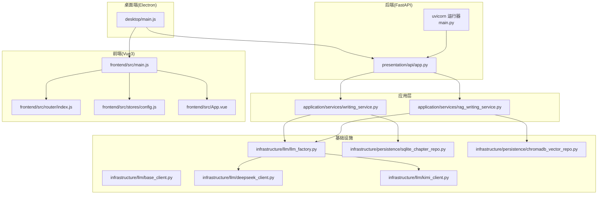
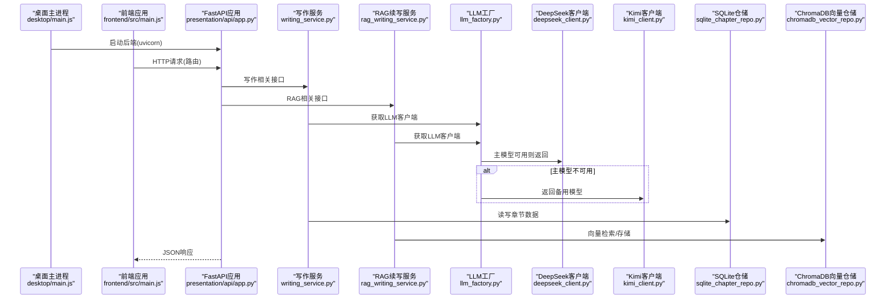
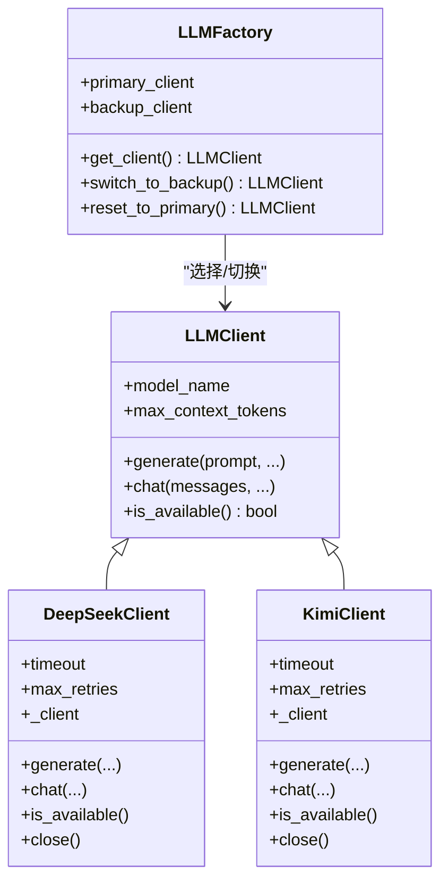
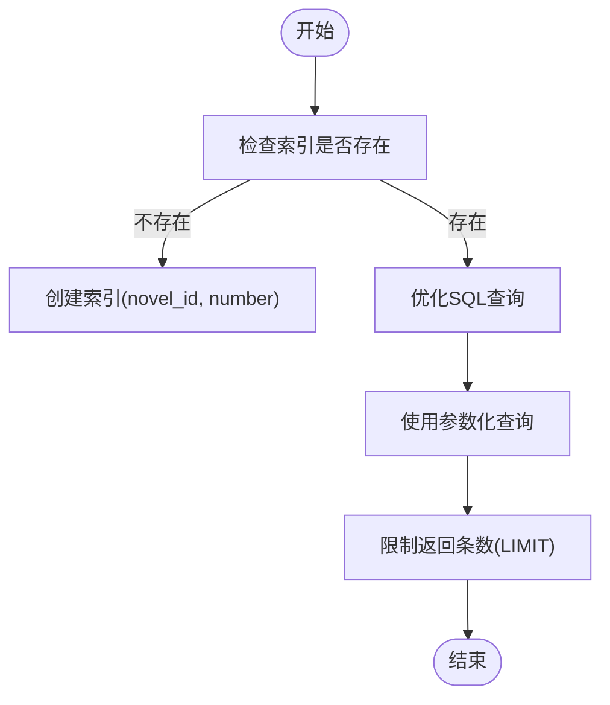
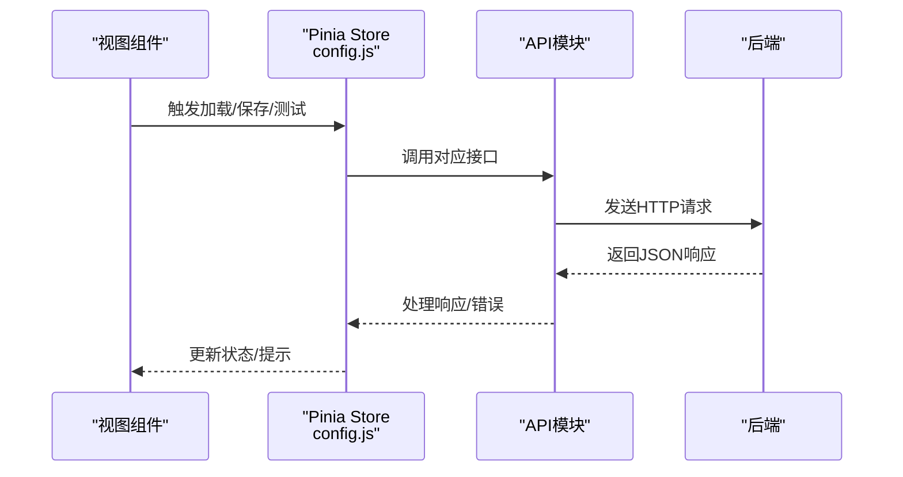
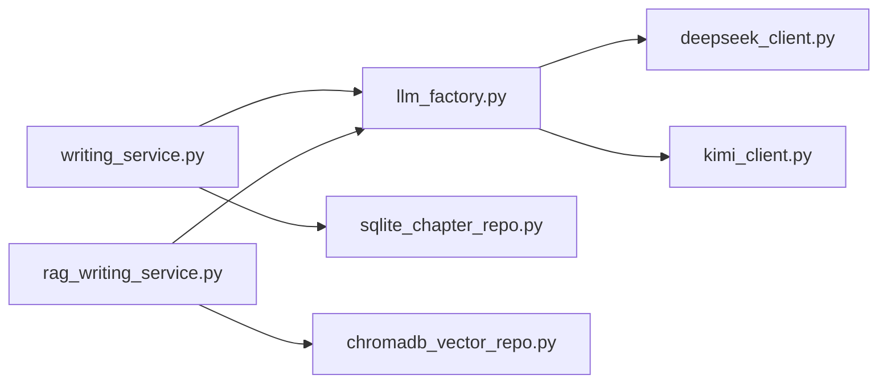

# 性能问题诊断

<cite>
**本文引用的文件**
- [main.py](file://main.py)
- [presentation/api/app.py](file://presentation/api/app.py)
- [frontend/src/main.js](file://frontend/src/main.js)
- [desktop/main.js](file://desktop/main.js)
- [infrastructure/llm/base_client.py](file://infrastructure/llm/base_client.py)
- [infrastructure/llm/deepseek_client.py](file://infrastructure/llm/deepseek_client.py)
- [infrastructure/llm/kimi_client.py](file://infrastructure/llm/kimi_client.py)
- [infrastructure/llm/llm_factory.py](file://infrastructure/llm/llm_factory.py)
- [application/services/writing_service.py](file://application/services/writing_service.py)
- [application/services/rag_writing_service.py](file://application/services/rag_writing_service.py)
- [infrastructure/persistence/sqlite_chapter_repo.py](file://infrastructure/persistence/sqlite_chapter_repo.py)
- [infrastructure/persistence/chromadb_vector_repo.py](file://infrastructure/persistence/chromadb_vector_repo.py)
- [frontend/src/App.vue](file://frontend/src/App.vue)
- [frontend/src/router/index.js](file://frontend/src/router/index.js)
- [frontend/src/stores/config.js](file://frontend/src/stores/config.js)
</cite>

## 目录
1. [简介](#简介)
2. [项目结构](#项目结构)
3. [核心组件](#核心组件)
4. [架构总览](#架构总览)
5. [详细组件分析](#详细组件分析)
6. [依赖分析](#依赖分析)
7. [性能考虑](#性能考虑)
8. [故障排除指南](#故障排除指南)
9. [结论](#结论)
10. [附录](#附录)

## 简介
本指南面向InkTrace项目的性能问题诊断与优化，覆盖后端响应慢、内存占用高、CPU使用率异常；AI模型调用性能优化（并发控制、缓存、批处理）；数据库查询性能分析与优化（索引、SQL、连接池）；前端界面性能（组件渲染、状态管理、网络请求）；内存泄漏检测与修复；性能监控工具与关键指标；以及不同场景下的性能基准测试与优化案例。

## 项目结构
InkTrace采用多层架构：桌面端Electron承载前后端运行环境，后端基于FastAPI提供REST API，应用层封装业务流程，基础设施层负责LLM客户端与持久化，前端使用Vue3+Pinia+Element Plus构建用户界面。

图表来源
- [main.py:15-21](file://main.py#L15-L21)
- [presentation/api/app.py:19-62](file://presentation/api/app.py#L19-L62)
- [desktop/main.js:130-141](file://desktop/main.js#L130-L141)
- [infrastructure/llm/llm_factory.py:31-95](file://infrastructure/llm/llm_factory.py#L31-L95)
- [infrastructure/llm/deepseek_client.py:25-64](file://infrastructure/llm/deepseek_client.py#L25-L64)
- [infrastructure/llm/kimi_client.py:25-64](file://infrastructure/llm/kimi_client.py#L25-L64)
- [application/services/writing_service.py:30-46](file://application/services/writing_service.py#L30-L46)
- [application/services/rag_writing_service.py:25-41](file://application/services/rag_writing_service.py#L25-L41)
- [infrastructure/persistence/sqlite_chapter_repo.py:19-31](file://infrastructure/persistence/sqlite_chapter_repo.py#L19-L31)
- [infrastructure/persistence/chromadb_vector_repo.py:19-34](file://infrastructure/persistence/chromadb_vector_repo.py#L19-L34)
- [frontend/src/main.js:12-22](file://frontend/src/main.js#L12-L22)
- [frontend/src/router/index.js:1-74](file://frontend/src/router/index.js#L1-L74)
- [frontend/src/stores/config.js:14-240](file://frontend/src/stores/config.js#L14-L240)

章节来源
- [main.py:15-21](file://main.py#L15-L21)
- [presentation/api/app.py:19-62](file://presentation/api/app.py#L19-L62)
- [desktop/main.js:130-141](file://desktop/main.js#L130-L141)
- [frontend/src/main.js:12-22](file://frontend/src/main.js#L12-L22)

## 核心组件
- 后端入口与运行器：通过uvicorn在指定主机与端口启动FastAPI应用，支持热重载用于开发。
- FastAPI应用：注册多组路由，提供健康检查端点，统一跨域中间件。
- 桌面端主进程：负责创建窗口、加载前端、启动后端Python进程、系统托盘与IPC通信。
- LLM客户端与工厂：抽象统一接口，具体实现DeepSeek与Kimi客户端，工厂负责主备切换与可用性探测。
- 应用服务：写作服务与RAG续写服务，前者负责剧情规划与章节生成，后者结合向量检索增强续写。
- 持久化：SQLite章节仓储与ChromaDB向量仓储，分别支撑章节数据与RAG检索。
- 前端：Vue3应用、路由懒加载、Pinia状态管理、Element Plus UI。

章节来源
- [main.py:15-21](file://main.py#L15-L21)
- [presentation/api/app.py:19-62](file://presentation/api/app.py#L19-L62)
- [desktop/main.js:130-141](file://desktop/main.js#L130-L141)
- [infrastructure/llm/base_client.py:14-82](file://infrastructure/llm/base_client.py#L14-L82)
- [infrastructure/llm/llm_factory.py:31-95](file://infrastructure/llm/llm_factory.py#L31-L95)
- [application/services/writing_service.py:30-46](file://application/services/writing_service.py#L30-L46)
- [application/services/rag_writing_service.py:25-41](file://application/services/rag_writing_service.py#L25-L41)
- [infrastructure/persistence/sqlite_chapter_repo.py:19-31](file://infrastructure/persistence/sqlite_chapter_repo.py#L19-L31)
- [infrastructure/persistence/chromadb_vector_repo.py:19-34](file://infrastructure/persistence/chromadb_vector_repo.py#L19-L34)
- [frontend/src/main.js:12-22](file://frontend/src/main.js#L12-L22)

## 架构总览
下图展示从桌面端到后端、再到应用层与基础设施的整体调用链路，以及前端与后端的交互。

图表来源
- [desktop/main.js:130-141](file://desktop/main.js#L130-L141)
- [presentation/api/app.py:19-62](file://presentation/api/app.py#L19-L62)
- [application/services/writing_service.py:69-130](file://application/services/writing_service.py#L69-L130)
- [application/services/rag_writing_service.py:70-88](file://application/services/rag_writing_service.py#L70-L88)
- [infrastructure/llm/llm_factory.py:78-95](file://infrastructure/llm/llm_factory.py#L78-L95)
- [infrastructure/llm/deepseek_client.py:117-193](file://infrastructure/llm/deepseek_client.py#L117-L193)
- [infrastructure/llm/kimi_client.py:123-199](file://infrastructure/llm/kimi_client.py#L123-L199)
- [infrastructure/persistence/sqlite_chapter_repo.py:51-94](file://infrastructure/persistence/sqlite_chapter_repo.py#L51-L94)
- [infrastructure/persistence/chromadb_vector_repo.py:74-131](file://infrastructure/persistence/chromadb_vector_repo.py#L74-L131)

## 详细组件分析

### 后端性能与并发控制
- 并发与连接池
  - uvicorn作为ASGI服务器，默认并发模型由配置决定，建议结合工作负载评估并发数与worker数量。
  - LLM客户端使用httpx.AsyncClient并设置连接池上限与keepalive连接数，有助于减少TCP握手开销。
- 路由与中间件
  - 统一CORS中间件允许任意来源访问，便于前端开发，生产环境建议限制来源。
  - 路由按功能分组，接口清晰，有利于定位慢接口与热点端点。
- 健康检查
  - 提供根与健康检查端点，可用于探活与负载均衡。

章节来源
- [main.py:15-21](file://main.py#L15-L21)
- [presentation/api/app.py:27-33](file://presentation/api/app.py#L27-L33)
- [presentation/api/app.py:54-60](file://presentation/api/app.py#L54-L60)
- [infrastructure/llm/deepseek_client.py:60-64](file://infrastructure/llm/deepseek_client.py#L60-L64)
- [infrastructure/llm/kimi_client.py:60-64](file://infrastructure/llm/kimi_client.py#L60-L64)

### AI模型调用性能优化
- 并发控制
  - LLM客户端内部连接池上限固定，建议根据API提供商的并发限制与自身CPU/IO能力调整连接数。
  - 工厂层支持主备模型切换，可在主模型限流或不可用时自动切备用模型，提升稳定性。
- 缓存机制
  - 写作服务对风格特征进行本地缓存，避免重复计算，降低LLM调用频率。
  - 建议在应用层增加Prompt/输出缓存（需注意版权与隐私），或在网关层做轻量缓存。
- 批处理优化
  - 当前LLM调用以单次请求为主，建议在批量生成场景合并请求或使用流式响应（如适用）。
- 超时与重试
  - 客户端内置超时与有限重试，建议结合SLA设置合理超时与退避策略。
- 输入裁剪
  - 客户端对输入长度进行截断，防止Token超限导致失败。

图表来源
- [infrastructure/llm/base_client.py:14-82](file://infrastructure/llm/base_client.py#L14-L82)
- [infrastructure/llm/deepseek_client.py:25-64](file://infrastructure/llm/deepseek_client.py#L25-L64)
- [infrastructure/llm/kimi_client.py:25-64](file://infrastructure/llm/kimi_client.py#L25-L64)
- [infrastructure/llm/llm_factory.py:31-95](file://infrastructure/llm/llm_factory.py#L31-L95)

章节来源
- [application/services/writing_service.py:48-48](file://application/services/writing_service.py#L48-L48)
- [application/services/writing_service.py:167-179](file://application/services/writing_service.py#L167-L179)
- [infrastructure/llm/deepseek_client.py:106-115](file://infrastructure/llm/deepseek_client.py#L106-L115)
- [infrastructure/llm/kimi_client.py:112-121](file://infrastructure/llm/kimi_client.py#L112-L121)
- [infrastructure/llm/llm_factory.py:78-95](file://infrastructure/llm/llm_factory.py#L78-L95)

### 数据库查询性能分析与优化
- SQLite章节仓储
  - 表结构包含章节主键、外键关联、常用字段，查询按章节号排序与LIMIT限制。
  - 建议在novel_id与number字段建立复合索引以优化“查找小说的所有章节”与“查找最新N个章节”的查询。
  - 使用参数化查询，避免SQL注入风险。
- ChromaDB向量仓储
  - 使用PersistentClient持久化存储，延迟初始化客户端与集合，减少启动开销。
  - 查询时支持where过滤与n_results限制，建议在高频查询场景下预估n_results并限制返回文档数量。
  - 嵌入函数延迟初始化，若频繁初始化可考虑在应用启动阶段预热。

图表来源
- [infrastructure/persistence/sqlite_chapter_repo.py:85-105](file://infrastructure/persistence/sqlite_chapter_repo.py#L85-L105)

章节来源
- [infrastructure/persistence/sqlite_chapter_repo.py:34-49](file://infrastructure/persistence/sqlite_chapter_repo.py#L34-L49)
- [infrastructure/persistence/sqlite_chapter_repo.py:85-105](file://infrastructure/persistence/sqlite_chapter_repo.py#L85-L105)
- [infrastructure/persistence/chromadb_vector_repo.py:36-57](file://infrastructure/persistence/chromadb_vector_repo.py#L36-L57)
- [infrastructure/persistence/chromadb_vector_repo.py:104-131](file://infrastructure/persistence/chromadb_vector_repo.py#L104-L131)

### 前端界面性能诊断
- 组件渲染
  - 路由采用懒加载，减少首屏包体与初次渲染压力。
  - UI框架Element Plus按需注册图标组件，避免全局引入造成体积膨胀。
- 状态管理
  - Pinia Store集中管理LLM配置状态，包含加载、保存、测试、删除等动作，建议在高频操作中加入节流/防抖。
- 网络请求
  - 前端通过API模块与后端交互，建议在关键请求处增加超时与重试策略，并对错误进行统一处理。
- 资源加载
  - 桌面端开发模式加载本地前端，生产模式加载打包文件，确保资源路径正确与缓存策略合理。

图表来源
- [frontend/src/stores/config.js:42-70](file://frontend/src/stores/config.js#L42-L70)
- [frontend/src/stores/config.js:75-107](file://frontend/src/stores/config.js#L75-L107)
- [frontend/src/stores/config.js:112-126](file://frontend/src/stores/config.js#L112-L126)

章节来源
- [frontend/src/router/index.js:3-58](file://frontend/src/router/index.js#L3-L58)
- [frontend/src/main.js:12-22](file://frontend/src/main.js#L12-L22)
- [frontend/src/stores/config.js:14-240](file://frontend/src/stores/config.js#L14-L240)

### 内存泄漏检测与修复
- LLM客户端生命周期
  - 客户端提供异步上下文管理器与显式close方法，确保httpx.AsyncClient被正确关闭，释放连接池资源。
  - 建议在应用退出或长时间不使用时主动调用close，避免进程级资源泄露。
- Vue/Pinia状态
  - Pinia Store中的ref与computed仅在组件卸载时由Vue自动清理；对于定时器、订阅与外部资源，应在组件卸载钩子中清理。
- Electron主进程
  - 窗口关闭事件中隐藏而非销毁，避免重复创建导致内存累积；退出时确保进程管理器停止后端进程与托盘资源释放。

章节来源
- [infrastructure/llm/deepseek_client.py:222-237](file://infrastructure/llm/deepseek_client.py#L222-L237)
- [infrastructure/llm/kimi_client.py:228-243](file://infrastructure/llm/kimi_client.py#L228-L243)
- [desktop/main.js:40-49](file://desktop/main.js#L40-L49)
- [desktop/main.js:200-209](file://desktop/main.js#L200-L209)

## 依赖分析
- 组件耦合
  - 应用服务依赖LLM工厂与仓储接口，保持业务逻辑与底层实现解耦。
  - LLM工厂依赖具体客户端实现，便于替换与扩展。
- 外部依赖
  - httpx用于异步HTTP请求与连接池；chromadb用于向量检索；sqlite3用于本地持久化。
- 潜在循环依赖
  - 当前文件间未见明显循环导入；建议后续通过单元测试与静态检查保障。

图表来源
- [application/services/writing_service.py:27-46](file://application/services/writing_service.py#L27-L46)
- [application/services/rag_writing_service.py:17-41](file://application/services/rag_writing_service.py#L17-L41)
- [infrastructure/llm/llm_factory.py:14-76](file://infrastructure/llm/llm_factory.py#L14-L76)
- [infrastructure/persistence/sqlite_chapter_repo.py:14-16](file://infrastructure/persistence/sqlite_chapter_repo.py#L14-L16)
- [infrastructure/persistence/chromadb_vector_repo.py:14-16](file://infrastructure/persistence/chromadb_vector_repo.py#L14-L16)

章节来源
- [application/services/writing_service.py:27-46](file://application/services/writing_service.py#L27-L46)
- [application/services/rag_writing_service.py:17-41](file://application/services/rag_writing_service.py#L17-L41)
- [infrastructure/llm/llm_factory.py:14-76](file://infrastructure/llm/llm_factory.py#L14-L76)

## 性能考虑
- 后端
  - 合理设置uvicorn的workers与backlog，结合CPU核数与峰值QPS评估。
  - 对慢接口进行埋点与日志采样，定位瓶颈（数据库、LLM、序列化）。
- LLM调用
  - 控制单次请求的max_tokens与温度参数，避免过长上下文导致延迟与成本上升。
  - 在应用层增加请求队列与令牌桶限流，防止突发流量压垮上游API。
- 数据库
  - SQLite：为高频查询字段建立索引；拆分大字段读取；批量插入使用事务。
  - ChromaDB：合理设置n_results，避免返回过多文档；定期compact与optimize。
- 前端
  - 图标与组件按需加载；避免不必要的响应式数据深拷贝；对高频事件使用防抖/节流。
- 桌面端
  - 避免在窗口关闭时重复创建；确保资源释放与进程退出清理。

## 故障排除指南
- 后端无法启动
  - 检查host/port配置与端口占用；确认reload开关与开发/生产模式差异。
- LLM调用失败
  - 核对API密钥有效性与限额；查看限流头信息；确认超时与重试策略是否生效。
- 数据库查询缓慢
  - 分析SQL执行计划；为novel_id/number建立索引；减少SELECT *，只取必要字段。
- 前端白屏或资源加载失败
  - 检查开发/生产模式下的资源路径；确认打包后index.html存在；查看控制台错误。
- 内存持续增长
  - 确认LLM客户端close调用；检查Vue组件卸载与定时器清理；监控Electron主进程资源。

章节来源
- [main.py:15-21](file://main.py#L15-L21)
- [infrastructure/llm/deepseek_client.py:163-172](file://infrastructure/llm/deepseek_client.py#L163-L172)
- [infrastructure/llm/kimi_client.py:169-178](file://infrastructure/llm/kimi_client.py#L169-L178)
- [infrastructure/persistence/sqlite_chapter_repo.py:85-105](file://infrastructure/persistence/sqlite_chapter_repo.py#L85-L105)
- [desktop/main.js:52-73](file://desktop/main.js#L52-L73)
- [desktop/main.js:200-209](file://desktop/main.js#L200-L209)

## 结论
通过合理的并发与连接池配置、LLM调用优化、数据库索引与查询优化、前端组件与状态管理优化，以及完善的资源释放与监控，InkTrace可以在保证功能完整性的同时显著提升性能与稳定性。建议在不同场景下进行基准测试，持续迭代优化策略。

## 附录
- 性能监控建议
  - 后端：记录请求耗时、错误率、并发数、LLM调用耗时与成功率。
  - 数据库：慢查询日志、索引命中率、连接池使用率。
  - 前端：首屏渲染时间、路由切换耗时、组件重渲染次数。
- 基准测试场景
  - LLM调用：不同max_tokens、温度、并发下的吞吐与延迟。
  - 数据库：不同n_results、WHERE条件下的查询延迟与CPU占用。
  - 前端：组件懒加载、Pinia状态变更频率对渲染的影响。