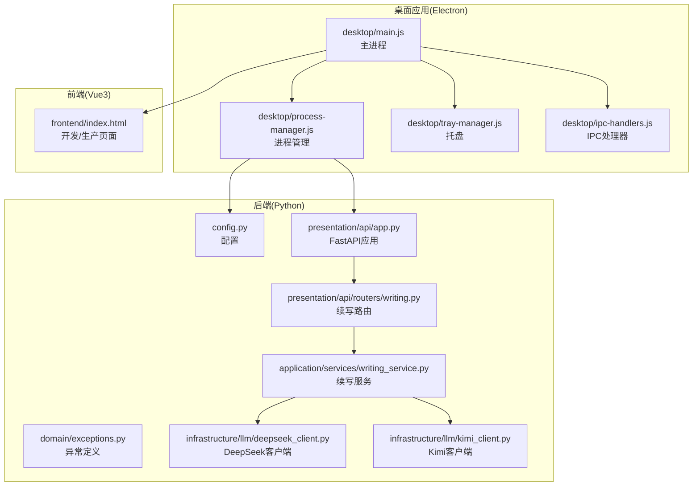
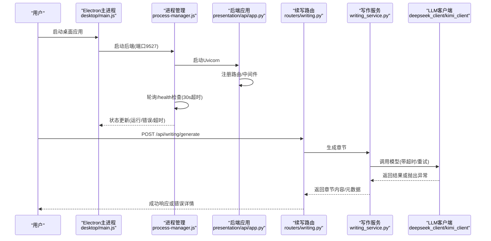
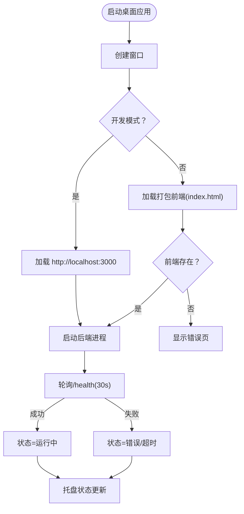
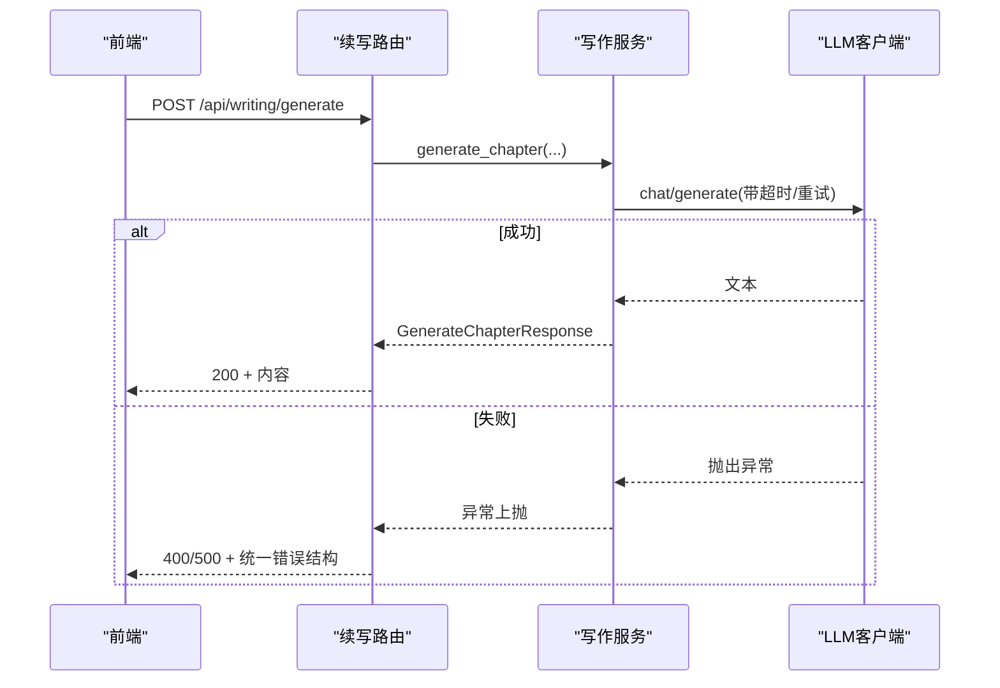
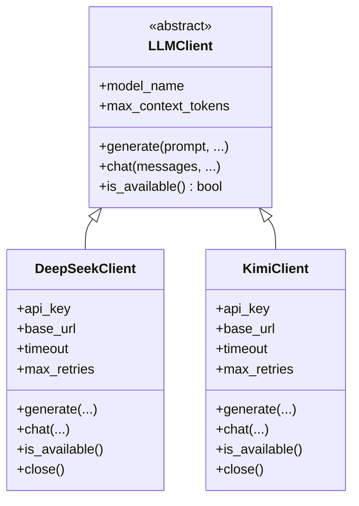
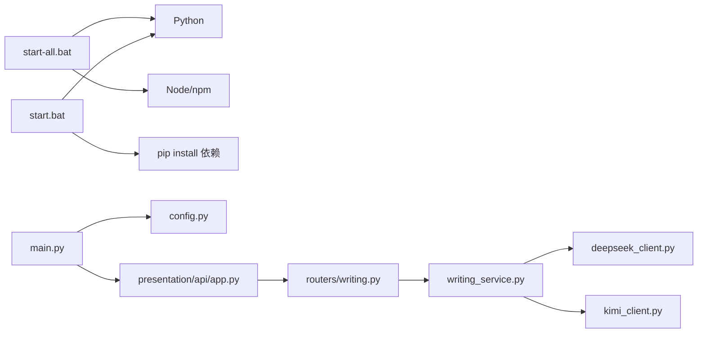

# 故障排除

<cite>
**本文引用的文件**
- [README.md](file://README.md)
- [main.py](file://main.py)
- [config.py](file://config.py)
- [presentation/api/app.py](file://presentation/api/app.py)
- [presentation/api/routers/writing.py](file://presentation/api/routers/writing.py)
- [application/services/writing_service.py](file://application/services/writing_service.py)
- [infrastructure/llm/base_client.py](file://infrastructure/llm/base_client.py)
- [infrastructure/llm/deepseek_client.py](file://infrastructure/llm/deepseek_client.py)
- [infrastructure/llm/kimi_client.py](file://infrastructure/llm/kimi_client.py)
- [domain/exceptions.py](file://domain/exceptions.py)
- [desktop/main.js](file://desktop/main.js)
- [desktop/process-manager.js](file://desktop/process-manager.js)
- [desktop/tray-manager.js](file://desktop/tray-manager.js)
- [desktop/ipc-handlers.js](file://desktop/ipc-handlers.js)
- [start-all.bat](file://start-all.bat)
- [start.bat](file://start.bat)
- [requirements.txt](file://requirements.txt)
</cite>

## 目录
1. [简介](#简介)
2. [项目结构](#项目结构)
3. [核心组件](#核心组件)
4. [架构总览](#架构总览)
5. [详细组件分析](#详细组件分析)
6. [依赖关系分析](#依赖关系分析)
7. [性能考虑](#性能考虑)
8. [故障排除指南](#故障排除指南)
9. [结论](#结论)
10. [附录](#附录)

## 简介
本指南面向InkTrace项目的使用者与维护者，提供系统化的故障排除方法。覆盖启动失败（端口占用、依赖缺失、配置错误）、API调用失败（含错误码与用户提示）、桌面应用启动问题、AI模型连接失败与网络问题、性能问题诊断与优化、日志与错误追踪技巧、内存泄漏与资源占用排查，以及不同操作系统下的特定问题解决方案。所有建议均基于仓库中的实际代码与配置文件。

## 项目结构
InkTrace采用前后端分离与桌面应用打包的架构：
- 后端：FastAPI + Uvicorn，监听配置端口，默认9527
- 前端：Vue3 + Vite，开发时运行在3000端口
- 桌面应用：Electron主进程负责启动后端、加载前端、托盘与IPC通信
- 大模型：DeepSeek/Kimi双客户端，支持连接池与重试

图表来源
- [desktop/main.js:1-213](file://desktop/main.js#L1-L213)
- [desktop/process-manager.js:1-207](file://desktop/process-manager.js#L1-L207)
- [desktop/tray-manager.js:1-96](file://desktop/tray-manager.js#L1-L96)
- [desktop/ipc-handlers.js:1-50](file://desktop/ipc-handlers.js#L1-L50)
- [config.py:1-46](file://config.py#L1-L46)
- [presentation/api/app.py:1-66](file://presentation/api/app.py#L1-L66)
- [presentation/api/routers/writing.py:1-278](file://presentation/api/routers/writing.py#L1-L278)
- [application/services/writing_service.py:1-180](file://application/services/writing_service.py#L1-L180)
- [infrastructure/llm/deepseek_client.py:1-238](file://infrastructure/llm/deepseek_client.py#L1-L238)
- [infrastructure/llm/kimi_client.py:1-244](file://infrastructure/llm/kimi_client.py#L1-L244)

章节来源
- [README.md:72-106](file://README.md#L72-L106)
- [main.py:15-22](file://main.py#L15-L22)
- [config.py:14-46](file://config.py#L14-L46)

## 核心组件
- 配置与启动
  - 后端通过配置读取主机、端口、调试开关等；默认端口9527
  - 桌面应用主进程负责创建窗口、加载前端、启动后端进程并监控健康状态
- API与路由
  - FastAPI应用注册多组路由，包含续写、导出、项目、模板、角色、世界观、向量检索、RAG与配置管理
  - 续写路由提供“规划剧情”“生成章节”“继续创作”，并返回统一错误结构
- 应用服务
  - 写作服务负责剧情规划、章节生成、连贯性检查；使用LLM工厂选择主备模型
- LLM客户端
  - DeepSeek与Kimi客户端均实现抽象接口，具备连接池、超时、重试、Token截断与可用性探测
- 异常体系
  - 定义领域异常与LLM客户端异常，便于API层转换为HTTP异常与用户提示

章节来源
- [config.py:14-46](file://config.py#L14-L46)
- [presentation/api/app.py:19-66](file://presentation/api/app.py#L19-L66)
- [presentation/api/routers/writing.py:37-278](file://presentation/api/routers/writing.py#L37-L278)
- [application/services/writing_service.py:30-180](file://application/services/writing_service.py#L30-L180)
- [infrastructure/llm/base_client.py:14-83](file://infrastructure/llm/base_client.py#L14-L83)
- [infrastructure/llm/deepseek_client.py:25-238](file://infrastructure/llm/deepseek_client.py#L25-L238)
- [infrastructure/llm/kimi_client.py:25-244](file://infrastructure/llm/kimi_client.py#L25-L244)
- [domain/exceptions.py:11-100](file://domain/exceptions.py#L11-L100)

## 架构总览
下图展示桌面应用、后端API与LLM客户端之间的交互流程，以及健康检查与错误传播路径。

图表来源
- [desktop/main.js:130-141](file://desktop/main.js#L130-L141)
- [desktop/process-manager.js:162-203](file://desktop/process-manager.js#L162-L203)
- [presentation/api/app.py:19-66](file://presentation/api/app.py#L19-L66)
- [presentation/api/routers/writing.py:111-174](file://presentation/api/routers/writing.py#L111-L174)
- [application/services/writing_service.py:91-165](file://application/services/writing_service.py#L91-L165)
- [infrastructure/llm/deepseek_client.py:117-194](file://infrastructure/llm/deepseek_client.py#L117-L194)
- [infrastructure/llm/kimi_client.py:123-199](file://infrastructure/llm/kimi_client.py#L123-L199)

## 详细组件分析

### 组件A：桌面应用启动与后端进程管理
- 关键点
  - 主进程先创建窗口，再启动后端；开发模式加载本地前端，生产模式加载打包资源
  - 进程管理器负责spawn后端、捕获stdout/stderr、健康检查(轮询/health)、超时(30s)、状态通知
  - 托盘显示后端状态，支持重启后端；IPC处理器提供状态查询与外部打开能力
- 常见问题
  - 前端资源缺失：生产模式下找不到前端文件会显示错误页
  - 后端启动超时：健康检查超时触发错误状态
  - Python路径：开发模式下优先使用打包内嵌Python，否则回退到系统python/python3

图表来源
- [desktop/main.js:21-74](file://desktop/main.js#L21-L74)
- [desktop/main.js:130-141](file://desktop/main.js#L130-L141)
- [desktop/process-manager.js:162-203](file://desktop/process-manager.js#L162-L203)
- [desktop/tray-manager.js:78-86](file://desktop/tray-manager.js#L78-L86)

章节来源
- [desktop/main.js:13-213](file://desktop/main.js#L13-L213)
- [desktop/process-manager.js:20-207](file://desktop/process-manager.js#L20-L207)
- [desktop/tray-manager.js:1-96](file://desktop/tray-manager.js#L1-L96)
- [desktop/ipc-handlers.js:1-50](file://desktop/ipc-handlers.js#L1-L50)

### 组件B：API调用与错误处理
- 关键点
  - 续写路由统一返回错误结构，包含业务code、message与用户友好提示
  - 生成章节支持“Agent MVP”与“传统路径”，并注入元数据
  - 继续创作需要记忆体(memory)存在，否则返回明确错误
- 错误码与用户提示
  - MEMORY_REQUIRED：请先整理故事结构后再继续创作
  - CONTINUE_INPUT_INVALID：续写参数有误，请检查后重试
  - CONTINUE_INTERNAL_ERROR：续写失败，请稍后再试
  - NOVEL_NOT_FOUND：未找到对应作品，请先创建或导入
  - AGENT_ROUTE：Agent链路未生成内容

图表来源
- [presentation/api/routers/writing.py:111-174](file://presentation/api/routers/writing.py#L111-L174)
- [application/services/writing_service.py:91-165](file://application/services/writing_service.py#L91-L165)
- [infrastructure/llm/deepseek_client.py:117-194](file://infrastructure/llm/deepseek_client.py#L117-L194)
- [infrastructure/llm/kimi_client.py:123-199](file://infrastructure/llm/kimi_client.py#L123-L199)

章节来源
- [presentation/api/routers/writing.py:37-278](file://presentation/api/routers/writing.py#L37-L278)

### 组件C：AI模型连接与网络问题
- 关键点
  - DeepSeek/Kimi客户端均使用httpx AsyncClient，设置超时与连接池
  - 错误分类：APIKeyError、RateLimitError、NetworkError、TokenLimitError
  - 可用性探测：调用短文本生成以判断可用性
- 排查步骤
  - 确认环境变量DEEPSEEK_API_KEY/KIMI_API_KEY已设置
  - 检查网络连通性与代理设置
  - 查看客户端日志与重试记录
  - 若出现429，按响应头retry-after等待或降低频率

图表来源
- [infrastructure/llm/base_client.py:14-83](file://infrastructure/llm/base_client.py#L14-L83)
- [infrastructure/llm/deepseek_client.py:25-238](file://infrastructure/llm/deepseek_client.py#L25-L238)
- [infrastructure/llm/kimi_client.py:25-244](file://infrastructure/llm/kimi_client.py#L25-L244)

章节来源
- [infrastructure/llm/deepseek_client.py:53-194](file://infrastructure/llm/deepseek_client.py#L53-L194)
- [infrastructure/llm/kimi_client.py:53-199](file://infrastructure/llm/kimi_client.py#L53-L199)
- [domain/exceptions.py:51-100](file://domain/exceptions.py#L51-L100)

## 依赖关系分析
- 后端依赖
  - FastAPI、Uvicorn、httpx、pydantic、aiosqlite、chromadb、sentence-transformers
- 启动脚本
  - start-all.bat：检查Python/Node，分别启动后端与前端
  - start.bat：检查Python与依赖，启动后端服务
- 配置
  - 通过环境变量覆盖主机、端口、调试、数据库路径与API密钥

图表来源
- [start-all.bat:1-50](file://start-all.bat#L1-L50)
- [start.bat:1-40](file://start.bat#L1-L40)
- [requirements.txt:1-10](file://requirements.txt#L1-L10)
- [main.py:11-22](file://main.py#L11-L22)
- [config.py:30-46](file://config.py#L30-L46)

章节来源
- [requirements.txt:1-10](file://requirements.txt#L1-L10)
- [start-all.bat:10-39](file://start-all.bat#L10-L39)
- [start.bat:11-39](file://start.bat#L11-L39)

## 性能考虑
- 连接池与超时
  - LLM客户端使用httpx连接池与超时配置，减少连接开销并避免阻塞
- Token截断
  - 客户端对输入进行字符级截断，避免过长请求导致失败
- 重试策略
  - 对网络与超时错误进行有限次重试，提升稳定性
- 建议
  - 控制单次请求的上下文长度，避免超过模型上下文限制
  - 合理设置温度与max_tokens，平衡质量与速度
  - 在高并发场景下评估连接池上限与后端资源

章节来源
- [infrastructure/llm/deepseek_client.py:60-64](file://infrastructure/llm/deepseek_client.py#L60-L64)
- [infrastructure/llm/kimi_client.py:60-64](file://infrastructure/llm/kimi_client.py#L60-L64)
- [infrastructure/llm/deepseek_client.py:195-211](file://infrastructure/llm/deepseek_client.py#L195-L211)
- [infrastructure/llm/kimi_client.py:201-217](file://infrastructure/llm/kimi_client.py#L201-L217)

## 故障排除指南

### 启动失败排查
- 端口占用
  - 现象：后端无法绑定端口9527，桌面应用健康检查超时
  - 步骤：
    - 检查端口占用：netstat -ano | findstr :9527
    - 更改端口：设置环境变量 INKTRACE_PORT 并重启
    - 释放占用进程或重启系统
- 依赖缺失
  - 现象：启动脚本报错找不到Python/Node或依赖
  - 步骤：
    - 确认Python 3.11+ 与Node.js 18+ 已安装
    - 使用start.bat自动安装后端依赖
    - 使用start-all.bat一次性检查并启动
- 配置错误
  - 现象：后端启动但无法访问API文档或健康检查失败
  - 步骤：
    - 检查 INKTRACE_HOST/INKTRACE_PORT/INKTRACE_DEBUG/DEEPSEEK_API_KEY/KIMI_API_KEY
    - 确保端口未被防火墙拦截
    - 重启后端以应用新配置

章节来源
- [start-all.bat:10-39](file://start-all.bat#L10-L39)
- [start.bat:11-39](file://start.bat#L11-L39)
- [config.py:30-46](file://config.py#L30-L46)
- [main.py:15-22](file://main.py#L15-L22)

### API调用失败调试与错误码对照
- 统一错误结构
  - 字段：code、message、user_message
  - 示例场景：
    - MEMORY_REQUIRED：请先整理故事结构后再继续创作
    - CONTINUE_INPUT_INVALID：续写参数有误，请检查后重试
    - CONTINUE_INTERNAL_ERROR：续写失败，请稍后再试
    - NOVEL_NOT_FOUND：未找到对应作品，请先创建或导入
    - AGENT_ROUTE：Agent链路未生成内容
- 调试步骤
  - 查看后端日志（stdout/stderr）与健康检查状态
  - 在前端控制台查看HTTP状态码与响应体
  - 检查续写路由参数与项目/记忆体状态

章节来源
- [presentation/api/routers/writing.py:40-41](file://presentation/api/routers/writing.py#L40-L41)
- [presentation/api/routers/writing.py:188-191](file://presentation/api/routers/writing.py#L188-L191)
- [presentation/api/routers/writing.py:262-270](file://presentation/api/routers/writing.py#L262-L270)
- [presentation/api/routers/writing.py:274-277](file://presentation/api/routers/writing.py#L274-L277)

### 桌面应用启动问题
- 现象
  - 窗口创建成功但前端加载失败
  - 生产模式下显示“前端文件未找到”
- 解决方案
  - 确认打包流程正确，前端资源位于resourcesPath/frontend
  - 开发模式下确保前端dev server在3000端口可用
  - 检查资源路径与权限，必要时重新安装应用

章节来源
- [desktop/main.js:52-73](file://desktop/main.js#L52-L73)
- [desktop/main.js:119-128](file://desktop/main.js#L119-L128)

### AI模型连接失败与网络问题
- 现象
  - API 401：密钥无效
  - API 429：触发限流
  - 服务器错误/超时：网络不稳定或上游服务异常
- 排查步骤
  - 确认DEEPSEEK_API_KEY/KIMI_API_KEY已设置且有效
  - 检查网络连通性与代理设置
  - 查看客户端日志与重试记录
  - 遵循响应头retry-after等待或降低请求频率
- 可用性探测
  - 客户端提供is_available用于自检，若失败需检查密钥与网络

章节来源
- [infrastructure/llm/deepseek_client.py:163-172](file://infrastructure/llm/deepseek_client.py#L163-L172)
- [infrastructure/llm/kimi_client.py:169-178](file://infrastructure/llm/kimi_client.py#L169-L178)
- [domain/exceptions.py:58-87](file://domain/exceptions.py#L58-L87)

### 性能问题诊断与优化
- 诊断
  - 观察后端CPU/内存占用与健康检查耗时
  - 检查LLM客户端重试次数与超时配置
  - 分析请求上下文长度与Token使用情况
- 优化
  - 控制单次请求上下文长度，避免超过模型上下文
  - 合理设置温度与max_tokens
  - 评估连接池上限与后端并发能力

章节来源
- [infrastructure/llm/deepseek_client.py:60-64](file://infrastructure/llm/deepseek_client.py#L60-L64)
- [infrastructure/llm/kimi_client.py:60-64](file://infrastructure/llm/kimi_client.py#L60-L64)

### 日志分析与错误追踪
- 后端日志
  - 进程管理器捕获后端stdout/stderr，便于定位启动与运行期错误
  - 健康检查超时会触发错误状态
- 客户端日志
  - LLM客户端记录警告/错误，包含超时、网络异常与最终失败原因
- 建议
  - 在开发模式下开启调试与日志输出
  - 结合托盘状态与IPC事件，快速定位问题阶段

章节来源
- [desktop/process-manager.js:57-77](file://desktop/process-manager.js#L57-L77)
- [desktop/process-manager.js:162-203](file://desktop/process-manager.js#L162-L203)
- [infrastructure/llm/deepseek_client.py:182-190](file://infrastructure/llm/deepseek_client.py#L182-L190)
- [infrastructure/llm/kimi_client.py:188-196](file://infrastructure/llm/kimi_client.py#L188-L196)

### 内存泄漏与资源占用排查
- 现象
  - 长时间运行后内存持续增长
  - 后端进程CPU占用偏高
- 排查与建议
  - 确认LLM客户端在使用完毕后调用close释放连接池
  - 检查是否存在未释放的数据库连接或文件句柄
  - 限制并发请求与上下文长度，避免峰值资源占用

章节来源
- [infrastructure/llm/deepseek_client.py:222-227](file://infrastructure/llm/deepseek_client.py#L222-L227)
- [infrastructure/llm/kimi_client.py:228-233](file://infrastructure/llm/kimi_client.py#L228-L233)

### 不同操作系统下的特定问题
- Windows
  - 确认PowerShell执行策略允许脚本运行
  - start-all.bat与start.bat会检查Python/Node版本
  - 桌面应用开发模式依赖本地前端服务
- Linux/macOS
  - 确保Python/Node可执行文件在PATH中
  - 如使用打包版，确认resourcesPath下包含前端与后端资源

章节来源
- [start-all.bat:10-27](file://start-all.bat#L10-L27)
- [start.bat:11-27](file://start.bat#L11-L27)
- [desktop/main.js:53-69](file://desktop/main.js#L53-L69)

### 如何收集与分析错误信息
- 收集
  - 后端stdout/stderr日志
  - 健康检查失败与超时信息
  - LLM客户端错误日志与重试记录
- 分析
  - 区分密钥错误、限流、网络超时与内部异常
  - 结合统一错误结构的code与user_message定位用户可见提示
- 协助定位
  - 提供：环境变量、端口占用情况、后端日志片段、API响应体、错误发生时的操作步骤

章节来源
- [desktop/process-manager.js:57-77](file://desktop/process-manager.js#L57-L77)
- [domain/exceptions.py:58-99](file://domain/exceptions.py#L58-L99)

## 结论
本指南提供了从启动、API调用、桌面应用、AI模型连接到性能与资源问题的全链路故障排除方法。建议在日常运维中结合健康检查、统一错误结构与日志采集，形成闭环的问题定位与恢复流程。针对不同平台与部署形态，应重点关注端口占用、依赖安装、环境变量与网络连通性。

## 附录
- 快速参考
  - 默认端口：9527；默认主机：127.0.0.1
  - API文档：http://127.0.0.1:9527/docs
  - 环境变量：INKTRACE_HOST、INKTRACE_PORT、INKTRACE_DEBUG、DEEPSEEK_API_KEY、KIMI_API_KEY
  - 启动脚本：start-all.bat、start.bat、start-frontend.bat

章节来源
- [README.md:65-69](file://README.md#L65-L69)
- [README.md:160-169](file://README.md#L160-L169)
- [start-all.bat:30-39](file://start-all.bat#L30-L39)
- [start.bat:30-36](file://start.bat#L30-L36)