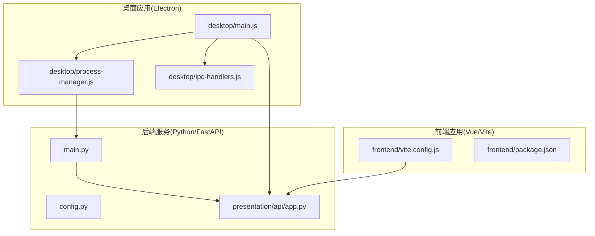
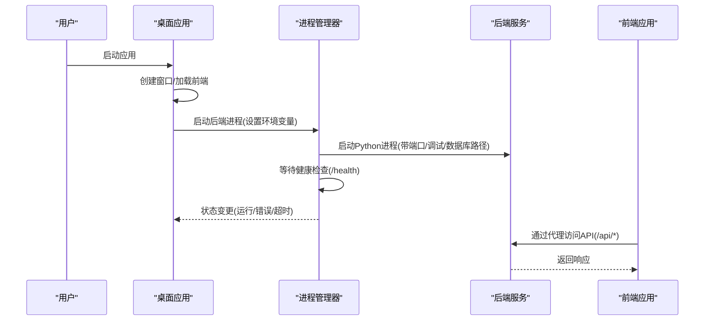
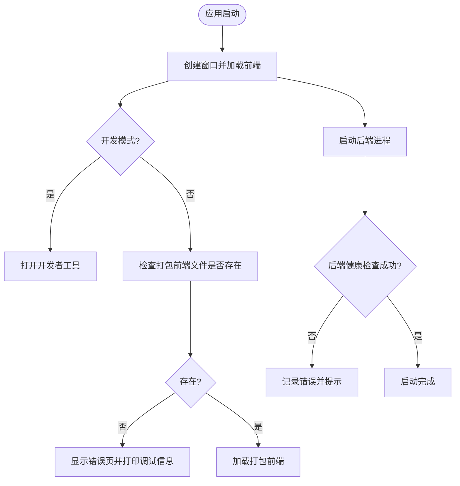
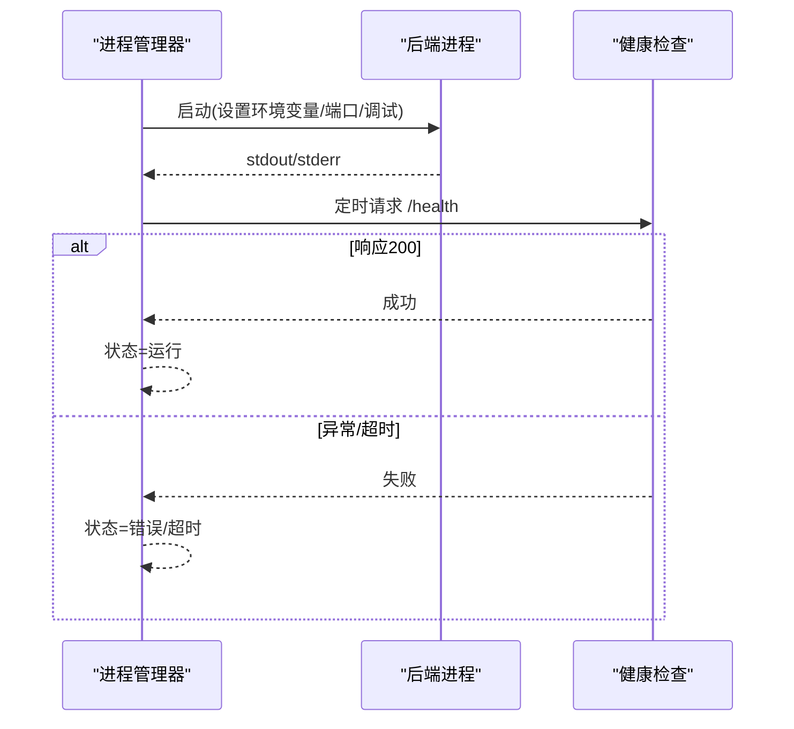
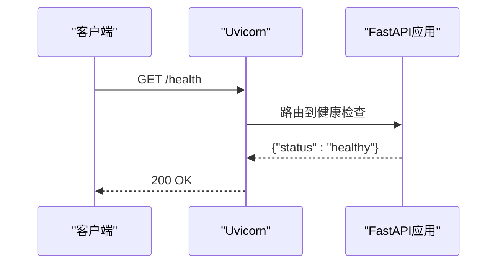
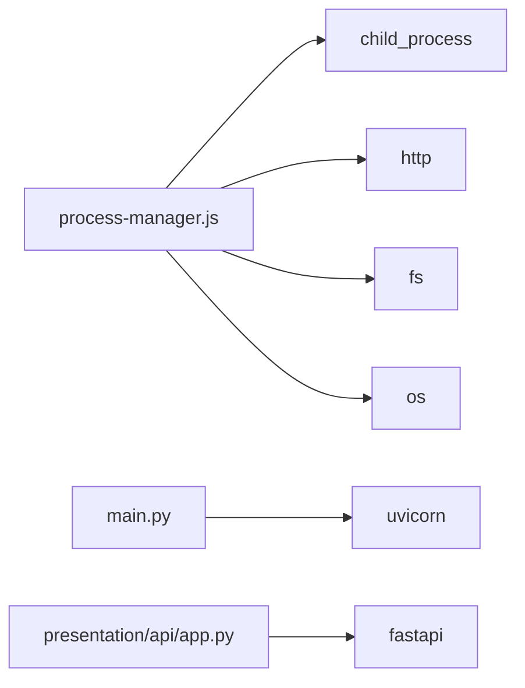

# 日志分析与调试

<cite>
**本文引用的文件**
- [main.py](file://main.py)
- [config.py](file://config.py)
- [presentation/api/app.py](file://presentation/api/app.py)
- [desktop/main.js](file://desktop/main.js)
- [desktop/process-manager.js](file://desktop/process-manager.js)
- [desktop/ipc-handlers.js](file://desktop/ipc-handlers.js)
- [frontend/vite.config.js](file://frontend/vite.config.js)
- [frontend/package.json](file://frontend/package.json)
- [requirements.txt](file://requirements.txt)
- [debug-desktop.js](file://debug-desktop.js)
</cite>

## 目录
1. [简介](#简介)
2. [项目结构](#项目结构)
3. [核心组件](#核心组件)
4. [架构总览](#架构总览)
5. [详细组件分析](#详细组件分析)
6. [依赖分析](#依赖分析)
7. [性能考虑](#性能考虑)
8. [故障排查指南](#故障排查指南)
9. [结论](#结论)
10. [附录](#附录)

## 简介
本指南面向InkTrace项目的日志分析与调试，覆盖后端服务、前端应用、桌面应用三类组件的日志采集与分析方法，并提供调试工具使用建议（浏览器开发者工具、Node.js调试器、Python调试器）。文档重点说明：
- 如何通过现有代码中的日志输出定位问题
- 如何利用健康检查接口与进程管理器状态进行快速验证
- 如何在不同运行环境下（开发/生产）收集与解读日志
- 如何结合IPC通道与桌面应用状态进行端到端问题复现
- 如何进行错误追踪与堆栈分析，以及性能与内存监控的建议

## 项目结构
InkTrace采用“桌面应用 + 后端服务 + 前端界面”的三层架构：
- 桌面应用（Electron）负责窗口生命周期、后端进程管理、IPC通信与状态展示
- 后端服务（FastAPI + Uvicorn）提供REST API与健康检查
- 前端应用（Vue + Vite）通过代理访问后端API

图表来源
- [desktop/main.js:130-141](file://desktop/main.js#L130-L141)
- [desktop/process-manager.js:21-102](file://desktop/process-manager.js#L21-L102)
- [main.py:15-21](file://main.py#L15-L21)
- [presentation/api/app.py:19-62](file://presentation/api/app.py#L19-L62)
- [frontend/vite.config.js:13-21](file://frontend/vite.config.js#L13-L21)

章节来源
- [desktop/main.js:130-141](file://desktop/main.js#L130-L141)
- [desktop/process-manager.js:21-102](file://desktop/process-manager.js#L21-L102)
- [main.py:15-21](file://main.py#L15-L21)
- [presentation/api/app.py:19-62](file://presentation/api/app.py#L19-L62)
- [frontend/vite.config.js:13-21](file://frontend/vite.config.js#L13-L21)

## 核心组件
- 桌面应用主进程：负责窗口创建、加载前端、启动后端进程、错误页展示与状态通知
- 进程管理器：封装Python后端进程的启动、停止、重启、状态监听与健康检查等待
- 后端服务：基于FastAPI，提供健康检查端点与业务路由
- 前端开发服务器：通过Vite代理转发API请求至后端

章节来源
- [desktop/main.js:161-186](file://desktop/main.js#L161-L186)
- [desktop/process-manager.js:13-102](file://desktop/process-manager.js#L13-L102)
- [presentation/api/app.py:58-60](file://presentation/api/app.py#L58-L60)
- [frontend/vite.config.js:15-20](file://frontend/vite.config.js#L15-L20)

## 架构总览
下图展示了从桌面应用到后端服务再到前端的调用链与日志落点：

图表来源
- [desktop/main.js:161-186](file://desktop/main.js#L161-L186)
- [desktop/process-manager.js:173-214](file://desktop/process-manager.js#L173-L214)
- [presentation/api/app.py:58-60](file://presentation/api/app.py#L58-L60)
- [frontend/vite.config.js:15-20](file://frontend/vite.config.js#L15-L20)

## 详细组件分析

### 桌面应用日志与调试
- 关键日志位置
  - 应用启动流程日志：创建窗口、启动后端、完成启动
  - 前端加载失败时的错误页与调试信息输出
  - 后端进程命令与路径输出
- 调试要点
  - 开发模式下会打开浏览器开发者工具，便于前端调试
  - 前端文件存在性检测与资源路径打印，有助于定位打包/路径问题
  - 后端启动失败时弹出错误对话框并退出

图表来源
- [desktop/main.js:52-74](file://desktop/main.js#L52-L74)
- [desktop/main.js:130-141](file://desktop/main.js#L130-L141)
- [desktop/main.js:161-186](file://desktop/main.js#L161-L186)

章节来源
- [desktop/main.js:52-74](file://desktop/main.js#L52-L74)
- [desktop/main.js:130-141](file://desktop/main.js#L130-L141)
- [desktop/main.js:161-186](file://desktop/main.js#L161-L186)

### 进程管理器与后端日志
- 关键日志位置
  - 进程启动命令与参数输出
  - 后端标准输出与标准错误的透传
  - 进程错误、退出码与状态变更通知
  - 健康检查轮询与超时处理
- 调试要点
  - 通过环境变量控制后端调试开关与数据库路径
  - 使用健康检查端点确认后端可用性
  - 超时或错误时返回统一的状态与错误信息

图表来源
- [desktop/process-manager.js:21-102](file://desktop/process-manager.js#L21-L102)
- [desktop/process-manager.js:173-214](file://desktop/process-manager.js#L173-L214)
- [presentation/api/app.py:58-60](file://presentation/api/app.py#L58-L60)

章节来源
- [desktop/process-manager.js:21-102](file://desktop/process-manager.js#L21-L102)
- [desktop/process-manager.js:173-214](file://desktop/process-manager.js#L173-L214)
- [presentation/api/app.py:58-60](file://presentation/api/app.py#L58-L60)

### 后端服务日志与健康检查
- 关键日志位置
  - Uvicorn启动日志（由config中的debug控制reload）
  - 应用根路径与健康检查端点
- 调试要点
  - 通过环境变量启用/关闭调试模式
  - 健康检查端点用于快速判断后端是否可用

图表来源
- [main.py:15-21](file://main.py#L15-L21)
- [presentation/api/app.py:58-60](file://presentation/api/app.py#L58-L60)

章节来源
- [main.py:15-21](file://main.py#L15-L21)
- [presentation/api/app.py:58-60](file://presentation/api/app.py#L58-L60)

### 前端应用日志与代理
- 关键日志位置
  - Vite开发服务器代理配置，将/api前缀转发至后端
  - 前端构建产物与资源目录
- 调试要点
  - 开发模式下通过本地代理访问后端API
  - 生产模式下桌面应用加载打包后的前端文件

章节来源
- [frontend/vite.config.js:15-20](file://frontend/vite.config.js#L15-L20)
- [frontend/package.json:6-9](file://frontend/package.json#L6-L9)

## 依赖分析
- 桌面应用依赖
  - child_process：用于启动后端进程
  - http：用于健康检查轮询
  - fs/os：用于路径解析与用户数据目录创建
- 后端服务依赖
  - FastAPI/Uvicorn：Web框架与ASGI服务器
  - 其他库：见依赖清单

图表来源
- [desktop/process-manager.js:7-11](file://desktop/process-manager.js#L7-L11)
- [main.py:11-11](file://main.py#L11-L11)
- [presentation/api/app.py:11-12](file://presentation/api/app.py#L11-L12)

章节来源
- [desktop/process-manager.js:7-11](file://desktop/process-manager.js#L7-L11)
- [main.py:11-11](file://main.py#L11-L11)
- [presentation/api/app.py:11-12](file://presentation/api/app.py#L11-L12)
- [requirements.txt:1-10](file://requirements.txt#L1-L10)

## 性能考虑
- 日志级别与开销
  - 当前代码以console输出为主，未见专门的日志级别配置。在生产环境中建议引入结构化日志库（如Python的logging或structlog），并按需调整日志级别以降低I/O开销。
- 健康检查频率
  - 进程管理器对健康检查采用固定间隔轮询，若后端负载较高，可适当增大轮询间隔或改为事件驱动通知。
- 内存与进程管理
  - 进程管理器在停止后端时使用SIGTERM与强制SIGKILL兜底，确保资源释放；建议在后端侧增加优雅关闭钩子，避免数据丢失。

[本节为通用指导，无需列出章节来源]

## 故障排查指南

### 快速自检清单
- 桌面应用
  - 是否正确创建窗口并加载前端？
  - 前端文件是否存在？资源路径是否正确？
  - 后端进程是否成功启动并进入“运行”状态？
- 后端服务
  - 健康检查端点是否返回200？
  - 是否启用了调试模式？端口与主机配置是否符合预期？
- 前端应用
  - 代理是否将/api请求转发至后端？
  - 开发者工具中网络面板是否显示请求成功？

章节来源
- [desktop/main.js:52-74](file://desktop/main.js#L52-L74)
- [desktop/process-manager.js:173-214](file://desktop/process-manager.js#L173-L214)
- [presentation/api/app.py:58-60](file://presentation/api/app.py#L58-L60)
- [frontend/vite.config.js:15-20](file://frontend/vite.config.js#L15-L20)

### 日志收集与分析技巧
- 桌面应用日志
  - 关注应用启动阶段的关键输出（创建窗口、启动后端、状态变更），这些位置通常包含路径、端口、调试开关等关键信息。
- 后端服务日志
  - 通过Uvicorn默认输出观察启动与请求日志；在调试模式下可获得更详细的重载与错误信息。
- 前端应用日志
  - 在开发模式下打开浏览器开发者工具，查看Console与Network标签页，定位跨域、代理与接口错误。

章节来源
- [desktop/main.js:161-186](file://desktop/main.js#L161-L186)
- [desktop/process-manager.js:68-88](file://desktop/process-manager.js#L68-L88)
- [main.py:15-21](file://main.py#L15-L21)

### 错误追踪与堆栈分析
- 桌面应用
  - 启动失败时会记录错误并弹窗提示；可在错误页中查看调试信息（资源路径、打包状态等）。
- 后端服务
  - 健康检查失败时，进程管理器会记录错误并切换状态；可通过后端标准错误输出定位异常。
- 前端应用
  - 通过浏览器开发者工具的Console与Sources标签，结合断点与条件断点进行堆栈分析。

章节来源
- [desktop/main.js:181-184](file://desktop/main.js#L181-L184)
- [desktop/process-manager.js:76-81](file://desktop/process-manager.js#L76-L81)

### 重现问题场景
- 使用桌面应用内置的诊断脚本与IPC状态查询，快速确认后端状态与版本信息。
- 在开发模式下，通过浏览器开发者工具与Vite代理，模拟请求并观察后端响应与错误。

章节来源
- [desktop/ipc-handlers.js:9-46](file://desktop/ipc-handlers.js#L9-L46)
- [frontend/vite.config.js:15-20](file://frontend/vite.config.js#L15-L20)

### 调试工具使用
- 浏览器开发者工具
  - 打开方式：开发模式下自动打开；也可手动在页面菜单中启用。
  - 用途：查看网络请求、Console日志、断点调试、性能面板。
- Node.js调试器
  - 可在桌面应用启动脚本处设置断点，或通过外部调试器附加到Electron主进程。
- Python调试器
  - 在后端服务启动脚本处设置断点，或通过IDE附加到Uvicorn进程。

章节来源
- [desktop/main.js:56-56](file://desktop/main.js#L56-L56)
- [main.py:15-21](file://main.py#L15-L21)

### 日志级别与配置建议
- 当前代码未显式配置日志级别，建议：
  - 在后端引入结构化日志库，区分info/warning/error/debug等级
  - 通过环境变量控制日志级别与输出目标（控制台/文件）
  - 在桌面应用中统一收集后端stdout/stderr并写入文件

[本节为通用指导，无需列出章节来源]

### 日志轮转与存储管理
- 建议策略
  - 将后端标准输出重定向到文件，并配合系统级轮转工具（如logrotate或Windows事件日志）
  - 控制单个日志文件大小上限与保留份数，避免磁盘占用过高
  - 对于桌面应用，可将日志写入用户数据目录下的独立文件夹

[本节为通用指导，无需列出章节来源]

## 结论
InkTrace的日志体系以console输出为主，辅以健康检查与进程状态通知。通过桌面应用、进程管理器与后端服务的协同，可以实现端到端的问题定位与复现。建议在现有基础上引入结构化日志、日志级别配置与轮转策略，并充分利用浏览器与Node/Python调试器进行深入分析。

[本节为总结性内容，无需列出章节来源]

## 附录

### 环境变量与配置要点
- 主机与端口：通过配置对象读取环境变量，支持覆盖默认值
- 调试模式：影响Uvicorn的reload行为
- 数据库路径：用户数据目录下的数据库文件路径
- 向量库目录：用户数据目录下的向量库目录

章节来源
- [config.py:30-42](file://config.py#L30-L42)
- [desktop/process-manager.js:40-49](file://desktop/process-manager.js#L40-L49)

### 诊断脚本与IPC接口
- 诊断脚本：可用于检查文件存在性、测试后端启动与日志输出
- IPC接口：获取后端状态、重启后端、打开外部链接、显示文件所在文件夹、获取应用版本与路径

章节来源
- [debug-desktop.js:9-55](file://debug-desktop.js#L9-L55)
- [desktop/ipc-handlers.js:9-46](file://desktop/ipc-handlers.js#L9-L46)