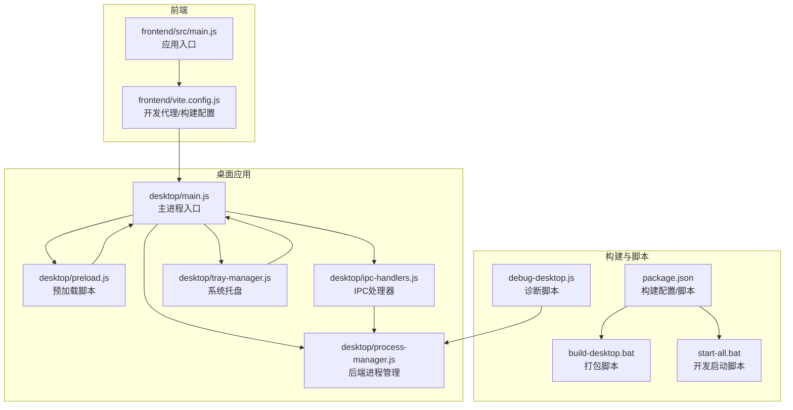
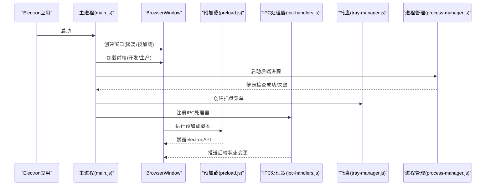
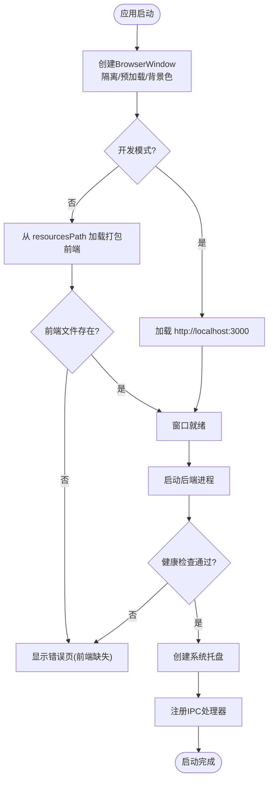
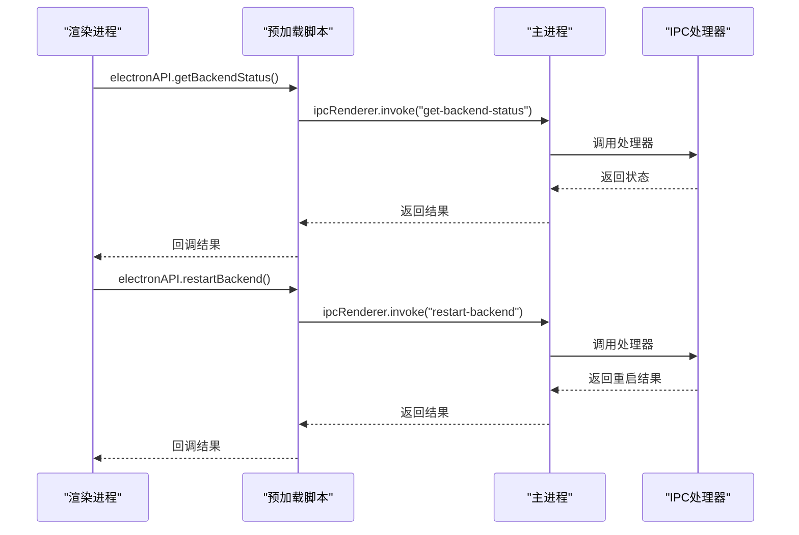
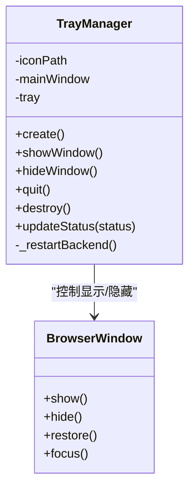
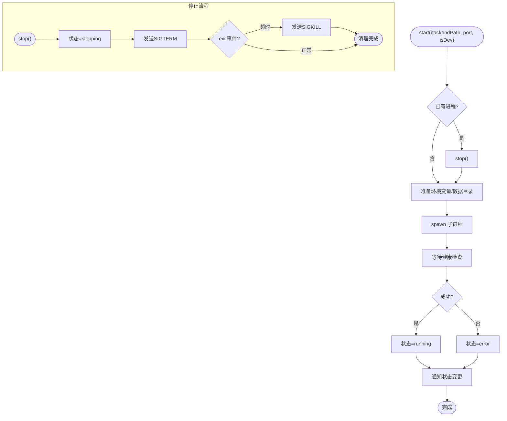
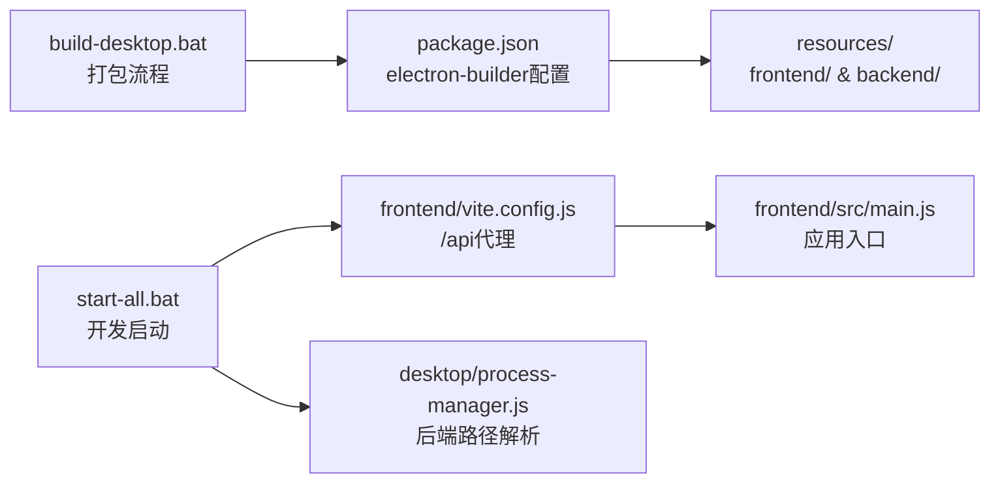

# 桌面应用问题

<cite>
**本文引用的文件**
- [desktop/main.js](file://desktop/main.js)
- [desktop/preload.js](file://desktop/preload.js)
- [desktop/ipc-handlers.js](file://desktop/ipc-handlers.js)
- [desktop/tray-manager.js](file://desktop/tray-manager.js)
- [desktop/process-manager.js](file://desktop/process-manager.js)
- [package.json](file://package.json)
- [build-desktop.bat](file://build-desktop.bat)
- [start-all.bat](file://start-all.bat)
- [frontend/vite.config.js](file://frontend/vite.config.js)
- [frontend/src/main.js](file://frontend/src/main.js)
- [debug-desktop.js](file://debug-desktop.js)
- [replay_pid73488.log](file://replay_pid73488.log)
- [replay_pid76092.log](file://replay_pid76092.log)
</cite>

## 目录
1. [简介](#简介)
2. [项目结构](#项目结构)
3. [核心组件](#核心组件)
4. [架构总览](#架构总览)
5. [详细组件分析](#详细组件分析)
6. [依赖关系分析](#依赖关系分析)
7. [性能考虑](#性能考虑)
8. [故障排查指南](#故障排查指南)
9. [结论](#结论)
10. [附录](#附录)

## 简介
本指南面向InkTrace项目的桌面应用（基于Electron）使用者与维护者，聚焦于应用启动失败、主/渲染进程通信、IPC消息处理异常、系统托盘集成问题、进程管理故障、跨平台兼容性、预加载脚本安全策略以及崩溃调试与日志分析等常见问题的排查与修复。文档结合代码实现与实际日志，提供可操作的定位步骤与解决方案。

## 项目结构
桌面应用相关的核心文件位于desktop目录，包含主进程入口、预加载脚本、IPC处理器、系统托盘管理器与后端进程管理器；前端通过Vite开发服务器或打包产物提供界面；构建与调试脚本位于根目录。

**图表来源**
- [desktop/main.js:1-212](file://desktop/main.js#L1-L212)
- [desktop/preload.js:1-25](file://desktop/preload.js#L1-L25)
- [desktop/ipc-handlers.js:1-49](file://desktop/ipc-handlers.js#L1-L49)
- [desktop/tray-manager.js:1-95](file://desktop/tray-manager.js#L1-L95)
- [desktop/process-manager.js:1-218](file://desktop/process-manager.js#L1-L218)
- [frontend/vite.config.js:1-28](file://frontend/vite.config.js#L1-L28)
- [frontend/src/main.js:1-23](file://frontend/src/main.js#L1-L23)
- [package.json:1-81](file://package.json#L1-L81)
- [build-desktop.bat:1-35](file://build-desktop.bat#L1-L35)
- [start-all.bat:1-50](file://start-all.bat#L1-L50)
- [debug-desktop.js:1-56](file://debug-desktop.js#L1-L56)

**章节来源**
- [desktop/main.js:1-212](file://desktop/main.js#L1-L212)
- [package.json:1-81](file://package.json#L1-L81)

## 核心组件
- 主进程入口：负责创建BrowserWindow、加载前端、启动后端进程、设置托盘与IPC处理器，并在启动失败时弹窗提示。
- 预加载脚本：通过contextBridge暴露有限API给渲染进程，仅限必要接口并使用invoke/on进行通信。
- IPC处理器：集中注册后端状态查询、重启、外部链接打开、文件夹定位、应用版本与路径查询等。
- 系统托盘管理器：提供显示/隐藏主窗口、重启后端、退出应用等菜单项与双击恢复窗口。
- 进程管理器：封装Python后端进程的启动、健康检查、重启、停止与状态通知，支持开发/生产两种路径解析。

**章节来源**
- [desktop/main.js:1-212](file://desktop/main.js#L1-L212)
- [desktop/preload.js:1-25](file://desktop/preload.js#L1-L25)
- [desktop/ipc-handlers.js:1-49](file://desktop/ipc-handlers.js#L1-L49)
- [desktop/tray-manager.js:1-95](file://desktop/tray-manager.js#L1-L95)
- [desktop/process-manager.js:1-218](file://desktop/process-manager.js#L1-L218)

## 架构总览
下图展示桌面应用启动到运行的关键交互流程，包括主进程初始化、前端加载、后端进程启动、托盘与IPC通信。

**图表来源**
- [desktop/main.js:21-186](file://desktop/main.js#L21-L186)
- [desktop/preload.js:9-24](file://desktop/preload.js#L9-L24)
- [desktop/ipc-handlers.js:9-47](file://desktop/ipc-handlers.js#L9-L47)
- [desktop/tray-manager.js:16-48](file://desktop/tray-manager.js#L16-L48)
- [desktop/process-manager.js:21-101](file://desktop/process-manager.js#L21-L101)

## 详细组件分析

### 主进程初始化与启动流程
- 窗口创建：启用上下文隔离、禁用Node集成、指定预加载脚本路径；关闭时最小化至托盘而非退出；生产模式下从resourcesPath加载打包的前端文件。
- 启动顺序：先创建窗口再启动后端，确保用户能及时看到界面；启动失败时弹出错误对话框并退出。
- 资源路径：开发模式加载本地Vite服务，生产模式从process.resourcesPath读取打包资源。

**图表来源**
- [desktop/main.js:21-186](file://desktop/main.js#L21-L186)

**章节来源**
- [desktop/main.js:21-186](file://desktop/main.js#L21-L186)

### 渲染进程通信与预加载脚本
- 预加载脚本通过contextBridge暴露有限API，包括后端状态查询、重启、外部链接打开、文件夹定位、应用版本与路径查询，并提供状态变更事件监听。
- 使用ipcRenderer.invoke与ipcMain.handle配对，保证请求-响应语义与错误传播。
- 安全策略：禁用Node集成，启用上下文隔离，仅暴露必要接口。

**图表来源**
- [desktop/preload.js:9-24](file://desktop/preload.js#L9-L24)
- [desktop/ipc-handlers.js:10-21](file://desktop/ipc-handlers.js#L10-L21)

**章节来源**
- [desktop/preload.js:1-25](file://desktop/preload.js#L1-L25)
- [desktop/ipc-handlers.js:1-49](file://desktop/ipc-handlers.js#L1-L49)

### 系统托盘集成
- 托盘菜单包含：显示/隐藏主窗口、重启后端服务、退出应用；双击托盘图标恢复窗口。
- 状态提示：根据后端状态动态更新托盘工具提示文本。
- 重启触发：托盘点击“重启后端服务”向主进程发送自定义消息，由主进程转发给渲染进程处理。

**图表来源**
- [desktop/tray-manager.js:9-95](file://desktop/tray-manager.js#L9-L95)

**章节来源**
- [desktop/tray-manager.js:1-95](file://desktop/tray-manager.js#L1-L95)

### 进程管理与后端生命周期
- 启动：根据开发/生产环境选择Python解释器或打包的exe；设置端口、数据库路径与调试标志；记录stdout/stderr。
- 健康检查：轮询本地健康端点，超时则判定启动失败。
- 重启：先停止再启动，带超时保护。
- 停止：优先SIGTERM优雅退出，超时后强制SIGKILL。
- 状态通知：通过onStatusChange回调通知所有窗口后端状态变化。

**图表来源**
- [desktop/process-manager.js:21-140](file://desktop/process-manager.js#L21-L140)
- [desktop/process-manager.js:104-129](file://desktop/process-manager.js#L104-L129)

**章节来源**
- [desktop/process-manager.js:1-218](file://desktop/process-manager.js#L1-L218)

## 依赖关系分析
- 构建与打包：package.json中electron-builder配置desktop、data、templates等文件，前端dist复制到resources/frontend，后端exe复制到resources/backend。
- 开发代理：前端vite.config.js将/api代理到本地后端端口，便于开发调试。
- 启动脚本：build-desktop.bat负责前端安装、后端打包、Electron构建；start-all.bat用于本地开发时同时启动后端与前端。

**图表来源**
- [package.json:20-76](file://package.json#L20-L76)
- [frontend/vite.config.js:15-20](file://frontend/vite.config.js#L15-L20)
- [build-desktop.bat:21-27](file://build-desktop.bat#L21-L27)
- [start-all.bat:30-38](file://start-all.bat#L30-L38)
- [desktop/process-manager.js:159-171](file://desktop/process-manager.js#L159-L171)

**章节来源**
- [package.json:1-81](file://package.json#L1-L81)
- [frontend/vite.config.js:1-28](file://frontend/vite.config.js#L1-L28)
- [build-desktop.bat:1-35](file://build-desktop.bat#L1-L35)
- [start-all.bat:1-50](file://start-all.bat#L1-L50)

## 性能考虑
- 窗口直接显示：避免等待ready-to-show减少首屏时间。
- 前端资源：生产模式从resourcesPath加载，避免网络延迟。
- 进程健康检查：采用轮询+超时机制，避免长时间阻塞。
- 日志输出：后端子进程stdout/stderr统一打印，便于定位问题。

[本节为通用建议，无需特定文件引用]

## 故障排查指南

### 一、应用启动失败
常见原因与定位步骤：
- 前端文件缺失（生产模式）
  - 现象：启动后显示错误页，提示前端文件未找到。
  - 排查：确认resourcesPath下是否存在frontend/index.html；检查构建脚本是否正确复制前端dist。
  - 参考：[desktop/main.js:58-73](file://desktop/main.js#L58-L73)
- 健康检查超时（后端未就绪）
  - 现象：后端启动超时，状态变为error。
  - 排查：查看进程管理器健康检查逻辑与超时时间；确认后端端口占用与进程是否正常启动。
  - 参考：[desktop/process-manager.js:173-214](file://desktop/process-manager.js#L173-L214)
- 启动顺序问题
  - 现象：窗口创建后立即尝试启动后端，若后端异常导致整体失败。
  - 排查：检查主进程启动顺序与错误捕获；确认开发/生产路径解析正确。
  - 参考：[desktop/main.js:162-186](file://desktop/main.js#L162-L186)

**章节来源**
- [desktop/main.js:58-73](file://desktop/main.js#L58-L73)
- [desktop/main.js:162-186](file://desktop/main.js#L162-L186)
- [desktop/process-manager.js:173-214](file://desktop/process-manager.js#L173-L214)

### 二、主进程初始化错误
- 窗口创建失败
  - 现象：无法创建BrowserWindow或加载页面。
  - 排查：检查webPreferences配置（上下文隔离、预加载路径）、图标路径、窗口尺寸与最小值。
  - 参考：[desktop/main.js:21-37](file://desktop/main.js#L21-L37)
- 资源路径解析错误
  - 现象：生产模式找不到前端文件或后端exe。
  - 排查：核对process.resourcesPath与相对路径拼接；确认构建脚本复制了必要资源。
  - 参考：[desktop/main.js:58-68](file://desktop/main.js#L58-L68)，[desktop/process-manager.js:133-135](file://desktop/process-manager.js#L133-L135)

**章节来源**
- [desktop/main.js:21-37](file://desktop/main.js#L21-L37)
- [desktop/main.js:58-68](file://desktop/main.js#L58-L68)
- [desktop/process-manager.js:133-135](file://desktop/process-manager.js#L133-L135)

### 三、渲染进程通信问题与IPC消息处理异常
- 预加载API不可用
  - 现象：渲染进程调用electronAPI报错。
  - 排查：确认预加载脚本已注入且contextBridge可用；检查webPreferences.nodeIntegration=false、contextIsolation=true。
  - 参考：[desktop/preload.js:9-24](file://desktop/preload.js#L9-L24)，[desktop/main.js:30-34](file://desktop/main.js#L30-L34)
- IPC处理器未注册
  - 现象：渲染进程invoke无响应或报错。
  - 排查：确认主进程已调用setupIpcHandlers；检查ipcMain.handle注册与事件名一致性。
  - 参考：[desktop/ipc-handlers.js:9-47](file://desktop/ipc-handlers.js#L9-L47)，[desktop/main.js](file://desktop/main.js#L178)
- 状态变更事件未接收
  - 现象：渲染进程监听不到后端状态变化。
  - 排查：确认onBackendStatusChanged监听已注册；检查主进程是否正确推送事件。
  - 参考：[desktop/preload.js:17-23](file://desktop/preload.js#L17-L23)，[desktop/ipc-handlers.js:41-46](file://desktop/ipc-handlers.js#L41-L46)

**章节来源**
- [desktop/preload.js:1-25](file://desktop/preload.js#L1-L25)
- [desktop/ipc-handlers.js:1-49](file://desktop/ipc-handlers.js#L1-L49)
- [desktop/main.js](file://desktop/main.js#L178)

### 四、系统托盘集成问题
- 托盘图标不显示
  - 现象：托盘无图标或显示异常。
  - 排查：确认icon.ico路径有效；不同平台图标格式与尺寸要求。
  - 参考：[desktop/main.js](file://desktop/main.js#L29)，[desktop/tray-manager.js](file://desktop/tray-manager.js#L17)
- 菜单功能无效
  - 现象：点击菜单项无反应。
  - 排查：确认Menu模板构建与click回调绑定；检查主窗口引用是否为空。
  - 参考：[desktop/tray-manager.js:22-41](file://desktop/tray-manager.js#L22-L41)
- 右键操作异常
  - 现象：右键菜单不出现或行为异常。
  - 排查：确认setContextMenu调用；检查平台差异与权限。
  - 参考：[desktop/tray-manager.js](file://desktop/tray-manager.js#L43)
- 双击恢复窗口无效
  - 现象：双击托盘无窗口恢复。
  - 排查：确认双击事件绑定与showWindow逻辑。
  - 参考：[desktop/tray-manager.js:45-47](file://desktop/tray-manager.js#L45-L47)

**章节来源**
- [desktop/main.js](file://desktop/main.js#L29)
- [desktop/tray-manager.js:16-48](file://desktop/tray-manager.js#L16-L48)

### 五、进程管理相关故障
- 后端进程无法启动
  - 现象：进程状态为error，stderr有错误信息。
  - 排查：检查Python路径解析（开发/生产）、工作目录、环境变量；查看进程管理器日志。
  - 参考：[desktop/process-manager.js:159-171](file://desktop/process-manager.js#L159-L171)，[desktop/process-manager.js:68-74](file://desktop/process-manager.js#L68-L74)
- 健康检查失败
  - 现象：启动超时，状态变为error。
  - 排查：确认端口占用、防火墙、健康端点实现；调整超时时间。
  - 参考：[desktop/process-manager.js:173-214](file://desktop/process-manager.js#L173-L214)
- 重启后仍失败
  - 现象：restart()后状态未恢复。
  - 排查：确认stop()是否完全结束进程；检查start()参数与路径。
  - 参考：[desktop/process-manager.js:131-140](file://desktop/process-manager.js#L131-L140)
- 退出时资源未清理
  - 现象：退出后仍有进程残留。
  - 排查：确认before-quit事件中调用了processManager.stop()与tray.destroy()。
  - 参考：[desktop/main.js:200-208](file://desktop/main.js#L200-L208)

**章节来源**
- [desktop/process-manager.js:159-171](file://desktop/process-manager.js#L159-L171)
- [desktop/process-manager.js:173-214](file://desktop/process-manager.js#L173-L214)
- [desktop/process-manager.js:131-140](file://desktop/process-manager.js#L131-L140)
- [desktop/main.js:200-208](file://desktop/main.js#L200-L208)

### 六、跨平台兼容性问题
- Windows
  - 图标：使用ico格式；注意路径拼接与资源复制。
  - Python路径：开发模式优先使用打包的python.exe，否则回退系统python。
  - 参考：[desktop/tray-manager.js](file://desktop/tray-manager.js#L17)，[desktop/process-manager.js:159-171](file://desktop/process-manager.js#L159-L171)
- macOS/Linux
  - 图标：使用icns/AppImage等平台图标；托盘行为略有差异。
  - 构建目标：package.json中已配置mac/linux目标与图标。
  - 参考：[package.json:68-75](file://package.json#L68-L75)

**章节来源**
- [desktop/tray-manager.js](file://desktop/tray-manager.js#L17)
- [desktop/process-manager.js:159-171](file://desktop/process-manager.js#L159-L171)
- [package.json:68-75](file://package.json#L68-L75)

### 七、预加载脚本安全策略与权限
- 禁用Node集成：确保渲染进程无法直接访问Node API。
- 上下文隔离：启用contextIsolation，防止DOM污染。
- 仅暴露必要API：通过contextBridge限制暴露范围。
- 权限控制：仅允许打开外部链接、定位文件等受控操作。
- 参考：[desktop/main.js:30-34](file://desktop/main.js#L30-L34)，[desktop/preload.js:9-24](file://desktop/preload.js#L9-L24)

**章节来源**
- [desktop/main.js:30-34](file://desktop/main.js#L30-L34)
- [desktop/preload.js:1-25](file://desktop/preload.js#L1-L25)

### 八、桌面应用崩溃与日志分析
- 后端崩溃
  - 现象：stderr输出异常；健康检查失败。
  - 排查：查看进程管理器stderr日志；确认端口冲突与依赖库。
  - 参考：[desktop/process-manager.js:72-74](file://desktop/process-manager.js#L72-L74)
- 应用层崩溃
  - 现象：主进程异常退出。
  - 排查：检查主进程try/catch与错误对话框；查看构建产物与资源路径。
  - 参考：[desktop/main.js:181-184](file://desktop/main.js#L181-L184)
- 日志文件
  - 参考：replay_pid73488.log、replay_pid76092.log（包含大量JVM类信息，可用于对比前后端日志差异）。
  - 参考：[debug-desktop.js:10-56](file://debug-desktop.js#L10-L56)

**章节来源**
- [desktop/process-manager.js:72-74](file://desktop/process-manager.js#L72-L74)
- [desktop/main.js:181-184](file://desktop/main.js#L181-L184)
- [debug-desktop.js:10-56](file://debug-desktop.js#L10-L56)
- [replay_pid73488.log:1-800](file://replay_pid73488.log#L1-L800)
- [replay_pid76092.log:1-800](file://replay_pid76092.log#L1-L800)

## 结论
本指南围绕InkTrace桌面应用的启动流程、IPC通信、托盘集成、进程管理与跨平台兼容性提供了系统化的排查思路与修复建议。建议在开发与发布前，严格验证资源路径、健康检查与托盘菜单功能，并通过诊断脚本与日志文件快速定位问题根因。

## 附录

### A. 常用命令与脚本
- 构建：npm run build 或分别执行前端安装、后端打包、Electron构建。
- 开发启动：start-all.bat同时启动后端与前端。
- 诊断：debug-desktop.js检查关键文件与后端可执行文件。

**章节来源**
- [build-desktop.bat:1-35](file://build-desktop.bat#L1-L35)
- [start-all.bat:1-50](file://start-all.bat#L1-L50)
- [debug-desktop.js:1-56](file://debug-desktop.js#L1-L56)