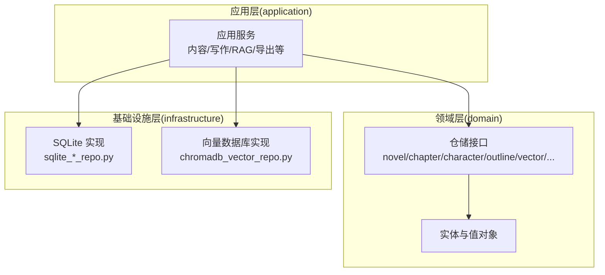
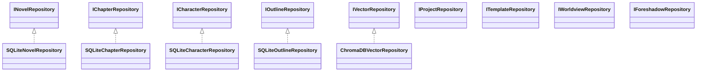
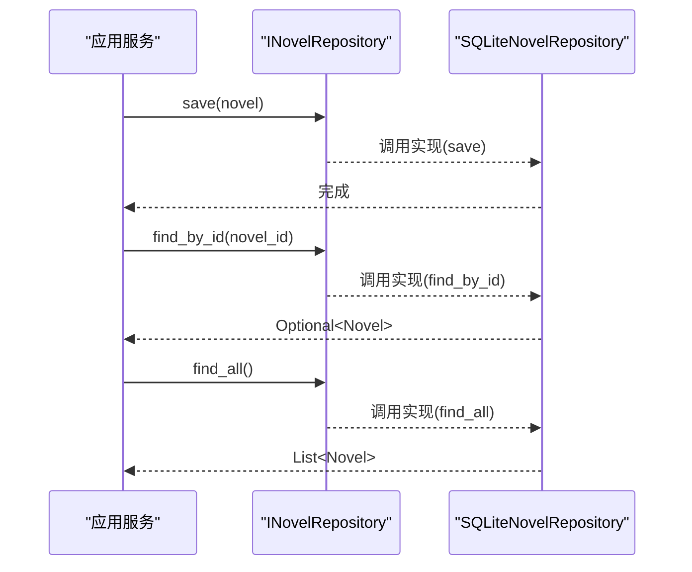
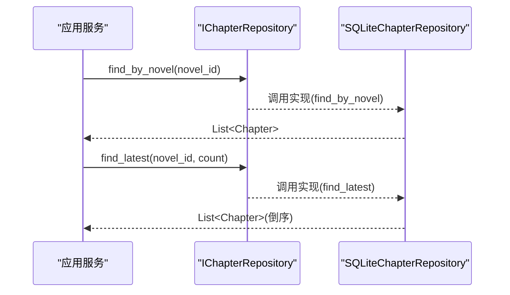
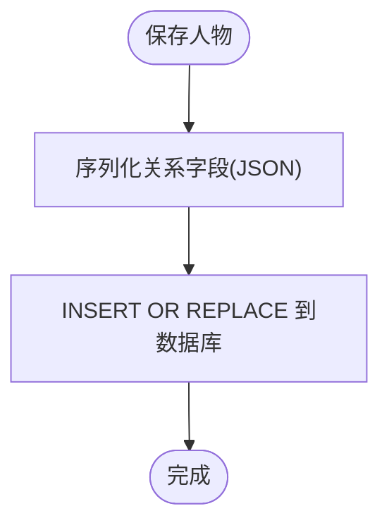
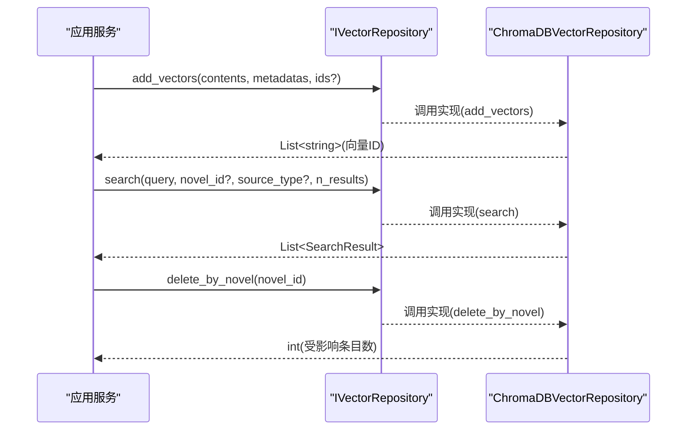
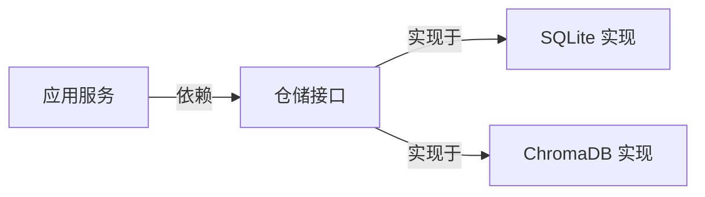

# 仓储接口模式

<cite>
**本文引用的文件**
- [domain/repositories/__init__.py](file://domain/repositories/__init__.py)
- [domain/repositories/novel_repository.py](file://domain/repositories/novel_repository.py)
- [domain/repositories/chapter_repository.py](file://domain/repositories/chapter_repository.py)
- [domain/repositories/character_repository.py](file://domain/repositories/character_repository.py)
- [domain/repositories/outline_repository.py](file://domain/repositories/outline_repository.py)
- [domain/repositories/vector_repository.py](file://domain/repositories/vector_repository.py)
- [domain/repositories/project_repository.py](file://domain/repositories/project_repository.py)
- [domain/repositories/template_repository.py](file://domain/repositories/template_repository.py)
- [domain/repositories/worldview_repository.py](file://domain/repositories/worldview_repository.py)
- [domain/repositories/foreshadow_repository.py](file://domain/repositories/foreshadow_repository.py)
- [infrastructure/persistence/sqlite_novel_repo.py](file://infrastructure/persistence/sqlite_novel_repo.py)
- [infrastructure/persistence/sqlite_chapter_repo.py](file://infrastructure/persistence/sqlite_chapter_repo.py)
- [infrastructure/persistence/sqlite_character_repo.py](file://infrastructure/persistence/sqlite_character_repo.py)
- [infrastructure/persistence/sqlite_outline_repo.py](file://infrastructure/persistence/sqlite_outline_repo.py)
- [infrastructure/persistence/chromadb_vector_repo.py](file://infrastructure/persistence/chromadb_vector_repo.py)
</cite>

## 目录
1. [引言](#引言)
2. [项目结构](#项目结构)
3. [核心组件](#核心组件)
4. [架构总览](#架构总览)
5. [详细组件分析](#详细组件分析)
6. [依赖分析](#依赖分析)
7. [性能考虑](#性能考虑)
8. [故障排查指南](#故障排查指南)
9. [结论](#结论)
10. [附录](#附录)

## 引言
本文件系统性阐述 InkTrace 项目的仓储接口模式，围绕 Clean Architecture 的分层思想，说明仓储接口如何在领域层与基础设施层之间建立稳定的抽象边界，确保业务逻辑不被持久化细节污染。文档覆盖小说、章节、人物、大纲、向量、项目、模板、世界观、伏笔等各类仓储接口的设计理念、方法签名、参数与返回值规范，并结合 SQLite 与 ChromaDB 的具体实现，给出依赖倒置、异步操作、事务管理与错误处理的实践建议。

## 项目结构
InkTrace 采用分层清晰的目录组织方式：
- domain 层：定义实体、值对象、领域服务与仓储接口，保持纯业务语义
- infrastructure 层：提供具体的数据访问实现（SQLite、ChromaDB 等）
- application 层：编排业务用例，注入所需仓储接口
- presentation 层：对外暴露 API/界面，通过依赖注入装配仓储实现

图表来源
- [domain/repositories/__init__.py:11-21](file://domain/repositories/__init__.py#L11-L21)
- [infrastructure/persistence/sqlite_novel_repo.py:20-33](file://infrastructure/persistence/sqlite_novel_repo.py#L20-L33)
- [infrastructure/persistence/chromadb_vector_repo.py:19-34](file://infrastructure/persistence/chromadb_vector_repo.py#L19-L34)

章节来源
- [domain/repositories/__init__.py:11-21](file://domain/repositories/__init__.py#L11-L21)

## 核心组件
本节对各仓储接口进行概览式解读，强调其职责边界与典型方法族。

- 小说仓储接口 INovelRepository
  - 职责：管理小说实体的增删改查与全量检索
  - 典型方法：save、find_by_id、find_all、delete
  - 返回值：Optional 实体或 List 集合
- 章节仓储接口 IChapterRepository
  - 职责：按 ID、所属小说检索章节；支持“最新 N 章节”查询
  - 典型方法：save、find_by_id、find_by_novel、find_latest、delete
- 人物仓储接口 ICharacterRepository
  - 职责：按 ID、所属小说检索人物；支持复杂关系字段的序列化存储
  - 典型方法：save、find_by_id、find_by_novel、delete
- 大纲仓储接口 IOutlineRepository
  - 职责：按 ID、所属小说检索大纲；支持剧情节点与分卷结构的持久化
  - 典型方法：save、find_by_id、find_by_novel、delete
- 向量仓储接口 IVectorRepository
  - 职责：向量索引的增删改查、语义检索、相似内容检索、按来源/小说批量清理
  - 典型方法：add_vectors、search、search_similar、get_by_id、delete、delete_by_source、delete_by_novel、count、update_vector
- 项目仓储接口 IProjectRepository
  - 职责：按 ID、小说 ID 检索项目；支持按状态统计与全量查询
  - 典型方法：find_by_id、find_by_novel_id、find_all、save、delete、count
- 模板仓储接口 ITemplateRepository
  - 职责：按 ID、题材检索模板；支持内置/自定义模板分类查询
  - 典型方法：find_by_id、find_by_genre、find_all、find_builtin、find_custom、save、delete
- 世界观仓储接口 IWorldviewRepository
  - 职责：按 ID/小说检索世界观；分别管理功法、势力、地点、物品子域的 CRUD
  - 典型方法：find_by_id、find_by_novel_id、save、delete；以及若干子域方法族
- 伏笔仓储接口 IForeshadowRepository
  - 职责：按 ID、小说、章节检索伏笔；支持状态变更与计数
  - 典型方法：find_by_id、find_by_novel、find_pending、find_by_chapter、save、delete、resolve、count

章节来源
- [domain/repositories/novel_repository.py:17-70](file://domain/repositories/novel_repository.py#L17-L70)
- [domain/repositories/chapter_repository.py:17-89](file://domain/repositories/chapter_repository.py#L17-L89)
- [domain/repositories/character_repository.py:17-73](file://domain/repositories/character_repository.py#L17-L73)
- [domain/repositories/outline_repository.py:17-73](file://domain/repositories/outline_repository.py#L17-L73)
- [domain/repositories/vector_repository.py:17-95](file://domain/repositories/vector_repository.py#L17-L95)
- [domain/repositories/project_repository.py:17-55](file://domain/repositories/project_repository.py#L17-L55)
- [domain/repositories/template_repository.py:17-62](file://domain/repositories/template_repository.py#L17-L62)
- [domain/repositories/worldview_repository.py:21-147](file://domain/repositories/worldview_repository.py#L21-L147)
- [domain/repositories/foreshadow_repository.py:17-67](file://domain/repositories/foreshadow_repository.py#L17-L67)

## 架构总览
仓储接口作为领域层与基础设施层之间的契约，遵循依赖倒置原则：上层仅依赖抽象，下层实现抽象。应用服务通过构造器或依赖注入获得仓储接口实例，从而屏蔽具体存储技术差异。

图表来源
- [domain/repositories/novel_repository.py:17-17](file://domain/repositories/novel_repository.py#L17-L17)
- [domain/repositories/chapter_repository.py:17-17](file://domain/repositories/chapter_repository.py#L17-L17)
- [domain/repositories/character_repository.py:17-17](file://domain/repositories/character_repository.py#L17-L17)
- [domain/repositories/outline_repository.py:17-17](file://domain/repositories/outline_repository.py#L17-L17)
- [domain/repositories/vector_repository.py:17-17](file://domain/repositories/vector_repository.py#L17-L17)
- [infrastructure/persistence/sqlite_novel_repo.py:20-20](file://infrastructure/persistence/sqlite_novel_repo.py#L20-L20)
- [infrastructure/persistence/sqlite_chapter_repo.py:19-19](file://infrastructure/persistence/sqlite_chapter_repo.py#L19-L19)
- [infrastructure/persistence/sqlite_character_repo.py:20-20](file://infrastructure/persistence/sqlite_character_repo.py#L20-L20)
- [infrastructure/persistence/sqlite_outline_repo.py:20-20](file://infrastructure/persistence/sqlite_outline_repo.py#L20-L20)
- [infrastructure/persistence/chromadb_vector_repo.py:19-19](file://infrastructure/persistence/chromadb_vector_repo.py#L19-L19)

## 详细组件分析

### 小说仓储接口与实现
- 接口要点
  - 方法族：save、find_by_id、find_all、delete
  - 返回值：Optional 实体或 List 集合
  - 参数：以领域类型（如 NovelId）封装标识，避免泄漏基础设施细节
- 实现要点
  - SQLite 实现负责建表、插入/替换、查询与删除
  - 使用 Row 工厂读取行并映射到实体
- 依赖关系
  - 应用服务依赖 INovelRepository 抽象
  - 运行时注入 SQLiteNovelRepository

图表来源
- [domain/repositories/novel_repository.py:21-30](file://domain/repositories/novel_repository.py#L21-L30)
- [infrastructure/persistence/sqlite_novel_repo.py:54-72](file://infrastructure/persistence/sqlite_novel_repo.py#L54-L72)
- [infrastructure/persistence/sqlite_novel_repo.py:74-97](file://infrastructure/persistence/sqlite_novel_repo.py#L74-L97)
- [infrastructure/persistence/sqlite_novel_repo.py:99-118](file://infrastructure/persistence/sqlite_novel_repo.py#L99-L118)

章节来源
- [domain/repositories/novel_repository.py:17-70](file://domain/repositories/novel_repository.py#L17-L70)
- [infrastructure/persistence/sqlite_novel_repo.py:20-126](file://infrastructure/persistence/sqlite_novel_repo.py#L20-L126)

### 章节仓储接口与实现
- 接口要点
  - 方法族：save、find_by_id、find_by_novel、find_latest、delete
  - find_latest 支持按章节数倒序返回最近 N 条
- 实现要点
  - 建立章节表并维护外键关系
  - 查询时按 number 或 number DESC 排序
  - 行到实体映射时注意枚举与时间字段转换

图表来源
- [domain/repositories/chapter_repository.py:48-60](file://domain/repositories/chapter_repository.py#L48-L60)
- [domain/repositories/chapter_repository.py:63-76](file://domain/repositories/chapter_repository.py#L63-L76)
- [infrastructure/persistence/sqlite_chapter_repo.py:93-102](file://infrastructure/persistence/sqlite_chapter_repo.py#L93-L102)
- [infrastructure/persistence/sqlite_chapter_repo.py:104-115](file://infrastructure/persistence/sqlite_chapter_repo.py#L104-L115)

章节来源
- [domain/repositories/chapter_repository.py:17-89](file://domain/repositories/chapter_repository.py#L17-L89)
- [infrastructure/persistence/sqlite_chapter_repo.py:19-137](file://infrastructure/persistence/sqlite_chapter_repo.py#L19-L137)

### 人物仓储接口与实现
- 接口要点
  - 方法族：save、find_by_id、find_by_novel、delete
  - 关系字段使用 JSON 存储，读取后反序列化为实体关系列表
- 实现要点
  - 建表时包含多字段，含 JSON 字段存储复杂关系
  - 映射时处理可选字段与默认值

图表来源
- [domain/repositories/character_repository.py:21-30](file://domain/repositories/character_repository.py#L21-L30)
- [infrastructure/persistence/sqlite_character_repo.py:62-85](file://infrastructure/persistence/sqlite_character_repo.py#L62-L85)

章节来源
- [domain/repositories/character_repository.py:17-73](file://domain/repositories/character_repository.py#L17-L73)
- [infrastructure/persistence/sqlite_character_repo.py:20-162](file://infrastructure/persistence/sqlite_character_repo.py#L20-L162)

### 大纲仓储接口与实现
- 接口要点
  - 方法族：save、find_by_id、find_by_novel、delete
  - 支持剧情节点与分卷结构的序列化存储
- 实现要点
  - 建表时包含 JSON 字段存储主/副线、分卷等结构化数据
  - 反序列化时恢复为 PlotNode 与 VolumeOutline 结构

章节来源
- [domain/repositories/outline_repository.py:17-73](file://domain/repositories/outline_repository.py#L17-L73)
- [infrastructure/persistence/sqlite_outline_repo.py:20-196](file://infrastructure/persistence/sqlite_outline_repo.py#L20-L196)

### 向量仓储接口与实现
- 接口要点
  - 方法族：add_vectors、search、search_similar、get_by_id、delete、delete_by_source、delete_by_novel、count、update_vector
  - 支持按 novel_id、source_type 过滤检索
- 实现要点
  - 延迟初始化 ChromaDB 客户端与集合
  - 使用嵌入函数生成向量，元数据包含 source_type/source_id/novel_id 等
  - 查询结果转换为 SearchResult 并计算相似度分数

图表来源
- [domain/repositories/vector_repository.py:21-41](file://domain/repositories/vector_repository.py#L21-L41)
- [domain/repositories/vector_repository.py:68-77](file://domain/repositories/vector_repository.py#L68-L77)
- [infrastructure/persistence/chromadb_vector_repo.py:74-95](file://infrastructure/persistence/chromadb_vector_repo.py#L74-L95)
- [infrastructure/persistence/chromadb_vector_repo.py:97-130](file://infrastructure/persistence/chromadb_vector_repo.py#L97-L130)
- [infrastructure/persistence/chromadb_vector_repo.py:188-196](file://infrastructure/persistence/chromadb_vector_repo.py#L188-L196)

章节来源
- [domain/repositories/vector_repository.py:17-95](file://domain/repositories/vector_repository.py#L17-L95)
- [infrastructure/persistence/chromadb_vector_repo.py:19-270](file://infrastructure/persistence/chromadb_vector_repo.py#L19-L270)

### 项目/模板/世界观/伏笔仓储
- 项目仓储 IProjectRepository：按 ID/小说 ID 查询、全量查询、保存、删除、计数
- 模板仓储 ITemplateRepository：按 ID/题材查询、全量查询、内置/自定义筛选、保存、删除
- 世界观仓储 IWorldviewRepository：按 ID/小说 ID 查询、保存、删除；并提供功法/势力/地点/物品的子域 CRUD
- 伏笔仓储 IForeshadowRepository：按 ID/小说/章节查询、待回收查询、保存、删除、标记回收、计数

章节来源
- [domain/repositories/project_repository.py:17-55](file://domain/repositories/project_repository.py#L17-L55)
- [domain/repositories/template_repository.py:17-62](file://domain/repositories/template_repository.py#L17-L62)
- [domain/repositories/worldview_repository.py:21-147](file://domain/repositories/worldview_repository.py#L21-L147)
- [domain/repositories/foreshadow_repository.py:17-67](file://domain/repositories/foreshadow_repository.py#L17-L67)

## 依赖分析
- 依赖倒置
  - 应用服务仅依赖 domain.repositories.* 接口，不直接依赖具体实现
  - 运行时通过构造器注入或依赖注入容器装配实现类
- 解耦效果
  - 领域层无需关心存储介质（SQLite/ChromaDB/其他）
  - 可替换实现而不影响业务逻辑
- 潜在循环依赖
  - 当前仓储接口与实现之间为单向依赖，无循环风险

图表来源
- [domain/repositories/novel_repository.py:17-17](file://domain/repositories/novel_repository.py#L17-L17)
- [infrastructure/persistence/sqlite_novel_repo.py:20-20](file://infrastructure/persistence/sqlite_novel_repo.py#L20-L20)
- [infrastructure/persistence/chromadb_vector_repo.py:19-19](file://infrastructure/persistence/chromadb_vector_repo.py#L19-L19)

章节来源
- [domain/repositories/__init__.py:11-21](file://domain/repositories/__init__.py#L11-L21)

## 性能考虑
- 向量检索
  - 合理设置 n_results，避免一次性返回过多结果
  - 使用 where 过滤条件缩小检索范围（novel_id、source_type）
- SQLite 查询
  - 对常用过滤字段（如 novel_id、number）建立索引可提升查询效率
  - 批量写入时尽量复用连接，减少事务开销
- 延迟初始化
  - 向量实现中对客户端、集合、嵌入函数采用延迟初始化，降低启动成本
- 内存与序列化
  - 大对象 JSON 序列化/反序列化需关注内存占用，必要时拆分字段或分页读取

## 故障排查指南
- 常见问题
  - 查询返回空：确认传入 ID 是否正确、实体是否已保存、数据库连接是否可用
  - 向量检索无结果：检查 novel_id/source_type 过滤条件是否匹配元数据
  - 保存失败：检查实体字段完整性、JSON 序列化是否异常
- 错误处理模式
  - 向量实现中对异常进行捕获并返回布尔/计数结果，保证调用方行为可预期
  - SQLite 实现中对数据库异常进行捕获，避免传播底层异常至应用层

章节来源
- [infrastructure/persistence/chromadb_vector_repo.py:163-169](file://infrastructure/persistence/chromadb_vector_repo.py#L163-L169)
- [infrastructure/persistence/chromadb_vector_repo.py:188-196](file://infrastructure/persistence/chromadb_vector_repo.py#L188-L196)
- [infrastructure/persistence/chromadb_vector_repo.py:207-222](file://infrastructure/persistence/chromadb_vector_repo.py#L207-L222)

## 结论
InkTrace 的仓储接口模式严格遵循 Clean Architecture 的依赖倒置原则，以抽象接口隔离领域与基础设施，使应用服务专注于业务编排。SQLite 与 ChromaDB 的实现展示了如何在不同存储介质间保持一致的接口契约。通过明确的方法签名、参数与返回值规范，以及稳健的错误处理与性能优化策略，该模式为项目的可维护性与扩展性提供了坚实基础。

## 附录
- 设计建议
  - 为每个实体提供对应的仓储接口与实现，保持职责单一
  - 在应用层统一通过仓储接口访问数据，避免跨层直接访问实现
  - 对高频查询建立索引，对大字段采用分页或懒加载策略
  - 对外部依赖（如向量库）采用超时与重试策略，增强鲁棒性