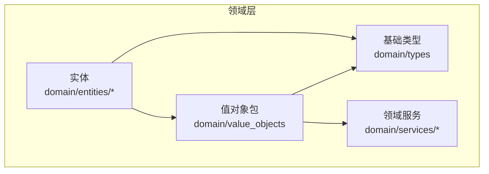
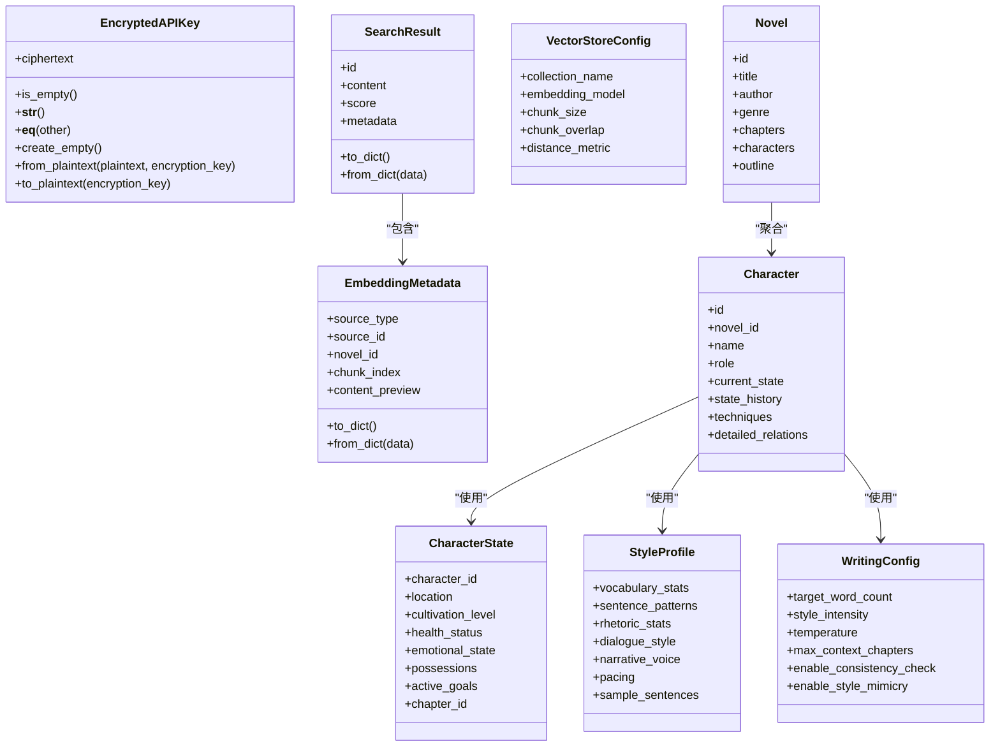
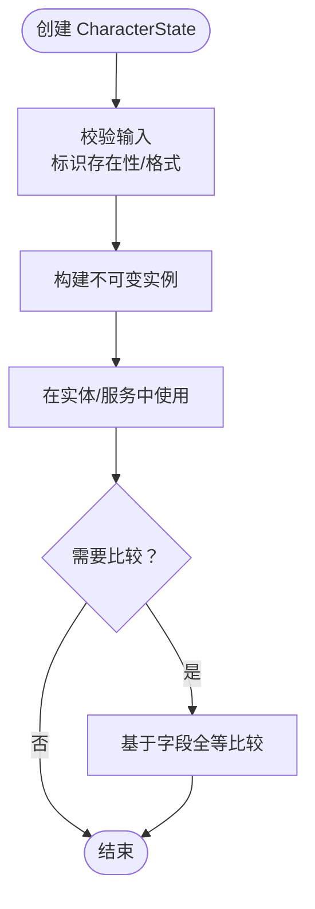
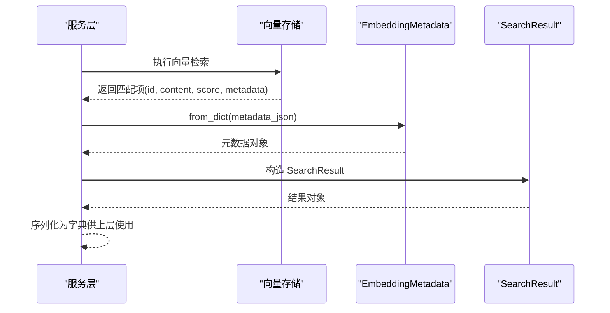
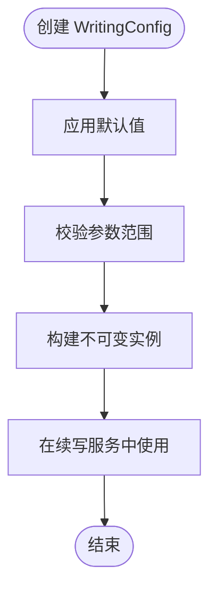
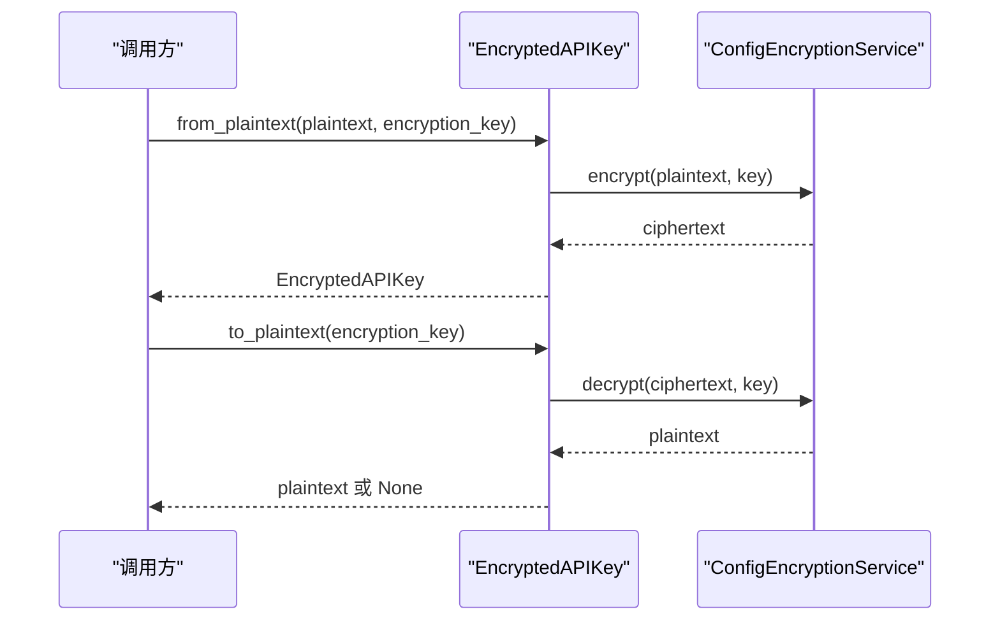
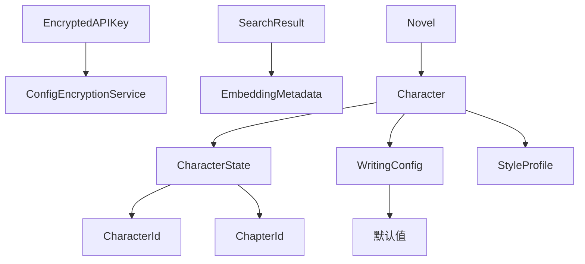

# 值对象设计

<cite>
**本文引用的文件**   
- [domain/value_objects/__init__.py](file://domain/value_objects/__init__.py)
- [domain/value_objects/character_state.py](file://domain/value_objects/character_state.py)
- [domain/value_objects/embedding.py](file://domain/value_objects/embedding.py)
- [domain/value_objects/style_profile.py](file://domain/value_objects/style_profile.py)
- [domain/value_objects/writing_config.py](file://domain/value_objects/writing_config.py)
- [domain/value_objects/encrypted_api_key.py](file://domain/value_objects/encrypted_api_key.py)
- [domain/types.py](file://domain/types.py)
- [domain/services/config_encryption_service.py](file://domain/services/config_encryption_service.py)
- [tests/unit/test_value_objects.py](file://tests/unit/test_value_objects.py)
- [domain/entities/character.py](file://domain/entities/character.py)
- [domain/entities/novel.py](file://domain/entities/novel.py)
</cite>

## 目录
1. [引言](#引言)
2. [项目结构](#项目结构)
3. [核心组件](#核心组件)
4. [架构概览](#架构概览)
5. [详细组件分析](#详细组件分析)
6. [依赖分析](#依赖分析)
7. [性能考虑](#性能考虑)
8. [故障排查指南](#故障排查指南)
9. [结论](#结论)
10. [附录](#附录)

## 引言
本设计文档聚焦 InkTrace 项目中的值对象设计与实践，系统阐述值对象的设计原则、不可变性、相等性比较、业务含义以及在实体中的组合使用方式。文档重点分析以下值对象：字符状态（CharacterState）、嵌入向量（Embedding）相关结构、风格配置（StyleProfile）、写作配置（WritingConfig）、加密 API 密钥（EncryptedAPIKey）。同时给出创建、验证与转换规则，并总结最佳实践与设计模式应用，帮助开发者在保持领域模型清晰的同时提升可维护性与安全性。

## 项目结构
值对象位于领域层的 value_objects 包中，采用 dataclass 的不可变形式组织，配合 domain/types 中的基础标识值对象（如 CharacterId、ChapterId 等）进行类型安全封装。加密 API 密钥值对象通过领域服务完成加解密操作，确保敏感信息的安全存储与传输。

**图表来源**
- [domain/value_objects/__init__.py:11-19](file://domain/value_objects/__init__.py#L11-L19)
- [domain/types.py:15-66](file://domain/types.py#L15-L66)

**章节来源**
- [domain/value_objects/__init__.py:11-19](file://domain/value_objects/__init__.py#L11-L19)
- [domain/types.py:15-66](file://domain/types.py#L15-L66)

## 核心组件
- 字符状态（CharacterState）：以不可变数据类表达人物在特定章节的状态快照，字段包括人物标识、位置、修炼境界、健康状况、情绪、持有物、目标等，体现强业务语义与不可变性。
- 风格配置（StyleProfile）：封装小说文风特征，包含词汇统计、句式模式、修辞统计、对话语气、叙述视角、节奏与示例句子等，便于风格一致性与模仿。
- 写作配置（WritingConfig）：表达续写过程中的参数集合，如目标字数、风格强度、温度、上下文章节数量、一致性检查与风格模仿开关等，默认值保证开箱即用。
- 加密 API 密钥（EncryptedAPIKey）：封装密文，提供空值检测、字符串表示、相等性比较、从明文创建、解密为明文等方法，依赖领域加密服务完成加解密。
- 嵌入向量（Embedding）相关：包含嵌入元数据（EmbeddingMetadata）、搜索结果（SearchResult）、向量存储配置（VectorStoreConfig），支持序列化/反序列化与默认配置。

上述值对象均通过 dataclass(frozen=True) 实现不可变性，字段类型明确，便于静态分析与 IDE 支持；部分值对象提供 to_dict/from_dict 方法，便于持久化与跨层传输。

**章节来源**
- [domain/value_objects/character_state.py:16-33](file://domain/value_objects/character_state.py#L16-L33)
- [domain/value_objects/style_profile.py:14-30](file://domain/value_objects/style_profile.py#L14-L30)
- [domain/value_objects/writing_config.py:13-28](file://domain/value_objects/writing_config.py#L13-L28)
- [domain/value_objects/encrypted_api_key.py:14-68](file://domain/value_objects/encrypted_api_key.py#L14-L68)
- [domain/value_objects/embedding.py:14-79](file://domain/value_objects/embedding.py#L14-L79)

## 架构概览
值对象在领域层承担“纯数据+行为”的职责，与实体（Entity）协作完成业务逻辑。实体持有值对象作为属性，利用其不可变特性保障状态一致性；对外通过 to_dict/from_dict 进行序列化与反序列化，确保跨层传递的稳定性。

**图表来源**
- [domain/value_objects/character_state.py:16-33](file://domain/value_objects/character_state.py#L16-L33)
- [domain/value_objects/style_profile.py:14-30](file://domain/value_objects/style_profile.py#L14-L30)
- [domain/value_objects/writing_config.py:13-28](file://domain/value_objects/writing_config.py#L13-L28)
- [domain/value_objects/encrypted_api_key.py:14-68](file://domain/value_objects/encrypted_api_key.py#L14-L68)
- [domain/value_objects/embedding.py:14-79](file://domain/value_objects/embedding.py#L14-L79)
- [domain/entities/character.py:64-273](file://domain/entities/character.py#L64-L273)
- [domain/entities/novel.py:20-178](file://domain/entities/novel.py#L20-L178)

## 详细组件分析

### 字符状态（CharacterState）
- 设计要点
  - 不可变性：通过 frozen=True 确保状态快照一旦创建便不可修改，避免并发与状态漂移问题。
  - 业务含义：刻画人物在某章节的完整状态，便于回溯、对比与一致性校验。
  - 类型安全：使用 CharacterId、ChapterId 等标识值对象，防止 ID 混用。
- 使用场景
  - 在人物实体中记录状态历史，或在续写引擎中作为上下文输入。
  - 与章节、大纲联动，支撑剧情推进与角色发展。
- 创建与验证
  - 通过构造函数传入各字段；建议在上层服务中进行业务规则校验（如存在性、范围约束）。
- 相等性与比较
  - 基于字段全等判断；由于不可变性，适合用作字典键或集合元素。
- 最佳实践
  - 仅承载必要字段，避免过度膨胀；必要时拆分为更细粒度的状态片段。

**图表来源**
- [domain/value_objects/character_state.py:16-33](file://domain/value_objects/character_state.py#L16-L33)
- [domain/types.py:52-66](file://domain/types.py#L52-L66)

**章节来源**
- [domain/value_objects/character_state.py:16-33](file://domain/value_objects/character_state.py#L16-L33)
- [domain/types.py:52-66](file://domain/types.py#L52-L66)
- [tests/unit/test_value_objects.py:53-88](file://tests/unit/test_value_objects.py#L53-L88)

### 嵌入向量（Embedding）相关
- 设计要点
  - EmbeddingMetadata：封装来源类型、来源ID、小说ID、分块索引与内容预览，提供 to_dict/from_dict 以便持久化与传输。
  - SearchResult：封装检索结果标识、内容、相似度分数与元数据，同样具备序列化能力。
  - VectorStoreConfig：封装向量库集合名、嵌入模型、分块大小与重叠、距离度量等配置项，提供默认值。
- 使用场景
  - RAG 检索与生成：以 SearchResult 作为检索输出，结合上下文进行续写。
  - 向量索引管理：通过 VectorStoreConfig 统一配置，便于迁移与调试。
- 创建与转换
  - from_dict 用于从持久化/网络层恢复对象；to_dict 用于序列化传输。
- 最佳实践
  - 元数据字段应与上游数据源保持一致；分块策略需平衡召回与性能。

**图表来源**
- [domain/value_objects/embedding.py:14-79](file://domain/value_objects/embedding.py#L14-L79)

**章节来源**
- [domain/value_objects/embedding.py:14-79](file://domain/value_objects/embedding.py#L14-L79)

### 风格配置（StyleProfile）
- 设计要点
  - 聚合文风统计与特征，便于风格一致性分析与模仿。
  - 不可变性确保风格配置在不同阶段的一致性。
- 使用场景
  - 续写引擎根据风格特征调整语言风格与节奏。
  - 与其他值对象（如 WritingConfig）组合，形成完整的写作策略。
- 创建与验证
  - 建议在上层服务中对统计分布与取值范围进行合理性校验。
- 最佳实践
  - 将样本句子与统计指标分开管理，便于展示与调试。

**章节来源**
- [domain/value_objects/style_profile.py:14-30](file://domain/value_objects/style_profile.py#L14-L30)
- [tests/unit/test_value_objects.py:18-51](file://tests/unit/test_value_objects.py#L18-L51)

### 写作配置（WritingConfig）
- 设计要点
  - 提供续写关键参数的统一入口，包含目标字数、风格强度、采样温度、上下文章节数、一致性检查与风格模仿开关等。
  - 默认值覆盖常见场景，降低调用门槛。
- 使用场景
  - 续写服务在生成过程中读取配置，动态调整生成策略。
- 创建与验证
  - 建议对数值范围（如温度、强度）进行边界校验；对章节数进行正整数校验。
- 最佳实践
  - 将配置与用户偏好、项目风格绑定，支持多套配置模板。

**图表来源**
- [domain/value_objects/writing_config.py:13-28](file://domain/value_objects/writing_config.py#L13-L28)
- [tests/unit/test_value_objects.py:90-133](file://tests/unit/test_value_objects.py#L90-L133)

**章节来源**
- [domain/value_objects/writing_config.py:13-28](file://domain/value_objects/writing_config.py#L13-L28)
- [tests/unit/test_value_objects.py:90-133](file://tests/unit/test_value_objects.py#L90-L133)

### 加密 API 密钥（EncryptedAPIKey）
- 设计要点
  - 封装密文，提供空值检测、字符串表示、相等性比较。
  - 工厂方法 from_plaintext 与 to_plaintext 依赖领域加密服务完成加解密。
- 安全性
  - 明文不落地，仅在内存中短暂存在；字符串表示隐藏真实内容，避免日志泄露。
- 使用场景
  - 存储与传输 LLM API 密钥等敏感信息；在运行时按需解密。
- 创建与转换
  - from_plaintext：从明文与加密密钥派生后加密，返回不可变密钥对象。
  - to_plaintext：使用相同密钥解密，异常时返回 None，调用方需处理错误。
- 最佳实践
  - 加密密钥由专门的密钥管理服务生成与轮换；避免硬编码；严格控制访问权限。

**图表来源**
- [domain/value_objects/encrypted_api_key.py:38-68](file://domain/value_objects/encrypted_api_key.py#L38-L68)
- [domain/services/config_encryption_service.py:20-111](file://domain/services/config_encryption_service.py#L20-L111)

**章节来源**
- [domain/value_objects/encrypted_api_key.py:14-68](file://domain/value_objects/encrypted_api_key.py#L14-L68)
- [domain/services/config_encryption_service.py:20-111](file://domain/services/config_encryption_service.py#L20-L111)

## 依赖分析
- 值对象与基础类型
  - CharacterState、WritingConfig 等使用 CharacterId、ChapterId 等标识值对象，确保 ID 层面的类型安全。
- 值对象与实体
  - 人物实体（Character）与小说聚合根（Novel）在属性中组合使用值对象，形成稳定的领域模型。
- 值对象与服务
  - EncryptedAPIKey 依赖 ConfigEncryptionService 完成加解密；EmbeddingMetadata/SearchResult 支持序列化以对接持久化与传输层。

**图表来源**
- [domain/value_objects/character_state.py:25-32](file://domain/value_objects/character_state.py#L25-L32)
- [domain/value_objects/writing_config.py:22-27](file://domain/value_objects/writing_config.py#L22-L27)
- [domain/value_objects/encrypted_api_key.py:44-67](file://domain/value_objects/encrypted_api_key.py#L44-L67)
- [domain/value_objects/embedding.py:44-68](file://domain/value_objects/embedding.py#L44-L68)
- [domain/entities/character.py:64-273](file://domain/entities/character.py#L64-L273)
- [domain/entities/novel.py:20-178](file://domain/entities/novel.py#L20-L178)

**章节来源**
- [domain/types.py:52-66](file://domain/types.py#L52-L66)
- [domain/entities/character.py:64-273](file://domain/entities/character.py#L64-L273)
- [domain/entities/novel.py:20-178](file://domain/entities/novel.py#L20-L178)

## 性能考虑
- 不可变性优势
  - 值对象不可变，天然线程安全，减少锁竞争；可安全缓存与复用，降低重复构造成本。
- 序列化开销
  - SearchResult/EmbeddingMetadata 提供 to_dict/from_dict，建议在批量处理时合并序列化批次，减少 JSON 编解码次数。
- 默认配置
  - WritingConfig 的默认值可减少参数传递复杂度，但需注意在极端场景下显式覆盖以避免偏差。
- 加密成本
  - 加密/解密为 CPU 密集操作，建议在高频调用场景下引入缓存与批量处理策略。

## 故障排查指南
- 不可变性导致的 AttributeError
  - 症状：尝试修改值对象字段抛出异常。
  - 排查：确认使用方式是否误以为可变对象；正确做法是复制并创建新实例。
  - 参考：单元测试对不可变性的断言。
- 相等性比较不符合预期
  - 症状：两个内容相同的值对象不相等。
  - 排查：确认使用的是不可变 dataclass 的默认相等性；若自定义比较逻辑需重写 __eq__。
- 加密/解密失败
  - 症状：to_plaintext 返回 None 或抛出异常。
  - 排查：检查密钥是否正确、密文是否被篡改、服务端环境变量与盐值是否一致。
- 序列化/反序列化异常
  - 症状：from_dict 抛出类型错误或缺失字段。
  - 排查：核对上游数据结构与版本兼容性；补充默认值处理。

**章节来源**
- [tests/unit/test_value_objects.py:38-51](file://tests/unit/test_value_objects.py#L38-L51)
- [tests/unit/test_value_objects.py:72-88](file://tests/unit/test_value_objects.py#L72-L88)
- [domain/value_objects/encrypted_api_key.py:57-68](file://domain/value_objects/encrypted_api_key.py#L57-L68)
- [domain/value_objects/embedding.py:32-40](file://domain/value_objects/embedding.py#L32-L40)

## 结论
InkTrace 的值对象设计遵循不可变性、类型安全与清晰业务语义的原则，有效提升了领域模型的稳定性与可维护性。通过与实体的组合使用、与服务层的协同，值对象在续写、检索与配置管理等关键流程中发挥重要作用。建议在后续迭代中持续完善默认配置与校验规则，强化密钥管理与序列化兼容性，以进一步提升系统的安全性与可靠性。

## 附录
- 值对象最佳实践清单
  - 优先使用 dataclass(frozen=True) 保证不可变性。
  - 明确字段类型与默认值，必要时提供工厂方法与校验逻辑。
  - 对敏感信息使用加密值对象，并限制明文暴露。
  - 提供 to_dict/from_dict 以适配持久化与传输层。
  - 在实体中组合使用值对象，避免将业务状态散落于多个可变字段。