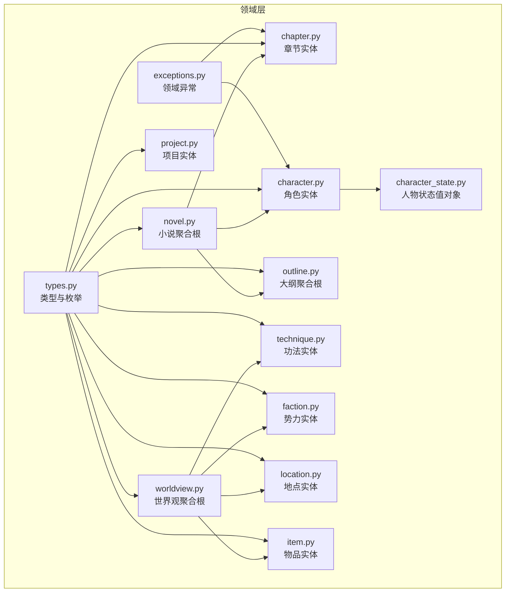
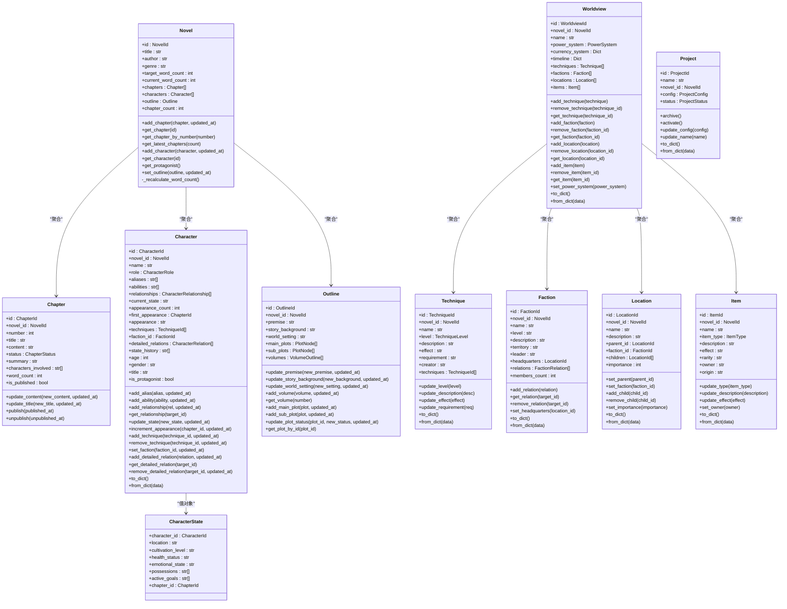
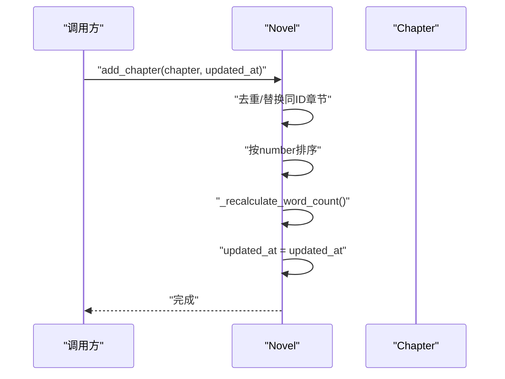
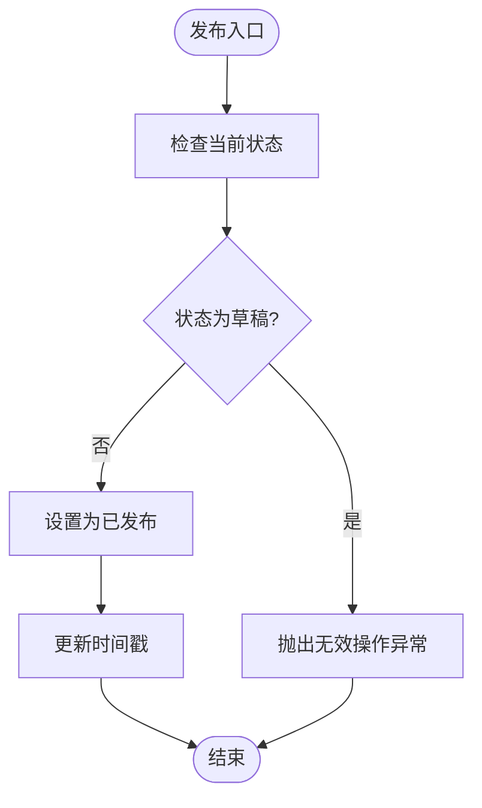
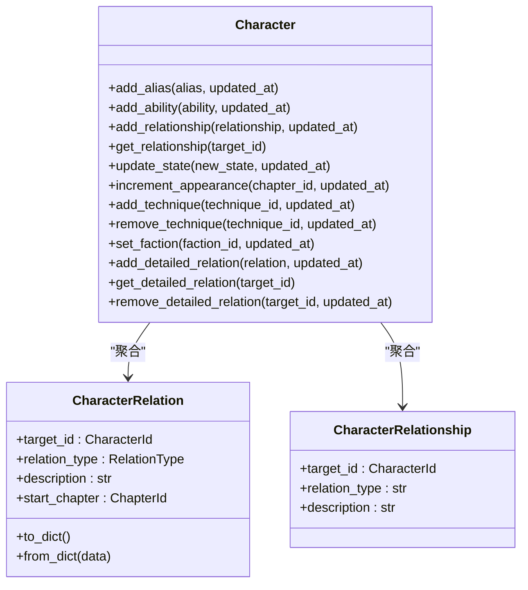
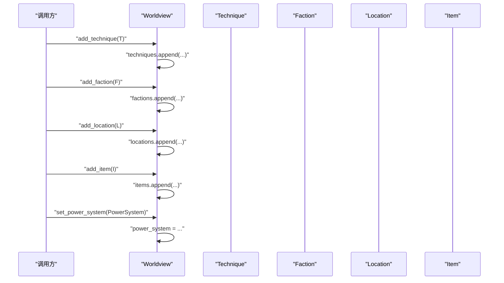
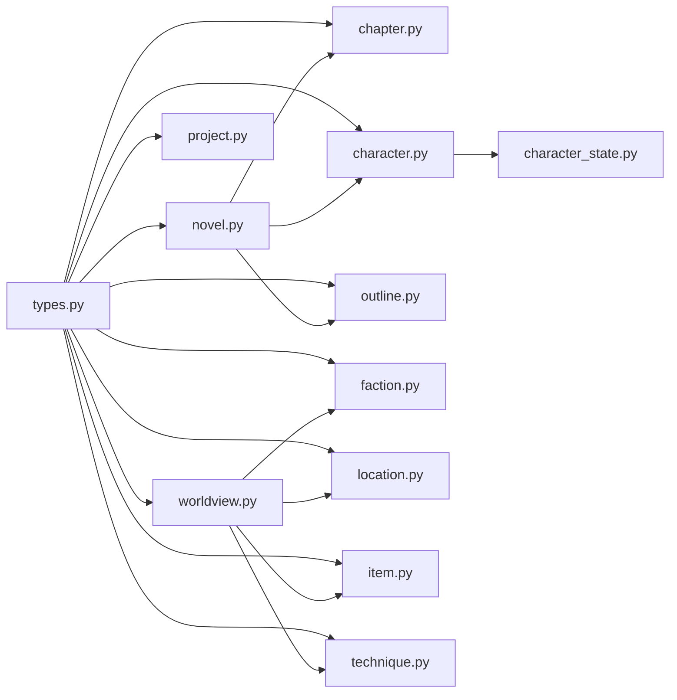

# 实体模型设计

<cite>
**本文引用的文件**   
- [domain/entities/novel.py](file://domain/entities/novel.py)
- [domain/entities/chapter.py](file://domain/entities/chapter.py)
- [domain/entities/character.py](file://domain/entities/character.py)
- [domain/entities/worldview.py](file://domain/entities/worldview.py)
- [domain/entities/outline.py](file://domain/entities/outline.py)
- [domain/entities/faction.py](file://domain/entities/faction.py)
- [domain/entities/location.py](file://domain/entities/location.py)
- [domain/entities/item.py](file://domain/entities/item.py)
- [domain/entities/technique.py](file://domain/entities/technique.py)
- [domain/entities/project.py](file://domain/entities/project.py)
- [domain/value_objects/character_state.py](file://domain/value_objects/character_state.py)
- [domain/tokens.py](file://domain/tokens.py)
- [domain/types.py](file://domain/types.py)
- [domain/exceptions.py](file://domain/exceptions.py)
- [tests/unit/test_novel.py](file://tests/unit/test_novel.py)
- [tests/unit/test_character.py](file://tests/unit/test_character.py)
- [tests/unit/test_worldview.py](file://tests/unit/test_worldview.py)
</cite>

## 目录
1. [引言](#引言)
2. [项目结构](#项目结构)
3. [核心组件](#核心组件)
4. [架构总览](#架构总览)
5. [详细组件分析](#详细组件分析)
6. [依赖分析](#依赖分析)
7. [性能考虑](#性能考虑)
8. [故障排查指南](#故障排查指南)
9. [结论](#结论)
10. [附录](#附录)

## 引言
本设计文档面向InkTrace项目的领域建模，系统性阐述实体模型的设计原则与实现细节。文档聚焦于小说(Novel)、章节(Chapter)、角色(Character)、世界观(Worldview)等核心实体，明确其属性、行为、业务规则与约束；解释聚合根、值对象的使用方式；梳理实体间关系映射与生命周期管理；给出类图与关系图，并提供验证规则、一致性检查与数据完整性保障策略，帮助开发者在领域层构建稳定、可演进的模型。

## 项目结构
InkTrace采用分层清晰的领域驱动设计组织，实体位于domain/entities目录，类型定义(domain/types.py)与值对象(domain/value_objects)分别承担标识符与不可变值对象职责。测试用例位于tests/unit，覆盖关键实体的行为与边界条件。

图表来源
- [domain/entities/novel.py:20-178](file://domain/entities/novel.py#L20-L178)
- [domain/entities/chapter.py:18-109](file://domain/entities/chapter.py#L18-L109)
- [domain/entities/character.py:64-273](file://domain/entities/character.py#L64-L273)
- [domain/entities/worldview.py:44-154](file://domain/entities/worldview.py#L44-L154)
- [domain/entities/outline.py:66-257](file://domain/entities/outline.py#L66-L257)
- [domain/entities/faction.py:40-113](file://domain/entities/faction.py#L40-L113)
- [domain/entities/location.py:18-82](file://domain/entities/location.py#L18-L82)
- [domain/entities/item.py:18-79](file://domain/entities/item.py#L18-L79)
- [domain/entities/technique.py:43-106](file://domain/entities/technique.py#L43-L106)
- [domain/entities/project.py:50-112](file://domain/entities/project.py#L50-L112)
- [domain/value_objects/character_state.py:16-33](file://domain/value_objects/character_state.py#L16-L33)
- [domain/types.py:15-284](file://domain/types.py#L15-L284)
- [domain/exceptions.py:11-100](file://domain/exceptions.py#L11-L100)

章节来源
- [domain/entities/novel.py:10-178](file://domain/entities/novel.py#L10-L178)
- [domain/entities/chapter.py:10-109](file://domain/entities/chapter.py#L10-L109)
- [domain/entities/character.py:10-273](file://domain/entities/character.py#L10-L273)
- [domain/entities/worldview.py:10-154](file://domain/entities/worldview.py#L10-L154)
- [domain/entities/outline.py:10-257](file://domain/entities/outline.py#L10-L257)
- [domain/entities/faction.py:10-113](file://domain/entities/faction.py#L10-L113)
- [domain/entities/location.py:11-82](file://domain/entities/location.py#L11-L82)
- [domain/entities/item.py:11-79](file://domain/entities/item.py#L11-L79)
- [domain/entities/technique.py:10-106](file://domain/entities/technique.py#L10-L106)
- [domain/entities/project.py:10-112](file://domain/entities/project.py#L10-L112)
- [domain/value_objects/character_state.py:10-33](file://domain/value_objects/character_state.py#L10-L33)
- [domain/types.py:10-284](file://domain/types.py#L10-L284)
- [domain/exceptions.py:10-100](file://domain/exceptions.py#L10-L100)

## 核心组件
本节对核心实体进行逐项解析，涵盖属性、行为、业务规则与约束。

- 小说(Novel)：聚合根，聚合章节、人物、大纲，维护字数统计与排序；提供章节与角色的增删改查、最新章节检索、大纲设置等。
- 章节(Chapter)：实体，包含编号、标题、内容、状态、关联小说ID；提供内容/标题更新、发布/取消发布、字数计算、发布态判断。
- 角色(Character)：实体，含角色类型、别名、能力、关系、状态历史、出场信息、功法、势力等；提供别名/能力/关系/状态/出场/功法/势力等管理方法。
- 世界观(Worldview)：聚合根，包含功法、势力、地点、物品集合与力量体系；提供增删查与更新、序列化/反序列化。
- 大纲(Outline)：聚合根，包含主线/支线剧情节点、分卷大纲；提供更新设定、添加/更新剧情节点、按卷检索等。
- 势力(Faction)：实体，含关系、总部、成员数等；提供关系增删查与总部设置。
- 地点(Location)：实体，支持父子层级、势力绑定、重要度、子节点管理。
- 物品(Item)：实体，含类型、效果、稀有度、归属等；提供类型/描述/效果/归属更新。
- 功法(Technique)：实体，含等级值对象、要求、传承链；提供等级/描述/效果/要求更新与序列化。
- 项目(Project)：实体，含配置值对象与状态；提供激活/归档、配置更新、名称校验等。
- 人物状态(CharacterState)：值对象，记录某时刻人物的状态快照。

章节来源
- [domain/entities/novel.py:20-178](file://domain/entities/novel.py#L20-L178)
- [domain/entities/chapter.py:18-109](file://domain/entities/chapter.py#L18-L109)
- [domain/entities/character.py:64-273](file://domain/entities/character.py#L64-L273)
- [domain/entities/worldview.py:44-154](file://domain/entities/worldview.py#L44-L154)
- [domain/entities/outline.py:66-257](file://domain/entities/outline.py#L66-L257)
- [domain/entities/faction.py:40-113](file://domain/entities/faction.py#L40-L113)
- [domain/entities/location.py:18-82](file://domain/entities/location.py#L18-L82)
- [domain/entities/item.py:18-79](file://domain/entities/item.py#L18-L79)
- [domain/entities/technique.py:43-106](file://domain/entities/technique.py#L43-L106)
- [domain/entities/project.py:50-112](file://domain/entities/project.py#L50-L112)
- [domain/value_objects/character_state.py:16-33](file://domain/value_objects/character_state.py#L16-L33)

## 架构总览
下图展示核心实体与值对象在领域层的交互关系，突出聚合根、实体与值对象的职责边界。

图表来源
- [domain/entities/novel.py:20-178](file://domain/entities/novel.py#L20-L178)
- [domain/entities/chapter.py:18-109](file://domain/entities/chapter.py#L18-L109)
- [domain/entities/character.py:64-273](file://domain/entities/character.py#L64-L273)
- [domain/entities/worldview.py:44-154](file://domain/entities/worldview.py#L44-L154)
- [domain/entities/outline.py:66-257](file://domain/entities/outline.py#L66-L257)
- [domain/entities/technique.py:43-106](file://domain/entities/technique.py#L43-L106)
- [domain/entities/faction.py:40-113](file://domain/entities/faction.py#L40-L113)
- [domain/entities/location.py:18-82](file://domain/entities/location.py#L18-L82)
- [domain/entities/item.py:18-79](file://domain/entities/item.py#L18-L79)
- [domain/entities/project.py:50-112](file://domain/entities/project.py#L50-L112)
- [domain/value_objects/character_state.py:16-33](file://domain/value_objects/character_state.py#L16-L33)

## 详细组件分析

### 小说聚合根(Novel)
- 职责：承载小说全量信息，协调章节、人物、大纲的生命周期；维护字数统计与章节排序。
- 关键行为：
  - 添加/替换章节并排序，触发字数重算与更新时间戳。
  - 按ID/编号检索章节；获取最新N章。
  - 添加/替换人物；按ID检索；获取主角。
  - 设置/替换大纲；更新时间戳。
- 业务规则：
  - 章节按number升序排列。
  - 字数统计基于章节内容长度累加。
  - 更新操作需传入updated_at以确保时间线一致。
- 约束与验证：
  - 通过调用方确保传入的实体ID类型匹配(如ChapterId)。
  - 测试覆盖了章节字数统计、最新章节排序、角色检索、大纲设置等场景。

图表来源
- [domain/entities/novel.py:46-62](file://domain/entities/novel.py#L46-L62)
- [domain/entities/novel.py:173-178](file://domain/entities/novel.py#L173-L178)

章节来源
- [domain/entities/novel.py:20-178](file://domain/entities/novel.py#L20-L178)
- [tests/unit/test_novel.py:51-161](file://tests/unit/test_novel.py#L51-L161)

### 章节实体(Chapter)
- 职责：表示单章内容与状态，提供内容/标题更新与发布控制。
- 关键行为：
  - 内容/标题更新，更新时间戳。
  - 发布/取消发布，带状态校验并抛出无效操作异常。
  - 字数计算（去除空白字符）。
  - 发布态判断。
- 业务规则：
  - 已发布状态下禁止再次发布；草稿状态下禁止取消发布。
- 约束与验证：
  - 使用领域异常InvalidOperationError处理非法状态转换。
  - 测试覆盖发布/取消发布、字数计算、发布态判断。

图表来源
- [domain/entities/chapter.py:76-91](file://domain/entities/chapter.py#L76-L91)
- [domain/exceptions.py:37-42](file://domain/exceptions.py#L37-L42)

章节来源
- [domain/entities/chapter.py:18-109](file://domain/entities/chapter.py#L18-L109)
- [domain/exceptions.py:11-100](file://domain/exceptions.py#L11-L100)
- [tests/unit/test_novel.py:306-341](file://tests/unit/test_novel.py#L306-L341)

### 角色实体(Character)
- 职责：刻画人物全貌，管理别名、能力、关系、状态、出场、功法、势力等。
- 关键行为：
  - 别名/能力去重添加；关系增删改查；状态变更历史记录；出场次数与首次出场管理；功法增删；势力设置；详细关系管理；序列化/反序列化。
  - 判断是否为主角。
- 业务规则：
  - current_state变更时追加到state_history。
  - 首次出场仅在第一次出现时记录。
  - detailed_relations按目标ID去重。
- 约束与验证：
  - 提供to_dict/from_dict用于持久化与传输。
  - 测试覆盖别名去重、能力添加、关系增删查、状态变更、出场次数与首次出场、主角判定。

图表来源
- [domain/entities/character.py:64-273](file://domain/entities/character.py#L64-L273)

章节来源
- [domain/entities/character.py:18-273](file://domain/entities/character.py#L18-L273)
- [tests/unit/test_character.py:29-224](file://tests/unit/test_character.py#L29-L224)

### 世界观聚合根(Worldview)
- 职责：承载并维护小说的宏观设定，包括功法、势力、地点、物品与力量体系。
- 关键行为：
  - 功法/势力/地点/物品的增删查；设置力量体系；序列化/反序列化。
- 业务规则：
  - 技能/关系等通过ID字符串进行检索与删除，注意ID一致性。
- 约束与验证：
  - to_dict/from_dict确保跨层传输一致性。
  - 测试覆盖功法等级比较、功法序列化、势力关系、地点层级、物品类型、力量体系序列化与一致性检查。

图表来源
- [domain/entities/worldview.py:62-121](file://domain/entities/worldview.py#L62-L121)

章节来源
- [domain/entities/worldview.py:21-154](file://domain/entities/worldview.py#L21-L154)
- [tests/unit/test_worldview.py:205-328](file://tests/unit/test_worldview.py#L205-L328)

### 大纲聚合根(Outline)
- 职责：管理核心设定、故事背景、世界设定与剧情节点，支持主线/支线与分卷管理。
- 关键行为：
  - 更新核心设定/背景/世界设定；添加分卷；添加/更新主线/支线剧情；按ID检索剧情。
- 业务规则：
  - 同一剧情节点ID若存在则替换，确保唯一性。
  - 分卷按number排序。
- 约束与验证：
  - 测试覆盖设定更新、分卷添加与排序、剧情节点增删与状态更新。

章节来源
- [domain/entities/outline.py:66-257](file://domain/entities/outline.py#L66-L257)
- [tests/unit/test_novel.py:254-277](file://tests/unit/test_novel.py#L254-L277)

### 势力实体(Faction)
- 职责：刻画组织形态，管理关系、总部、成员数等。
- 关键行为：
  - 关系增删查；设置总部；序列化/反序列化。
- 业务规则：
  - 关系按目标ID去重。
- 约束与验证：
  - 测试覆盖关系增删查与总部设置。

章节来源
- [domain/entities/faction.py:40-113](file://domain/entities/faction.py#L40-L113)
- [tests/unit/test_worldview.py:81-118](file://tests/unit/test_worldview.py#L81-L118)

### 地点实体(Location)
- 职责：刻画地理/组织空间，支持层级、势力绑定、重要度与子节点管理。
- 关键行为：
  - 设置父节点/势力；增删子节点；设置重要度；序列化/反序列化。
- 业务规则：
  - 子节点去重添加。
- 约束与验证：
  - 测试覆盖层级关系与重要度设置。

章节来源
- [domain/entities/location.py:18-82](file://domain/entities/location.py#L18-L82)
- [tests/unit/test_worldview.py:120-155](file://tests/unit/test_worldview.py#L120-L155)

### 物品实体(Item)
- 职责：刻画可拥有与流转的物品，管理类型、效果、稀有度、归属等。
- 关键行为：
  - 类型/描述/效果/归属更新；序列化/反序列化。
- 业务规则：
  - 无特殊约束，强调可扩展类型枚举。
- 约束与验证：
  - 测试覆盖类型、效果、稀有度与归属更新。

章节来源
- [domain/entities/item.py:18-79](file://domain/entities/item.py#L18-L79)
- [tests/unit/test_worldview.py:157-180](file://tests/unit/test_worldview.py#L157-L180)

### 功法实体(Technique)
- 职责：刻画修炼/战斗技能，支持等级值对象与传承链。
- 关键行为：
  - 等级/描述/效果/要求更新；序列化/反序列化。
- 业务规则：
  - 等级值对象支持比较运算，便于一致性检查。
- 约束与验证：
  - 测试覆盖等级比较、序列化与反序列化。

章节来源
- [domain/entities/technique.py:43-106](file://domain/entities/technique.py#L43-L106)
- [tests/unit/test_worldview.py:24-44](file://tests/unit/test_worldview.py#L24-L44)

### 项目实体(Project)
- 职责：承载写作项目的配置与状态，提供激活/归档与配置更新。
- 关键行为：
  - 激活/归档状态切换；配置更新；名称非空校验；序列化/反序列化。
- 业务规则：
  - 状态切换时避免重复操作。
- 约束与验证：
  - 测试覆盖状态切换与配置更新。

章节来源
- [domain/entities/project.py:50-112](file://domain/entities/project.py#L50-L112)

### 人物状态值对象(CharacterState)
- 职责：记录某时刻人物的状态快照，作为值对象不可变使用。
- 属性：人物ID、位置、修为、健康、情绪、物品、目标、所在章节ID。
- 使用场景：快照、回溯、一致性检查。

章节来源
- [domain/value_objects/character_state.py:16-33](file://domain/value_objects/character_state.py#L16-L33)

## 依赖分析
- 聚合根与实体：
  - Novel聚合根依赖Chapter、Character、Outline；Worldview聚合根依赖Technique、Faction、Location、Item。
- 值对象：
  - CharacterRelation、TechniqueLevel、PowerSystem、CharacterState等作为不可变值对象被实体使用。
- 类型与枚举：
  - 所有实体均使用统一的ID值对象与枚举类型，确保跨模块一致性。
- 异常：
  - 章节发布/取消发布使用InvalidOperationError，保证状态转换的显式错误语义。

图表来源
- [domain/types.py:15-284](file://domain/types.py#L15-L284)
- [domain/entities/novel.py:14-17](file://domain/entities/novel.py#L14-L17)
- [domain/entities/chapter.py:14-15](file://domain/entities/chapter.py#L14-L15)
- [domain/entities/character.py:14-15](file://domain/entities/character.py#L14-L15)
- [domain/entities/worldview.py:14-18](file://domain/entities/worldview.py#L14-L18)
- [domain/entities/outline.py:14-14](file://domain/entities/outline.py#L14-L14)
- [domain/entities/faction.py:14-14](file://domain/entities/faction.py#L14-L14)
- [domain/entities/location.py:15-15](file://domain/entities/location.py#L15-L15)
- [domain/entities/item.py:15-15](file://domain/entities/item.py#L15-L15)
- [domain/entities/technique.py:14-14](file://domain/entities/technique.py#L14-L14)
- [domain/entities/project.py:14-14](file://domain/entities/project.py#L14-L14)
- [domain/value_objects/character_state.py:13-13](file://domain/value_objects/character_state.py#L13-L13)

章节来源
- [domain/types.py:15-284](file://domain/types.py#L15-L284)
- [domain/entities/novel.py:14-17](file://domain/entities/novel.py#L14-L17)
- [domain/entities/worldview.py:14-18](file://domain/entities/worldview.py#L14-L18)

## 性能考虑
- 字数统计与排序：
  - Novel在添加章节后进行排序与字数重算，建议批量写入时合并更新以减少重复计算。
- 关系与集合操作：
  - Character与Faction的关系增删查使用线性遍历，建议在高并发/大数据量场景引入索引或更高效的数据结构。
- 序列化开销：
  - to_dict/from_dict用于跨层传输，建议在高频场景下缓存或延迟序列化。
- 状态机与异常：
  - 章节发布流程通过异常表达非法状态，避免隐式错误；建议在上层捕获并记录日志以便追踪。

## 故障排查指南
- 发布/取消发布失败：
  - 现象：调用发布/取消发布时报错。
  - 排查：确认当前状态与目标状态是否匹配；检查updated_at是否正确传入。
  - 参考：章节发布/取消发布的状态校验与异常抛出。
- 字数统计异常：
  - 现象：小说总字数与预期不符。
  - 排查：检查章节内容是否包含空白字符；确认章节排序与去重逻辑。
- 关系重复或缺失：
  - 现象：人物/势力关系重复或查询为空。
  - 排查：确认去重逻辑与ID一致性；检查序列化/反序列化过程。
- 一致性检查告警：
  - 现象：世界观一致性检查报告问题。
  - 排查：核对功法等级与力量体系层级；核对关系目标ID是否存在。

章节来源
- [domain/entities/chapter.py:76-109](file://domain/entities/chapter.py#L76-L109)
- [domain/exceptions.py:37-42](file://domain/exceptions.py#L37-L42)
- [tests/unit/test_novel.py:306-341](file://tests/unit/test_novel.py#L306-L341)
- [tests/unit/test_worldview.py:259-328](file://tests/unit/test_worldview.py#L259-L328)

## 结论
InkTrace的实体模型遵循DDD原则，以聚合根为核心，围绕小说、章节、角色、世界观等关键领域构建清晰的边界与协作关系。通过值对象与统一类型系统，确保模型的不可变性与一致性；通过严格的业务规则与异常机制，保障状态转换的正确性与可追溯性。建议在后续迭代中进一步优化集合操作性能、完善一致性检查与数据校验，持续提升模型的稳定性与可维护性。

## 附录
- 验证与测试：
  - 单元测试覆盖了核心实体的关键行为与边界条件，建议在新增功能时同步补充测试。
- 数据完整性：
  - 通过to_dict/from_dict与一致性检查服务，确保跨层传输与设定一致性的可靠性。

章节来源
- [tests/unit/test_novel.py:23-345](file://tests/unit/test_novel.py#L23-L345)
- [tests/unit/test_character.py:18-245](file://tests/unit/test_character.py#L18-L245)
- [tests/unit/test_worldview.py:10-332](file://tests/unit/test_worldview.py#L10-L332)